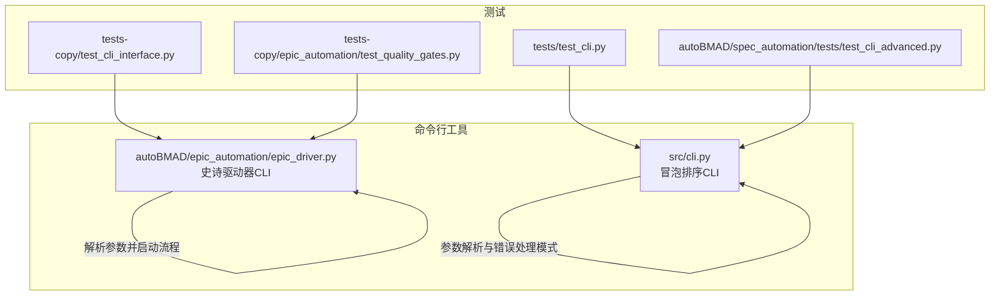
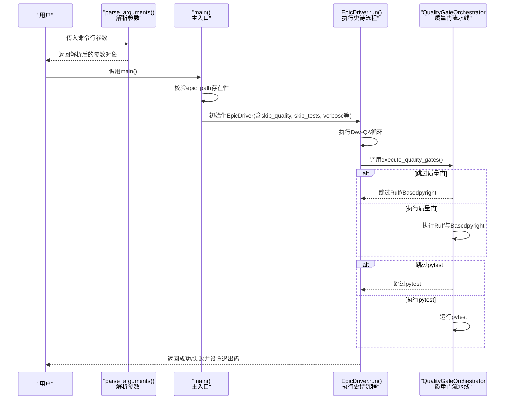
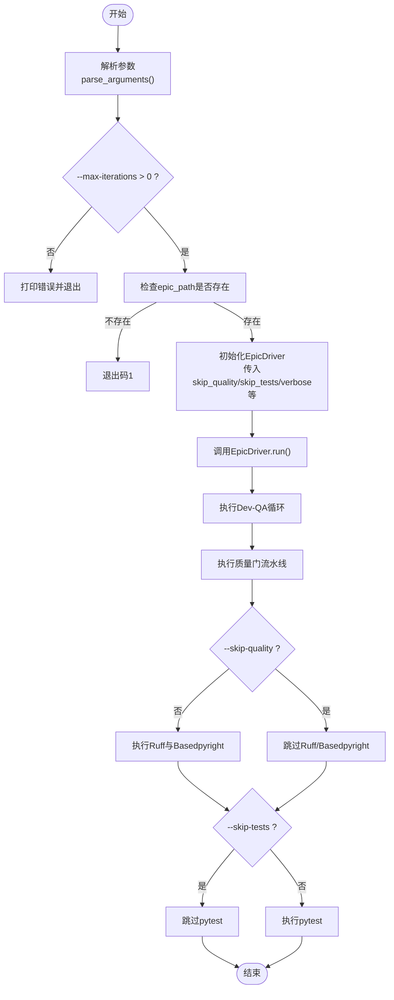
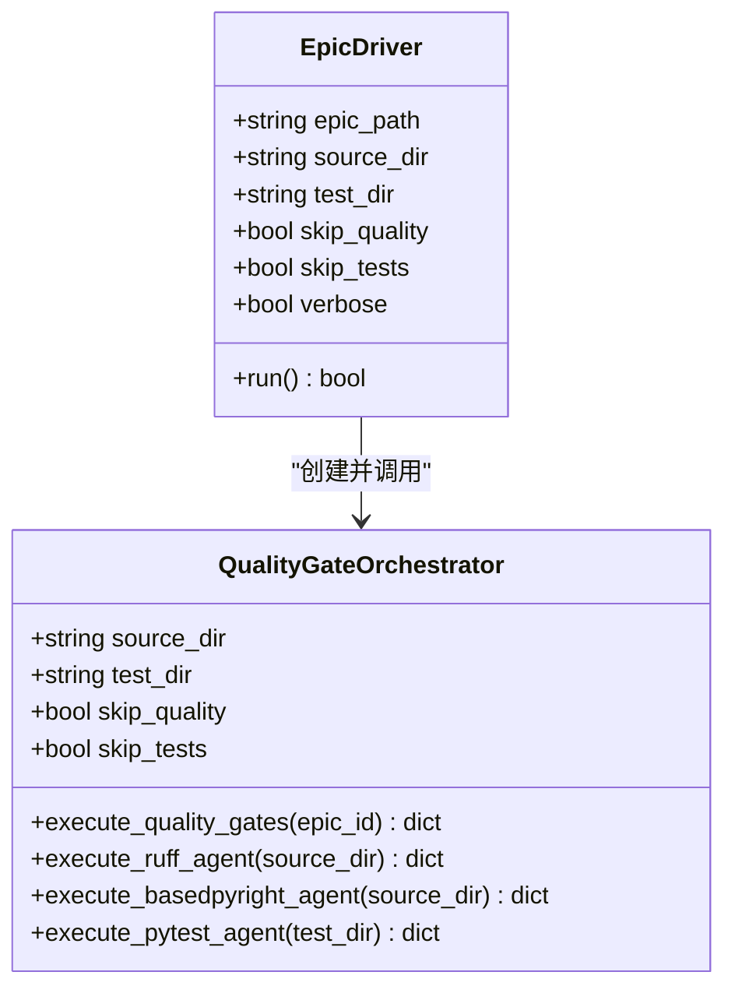
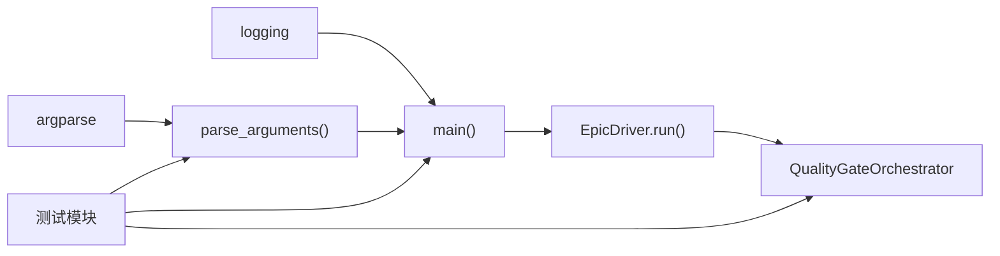

# CLI参考

<cite>
**本文引用的文件**
- [epic_driver.py](file://autoBMAD/epic_automation/epic_driver.py)
- [cli.py](file://src/cli.py)
- [test_cli_interface.py](file://tests-copy/test_cli_interface.py)
- [test_cli.py](file://tests/test_cli.py)
- [test_cli_advanced.py](file://autoBMAD/spec_automation/tests/test_cli_advanced.py)
- [test_quality_gates.py](file://tests-copy/epic_automation/test_quality_gates.py)
</cite>

## 目录
1. [简介](#简介)
2. [项目结构](#项目结构)
3. [核心组件](#核心组件)
4. [架构总览](#架构总览)
5. [详细组件分析](#详细组件分析)
6. [依赖关系分析](#依赖关系分析)
7. [性能与可用性考量](#性能与可用性考量)
8. [故障排查指南](#故障排查指南)
9. [结论](#结论)
10. [附录](#附录)

## 简介
本文件为命令行接口（CLI）的API参考，聚焦于史诗自动化驱动器的命令行参数与行为，重点覆盖以下参数：
- --skip-quality：跳过质量门（Ruff与BasedPyright检查）
- --skip-tests：跳过pytest执行
- --verbose：启用详细日志输出

同时说明参数的数据类型、默认值、作用范围与典型使用场景，并解释src/cli.py如何解析参数并调用核心功能。文档还包含错误处理策略与常见问题排查建议。

## 项目结构
与CLI相关的文件分布如下：
- autoBMAD/epic_automation/epic_driver.py：史诗驱动器主入口，定义并解析所有CLI参数，负责执行Dev-QA循环与质量门流程。
- src/cli.py：通用命令行工具（冒泡排序），演示参数解析与错误处理模式，便于理解epic_driver.py中的参数解析风格。
- tests-copy/test_cli_interface.py：测试epic_driver.py的CLI参数解析与默认值。
- tests/test_cli.py 与 autoBMAD/spec_automation/tests/test_cli_advanced.py：测试src/cli.py的参数解析、输入读取与错误处理。
- tests-copy/epic_automation/test_quality_gates.py：测试质量门相关CLI标志（--skip-quality、--skip-tests）的行为。

图表来源
- [epic_driver.py](file://autoBMAD/epic_automation/epic_driver.py#L2022-L2128)
- [cli.py](file://src/cli.py#L180-L247)
- [test_cli_interface.py](file://tests-copy/test_cli_interface.py#L1-L126)
- [test_cli.py](file://tests/test_cli.py#L1-L82)
- [test_cli_advanced.py](file://autoBMAD/spec_automation/tests/test_cli_advanced.py#L1-L76)
- [test_quality_gates.py](file://tests-copy/epic_automation/test_quality_gates.py#L1-L320)

章节来源
- [epic_driver.py](file://autoBMAD/epic_automation/epic_driver.py#L2022-L2128)
- [cli.py](file://src/cli.py#L180-L247)

## 核心组件
- epic_driver.py 的 parse_arguments：定义并解析所有CLI参数，含位置参数与可选参数；校验参数合法性（如--max-iterations必须为正整数）。
- epic_driver.py 的 main：根据解析结果初始化EpicDriver实例，执行史诗处理流程，并在异常情况下返回合适的退出码。
- QualityGateOrchestrator：在Dev-QA完成后执行质量门流水线，支持通过--skip-quality与--skip-tests控制各阶段是否执行。
- src/cli.py 的参数解析与错误处理：作为CLI参数解析与错误处理的参考实现，展示了互斥输入源、格式化输出、统计开关等模式。

章节来源
- [epic_driver.py](file://autoBMAD/epic_automation/epic_driver.py#L2022-L2128)
- [epic_driver.py](file://autoBMAD/epic_automation/epic_driver.py#L2130-L2172)
- [epic_driver.py](file://autoBMAD/epic_automation/epic_driver.py#L1955-L2021)
- [cli.py](file://src/cli.py#L180-L247)

## 架构总览
下图展示epic_driver.py的CLI参数解析与执行流程，以及质量门阶段的可选性控制。

图表来源
- [epic_driver.py](file://autoBMAD/epic_automation/epic_driver.py#L2022-L2128)
- [epic_driver.py](file://autoBMAD/epic_automation/epic_driver.py#L2130-L2172)
- [epic_driver.py](file://autoBMAD/epic_automation/epic_driver.py#L1955-L2021)

## 详细组件分析

### 参数定义与默认值
以下参数由 epic_driver.py 的 parse_arguments 定义，均来自命令行传入。默认值与类型以注释形式给出。

- epic_path（位置参数）
  - 类型：字符串
  - 必填：是
  - 说明：史诗Markdown文件路径
  - 默认值：无（必填）

- --max-iterations
  - 类型：整数
  - 默认值：3
  - 说明：失败故事的最大重试次数（必须为正整数）

- --retry-failed
  - 类型：布尔
  - 默认值：False
  - 说明：启用失败故事自动重试

- --verbose
  - 类型：布尔
  - 默认值：False
  - 说明：启用详细日志输出（影响日志级别）

- --concurrent
  - 类型：布尔
  - 默认值：False
  - 说明：并行处理故事（实验特性）

- --no-claude
  - 类型：布尔
  - 默认值：False
  - 说明：禁用Claude Code CLI集成（使用仿真模式）

- --source-dir
  - 类型：字符串
  - 默认值："src"
  - 说明：质量门检查的源代码目录

- --test-dir
  - 类型：字符串
  - 默认值："tests"
  - 说明：质量门检查的测试目录

- --skip-quality
  - 类型：布尔
  - 默认值：False
  - 说明：跳过Ruff与Basedpyright质量门检查

- --skip-tests
  - 类型：布尔
  - 默认值：False
  - 说明：跳过pytest执行

章节来源
- [epic_driver.py](file://autoBMAD/epic_automation/epic_driver.py#L2022-L2128)

### 参数解析与调用链
- 解析阶段：parse_arguments 使用argparse定义参数，校验--max-iterations必须为正整数，返回参数命名空间。
- 主入口：main 在解析后检查epic_path是否存在，随后根据参数初始化EpicDriver，并调用其run方法。
- 日志级别：当--verbose为真时，设置根日志器为DEBUG级别。
- 质量门：EpicDriver在Dev-QA完成后调用QualityGateOrchestrator.execute_quality_gates，内部根据skip_quality与skip_tests决定是否执行对应阶段。

图表来源
- [epic_driver.py](file://autoBMAD/epic_automation/epic_driver.py#L2022-L2128)
- [epic_driver.py](file://autoBMAD/epic_automation/epic_driver.py#L2130-L2172)
- [epic_driver.py](file://autoBMAD/epic_automation/epic_driver.py#L1955-L2021)

章节来源
- [epic_driver.py](file://autoBMAD/epic_automation/epic_driver.py#L2022-L2128)
- [epic_driver.py](file://autoBMAD/epic_automation/epic_driver.py#L2130-L2172)

### 质量门与参数交互
QualityGateOrchestrator在执行质量门流水线时会读取skip_quality与skip_tests：
- 若skip_quality为真，则跳过Ruff与Basedpyright检查，并记录相应日志。
- 若skip_tests为真，则跳过pytest执行，并记录相应日志。
- 质量门失败或异常不会阻断史诗流程，但会记录错误详情。

图表来源
- [epic_driver.py](file://autoBMAD/epic_automation/epic_driver.py#L1955-L2021)
- [epic_driver.py](file://autoBMAD/epic_automation/epic_driver.py#L1955-L2021)

章节来源
- [epic_driver.py](file://autoBMAD/epic_automation/epic_driver.py#L1955-L2021)

### 错误处理策略
- 参数校验：--max-iterations必须为正整数，否则抛出错误并终止。
- 文件存在性：main在初始化EpicDriver前检查epic_path是否存在，不存在则退出码1。
- 异常处理：main捕获KeyboardInterrupt（退出码130）、其他异常（退出码1），并在finally中进行清理。
- 质量门：失败或异常不阻断史诗流程，仅记录警告并继续。

章节来源
- [epic_driver.py](file://autoBMAD/epic_automation/epic_driver.py#L2022-L2128)
- [epic_driver.py](file://autoBMAD/epic_automation/epic_driver.py#L2130-L2172)
- [epic_driver.py](file://autoBMAD/epic_automation/epic_driver.py#L1955-L2021)

### 使用示例与场景
- 运行史诗处理（默认）
  - 示例：python -m autoBMAD.epic_automation.epic_driver docs/epics/my-epic.md
- 跳过质量门（Ruff与Basedpyright）
  - 示例：python -m autoBMAD.epic_automation.epic_driver docs/epics/my-epic.md --skip-quality
- 仅跳过pytest
  - 示例：python -m autoBMAD.epic_automation.epic_driver docs/epics/my-epic.md --skip-tests
- 同时跳过质量门与pytest
  - 示例：python -m autoBMAD.epic_automation.epic_driver docs/epics/my-epic.md --skip-quality --skip-tests
- 自定义源码与测试目录
  - 示例：python -m autoBMAD.epic_automation.epic_driver docs/epics/my-epic.md --source-dir src --test-dir tests
- 启用详细日志
  - 示例：python -m autoBMAD.epic_automation.epic_driver docs/epics/my-epic.md --verbose
- 增加最大迭代次数
  - 示例：python -m autoBMAD.epic_automation.epic_driver docs/epics/my-epic.md --max-iterations 5
- 其他常用组合
  - 示例：python epic_driver.py docs/epics/my-epic.md --retry-failed --verbose

章节来源
- [epic_driver.py](file://autoBMAD/epic_automation/epic_driver.py#L2028-L2056)

### 与src/cli.py的关系
src/cli.py展示了命令行参数解析与错误处理的通用模式，包括：
- 互斥输入源（位置数组、文件、交互模式、批处理模式）
- 输入数据解析与校验
- 输出格式化与统计开关
- 键盘中断与未预期异常的处理

这些模式与epic_driver.py的参数解析风格一致，便于理解epic_driver.py的参数体系与错误处理策略。

章节来源
- [cli.py](file://src/cli.py#L180-L247)

## 依赖关系分析
- epic_driver.py 依赖 argparse 进行参数解析，依赖 logging 控制日志级别。
- EpicDriver在运行时依赖QualityGateOrchestrator执行质量门。
- 测试模块覆盖了CLI参数解析、默认值、帮助信息、异常处理等关键路径。

图表来源
- [epic_driver.py](file://autoBMAD/epic_automation/epic_driver.py#L2022-L2128)
- [epic_driver.py](file://autoBMAD/epic_automation/epic_driver.py#L2130-L2172)
- [epic_driver.py](file://autoBMAD/epic_automation/epic_driver.py#L1955-L2021)
- [test_cli_interface.py](file://tests-copy/test_cli_interface.py#L1-L126)
- [test_cli.py](file://tests/test_cli.py#L1-L82)
- [test_cli_advanced.py](file://autoBMAD/spec_automation/tests/test_cli_advanced.py#L1-L76)
- [test_quality_gates.py](file://tests-copy/epic_automation/test_quality_gates.py#L1-L320)

章节来源
- [epic_driver.py](file://autoBMAD/epic_automation/epic_driver.py#L2022-L2128)
- [epic_driver.py](file://autoBMAD/epic_automation/epic_driver.py#L2130-L2172)
- [test_cli_interface.py](file://tests-copy/test_cli_interface.py#L1-L126)
- [test_cli.py](file://tests/test_cli.py#L1-L82)
- [test_cli_advanced.py](file://autoBMAD/spec_automation/tests/test_cli_advanced.py#L1-L76)
- [test_quality_gates.py](file://tests-copy/epic_automation/test_quality_gates.py#L1-L320)

## 性能与可用性考量
- 并行处理（--concurrent）为实验特性，谨慎使用。
- 跳过质量门（--skip-quality）与pytest（--skip-tests）可显著缩短执行时间，但会降低质量保障。
- 详细日志（--verbose）有助于诊断问题，但在高并发或长流程中可能增加I/O开销。
- 质量门失败不阻断史诗流程，适合快速迭代；若需严格质量门槛，请移除跳过标志。

## 故障排查指南
- 参数校验失败
  - 症状：提示“--max-iterations必须为正整数”
  - 处理：修正为大于0的整数
  - 参考：[epic_driver.py](file://autoBMAD/epic_automation/epic_driver.py#L2124-L2126)
- 缺少史诗文件
  - 症状：退出码1，提示“Epic文件不存在”
  - 处理：确认epic_path正确且文件存在
  - 参考：[epic_driver.py](file://autoBMAD/epic_automation/epic_driver.py#L2139-L2142)
- 质量门失败
  - 症状：质量门失败但流程继续
  - 处理：查看日志中的错误列表；必要时移除--skip-quality/--skip-tests
  - 参考：[epic_driver.py](file://autoBMAD/epic_automation/epic_driver.py#L1955-L2021)
- 键盘中断
  - 症状：退出码130
  - 处理：重新运行或检查长时间任务的超时设置
  - 参考：[epic_driver.py](file://autoBMAD/epic_automation/epic_driver.py#L2163-L2171)
- CLI参数解析测试
  - 参考测试用例验证默认值、帮助信息与异常分支
  - 参考：[test_cli_interface.py](file://tests-copy/test_cli_interface.py#L1-L126)
  - 参考：[test_quality_gates.py](file://tests-copy/epic_automation/test_quality_gates.py#L1-L320)

章节来源
- [epic_driver.py](file://autoBMAD/epic_automation/epic_driver.py#L2130-L2172)
- [epic_driver.py](file://autoBMAD/epic_automation/epic_driver.py#L1955-L2021)
- [test_cli_interface.py](file://tests-copy/test_cli_interface.py#L1-L126)
- [test_quality_gates.py](file://tests-copy/epic_automation/test_quality_gates.py#L1-L320)

## 结论
epic_driver.py提供了完整的CLI参数体系，支持灵活的质量门控制与日志级别调节。--skip-quality与--skip-tests可用于加速迭代，但建议在正式发布前关闭跳过标志以保证质量。--verbose可辅助定位问题。整体错误处理策略明确，异常与中断均有清晰的退出码与日志记录。

## 附录

### 参数一览表
- epic_path（位置参数）
  - 类型：字符串
  - 必填：是
  - 说明：史诗Markdown文件路径

- --max-iterations
  - 类型：整数
  - 默认值：3
  - 说明：失败故事的最大重试次数（必须为正整数）

- --retry-failed
  - 类型：布尔
  - 默认值：False
  - 说明：启用失败故事自动重试

- --verbose
  - 类型：布尔
  - 默认值：False
  - 说明：启用详细日志输出

- --concurrent
  - 类型：布尔
  - 默认值：False
  - 说明：并行处理故事（实验特性）

- --no-claude
  - 类型：布尔
  - 默认值：False
  - 说明：禁用Claude Code CLI集成

- --source-dir
  - 类型：字符串
  - 默认值："src"
  - 说明：质量门检查的源代码目录

- --test-dir
  - 类型：字符串
  - 默认值："tests"
  - 说明：质量门检查的测试目录

- --skip-quality
  - 类型：布尔
  - 默认值：False
  - 说明：跳过Ruff与Basedpyright质量门检查

- --skip-tests
  - 类型：布尔
  - 默认值：False
  - 说明：跳过pytest执行

章节来源
- [epic_driver.py](file://autoBMAD/epic_automation/epic_driver.py#L2022-L2128)