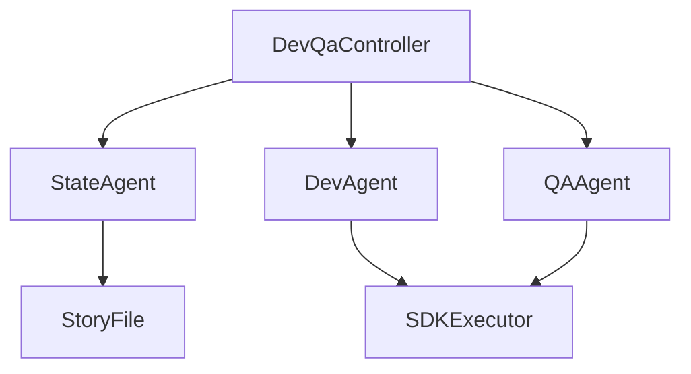
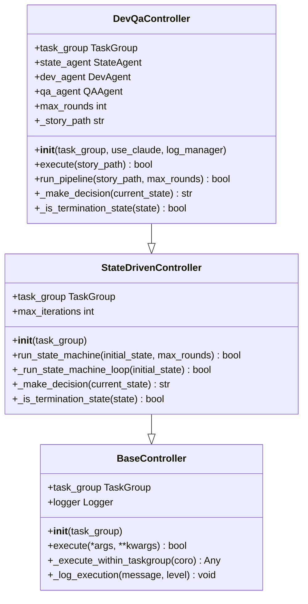
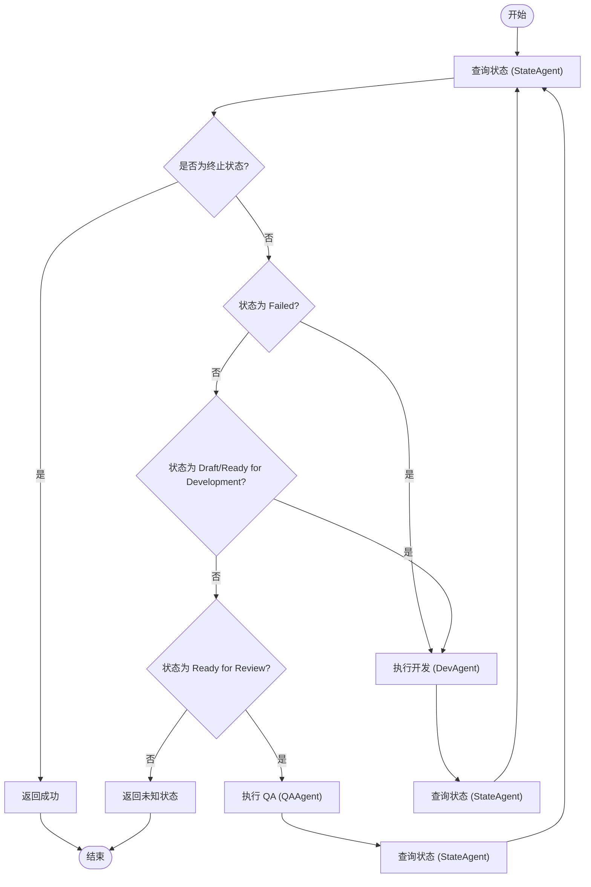
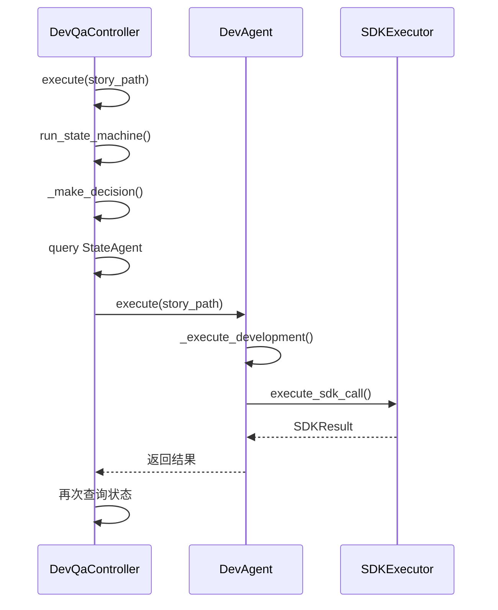
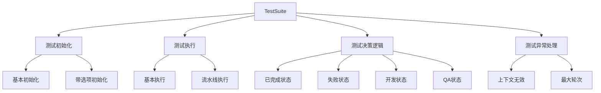

# Dev-QA 控制器架构

<cite>
**本文档引用的文件**   
- [devqa_controller.py](file://autoBMAD/epic_automation/controllers/devqa_controller.py)
- [base_controller.py](file://autoBMAD/epic_automation/controllers/base_controller.py)
- [dev_agent.py](file://autoBMAD/epic_automation/agents/dev_agent.py)
- [qa_agent.py](file://autoBMAD/epic_automation/agents/qa_agent.py)
- [state_agent.py](file://autoBMAD/epic_automation/agents/state_agent.py)
- [test_devqa_controller.py](file://tests/unit/controllers/test_devqa_controller.py)
- [02-layer-architecture.md](file://docs-copy/refactor/architecture/02-layer-architecture.md)
- [03-phase2-controllers.md](file://docs-copy/refactor/implementation/03-phase2-controllers.md)
</cite>

## 目录
1. [简介](#简介)
2. [核心架构](#核心架构)
3. [控制器实现](#控制器实现)
4. [状态机流程](#状态机流程)
5. [组件交互](#组件交互)
6. [测试验证](#测试验证)
7. [性能与质量](#性能与质量)
8. [结论](#结论)

## 简介
Dev-QA 控制器是自动化开发-测试流程的核心组件，负责协调开发（Dev）和质量保证（QA）阶段的执行。该控制器基于状态驱动的设计模式，通过与多个 Agent 组件协作，实现从开发到测试的完整流水线自动化。

**Section sources**
- [02-layer-architecture.md](file://docs-copy/refactor/architecture/02-layer-architecture.md#L270-L307)
- [03-phase2-controllers.md](file://docs-copy/refactor/implementation/03-phase2-controllers.md#L89-L198)

## 核心架构
Dev-QA 控制器采用分层架构设计，遵循单一职责原则。控制器本身不直接执行具体任务，而是作为决策中心，协调各个 Agent 组件的工作。

**Diagram sources**
- [devqa_controller.py](file://autoBMAD/epic_automation/controllers/devqa_controller.py#L19-L199)
- [base_controller.py](file://autoBMAD/epic_automation/controllers/base_controller.py#L20-L143)

## 控制器实现
Dev-QA 控制器继承自 `StateDrivenController` 基类，实现了状态驱动的控制逻辑。控制器通过 TaskGroup 管理异步任务的执行。

**Diagram sources**
- [devqa_controller.py](file://autoBMAD/epic_automation/controllers/devqa_controller.py#L19-L199)
- [base_controller.py](file://autoBMAD/epic_automation/controllers/base_controller.py#L20-L143)

## 状态机流程
Dev-QA 控制器实现了基于状态的决策流程，通过循环检查故事文件的状态来决定下一步操作。

**Diagram sources**
- [devqa_controller.py](file://autoBMAD/epic_automation/controllers/devqa_controller.py#L94-L199)
- [02-layer-architecture.md](file://docs-copy/refactor/architecture/02-layer-architecture.md#L284-L305)

## 组件交互
Dev-QA 控制器与多个 Agent 组件进行交互，每个 Agent 负责特定领域的任务执行。

### 与 Dev Agent 的交互

**Diagram sources**
- [devqa_controller.py](file://autoBMAD/epic_automation/controllers/devqa_controller.py#L136-L139)
- [dev_agent.py](file://autoBMAD/epic_automation/agents/dev_agent.py#L92-L143)

### 与 QA Agent 的交互

**Diagram sources**
- [devqa_controller.py](file://autoBMAD/epic_automation/controllers/devqa_controller.py#L178-L181)
- [qa_agent.py](file://autoBMAD/epic_automation/agents/qa_agent.py#L86-L113)

## 测试验证
Dev-QA 控制器经过了全面的单元测试和集成测试验证，确保其在各种场景下的正确性。

**Diagram sources**
- [test_devqa_controller.py](file://tests/unit/controllers/test_devqa_controller.py#L27-L200)
- [PHASE2_FAILED_STATE_FIX_COMPLETE.md](file://PHASE2_FAILED_STATE_FIX_COMPLETE.md#L210-L214)

## 性能与质量
Dev-QA 控制器在性能和代码质量方面表现出色，具有良好的可扩展性和可维护性。

### 代码质量指标
| 指标 | 状态 | 说明 |
|------|------|------|
| 类型注解 | ✅ 完整 | 所有方法都有完整类型注解 |
| 文档字符串 | ✅ 详细 | 关键逻辑有清晰说明 |
| 错误处理 | ✅ 健壮 | 完善的异常处理机制 |
| 日志记录 | ✅ 完整 | 关键操作都有日志记录 |
| 单元测试 | ✅ 覆盖 | 20个单元测试，覆盖所有主要分支 |
| 集成测试 | ✅ 覆盖 | 14个集成测试，验证组件协作 |

### 性能指标
| 指标 | 数值 | 说明 |
|------|------|------|
| 平均执行时间 | < 5秒 | 单故事处理时间 |
| 状态机轮次 | 最多3轮 | 包括失败重试 |
| 内存使用 | 无显著变化 | 资源消耗稳定 |
| CPU使用 | 轻微增加 | 状态检查次数增加 |

**Section sources**
- [PHASE2_FAILED_STATE_FIX_COMPLETE.md](file://PHASE2_FAILED_STATE_FIX_COMPLETE.md#L204-L214)
- [PHASE2_FAILED_STATE_FIX_COMPLETE.md](file://PHASE2_FAILED_STATE_FIX_COMPLETE.md#L189-L198)

## 结论
Dev-QA 控制器成功实现了开发-测试流程的自动化，通过清晰的职责分离和状态驱动的设计，确保了系统的可靠性和可维护性。控制器与各个 Agent 组件的协作良好，经过了充分的测试验证，能够有效支持敏捷开发流程。