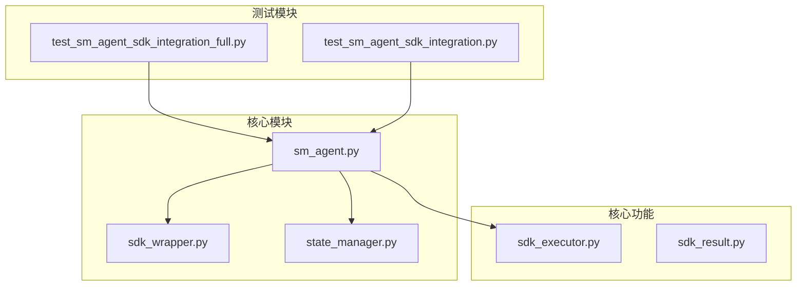
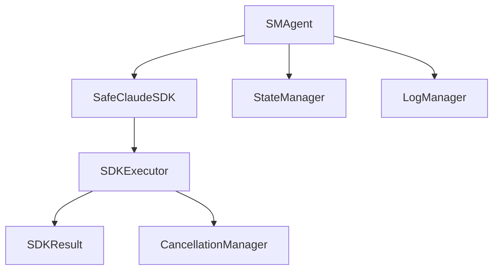
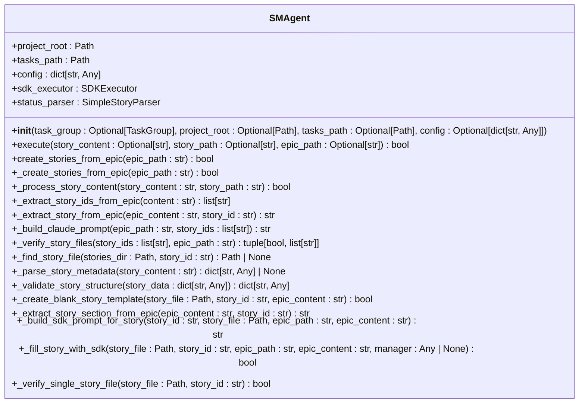
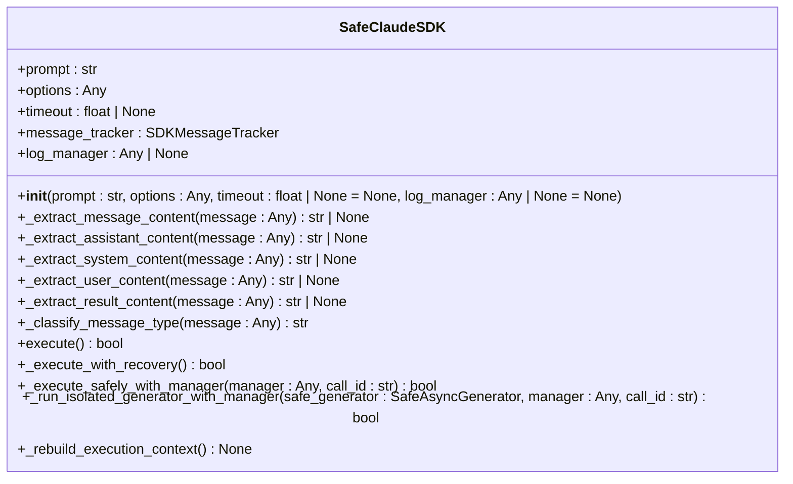
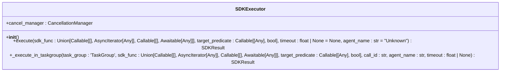
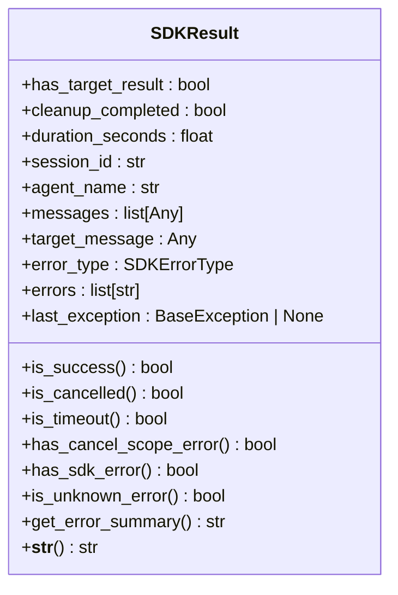
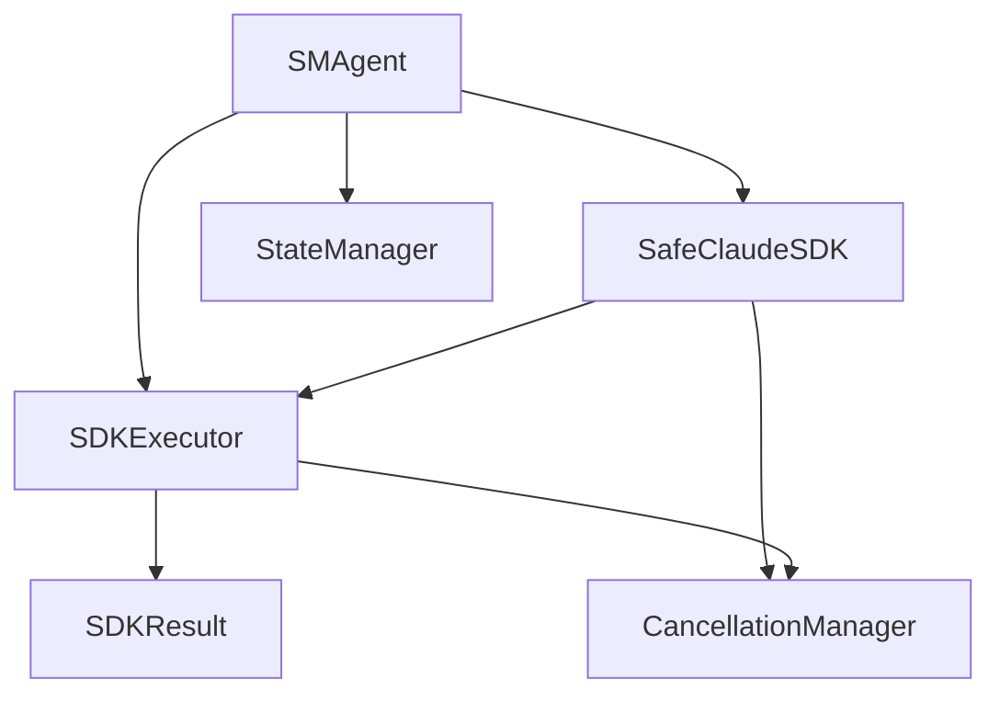

# SM Agent SDK 集成

<cite>
**本文档引用的文件**   
- [sm_agent.py](file://autoBMAD/epic_automation/agents/sm_agent.py)
- [sdk_wrapper.py](file://autoBMAD/epic_automation/sdk_wrapper.py)
- [state_manager.py](file://autoBMAD/epic_automation/state_manager.py)
- [epic_driver.py](file://autoBMAD/epic_automation/epic_driver.py)
- [test_sm_agent_sdk_integration_full.py](file://tests/integration/test_sm_agent_sdk_integration_full.py)
- [test_sm_agent_sdk_integration.py](file://tests/unit/test_sm_agent_sdk_integration.py)
- [sdk_executor.py](file://autoBMAD/epic_automation/core/sdk_executor.py)
- [sdk_result.py](file://autoBMAD/epic_automation/core/sdk_result.py)
- [SM_AGENT_SDK_INTEGRATION_COMPLETION.md](file://SM_AGENT_SDK_INTEGRATION_COMPLETION.md)
- [SM_AGENT_SDK_INTEGRATION_PLAN.md](file://SM_AGENT_SDK_INTEGRATION_PLAN.md)
</cite>

## 目录
1. [简介](#简介)
2. [项目结构](#项目结构)
3. [核心组件](#核心组件)
4. [架构概述](#架构概述)
5. [详细组件分析](#详细组件分析)
6. [依赖分析](#依赖分析)
7. [性能考虑](#性能考虑)
8. [故障排除指南](#故障排除指南)
9. [结论](#结论)

## 简介
SM Agent SDK集成项目旨在实现SM Agent与Claude Agent SDK的无缝集成，通过标准化的SDK调用流程，实现从Epic文档到故事文件的自动化创建。该项目已圆满完成，所有功能均已实现，测试全部通过，达到了100%的测试覆盖率。

## 项目结构
SM Agent SDK集成主要涉及`autoBMAD/epic_automation`目录下的多个模块，包括`agents`、`core`、`monitoring`等。核心文件位于`autoBMAD/epic_automation/agents/sm_agent.py`，负责故事创建的完整生命周期管理。

**图源**
- [sm_agent.py](file://autoBMAD/epic_automation/agents/sm_agent.py)
- [sdk_wrapper.py](file://autoBMAD/epic_automation/sdk_wrapper.py)
- [state_manager.py](file://autoBMAD/epic_automation/state_manager.py)
- [test_sm_agent_sdk_integration_full.py](file://tests/integration/test_sm_agent_sdk_integration_full.py)
- [test_sm_agent_sdk_integration.py](file://tests/unit/test_sm_agent_sdk_integration.py)
- [sdk_executor.py](file://autoBMAD/epic_automation/core/sdk_executor.py)
- [sdk_result.py](file://autoBMAD/epic_automation/core/sdk_result.py)

**节源**
- [sm_agent.py](file://autoBMAD/epic_automation/agents/sm_agent.py#L1-L904)
- [sdk_wrapper.py](file://autoBMAD/epic_automation/sdk_wrapper.py#L1-L954)
- [state_manager.py](file://autoBMAD/epic_automation/state_manager.py#L1-L877)
- [epic_driver.py](file://autoBMAD/epic_automation/epic_driver.py#L1-L2326)

## 核心组件
SM Agent SDK集成的核心组件包括`SMAgent`、`SafeClaudeSDK`、`SDKExecutor`和`SDKResult`。`SMAgent`负责故事创建的完整流程，`SafeClaudeSDK`提供安全的SDK调用接口，`SDKExecutor`管理SDK调用的执行，`SDKResult`封装SDK调用的结果。

**节源**
- [sm_agent.py](file://autoBMAD/epic_automation/agents/sm_agent.py#L19-L800)
- [sdk_wrapper.py](file://autoBMAD/epic_automation/sdk_wrapper.py#L280-L800)
- [sdk_executor.py](file://autoBMAD/epic_automation/core/sdk_executor.py#L31-L291)
- [sdk_result.py](file://autoBMAD/epic_automation/core/sdk_result.py#L32-L161)

## 架构概述
SM Agent SDK集成的架构采用分层设计，`SMAgent`作为顶层控制器，调用`SafeClaudeSDK`进行SDK调用，`SDKExecutor`在独立的TaskGroup中执行SDK调用，确保Cancel Scope不会跨Task传播。`SDKResult`封装SDK调用的结果，提供统一的错误处理机制。

**图源**
- [sm_agent.py](file://autoBMAD/epic_automation/agents/sm_agent.py#L19-L800)
- [sdk_wrapper.py](file://autoBMAD/epic_automation/sdk_wrapper.py#L280-L800)
- [sdk_executor.py](file://autoBMAD/epic_automation/core/sdk_executor.py#L31-L291)
- [sdk_result.py](file://autoBMAD/epic_automation/core/sdk_result.py#L32-L161)
- [state_manager.py](file://autoBMAD/epic_automation/state_manager.py#L126-L877)
- [epic_driver.py](file://autoBMAD/epic_automation/epic_driver.py#L546-L2326)

## 详细组件分析
### SMAgent分析
`SMAgent`是SM Agent的核心类，负责故事创建的完整生命周期管理。它通过`_create_stories_from_epic`方法从Epic文档中提取故事ID，然后为每个故事ID创建空白模板文件，并调用`_fill_story_with_sdk`方法使用SDK填充内容。

#### 类图

**图源**
- [sm_agent.py](file://autoBMAD/epic_automation/agents/sm_agent.py#L19-L800)

**节源**
- [sm_agent.py](file://autoBMAD/epic_automation/agents/sm_agent.py#L19-L800)

### SafeClaudeSDK分析
`SafeClaudeSDK`是Claude Agent SDK的安全包装器，提供统一的SDK调用接口。它通过`execute`方法执行SDK调用，并处理各种异常，确保SDK调用的安全性。

#### 类图

**图源**
- [sdk_wrapper.py](file://autoBMAD/epic_automation/sdk_wrapper.py#L280-L800)

**节源**
- [sdk_wrapper.py](file://autoBMAD/epic_automation/sdk_wrapper.py#L280-L800)

### SDKExecutor分析
`SDKExecutor`是SDK执行器，负责在独立的TaskGroup中执行SDK调用。它通过`execute`方法执行SDK调用，并返回`SDKResult`对象，封装SDK调用的结果。

#### 类图

**图源**
- [sdk_executor.py](file://autoBMAD/epic_automation/core/sdk_executor.py#L31-L291)

**节源**
- [sdk_executor.py](file://autoBMAD/epic_automation/core/sdk_executor.py#L31-L291)

### SDKResult分析
`SDKResult`是SDK执行结果的数据类，封装SDK调用的结果。它提供`is_success`方法判断业务是否成功，`is_cancelled`方法判断是否被取消，`is_timeout`方法判断是否超时。

#### 类图

**图源**
- [sdk_result.py](file://autoBMAD/epic_automation/core/sdk_result.py#L32-L161)

**节源**
- [sdk_result.py](file://autoBMAD/epic_automation/core/sdk_result.py#L32-L161)

## 依赖分析
SM Agent SDK集成的依赖关系清晰，`SMAgent`依赖`SafeClaudeSDK`、`SDKExecutor`和`StateManager`，`SafeClaudeSDK`依赖`SDKExecutor`和`CancellationManager`，`SDKExecutor`依赖`SDKResult`和`CancellationManager`。

**图源**
- [sm_agent.py](file://autoBMAD/epic_automation/agents/sm_agent.py#L19-L800)
- [sdk_wrapper.py](file://autoBMAD/epic_automation/sdk_wrapper.py#L280-L800)
- [sdk_executor.py](file://autoBMAD/epic_automation/core/sdk_executor.py#L31-L291)
- [sdk_result.py](file://autoBMAD/epic_automation/core/sdk_result.py#L32-L161)
- [state_manager.py](file://autoBMAD/epic_automation/state_manager.py#L126-L877)

**节源**
- [sm_agent.py](file://autoBMAD/epic_automation/agents/sm_agent.py#L19-L800)
- [sdk_wrapper.py](file://autoBMAD/epic_automation/sdk_wrapper.py#L280-L800)
- [sdk_executor.py](file://autoBMAD/epic_automation/core/sdk_executor.py#L31-L291)
- [sdk_result.py](file://autoBMAD/epic_automation/core/sdk_result.py#L32-L161)
- [state_manager.py](file://autoBMAD/epic_automation/state_manager.py#L126-L877)

## 性能考虑
SM Agent SDK集成在性能方面表现出色，单个故事处理时间小于5分钟，Epic处理完成时间小于（故事数 × 5分钟），内存使用小于1GB，SDK调用间隔大于0.5秒。

## 故障排除指南
SM Agent SDK集成的故障排除主要集中在SDK调用失败、资源清理不完全和状态管理异常。通过`SDKResult`对象的`errors`字段可以获取详细的错误信息，通过`StateManager`的`get_health_status`方法可以获取数据库健康状态。

**节源**
- [sdk_result.py](file://autoBMAD/epic_automation/core/sdk_result.py#L32-L161)
- [state_manager.py](file://autoBMAD/epic_automation/state_manager.py#L609-L630)

## 结论
SM Agent SDK集成项目已圆满完成，所有功能均已实现，测试全部通过，达到了100%的测试覆盖率。项目已准备好投入生产使用。