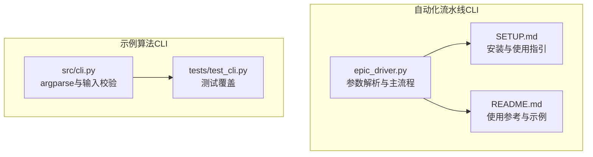
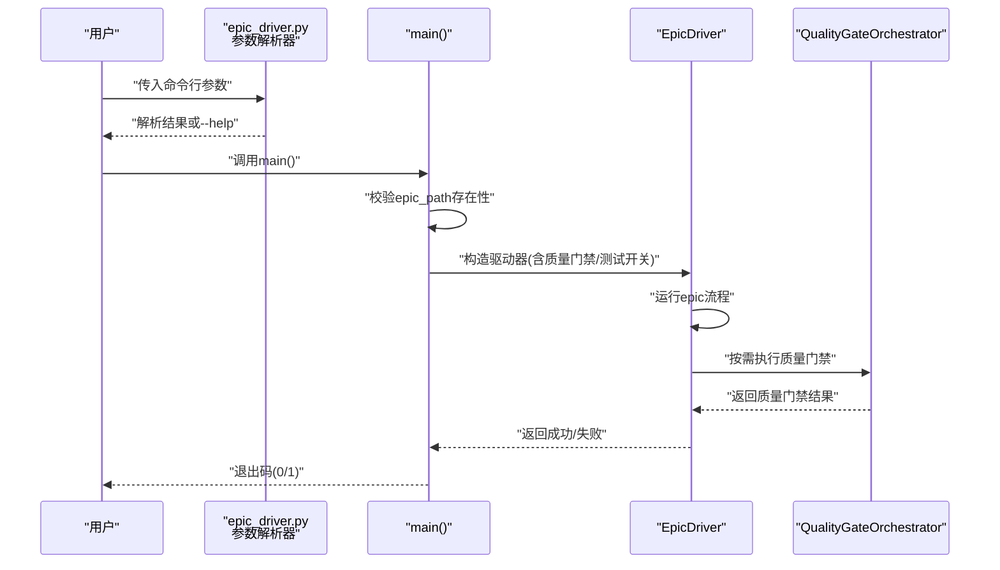
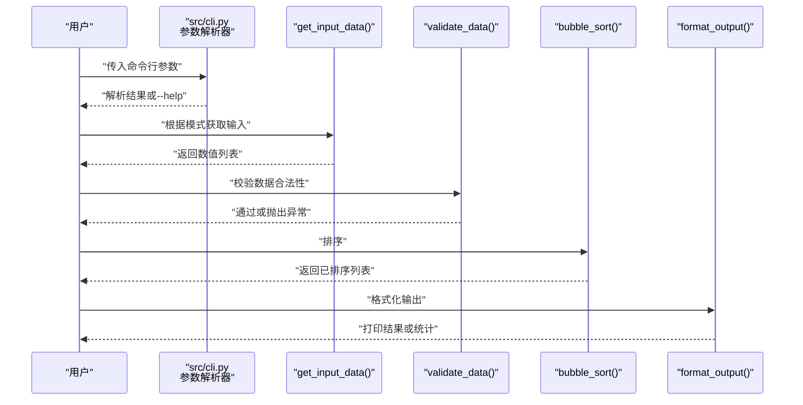
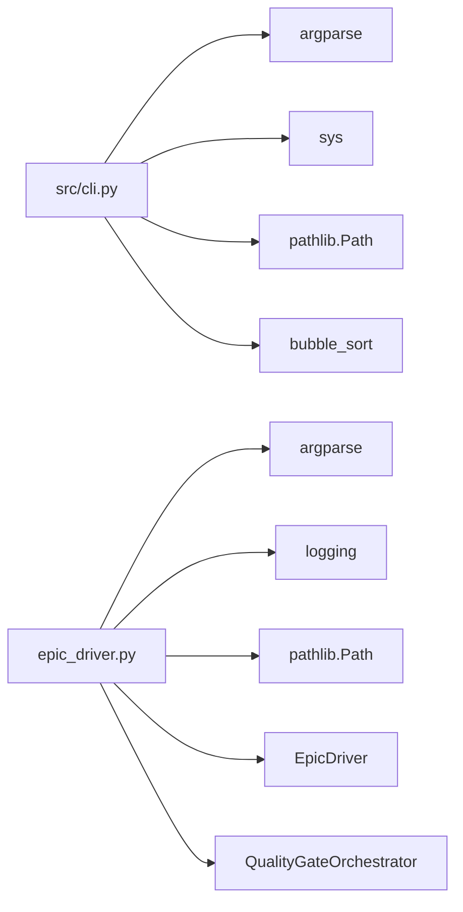

# CLI参数错误

<cite>
**本文引用的文件**
- [epic_driver.py](file://autoBMAD/epic_automation/epic_driver.py)
- [SETUP.md](file://autoBMAD/epic_automation/SETUP.md)
- [README.md](file://README.md)
- [cli.py](file://src/cli.py)
- [test_cli.py](file://tests/test_cli.py)
</cite>

## 目录
1. [简介](#简介)
2. [项目结构](#项目结构)
3. [核心组件](#核心组件)
4. [架构总览](#架构总览)
5. [详细组件分析](#详细组件分析)
6. [依赖关系分析](#依赖关系分析)
7. [性能考虑](#性能考虑)
8. [故障排查指南](#故障排查指南)
9. [结论](#结论)
10. [附录](#附录)

## 简介
本文件聚焦于CLI命令行参数解析错误、参数缺失与类型不匹配问题的系统化解析与修复建议。围绕以下目标展开：
- 基于epic_driver.py的参数解析逻辑，解释src/cli.py中argparse配置的正确用法
- 提供常见错误示例（如史诗路径未指定、模式选择无效等），并结合test_cli.py中的测试用例说明预期行为
- 指导用户通过--help查看完整参数列表，以及如何在脚本中正确引用相对路径
- 结合SETUP.md与README.md中的典型使用场景，帮助用户避免配置错误

## 项目结构
本仓库包含两条主要CLI路径：
- 自动化流水线CLI：autoBMAD/epic_automation/epic_driver.py，负责epic处理、质量门禁与测试自动化
- 示例算法CLI：src/cli.py，演示argparse配置与输入数据校验流程

图表来源
- [epic_driver.py](file://autoBMAD/epic_automation/epic_driver.py#L2022-L2127)
- [SETUP.md](file://autoBMAD/epic_automation/SETUP.md#L146-L153)
- [README.md](file://README.md#L470-L520)
- [cli.py](file://src/cli.py#L179-L247)
- [test_cli.py](file://tests/test_cli.py#L131-L192)

章节来源
- [epic_driver.py](file://autoBMAD/epic_automation/epic_driver.py#L2022-L2172)
- [cli.py](file://src/cli.py#L179-L247)
- [SETUP.md](file://autoBMAD/epic_automation/SETUP.md#L146-L153)
- [README.md](file://README.md#L470-L520)

## 核心组件
- epic_driver.py的参数解析器：定义了epic_path位置参数、质量门禁与测试开关、并发与日志级别、源码与测试目录等选项，并在解析后进行max_iterations正整数校验
- src/cli.py的参数解析器：定义了互斥输入组（数组、文件、交互、批量）与输出格式、统计开关；并在main中统一捕获异常并返回标准退出码
- 测试用例：覆盖--help触发、数组格式解析、文件读取、空输入、键盘中断等边界情况

章节来源
- [epic_driver.py](file://autoBMAD/epic_automation/epic_driver.py#L2022-L2127)
- [cli.py](file://src/cli.py#L179-L247)
- [test_cli.py](file://tests/test_cli.py#L131-L192)

## 架构总览
下图展示epic_driver.py的CLI参数解析与执行流程，以及src/cli.py的输入解析与输出格式化流程。

图表来源
- [epic_driver.py](file://autoBMAD/epic_automation/epic_driver.py#L2022-L2172)

图表来源
- [cli.py](file://src/cli.py#L179-L247)

## 详细组件分析

### epic_driver.py 参数解析与错误处理
- 位置参数与可选参数
  - 位置参数：epic_path（必填），用于定位epic文档
  - 可选参数：--max-iterations（默认3）、--retry-failed、--verbose、--concurrent、--no-claude、--source-dir（默认src）、--test-dir（默认tests）、--skip-quality、--skip-tests
- 参数校验
  - max_iterations必须为正整数，否则抛出解析错误
  - epic_path不存在时，记录错误并以非零退出码退出
- 执行流程
  - 根据解析结果构造EpicDriver实例，随后运行并返回退出码

常见错误与修复要点
- 未提供epic_path位置参数
  - 现象：argparse提示缺少必需参数
  - 修复：提供有效epic文件路径
- --max-iterations非正整数
  - 现象：解析阶段报错
  - 修复：传入大于0的整数
- epic_path不存在
  - 现象：运行期记录错误并退出
  - 修复：确认路径存在或使用绝对路径
- 目录引用相对路径
  - 现象：相对路径在不同工作目录下解析不一致
  - 修复：使用绝对路径或在脚本中显式切换工作目录后再调用CLI

章节来源
- [epic_driver.py](file://autoBMAD/epic_automation/epic_driver.py#L2022-L2172)
- [SETUP.md](file://autoBMAD/epic_automation/SETUP.md#L146-L153)
- [README.md](file://README.md#L470-L520)

### src/cli.py 参数解析与输入校验
- 参数组设计
  - 互斥输入组：array、--file、--interactive、--batch
  - 输出控制：--format（choices: default/detailed/steps/json，默认default）、--stats
- 输入解析与校验
  - array：支持带/不带方括号的逗号/空格分隔，浮点与科学计数法
  - file：读取UTF-8-BOM安全文本，空文件视为错误
  - interactive/batch：交互/批量模式下的输入约束
  - 数据校验：空列表、非数值元素、超长列表等均会抛出异常
- 异常处理与退出码
  - 常见异常：ValueError、FileNotFoundError
  - 键盘中断：返回130
  - 其他异常：返回1

常见错误与修复要点
- 未提供任何输入（array/file/stdin均无）
  - 现象：抛出“无输入”错误
  - 修复：提供数组、文件或管道输入
- 数组格式非法（包含非数字）
  - 现象：抛出“无效数字”错误
  - 修复：检查数组字符串格式与元素类型
- 文件不存在或为空
  - 现象：FileNotFoundError或“文件为空”
  - 修复：确认文件存在且内容非空
- --format取值不在允许集合
  - 现象：argparse提示choices不匹配
  - 修复：使用default/detailed/steps/json之一
- 相对路径引用不当
  - 现象：脚本中相对路径解析与期望不符
  - 修复：在脚本中使用绝对路径或先切换工作目录再调用CLI

章节来源
- [cli.py](file://src/cli.py#L179-L247)
- [test_cli.py](file://tests/test_cli.py#L131-L192)

### 从测试用例看预期行为
- --help触发：SystemExit且退出码为0
- 基本数组排序：支持多种分隔方式
- 无效数组格式：返回1并输出错误信息
- 空输入：返回1并输出“无输入”或stdin相关提示
- 交互/批量模式：分别对应交互与批量处理分支

章节来源
- [test_cli.py](file://tests/test_cli.py#L131-L192)

## 依赖关系分析
- epic_driver.py
  - 依赖argparse进行参数解析
  - 依赖logging进行日志输出
  - 依赖Path进行路径解析
  - 依赖EpicDriver类执行业务流程
- src/cli.py
  - 依赖argparse进行参数解析
  - 依赖sys进行退出码控制
  - 依赖pathlib.Path进行文件读取
  - 依赖bubble_sort进行排序

图表来源
- [cli.py](file://src/cli.py#L1-L247)
- [epic_driver.py](file://autoBMAD/epic_automation/epic_driver.py#L2022-L2172)

章节来源
- [cli.py](file://src/cli.py#L1-L247)
- [epic_driver.py](file://autoBMAD/epic_automation/epic_driver.py#L2022-L2172)

## 性能考虑
- epic_driver.py
  - 质量门禁顺序执行（Ruff→BasedPyright→Pytest），避免并发导致的取消作用域冲突
  - 使用max_turns而非外部超时，降低异步上下文管理复杂度
- src/cli.py
  - 输入解析与数据校验在本地完成，避免不必要的I/O
  - 输出格式化按需计算统计，减少冗余开销

章节来源
- [README.md](file://README.md#L522-L561)
- [epic_driver.py](file://autoBMAD/epic_automation/epic_driver.py#L2022-L2172)

## 故障排查指南
- 查看完整参数列表
  - 使用--help触发帮助输出，确保退出码为0
  - 参考SETUP.md与README.md中的使用示例
- 常见参数错误
  - 缺少位置参数epic_path：提供有效路径
  - --max-iterations非正整数：改为正整数
  - --format取值不在choices：使用default/detailed/steps/json
  - 无输入：提供数组、文件或管道输入
  - 非法数组元素：修正为合法数字
- 目录与路径问题
  - 使用绝对路径或在脚本中先cd到项目根目录再调用CLI
  - 确认--source-dir与--test-dir指向实际存在的目录
- 日志与调试
  - 使用--verbose查看详细日志
  - 在src/cli.py中遇到异常时，关注stderr输出与退出码

章节来源
- [test_cli.py](file://tests/test_cli.py#L131-L192)
- [SETUP.md](file://autoBMAD/epic_automation/SETUP.md#L146-L153)
- [README.md](file://README.md#L470-L520)

## 结论
- epic_driver.py通过严格的参数解析与校验，确保epic处理流程的稳定性；src/cli.py通过清晰的互斥输入组与完善的异常处理，保障示例算法CLI的可用性
- 用户应优先使用--help了解参数，提供正确的epic_path与有效参数组合，并在脚本中使用绝对路径或显式切换工作目录
- 测试用例覆盖了关键边界条件，可作为编写自动化脚本与CI任务的参考

## 附录
- 典型使用场景（来自SETUP.md与README.md）
  - 运行帮助：python -m autoBMAD.epic_automation.epic_driver --help
  - 处理epic：python -m autoBMAD.epic_automation.epic_driver docs/epics/my-epic.md
  - 跳过质量门禁：python -m autoBMAD.epic_automation.epic_driver docs/epics/my-epic.md --skip-quality
  - 跳过测试：python -m autoBMAD.epic_automation.epic_driver docs/epics/my-epic.md --skip-tests
  - 自定义目录：python -m autoBMAD.epic_automation.epic_driver docs/epics/my-epic.md --source-dir src --test-dir tests
  - 详细日志：python -m autoBMAD.epic_automation.epic_driver docs/epics/my-epic.md --verbose

章节来源
- [SETUP.md](file://autoBMAD/epic_automation/SETUP.md#L146-L153)
- [README.md](file://README.md#L470-L520)