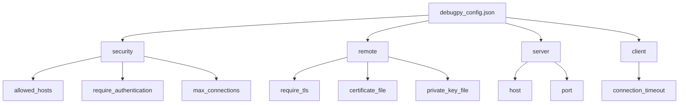
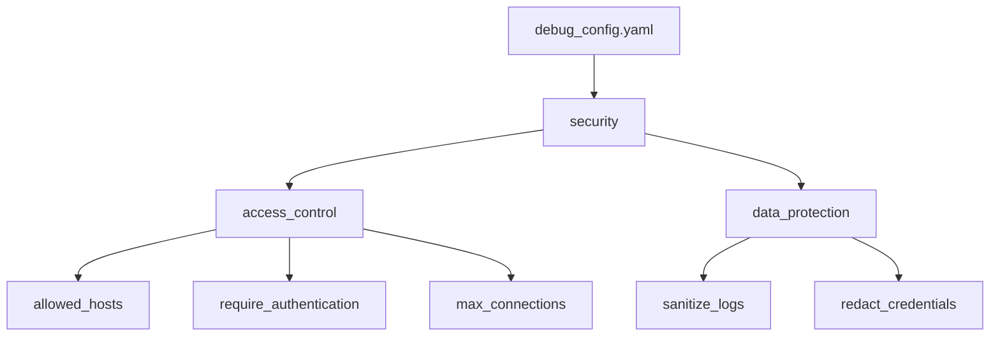
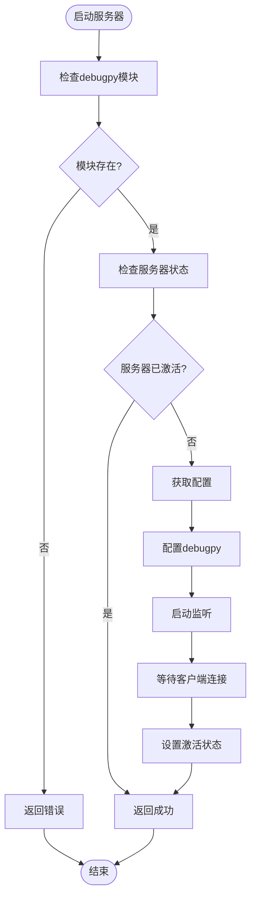
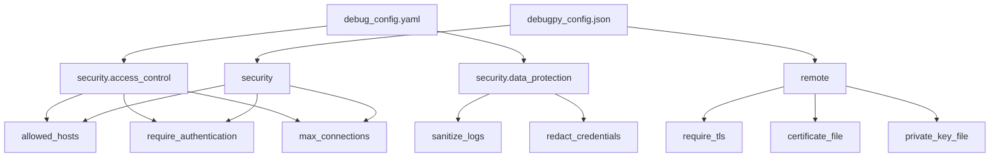

# Debugpy安全配置

<cite>
**本文档引用的文件**   
- [debugpy_config.json](file://BUGFIX_20260107/configs/debugpy_config.json)
- [debug_config.yaml](file://BUGFIX_20260107/configs/debug_config.yaml)
- [debugpy_server.py](file://autoBMAD/epic_automation/debugpy_integration/debugpy_server.py)
- [debug_client.py](file://autoBMAD/epic_automation/debugpy_integration/debug_client.py)
- [remote_debugger.py](file://autoBMAD/epic_automation/debugpy_integration/remote_debugger.py)
</cite>

## 目录
1. [引言](#引言)
2. [配置文件分析](#配置文件分析)
3. [安全策略详解](#安全策略详解)
4. [服务器端安全检查流程](#服务器端安全检查流程)
5. [生产环境配置示例](#生产环境配置示例)
6. [协同安全策略](#协同安全策略)
7. [结论](#结论)

## 引言

本文档系统阐述了`debugpy_config.json`中`security`和`remote`配置项的安全策略，包括`allowed_hosts`访问控制列表、`require_authentication`认证机制、`max_connections`连接限制以及TLS加密通信的配置方法。结合`debug_config.yaml`中的`security`部分，说明敏感数据脱敏、凭证红acting和平台特定安全策略的协同作用。基于`debugpy_server.py`的实现，解释服务器端安全检查的执行流程，并提供生产环境中启用TLS和IP白名单的完整配置示例，防范远程调试接口的未授权访问。

## 配置文件分析

### debugpy_config.json配置结构

`debugpy_config.json`文件定义了debugpy调试服务器的核心配置，其中`security`和`remote`部分是安全策略的关键。该配置文件位于`BUGFIX_20260107/configs/`目录下，为JSON格式，包含服务器、客户端、功能、安全、日志、性能、断点、异常、异步跟踪、远程调试等多个配置部分。



**Diagram sources**
- [debugpy_config.json](file://BUGFIX_20260107/configs/debugpy_config.json)

**Section sources**
- [debugpy_config.json](file://BUGFIX_20260107/configs/debugpy_config.json)

### debug_config.yaml安全配置

`debug_config.yaml`文件提供了更高级别的调试配置，其中`security`部分与`debugpy_config.json`形成互补。该文件位于同一配置目录下，采用YAML格式，包含访问控制、数据保护等安全相关配置。



**Diagram sources**
- [debug_config.yaml](file://BUGFIX_20260107/configs/debug_config.yaml)

**Section sources**
- [debug_config.yaml](file://BUGFIX_20260107/configs/debug_config.yaml)

## 安全策略详解

### security配置项

`security`配置项定义了基本的安全控制策略，包含三个核心参数：

- **allowed_hosts**: 访问控制列表，指定允许连接到调试服务器的主机IP地址或域名
- **require_authentication**: 认证机制开关，控制是否需要身份验证才能连接
- **max_connections**: 连接限制，设置服务器允许的最大并发连接数

这些配置共同构成了第一道安全防线，防止未经授权的访问。

```json
"security": {
    "allowed_hosts": [
        "127.0.0.1",
        "localhost",
        "::1"
    ],
    "require_authentication": false,
    "max_connections": 5
}
```

**Section sources**
- [debugpy_config.json](file://BUGFIX_20260107/configs/debugpy_config.json#L32-L40)

### remote配置项

`remote`配置项专门处理远程调试的安全需求，包含TLS加密通信的相关设置：

- **require_tls**: 是否要求使用TLS加密通信
- **certificate_file**: TLS证书文件路径
- **private_key_file**: 私钥文件路径
- **bind_all_interfaces**: 是否绑定所有网络接口

这些配置确保了远程调试过程中的数据传输安全。

```json
"remote": {
    "port_range": [5678, 5687],
    "bind_all_interfaces": false,
    "require_tls": false,
    "certificate_file": null,
    "private_key_file": null
}
```

**Section sources**
- [debugpy_config.json](file://BUGFIX_20260107/configs/debugpy_config.json#L78-L84)

## 服务器端安全检查流程

### DebugpyServer启动流程

`DebugpyServer`类负责管理debugpy远程调试服务器实例。其启动流程中包含了安全检查的关键步骤：

1. 检查debugpy模块是否安装
2. 验证服务器是否已激活
3. 获取配置中的主机和端口信息
4. 调用debugpy.listen()启动监听
5. 根据配置决定是否等待客户端连接



**Diagram sources**
- [debugpy_server.py](file://autoBMAD/epic_automation/debugpy_integration/debugpy_server.py#L99-L148)

**Section sources**
- [debugpy_server.py](file://autoBMAD/epic_automation/debugpy_integration/debugpy_server.py#L50-L153)

### 安全检查实现

服务器端的安全检查主要在`start`方法中实现，通过配置参数来控制安全行为。虽然当前实现中没有显式的安全验证逻辑，但依赖于debugpy库本身的安全机制和配置参数的约束。

```python
async def start(self, host: Optional[str] = None, port: Optional[int] = None) -> bool:
    """
    启动debugpy服务器。
    
    Args:
        host: 可选的主机地址
        port: 可选的端口号
        
    Returns:
        如果服务器成功启动则返回True，否则返回False
    """
    if debugpy is None:
        self.logger.error("无法启动服务器：未安装debugpy")
        return False
        
    if self._active:
        self.logger.warning("服务器已激活")
        return True
        
    # 使用提供的或配置的默认值
    server_config = self.config.get("server", {})
    host = host or server_config.get("host", self.DEFAULT_HOST)
    port = port or server_config.get("port", self.DEFAULT_PORT)
    
    try:
        self.logger.info(f"在{host}:{port}上启动debugpy服务器")
        
        # 配置debugpy
        debugpy.listen((host, port))
        
        # 存储服务器信息
        self.server_info = {
            "host": host,
            "port": port,
            "started_at": time.time(),
            "pid": self._get_process_id()
        }
        
        # 如果配置了则等待客户端
        if server_config.get("wait_for_client", True):
            self.logger.info(f"等待调试器连接到{host}:{port}...")
            debugpy.wait_for_client()
            self.logger.info("调试器连接成功")
            
        self._active = True
        self.logger.info("debugpy服务器启动成功")
        return True
        
    except Exception as e:
        self.logger.error(f"启动debugpy服务器失败：{e}", exc_info=True)
        self._active = False
        return False
```

**Section sources**
- [debugpy_server.py](file://autoBMAD/epic_automation/debugpy_integration/debugpy_server.py#L99-L153)

## 生产环境配置示例

### 安全配置最佳实践

在生产环境中，必须启用严格的安全配置来保护远程调试接口。以下是一个完整的配置示例：

```json
{
    "security": {
        "allowed_hosts": [
            "192.168.1.100",
            "192.168.1.101",
            "debug.internal.example.com"
        ],
        "require_authentication": true,
        "max_connections": 3
    },
    "remote": {
        "port_range": [5678, 5678],
        "bind_all_interfaces": false,
        "require_tls": true,
        "certificate_file": "/etc/ssl/certs/debugpy.crt",
        "private_key_file": "/etc/ssl/private/debugpy.key"
    },
    "server": {
        "host": "192.168.1.50",
        "port": 5678,
        "wait_for_client": true,
        "log_to_file": true
    }
}
```

**Section sources**
- [debugpy_config.json](file://BUGFIX_20260107/configs/debugpy_config.json)

### 配置说明

- **allowed_hosts**: 仅允许来自特定IP地址或域名的连接，避免开放给所有网络
- **require_authentication**: 启用认证机制，确保只有授权用户可以连接
- **max_connections**: 限制最大连接数，防止资源耗尽攻击
- **require_tls**: 强制使用TLS加密，保护数据传输安全
- **certificate_file/private_key_file**: 指定有效的TLS证书和私钥文件
- **bind_all_interfaces**: 设置为false，只绑定到特定接口，减少攻击面

## 协同安全策略

### 配置文件协同作用

`debugpy_config.json`和`debug_config.yaml`两个配置文件共同构成了完整的安全策略体系。`debugpy_config.json`专注于debugpy服务器本身的配置，而`debug_config.yaml`提供了更高层次的调试框架配置。



**Diagram sources**
- [debug_config.yaml](file://BUGFIX_20260107/configs/debug_config.yaml)
- [debugpy_config.json](file://BUGFIX_20260107/configs/debugpy_config.json)

**Section sources**
- [debug_config.yaml](file://BUGFIX_20260107/configs/debug_config.yaml)
- [debugpy_config.json](file://BUGFIX_20260107/configs/debugpy_config.json)

### 敏感数据保护

`debug_config.yaml`中的`data_protection`部分提供了敏感数据保护机制：

- **sanitize_logs**: 日志脱敏，防止敏感信息泄露
- **redact_credentials**: 凭证红acting，自动隐藏或替换凭证信息
- **encrypt_sensitive_data**: 敏感数据加密

这些配置与`debugpy_config.json`的安全配置协同工作，形成多层次的安全防护。

```yaml
security:
  access_control:
    allowed_hosts: ["127.0.0.1", "localhost"]
    require_authentication: false
    max_connections: 5
  data_protection:
    sanitize_logs: true
    encrypt_sensitive_data: false
    redact_credentials: true
```

**Section sources**
- [debug_config.yaml](file://BUGFIX_20260107/configs/debug_config.yaml#L262-L274)

## 结论

本文档详细阐述了debugpy安全配置的各个方面，包括`security`和`remote`配置项的安全策略、服务器端安全检查流程以及生产环境中的最佳实践。通过合理配置`allowed_hosts`访问控制列表、启用`require_authentication`认证机制、设置`max_connections`连接限制以及配置TLS加密通信，可以有效防范远程调试接口的未授权访问。

在生产环境中，建议采用严格的IP白名单策略，仅允许来自可信网络的连接，并启用TLS加密以保护数据传输安全。同时，结合`debug_config.yaml`中的敏感数据脱敏和凭证红acting策略，可以构建一个多层次、全方位的安全防护体系，确保调试功能的安全使用。