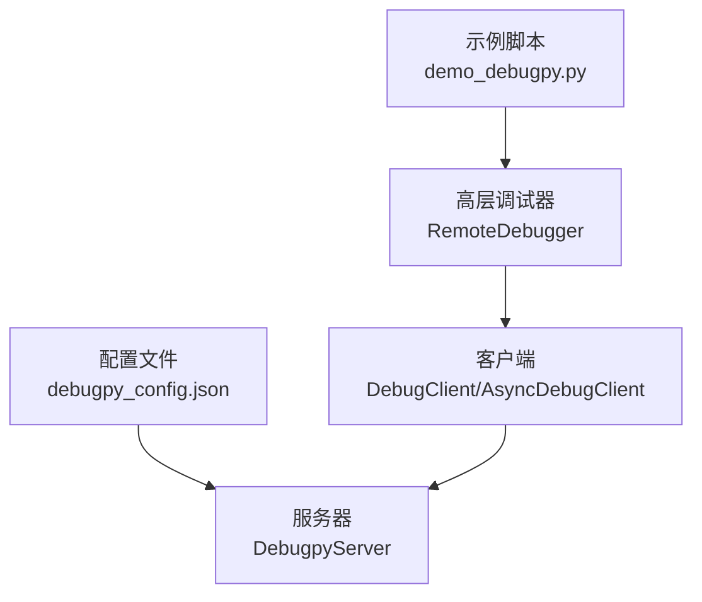
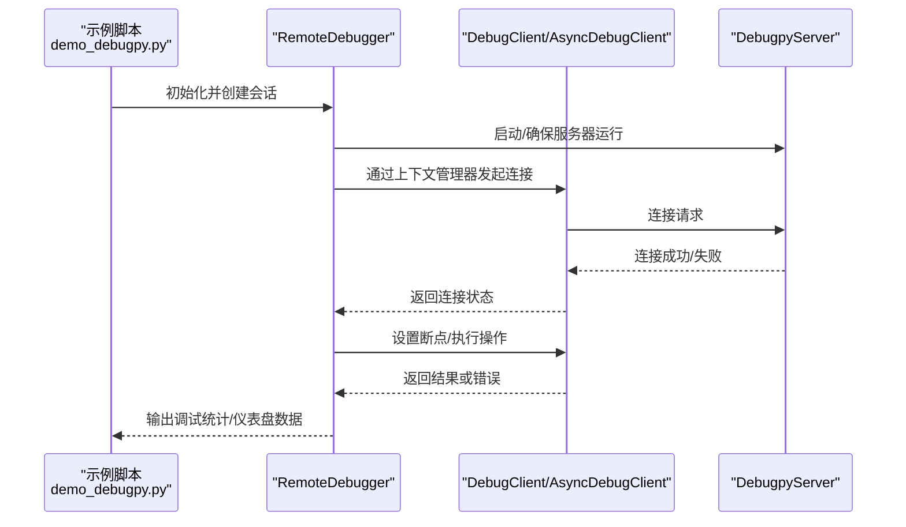
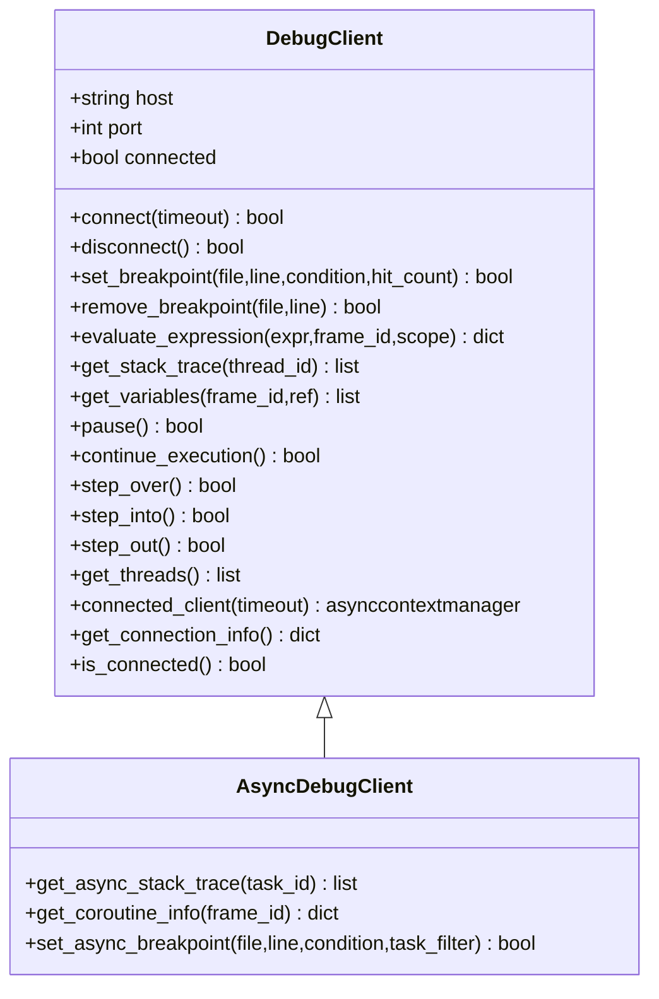
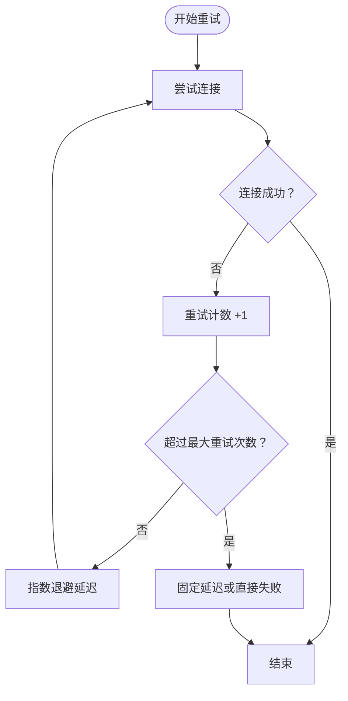
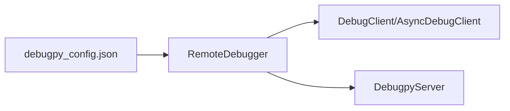

# Debugpy客户端配置

<cite>
**本文引用的文件**
- [debugpy_config.json](file://BUGFIX_20260107/configs/debugpy_config.json)
- [debug_client.py](file://autoBMAD\epic_automation\debugpy_integration\debug_client.py)
- [debugpy_server.py](file://autoBMAD\epic_automation\debugpy_integration\debugpy_server.py)
- [remote_debugger.py](file://autoBMAD\epic_automation\debugpy_integration\remote_debugger.py)
- [demo_debugpy.py](file://BUGFIX_20260107/demo_debugpy.py)
- [test_timeout_handling.py](file://BUGFIX_20260107/tests/test_timeout_handling.py)
</cite>

## 目录
1. [简介](#简介)
2. [项目结构](#项目结构)
3. [核心组件](#核心组件)
4. [架构总览](#架构总览)
5. [详细组件分析](#详细组件分析)
6. [依赖关系分析](#依赖关系分析)
7. [性能与稳定性考量](#性能与稳定性考量)
8. [故障排查指南](#故障排查指南)
9. [结论](#结论)
10. [附录](#附录)

## 简介
本文件围绕调试配置文件中的“client”配置域（connection_timeout、reconnect_attempts、reconnect_delay、keep_alive）展开，结合 DebugClient 类的实现，系统阐述客户端连接重试机制、心跳保持与异常恢复的逻辑，并给出在不稳定网络环境下优化重连策略的最佳实践，同时通过 demo_debugpy.py 展示如何以编程方式配置客户端参数以适配不同调试场景。

## 项目结构
与本主题直接相关的文件与模块如下：
- 配置文件：debugpy_config.json 提供调试客户端与服务器的参数来源
- 客户端实现：debug_client.py 中的 DebugClient/AsyncDebugClient
- 服务器实现：debugpy_server.py 中的 DebugpyServer
- 高层集成：remote_debugger.py 中的 RemoteDebugger 封装了会话管理与客户端交互
- 示例脚本：demo_debugpy.py 展示如何使用增强版调试套件与远程调试器

图表来源
- [debugpy_config.json](file://BUGFIX_20260107/configs/debugpy_config.json#L15-L20)
- [debug_client.py](file://autoBMAD\epic_automation\debugpy_integration\debug_client.py#L17-L487)
- [debugpy_server.py](file://autoBMAD\epic_automation\debugpy_integration\debugpy_server.py#L21-L294)
- [remote_debugger.py](file://autoBMAD\epic_automation\debugpy_integration\remote_debugger.py#L67-L115)
- [demo_debugpy.py](file://BUGFIX_20260107/demo_debugpy.py#L32-L126)

章节来源
- [debugpy_config.json](file://BUGFIX_20260107/configs/debugpy_config.json#L15-L20)
- [debug_client.py](file://autoBMAD\epic_automation\debugpy_integration\debug_client.py#L17-L487)
- [debugpy_server.py](file://autoBMAD\epic_automation\debugpy_integration\debugpy_server.py#L21-L294)
- [remote_debugger.py](file://autoBMAD\epic_automation\debugpy_integration\remote_debugger.py#L67-L115)
- [demo_debugpy.py](file://BUGFIX_20260107/demo_debugpy.py#L32-L126)

## 核心组件
- DebugClient/AsyncDebugClient：提供连接、断开、设置/移除断点、表达式求值、线程/协程栈跟踪等能力；支持上下文管理自动连接/断开
- DebugpyServer：封装 debugpy 的监听、等待客户端、停止等生命周期管理
- RemoteDebugger：高层接口，负责会话管理、事件记录、统计信息与与 DebugClient 的交互
- 配置文件 debugpy_config.json：集中定义 server/client/features/security/logging/performance 等配置项，其中 client 区域包含 connection_timeout、reconnect_attempts、reconnect_delay、keep_alive

章节来源
- [debug_client.py](file://autoBMAD\epic_automation\debugpy_integration\debug_client.py#L17-L487)
- [debugpy_server.py](file://autoBMAD\epic_automation\debugpy_integration\debugpy_server.py#L21-L294)
- [remote_debugger.py](file://autoBMAD\epic_automation\debugpy_integration\remote_debugger.py#L67-L115)
- [debugpy_config.json](file://BUGFIX_20260107/configs/debugpy_config.json#L15-L20)

## 架构总览
下图展示了从配置到客户端、服务器与高层调试器之间的交互关系，以及客户端连接管理的关键流程。

图表来源
- [demo_debugpy.py](file://BUGFIX_20260107/demo_debugpy.py#L32-L126)
- [remote_debugger.py](file://autoBMAD\epic_automation\debugpy_integration\remote_debugger.py#L123-L194)
- [debug_client.py](file://autoBMAD\epic_automation\debugpy_integration\debug_client.py#L442-L464)
- [debugpy_server.py](file://autoBMAD\epic_automation\debugpy_integration\debugpy_server.py#L99-L147)

## 详细组件分析

### DebugClient 类与连接管理
- 连接方法：connect 支持传入可选超时参数，返回布尔值表示连接成功与否；当前实现为模拟连接，便于演示与测试
- 断开方法：disconnect 清理连接状态与信息
- 上下文管理器：connected_client 提供自动连接/断开的上下文，若连接失败则抛出异常
- 其他能力：设置/移除断点、表达式求值、线程/协程栈跟踪、暂停/继续/单步等

图表来源
- [debug_client.py](file://autoBMAD\epic_automation\debugpy_integration\debug_client.py#L17-L487)

章节来源
- [debug_client.py](file://autoBMAD\epic_automation\debugpy_integration\debug_client.py#L39-L71)
- [debug_client.py](file://autoBMAD\epic_automation\debugpy_integration\debug_client.py#L73-L93)
- [debug_client.py](file://autoBMAD\epic_automation\debugpy_integration\debug_client.py#L442-L464)

### 客户端连接重试机制
- 当前 DebugClient 的 connect 方法未实现内置重试逻辑，仅在连接失败时记录日志并返回 False
- reconnect_attempts 与 reconnect_delay 可作为外部策略参数传入上层调用方（例如 RemoteDebugger 或业务侧），用于控制重试次数与每次重试间隔
- 建议在上层实现指数退避重试：以 base_delay 为初始延迟，第 n 次重试延迟为 base_delay * (backoff_factor ^ n)，并在达到最大重试次数后回退到固定延迟或直接失败

图表来源
- [debug_client.py](file://autoBMAD\epic_automation\debugpy_integration\debug_client.py#L39-L71)
- [test_timeout_handling.py](file://BUGFIX_20260107/tests/test_timeout_handling.py#L510-L512)

章节来源
- [debug_client.py](file://autoBMAD\epic_automation\debugpy_integration\debug_client.py#L39-L71)
- [test_timeout_handling.py](file://BUGFIX_20260107/tests/test_timeout_handling.py#L510-L512)

### 心跳保持与异常恢复
- keep_alive 参数在配置文件中存在，但当前 DebugClient 的 connect/connected_client 并未实现心跳检测或自动保活逻辑
- 异常恢复建议：在连接失败时记录错误、清理状态、触发重试；在断开时确保资源释放与状态复位
- 服务器侧 DebugpyServer 提供 wait_for_client 与超时等待，可用于配合客户端的重试策略

章节来源
- [debugpy_config.json](file://BUGFIX_20260107/configs/debugpy_config.json#L15-L20)
- [debug_client.py](file://autoBMAD\epic_automation\debugpy_integration\debug_client.py#L442-L464)
- [debugpy_server.py](file://autoBMAD\epic_automation\debugpy_integration\debugpy_server.py#L216-L249)

### 与 RemoteDebugger 的集成
- RemoteDebugger 在初始化时可选择自动启动服务器，并通过 AsyncDebugClient 与 DebugClient 进行交互
- 会话管理：debug_session 提供上下文，期间可设置断点、执行操作、记录事件与统计
- 统计与事件：记录断点数量、事件数量、会话创建历史等，便于问题定位与性能评估

章节来源
- [remote_debugger.py](file://autoBMAD\epic_automation\debugpy_integration\remote_debugger.py#L67-L115)
- [remote_debugger.py](file://autoBMAD\epic_automation\debugpy_integration\remote_debugger.py#L123-L194)
- [remote_debugger.py](file://autoBMAD\epic_automation\debugpy_integration\remote_debugger.py#L434-L475)

### 编程式配置与最佳实践
- 在不稳定的网络环境中，建议将 reconnect_attempts 设为较小值（如 3），reconnect_delay 设为 1~2 秒，采用指数退避（如 1.5~2.0 的退避因子）
- connection_timeout 应根据网络状况设置为合理的上限（如 10~30 秒），避免长时间阻塞
- keep_alive 可暂时启用，配合上层心跳检测与异常恢复策略
- 结合 demo_debugpy.py 的示例，可在创建 RemoteDebugger 时注入自定义配置，以适配不同调试场景

章节来源
- [demo_debugpy.py](file://BUGFIX_20260107/demo_debugpy.py#L32-L126)
- [debugpy_config.json](file://BUGFIX_20260107/configs/debugpy_config.json#L15-L20)

## 依赖关系分析
- DebugClient/AsyncDebugClient 依赖于 logging 记录与 asyncio 协程模型
- RemoteDebugger 依赖 DebugpyServer 与 DebugClient/AsyncDebugClient，负责会话与事件管理
- 配置文件 debugpy_config.json 为上述组件提供统一的参数来源

图表来源
- [debugpy_config.json](file://BUGFIX_20260107/configs/debugpy_config.json#L15-L20)
- [remote_debugger.py](file://autoBMAD\epic_automation\debugpy_integration\remote_debugger.py#L67-L115)
- [debug_client.py](file://autoBMAD\epic_automation\debugpy_integration\debug_client.py#L17-L487)
- [debugpy_server.py](file://autoBMAD\epic_automation\debugpy_integration\debugpy_server.py#L21-L294)

章节来源
- [debugpy_config.json](file://BUGFIX_20260107/configs/debugpy_config.json#L15-L20)
- [remote_debugger.py](file://autoBMAD\epic_automation\debugpy_integration\remote_debugger.py#L67-L115)
- [debug_client.py](file://autoBMAD\epic_automation\debugpy_integration\debug_client.py#L17-L487)
- [debugpy_server.py](file://autoBMAD\epic_automation\debugpy_integration\debugpy_server.py#L21-L294)

## 性能与稳定性考量
- 连接超时：connection_timeout 控制单次连接等待上限，避免阻塞；建议与重试策略协同使用
- 重试次数与延迟：reconnect_attempts 与 reconnect_delay 决定重试强度；指数退避可降低网络拥塞风险
- 心跳保持：keep_alive 可提升长连接稳定性，需配合上层心跳检测与异常恢复
- 日志与监控：通过 logging 与统计信息（断点数、事件数、会话数）辅助定位问题

章节来源
- [debugpy_config.json](file://BUGFIX_20260107/configs/debugpy_config.json#L15-L20)
- [debug_client.py](file://autoBMAD\epic_automation\debugpy_integration\debug_client.py#L442-L464)
- [remote_debugger.py](file://autoBMAD\epic_automation\debugpy_integration\remote_debugger.py#L434-L475)

## 故障排查指南
- 连接失败：检查 connection_timeout 是否过短；确认服务器已启动且端口可用
- 重试无效：确认上层是否实现了指数退避与最大重试次数控制
- 心跳丢失：确认 keep_alive 是否启用，以及上层心跳检测逻辑是否生效
- 日志定位：查看 debugpy_server.log 与应用日志，关注连接/断开/超时/异常事件

章节来源
- [debugpy_server.py](file://autoBMAD\epic_automation\debugpy_integration\debugpy_server.py#L99-L147)
- [debug_client.py](file://autoBMAD\epic_automation\debugpy_integration\debug_client.py#L39-L71)
- [remote_debugger.py](file://autoBMAD\epic_automation\debugpy_integration\remote_debugger.py#L434-L475)

## 结论
- debugpy_config.json 的 client 区域提供了 connection_timeout、reconnect_attempts、reconnect_delay、keep_alive 等关键参数
- DebugClient 当前未内置重试与心跳逻辑，需由上层（如 RemoteDebugger 或业务侧）实现指数退避与异常恢复
- 在不稳定网络环境下，建议采用较小的重试次数、适度的初始延迟与指数退避策略，并结合日志与统计进行监控与优化

## 附录
- 编程式配置参考：demo_debugpy.py 展示了如何创建 RemoteDebugger、DebugDashboard 与 DebugpyServer，并输出调试统计信息
- 测试验证：test_timeout_handling.py 中包含指数退避相关测试用例，可作为策略验证的参考

章节来源
- [demo_debugpy.py](file://BUGFIX_20260107/demo_debugpy.py#L32-L126)
- [test_timeout_handling.py](file://BUGFIX_20260107/tests/test_timeout_handling.py#L510-L512)