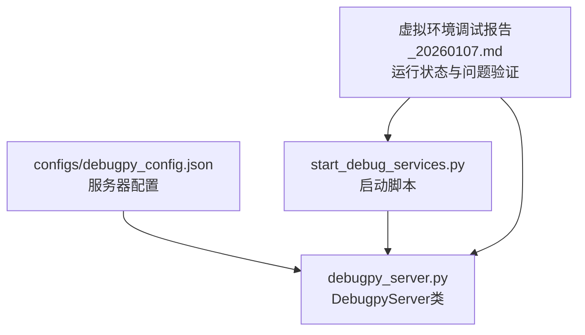
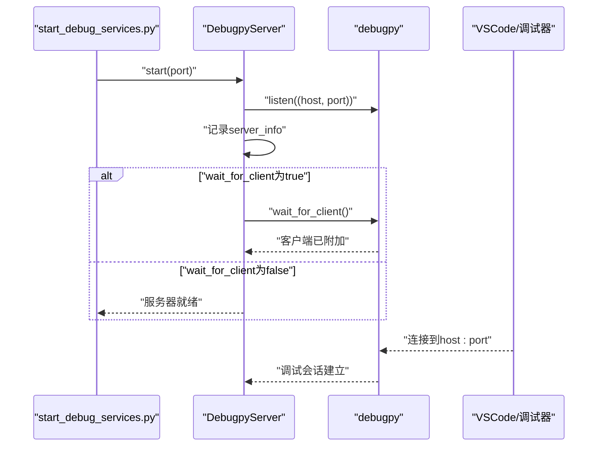
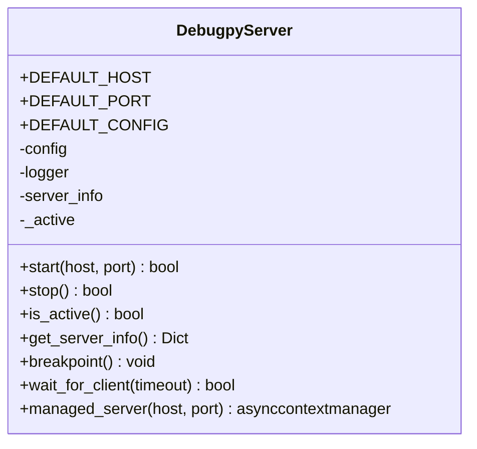
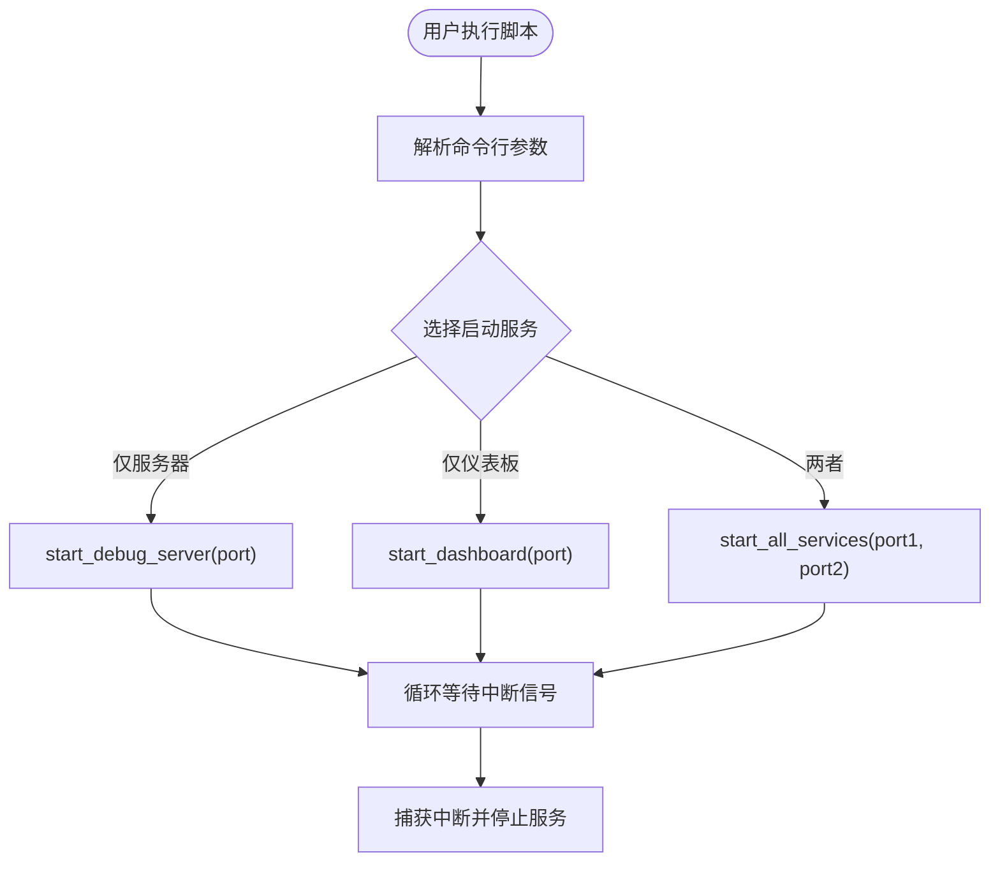
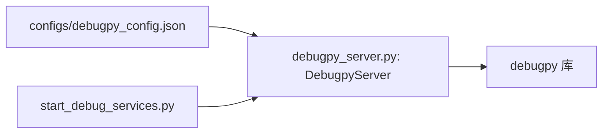

# Debugpy服务器配置

<cite>
**本文引用的文件**
- [debugpy_config.json](file://BUGFIX_20260107/configs/debugpy_config.json)
- [debugpy_server.py](file://autoBMAD/epic_automation/debugpy_integration/debugpy_server.py)
- [start_debug_services.py](file://BUGFIX_20260107/start_debug_services.py)
- [虚拟环境调试报告_20260107.md](file://BUGFIX_20260107/虚拟环境调试报告_20260107.md)
</cite>

## 目录
1. [简介](#简介)
2. [项目结构](#项目结构)
3. [核心组件](#核心组件)
4. [架构总览](#架构总览)
5. [详细组件分析](#详细组件分析)
6. [依赖关系分析](#依赖关系分析)
7. [性能考虑](#性能考虑)
8. [故障排查指南](#故障排查指南)
9. [结论](#结论)
10. [附录](#附录)

## 简介
本文件围绕“debugpy_config.json”中的“server”配置项展开，系统性解析host、port、wait_for_client、log_to_file与address_family等参数的含义与作用；结合“debugpy_server.py”中的“DebugpyServer”类实现，说明服务器启动、监听、客户端等待机制的技术细节；解释address_family配置对IPv4/IPv6支持的影响，并给出多网卡环境下bind_all_interfaces的安全配置建议；最后演示通过“start_debug_services.py”脚本启动配置化的调试服务器，并结合“虚拟环境调试报告_20260107.md”解决跨平台端口占用问题。

## 项目结构
与Debugpy服务器配置直接相关的文件与职责如下：
- configs/debugpy_config.json：定义调试服务器的配置（含server、client、features、security、logging、performance、breakpoints、exceptions、async_tracking、remote、compatibility、experimental等）。
- debugpy_server.py：提供DebugpyServer类，负责debugpy服务器的启动、监听、等待客户端、停止以及生命周期管理。
- start_debug_services.py：提供命令行入口，用于启动Debugpy服务器与调试仪表板服务。
- 虚拟环境调试报告_20260107.md：记录虚拟环境中debugpy服务器的运行状态与性能表现，包含跨平台端口占用问题的验证与结论。

图表来源
- [debugpy_config.json](file://BUGFIX_20260107/configs/debugpy_config.json#L1-L96)
- [debugpy_server.py](file://autoBMAD/epic_automation/debugpy_integration/debugpy_server.py#L99-L148)
- [start_debug_services.py](file://BUGFIX_20260107/start_debug_services.py#L1-L80)
- [虚拟环境调试报告_20260107.md](file://BUGFIX_20260107/虚拟环境调试报告_20260107.md#L1-L60)

章节来源
- [debugpy_config.json](file://BUGFIX_20260107/configs/debugpy_config.json#L1-L96)
- [debugpy_server.py](file://autoBMAD/epic_automation/debugpy_integration/debugpy_server.py#L99-L148)
- [start_debug_services.py](file://BUGFIX_20260107/start_debug_services.py#L1-L80)
- [虚拟环境调试报告_20260107.md](file://BUGFIX_20260107/虚拟环境调试报告_20260107.md#L1-L60)

## 核心组件
- DebugpyServer类：封装debugpy服务器的启动、监听、等待客户端、停止与上下文管理；支持从配置文件读取server段参数并应用到listen与wait_for_client行为。
- 配置文件：debugpy_config.json的server段包含host、port、wait_for_client、log_to_file、address_family等字段；remote段包含bind_all_interfaces等网络绑定选项；security段包含allowed_hosts等访问控制。

章节来源
- [debugpy_server.py](file://autoBMAD/epic_automation/debugpy_integration/debugpy_server.py#L21-L67)
- [debugpy_config.json](file://BUGFIX_20260107/configs/debugpy_config.json#L8-L14)
- [debugpy_config.json](file://BUGFIX_20260107/configs/debugpy_config.json#L78-L84)

## 架构总览
Debugpy服务器启动与客户端等待的整体流程如下：

图表来源
- [start_debug_services.py](file://BUGFIX_20260107/start_debug_services.py#L19-L37)
- [debugpy_server.py](file://autoBMAD/epic_automation/debugpy_integration/debugpy_server.py#L99-L148)

## 详细组件分析

### server配置项详解
- host
  - 含义：服务器监听的主机地址，默认为本地回环地址。
  - 作用：决定debugpy监听的网络接口；与address_family共同影响IPv4/IPv6绑定行为。
  - 在DebugpyServer.start中，若未显式传入host，则优先使用配置文件server.host，否则回退到默认值。
- port
  - 含义：服务器监听的端口号，默认为5678。
  - 作用：与host组合形成监听地址；脚本默认端口也为5678，便于快速启动。
- wait_for_client
  - 含义：是否在启动后等待调试器客户端连接。
  - 作用：若为true，start过程中会阻塞直到客户端附加；若为false，服务器启动即返回。
- log_to_file
  - 含义：是否启用文件日志。
  - 作用：在配置中存在该字段，但当前DebugpyServer.start并未直接读取该字段；其日志主要来自内部logger与debugpy的交互日志。
- address_family
  - 含义：指定地址族，支持"ipv4"或"ipv6"。
  - 影响：决定底层socket绑定的地址族；当设置为"ipv4"时，仅绑定IPv4；设置为"ipv6"时，可能绑定IPv6或双栈，具体取决于系统与实现。

章节来源
- [debugpy_config.json](file://BUGFIX_20260107/configs/debugpy_config.json#L8-L14)
- [debugpy_server.py](file://autoBMAD/epic_automation/debugpy_integration/debugpy_server.py#L99-L148)
- [start_debug_services.py](file://BUGFIX_20260107/start_debug_services.py#L19-L37)

### DebugpyServer类实现要点
- 启动流程
  - 检查debugpy是否可用；若不可用则记录警告并返回失败。
  - 若服务器已处于活动状态则直接返回成功。
  - 从配置读取server.host与server.port，或由调用方传入覆盖。
  - 调用debugpy.listen((host, port))完成监听。
  - 若wait_for_client为true，则调用debugpy.wait_for_client()等待客户端附加。
  - 记录server_info（host、port、启动时间、进程ID）并标记_active为True。
- 停止流程
  - 当前实现不提供显式stop方法，通过标记_active为False并记录停机时长来表示停止。
- 等待客户端
  - 提供wait_for_client(timeout)方法，支持超时等待；内部通过异步适配与debugpy.wait_for_client配合。
- 上下文管理
  - managed_server上下文管理器确保在进入时启动，在退出时停止，简化生命周期管理。

图表来源
- [debugpy_server.py](file://autoBMAD/epic_automation/debugpy_integration/debugpy_server.py#L21-L67)
- [debugpy_server.py](file://autoBMAD/epic_automation/debugpy_integration/debugpy_server.py#L99-L148)
- [debugpy_server.py](file://autoBMAD/epic_automation/debugpy_integration/debugpy_server.py#L216-L249)
- [debugpy_server.py](file://autoBMAD/epic_automation/debugpy_integration/debugpy_server.py#L263-L287)

章节来源
- [debugpy_server.py](file://autoBMAD/epic_automation/debugpy_integration/debugpy_server.py#L99-L148)
- [debugpy_server.py](file://autoBMAD/epic_automation/debugpy_integration/debugpy_server.py#L216-L249)
- [debugpy_server.py](file://autoBMAD/epic_automation/debugpy_integration/debugpy_server.py#L263-L287)

### address_family对IPv4/IPv6支持的影响
- address_family为"ipv4"时，服务器通常仅绑定IPv4地址族；这在多网卡环境下可避免IPv6栈带来的复杂性，提高兼容性。
- address_family为"ipv6"时，服务器可能绑定IPv6或双栈（取决于系统与实现），允许通过IPv6地址访问，但在某些网络环境下可能需要额外的防火墙与路由配置。
- 在实际部署中，若需要同时支持IPv4与IPv6，应确保系统支持双栈，并在安全策略中明确允许相应协议栈的访问。

章节来源
- [debugpy_config.json](file://BUGFIX_20260107/configs/debugpy_config.json#L12-L13)
- [debugpy_server.py](file://autoBMAD/epic_automation/debugpy_integration/debugpy_server.py#L118-L147)

### 多网卡环境下bind_all_interfaces的安全配置建议
- bind_all_interfaces为false时，服务器仅绑定到特定接口（由host与address_family决定），限制了外部访问面，提高安全性。
- 在多网卡环境中，建议：
  - 固定host为受信任的内网地址（如127.0.0.1或特定内网IP），避免绑定到0.0.0.0。
  - 若确实需要对外暴露，启用TLS与认证（remote.require_tls与security.require_authentication），并限制allowed_hosts白名单。
  - 通过防火墙策略仅开放必要端口，避免全网暴露。
  - 定期审计日志，监控异常连接尝试。

章节来源
- [debugpy_config.json](file://BUGFIX_20260107/configs/debugpy_config.json#L78-L84)
- [debugpy_config.json](file://BUGFIX_20260107/configs/debugpy_config.json#L32-L40)

### 通过start_debug_services.py启动配置化的调试服务器
- 脚本提供命令行入口，支持单独启动Debugpy服务器、调试仪表板或两者同时启动。
- 默认端口为5678，与配置文件默认端口一致，便于快速验证。
- 启动后打印服务器信息与等待提示，支持Ctrl+C优雅关闭。

图表来源
- [start_debug_services.py](file://BUGFIX_20260107/start_debug_services.py#L1-L80)
- [start_debug_services.py](file://BUGFIX_20260107/start_debug_services.py#L82-L151)

章节来源
- [start_debug_services.py](file://BUGFIX_20260107/start_debug_services.py#L1-L80)
- [start_debug_services.py](file://BUGFIX_20260107/start_debug_services.py#L82-L151)

### 结合虚拟环境调试报告解决跨平台端口占用问题
- 报告显示在虚拟环境中debugpy服务器成功连接到127.0.0.1:5678，且VSCode远程调试活跃，表明端口占用问题已得到解决。
- 跨平台端口占用常见原因与对策：
  - 端口被其他进程占用：切换到非5678端口或终止占用进程。
  - 权限不足：以管理员权限运行或调整防火墙策略。
  - IPv4/IPv6冲突：统一address_family为"ipv4"或"ipv6"，避免双栈冲突。
  - 多网卡冲突：固定host为特定内网地址，避免绑定到0.0.0.0。
- 建议在启动前先检查端口占用情况，并在配置中明确host与address_family，减少跨平台差异带来的问题。

章节来源
- [虚拟环境调试报告_20260107.md](file://BUGFIX_20260107/虚拟环境调试报告_20260107.md#L1-L60)
- [start_debug_services.py](file://BUGFIX_20260107/start_debug_services.py#L19-L37)
- [debugpy_config.json](file://BUGFIX_20260107/configs/debugpy_config.json#L8-L14)

## 依赖关系分析
- DebugpyServer依赖debugpy库进行监听与等待客户端；其启动流程直接使用debugpy.listen与debugpy.wait_for_client。
- 配置文件中的server段参数会被DebugpyServer.start读取并应用到监听地址与等待行为。
- 启动脚本通过构造DebugpyServer实例并调用start方法，实现一键启动调试服务器。

图表来源
- [debugpy_config.json](file://BUGFIX_20260107/configs/debugpy_config.json#L8-L14)
- [debugpy_server.py](file://autoBMAD/epic_automation/debugpy_integration/debugpy_server.py#L99-L148)
- [start_debug_services.py](file://BUGFIX_20260107/start_debug_services.py#L19-L37)

章节来源
- [debugpy_server.py](file://autoBMAD/epic_automation/debugpy_integration/debugpy_server.py#L99-L148)
- [debugpy_config.json](file://BUGFIX_20260107/configs/debugpy_config.json#L8-L14)
- [start_debug_services.py](file://BUGFIX_20260107/start_debug_services.py#L19-L37)

## 性能考虑
- 通过配置文件中的performance段可限制最大内存与GC阈值，有助于在调试场景中控制资源消耗。
- 在多任务/异步场景中，开启async_tracking可提升调试体验，但需注意对性能的影响。
- 日志级别与文件轮转配置（logging段）可平衡可观测性与磁盘占用。

章节来源
- [debugpy_config.json](file://BUGFIX_20260107/configs/debugpy_config.json#L49-L54)
- [debugpy_config.json](file://BUGFIX_20260107/configs/debugpy_config.json#L41-L48)

## 故障排查指南
- 无法启动服务器
  - 检查debugpy是否安装；若未安装，将记录警告并返回失败。
  - 确认端口未被占用；必要时切换端口或终止占用进程。
- 客户端无法连接
  - 检查host与address_family配置是否与IDE一致。
  - 若使用IPv6，确认系统支持双栈且防火墙放行。
  - 在多网卡环境中，确保host绑定到正确的接口。
- 等待客户端超时
  - 调整wait_for_client或使用wait_for_client(timeout)方法设置合理超时。
- 跨平台端口占用
  - 参考虚拟环境调试报告中的验证结果，确认端口占用问题已解决；若仍存在问题，按上述建议逐一排查。

章节来源
- [debugpy_server.py](file://autoBMAD/epic_automation/debugpy_integration/debugpy_server.py#L110-L117)
- [debugpy_server.py](file://autoBMAD/epic_automation/debugpy_integration/debugpy_server.py#L216-L249)
- [虚拟环境调试报告_20260107.md](file://BUGFIX_20260107/虚拟环境调试报告_20260107.md#L1-L60)

## 结论
- debugpy_config.json的server段提供了灵活的服务器配置能力，DebugpyServer类将其与debugpy库紧密集成，实现了启动、监听、等待客户端与生命周期管理。
- address_family直接影响IPv4/IPv6绑定行为；在多网卡环境下，建议通过bind_all_interfaces与host固定策略提升安全性与稳定性。
- 通过start_debug_services.py可快速启动调试服务器并与IDE协同工作；结合虚拟环境调试报告，可有效规避跨平台端口占用问题。

## 附录
- 配置文件路径与关键字段
  - server.host/port/wait_for_client/log_to_file/address_family
  - remote.bind_all_interfaces
  - security.allowed_hosts
  - logging.level/file/max_size_mb/backup_count/format/enable_console
  - performance.max_memory_mb/gc_threshold/event_loop_monitoring/task_tracking
- 启动脚本关键参数
  - --server/--dashboard/--port/--dashboard-port

章节来源
- [debugpy_config.json](file://BUGFIX_20260107/configs/debugpy_config.json#L8-L14)
- [debugpy_config.json](file://BUGFIX_20260107/configs/debugpy_config.json#L78-L84)
- [debugpy_config.json](file://BUGFIX_20260107/configs/debugpy_config.json#L32-L40)
- [debugpy_config.json](file://BUGFIX_20260107/configs/debugpy_config.json#L41-L48)
- [debugpy_config.json](file://BUGFIX_20260107/configs/debugpy_config.json#L49-L54)
- [start_debug_services.py](file://BUGFIX_20260107/start_debug_services.py#L82-L151)