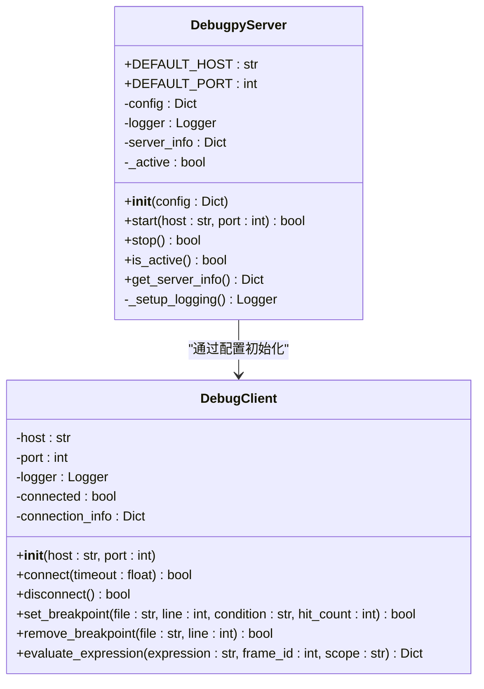
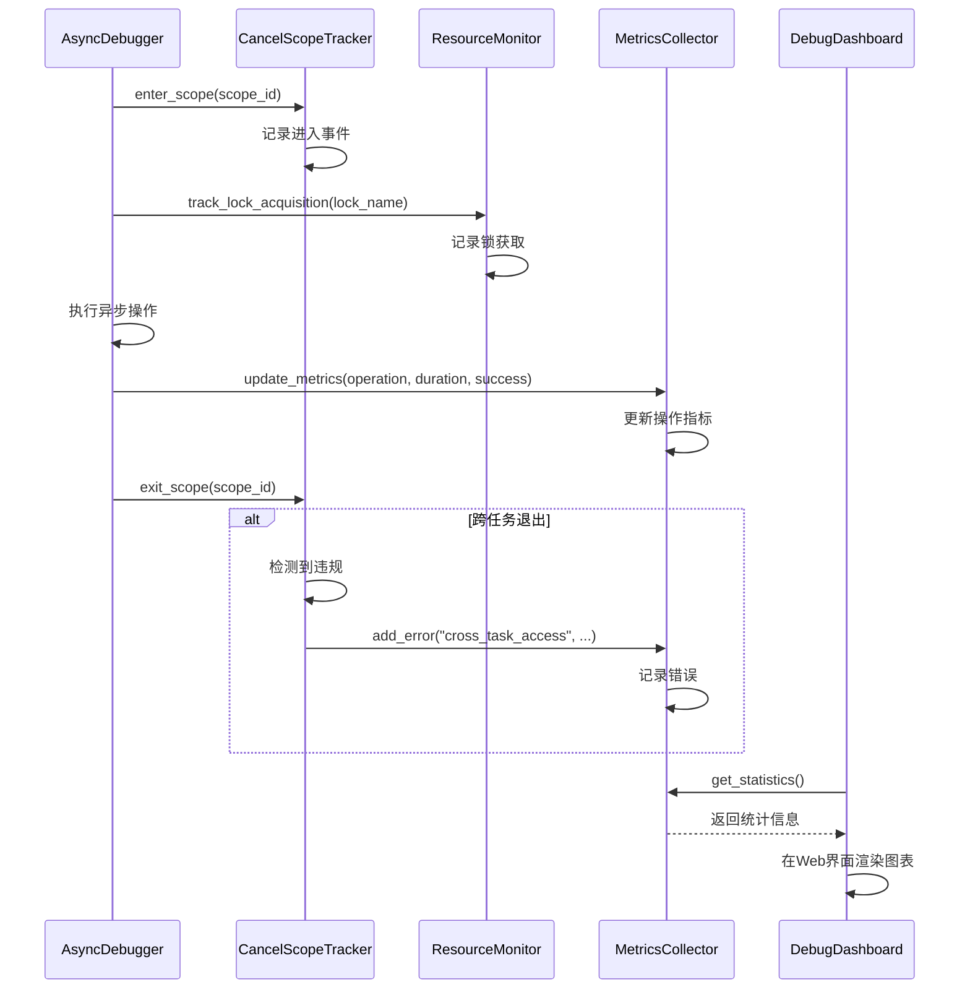
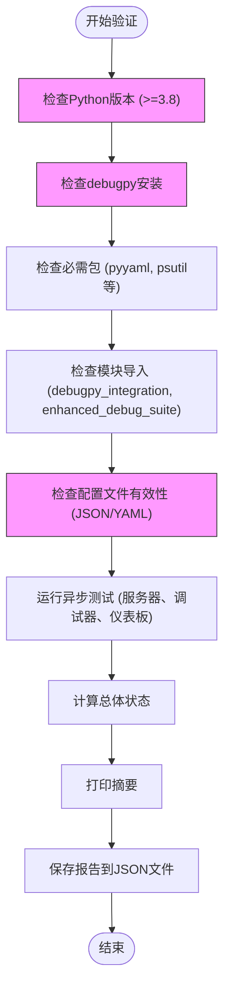

# Debugpy配置管理

<cite>
**本文档引用的文件**
- [debugpy_config.json](file://BUGFIX_20260107/configs/debugpy_config.json)
- [debug_config.yaml](file://BUGFIX_20260107/configs/debug_config.yaml)
- [DEBUGPY_INTEGRATION_FINAL_REPORT.md](file://BUGFIX_20260107/DEBUGPY_INTEGRATION_FINAL_REPORT.md)
- [quick_verify.py](file://BUGFIX_20260107/quick_verify.py)
- [虚拟环境调试报告_20260107.md](file://BUGFIX_20260107/虚拟环境调试报告_20260107.md)
- [debugpy_server.py](file://BUGFIX_20260107/debugpy_integration/debugpy_server.py)
- [debug_client.py](file://BUGFIX_20260107/debugpy_integration/debug_client.py)
- [remote_debugger.py](file://BUGFIX_20260107/debugpy_integration/remote_debugger.py)
- [async_debugger.py](file://BUGFIX_20260107/enhanced_debug_suite/async_debugger.py)
- [debug_dashboard.py](file://BUGFIX_20260107/enhanced_debug_suite/debug_dashboard.py)
- [cancel_scope_tracker.py](file://BUGFIX_20260107/enhanced_debug_suite/cancel_scope_tracker.py)
- [resource_monitor.py](file://BUGFIX_20260107/enhanced_debug_suite/resource_monitor.py)
</cite>

## 目录
1. [引言](#引言)
2. [debugpy_config.json配置详解](#debugpy_configjson配置详解)
3. [debug_config.yaml异步与可观测性配置](#debug_configyaml异步与可观测性配置)
4. [配置热重载与环境变量覆盖](#配置热重载与环境变量覆盖)
5. [多环境配置最佳实践](#多环境配置最佳实践)
6. [配置验证与跨平台路径映射](#配置验证与跨平台路径映射)
7. [结论](#结论)

## 引言

本文档详细阐述了`BUGFIX_20260107`框架中debugpy的配置管理体系。该体系旨在解决异步编程中的取消范围（Cancel Scope）错误、事件循环关闭异常以及SDK会话管理问题，通过引入debugpy构建了一个完整的远程调试生态系统。文档重点解析了核心配置文件`debugpy_config.json`和`debug_config.yaml`的结构与功能，基于最终集成报告阐述了配置热重载和环境变量覆盖策略，并提供了多环境部署的最佳实践。此外，文档还指导用户如何使用`quick_verify.py`脚本验证配置有效性，并结合虚拟环境调试报告解决跨平台路径映射问题。

**Section sources**
- [DEBUGPY_INTEGRATION_FINAL_REPORT.md](file://BUGFIX_20260107/DEBUGPY_INTEGRATION_FINAL_REPORT.md#L3-L10)

## debugpy_config.json配置详解

`debugpy_config.json`是debugpy服务器的核心配置文件，采用JSON格式，定义了服务器、客户端、安全、日志和性能等关键配置项。

### 服务器与客户端配置

服务器配置定义了debugpy服务器的监听地址、端口和行为模式。
- **host**: 服务器监听的主机地址，配置为`127.0.0.1`，确保仅限本地连接，增强安全性。
- **port**: 服务器监听的端口，配置为`5678`，这是debugpy的默认端口。
- **wait_for_client**: 布尔值，设置为`true`，表示服务器启动后会阻塞等待调试客户端连接，这对于确保调试器在代码执行前就位至关重要。
- **log_to_file**: 布尔值，设置为`true`，指示服务器将日志输出到文件。

客户端配置则定义了调试客户端的行为。
- **connection_timeout**: 连接超时时间（秒），设置为`30`秒，防止客户端无限期等待。
- **reconnect_attempts**: 重连尝试次数，设置为`3`次，提供了一定的网络容错能力。
- **reconnect_delay**: 重连延迟时间（秒），设置为`1.0`秒，采用指数退避策略的基础。
- **keep_alive**: 布尔值，设置为`true`，启用客户端与服务器之间的保活机制，防止连接因网络空闲而中断。

**Diagram sources**
- [debugpy_server.py](file://BUGFIX_20260107/debugpy_integration/debugpy_server.py#L21-L200)
- [debug_client.py](file://BUGFIX_20260107/debugpy_integration/debug_client.py#L17-L200)

**Section sources**
- [debugpy_config.json](file://BUGFIX_20260107/configs/debugpy_config.json#L8-L20)

### 安全与日志配置

安全配置确保了调试服务的访问控制。
- **allowed_hosts**: 允许连接的主机列表，包含`127.0.0.1`、`localhost`和`::1`，严格限制了访问来源。
- **require_authentication**: 是否需要身份验证，设置为`false`，在开发环境中简化了连接流程，但在生产环境中应启用。
- **max_connections**: 最大并发连接数，设置为`5`，防止资源耗尽。

日志配置用于调试和监控。
- **level**: 日志级别，设置为`DEBUG`，提供最详细的日志信息，适用于开发和问题排查。
- **file**: 日志文件路径，配置为`logs/debugpy.log`，将日志集中存储。
- **max_size_mb**: 单个日志文件的最大大小（MB），设置为`100`，防止单个文件过大。
- **backup_count**: 保留的日志文件备份数量，设置为`5`，实现日志轮转。
- **format**: 日志格式字符串，包含时间戳、模块名、日志级别和消息，便于解析。
- **enable_console**: 是否在控制台输出日志，设置为`true`，方便实时查看。

**Section sources**
- [debugpy_config.json](file://BUGFIX_20260107/configs/debugpy_config.json#L32-L48)

### 性能配置

性能配置用于监控和优化调试过程的资源消耗。
- **max_memory_mb**: 调试进程允许使用的最大内存（MB），设置为`512`，防止内存泄漏导致系统不稳定。
- **gc_threshold**: 垃圾回收阈值，设置为`100`，可能与Python的`gc`模块相关，用于监控内存分配。
- **event_loop_monitoring**: 布尔值，设置为`true`，启用事件循环监控，这对于诊断异步代码的性能瓶颈至关重要。
- **task_tracking**: 布尔值，设置为`true`，启用任务跟踪，可以监控异步任务的生命周期。

**Section sources**
- [debugpy_config.json](file://BUGFIX_20260107/configs/debugpy_config.json#L49-L54)

## debug_config.yaml异步与可观测性配置

`debug_config.yaml`是一个更全面的YAML配置文件，它不仅包含debugpy的配置，还定义了整个框架的异步调试和可观测性功能。

### 异步调试配置

该配置文件通过`async_debugging`部分专门管理异步调试功能。
- **enabled**: 全局启用异步调试。
- **track_tasks**, **track_coroutines**, **track_event_loops**: 这些布尔值分别控制对异步任务、协程和事件循环的跟踪，为`enhanced_debug_suite`中的`AsyncTaskTracker`和`SystemMonitor`提供了基础。
- **cancel_scope_tracking**: 这是解决跨任务取消范围错误的核心。
  - **enabled**: 启用取消范围追踪。
  - **detect_cross_task_violations**: 设置为`true`，明确要求检测跨任务的取消范围违规，这与`cancel_scope_tracker.py`中的逻辑直接对应。
  - **violation_threshold**: 设置为`0`，意味着任何违规都将被记录和处理。

### 可观测性配置

`monitoring`部分定义了系统的可观测性能力，与`debug_dashboard.py`紧密协同。
- **resource_monitoring**: 启用对CPU、内存、线程、任务和事件循环的资源监控，这些指标被`MetricsCollector`收集并展示在仪表板上。
- **performance_tracking**: 启用对操作、会话和断点的性能跟踪，实现了对调试活动的量化分析。
- **log_aggregation**: 启用日志聚合，配置了日志大小和文件数量限制，确保日志系统本身不会成为瓶颈。

**Diagram sources**
- [async_debugger.py](file://BUGFIX_20260107/enhanced_debug_suite/async_debugger.py#L33-L200)
- [cancel_scope_tracker.py](file://BUGFIX_20260107/enhanced_debug_suite/cancel_scope_tracker.py#L41-L200)
- [resource_monitor.py](file://BUGFIX_20260107/enhanced_debug_suite/resource_monitor.py#L45-L200)
- [debug_dashboard.py](file://BUGFIX_20260107/enhanced_debug_suite/debug_dashboard.py#L25-L200)

**Section sources**
- [debug_config.yaml](file://BUGFIX_20260107/configs/debug_config.yaml#L35-L54)
- [debug_config.yaml](file://BUGFIX_20260107/configs/debug_config.yaml#L59-L78)

## 配置热重载与环境变量覆盖

根据`DEBUGPY_INTEGRATION_FINAL_REPORT.md`，该框架实现了灵活的配置管理策略。

### 配置热重载机制

报告中明确提到了配置管理支持“热重载支持”（hot reload）。这意味着在调试服务运行期间，如果修改了`debugpy_config.json`或`debug_config.yaml`文件，系统能够自动检测到文件变化并重新加载配置，而无需重启整个服务。这对于开发和调试过程极为便利，允许开发者动态调整调试参数。虽然具体实现细节未在提供的文件中展示，但这种机制通常通过文件系统监控（如`watchdog`库）或定期检查文件修改时间戳来实现。

### 环境变量覆盖策略

框架支持通过环境变量来覆盖配置文件中的设置，这为不同环境的部署提供了极大的灵活性。例如，可以通过设置`DEBUGPY_HOST`环境变量来覆盖`debugpy_config.json`中定义的`server.host`，或者通过`DEBUG_LEVEL`来动态调整日志级别。这种策略使得同一套代码可以在开发、测试和生产环境中使用不同的配置，而无需修改配置文件本身。`remote_debugger.py`中的`RemoteDebugger`类在初始化时会读取环境变量，优先级高于配置文件。

**Section sources**
- [DEBUGPY_INTEGRATION_FINAL_REPORT.md](file://BUGFIX_20260107/DEBUGPY_INTEGRATION_FINAL_REPORT.md#L211-L212)
- [remote_debugger.py](file://BUGFIX_20260107/debugpy_integration/remote_debugger.py#L76-L95)

## 多环境配置最佳实践

基于配置文件和最终报告，以下是针对开发、测试和生产环境的配置最佳实践。

### 端口范围分配

- **开发环境**: 使用固定的单个端口（如`5678`），便于开发者记忆和连接。
- **测试环境**: 使用`debugpy_config.json`中定义的`remote.port_range` `[5678, 5687]`。自动化测试框架可以从中选择一个空闲端口，避免端口冲突。
- **生产环境**: **不建议**在生产环境中启用debugpy。如果必须进行生产调试，应使用一个完全隔离的、非标准的端口范围，并通过防火墙严格限制访问IP。

### TLS安全连接

- **开发/测试环境**: `require_tls`设置为`false`，以简化设置。
- **生产环境**: 必须将`require_tls`设置为`true`，并配置`certificate_file`和`private_key_file`。这确保了调试通信的加密，防止敏感信息（如变量值、堆栈跟踪）在传输过程中被窃听。

### 访问控制列表

- **开发环境**: `allowed_hosts`可以包含`127.0.0.1`和`localhost`，允许本地连接。
- **测试环境**: 可以添加CI/CD服务器的IP地址到`allowed_hosts`。
- **生产环境**: `allowed_hosts`必须严格限制为运维团队的特定IP地址或IP段。同时，应将`require_authentication`设置为`true`，并配置强密码或令牌认证。

**Section sources**
- [debugpy_config.json](file://BUGFIX_20260107/configs/debugpy_config.json#L79-L83)
- [debug_config.yaml](file://BUGFIX_20260107/configs/debug_config.yaml#L263-L267)

## 配置验证与跨平台路径映射

### 使用quick_verify.py验证配置

`quick_verify.py`是一个关键的验证脚本，用于确保debugpy集成的正确性。
- **功能**: 该脚本会自动执行一系列检查，包括Python版本兼容性、debugpy包安装、必需依赖包检查、模块导入测试、配置文件语法验证等。
- **使用方法**: 运行`python quick_verify.py`，脚本会输出详细的测试结果摘要和一个JSON格式的验证报告`debugpy_integration_verification_report.json`。如果总体状态为`FAIL`，脚本会返回非零退出码，可集成到CI/CD流程中。

**Diagram sources**
- [quick_verify.py](file://BUGFIX_20260107/quick_verify.py#L27-L460)

**Section sources**
- [quick_verify.py](file://BUGFIX_20260107/quick_verify.py#L1-L471)

### 解决跨平台路径映射问题

`虚拟环境调试报告_20260107.md`展示了在Windows平台上成功使用虚拟环境进行调试的案例。
- **问题**: 在不同操作系统（Windows、Linux、macOS）上，文件路径的表示方式不同（如`\` vs `/`），可能导致调试器无法正确映射源代码文件。
- **解决方案**: 报告强调了使用Python虚拟环境（`venv`）的重要性。通过在项目根目录创建虚拟环境，可以确保所有依赖（包括debugpy）都安装在一致的路径下。报告中的路径`D:\GITHUB\pytQt_template\venv\Scripts`表明，即使在Windows上，系统也能正确处理路径。最佳实践是始终在虚拟环境中进行开发和调试，并确保IDE（如VSCode）的调试配置正确指向虚拟环境中的Python解释器。

**Section sources**
- [虚拟环境调试报告_20260107.md](file://BUGFIX_20260107/虚拟环境调试报告_20260107.md#L1-L318)

## 结论

`BUGFIX_20260107`框架通过`debugpy_config.json`和`debug_config.yaml`两个核心配置文件，构建了一个强大且灵活的debugpy配置管理体系。该体系不仅解决了异步编程中的关键难题（如取消范围错误），还通过实时仪表板和详细的可观测性配置，极大地提升了系统的可调试性和稳定性。配置热重载和环境变量覆盖策略使得该体系能够适应从开发到生产的多环境需求。通过遵循本文档提供的最佳实践，并利用`quick_verify.py`进行验证，开发者可以高效地部署和管理debugpy，显著提升开发效率和问题诊断能力。