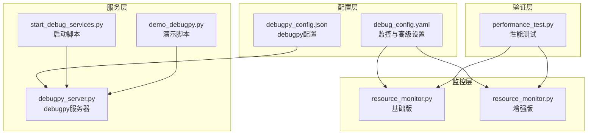
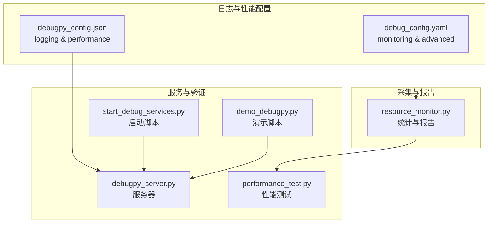
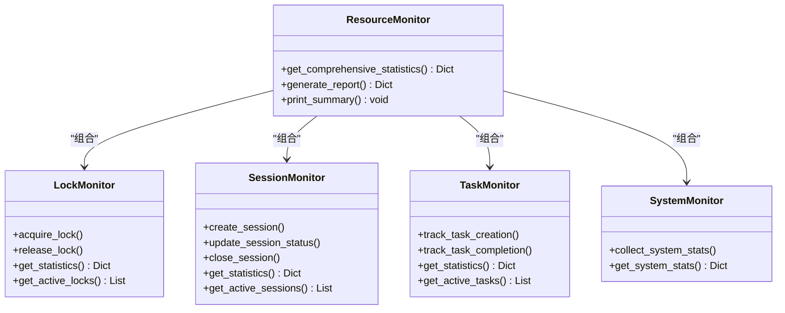
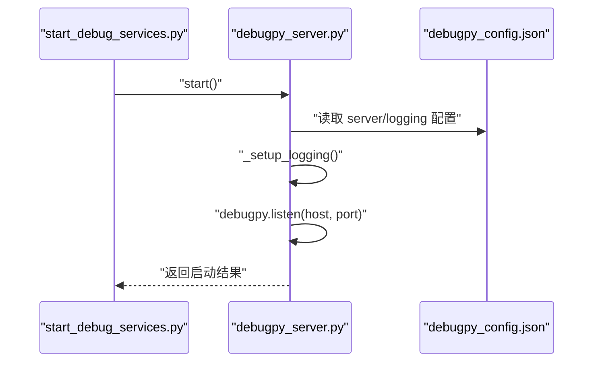
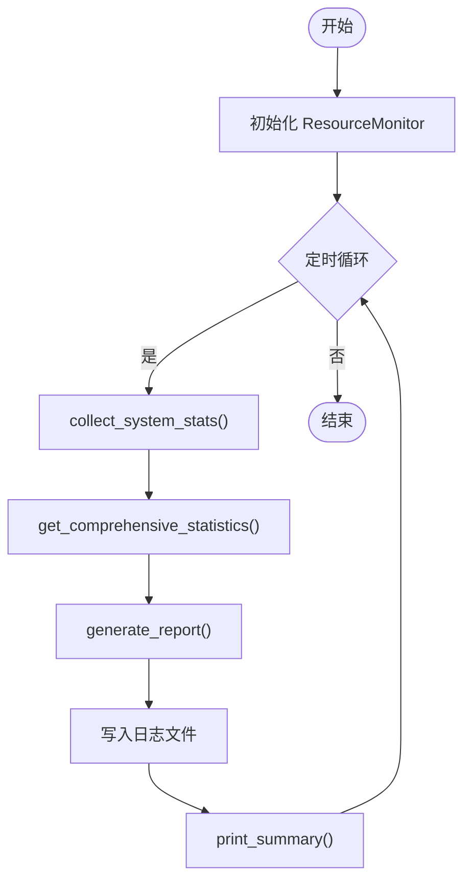
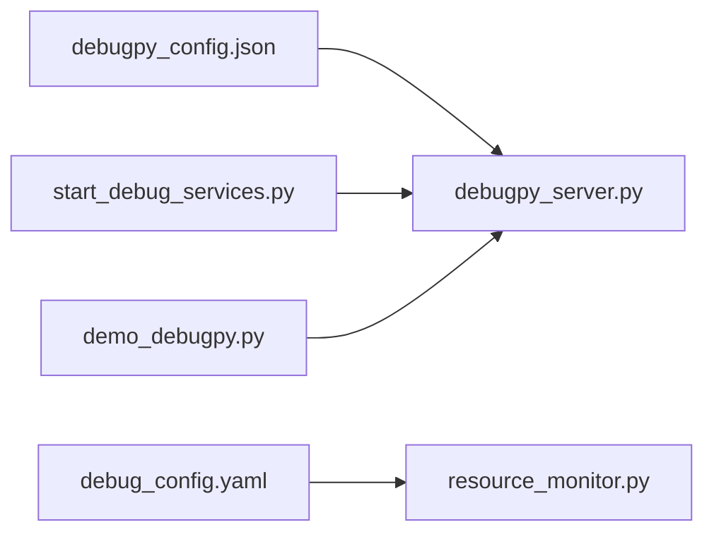

# 日志与性能配置

<cite>
**本文引用的文件**
- [debug_config.yaml](file://BUGFIX_20260107/configs/debug_config.yaml)
- [debugpy_config.json](file://BUGFIX_20260107/configs/debugpy_config.json)
- [resource_monitor.py（基础版）](file://BUGFIX_20260107/debug_suite/resource_monitor.py)
- [resource_monitor.py（增强版）](file://BUGFIX_20260107/enhanced_debug_suite/resource_monitor.py)
- [debugpy_server.py](file://autoBMAD/epic_automation/debugpy_integration/debugpy_server.py)
- [performance_test.py](file://BUGFIX_20260107/validation_scripts/performance_test.py)
- [start_debug_services.py](file://BUGFIX_20260107/start_debug_services.py)
- [demo_debugpy.py](file://BUGFIX_20260107/demo_debugpy.py)
</cite>

## 目录
1. [简介](#简介)
2. [项目结构](#项目结构)
3. [核心组件](#核心组件)
4. [架构总览](#架构总览)
5. [详细组件分析](#详细组件分析)
6. [依赖关系分析](#依赖关系分析)
7. [性能考量](#性能考量)
8. [故障排查指南](#故障排查指南)
9. [结论](#结论)
10. [附录](#附录)

## 简介
本文件围绕“日志与性能配置”主题，系统解析以下内容：
- debugpy_config.json 中 logging 和 performance 的各项配置项及其含义
- debug_config.yaml 中 monitoring 与 advanced 的资源监控、性能跟踪与内存管理协同策略
- 基于 resource_monitor.py 的实时性能数据采集与日志分析集成方案
- 面向不同调试场景（开发/测试/生产）的日志详细程度与性能监控粒度调整建议
- 如何避免调试开销对系统性能造成过大影响

## 项目结构
围绕日志与性能配置的关键文件分布如下：
- 配置层：debug_config.yaml（框架级）、debugpy_config.json（debugpy）
- 监控层：resource_monitor.py（基础/增强版）
- 服务层：debugpy_server.py、start_debug_services.py、demo_debugpy.py
- 验证层：performance_test.py

图表来源
- [debug_config.yaml](file://BUGFIX_20260107/configs/debug_config.yaml#L56-L113)
- [debugpy_config.json](file://BUGFIX_20260107/configs/debugpy_config.json#L41-L54)
- [resource_monitor.py（基础版）](file://BUGFIX_20260107/debug_suite/resource_monitor.py#L358-L451)
- [resource_monitor.py（增强版）](file://BUGFIX_20260107/enhanced_debug_suite/resource_monitor.py#L358-L451)
- [debugpy_server.py](file://autoBMAD/epic_automation/debugpy_integration/debugpy_server.py#L53-L128)
- [start_debug_services.py](file://BUGFIX_20260107/start_debug_services.py#L20-L80)
- [demo_debugpy.py](file://BUGFIX_20260107/demo_debugpy.py#L32-L117)
- [performance_test.py](file://BUGFIX_20260107/validation_scripts/performance_test.py#L26-L120)

章节来源
- [debug_config.yaml](file://BUGFIX_20260107/configs/debug_config.yaml#L56-L113)
- [debugpy_config.json](file://BUGFIX_20260107/configs/debugpy_config.json#L41-L54)
- [resource_monitor.py（基础版）](file://BUGFIX_20260107/debug_suite/resource_monitor.py#L358-L451)
- [resource_monitor.py（增强版）](file://BUGFIX_20260107/enhanced_debug_suite/resource_monitor.py#L358-L451)
- [debugpy_server.py](file://autoBMAD/epic_automation/debugpy_integration/debugpy_server.py#L53-L128)
- [start_debug_services.py](file://BUGFIX_20260107/start_debug_services.py#L20-L80)
- [demo_debugpy.py](file://BUGFIX_20260107/demo_debugpy.py#L32-L117)
- [performance_test.py](file://BUGFIX_20260107/validation_scripts/performance_test.py#L26-L120)

## 核心组件
- debugpy_config.json 的 logging 配置要点
  - 日志级别：DEBUG
  - 输出目标：文件 logs/debugpy.log，同时可启用控制台输出
  - 文件轮转：单文件最大大小 100MB，保留 5 个备份
  - 格式化输出：包含时间戳、名称、级别与消息
- debugpy_config.json 的 performance 配置要点
  - 最大内存限制：512MB
  - GC 阈值：100
  - 事件循环监控：开启
  - 任务跟踪：开启
- debug_config.yaml 的 monitoring 与 advanced 配置要点
  - monitoring.resource_monitoring：周期性采集 CPU、内存、线程、任务、事件循环等指标
  - monitoring.performance_tracking：开启操作与会话跟踪，并设定指标保留数量
  - monitoring.log_aggregation：结构化日志聚合，限制单文件大小与备份数量
  - advanced.memory：内存上限、GC 阈值、分配跟踪开关
  - advanced.threading：最大工作线程数、线程池大小、线程创建监控
  - advanced.event_loop：事件循环创建监控、阻塞检测、监控间隔
- resource_monitor.py 的实时采集与报告
  - 提供锁、会话、任务、系统资源的统计与报告
  - 生成 JSON 报告并写入日志文件
  - 提供摘要打印与活跃资源展示

章节来源
- [debugpy_config.json](file://BUGFIX_20260107/configs/debugpy_config.json#L41-L54)
- [debug_config.yaml](file://BUGFIX_20260107/configs/debug_config.yaml#L59-L85)
- [debug_config.yaml](file://BUGFIX_20260107/configs/debug_config.yaml#L239-L257)
- [resource_monitor.py（基础版）](file://BUGFIX_20260107/debug_suite/resource_monitor.py#L358-L451)
- [resource_monitor.py（增强版）](file://BUGFIX_20260107/enhanced_debug_suite/resource_monitor.py#L358-L451)

## 架构总览
下图展示了日志与性能配置在系统中的协同关系：debugpy_config.json 控制 debugpy 的日志与性能行为；debug_config.yaml 控制框架级监控与高级设置；resource_monitor.py 作为采集与报告工具，与上述配置共同构成可观测性闭环。

图表来源
- [debugpy_config.json](file://BUGFIX_20260107/configs/debugpy_config.json#L41-L54)
- [debug_config.yaml](file://BUGFIX_20260107/configs/debug_config.yaml#L59-L85)
- [resource_monitor.py（基础版）](file://BUGFIX_20260107/debug_suite/resource_monitor.py#L358-L451)
- [debugpy_server.py](file://autoBMAD/epic_automation/debugpy_integration/debugpy_server.py#L53-L128)
- [start_debug_services.py](file://BUGFIX_20260107/start_debug_services.py#L20-L80)
- [demo_debugpy.py](file://BUGFIX_20260107/demo_debugpy.py#L32-L117)
- [performance_test.py](file://BUGFIX_20260107/validation_scripts/performance_test.py#L26-L120)

## 详细组件分析

### debugpy_config.json 的 logging 配置
- 日志级别：DEBUG
- 输出目标：文件 logs/debugpy.log，同时可启用控制台输出
- 文件轮转：单文件最大大小 100MB，保留 5 个备份
- 格式化输出：包含时间戳、名称、级别与消息
- 作用：为 debugpy 服务器与客户端提供统一的日志入口，便于问题定位与审计

章节来源
- [debugpy_config.json](file://BUGFIX_20260107/configs/debugpy_config.json#L41-L48)

### debugpy_config.json 的 performance 配置
- 最大内存限制：512MB
- GC 阈值：100
- 事件循环监控：开启
- 任务跟踪：开启
- 作用：限制调试进程内存占用，降低 GC 压力，同时监控事件循环与任务生命周期，辅助发现阻塞与泄漏

章节来源
- [debugpy_config.json](file://BUGFIX_20260107/configs/debugpy_config.json#L49-L54)

### debug_config.yaml 的 monitoring 配置
- 资源监控：周期 5 秒，采集 CPU、内存、线程、任务、事件循环
- 性能跟踪：开启操作与会话跟踪，指标保留 100 条
- 日志聚合：结构化日志，单文件最大 100MB，最多 10 个备份
- 协同效应：与 debugpy 的性能配置形成互补，前者侧重调试期的轻量观测，后者侧重运行期的资源与性能约束

章节来源
- [debug_config.yaml](file://BUGFIX_20260107/configs/debug_config.yaml#L59-L85)

### debug_config.yaml 的 advanced 配置
- 内存管理：内存上限、GC 阈值、分配跟踪开关
- 线程：最大工作线程数、线程池大小、线程创建监控
- 事件循环：事件循环创建监控、阻塞检测、监控间隔
- 协同效应：与 debugpy 的性能配置共同构建“调试期轻量观测 + 运行期严格约束”的双轨策略

章节来源
- [debug_config.yaml](file://BUGFIX_20260107/configs/debug_config.yaml#L239-L257)

### resource_monitor.py 的实时采集与报告
- 统计维度：锁、会话、任务、系统资源
- 输出形式：JSON 报告文件与控制台摘要
- 关键能力：
  - 锁监控：获取/释放/超时/泄漏统计
  - 会话监控：创建/更新/关闭/失败统计
  - 任务监控：创建/完成/长任务统计
  - 系统监控：CPU、内存、进程资源采样与平均值
- 与配置的联动：
  - 日志格式与文件名由实现内定义，可结合 debugpy 的日志配置统一管理
  - 与 debug_config.yaml 的 monitoring.interval 协同，形成周期性观测

图表来源
- [resource_monitor.py（基础版）](file://BUGFIX_20260107/debug_suite/resource_monitor.py#L358-L451)
- [resource_monitor.py（增强版）](file://BUGFIX_20260107/enhanced_debug_suite/resource_monitor.py#L358-L451)

章节来源
- [resource_monitor.py（基础版）](file://BUGFIX_20260107/debug_suite/resource_monitor.py#L358-L451)
- [resource_monitor.py（增强版）](file://BUGFIX_20260107/enhanced_debug_suite/resource_monitor.py#L358-L451)

### debugpy_server.py 的日志配置与启动流程
- 日志初始化：根据配置选择日志级别，支持控制台与文件输出
- 启动流程：监听主机与端口，配置 debugpy，记录启动信息
- 与 debugpy_config.json 的联动：读取 server、logging、features 等配置项

图表来源
- [start_debug_services.py](file://BUGFIX_20260107/start_debug_services.py#L20-L80)
- [debugpy_server.py](file://autoBMAD/epic_automation/debugpy_integration/debugpy_server.py#L53-L128)
- [debugpy_config.json](file://BUGFIX_20260107/configs/debugpy_config.json#L8-L20)

章节来源
- [start_debug_services.py](file://BUGFIX_20260107/start_debug_services.py#L20-L80)
- [debugpy_server.py](file://autoBMAD/epic_automation/debugpy_integration/debugpy_server.py#L53-L128)
- [debugpy_config.json](file://BUGFIX_20260107/configs/debugpy_config.json#L8-L20)

### 基于 resource_monitor.py 的实时性能数据采集与日志分析集成方案
- 数据采集
  - 使用 ResourceMonitor 的上下文管理器监控锁与会话，自动记录事件与统计
  - 定期调用 get_comprehensive_statistics 获取综合统计与活跃资源
- 日志与报告
  - 自动生成 JSON 报告文件，便于后续分析
  - 提供 print_summary 输出到控制台，快速查看关键指标
- 与性能测试的结合
  - performance_test.py 可直接导入并使用 ResourceMonitor 的统计接口进行对比分析

图表来源
- [resource_monitor.py（基础版）](file://BUGFIX_20260107/debug_suite/resource_monitor.py#L420-L451)
- [performance_test.py](file://BUGFIX_20260107/validation_scripts/performance_test.py#L26-L120)

章节来源
- [resource_monitor.py（基础版）](file://BUGFIX_20260107/debug_suite/resource_monitor.py#L420-L451)
- [performance_test.py](file://BUGFIX_20260107/validation_scripts/performance_test.py#L26-L120)

## 依赖关系分析
- debugpy_config.json 与 debugpy_server.py
  - debugpy_server.py 依据 debugpy_config.json 的 server 与 logging 字段进行初始化与启动
- debug_config.yaml 与 resource_monitor.py
  - resource_monitor.py 的统计口径与 debug_config.yaml 的 monitoring.interval 协同，形成周期性观测
- start_debug_services.py 与 demo_debugpy.py
  - 两者均依赖 debugpy_server.py 启动调试服务，demo 用于演示指标收集与统计

图表来源
- [debugpy_config.json](file://BUGFIX_20260107/configs/debugpy_config.json#L8-L20)
- [debugpy_server.py](file://autoBMAD/epic_automation/debugpy_integration/debugpy_server.py#L53-L128)
- [debug_config.yaml](file://BUGFIX_20260107/configs/debug_config.yaml#L59-L85)
- [resource_monitor.py（基础版）](file://BUGFIX_20260107/debug_suite/resource_monitor.py#L358-L451)
- [start_debug_services.py](file://BUGFIX_20260107/start_debug_services.py#L20-L80)
- [demo_debugpy.py](file://BUGFIX_20260107/demo_debugpy.py#L32-L117)

章节来源
- [debugpy_server.py](file://autoBMAD/epic_automation/debugpy_integration/debugpy_server.py#L53-L128)
- [debug_config.yaml](file://BUGFIX_20260107/configs/debug_config.yaml#L59-L85)
- [resource_monitor.py（基础版）](file://BUGFIX_20260107/debug_suite/resource_monitor.py#L358-L451)
- [start_debug_services.py](file://BUGFIX_20260107/start_debug_services.py#L20-L80)
- [demo_debugpy.py](file://BUGFIX_20260107/demo_debugpy.py#L32-L117)

## 性能考量
- 调试期与运行期的平衡
  - 调试期：适度开启 debugpy 的性能监控与任务跟踪，配合较小的内存上限与 GC 阈值，避免调试态对系统造成显著负担
  - 运行期：利用 debug_config.yaml 的 advanced.memory 与 advanced.event_loop 对内存与事件循环进行约束，减少阻塞风险
- 日志与轮转
  - 合理设置日志级别与文件大小，避免磁盘 IO 压力过大
  - 结合结构化日志聚合，便于集中分析
- 监控粒度
  - monitoring.interval 与 resource_monitor 的采样频率应匹配，避免过度采样导致额外开销
- 生产环境建议
  - 默认关闭或降低 debug 模式，仅在问题复现时临时开启
  - 将日志与性能监控作为“按需开关”，避免长期高开销运行

[本节为通用指导，不直接分析具体文件]

## 故障排查指南
- debugpy 无法启动或无日志
  - 检查 debugpy 是否安装，确认 debugpy_server.py 的日志初始化是否正确
  - 核对 debugpy_config.json 的 server.host/port 与 logging.file
- 资源监控缺失或异常
  - 确认 resource_monitor.py 的统计接口被调用，检查 generate_report 是否生成报告文件
  - 对比 debug_config.yaml 的 monitoring.interval 与实际采样频率
- 性能测试异常
  - performance_test.py 依赖固定模块，确保相关模块可用且路径正确
  - 若出现外部依赖错误，测试会跳过并记录原因，需按提示修复

章节来源
- [debugpy_server.py](file://autoBMAD/epic_automation/debugpy_integration/debugpy_server.py#L53-L128)
- [debugpy_config.json](file://BUGFIX_20260107/configs/debugpy_config.json#L8-L20)
- [resource_monitor.py（基础版）](file://BUGFIX_20260107/debug_suite/resource_monitor.py#L420-L451)
- [performance_test.py](file://BUGFIX_20260107/validation_scripts/performance_test.py#L26-L120)

## 结论
- debugpy_config.json 的 logging 与 performance 为调试期提供了可控的日志输出与资源约束
- debug_config.yaml 的 monitoring 与 advanced 为运行期提供了可观测性与资源管理保障
- resource_monitor.py 作为采集与报告工具，与上述配置协同，形成从“采样—统计—报告—分析”的闭环
- 建议在不同场景下动态调整日志详细程度与监控粒度，避免调试开销影响系统性能

[本节为总结性内容，不直接分析具体文件]

## 附录
- 场景化配置建议
  - 开发：开启 debugpy 的性能监控与任务跟踪，日志级别 DEBUG；resource_monitor 采样间隔短，便于快速定位问题
  - 测试：适度降低采样频率，开启结构化日志聚合，关注关键指标波动
  - 生产：默认关闭或降级 debug 模式，仅在问题复现时临时开启，严格控制日志大小与轮转
- 关键参数速览
  - debugpy_config.json：logging.level、logging.file、logging.max_size_mb、logging.backup_count、performance.max_memory_mb、performance.gc_threshold、performance.event_loop_monitoring、performance.task_tracking
  - debug_config.yaml：monitoring.resource_monitoring.interval、monitoring.log_aggregation.max_log_size、monitoring.log_aggregation.max_log_files、advanced.memory.limit_mb、advanced.memory.gc_threshold、advanced.event_loop.loop_monitoring_interval

[本节为概览性内容，不直接分析具体文件]