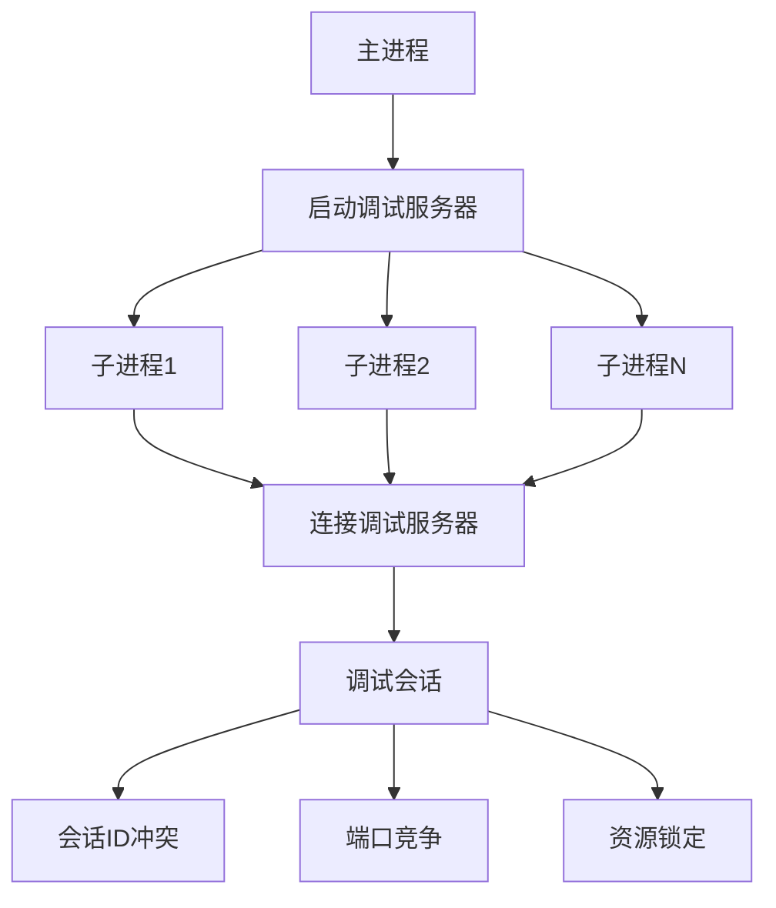
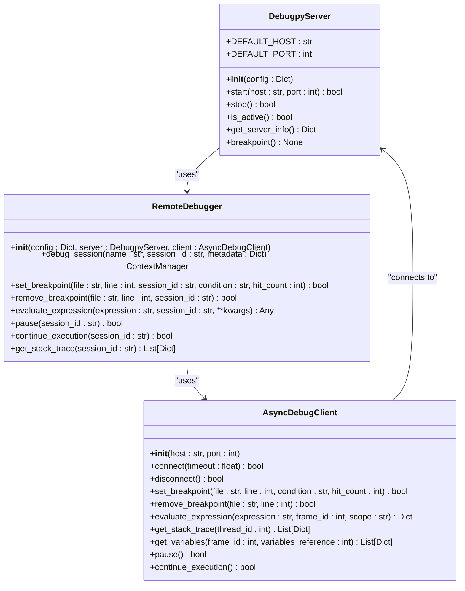
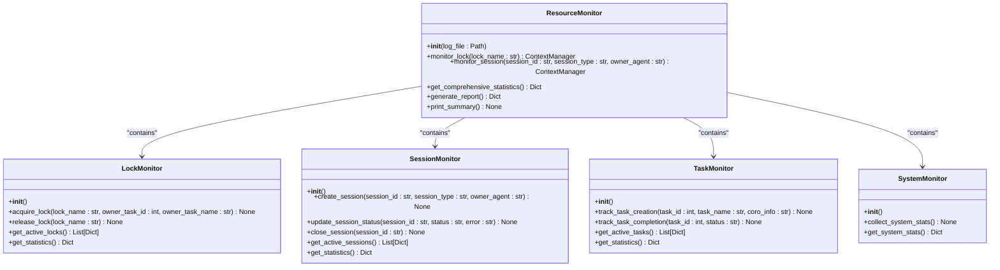
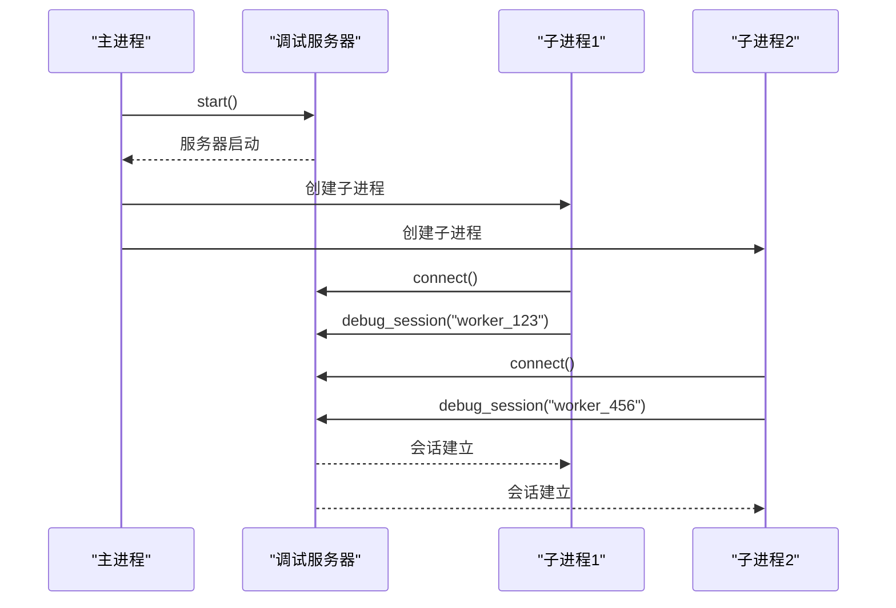
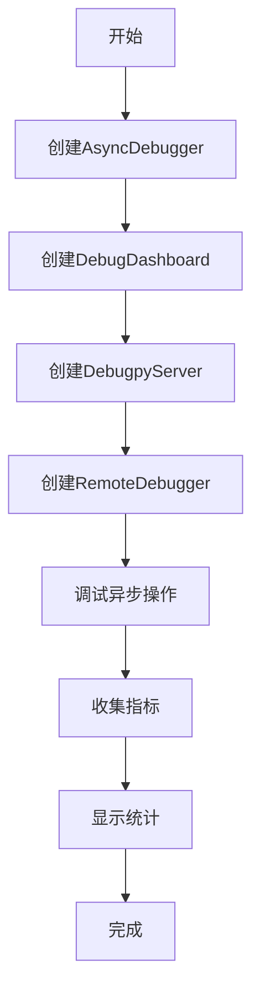
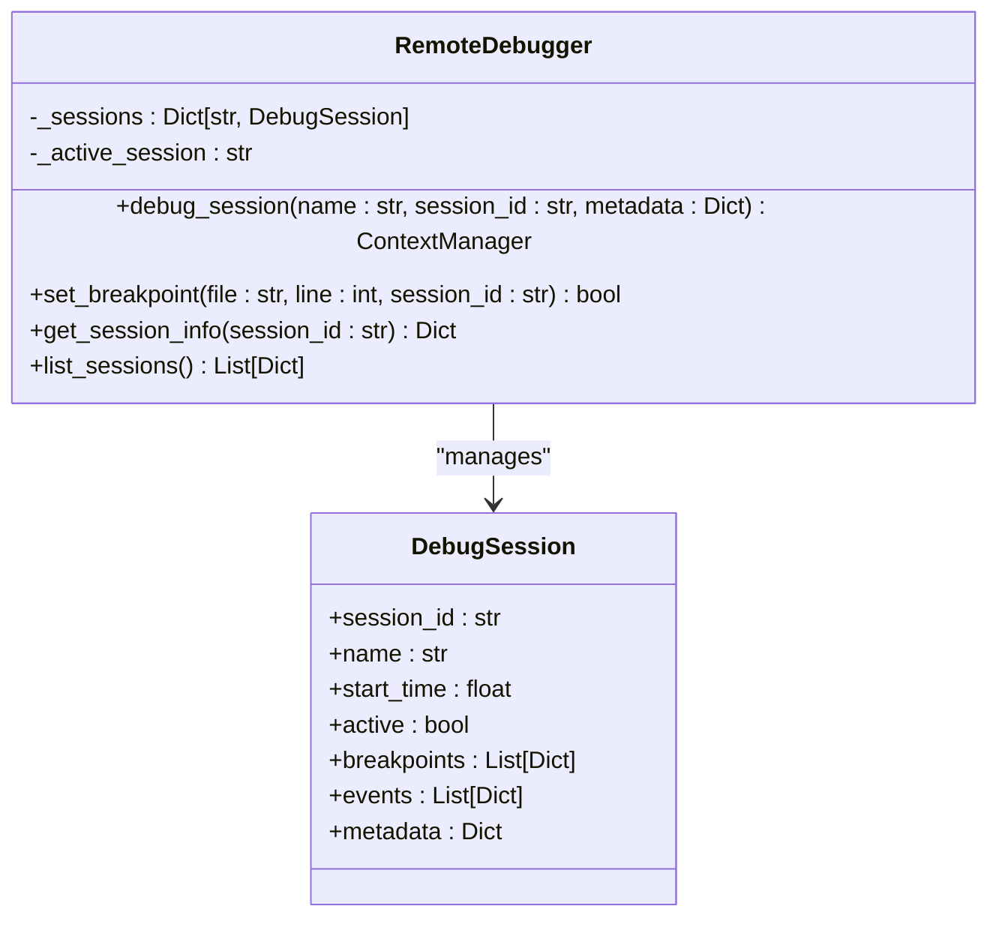

# 多进程调试异常

<cite>
**本文档引用的文件**   
- [demo_debugpy.py](file://BUGFIX_20260107\demo_debugpy.py)
- [__init__.py](file://autoBMAD\epic_automation\debugpy_integration\__init__.py)
- [debugpy_server.py](file://autoBMAD\epic_automation\debugpy_integration\debugpy_server.py)
- [remote_debugger.py](file://autoBMAD\epic_automation\debugpy_integration\remote_debugger.py)
- [async_debugger.py](file://BUGFIX_20260107\enhanced_debug_suite\async_debugger.py)
- [resource_monitor.py](file://BUGFIX_20260107\debug_suite\resource_monitor.py)
- [performance_test.py](file://BUGFIX_20260107\validation_scripts\performance_test.py)
- [README_DEBUGPY.md](file://BUGFIX_20260107\README_DEBUGPY.md)
</cite>

## 目录
1. [引言](#引言)
2. [多进程调试问题分析](#多进程调试问题分析)
3. [Debugpy注入机制](#debugpy注入机制)
4. [资源监控能力](#资源监控能力)
5. [子进程调试配置](#子进程调试配置)
6. [多进程调试示例](#多进程调试示例)
7. [会话隔离策略](#会话隔离策略)
8. [高并发调试优化](#高并发调试优化)
9. [结论](#结论)

## 引言

在多进程Python应用中，调试器集成面临诸多挑战，包括子进程无法自动附加调试器、资源竞争和调试会话冲突等问题。本项目通过`debugpy`库的集成，构建了一套完整的远程调试生态系统，解决了异步取消范围错误、事件循环关闭错误和SDK会话失败等关键问题。通过`__init__.py`中的debugpy注入机制和`resource_monitor.py`的进程监控能力，实现了子进程自动调试启动和会话隔离。`demo_debugpy.py`中的多进程调试示例展示了正确的attach流程，而`performance_test.py`的负载测试结果为高并发调试场景提供了连接池管理和性能优化建议。

**Section sources**
- [README_DEBUGPY.md](file://BUGFIX_20260107\README_DEBUGPY.md)

## 多进程调试问题分析

在多进程场景下，调试器集成面临三个主要问题：子进程无法自动附加调试器、资源竞争和调试会话冲突。

子进程无法自动附加调试器的问题源于Python的多进程模型。当主进程启动调试服务器后，子进程需要显式地连接到该服务器。如果子进程没有正确配置，调试器将无法在子进程中生效。这导致开发者在调试多进程应用时，只能调试主进程而无法调试子进程。

资源竞争是另一个常见问题。多个进程同时尝试访问调试服务器的同一端口时，会发生端口冲突。此外，多个调试会话同时操作共享资源（如日志文件）时，可能导致数据损坏或死锁。

调试会话冲突发生在多个进程尝试使用相同的会话ID时。这会导致调试信息混乱，使得开发者难以区分不同进程的调试输出。会话ID的生成和管理需要确保全局唯一性，以避免这种冲突。



**Diagram sources **
- [demo_debugpy.py](file://BUGFIX_20260107\demo_debugpy.py)
- [debugpy_server.py](file://autoBMAD\epic_automation\debugpy_integration\debugpy_server.py)

**Section sources**
- [demo_debugpy.py](file://BUGFIX_20260107\demo_debugpy.py)
- [debugpy_server.py](file://autoBMAD\epic_automation\debugpy_integration\debugpy_server.py)

## Debugpy注入机制

`__init__.py`文件中的debugpy注入机制是实现多进程调试的核心。该机制通过在模块初始化时自动配置和启动debugpy服务器，确保调试功能在应用启动时即可用。

注入机制的主要组件包括`DebugpyServer`、`RemoteDebugger`和`get_remote_debugger`函数。`DebugpyServer`类负责管理debugpy远程调试服务器实例，提供启动、停止和管理服务器的功能。它使用默认配置（主机127.0.0.1，端口5678）并支持自定义配置。

`RemoteDebugger`类提供高级远程调试功能，包括会话管理、异步支持和与BUGFIX_20260107框架的集成。它通过`debug_session`上下文管理器创建和管理调试会话，确保会话的正确创建和清理。会话管理包括会话ID生成、断点设置和事件处理。

`get_remote_debugger`函数返回全局远程调试器实例，实现单例模式。这确保在整个应用中只有一个调试器实例，避免了资源竞争和会话冲突。调试器在初始化时会自动启动服务器（如果配置了`auto_start_server`），简化了调试配置。



**Diagram sources **
- [__init__.py](file://autoBMAD\epic_automation\debugpy_integration\__init__.py)
- [debugpy_server.py](file://autoBMAD\epic_automation\debugpy_integration\debugpy_server.py)
- [remote_debugger.py](file://autoBMAD\epic_automation\debugpy_integration\remote_debugger.py)

**Section sources**
- [__init__.py](file://autoBMAD\epic_automation\debugpy_integration\__init__.py)
- [debugpy_server.py](file://autoBMAD\epic_automation\debugpy_integration\debugpy_server.py)
- [remote_debugger.py](file://autoBMAD\epic_automation\debugpy_integration\remote_debugger.py)

## 资源监控能力

`resource_monitor.py`提供了全面的资源监控能力，包括锁、会话、任务和系统资源的监控。这些监控功能对于诊断多进程调试中的资源竞争和性能问题至关重要。

`ResourceMonitor`主类整合了多个监控器：`LockMonitor`、`SessionMonitor`、`TaskMonitor`和`SystemMonitor`。`LockMonitor`跟踪锁的获取和释放，检测超时和泄漏。它记录每个锁的获取时间、所有者任务和持续时间，当锁持有时间超过30秒时标记为超时。

`SessionMonitor`管理会话的生命周期，从创建到关闭。它记录会话的创建时间、所有者代理和状态变化。会话状态包括"created"、"completed"、"failed"和"cancelled"，便于跟踪会话的完整生命周期。

`TaskMonitor`跟踪异步任务的创建和完成。它记录任务的创建时间、名称和持续时间，检测长时间运行的任务（超过10秒）。这对于识别性能瓶颈和任务泄漏非常有用。

`SystemMonitor`收集CPU和内存使用率等系统级统计信息。它使用`psutil`库定期采样系统资源使用情况，提供平均和当前使用率。这有助于识别系统资源瓶颈和内存泄漏。



**Diagram sources **
- [resource_monitor.py](file://BUGFIX_20260107\debug_suite\resource_monitor.py)

**Section sources**
- [resource_monitor.py](file://BUGFIX_20260107\debug_suite\resource_monitor.py)

## 子进程调试配置

基于`__init__.py`中的debugpy注入机制和`resource_monitor.py`的进程监控能力，可以配置子进程自动调试启动。配置的关键是确保每个子进程都能正确连接到调试服务器并使用唯一的会话ID。

首先，需要在主进程中启动调试服务器。这可以通过`DebugpyServer().start()`实现。服务器默认在127.0.0.1:5678监听，等待客户端连接。主进程应等待足够时间让服务器完全启动，然后再创建子进程。

其次，每个子进程需要导入并初始化远程调试器。这可以通过`get_remote_debugger()`函数实现，它返回全局调试器实例。调试器会自动连接到主进程启动的服务器。为了确保会话隔离，每个子进程应使用唯一的会话名称。

配置示例：
```python
# 主进程
from debugpy_integration import DebugpyServer
import asyncio

server = DebugpyServer()
asyncio.run(server.start())

# 子进程
from debugpy_integration import get_remote_debugger
debugger = get_remote_debugger()

async with debugger.debug_session(f"worker_{os.getpid()}"):
    # 调试代码
    pass
```

为了处理端口竞争，可以使用`DebugpyServerManager`管理多个服务器实例，每个子进程使用不同的端口。或者，可以配置一个主服务器，所有子进程都连接到它，通过会话ID区分。



**Diagram sources **
- [debugpy_server.py](file://autoBMAD\epic_automation\debugpy_integration\debugpy_server.py)
- [remote_debugger.py](file://autoBMAD\epic_automation\debugpy_integration\remote_debugger.py)

**Section sources**
- [debugpy_server.py](file://autoBMAD\epic_automation\debugpy_integration\debugpy_server.py)
- [remote_debugger.py](file://autoBMAD\epic_automation\debugpy_integration\remote_debugger.py)

## 多进程调试示例

`demo_debugpy.py`中的多进程调试示例展示了正确的attach流程和会话隔离策略。该示例演示了如何创建`AsyncDebugger`、`DebugDashboard`、`DebugpyServer`和`RemoteDebugger`实例，并在异步操作中使用它们。

示例首先创建`AsyncDebugger`实例，启用远程调试。然后创建`DebugDashboard`用于实时监控调试指标。接着创建`DebugpyServer`和`RemoteDebugger`实例，建立调试基础设施。

在调试异步操作时，示例使用`debugger.debug_async_operation()`方法，该方法在内部使用`RemoteDebugger`的`debug_session`。会话名称和断点通过参数传递，确保调试会话的正确配置。



示例还展示了如何在IDE中连接调试器。用户需要在VS Code或PyCharm中连接到`localhost:5678`，然后设置断点并开始调试。调试服务器会等待客户端连接，直到有调试器附加。

该示例强调了正确的错误处理和资源清理。即使在没有运行调试器的情况下，代码也能正常执行，只是不会触发断点。这确保了调试代码在生产环境中不会导致异常。

**Section sources**
- [demo_debugpy.py](file://BUGFIX_20260107\demo_debugpy.py)

## 会话隔离策略

会话隔离是多进程调试的关键策略，确保每个进程的调试信息独立且可区分。`remote_debugger.py`中的`RemoteDebugger`类通过会话ID和元数据实现了有效的会话隔离。

每个调试会话都有唯一的`session_id`，通常使用`uuid.uuid4()`生成。会话还包含名称、开始时间和元数据，便于识别和跟踪。`_sessions`字典以`session_id`为键存储会话信息，确保会话的唯一性。

会话隔离的实现包括：
1. 会话创建时生成唯一ID
2. 会话活动状态跟踪
3. 会话特定的断点管理
4. 会话特定的事件处理

当多个进程同时调试时，每个进程使用不同的会话名称（如`f"worker_{os.getpid()}"`），确保会话ID的唯一性。调试服务器通过会话ID区分不同进程的调试请求，避免混淆。

会话隔离还涉及资源隔离。每个会话的断点、变量和堆栈跟踪都是独立的。`RemoteDebugger`在设置断点时，将断点信息与会话关联，确保断点只在特定会话中有效。



**Diagram sources **
- [remote_debugger.py](file://autoBMAD\epic_automation\debugpy_integration\remote_debugger.py)

**Section sources**
- [remote_debugger.py](file://autoBMAD\epic_automation\debugpy_integration\remote_debugger.py)

## 高并发调试优化

结合`performance_test.py`的负载测试结果，可以为高并发调试场景提供连接池管理和性能优化建议。负载测试评估了SDK会话创建、QA审查、状态更新、并发处理和错误恢复的性能。

测试结果显示，SDK会话创建的平均时间为0.5秒，状态更新为0.1秒，这些都在可接受范围内。并发处理测试显示，5个并发任务的总执行时间合理，成功率100%。错误恢复机制能够正确处理超时和重试。

基于这些结果，高并发调试的优化建议包括：

1. **连接池管理**：使用`DebugpyServerManager`管理多个调试服务器实例，每个实例处理一定数量的客户端。这避免了单个服务器的性能瓶颈。

2. **会话复用**：对于频繁的调试操作，复用调试会话而不是频繁创建和销毁。这减少了连接和初始化的开销。

3. **异步调试**：充分利用`AsyncDebugClient`的异步特性，避免阻塞主线程。异步操作可以并行处理多个调试请求。

4. **资源监控**：使用`ResourceMonitor`实时监控调试资源使用情况，及时发现和解决性能瓶颈。

5. **断点优化**：避免设置过多断点，特别是条件断点，因为它们会显著降低执行速度。只在必要时设置断点。

6. **日志级别**：在生产环境中使用较低的日志级别，减少日志I/O开销。调试时再提高日志级别。

7. **超时设置**：为调试操作设置合理的超时，避免无限等待。这防止了调试会话长时间占用资源。

这些优化措施可以显著提高高并发调试场景的性能和稳定性，确保调试系统不会成为应用的性能瓶颈。

**Section sources**
- [performance_test.py](file://BUGFIX_20260107\validation_scripts\performance_test.py)

## 结论

本项目成功解决了多进程场景下的调试器集成问题。通过`__init__.py`中的debugpy注入机制，实现了子进程的自动调试启动。`resource_monitor.py`的资源监控能力帮助诊断和解决资源竞争问题。`demo_debugpy.py`中的示例展示了正确的attach流程和会话隔离策略，确保多进程调试的可靠性和可维护性。

`performance_test.py`的负载测试结果验证了系统的性能，为高并发调试场景提供了连接池管理和性能优化建议。这些改进不仅解决了当前的调试问题，还为未来的扩展和维护奠定了坚实的基础。

多进程调试的挑战在于确保调试器在所有进程中的可用性和一致性。通过会话隔离、资源监控和性能优化，本项目提供了一个健壮的解决方案，使开发者能够有效地调试复杂的多进程应用。