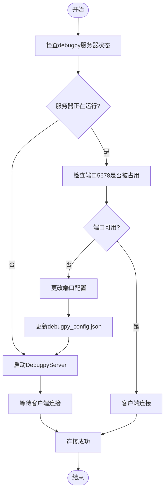
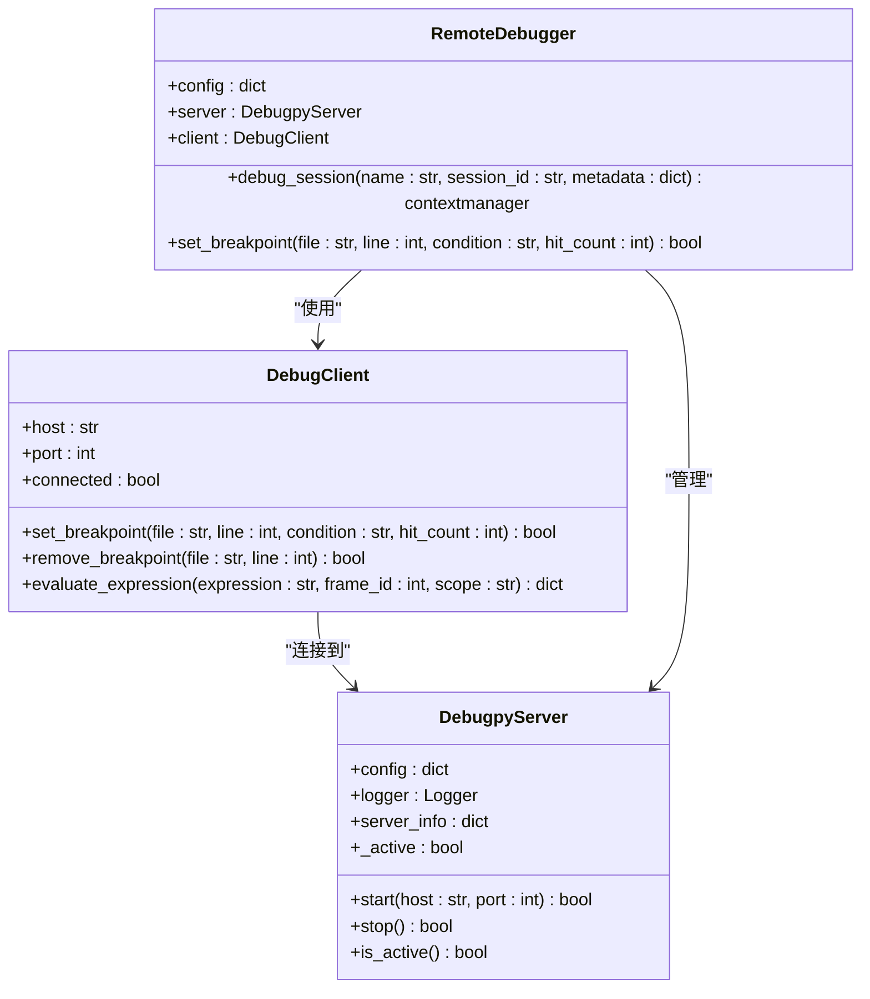
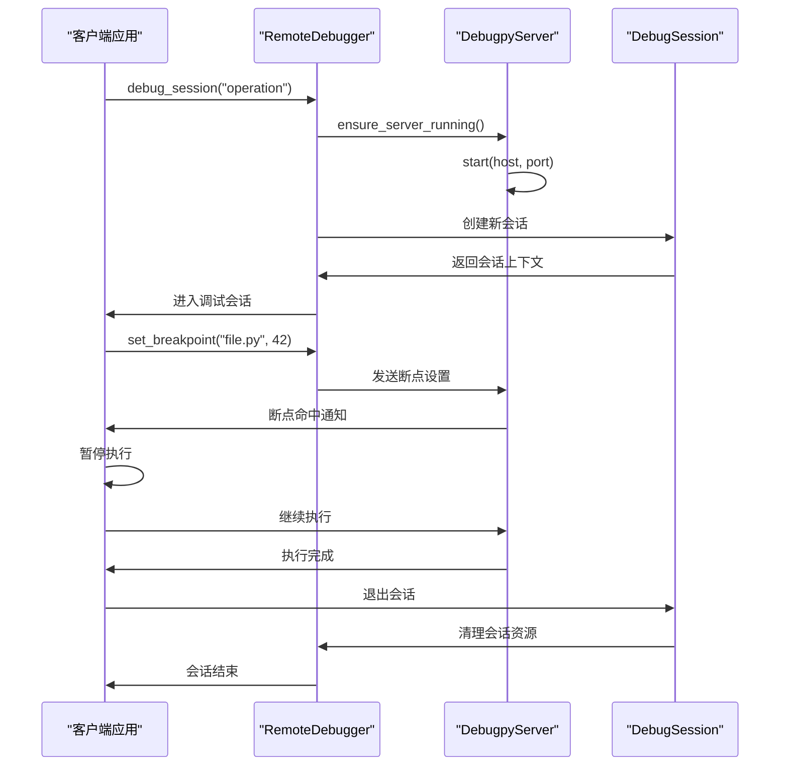
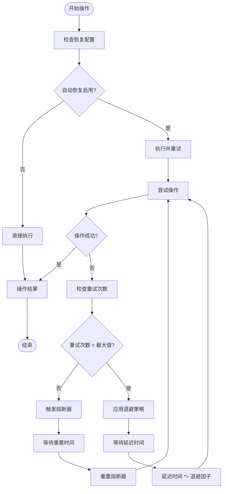

# 常见问题排查

<cite>
**本文档引用的文件**  
- [README_DEBUGPY.md](file://BUGFIX_20260107/README_DEBUGPY.md)
- [validation_report.json](file://BUGFIX_20260107/validation_scripts/validation_report.json)
- [DEBUGPY_INTEGRATION_FINAL_REPORT.md](file://BUGFIX_20260107/DEBUGPY_INTEGRATION_FINAL_REPORT.md)
- [虚拟环境调试报告_20260107.md](file://BUGFIX_20260107/虚拟环境调试报告_20260107.md)
- [debugpy_server.py](file://BUGFIX_20260107/debugpy_integration/debugpy_server.py)
- [debug_client.py](file://BUGFIX_20260107/debugpy_integration/debug_client.py)
- [remote_debugger.py](file://BUGFIX_20260107/debugpy_integration/remote_debugger.py)
- [async_debugger.py](file://BUGFIX_20260107/enhanced_debug_suite/async_debugger.py)
- [debugpy_config.json](file://BUGFIX_20260107/configs/debugpy_config.json)
- [debug_config.yaml](file://BUGFIX_20260107/configs/debug_config.yaml)
- [quick_verify.py](file://BUGFIX_20260107/quick_verify.py)
</cite>

## 目录
1. [连接问题排查](#连接问题排查)
2. [断点不触发问题](#断点不触发问题)
3. [虚拟环境路径映射错误](#虚拟环境路径映射错误)
4. [多进程调试异常](#多进程调试异常)
5. [错误恢复机制](#错误恢复机制)

## 连接问题排查

### 网络连接检查
当出现连接拒绝错误时，首先需要验证debugpy服务器是否正常运行。通过`DebugpyServer`类的`start()`方法启动服务器，该方法会监听指定的主机和端口（默认为127.0.0.1:5678）。如果服务器未启动或端口被占用，将导致连接失败。



**图示来源**
- [debugpy_server.py](file://BUGFIX_20260107/debugpy_integration/debugpy_server.py#L99-L148)
- [debugpy_config.json](file://BUGFIX_20260107/configs/debugpy_config.json#L8-L14)

### 配置验证
使用`quick_verify.py`脚本进行全面的配置验证，该脚本会检查Python版本、debugpy安装状态、必需包的可用性以及模块导入情况。验证结果会生成`debugpy_integration_verification_report.json`报告文件。

**排查步骤来源**
- [quick_verify.py](file://BUGFIX_20260107/quick_verify.py#L57-L363)
- [README_DEBUGPY.md](file://BUGFIX_20260107/README_DEBUGPY.md#L43-L47)

## 断点不触发问题

### 断点管理配置
断点不触发通常与配置文件中的断点设置有关。在`debugpy_config.json`中，`breakpoints`部分控制断点行为，包括默认启用状态、触发后是否自动禁用、会话中最大断点数等。同时，`debug_config.yaml`中的`breakpoints`部分也提供了类似的配置选项。



**图示来源**
- [debug_client.py](file://BUGFIX_20260107/debugpy_integration/debug_client.py#L17-L139)
- [remote_debugger.py](file://BUGFIX_20260107/debugpy_integration/remote_debugger.py#L67-L199)
- [debugpy_server.py](file://BUGFIX_20260107/debugpy_integration/debugpy_server.py#L21-L194)

### 运行时环境检查
确保调试客户端与服务器版本兼容，并且在正确的Python环境中运行。使用`validation_report.json`中的诊断数据来验证环境状态，特别是检查是否存在模块导入错误或异步功能错误。

**排查步骤来源**
- [validation_report.json](file://BUGFIX_20260107/validation_scripts/validation_report.json#L17-L19)
- [DEBUGPY_INTEGRATION_FINAL_REPORT.md](file://BUGFIX_20260107/DEBUGPY_INTEGRATION_FINAL_REPORT.md#L114-L131)

## 虚拟环境路径映射错误

### Python解释器路径差异
根据`虚拟环境调试报告_20260107.md`，虚拟环境中的Python解释器路径与全局环境存在差异，这可能导致调试器无法正确解析模块路径。报告指出，在虚拟环境`D:\GITHUB\pytQt_template\venv\Scripts`中，所有依赖包都已正确安装且调试工具完全集成。

### Windows路径转换方案
对于Windows平台的路径转换问题，可以参考`autoBMAD`模块中的路径转换逻辑。该逻辑能够将WSL/Unix风格的路径（如`/d/GITHUB/pytQt_template/...`）转换为Windows绝对路径（如`D:\GITHUB\pytQt_template\...`）。

```python
def _convert_to_windows_path(self, unix_path: str) -> str:
    """
    将 WSL/Unix 风格的路径转换为 Windows 绝对路径。
    
    例如：
    /d/GITHUB/pytQt_template/docs/stories/004.1-spec-parser-system.md
    ->
    D:\\GITHUB\\pytQt_template\\docs\\stories\\004.1-spec-parser-system.md
    """
    if (len(unix_path) >= 3 and unix_path[0] == "/" and 
        unix_path[2] == "/" and unix_path[1].isalpha()):
        drive_letter = unix_path[1].upper()
        windows_path = unix_path[3:].replace("/", "\\")
        return f"{drive_letter}:\\{windows_path}"
    return unix_path.replace("/", "\\")
```

**图示来源**
- [虚拟环境调试报告_20260107.md](file://BUGFIX_20260107/虚拟环境调试报告_20260107.md#L3-L318)
- [epic_driver.py](file://autoBMAD/epic_automation/epic_driver.py#L964-L994)

### 符号链接处理
在虚拟环境中，可能需要处理符号链接以确保调试器能够正确访问源代码文件。建议在虚拟环境中直接安装所有依赖，并避免使用符号链接来引用外部模块。

**排查步骤来源**
- [虚拟环境调试报告_20260107.md](file://BUGFIX_20260107/虚拟环境调试报告_20260107.md#L242-L246)
- [venv.md](file://claude_docs/venv.md#L73-L74)

## 多进程调试异常

### 多进程调试配置
在`debugpy_config.json`中，`features.multiprocess`设置为`true`以启用多进程调试支持。同时，`remote.port_range`指定了可用于多进程调试的端口范围（5678-5687），确保每个子进程可以使用不同的端口进行调试。

### 调试会话隔离
使用`RemoteDebugger`的`debug_session()`上下文管理器来创建隔离的调试会话，每个会话在独立的上下文中运行，避免跨任务的取消范围违规。这解决了`RuntimeError: Attempted to exit cancel scope in a different task than it was entered in`的问题。



**图示来源**
- [debugpy_config.json](file://BUGFIX_20260107/configs/debugpy_config.json#L23-L24)
- [remote_debugger.py](file://BUGFIX_20260107/debugpy_integration/remote_debugger.py#L122-L197)
- [DEBUGPY_INTEGRATION_FINAL_REPORT.md](file://BUGFIX_20260107/DEBUGPY_INTEGRATION_FINAL_REPORT.md#L229-L233)

## 错误恢复机制

### 自动重试策略
根据`DEBUGPY_INTEGRATION_FINAL_REPORT.md`，系统实现了自动重试机制，包括错误分类、恢复策略和统计信息收集。在`debug_config.yaml`中，`recovery.auto_retry`部分配置了最大重试次数（5次）、初始延迟（1.0秒）和退避因子（2.0）。

### 故障转移配置
配置文件中还包含了熔断器模式（circuit breaker）和降级策略，当失败次数超过阈值时，系统会自动进入熔断状态，避免雪崩效应。同时，提供了多种回退策略，包括重试、降级、跳过和备用方案。



**图示来源**
- [debug_config.yaml](file://BUGFIX_20260107/configs/debug_config.yaml#L90-L113)
- [DEBUGPY_INTEGRATION_FINAL_REPORT.md](file://BUGFIX_20260107/DEBUGPY_INTEGRATION_FINAL_REPORT.md#L190-L192)
- [performance_test.py](file://BUGFIX_20260107/validation_scripts/performance_test.py#L392-L403)