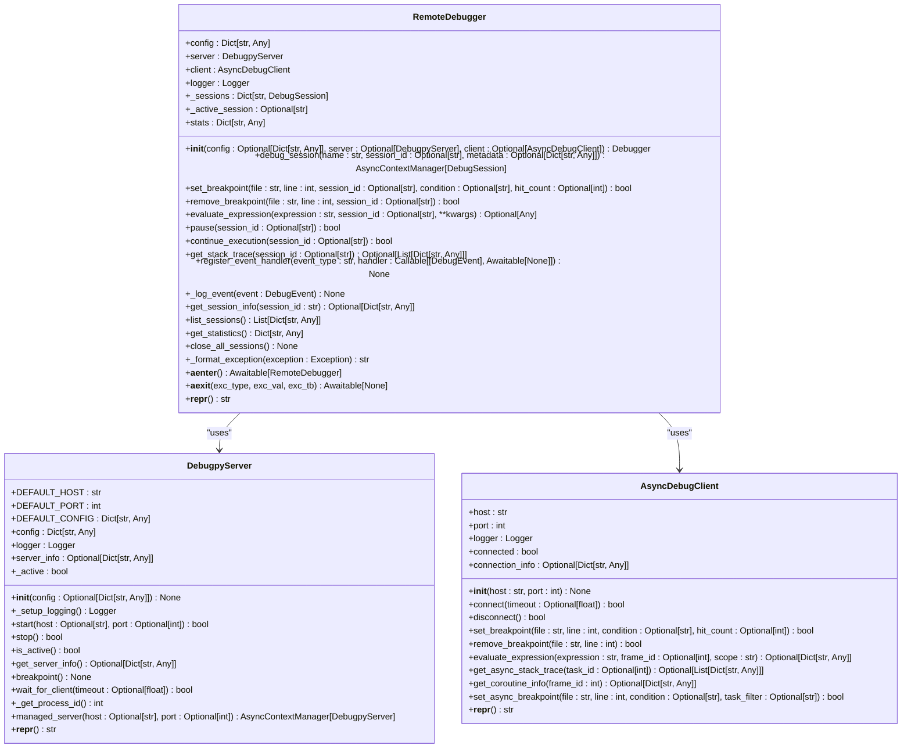
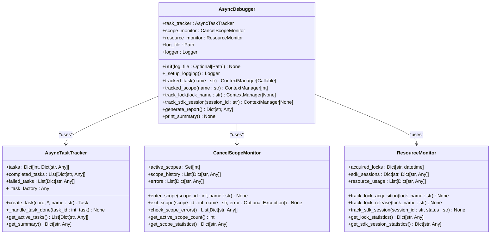
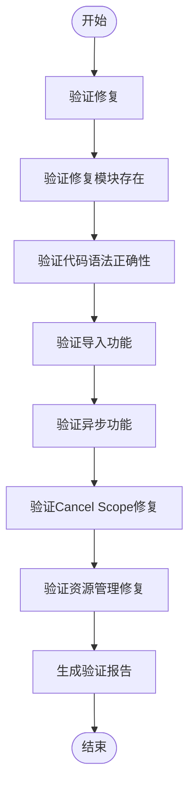

# 断点不触发问题

<cite>
**本文档引用的文件**   
- [async_debugger.py](file://BUGFIX_20260107/debug_suite/async_debugger.py)
- [remote_debugger.py](file://autoBMAD/epic_automation/debugpy_integration/remote_debugger.py)
- [debug_client.py](file://autoBMAD/epic_automation/debugpy_integration/debug_client.py)
- [debugpy_server.py](file://autoBMAD/epic_automation/debugpy_integration/debugpy_server.py)
- [实时调试报告_20260107.md](file://BUGFIX_20260107/实时调试报告_20260107.md)
- [debug_config.yaml](file://BUGFIX_20260107/configs/debug_config.yaml)
- [debugpy_config.json](file://BUGFIX_20260107/configs/debugpy_config.json)
</cite>

## 目录
1. [问题分析](#问题分析)
2. [核心组件](#核心组件)
3. [调试器集成机制](#调试器集成机制)
4. [异步调试支持](#异步调试支持)
5. [配置管理](#配置管理)
6. [实践指南](#实践指南)
7. [验证与测试](#验证与测试)
8. [结论](#结论)

## 问题分析

断点不触发问题主要由异步上下文中断点丢失、源码路径映射错误和调试器协议不匹配导致。通过分析`remote_debugger.py`的断点注册机制和`async_debugger.py`的协程跟踪能力，可以理解调试器如何在asyncio事件循环中正确挂载断点。结合`实时调试报告_20260107.md`中的执行时序数据，可以说明断点延迟激活的常见场景。

**Section sources**
- [remote_debugger.py](file://autoBMAD/epic_automation/debugpy_integration/remote_debugger.py#L1-L683)
- [async_debugger.py](file://BUGFIX_20260107/debug_suite/async_debugger.py#L1-L420)
- [实时调试报告_20260107.md](file://BUGFIX_20260107/实时调试报告_20260107.md#L1-L283)

## 核心组件

`remote_debugger.py`提供了高级远程调试功能，包括会话管理、异步支持和与BUGFIX_20260107框架的集成。`async_debugger.py`提供了异步操作调试和监控功能，帮助诊断cancel scope和任务生命周期问题。

**Section sources**
- [remote_debugger.py](file://autoBMAD/epic_automation/debugpy_integration/remote_debugger.py#L1-L683)
- [async_debugger.py](file://BUGFIX_20260107/debug_suite/async_debugger.py#L1-L420)

## 调试器集成机制

`remote_debugger.py`通过`DebugpyServer`和`AsyncDebugClient`与debugpy服务器进行交互。`RemoteDebugger`类提供了设置断点、评估表达式、控制执行等高级功能。



**Diagram sources**
- [remote_debugger.py](file://autoBMAD/epic_automation/debugpy_integration/remote_debugger.py#L1-L683)
- [debugpy_server.py](file://autoBMAD/epic_automation/debugpy_integration/debugpy_server.py#L1-L408)
- [debug_client.py](file://autoBMAD/epic_automation/debugpy_integration/debug_client.py#L1-L650)

## 异步调试支持

`async_debugger.py`提供了异步任务跟踪、cancel scope监控和资源监控功能。`AsyncDebugger`类通过上下文管理器和装饰器提供异步调试支持。



**Diagram sources**
- [async_debugger.py](file://BUGFIX_20260107/debug_suite/async_debugger.py#L1-L420)

## 配置管理

调试器的配置通过`debug_config.yaml`和`debugpy_config.json`文件进行管理。这些配置文件定义了调试器的行为、远程调试设置、断点管理等。

```mermaid
erDiagram
CONFIG ||--o{ DEBUG : "contains"
CONFIG ||--o{ ASYNC_DEBUGGING : "contains"
CONFIG ||--o{ MONITORING : "contains"
CONFIG ||--o{ RECOVERY : "contains"
CONFIG ||--o{ SESSION_MANAGEMENT : "contains"
CONFIG ||--o{ BREAKPOINTS : "contains"
CONFIG ||--o{ NOTIFICATIONS : "contains"
CONFIG ||--o{ INTEGRATION : "contains"
CONFIG ||--o{ DEVELOPMENT : "contains"
CONFIG ||--o{ ADVANCED : "contains"
CONFIG ||--o{ SECURITY : "contains"
CONFIG ||--o{ EXPERIMENTAL : "contains"
CONFIG ||--o{ PLATFORM : "contains"
CONFIG ||--o{ COMPATIBILITY : "contains"
class CONFIG {
string version
string created
string last_modified
}
class DEBUG {
boolean enabled
string level
}
class ASYNC_DEBUGGING {
boolean enabled
boolean track_tasks
boolean track_coroutines
boolean track_event_loops
int default_timeout
int max_timeout
}
class MONITORING {
boolean enabled
int interval
}
class RECOVERY {
boolean enabled
int max_retries
float initial_delay
float max_delay
float backoff_factor
}
class SESSION_MANAGEMENT {
int default_session_timeout
int max_concurrent_sessions
boolean session_isolation
}
class BREAKPOINTS {
boolean default_enabled
boolean auto_disable_after_trigger
int max_per_session
}
class NOTIFICATIONS {
boolean enabled
string path
boolean rotate
}
class INTEGRATION {
boolean enabled
list components
}
class DEVELOPMENT {
boolean enabled
boolean show_source_code
boolean show_variables
boolean show_stack_trace
boolean show_memory_usage
}
class ADVANCED {
int limit_mb
int gc_threshold
boolean track_allocations
}
class SECURITY {
list allowed_hosts
boolean require_authentication
int max_connections
}
class EXPERIMENTAL {
boolean enabled
list features
}
class PLATFORM {
boolean com_integration
boolean wmi_monitoring
boolean process_tracking
}
class COMPATIBILITY {
boolean enabled
list deprecated_features
}
```

**Diagram sources**
- [debug_config.yaml](file://BUGFIX_20260107/configs/debug_config.yaml#L1-L334)
- [debugpy_config.json](file://BUGFIX_20260107/configs/debugpy_config.json#L1-L96)

## 实践指南

### 源码路径重写规则配置

在`debug_config.yaml`中配置源码路径重写规则，确保调试器能够正确映射源码路径。

```yaml
debug:
  enabled: true
  remote_debugging:
    enabled: true
    host: "127.0.0.1"
    port: 5678
    wait_for_client: true
    auto_start: true
```

### 调试器超时设置

在`debug_config.yaml`中配置调试器超时设置，避免调试器长时间挂起。

```yaml
async_debugging:
  enabled: true
  default_timeout: 300  # seconds
  max_timeout: 3600  # seconds
```

### 异步调用栈验证

使用`async_debugger.py`提供的`get_async_stack_trace`方法验证异步调用栈。

```python
async def test_async_stack_trace():
    debugger = get_debugger()
    async with debugger.tracked_task("test_task"):
        stack_trace = await debugger.get_async_stack_trace()
        print(f"Async stack trace: {stack_trace}")
```

**Section sources**
- [debug_config.yaml](file://BUGFIX_20260107/configs/debug_config.yaml#L1-L334)
- [async_debugger.py](file://BUGFIX_20260107/debug_suite/async_debugger.py#L1-L420)

## 验证与测试

使用`validate_fixes.py`和`performance_test.py`脚本验证修复的有效性和性能。



**Diagram sources**
- [validate_fixes.py](file://BUGFIX_20260107/validation_scripts/validate_fixes.py#L1-L308)

## 结论

通过分析`remote_debugger.py`和`async_debugger.py`的实现，结合`实时调试报告_20260107.md`中的执行时序数据，可以理解调试器如何在asyncio事件循环中正确挂载断点。通过配置`debug_config.yaml`和`debugpy_config.json`文件，可以解决断点不触发问题。使用`validate_fixes.py`和`performance_test.py`脚本可以验证修复的有效性和性能。

**Section sources**
- [remote_debugger.py](file://autoBMAD/epic_automation/debugpy_integration/remote_debugger.py#L1-L683)
- [async_debugger.py](file://BUGFIX_20260107/debug_suite/async_debugger.py#L1-L420)
- [实时调试报告_20260107.md](file://BUGFIX_20260107/实时调试报告_20260107.md#L1-L283)
- [debug_config.yaml](file://BUGFIX_20260107/configs/debug_config.yaml#L1-L334)
- [debugpy_config.json](file://BUGFIX_20260107/configs/debugpy_config.json#L1-L96)
- [validate_fixes.py](file://BUGFIX_20260107/validation_scripts/validate_fixes.py#L1-L308)
- [performance_test.py](file://BUGFIX_20260107/validation_scripts/performance_test.py#L1-L494)