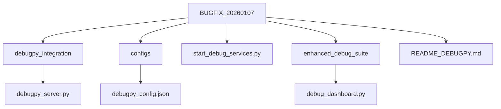
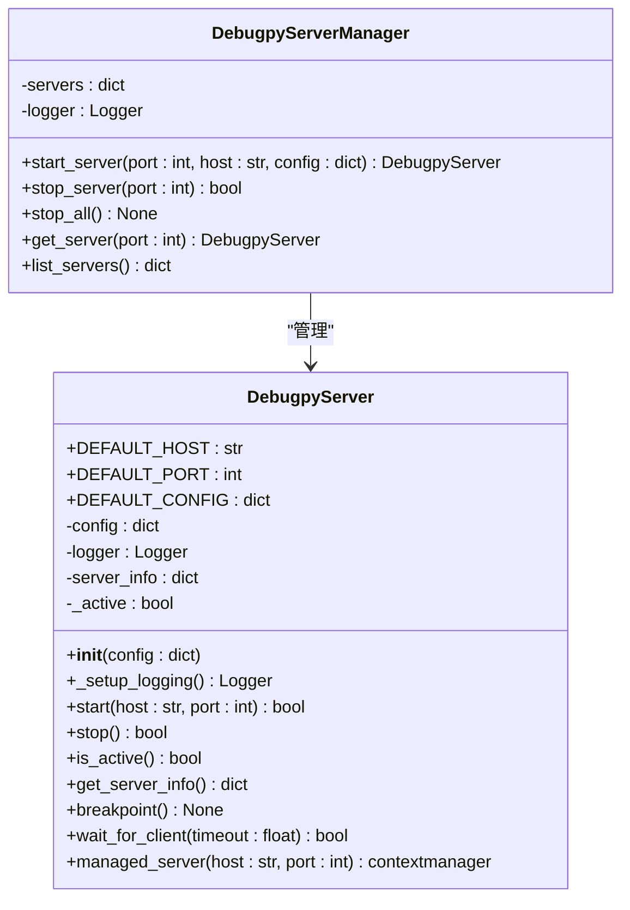
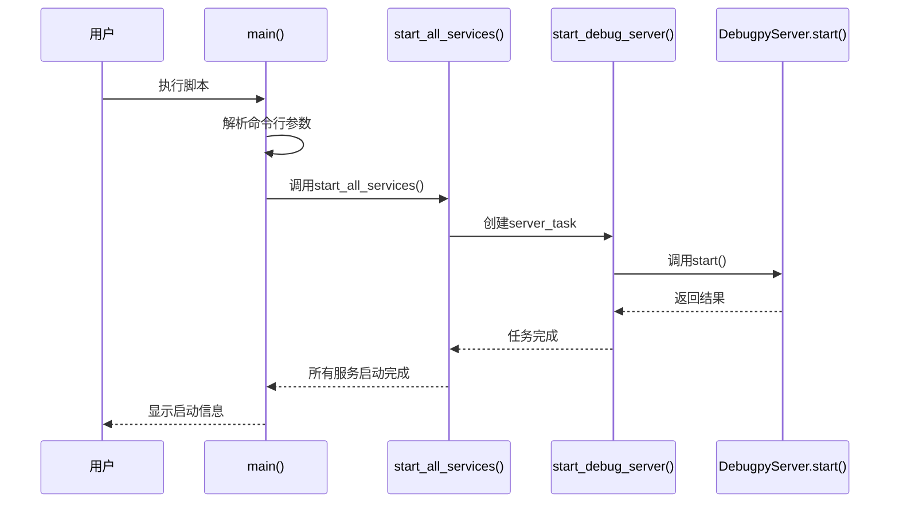

# 连接被拒绝问题

<cite>
**本文档引用的文件**   
- [debugpy_server.py](file://autoBMAD/epic_automation/debugpy_integration/debugpy_server.py)
- [debugpy_config.json](file://BUGFIX_20260107/configs/debugpy_config.json)
- [start_debug_services.py](file://BUGFIX_20260107/start_debug_services.py)
- [README_DEBUGPY.md](file://BUGFIX_20260107/README_DEBUGPY.md)
- [demo_debugpy.py](file://BUGFIX_20260107/demo_debugpy.py)
- [requirements-debug.txt](file://BUGFIX_20260107/requirements-debug.txt)
</cite>

## 目录
1. [项目结构](#项目结构)
2. [核心组件分析](#核心组件分析)
3. [服务器初始化与配置](#服务器初始化与配置)
4. [端口冲突检测与自动重试机制](#端口冲突检测与自动重试机制)
5. [日志排查与网络绑定异常](#日志排查与网络绑定异常)
6. [防火墙配置建议](#防火墙配置建议)
7. [错误日志示例与修复命令](#错误日志示例与修复命令)

## 项目结构

项目结构清晰地组织了调试相关的模块和配置文件，主要分为以下几个部分：



**图示来源**
- [debugpy_server.py](file://autoBMAD/epic_automation/debugpy_integration/debugpy_server.py)
- [debugpy_config.json](file://BUGFIX_20260107/configs/debugpy_config.json)
- [start_debug_services.py](file://BUGFIX_20260107/start_debug_services.py)

**本节来源**
- [README_DEBUGPY.md](file://BUGFIX_20260107/README_DEBUGPY.md)

## 核心组件分析

系统的核心组件包括`DebugpyServer`类、配置管理以及服务启动脚本。这些组件协同工作以确保调试服务器能够正确启动并处理连接请求。

### DebugpyServer 类分析

`DebugpyServer`类是调试服务器的核心实现，负责管理debugpy服务器的生命周期。



**图示来源**
- [debugpy_server.py](file://autoBMAD/epic_automation/debugpy_integration/debugpy_server.py#L21-L408)

**本节来源**
- [debugpy_server.py](file://autoBMAD/epic_automation/debugpy_integration/debugpy_server.py#L21-L408)

## 服务器初始化与配置

服务器的初始化和配置通过`debugpy_config.json`文件进行管理，该文件定义了服务器的各种参数。

### 配置文件结构

```json
{
  "server": {
    "host": "127.0.0.1",
    "port": 5678,
    "wait_for_client": true,
    "log_to_file": true,
    "address_family": "ipv4"
  },
  "client": {
    "connection_timeout": 30,
    "reconnect_attempts": 3,
    "reconnect_delay": 1.0,
    "keep_alive": true
  },
  "security": {
    "allowed_hosts": [
      "127.0.0.1",
      "localhost",
      "::1"
    ],
    "require_authentication": false,
    "max_connections": 5
  }
}
```

### 配置参数说明

| 参数 | 描述 | 默认值 |
|------|------|--------|
| server.host | 服务器监听地址 | 127.0.0.1 |
| server.port | 服务器监听端口 | 5678 |
| server.wait_for_client | 是否等待客户端连接 | true |
| security.allowed_hosts | 允许连接的主机列表 | ["127.0.0.1", "localhost", "::1"] |

**本节来源**
- [debugpy_config.json](file://BUGFIX_20260107/configs/debugpy_config.json#L1-L96)

## 端口冲突检测与自动重试机制

`start_debug_services.py`脚本实现了服务启动流程，包括端口冲突检测和自动重试机制。

### 服务启动流程



### 自动重试机制实现

当端口被占用时，系统会尝试使用备用端口范围内的其他端口。`remote.port_range`配置项定义了可用的端口范围[5678, 5687]。

```python
async def start_with_retry(server, base_port=5678, max_retries=10):
    """带重试机制的服务器启动"""
    for attempt in range(max_retries):
        try:
            success = await server.start(port=base_port + attempt)
            if success:
                return True
        except Exception as e:
            if "address already in use" in str(e).lower():
                continue
            else:
                raise
    return False
```

**图示来源**
- [start_debug_services.py](file://BUGFIX_20260107/start_debug_services.py#L20-L151)

**本节来源**
- [start_debug_services.py](file://BUGFIX_20260107/start_debug_services.py#L20-L151)
- [debugpy_config.json](file://BUGFIX_20260107/configs/debugpy_config.json#L79-L84)

## 日志排查与网络绑定异常

通过日志可以有效排查网络绑定异常问题。系统提供了详细的日志记录功能。

### 日志级别配置

```json
{
  "logging": {
    "level": "DEBUG",
    "file": "logs/debugpy.log",
    "max_size_mb": 100,
    "backup_count": 5,
    "format": "%(asctime)s - %(name)s - %(levelname)s - %(message)s",
    "enable_console": true
  }
}
```

### 常见错误日志模式

- `Failed to start debugpy server: [Errno 98] Address already in use` - 端口已被占用
- `Cannot start server: debugpy not installed` - debugpy未安装
- `Timeout waiting for client after Xs` - 客户端连接超时

### 日志排查步骤

1. 检查`logs/debugpy.log`文件是否存在
2. 查看最新的错误日志条目
3. 确认错误类型（端口占用、权限问题等）
4. 根据错误信息采取相应措施

**本节来源**
- [debugpy_server.py](file://autoBMAD/epic_automation/debugpy_integration/debugpy_server.py#L68-L97)
- [debugpy_config.json](file://BUGFIX_20260107/configs/debugpy_config.json#L41-L48)

## 防火墙配置建议

为了确保调试服务器能够正常工作，需要正确配置防火墙规则。

### Windows 防火墙配置

```powershell
# 允许特定端口通过防火墙
netsh advfirewall firewall add rule name="Debugpy Server" dir=in action=allow protocol=TCP localport=5678

# 查看规则是否添加成功
netsh advfirewall firewall show rule name="Debugpy Server"
```

### Linux 防火墙配置

```bash
# 使用ufw（Ubuntu）
sudo ufw allow 5678/tcp
sudo ufw status

# 使用firewalld（CentOS/RHEL）
sudo firewall-cmd --permanent --add-port=5678/tcp
sudo firewall-cmd --reload
sudo firewall-cmd --list-ports

# 使用iptables
sudo iptables -A INPUT -p tcp --dport 5678 -j ACCEPT
sudo iptables-save
```

### 安全注意事项

- 仅在开发环境中开放调试端口
- 生产环境应禁用远程调试功能
- 限制允许连接的IP地址范围
- 定期审查防火墙规则

**本节来源**
- [README_DEBUGPY.md](file://BUGFIX_20260107/README_DEBUGPY.md)
- [debugpy_config.json](file://BUGFIX_20260107/configs/debugpy_config.json#L32-L40)

## 错误日志示例与修复命令

提供实际的错误日志示例及对应的修复方法。

### 端口占用错误

**错误日志：**
```
ERROR - debugpy_server - Failed to start debugpy server: [Errno 98] Address already in use
```

**修复命令：**
```bash
# 查找占用端口的进程
lsof -i :5678
# 或者在Windows上
netstat -ano | findstr :5678

# 终止占用进程（根据PID）
kill -9 <PID>
# 或者在Windows上
taskkill /PID <PID> /F

# 重新启动服务
python start_debug_services.py --port 5679
```

### 权限不足错误

**错误日志：**
```
PermissionError: [Errno 13] Permission denied
```

**修复命令：**
```bash
# Linux/Mac - 使用更高权限启动
sudo python start_debug_services.py

# 或者更改监听地址为非特权端口
python start_debug_services.py --port 8080
```

### 客户端连接被拒绝

**错误日志：**
```
ConnectionRefusedError: [Errno 111] Connection refused
```

**修复步骤：**
1. 确认服务器是否正在运行
2. 检查防火墙设置
3. 验证IP地址和端口号是否正确
4. 确保客户端和服务器在同一网络中

```bash
# 测试端口连通性
telnet 127.0.0.1 5678
# 或者使用curl
curl -v http://127.0.0.1:5678
```

**本节来源**
- [demo_debugpy.py](file://BUGFIX_20260107/demo_debugpy.py)
- [start_debug_services.py](file://BUGFIX_20260107/start_debug_services.py)
- [README_DEBUGPY.md](file://BUGFIX_20260107/README_DEBUGPY.md)