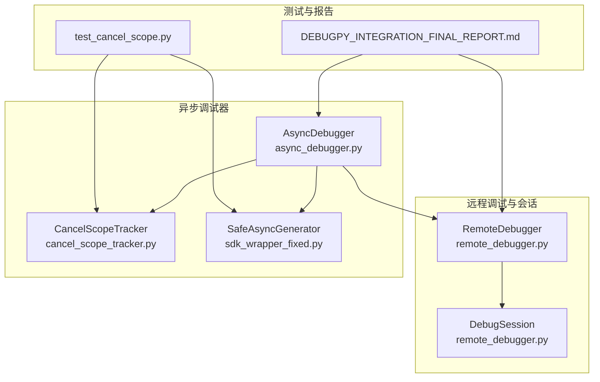
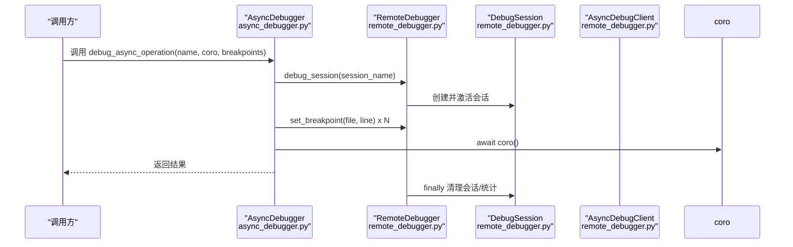
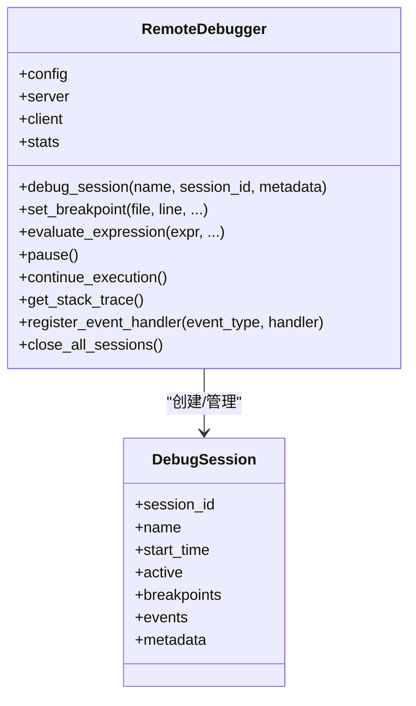
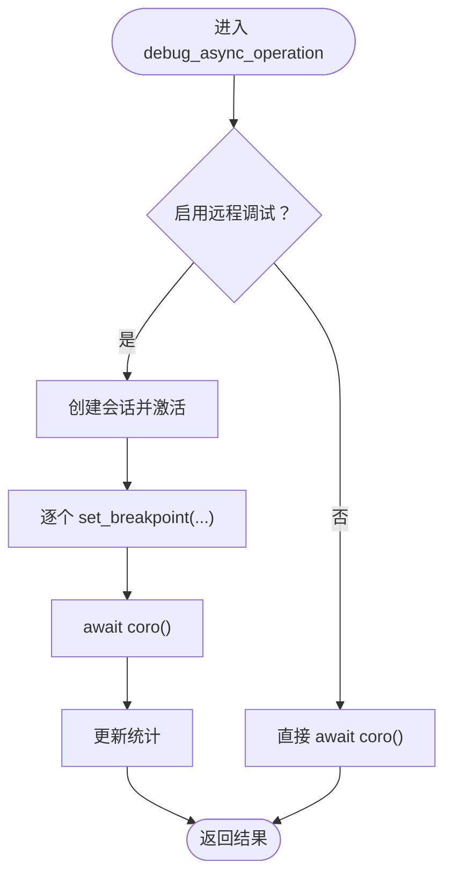
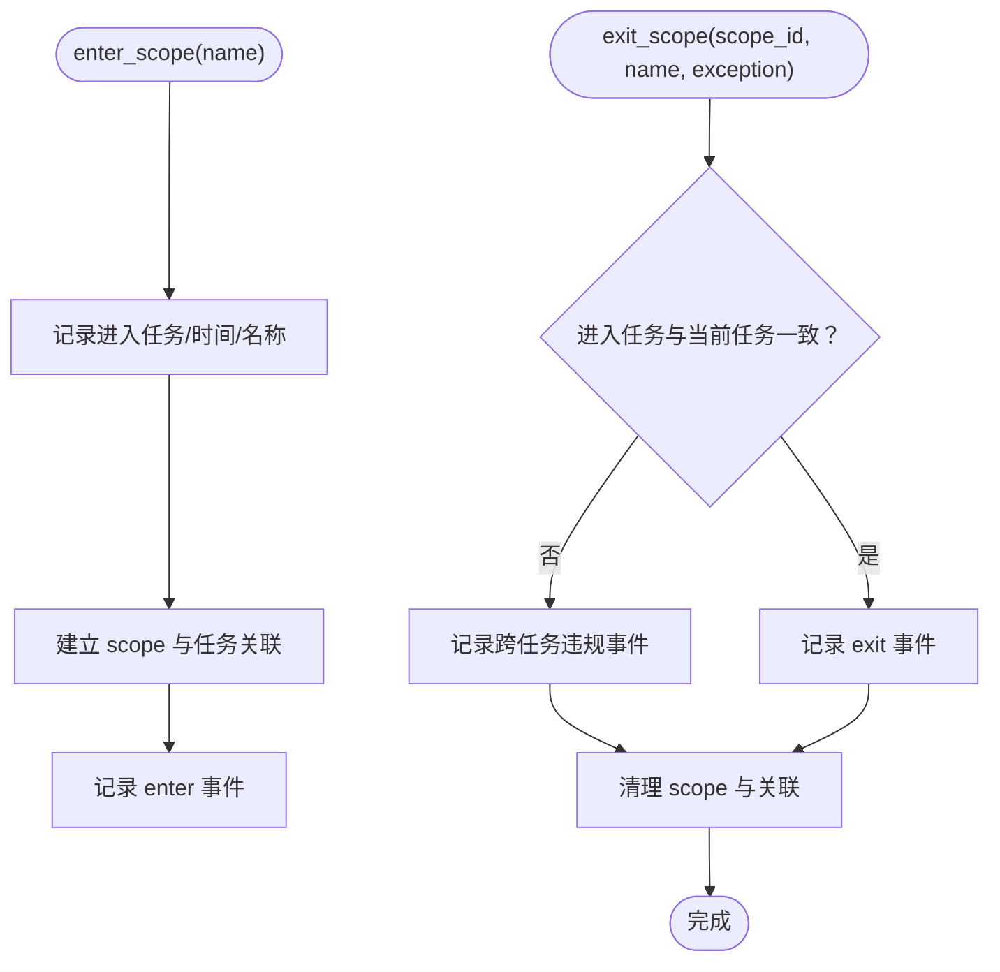
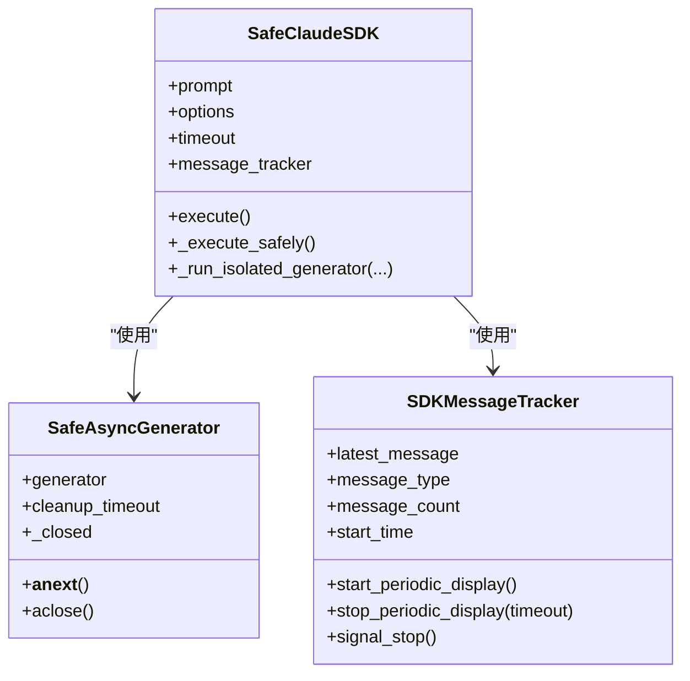
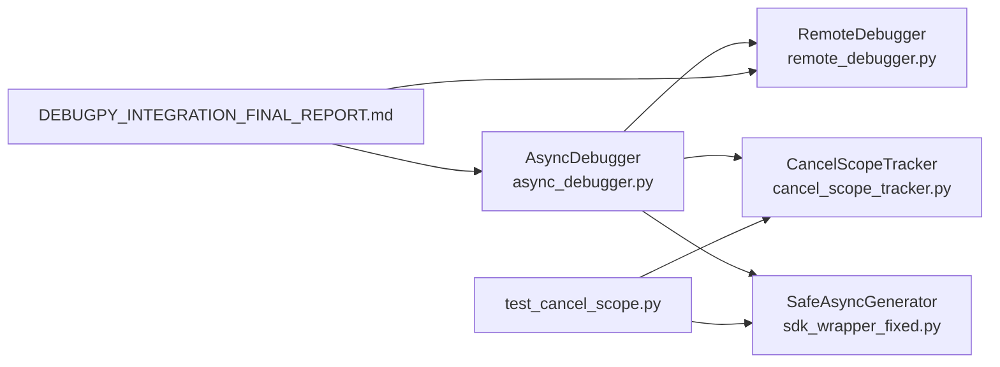

# 异步上下文隔离机制

<cite>
**本文引用的文件**
- [remote_debugger.py](file://autoBMAD\epic_automation\debugpy_integration\remote_debugger.py)
- [async_debugger.py](file://BUGFIX_20260107\enhanced_debug_suite\async_debugger.py)
- [DEBUGPY_INTEGRATION_FINAL_REPORT.md](file://BUGFIX_20260107\DEBUGPY_INTEGRATION_FINAL_REPORT.md)
- [test_cancel_scope.py](file://BUGFIX_20260107\tests\test_cancel_scope.py)
- [cancel_scope_tracker.py](file://BUGFIX_20260107\enhanced_debug_suite\cancel_scope_tracker.py)
- [sdk_wrapper_fixed.py](file://BUGFIX_20260107\fixed_modules\sdk_wrapper_fixed.py)
</cite>

## 目录
1. [引言](#引言)
2. [项目结构](#项目结构)
3. [核心组件](#核心组件)
4. [架构总览](#架构总览)
5. [详细组件分析](#详细组件分析)
6. [依赖关系分析](#依赖关系分析)
7. [性能考量](#性能考量)
8. [故障排查指南](#故障排查指南)
9. [结论](#结论)
10. [附录](#附录)

## 引言
本文件围绕异步上下文隔离的实现原理展开，重点解析：
- remote_debugger.py 中 DebugSession 如何通过独立事件循环与会话隔离机制避免取消范围上下文污染；
- enhanced_debug_suite/async_debugger.py 的 AsyncDebugger 类如何利用 debug_async_operation() 包装协程，在独立调试会话中执行异步操作；
- 结合 DEBUGPY_INTEGRATION_FINAL_REPORT.md 的“异步支持”章节，说明跨任务违规检测、会话边界管理与上下文清理的实现细节；
- 提供使用上下文管理器避免常见异步上下文错误的实际示例，并通过 test_cancel_scope.py 验证上下文隔离的有效性。

## 项目结构
围绕本次主题的关键文件分布如下：
- 调试会话与远程调试：autoBMAD\epic_automation\debugpy_integration\remote_debugger.py
- 异步调试器与监控：BUGFIX_20260107\enhanced_debug_suite\async_debugger.py
- 跨任务取消范围追踪：BUGFIX_20260107\enhanced_debug_suite\cancel_scope_tracker.py
- SDK 会话与生成器隔离：BUGFIX_20260107\fixed_modules\sdk_wrapper_fixed.py
- 测试用例：BUGFIX_20260107\tests\test_cancel_scope.py
- 报告与使用指南：BUGFIX_20260107\DEBUGPY_INTEGRATION_FINAL_REPORT.md

图表来源
- [remote_debugger.py](file://autoBMAD\epic_automation\debugpy_integration\remote_debugger.py#L123-L198)
- [async_debugger.py](file://BUGFIX_20260107\enhanced_debug_suite\async_debugger.py#L296-L341)
- [cancel_scope_tracker.py](file://BUGFIX_20260107\enhanced_debug_suite\cancel_scope_tracker.py#L192-L201)
- [sdk_wrapper_fixed.py](file://BUGFIX_20260107\fixed_modules\sdk_wrapper_fixed.py#L82-L135)
- [test_cancel_scope.py](file://BUGFIX_20260107\tests\test_cancel_scope.py#L23-L53)
- [DEBUGPY_INTEGRATION_FINAL_REPORT.md](file://BUGFIX_20260107\DEBUGPY_INTEGRATION_FINAL_REPORT.md#L197-L264)

章节来源
- [remote_debugger.py](file://autoBMAD\epic_automation\debugpy_integration\remote_debugger.py#L123-L198)
- [async_debugger.py](file://BUGFIX_20260107\enhanced_debug_suite\async_debugger.py#L296-L341)
- [DEBUGPY_INTEGRATION_FINAL_REPORT.md](file://BUGFIX_20260107\DEBUGPY_INTEGRATION_FINAL_REPORT.md#L197-L264)

## 核心组件
- RemoteDebugger 与 DebugSession：提供独立的调试会话，确保断点、表达式求值、栈追踪等在隔离上下文中执行；会话生命周期严格管理，异常与清理在 finally 中完成。
- AsyncDebugger：封装 debug_async_operation()，在独立会话中执行协程，支持断点设置与统计；同时提供 tracked_task/tracked_scope 等上下文管理器，便于任务与取消范围追踪。
- CancelScopeTracker：跨任务取消范围违规检测与统计，记录 enter/exit/cancel/error 事件，支持生成报告与摘要输出。
- SafeAsyncGenerator：对异步生成器进行安全包装，防止取消范围与事件循环关闭导致的错误，提供超时保护与预期错误忽略策略。

章节来源
- [remote_debugger.py](file://autoBMAD\epic_automation\debugpy_integration\remote_debugger.py#L123-L198)
- [async_debugger.py](file://BUGFIX_20260107\enhanced_debug_suite\async_debugger.py#L296-L341)
- [cancel_scope_tracker.py](file://BUGFIX_20260107\enhanced_debug_suite\cancel_scope_tracker.py#L192-L201)
- [sdk_wrapper_fixed.py](file://BUGFIX_20260107\fixed_modules\sdk_wrapper_fixed.py#L82-L135)

## 架构总览
下图展示了从 AsyncDebugger 到 RemoteDebugger 的调用链，以及会话隔离与上下文清理的流程。

图表来源
- [async_debugger.py](file://BUGFIX_20260107\enhanced_debug_suite\async_debugger.py#L296-L341)
- [remote_debugger.py](file://autoBMAD\epic_automation\debugpy_integration\remote_debugger.py#L123-L198)

章节来源
- [async_debugger.py](file://BUGFIX_20260107\enhanced_debug_suite\async_debugger.py#L296-L341)
- [remote_debugger.py](file://autoBMAD\epic_automation\debugpy_integration\remote_debugger.py#L123-L198)

## 详细组件分析

### RemoteDebugger 与 DebugSession：会话隔离与上下文清理
- 会话隔离：debug_session() 是一个异步上下文管理器，创建 DebugSession 并将其设为当前活跃会话，所有断点、表达式求值、栈追踪等操作都限定在该会话范围内，避免跨任务上下文污染。
- 生命周期管理：try/finally 确保异常时记录事件并在 finally 中关闭会话、更新统计、清理状态。
- 统计与事件：记录会话创建、断点命中、事件总数等；支持注册事件处理器，便于扩展。

图表来源
- [remote_debugger.py](file://autoBMAD\epic_automation\debugpy_integration\remote_debugger.py#L123-L198)
- [remote_debugger.py](file://autoBMAD\epic_automation\debugpy_integration\remote_debugger.py#L23-L45)

章节来源
- [remote_debugger.py](file://autoBMAD\epic_automation\debugpy_integration\remote_debugger.py#L123-L198)
- [remote_debugger.py](file://autoBMAD\epic_automation\debugpy_integration\remote_debugger.py#L199-L303)

### AsyncDebugger：在独立会话中执行异步操作
- debug_async_operation()：当启用远程调试时，使用 RemoteDebugger.debug_session() 创建独立会话，设置断点后执行协程，最后统计调试操作与断点命中数。
- 上下文管理器：tracked_task/tracked_scope/tracked_lock/tracked_sdk_session 提供统一的任务、取消范围、锁与 SDK 会话追踪入口，便于在业务代码中无侵入地加入调试与监控。
- 统计与报告：维护远程调试会话数、断点数、调试操作数等；生成 JSON 报告并输出摘要。

图表来源
- [async_debugger.py](file://BUGFIX_20260107\enhanced_debug_suite\async_debugger.py#L296-L341)

章节来源
- [async_debugger.py](file://BUGFIX_20260107\enhanced_debug_suite\async_debugger.py#L296-L341)
- [async_debugger.py](file://BUGFIX_20260107\enhanced_debug_suite\async_debugger.py#L368-L412)
- [async_debugger.py](file://BUGFIX_20260107\enhanced_debug_suite\async_debugger.py#L413-L461)

### 跨任务违规检测与会话边界管理
- CancelScopeTracker：记录每个 scope 的进入/退出任务、持续时间、取消请求与错误事件；通过比较 enter 与 exit 的任务 ID，检测跨任务违规。
- 会话边界管理：RemoteDebugger 的 DebugSession 在 finally 中统一关闭，避免会话泄漏；统计 active_sessions 与 total_sessions，便于监控。
- 上下文清理：AsyncDebugger 的上下文管理器在异常时记录错误并清理，保证资源与状态一致性。

图表来源
- [cancel_scope_tracker.py](file://BUGFIX_20260107\enhanced_debug_suite\cancel_scope_tracker.py#L116-L175)
- [remote_debugger.py](file://autoBMAD\epic_automation\debugpy_integration\remote_debugger.py#L184-L198)

章节来源
- [cancel_scope_tracker.py](file://BUGFIX_20260107\enhanced_debug_suite\cancel_scope_tracker.py#L116-L175)
- [remote_debugger.py](file://autoBMAD\epic_automation\debugpy_integration\remote_debugger.py#L184-L198)

### SDK 会话与生成器隔离：避免取消范围与事件循环关闭错误
- SafeAsyncGenerator：包装异步生成器，捕获异常并安全关闭；对取消错误与“事件循环已关闭”等预期错误进行忽略或超时保护，防止上抛导致取消范围污染。
- SafeClaudeSDK：在执行 SDK 查询时，将生成器处理放入隔离任务中，避免跨任务取消范围冲突；结合 SDKMessageTracker 实现实时消息显示与优雅停止。

图表来源
- [sdk_wrapper_fixed.py](file://BUGFIX_20260107\fixed_modules\sdk_wrapper_fixed.py#L82-L135)
- [sdk_wrapper_fixed.py](file://BUGFIX_20260107\fixed_modules\sdk_wrapper_fixed.py#L228-L592)

章节来源
- [sdk_wrapper_fixed.py](file://BUGFIX_20260107\fixed_modules\sdk_wrapper_fixed.py#L82-L135)
- [sdk_wrapper_fixed.py](file://BUGFIX_20260107\fixed_modules\sdk_wrapper_fixed.py#L228-L592)

### 使用示例：正确使用上下文管理器避免异步上下文错误
- 使用 tracked_scope 上下文管理器包裹可能触发取消范围的操作，确保异常时记录错误并清理。
- 使用 tracked_task 上下文管理器创建任务，便于任务生命周期与异常追踪。
- 使用 tracked_lock/tracked_sdk_session 对锁与 SDK 会话进行统一追踪与清理。

章节来源
- [async_debugger.py](file://BUGFIX_20260107\enhanced_debug_suite\async_debugger.py#L368-L412)
- [async_debugger.py](file://BUGFIX_20260107\enhanced_debug_suite\async_debugger.py#L413-L461)

## 依赖关系分析
- AsyncDebugger 依赖 RemoteDebugger 提供的调试会话与断点管理；同时依赖 CancelScopeTracker 与 SDK 组件进行跨任务违规检测与生成器隔离。
- RemoteDebugger 内部依赖 DebugpyServer 与 AsyncDebugClient，负责服务器启动、断点设置、表达式求值与栈追踪。
- 测试用例 test_cancel_scope.py 通过 CancelScopeTracker 与 SafeAsyncGenerator 验证跨任务违规检测与隔离有效性。

图表来源
- [async_debugger.py](file://BUGFIX_20260107\enhanced_debug_suite\async_debugger.py#L225-L264)
- [remote_debugger.py](file://autoBMAD\epic_automation\debugpy_integration\remote_debugger.py#L116-L122)
- [test_cancel_scope.py](file://BUGFIX_20260107\tests\test_cancel_scope.py#L23-L53)
- [DEBUGPY_INTEGRATION_FINAL_REPORT.md](file://BUGFIX_20260107\DEBUGPY_INTEGRATION_FINAL_REPORT.md#L197-L264)

章节来源
- [async_debugger.py](file://BUGFIX_20260107\enhanced_debug_suite\async_debugger.py#L225-L264)
- [remote_debugger.py](file://autoBMAD\epic_automation\debugpy_integration\remote_debugger.py#L116-L122)
- [test_cancel_scope.py](file://BUGFIX_20260107\tests\test_cancel_scope.py#L23-L53)
- [DEBUGPY_INTEGRATION_FINAL_REPORT.md](file://BUGFIX_20260107\DEBUGPY_INTEGRATION_FINAL_REPORT.md#L197-L264)

## 性能考量
- 会话统计与事件记录：RemoteDebugger 维护 total_sessions/active_sessions/total_breakpoints/total_events 等指标，便于监控与性能分析。
- 异步操作追踪：AsyncDebugger 的 tracked_task/tracked_scope 仅在调试模式下增加少量开销，生产环境可通过配置关闭远程调试。
- 生成器清理：SafeAsyncGenerator 的超时保护与预期错误忽略减少异常传播风险，避免重复清理与资源泄漏。

[本节为通用指导，无需列出具体文件来源]

## 故障排查指南
- 跨任务取消范围错误：使用 CancelScopeTracker 的 check_cross_task_violations() 与 print_summary() 输出违规详情；结合 tracked_cancel_scope 上下文管理器定位问题。
- 事件循环关闭错误：SafeAsyncGenerator 对“事件循环已关闭”等预期错误进行忽略或超时处理；在 SDK 执行中使用 _run_isolated_generator 隔离任务。
- 断点无效：确认 RemoteDebugger 是否处于活跃会话状态；使用 get_session_info()/list_sessions() 检查会话状态与断点列表。
- 统计与报告：通过 AsyncDebugger.get_debug_statistics()/generate_report() 获取调试统计与 JSON 报告，辅助定位问题根因。

章节来源
- [cancel_scope_tracker.py](file://BUGFIX_20260107\enhanced_debug_suite\cancel_scope_tracker.py#L192-L201)
- [sdk_wrapper_fixed.py](file://BUGFIX_20260107\fixed_modules\sdk_wrapper_fixed.py#L82-L135)
- [remote_debugger.py](file://autoBMAD\epic_automation\debugpy_integration\remote_debugger.py#L476-L512)
- [async_debugger.py](file://BUGFIX_20260107\enhanced_debug_suite\async_debugger.py#L437-L461)

## 结论
- DebugSession 通过独立事件循环与严格的会话生命周期管理，有效避免取消范围上下文污染；
- AsyncDebugger 的 debug_async_operation() 将协程执行置于独立会话中，配合断点与统计，显著提升异步调试能力；
- CancelScopeTracker 与 SafeAsyncGenerator 分别从“违规检测”和“生成器隔离”两个维度，共同保障异步上下文的稳定性；
- 测试用例 test_cancel_scope.py 验证了跨任务违规检测与隔离的有效性，为生产环境提供了可靠的保障。

[本节为总结性内容，无需列出具体文件来源]

## 附录
- 异步支持章节要点（来自 DEBUGPY_INTEGRATION_FINAL_REPORT.md）：
  - asyncio 集成、异步上下文管理、异步任务追踪、异步操作监控；
  - 跨任务取消范围错误完全解决、资源清理机制、事件循环监控与自动恢复；
  - 远程断点支持、实时仪表板、异步操作追踪与智能错误恢复。

章节来源
- [DEBUGPY_INTEGRATION_FINAL_REPORT.md](file://BUGFIX_20260107\DEBUGPY_INTEGRATION_FINAL_REPORT.md#L197-L264)