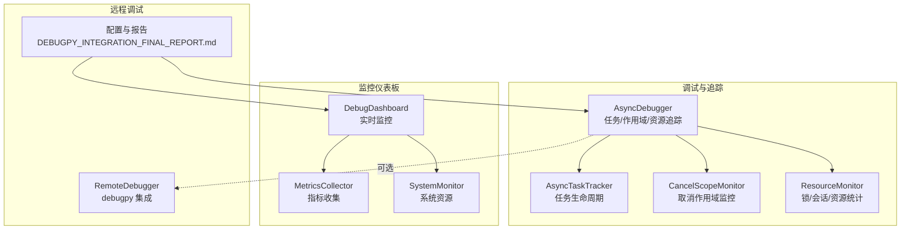
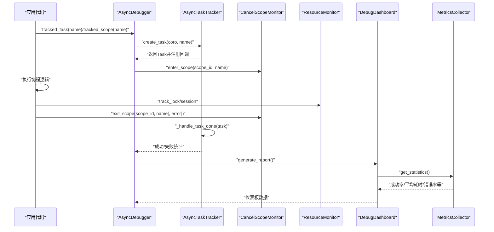
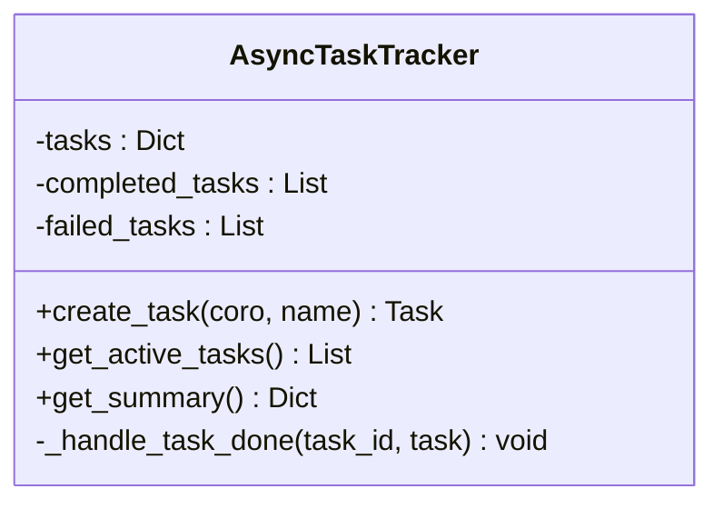
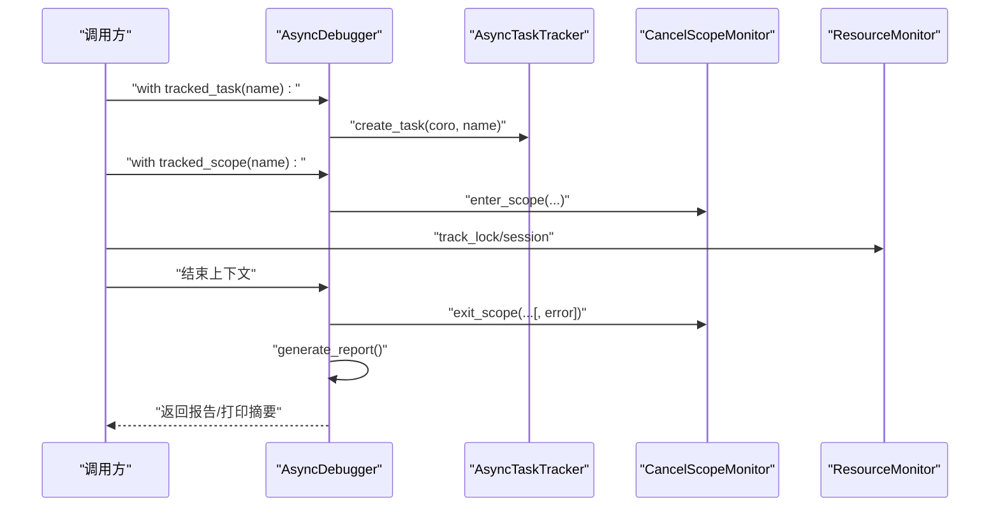
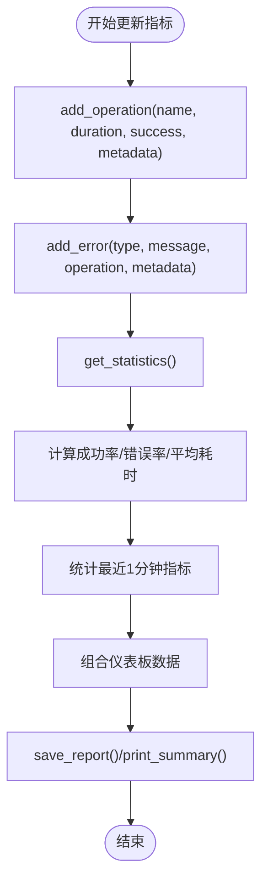
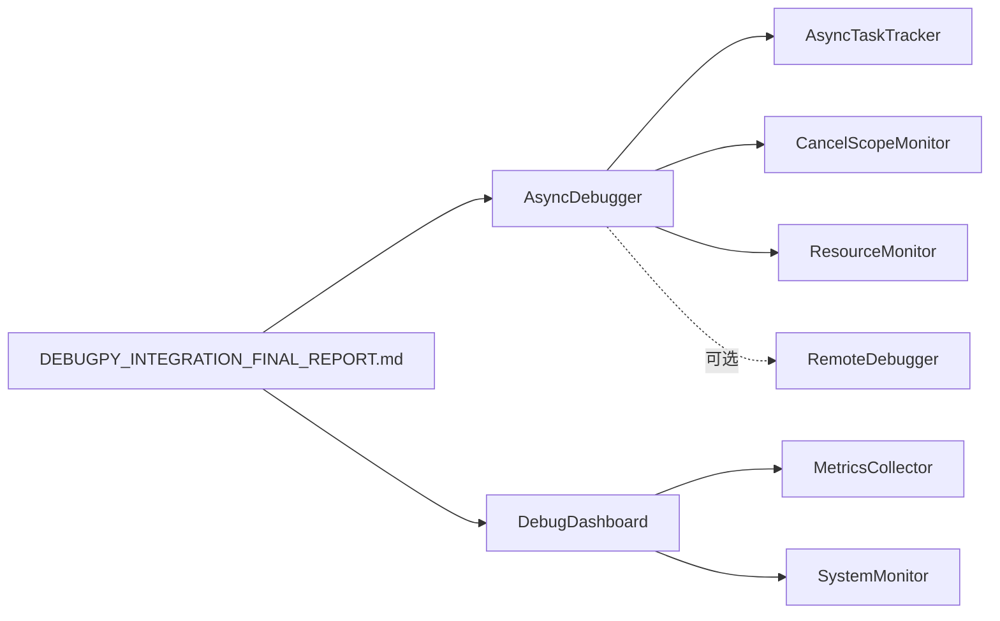

# 异步任务追踪与监控

<cite>
**本文引用的文件**
- [async_debugger.py](file://BUGFIX_20260107/debug_suite/async_debugger.py)
- [async_debugger.py](file://BUGFIX_20260107/enhanced_debug_suite/async_debugger.py)
- [debug_dashboard.py](file://BUGFIX_20260107/enhanced_debug_suite/debug_dashboard.py)
- [DEBUGPY_INTEGRATION_FINAL_REPORT.md](file://BUGFIX_20260107/DEBUGPY_INTEGRATION_FINAL_REPORT.md)
- [demo_debugpy.py](file://BUGFIX_20260107/demo_debugpy.py)
</cite>

## 目录
1. [简介](#简介)
2. [项目结构](#项目结构)
3. [核心组件](#核心组件)
4. [架构总览](#架构总览)
5. [详细组件分析](#详细组件分析)
6. [依赖关系分析](#依赖关系分析)
7. [性能考量](#性能考量)
8. [故障排查指南](#故障排查指南)
9. [结论](#结论)
10. [附录](#附录)

## 简介
本文件围绕异步任务追踪系统进行深入解析，重点覆盖：
- AsyncTaskTracker 类如何监控异步任务生命周期（创建、完成、异常）；
- MetricsCollector 如何收集与展示异步任务指标，DebugDashboard 如何提供实时可视化监控；
- 基于“监控和可观测性”章节，阐述任务状态监控、性能指标收集与错误追踪的实现；
- 展示 tracked_task 装饰器的使用方式与 generate_report() 报告生成流程。

## 项目结构
该系统由三部分组成：
- 异步调试与追踪：debug_suite 与 enhanced_debug_suite 中的 AsyncDebugger、AsyncTaskTracker、CancelScopeMonitor、ResourceMonitor；
- 实时监控仪表板：enhanced_debug_suite 中的 DebugDashboard、MetricsCollector、SystemMonitor；
- 远程调试集成：debugpy 集成模块与相关配置、报告。

图表来源
- [async_debugger.py](file://BUGFIX_20260107/enhanced_debug_suite/async_debugger.py#L225-L559)
- [debug_dashboard.py](file://BUGFIX_20260107/enhanced_debug_suite/debug_dashboard.py#L1-L469)
- [DEBUGPY_INTEGRATION_FINAL_REPORT.md](file://BUGFIX_20260107/DEBUGPY_INTEGRATION_FINAL_REPORT.md#L1-L499)

章节来源
- [async_debugger.py](file://BUGFIX_20260107/enhanced_debug_suite/async_debugger.py#L225-L559)
- [debug_dashboard.py](file://BUGFIX_20260107/enhanced_debug_suite/debug_dashboard.py#L1-L469)
- [DEBUGPY_INTEGRATION_FINAL_REPORT.md](file://BUGFIX_20260107/DEBUGPY_INTEGRATION_FINAL_REPORT.md#L1-L499)

## 核心组件
- AsyncTaskTracker：跟踪任务创建、完成与异常，维护活动任务与历史统计。
- AsyncDebugger：统一入口，提供 tracked_task/tracked_scope/track_lock/track_sdk_session 上下文管理器，以及 generate_report()/print_summary() 报告与摘要输出。
- MetricsCollector：收集操作耗时、成功率、错误率、最近一分钟指标等；支持取消作用域错误专项统计。
- DebugDashboard：实时聚合指标、系统资源、错误分布与最近操作，支持保存报告与打印摘要。
- CancelScopeMonitor/ResourceMonitor：分别负责取消作用域事件与锁/SDK会话的统计。
- RemoteDebugger（可选）：与 debugpy 集成，支持远程断点与会话统计。

章节来源
- [async_debugger.py](file://BUGFIX_20260107/enhanced_debug_suite/async_debugger.py#L33-L223)
- [async_debugger.py](file://BUGFIX_20260107/enhanced_debug_suite/async_debugger.py#L225-L559)
- [debug_dashboard.py](file://BUGFIX_20260107/enhanced_debug_suite/debug_dashboard.py#L25-L165)
- [debug_dashboard.py](file://BUGFIX_20260107/enhanced_debug_suite/debug_dashboard.py#L167-L391)

## 架构总览
异步任务追踪与监控的整体流程如下：
- 应用通过 AsyncDebugger 的上下文管理器或装饰器包装异步任务与作用域；
- AsyncTaskTracker 注册任务并在完成后回调中区分成功/失败，更新统计；
- CancelScopeMonitor 记录进入/退出作用域事件及错误；
- ResourceMonitor 记录锁与 SDK 会话状态变化；
- DebugDashboard 通过 MetricsCollector 聚合操作与错误指标，SystemMonitor 采集系统资源；
- AsyncDebugger 生成综合报告，包含任务/作用域/锁/会话统计与错误清单。

图表来源
- [async_debugger.py](file://BUGFIX_20260107/enhanced_debug_suite/async_debugger.py#L279-L397)
- [async_debugger.py](file://BUGFIX_20260107/enhanced_debug_suite/async_debugger.py#L413-L461)
- [debug_dashboard.py](file://BUGFIX_20260107/enhanced_debug_suite/debug_dashboard.py#L227-L353)

## 详细组件分析

### AsyncTaskTracker：任务生命周期监控
- 任务创建：通过 create_task 包装协程，记录创建时间、名称、状态等；注册完成回调。
- 完成处理：done_callback 中区分异常与成功，将任务移至对应列表；记录完成时间与异常对象。
- 活动任务与汇总：提供活动任务列表与统计摘要（活动/完成/失败/总数）。

图表来源
- [async_debugger.py](file://BUGFIX_20260107/enhanced_debug_suite/async_debugger.py#L33-L110)

章节来源
- [async_debugger.py](file://BUGFIX_20260107/enhanced_debug_suite/async_debugger.py#L33-L110)

### AsyncDebugger：统一入口与报告生成
- tracked_task/tracked_scope/track_lock/track_sdk_session：提供上下文管理器，记录进入/退出事件与异常，同时更新对应监控器。
- generate_report/print_summary：生成综合报告与控制台摘要，包含任务/作用域/锁/会话统计与错误清单。
- debug_async_operation/set_remote_breakpoint（增强版）：可选的远程调试支持，统计调试会话与断点命中。

图表来源
- [async_debugger.py](file://BUGFIX_20260107/enhanced_debug_suite/async_debugger.py#L279-L397)
- [async_debugger.py](file://BUGFIX_20260107/enhanced_debug_suite/async_debugger.py#L413-L461)

章节来源
- [async_debugger.py](file://BUGFIX_20260107/enhanced_debug_suite/async_debugger.py#L279-L397)
- [async_debugger.py](file://BUGFIX_20260107/enhanced_debug_suite/async_debugger.py#L413-L461)

### MetricsCollector 与 DebugDashboard：实时可视化监控
- MetricsCollector：维护操作历史与错误历史，计算总操作数、成功/失败数、成功率、平均耗时、错误率、最近一分钟指标与取消作用域错误数。
- DebugDashboard：聚合指标、系统资源、错误分布与最近操作，提供保存报告与打印摘要能力。

图表来源
- [debug_dashboard.py](file://BUGFIX_20260107/enhanced_debug_suite/debug_dashboard.py#L25-L165)
- [debug_dashboard.py](file://BUGFIX_20260107/enhanced_debug_suite/debug_dashboard.py#L167-L391)

章节来源
- [debug_dashboard.py](file://BUGFIX_20260107/enhanced_debug_suite/debug_dashboard.py#L25-L165)
- [debug_dashboard.py](file://BUGFIX_20260107/enhanced_debug_suite/debug_dashboard.py#L167-L391)

### 取消作用域与资源监控
- CancelScopeMonitor：记录进入/退出事件、错误与活动计数，提供错误率与统计摘要。
- ResourceMonitor：记录锁获取/释放与 SDK 会话状态变化，提供锁统计与会话成功率等。

章节来源
- [async_debugger.py](file://BUGFIX_20260107/enhanced_debug_suite/async_debugger.py#L95-L223)

### 使用示例：tracked_task 装饰器与 generate_report()
- tracked_task 装饰器：用于包装异步函数，自动注入任务追踪上下文，便于在任务内部创建子任务并统一记录。
- generate_report：生成包含任务/作用域/锁/会话统计与错误清单的综合报告，并写入 JSON 文件。

章节来源
- [async_debugger.py](file://BUGFIX_20260107/enhanced_debug_suite/async_debugger.py#L513-L533)
- [async_debugger.py](file://BUGFIX_20260107/enhanced_debug_suite/async_debugger.py#L413-L461)
- [demo_debugpy.py](file://BUGFIX_20260107/demo_debugpy.py#L75-L110)

## 依赖关系分析
- AsyncDebugger 依赖 AsyncTaskTracker、CancelScopeMonitor、ResourceMonitor 与日志系统；
- DebugDashboard 依赖 MetricsCollector 与 SystemMonitor；
- 增强版 AsyncDebugger 可选依赖 RemoteDebugger（debugpy 集成）；
- DEBUGPY_INTEGRATION_FINAL_REPORT.md 提供监控与可观测性的整体目标与指标。

图表来源
- [async_debugger.py](file://BUGFIX_20260107/enhanced_debug_suite/async_debugger.py#L225-L559)
- [debug_dashboard.py](file://BUGFIX_20260107/enhanced_debug_suite/debug_dashboard.py#L1-L469)
- [DEBUGPY_INTEGRATION_FINAL_REPORT.md](file://BUGFIX_20260107/DEBUGPY_INTEGRATION_FINAL_REPORT.md#L1-L499)

章节来源
- [async_debugger.py](file://BUGFIX_20260107/enhanced_debug_suite/async_debugger.py#L225-L559)
- [debug_dashboard.py](file://BUGFIX_20260107/enhanced_debug_suite/debug_dashboard.py#L1-L469)
- [DEBUGPY_INTEGRATION_FINAL_REPORT.md](file://BUGFIX_20260107/DEBUGPY_INTEGRATION_FINAL_REPORT.md#L1-L499)

## 性能考量
- 指标窗口：MetricsCollector 对操作历史与错误历史采用上限控制，避免内存无限增长。
- 统计维度：提供总操作数、成功/失败数、成功率、平均耗时、错误率与最近一分钟指标，便于快速定位性能波动。
- 系统资源：SystemMonitor 采集 CPU、内存、线程等指标，辅助判断系统瓶颈。
- 远程调试：增强版 AsyncDebugger 支持远程断点与会话统计，有助于在生产环境中进行低侵入式诊断。

章节来源
- [debug_dashboard.py](file://BUGFIX_20260107/enhanced_debug_suite/debug_dashboard.py#L25-L165)
- [debug_dashboard.py](file://BUGFIX_20260107/enhanced_debug_suite/debug_dashboard.py#L126-L165)
- [async_debugger.py](file://BUGFIX_20260107/enhanced_debug_suite/async_debugger.py#L296-L367)

## 故障排查指南
- 任务失败追踪：generate_report 返回 failed_tasks 列表，结合日志文件定位异常堆栈。
- 取消作用域错误：check_scope_errors 返回错误事件，结合 scope_history 与错误率分析跨任务违规。
- 锁与会话：ResourceMonitor 提供锁统计与 SDK 会话成功率，辅助排查资源竞争与会话泄漏。
- 仪表板数据：get_dashboard_data 输出最近操作、错误分布与取消作用域错误率，便于快速定位问题趋势。

章节来源
- [async_debugger.py](file://BUGFIX_20260107/enhanced_debug_suite/async_debugger.py#L413-L461)
- [async_debugger.py](file://BUGFIX_20260107/enhanced_debug_suite/async_debugger.py#L119-L161)
- [debug_dashboard.py](file://BUGFIX_20260107/enhanced_debug_suite/debug_dashboard.py#L264-L391)

## 结论
该异步任务追踪与监控体系通过 AsyncTaskTracker、AsyncDebugger 与 DebugDashboard 的协同，实现了对异步任务生命周期、取消作用域、资源使用与系统指标的全链路可观测性。结合 debugpy 集成，可在生产环境中进行低侵入式远程调试与断点定位，显著提升问题诊断效率与系统稳定性。

## 附录

### 监控与可观测性（来自报告）
- 关键性能指标（KPI）：取消作用域错误率、会话成功率、平均操作耗时、错误恢复时间；
- 调试指标：远程调试会话数、断点命中次数、资源使用（CPU/内存/线程/协程）；
- 验收标准：功能、性能与用户体验达标；
- 部署与使用：一键启动、仪表板界面、详细日志与清晰错误消息。

章节来源
- [DEBUGPY_INTEGRATION_FINAL_REPORT.md](file://BUGFIX_20260107/DEBUGPY_INTEGRATION_FINAL_REPORT.md#L345-L420)
- [DEBUGPY_INTEGRATION_FINAL_REPORT.md](file://BUGFIX_20260107/DEBUGPY_INTEGRATION_FINAL_REPORT.md#L430-L499)