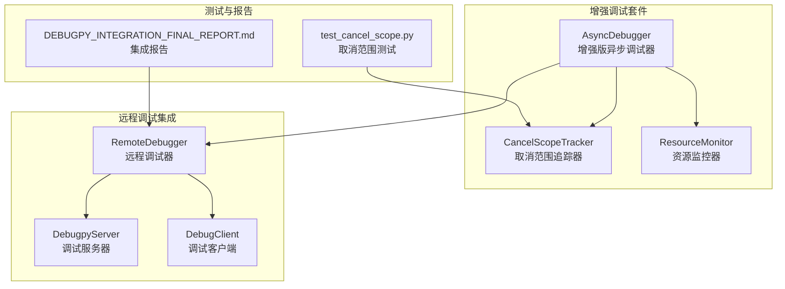
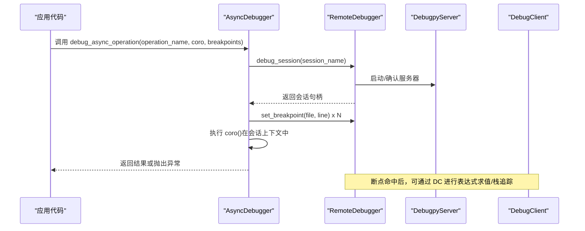
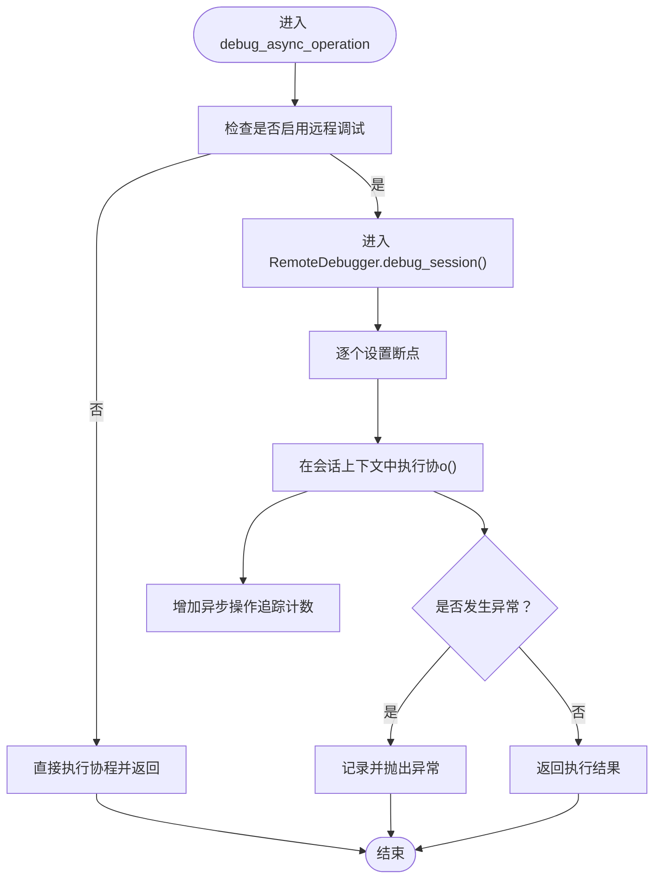
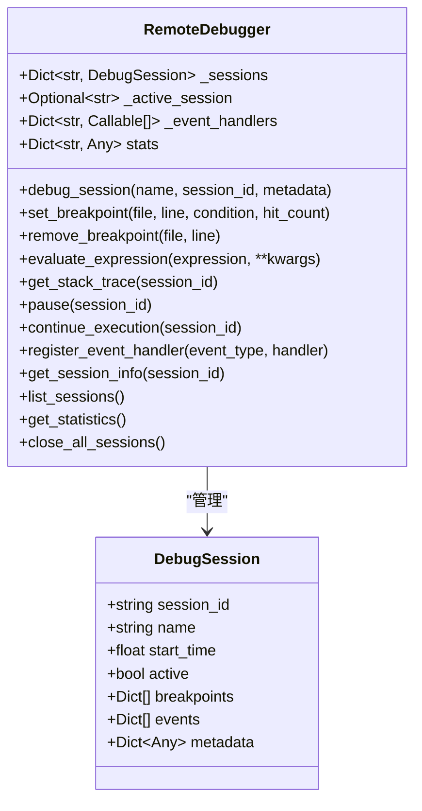
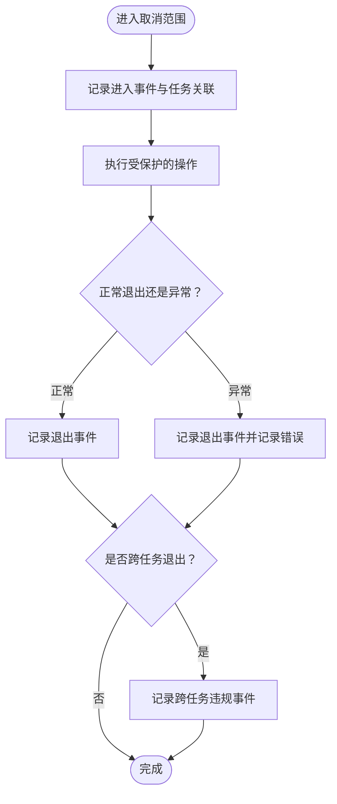
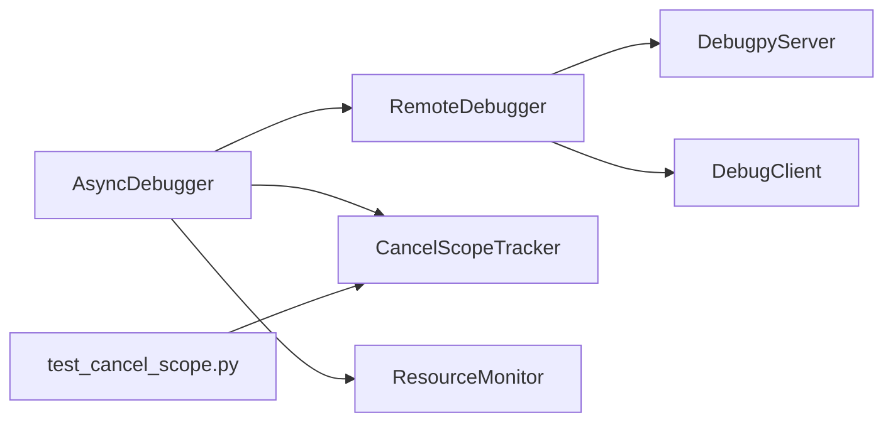

# 异步调试支持

<cite>
**本文引用的文件**
- [async_debugger.py](file://BUGFIX_20260107/enhanced_debug_suite/async_debugger.py)
- [remote_debugger.py](file://BUGFIX_20260107/debugpy_integration/remote_debugger.py)
- [debugpy_server.py](file://BUGFIX_20260107/debugpy_integration/debugpy_server.py)
- [debug_client.py](file://BUGFIX_20260107/debugpy_integration/debug_client.py)
- [cancel_scope_tracker.py](file://BUGFIX_20260107/enhanced_debug_suite/cancel_scope_tracker.py)
- [resource_monitor.py](file://BUGFIX_20260107/enhanced_debug_suite/resource_monitor.py)
- [DEBUGPY_INTEGRATION_FINAL_REPORT.md](file://BUGFIX_20260107/DEBUGPY_INTEGRATION_FINAL_REPORT.md)
- [test_cancel_scope.py](file://BUGFIX_20260107/tests/test_cancel_scope.py)
</cite>

## 目录
1. [简介](#简介)
2. [项目结构](#项目结构)
3. [核心组件](#核心组件)
4. [架构总览](#架构总览)
5. [详细组件分析](#详细组件分析)
6. [依赖关系分析](#依赖关系分析)
7. [性能考量](#性能考量)
8. [故障排查指南](#故障排查指南)
9. [结论](#结论)
10. [附录](#附录)

## 简介
本文件系统性阐述该仓库中异步调试的实现机制，重点围绕以下目标：
- 解释增强版异步调试器如何通过 RemoteDebugger 的会话隔离机制包装异步协程，从而支持远程断点与调试；
- 说明 RemoteDebugger 的 DebugSession 如何在独立事件循环中执行异步操作，避免取消范围上下文污染；
- 基于“debugpy 集成最终报告”中的“异步支持”章节，梳理异步任务追踪、协程栈深度监控与事件循环健康检查的实现思路；
- 提供异步超时处理、任务取消与异常传播的调试策略，并通过测试用例验证异步上下文隔离的有效性。

## 项目结构
围绕异步调试的关键模块组织如下：
- 增强版异步调试器：提供 debug_async_operation() 等能力，封装远程调试与断点设置；
- RemoteDebugger：提供调试会话管理、断点设置、表达式求值、栈追踪、事件系统与统计；
- DebugpyServer/DebugClient：提供 debugpy 服务器与客户端接口（模拟实现）；
- 取消范围追踪器与资源监控器：提供跨任务取消范围检测、锁/会话/任务/系统资源监控；
- 测试用例：验证取消范围隔离与异步上下文有效性。

图表来源
- [async_debugger.py](file://BUGFIX_20260107/enhanced_debug_suite/async_debugger.py#L225-L559)
- [remote_debugger.py](file://BUGFIX_20260107/debugpy_integration/remote_debugger.py#L67-L683)
- [debugpy_server.py](file://BUGFIX_20260107/debugpy_integration/debugpy_server.py#L1-L200)
- [debug_client.py](file://BUGFIX_20260107/debugpy_integration/debug_client.py#L1-L200)
- [cancel_scope_tracker.py](file://BUGFIX_20260107/enhanced_debug_suite/cancel_scope_tracker.py#L1-L368)
- [resource_monitor.py](file://BUGFIX_20260107/enhanced_debug_suite/resource_monitor.py#L1-L537)
- [test_cancel_scope.py](file://BUGFIX_20260107/tests/test_cancel_scope.py#L1-L337)
- [DEBUGPY_INTEGRATION_FINAL_REPORT.md](file://BUGFIX_20260107/DEBUGPY_INTEGRATION_FINAL_REPORT.md#L196-L264)

章节来源
- [async_debugger.py](file://BUGFIX_20260107/enhanced_debug_suite/async_debugger.py#L225-L559)
- [remote_debugger.py](file://BUGFIX_20260107/debugpy_integration/remote_debugger.py#L67-L683)
- [DEBUGPY_INTEGRATION_FINAL_REPORT.md](file://BUGFIX_20260107/DEBUGPY_INTEGRATION_FINAL_REPORT.md#L196-L264)

## 核心组件
- 增强版异步调试器（AsyncDebugger）
  - 提供 debug_async_operation() 方法，封装远程调试会话与断点设置，返回协程执行结果；
  - 提供 tracked_task/tracked_scope 等上下文管理器，用于任务与取消范围的追踪；
  - 提供 set_remote_breakpoint()（同步方法，建议在异步上下文中调用）；
  - 提供 get_debug_statistics() 输出远程调试统计信息。
- 远程调试器（RemoteDebugger）
  - 提供 DebugSession 异步上下文，确保每次调试会话在独立上下文中运行；
  - 提供 set_breakpoint/remove_breakpoint/evaluate_expression/get_stack_trace/pause/continue 等远程调试能力；
  - 提供事件系统与统计信息，支持异常事件记录与处理器注册。
- 取消范围追踪器（CancelScopeTracker）
  - 记录进入/退出取消范围事件，检测跨任务违规；
  - 生成统计与报告，支持错误事件与最近事件导出。
- 资源监控器（ResourceMonitor）
  - 监控锁、会话、任务与系统资源，提供超时检测与健康统计。

章节来源
- [async_debugger.py](file://BUGFIX_20260107/enhanced_debug_suite/async_debugger.py#L225-L559)
- [remote_debugger.py](file://BUGFIX_20260107/debugpy_integration/remote_debugger.py#L67-L683)
- [cancel_scope_tracker.py](file://BUGFIX_20260107/enhanced_debug_suite/cancel_scope_tracker.py#L1-L368)
- [resource_monitor.py](file://BUGFIX_20260107/enhanced_debug_suite/resource_monitor.py#L1-L537)

## 架构总览
下图展示了从应用发起异步调试到远程断点生效的整体流程，以及各组件之间的交互关系。

图表来源
- [async_debugger.py](file://BUGFIX_20260107/enhanced_debug_suite/async_debugger.py#L296-L341)
- [remote_debugger.py](file://BUGFIX_20260107/debugpy_integration/remote_debugger.py#L123-L197)
- [debugpy_server.py](file://BUGFIX_20260107/debugpy_integration/debugpy_server.py#L99-L148)
- [debug_client.py](file://BUGFIX_20260107/debugpy_integration/debug_client.py#L95-L138)

## 详细组件分析

### 增强版异步调试器（AsyncDebugger）
- debug_async_operation()
  - 在启用远程调试的前提下，创建一个独立的调试会话；
  - 为每个断点调用 RemoteDebugger.set_breakpoint；
  - 在会话上下文中执行传入的协程，捕获异常并向上抛出；
  - 统计调试操作次数、断点设置次数与异步操作追踪次数。
- tracked_task/tracked_scope
  - 任务追踪：创建并登记任务，记录完成/失败状态；
  - 取消范围追踪：记录进入/退出事件，检测跨任务违规并记录错误事件；
  - 锁与会话追踪：记录锁获取/释放与 SDK 会话生命周期事件。
- set_remote_breakpoint()
  - 同步方法，建议在异步上下文中调用；若未启用远程调试则记录警告。
- get_debug_statistics()
  - 汇总远程调试状态、服务器活跃度与会话统计。

图表来源
- [async_debugger.py](file://BUGFIX_20260107/enhanced_debug_suite/async_debugger.py#L296-L341)

章节来源
- [async_debugger.py](file://BUGFIX_20260107/enhanced_debug_suite/async_debugger.py#L225-L559)

### RemoteDebugger 与 DebugSession
- DebugSession
  - 作为异步上下文管理器，确保每次调试会话在独立上下文中运行；
  - 记录会话的断点、事件与元数据，支持异常事件记录与会话统计；
  - 在 finally 中进行清理，减少对宿主事件循环的影响。
- 断点与表达式
  - set_breakpoint/remove_breakpoint：通过 AsyncDebugClient 接口设置/移除断点；
  - evaluate_expression：在调试上下文中评估表达式；
  - get_stack_trace：获取栈追踪；
  - pause/continue：暂停/继续被调试程序。
- 事件系统
  - register_event_handler：注册事件处理器；
  - _log_event：记录事件、更新统计并调用处理器。

图表来源
- [remote_debugger.py](file://BUGFIX_20260107/debugpy_integration/remote_debugger.py#L23-L197)
- [remote_debugger.py](file://BUGFIX_20260107/debugpy_integration/remote_debugger.py#L199-L475)

章节来源
- [remote_debugger.py](file://BUGFIX_20260107/debugpy_integration/remote_debugger.py#L67-L683)

### 取消范围追踪器（CancelScopeTracker）
- 能力
  - enter_scope/exit_scope：记录进入/退出事件，检测跨任务违规；
  - request_cancel：记录取消请求；
  - check_cross_task_violations/get_scope_statistics/generate_report/print_summary：输出统计与报告。
- 设计要点
  - 通过弱引用与任务ID关联，避免泄漏；
  - 记录堆栈与详细事件，便于定位问题。

图表来源
- [cancel_scope_tracker.py](file://BUGFIX_20260107/enhanced_debug_suite/cancel_scope_tracker.py#L78-L175)
- [cancel_scope_tracker.py](file://BUGFIX_20260107/enhanced_debug_suite/cancel_scope_tracker.py#L192-L236)

章节来源
- [cancel_scope_tracker.py](file://BUGFIX_20260107/enhanced_debug_suite/cancel_scope_tracker.py#L1-L368)

### 资源监控器（ResourceMonitor）
- 能力
  - LockMonitor：锁获取/释放、超时检测与统计；
  - SessionMonitor：会话创建/更新/关闭与成功率统计；
  - TaskMonitor：任务创建/完成与长任务检测；
  - SystemMonitor：CPU/内存采样与进程资源统计。
- 使用方式
  - 通过 monitor_lock/monitor_session 上下文管理器自动记录事件；
  - 生成综合报告并打印摘要。

章节来源
- [resource_monitor.py](file://BUGFIX_20260107/enhanced_debug_suite/resource_monitor.py#L1-L537)

### 基于“异步支持”的实现要点（来自集成报告）
- 异步任务追踪
  - 通过 AsyncDebugger 的 AsyncTaskTracker 记录任务生命周期与异常；
  - 通过 RemoteDebugger 的统计字段记录会话与断点命中情况。
- 协程栈深度监控
  - 通过 RemoteDebugger.get_stack_trace 获取栈追踪，结合断点命中进行定位；
  - 结合 CancelScopeTracker 的事件与堆栈信息，定位取消范围问题。
- 事件循环健康检查
  - 通过 ResourceMonitor 的 SystemMonitor 采集 CPU/内存与进程资源；
  - 通过 CancelScopeTracker 的错误事件与跨任务违规检测，间接反映事件循环健康状况。

章节来源
- [DEBUGPY_INTEGRATION_FINAL_REPORT.md](file://BUGFIX_20260107/DEBUGPY_INTEGRATION_FINAL_REPORT.md#L196-L264)

## 依赖关系分析
- AsyncDebugger 依赖 RemoteDebugger（当启用远程调试时）；
- RemoteDebugger 依赖 DebugpyServer/DebugClient（用于远程调试）；
- CancelScopeTracker 与 ResourceMonitor 作为辅助组件，分别提供取消范围与资源监控；
- 测试用例 test_cancel_scope.py 验证取消范围隔离与跨任务违规检测。

图表来源
- [async_debugger.py](file://BUGFIX_20260107/enhanced_debug_suite/async_debugger.py#L225-L559)
- [remote_debugger.py](file://BUGFIX_20260107/debugpy_integration/remote_debugger.py#L67-L683)
- [debugpy_server.py](file://BUGFIX_20260107/debugpy_integration/debugpy_server.py#L1-L200)
- [debug_client.py](file://BUGFIX_20260107/debugpy_integration/debug_client.py#L1-L200)
- [cancel_scope_tracker.py](file://BUGFIX_20260107/enhanced_debug_suite/cancel_scope_tracker.py#L1-L368)
- [resource_monitor.py](file://BUGFIX_20260107/enhanced_debug_suite/resource_monitor.py#L1-L537)
- [test_cancel_scope.py](file://BUGFIX_20260107/tests/test_cancel_scope.py#L1-L337)

章节来源
- [async_debugger.py](file://BUGFIX_20260107/enhanced_debug_suite/async_debugger.py#L225-L559)
- [remote_debugger.py](file://BUGFIX_20260107/debugpy_integration/remote_debugger.py#L67-L683)

## 性能考量
- 会话隔离与事件循环健康
  - RemoteDebugger 的 DebugSession 保证每次调试在独立上下文中运行，避免取消范围上下文污染；
  - ResourceMonitor 的 SystemMonitor 采样 CPU/内存，有助于识别事件循环压力与资源瓶颈。
- 断点与表达式求值
  - 断点设置与表达式求值为异步操作，应避免在热路径频繁触发；
  - 建议仅在调试阶段启用断点，生产环境关闭远程调试。
- 取消范围与任务生命周期
  - CancelScopeTracker 的错误事件与跨任务违规检测可用于定位性能退化与死锁风险；
  - AsyncTaskTracker 的失败任务统计可用于识别高频异常路径。

[本节为通用指导，无需具体文件引用]

## 故障排查指南
- 取消范围错误（跨任务退出）
  - 使用 CancelScopeTracker 检查跨任务违规事件，结合事件日志与报告定位问题；
  - 在测试中通过 test_cancel_scope.py 的多任务并发场景验证隔离有效性。
- 事件循环关闭错误（I/O 操作在已关闭管道上）
  - 通过 ResourceMonitor 的系统资源与会话统计，判断是否存在资源泄漏或事件循环提前关闭；
  - 确保 RemoteDebugger 的会话在 finally 中正确清理。
- 断点无效或无法命中
  - 检查 RemoteDebugger 的断点设置流程与 DebugClient 的连接状态；
  - 确认 AsyncDebugger 的 debug_async_operation 在会话上下文中执行。
- 异常传播与超时处理
  - AsyncDebugger 的 debug_async_operation 捕获异常并向上抛出，便于统一处理；
  - ResourceMonitor 的锁超时与长任务检测可用于发现潜在超时问题。

章节来源
- [cancel_scope_tracker.py](file://BUGFIX_20260107/enhanced_debug_suite/cancel_scope_tracker.py#L192-L236)
- [test_cancel_scope.py](file://BUGFIX_20260107/tests/test_cancel_scope.py#L1-L337)
- [remote_debugger.py](file://BUGFIX_20260107/debugpy_integration/remote_debugger.py#L199-L475)
- [async_debugger.py](file://BUGFIX_20260107/enhanced_debug_suite/async_debugger.py#L296-L341)

## 结论
- 通过 RemoteDebugger 的 DebugSession 与 AsyncDebugger 的 debug_async_operation，实现了对异步协程的远程调试与断点支持；
- 取消范围追踪器与资源监控器提供了跨任务违规检测与系统健康监控，有效支撑异步上下文隔离与稳定性；
- 测试用例验证了取消范围隔离的有效性，为后续异步调试与问题定位提供了可靠保障。

[本节为总结，无需具体文件引用]

## 附录
- 使用建议
  - 在调试阶段启用远程调试与断点，生产环境关闭；
  - 对关键异步路径使用 tracked_task/tracked_scope 进行追踪；
  - 结合 CancelScopeTracker 与 ResourceMonitor 的报告定期巡检。

[本节为补充说明，无需具体文件引用]