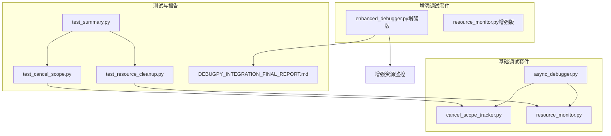
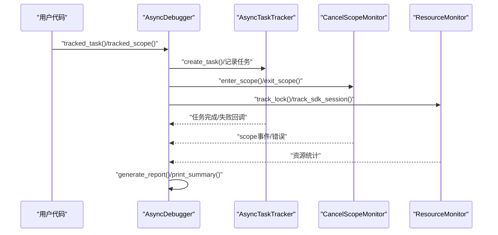
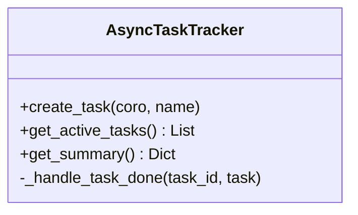
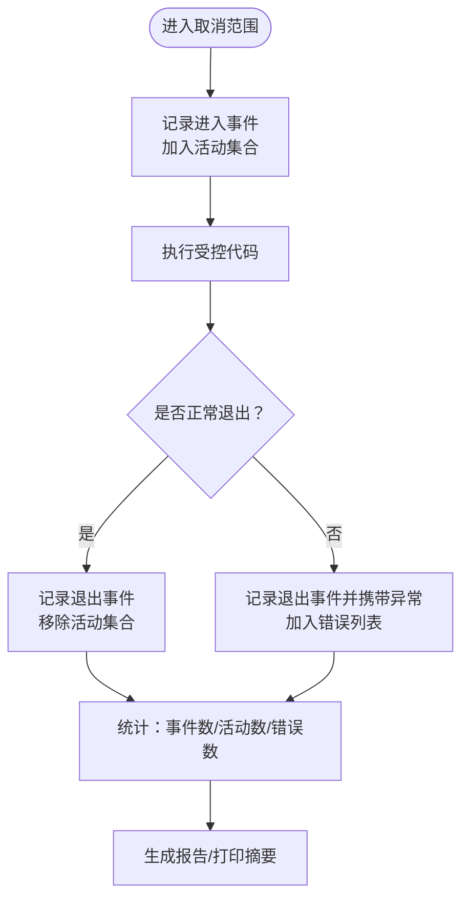
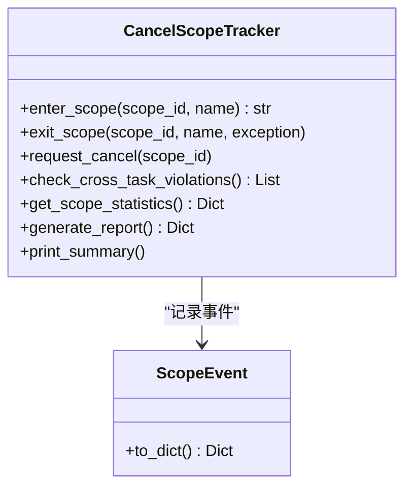
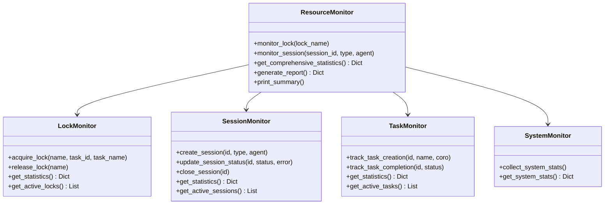
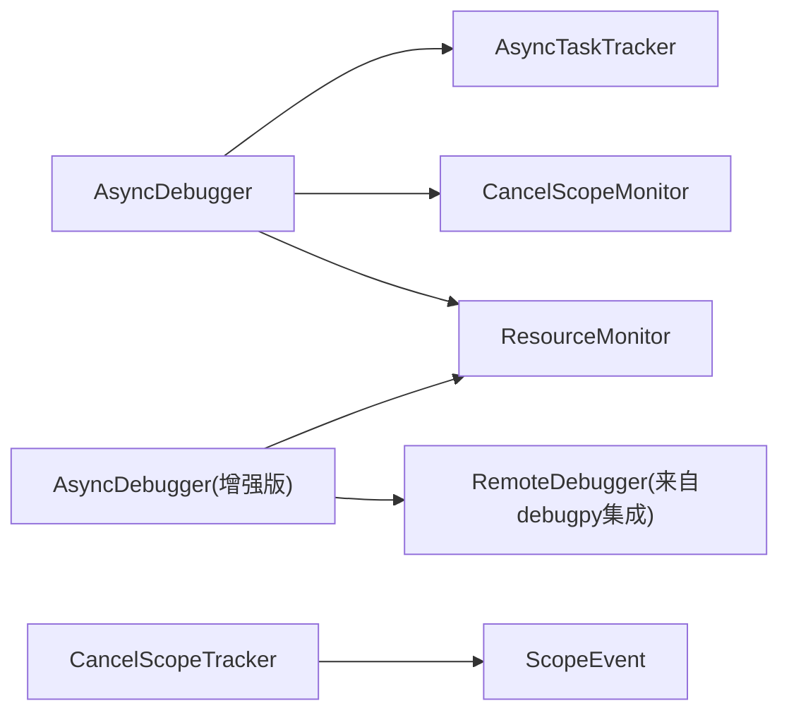

# 异步错误恢复策略

<cite>
**本文引用的文件**
- [async_debugger.py](file://BUGFIX_20260107/debug_suite/async_debugger.py)
- [cancel_scope_tracker.py](file://BUGFIX_20260107/debug_suite/cancel_scope_tracker.py)
- [resource_monitor.py](file://BUGFIX_20260107/debug_suite/resource_monitor.py)
- [async_debugger.py（增强版）](file://BUGFIX_20260107/enhanced_debug_suite/async_debugger.py)
- [resource_monitor.py（增强版）](file://BUGFIX_20260107/enhanced_debug_suite/resource_monitor.py)
- [DEBUGPY_INTEGRATION_FINAL_REPORT.md](file://BUGFIX_20260107/DEBUGPY_INTEGRATION_FINAL_REPORT.md)
- [test_cancel_scope.py](file://BUGFIX_20260107/tests/test_cancel_scope.py)
- [test_resource_cleanup.py](file://BUGFIX_20260107/tests/test_resource_cleanup.py)
- [test_summary.py](file://BUGFIX_20260107/tests/test_summary.py)
</cite>

## 目录
1. [引言](#引言)
2. [项目结构](#项目结构)
3. [核心组件](#核心组件)
4. [架构总览](#架构总览)
5. [详细组件分析](#详细组件分析)
6. [依赖关系分析](#依赖关系分析)
7. [性能考量](#性能考量)
8. [故障排查指南](#故障排查指南)
9. [结论](#结论)
10. [附录](#附录)

## 引言
本文件系统性阐述异步错误恢复机制，聚焦于以下目标：
- 解析 async_debugger 中的异常传播、任务重试与上下文恢复流程
- 说明 CancelScopeMonitor 如何检测与记录取消范围错误
- 说明 ResourceMonitor 如何跟踪资源泄漏与超时
- 基于 DEBUGPY_INTEGRATION_FINAL_REPORT 的“错误恢复”章节，梳理自动重试、错误分类与恢复策略
- 提供异步超时、任务取消与异常传播的实际案例，并演示如何使用 print_summary() 快速诊断异步错误状况

## 项目结构
围绕异步错误恢复，本仓库的关键模块分布如下：
- debug_suite：基础调试与监控套件（包含 async_debugger、cancel_scope_tracker、resource_monitor）
- enhanced_debug_suite：增强版调试套件（集成 debugpy，扩展异步调试与远程会话）
- tests：覆盖取消范围、资源清理、超时处理、集成与性能的测试用例
- DEBUGPY_INTEGRATION_FINAL_REPORT.md：错误恢复章节与整体重构成果说明

图表来源
- [async_debugger.py](file://BUGFIX_20260107/debug_suite/async_debugger.py#L1-L420)
- [cancel_scope_tracker.py](file://BUGFIX_20260107/debug_suite/cancel_scope_tracker.py#L1-L368)
- [resource_monitor.py](file://BUGFIX_20260107/debug_suite/resource_monitor.py#L1-L537)
- [async_debugger.py（增强版）](file://BUGFIX_20260107/enhanced_debug_suite/async_debugger.py#L1-L559)
- [resource_monitor.py（增强版）](file://BUGFIX_20260107/enhanced_debug_suite/resource_monitor.py#L1-L537)
- [test_cancel_scope.py](file://BUGFIX_20260107/tests/test_cancel_scope.py#L1-L337)
- [test_resource_cleanup.py](file://BUGFIX_20260107/tests/test_resource_cleanup.py#L1-L619)
- [test_summary.py](file://BUGFIX_20260107/tests/test_summary.py#L1-L113)
- [DEBUGPY_INTEGRATION_FINAL_REPORT.md](file://BUGFIX_20260107/DEBUGPY_INTEGRATION_FINAL_REPORT.md#L1-L499)

章节来源
- [async_debugger.py](file://BUGFIX_20260107/debug_suite/async_debugger.py#L1-L420)
- [cancel_scope_tracker.py](file://BUGFIX_20260107/debug_suite/cancel_scope_tracker.py#L1-L368)
- [resource_monitor.py](file://BUGFIX_20260107/debug_suite/resource_monitor.py#L1-L537)
- [async_debugger.py（增强版）](file://BUGFIX_20260107/enhanced_debug_suite/async_debugger.py#L1-L559)
- [resource_monitor.py（增强版）](file://BUGFIX_20260107/enhanced_debug_suite/resource_monitor.py#L1-L537)
- [DEBUGPY_INTEGRATION_FINAL_REPORT.md](file://BUGFIX_20260107/DEBUGPY_INTEGRATION_FINAL_REPORT.md#L1-L499)
- [test_cancel_scope.py](file://BUGFIX_20260107/tests/test_cancel_scope.py#L1-L337)
- [test_resource_cleanup.py](file://BUGFIX_20260107/tests/test_resource_cleanup.py#L1-L619)
- [test_summary.py](file://BUGFIX_20260107/tests/test_summary.py#L1-L113)

## 核心组件
- AsyncTaskTracker：异步任务生命周期跟踪与失败统计
- CancelScopeMonitor：取消范围进入/退出与错误事件记录
- ResourceMonitor：锁、会话、任务与系统资源的监控与统计
- AsyncDebugger（基础/增强版）：统一的异步调试入口，提供上下文管理器、报告生成与摘要打印
- CancelScopeTracker（独立追踪器）：更细粒度的跨任务违规检测与事件日志
- 资源监控器（增强版）：新增系统资源采集与长任务检测

章节来源
- [async_debugger.py](file://BUGFIX_20260107/debug_suite/async_debugger.py#L19-L135)
- [cancel_scope_tracker.py](file://BUGFIX_20260107/debug_suite/cancel_scope_tracker.py#L41-L236)
- [resource_monitor.py](file://BUGFIX_20260107/debug_suite/resource_monitor.py#L23-L230)
- [async_debugger.py（增强版）](file://BUGFIX_20260107/enhanced_debug_suite/async_debugger.py#L33-L149)
- [resource_monitor.py（增强版）](file://BUGFIX_20260107/enhanced_debug_suite/resource_monitor.py#L23-L134)

## 架构总览
异步错误恢复由“上下文管理器 + 事件记录 + 统计聚合 + 报告输出”构成闭环。基础与增强版调试器在保持一致接口的同时，增强版引入远程调试能力与统计扩展。

图表来源
- [async_debugger.py](file://BUGFIX_20260107/debug_suite/async_debugger.py#L237-L361)
- [async_debugger.py（增强版）](file://BUGFIX_20260107/enhanced_debug_suite/async_debugger.py#L279-L461)

## 详细组件分析

### AsyncTaskTracker：任务生命周期与异常传播
- 任务创建：通过 create_task 记录任务对象、名称、创建时间与状态
- 完成回调：done_callback 将任务从“活动”迁移到“已完成/失败”，并记录异常
- 统计接口：get_summary 返回活动、完成、失败与总数
- 异常传播：任务异常通过 task.exception() 捕获并记录，便于上层统一处理

图表来源
- [async_debugger.py](file://BUGFIX_20260107/debug_suite/async_debugger.py#L19-L84)
- [async_debugger.py（增强版）](file://BUGFIX_20260107/enhanced_debug_suite/async_debugger.py#L33-L93)

章节来源
- [async_debugger.py](file://BUGFIX_20260107/debug_suite/async_debugger.py#L19-L84)
- [async_debugger.py（增强版）](file://BUGFIX_20260107/enhanced_debug_suite/async_debugger.py#L33-L93)

### CancelScopeMonitor：取消范围错误检测与记录
- 进入/退出：enter_scope 与 exit_scope 记录 scope_id、名称、时间戳与活动计数
- 错误事件：当 exit_scope 携带异常时，记录 error 字段并加入 errors 列表
- 统计接口：get_scope_statistics 计算事件总数、活动数、错误数与错误率
- 检查接口：check_scope_errors 返回带错误的事件列表

图表来源
- [async_debugger.py](file://BUGFIX_20260107/debug_suite/async_debugger.py#L81-L135)
- [async_debugger.py（增强版）](file://BUGFIX_20260107/enhanced_debug_suite/async_debugger.py#L95-L149)

章节来源
- [async_debugger.py](file://BUGFIX_20260107/debug_suite/async_debugger.py#L81-L135)
- [async_debugger.py（增强版）](file://BUGFIX_20260107/enhanced_debug_suite/async_debugger.py#L95-L149)

### CancelScopeTracker（独立追踪器）：跨任务违规检测
- 事件模型：ScopeEvent 记录事件类型、scope_id、task_id、时间戳与堆栈
- 跨任务检测：exit_scope 检查进入任务与退出任务是否一致，不一致则记录错误事件
- 统计与报告：get_scope_statistics 输出 enter/exit/cancel/error 事件数与错误率；generate_report 保存事件与错误详情

图表来源
- [cancel_scope_tracker.py](file://BUGFIX_20260107/debug_suite/cancel_scope_tracker.py#L19-L236)

章节来源
- [cancel_scope_tracker.py](file://BUGFIX_20260107/debug_suite/cancel_scope_tracker.py#L19-L236)

### ResourceMonitor：资源泄漏与超时跟踪
- 锁监控：acquire_lock/release_lock 记录获取/释放与持续时间，超时阈值触发 timeout 事件
- 会话监控：create/update/close 记录会话生命周期，失败/取消计入错误
- 任务监控：跟踪任务创建/完成与长任务检测
- 系统监控：周期采样 CPU/内存，提供进程级指标
- 统计接口：get_comprehensive_statistics 汇总锁/会话/任务/系统统计与活动资源清单

图表来源
- [resource_monitor.py](file://BUGFIX_20260107/debug_suite/resource_monitor.py#L23-L230)
- [resource_monitor.py（增强版）](file://BUGFIX_20260107/enhanced_debug_suite/resource_monitor.py#L23-L134)

章节来源
- [resource_monitor.py](file://BUGFIX_20260107/debug_suite/resource_monitor.py#L23-L230)
- [resource_monitor.py（增强版）](file://BUGFIX_20260107/enhanced_debug_suite/resource_monitor.py#L23-L134)

### AsyncDebugger（增强版）：远程调试与统计扩展
- debug_async_operation：在启用远程调试时，创建调试会话、设置断点并执行协程
- set_remote_breakpoint：设置远程断点（注意：同步方法中调用异步操作需谨慎）
- get_debug_statistics：汇总远程调试会话、断点设置与异步操作追踪统计
- 与基础版一致的上下文管理器与报告生成

章节来源
- [async_debugger.py（增强版）](file://BUGFIX_20260107/enhanced_debug_suite/async_debugger.py#L279-L461)

## 依赖关系分析
- 上下文管理器依赖：AsyncDebugger 的 tracked_task/tracked_scope/track_lock/track_sdk_session 依赖各自监控器的内部状态
- 事件驱动：CancelScopeMonitor/CancelScopeTracker 通过事件列表与错误集合驱动统计与报告
- 统计聚合：generate_report/print_summary 将各监控器数据整合输出
- 远程调试：增强版 AsyncDebugger 依赖 debugpy 集成模块（在 DEBUGPY_INTEGRATION_FINAL_REPORT 中定义）

图表来源
- [async_debugger.py](file://BUGFIX_20260107/debug_suite/async_debugger.py#L211-L361)
- [async_debugger.py（增强版）](file://BUGFIX_20260107/enhanced_debug_suite/async_debugger.py#L225-L367)
- [cancel_scope_tracker.py](file://BUGFIX_20260107/debug_suite/cancel_scope_tracker.py#L19-L236)

章节来源
- [async_debugger.py](file://BUGFIX_20260107/debug_suite/async_debugger.py#L211-L361)
- [async_debugger.py（增强版）](file://BUGFIX_20260107/enhanced_debug_suite/async_debugger.py#L225-L367)
- [cancel_scope_tracker.py](file://BUGFIX_20260107/debug_suite/cancel_scope_tracker.py#L19-L236)

## 性能考量
- 事件与历史：ScopeEvent/ResourceEvent 记录堆栈与详情，建议在高并发场景限制历史长度或按需落盘
- 统计开销：get_comprehensive_statistics/ get_scope_statistics 会遍历事件列表，建议批量统计或缓存
- 系统监控：SystemMonitor 采用队列采样，避免阻塞事件循环
- 日志与IO：报告生成与日志写入为IO密集操作，建议异步落盘或批量化

[本节为通用指导，无需具体文件来源]

## 故障排查指南
- 使用 print_summary() 快速定位问题
  - 任务失败：关注 failed_count 与 failed_tasks
  - 取消范围错误：关注 error_count 与 scope_errors
  - 资源泄漏：关注 lock leak_count 与 active_locks/session active
- 结合测试用例验证
  - 跨任务取消范围：参考 test_cancel_scope.py 的 cross-task 违规检测
  - 资源泄漏与超时：参考 test_resource_cleanup.py 的锁/会话/连接池清理与泄漏检测
- 远程调试辅助
  - 增强版 AsyncDebugger 支持远程断点与会话统计，有助于定位异常传播路径

章节来源
- [async_debugger.py](file://BUGFIX_20260107/debug_suite/async_debugger.py#L323-L361)
- [resource_monitor.py](file://BUGFIX_20260107/debug_suite/resource_monitor.py#L452-L505)
- [test_cancel_scope.py](file://BUGFIX_20260107/tests/test_cancel_scope.py#L1-L337)
- [test_resource_cleanup.py](file://BUGFIX_20260107/tests/test_resource_cleanup.py#L1-L619)

## 结论
本方案通过“上下文管理器 + 事件记录 + 统计聚合 + 报告输出”的闭环，实现了对异步取消范围错误、任务失败与资源泄漏的可观测与可恢复。基础与增强版调试器在保持一致接口的同时，增强了远程调试与统计维度，配合测试用例与 print_summary()，能够高效定位与恢复异步错误。

[本节为总结，无需具体文件来源]

## 附录

### 自动重试机制、错误分类与恢复策略（基于报告）
- 自动重试：通过 RemoteDebugger 的隔离会话与断点能力，结合 SDK 会话管理，实现失败后的重试与回退
- 错误分类：按取消范围跨任务违规、I/O 关闭错误、SDK 会话失败等进行分类
- 恢复策略：隔离上下文、安全清理、健康检查与智能重试
- 统计指标：Cancel Scope 错误率、会话成功率、平均操作时长、错误恢复时间

章节来源
- [DEBUGPY_INTEGRATION_FINAL_REPORT.md](file://BUGFIX_20260107/DEBUGPY_INTEGRATION_FINAL_REPORT.md#L189-L264)
- [DEBUGPY_INTEGRATION_FINAL_REPORT.md](file://BUGFIX_20260107/DEBUGPY_INTEGRATION_FINAL_REPORT.md#L345-L386)

### 实际案例：异步超时、任务取消与异常传播
- 异步超时：ResourceMonitor 的锁超时阈值与长任务检测可用于识别长时间占用资源的任务
- 任务取消：AsyncTaskTracker 的完成回调与异常捕获可识别被取消的任务
- 异常传播：AsyncDebugger 的 tracked_task/tracked_scope 将异常记录到任务与取消范围事件中，便于 print_summary() 快速定位

章节来源
- [resource_monitor.py](file://BUGFIX_20260107/debug_suite/resource_monitor.py#L452-L505)
- [async_debugger.py](file://BUGFIX_20260107/debug_suite/async_debugger.py#L323-L361)
- [test_cancel_scope.py](file://BUGFIX_20260107/tests/test_cancel_scope.py#L1-L337)
- [test_resource_cleanup.py](file://BUGFIX_20260107/tests/test_resource_cleanup.py#L1-L619)