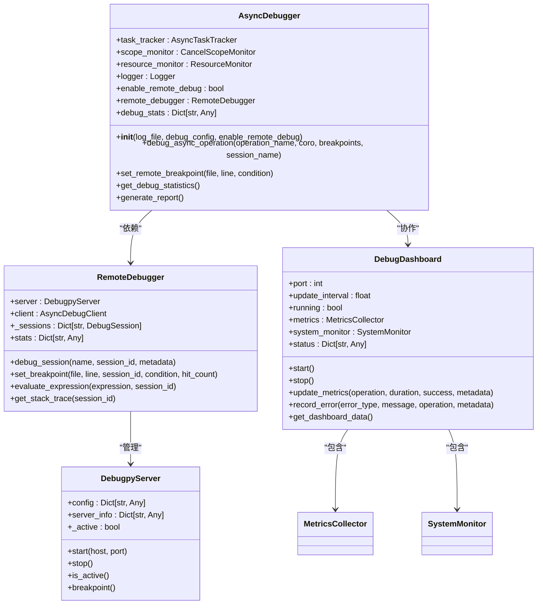
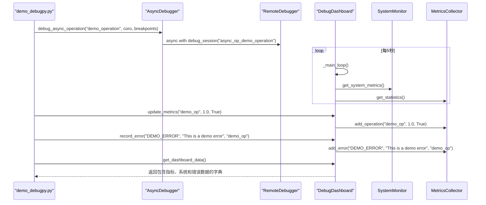
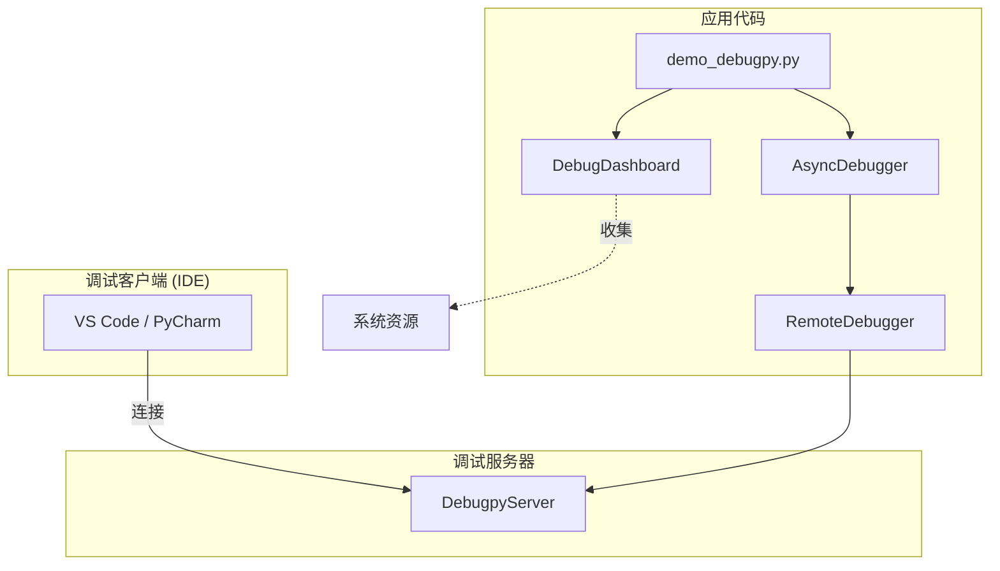

# 会话工作流演示

<cite>
**本文档引用的文件**   
- [demo_debugpy.py](file://BUGFIX_20260107/demo_debugpy.py)
- [async_debugger.py](file://autoBMAD/epic_automation/monitoring/async_debugger.py)
- [debug_dashboard.py](file://BUGFIX_20260107/enhanced_debug_suite/debug_dashboard.py)
- [remote_debugger.py](file://autoBMAD/epic_automation/debugpy_integration/remote_debugger.py)
- [debugpy_server.py](file://autoBMAD/epic_automation/debugpy_integration/debugpy_server.py)
- [start_debug_services.py](file://BUGFIX_20260107/start_debug_services.py)
- [README_DEBUGPY.md](file://BUGFIX_20260107/README_DEBUGPY.md)
- [BUGFIX_SUMMARY.md](file://BUGFIX_20260107/BUGFIX_SUMMARY.md)
</cite>

## 目录
1. [简介](#简介)
2. [调试会话工作流](#调试会话工作流)
3. [核心组件分析](#核心组件分析)
4. [断点机制详解](#断点机制详解)
5. [性能指标与错误监控](#性能指标与错误监控)
6. [后续步骤指南](#后续步骤指南)
7. [架构概览](#架构概览)

## 简介

本演示文档基于`demo_debugpy.py`脚本，全面展示了一个完整的调试会话工作流程。该脚本是BUGFIX_20260107项目中调试框架集成的核心示例，旨在演示如何利用`debugpy`进行异步代码的远程调试。文档将详细解析从创建`RemoteDebugger`实例到执行带断点的异步操作，再到通过`DebugDashboard`收集性能指标的全过程。同时，将深入解释脚本末尾提供的“下一步”操作指南，为开发者提供端到端的实践指引。

**Section sources**
- [demo_debugpy.py](file://BUGFIX_20260107/demo_debugpy.py#L1-L138)
- [README_DEBUGPY.md](file://BUGFIX_20260107/README_DEBUGPY.md#L1-L194)

## 调试会话工作流

`demo_debugpy.py`脚本通过一个清晰的`main()`函数，演示了调试会话的完整生命周期。该工作流始于创建关键的调试组件，终于执行调试操作并收集结果。

1.  **创建AsyncDebugger**: 脚本首先实例化一个`AsyncDebugger`对象，该对象是调试功能的核心。它被配置为启用远程调试（`enable_remote_debug=True`），从而能够与`debugpy`服务器交互。
2.  **创建DebugDashboard**: 接着，脚本创建一个`DebugDashboard`实例。这是一个实时监控仪表板，用于可视化调试过程中的性能指标和错误。
3.  **创建DebugpyServer和RemoteDebugger**: 脚本随后创建了`DebugpyServer`（调试服务器）和`RemoteDebugger`（远程调试器）的实例。`RemoteDebugger`是与`debugpy`服务器通信的高级接口，负责管理调试会话、设置断点等。
4.  **执行调试操作**: 脚本调用`AsyncDebugger`的`debug_async_operation()`方法。此方法是工作流的核心，它接受一个异步操作（`demo_async_operation`）、一个断点列表，并在`RemoteDebugger`的会话中执行该操作。
5.  **收集和展示指标**: 操作执行后，脚本使用`DebugDashboard`的`update_metrics()`和`record_error()`方法来丰富调试上下文。最后，通过`get_dashboard_data()`获取并打印收集到的指标。

```mermaid
flowchart TD
A[开始] --> B[创建AsyncDebugger]
B --> C[创建DebugDashboard]
C --> D[创建DebugpyServer]
D --> E[创建RemoteDebugger]
E --> F[执行debug_async_operation]
F --> G[在RemoteDebugger会话中运行]
G --> H[设置断点 breakpoints=[("demo_debugpy.py", 42)]]
H --> I[执行异步操作 demo_async_operation()]
I --> J[操作完成]
J --> K[更新仪表板指标 update_metrics()]
K --> L[记录错误 record_error()]
L --> M[获取仪表板数据 get_dashboard_data()]
M --> N[打印结果]
N --> O[结束]
```

**Diagram sources**
- [demo_debugpy.py](file://BUGFIX_20260107/demo_debugpy.py#L32-L117)

**Section sources**
- [demo_debugpy.py](file://BUGFIX_20260107/demo_debugpy.py#L32-L117)

## 核心组件分析

### AsyncDebugger 分析

`AsyncDebugger`类是调试功能的中枢，它整合了远程调试、任务跟踪和资源监控。其核心功能是`debug_async_operation()`方法。



**Diagram sources**
- [async_debugger.py](file://autoBMAD/epic_automation/monitoring/async_debugger.py#L225-L572)
- [remote_debugger.py](file://autoBMAD/epic_automation/debugpy_integration/remote_debugger.py#L67-L683)
- [debugpy_server.py](file://autoBMAD/epic_automation/debugpy_integration/debugpy_server.py#L21-L408)
- [debug_dashboard.py](file://BUGFIX_20260107/enhanced_debug_suite/debug_dashboard.py#L167-L469)

**Section sources**
- [async_debugger.py](file://autoBMAD/epic_automation/monitoring/async_debugger.py#L225-L572)

### DebugDashboard 分析

`DebugDashboard`是一个实时监控仪表板，用于可视化调试过程中的关键信息。它由`MetricsCollector`和`SystemMonitor`两个核心组件构成。



**Diagram sources**
- [debug_dashboard.py](file://BUGFIX_20260107/enhanced_debug_suite/debug_dashboard.py#L167-L469)
- [demo_debugpy.py](file://BUGFIX_20260107/demo_debugpy.py#L94-L102)

**Section sources**
- [debug_dashboard.py](file://BUGFIX_20260107/enhanced_debug_suite/debug_dashboard.py#L167-L469)

## 断点机制详解

`breakpoints=[("demo_debugpy.py", 42)]`参数是实现代码级调试的关键。它指示调试器在指定文件的特定行上设置断点。

1.  **参数解析**: 该参数是一个元组列表，每个元组包含文件路径和行号。在此例中，它要求在`demo_debugpy.py`文件的第42行设置断点。
2.  **内部流程**: 当`AsyncDebugger.debug_async_operation()`被调用时，它会：
    *   检查`enable_remote_debug`是否为`True`。
    *   如果是，则进入`RemoteDebugger`的`debug_session`上下文管理器。
    *   遍历`breakpoints`列表，对每个`(file, line)`调用`RemoteDebugger.set_breakpoint()`方法。
    *   `RemoteDebugger`通过其`AsyncDebugClient`与`debugpy`服务器通信，实际设置断点。
3.  **触发条件**: 当被调试的异步操作（`demo_async_operation`）执行到第42行时，如果此时有IDE（如VS Code或PyCharm）连接到`debugpy`服务器，程序执行将暂停，开发者可以检查变量、调用栈等。

**Section sources**
- [demo_debugpy.py](file://BUGFIX_20260107/demo_debugpy.py#L83-L84)
- [async_debugger.py](file://autoBMAD/epic_automation/monitoring/async_debugger.py#L296-L341)
- [remote_debugger.py](file://autoBMAD/epic_automation/debugpy_integration/remote_debugger.py#L198-L258)

## 性能指标与错误监控

`DebugDashboard`通过`update_metrics()`和`record_error()`方法极大地丰富了调试上下文，提供了超越传统断点的洞察力。

*   **`update_metrics()`**: 该方法用于记录操作的性能数据。在示例中：
    *   `dashboard.update_metrics("demo_op", 1.0, True)` 记录了一次成功的`demo_op`操作，耗时1.0秒。
    *   `dashboard.update_metrics("demo_op", 2.0, True)` 记录了另一次成功的`demo_op`操作，耗时2.0秒。
    *   `dashboard.update_metrics("demo_op", 0.5, False)` 记录了一次失败的`demo_op`操作，耗时0.5秒。
    这些数据被`MetricsCollector`收集，用于计算成功率、平均持续时间、错误率等统计信息。

*   **`record_error()`**: 该方法用于记录特定的错误事件。在示例中：
    *   `dashboard.record_error("DEMO_ERROR", "This is a demo error", "demo_op")` 记录了一个类型为`DEMO_ERROR`的错误，关联到`demo_op`操作。
    这些错误信息被分类存储，便于事后分析。

最终，`get_dashboard_data()`方法将所有这些信息（操作、错误、系统资源）聚合为一个全面的JSON对象，为开发者提供了一个完整的性能和健康状况视图。

**Section sources**
- [demo_debugpy.py](file://BUGFIX_20260107/demo_debugpy.py#L94-L98)
- [debug_dashboard.py](file://BUGFIX_20260107/enhanced_debug_suite/debug_dashboard.py#L227-L249)

## 后续步骤指南

脚本末尾的“Next steps”部分为开发者提供了清晰的实践指南，确保调试环境可以成功搭建。

1.  **安装debugpy**: 执行 `pip install debugpy` 命令来安装`debugpy`包。这是所有调试功能的基础。
2.  **启动调试服务器**: 执行以下命令来启动`debugpy`服务器：
    ```bash
    python -c "from debugpy_integration import DebugpyServer; import asyncio; asyncio.run(DebugpyServer().start())"
    ```
    此命令会启动一个监听在默认端口5678上的服务器，并等待IDE连接。
3.  **连接IDE**: 在VS Code或PyCharm等IDE中，配置一个远程调试连接，目标地址为`localhost:5678`。连接成功后，即可在代码中设置断点并进行调试。
4.  **替代启动方式**: 除了上述命令，还可以使用`start_debug_services.py`脚本同时启动调试服务器和仪表板：
    ```bash
    python start_debug_services.py --server --dashboard
    ```
    这将启动`debugpy`服务器（端口5678）和`DebugDashboard`（端口8080）。

**Section sources**
- [demo_debugpy.py](file://BUGFIX_20260107/demo_debugpy.py#L117-L125)
- [start_debug_services.py](file://BUGFIX_20260107/start_debug_services.py#L1-L151)
- [README_DEBUGPY.md](file://BUGFIX_20260107/README_DEBUGPY.md#L55-L64)

## 架构概览

整个调试系统由多个协同工作的模块构成，形成了一个完整的生态系统。



**Diagram sources**
- [README_DEBUGPY.md](file://BUGFIX_20260107/README_DEBUGPY.md#L11-L33)
- [project_structure](file://#project-structure)

**Section sources**
- [README_DEBUGPY.md](file://BUGFIX_20260107/README_DEBUGPY.md#L1-L194)
- [BUGFIX_SUMMARY.md](file://BUGFIX_20260107/BUGFIX_SUMMARY.md#L1-L263)