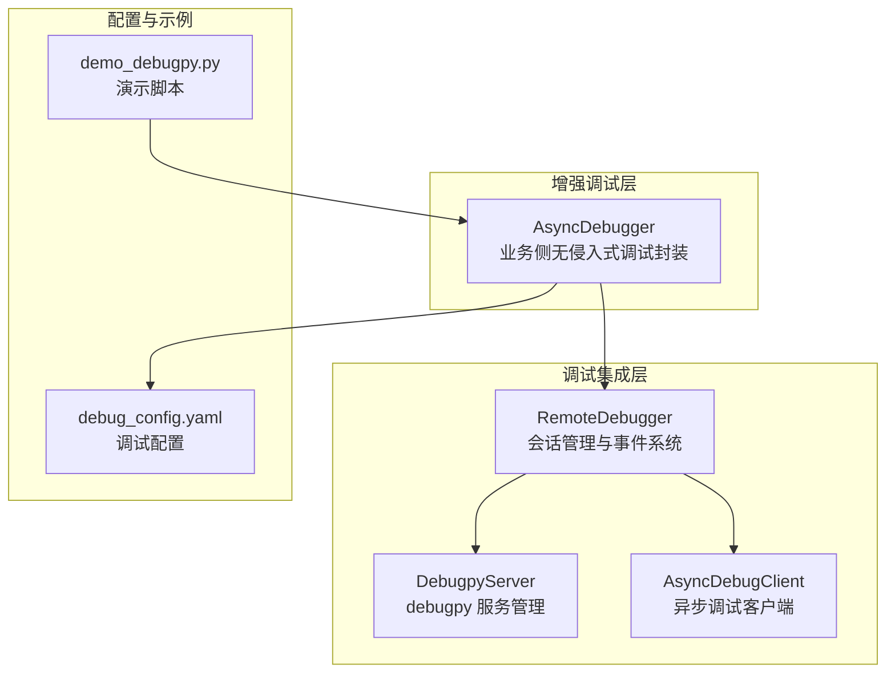
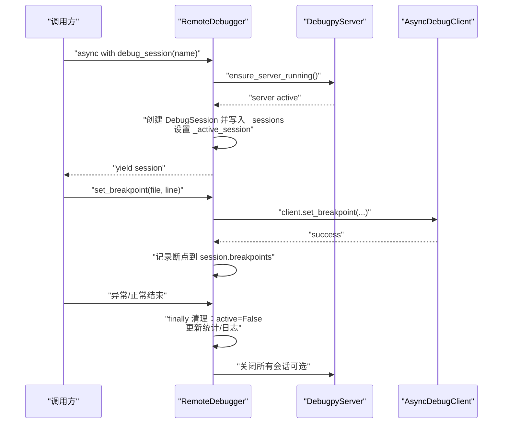
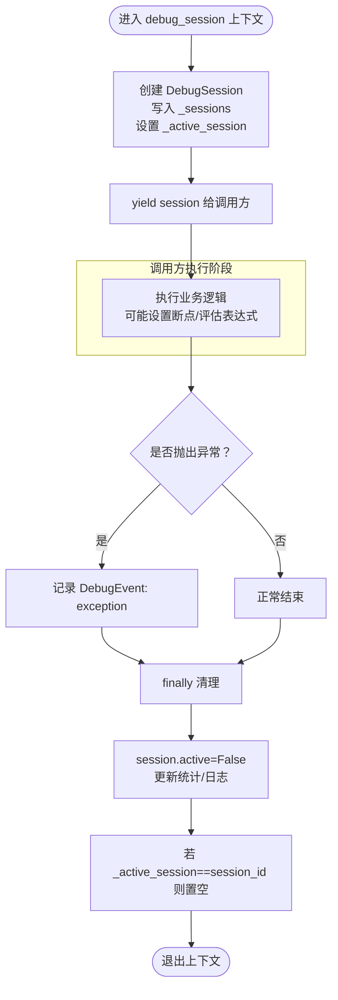
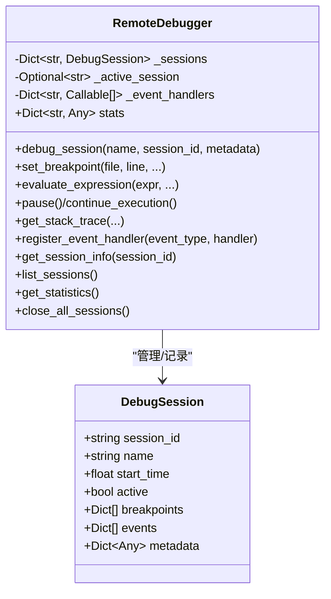
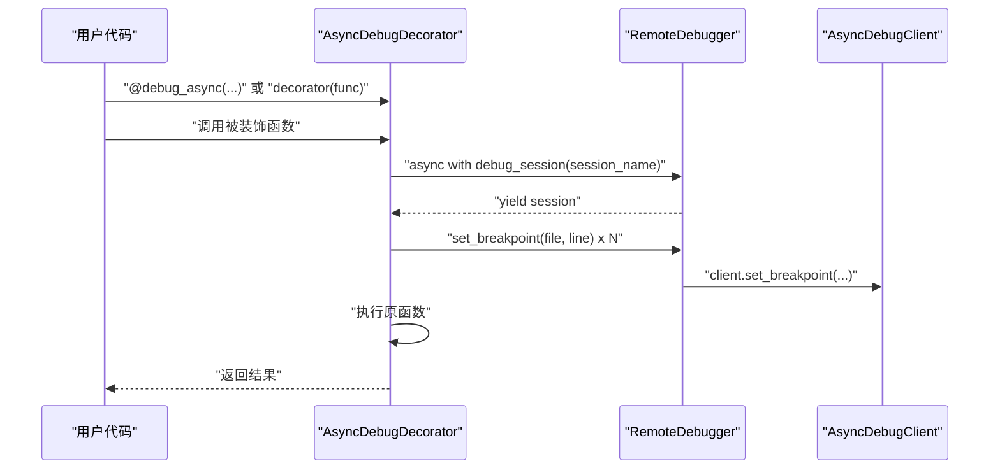
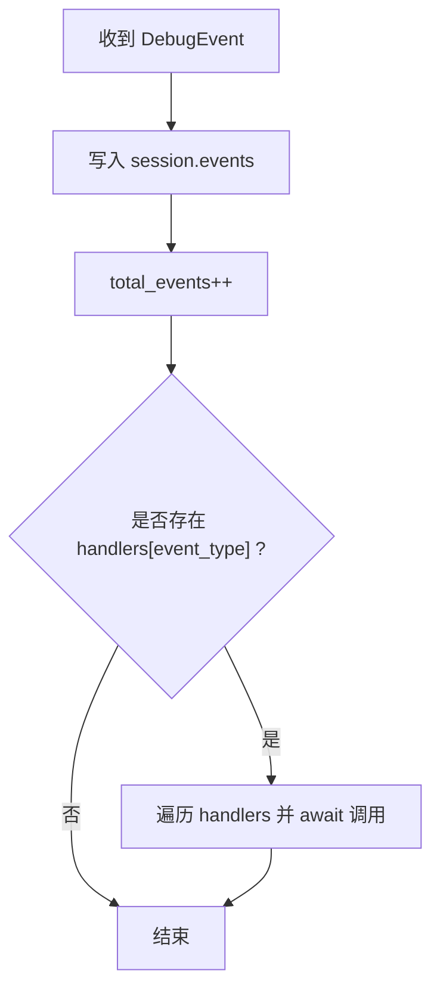
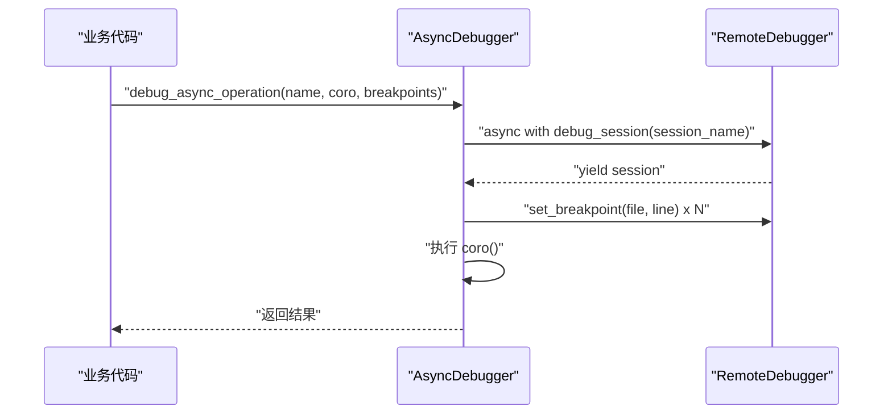
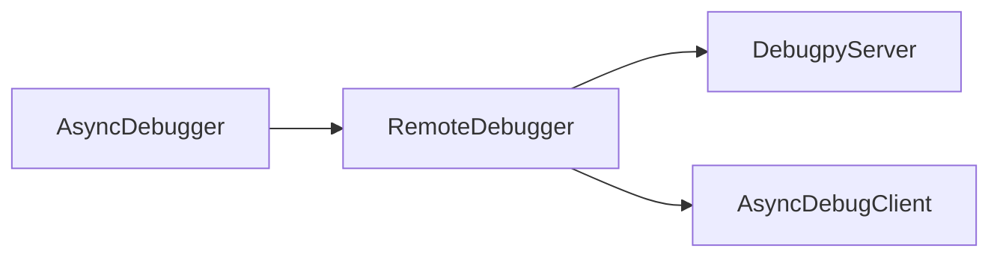

# 异步会话上下文隔离

<cite>
**本文引用的文件**
- [remote_debugger.py](file://autoBMAD\epic_automation\debugpy_integration\remote_debugger.py)
- [debug_client.py](file://autoBMAD\epic_automation\debugpy_integration\debug_client.py)
- [debugpy_server.py](file://autoBMAD\epic_automation\debugpy_integration\debugpy_server.py)
- [async_debugger.py](file://BUGFIX_20260107\enhanced_debug_suite\async_debugger.py)
- [demo_debugpy.py](file://BUGFIX_20260107\demo_debugpy.py)
- [debug_config.yaml](file://BUGFIX_20260107\configs\debug_config.yaml)
</cite>

## 目录
1. [简介](#简介)
2. [项目结构](#项目结构)
3. [核心组件](#核心组件)
4. [架构总览](#架构总览)
5. [详细组件分析](#详细组件分析)
6. [依赖关系分析](#依赖关系分析)
7. [性能考量](#性能考量)
8. [故障排查指南](#故障排查指南)
9. [结论](#结论)
10. [附录](#附录)

## 简介
本文件聚焦于“异步调试会话的上下文隔离”这一主题，围绕以下目标进行深入解析：
- RemoteDebugger 类如何利用 AsyncExitStack 与 debug_session() 上下文管理器实现异步调试会话的上下文隔离；
- _sessions 字典如何跟踪 DebugSession 对象的元数据；
- _active_session 字段如何维护当前会话上下文；
- asynccontextmanager 如何确保在异常情况下仍能正确清理会话资源；
- AsyncDebugDecorator 装饰器如何将函数执行包裹在独立的调试会话中，并自动设置预定义断点，实现无侵入式调试；
- _event_handlers 事件系统如何解耦调试事件的产生与处理。

## 项目结构
本次分析涉及的调试相关模块位于两个目录：
- autoBMAD\epic_automation\debugpy_integration：包含 RemoteDebugger、DebugpyServer、AsyncDebugClient 等核心调试组件；
- BUGFIX_20260107\enhanced_debug_suite：包含 AsyncDebugger 增强版调试器，演示如何在业务层使用 RemoteDebugger 进行无侵入式调试。

图表来源
- [remote_debugger.py](file://autoBMAD\epic_automation\debugpy_integration\remote_debugger.py#L67-L115)
- [debugpy_server.py](file://autoBMAD\epic_automation\debugpy_integration\debugpy_server.py#L1-L120)
- [debug_client.py](file://autoBMAD\epic_automation\debugpy_integration\debug_client.py#L489-L650)
- [async_debugger.py](file://BUGFIX_20260107\enhanced_debug_suite\async_debugger.py#L225-L341)
- [debug_config.yaml](file://BUGFIX_20260107\configs\debug_config.yaml#L1-L200)
- [demo_debugpy.py](file://BUGFIX_20260107\demo_debugpy.py#L1-L138)

章节来源
- [remote_debugger.py](file://autoBMAD\epic_automation\debugpy_integration\remote_debugger.py#L67-L115)
- [debugpy_server.py](file://autoBMAD\epic_automation\debugpy_integration\debugpy_server.py#L1-L120)
- [debug_client.py](file://autoBMAD\epic_automation\debugpy_integration\debug_client.py#L489-L650)
- [async_debugger.py](file://BUGFIX_20260107\enhanced_debug_suite\async_debugger.py#L225-L341)
- [debug_config.yaml](file://BUGFIX_20260107\configs\debug_config.yaml#L1-L200)
- [demo_debugpy.py](file://BUGFIX_20260107\demo_debugpy.py#L1-L138)

## 核心组件
- RemoteDebugger：高阶远程调试器，负责会话生命周期管理、断点设置、表达式求值、事件记录与统计。
- DebugpyServer：debugpy 服务器管理器，负责启动/停止服务器、等待客户端连接、状态查询。
- AsyncDebugClient：异步调试客户端，负责与 debugpy 通信，设置/移除断点、获取栈信息、控制执行等。
- AsyncDebugger（增强版）：在业务层对 RemoteDebugger 的封装，提供无侵入式调试能力，便于在现有异步流程中插入调试。

章节来源
- [remote_debugger.py](file://autoBMAD\epic_automation\debugpy_integration\remote_debugger.py#L67-L115)
- [debugpy_server.py](file://autoBMAD\epic_automation\debugpy_integration\debugpy_server.py#L1-L120)
- [debug_client.py](file://autoBMAD\epic_automation\debugpy_integration\debug_client.py#L489-L650)
- [async_debugger.py](file://BUGFIX_20260107\enhanced_debug_suite\async_debugger.py#L225-L341)

## 架构总览
RemoteDebugger 将“会话上下文隔离”与“事件解耦”两大机制结合：
- 使用 asynccontextmanager 的 debug_session() 提供异步上下文隔离，确保异常时也能清理资源；
- 使用 _sessions 字典与 _active_session 字段维护会话元数据与当前上下文；
- 使用 _event_handlers 解耦事件产生与处理，统一记录 DebugEvent 并分发给注册处理器。

图表来源
- [remote_debugger.py](file://autoBMAD\epic_automation\debugpy_integration\remote_debugger.py#L122-L198)
- [remote_debugger.py](file://autoBMAD\epic_automation\debugpy_integration\remote_debugger.py#L198-L303)
- [remote_debugger.py](file://autoBMAD\epic_automation\debugpy_integration\remote_debugger.py#L434-L475)
- [debugpy_server.py](file://autoBMAD\epic_automation\debugpy_integration\debugpy_server.py#L99-L184)
- [debug_client.py](file://autoBMAD\epic_automation\debugpy_integration\debug_client.py#L95-L138)

## 详细组件分析

### RemoteDebugger：异步会话上下文隔离与资源清理
- debug_session(name, session_id, metadata) 使用 asynccontextmanager 定义异步上下文：
  - 创建 DebugSession 实例，写入 _sessions，设置 _active_session，更新统计；
  - try 块内 yield session 给调用方；
  - except 捕获异常并记录 DebugEvent；
  - finally 始终执行：标记 session.active=False，更新统计，重置 _active_session。
- _sessions 字典键为 session_id，值为 DebugSession，用于存储每个会话的元数据（断点、事件、元信息等）。
- _active_session 记录当前活跃会话 ID，用于断点设置、表达式求值等操作的默认作用域。
- _event_handlers 以事件类型为键，存储异步处理器列表，_log_event 统一记录事件并分发给处理器。

图表来源
- [remote_debugger.py](file://autoBMAD\epic_automation\debugpy_integration\remote_debugger.py#L122-L198)
- [remote_debugger.py](file://autoBMAD\epic_automation\debugpy_integration\remote_debugger.py#L434-L475)

章节来源
- [remote_debugger.py](file://autoBMAD\epic_automation\debugpy_integration\remote_debugger.py#L122-L198)
- [remote_debugger.py](file://autoBMAD\epic_automation\debugpy_integration\remote_debugger.py#L198-L303)
- [remote_debugger.py](file://autoBMAD\epic_automation\debugpy_integration\remote_debugger.py#L434-L475)

### DebugSession 数据模型与统计
- DebugSession 作为会话元数据载体，包含 session_id、name、start_time、active、breakpoints、events、metadata 等字段；
- RemoteDebugger 在 debug_session 生命周期内维护：
  - total_sessions、active_sessions、total_breakpoints、total_events、sessions_created 等统计；
  - 通过 get_session_info/list_sessions/get_statistics 提供查询接口。

图表来源
- [remote_debugger.py](file://autoBMAD\epic_automation\debugpy_integration\remote_debugger.py#L23-L65)
- [remote_debugger.py](file://autoBMAD\epic_automation\debugpy_integration\remote_debugger.py#L67-L115)
- [remote_debugger.py](file://autoBMAD\epic_automation\debugpy_integration\remote_debugger.py#L476-L521)

章节来源
- [remote_debugger.py](file://autoBMAD\epic_automation\debugpy_integration\remote_debugger.py#L23-L65)
- [remote_debugger.py](file://autoBMAD\epic_automation\debugpy_integration\remote_debugger.py#L67-L115)
- [remote_debugger.py](file://autoBMAD\epic_automation\debugpy_integration\remote_debugger.py#L476-L521)

### AsyncDebugDecorator：无侵入式调试装饰器
- AsyncDebugDecorator 接收 RemoteDebugger 实例、会话名与断点列表；
- __call__ 返回包装后的异步函数，内部：
  - 使用 async with debugger.debug_session(session_name) 创建独立会话；
  - 遍历断点列表，逐个调用 debugger.set_breakpoint(file, line)；
  - 执行原函数并返回结果；
- 同时提供 breakpoint(file, line) 方法动态追加断点。

图表来源
- [remote_debugger.py](file://autoBMAD\epic_automation\debugpy_integration\remote_debugger.py#L563-L683)

章节来源
- [remote_debugger.py](file://autoBMAD\epic_automation\debugpy_integration\remote_debugger.py#L563-L683)

### 事件系统：_event_handlers 的解耦设计
- _log_event(event) 将事件写入对应会话的 events 列表，更新 total_events；
- 若存在该事件类型的处理器，则遍历调用，异常被捕获并记录日志；
- register_event_handler(event_type, handler) 注册处理器，支持多处理器并行处理。

图表来源
- [remote_debugger.py](file://autoBMAD\epic_automation\debugpy_integration\remote_debugger.py#L434-L475)

章节来源
- [remote_debugger.py](file://autoBMAD\epic_automation\debugpy_integration\remote_debugger.py#L434-L475)

### 与增强版 AsyncDebugger 的协同
- AsyncDebugger 在业务层对 RemoteDebugger 进行封装，提供 debug_async_operation 等方法；
- 通过 debug_session 与 set_breakpoint 自动化调试流程，无需修改业务函数签名；
- 可读取 debug_config.yaml 中的远程调试配置，按需启用/禁用。

图表来源
- [async_debugger.py](file://BUGFIX_20260107\enhanced_debug_suite\async_debugger.py#L296-L341)
- [debug_config.yaml](file://BUGFIX_20260107\configs\debug_config.yaml#L1-L200)

章节来源
- [async_debugger.py](file://BUGFIX_20260107\enhanced_debug_suite\async_debugger.py#L296-L341)
- [debug_config.yaml](file://BUGFIX_20260107\configs\debug_config.yaml#L1-L200)

## 依赖关系分析
- RemoteDebugger 依赖 DebugpyServer 与 AsyncDebugClient：
  - DebugpyServer 负责服务器生命周期与连接等待；
  - AsyncDebugClient 负责与 debugpy 交互（设置断点、获取栈、控制执行等）。
- AsyncDebugger 依赖 RemoteDebugger，提供更高层的无侵入式调试体验。

图表来源
- [remote_debugger.py](file://autoBMAD\epic_automation\debugpy_integration\remote_debugger.py#L67-L115)
- [debugpy_server.py](file://autoBMAD\epic_automation\debugpy_integration\debugpy_server.py#L1-L120)
- [debug_client.py](file://autoBMAD\epic_automation\debugpy_integration\debug_client.py#L489-L650)
- [async_debugger.py](file://BUGFIX_20260107\enhanced_debug_suite\async_debugger.py#L225-L341)

章节来源
- [remote_debugger.py](file://autoBMAD\epic_automation\debugpy_integration\remote_debugger.py#L67-L115)
- [debugpy_server.py](file://autoBMAD\epic_automation\debugpy_integration\debugpy_server.py#L1-L120)
- [debug_client.py](file://autoBMAD\epic_automation\debugpy_integration\debug_client.py#L489-L650)
- [async_debugger.py](file://BUGFIX_20260107\enhanced_debug_suite\async_debugger.py#L225-L341)

## 性能考量
- 会话创建与清理：debug_session 使用 asynccontextmanager，确保异常路径也能清理，避免资源泄漏；统计字段 total_sessions/active_sessions 有助于观察并发与资源占用。
- 断点设置：set_breakpoint 通过 AsyncDebugClient 与 debugpy 通信，建议在调试阶段合理设置断点数量，避免过多断点导致性能下降。
- 事件处理：_event_handlers 采用异步回调，注意处理器内部的耗时逻辑，避免阻塞事件分发。
- 服务器管理：DebugpyServer.start/stop 为异步方法，建议在长时间运行场景中复用同一服务器实例，减少频繁启停带来的开销。

## 故障排查指南
- 无法连接 debugpy 服务器
  - 检查 DebugpyServer 是否已启动且处于 active 状态；
  - 确认 host/port 配置与客户端一致；
  - 参考 [debugpy_server.py](file://autoBMAD\epic_automation\debugpy_integration\debugpy_server.py#L99-L184)。
- 断点未生效
  - 确认当前会话是否为 _active_session；
  - 检查 AsyncDebugClient 的连接状态；
  - 参考 [debug_client.py](file://autoBMAD\epic_automation\debugpy_integration\debug_client.py#L95-L138)。
- 事件未触发或丢失
  - 检查是否注册了对应事件类型的处理器；
  - 查看 _log_event 的异常捕获与日志输出；
  - 参考 [remote_debugger.py](file://autoBMAD\epic_automation\debugpy_integration\remote_debugger.py#L434-L475)。
- 会话未清理
  - 确认异常路径是否进入 finally；
  - 检查 _active_session 是否被正确重置；
  - 参考 [remote_debugger.py](file://autoBMAD\epic_automation\debugpy_integration\remote_debugger.py#L122-L198)。

章节来源
- [debugpy_server.py](file://autoBMAD\epic_automation\debugpy_integration\debugpy_server.py#L99-L184)
- [debug_client.py](file://autoBMAD\epic_automation\debugpy_integration\debug_client.py#L95-L138)
- [remote_debugger.py](file://autoBMAD\epic_automation\debugpy_integration\remote_debugger.py#L122-L198)
- [remote_debugger.py](file://autoBMAD\epic_automation\debugpy_integration\remote_debugger.py#L434-L475)

## 结论
- RemoteDebugger 通过 asynccontextmanager 的 debug_session() 实现严格的异步上下文隔离，确保异常与正常结束路径都能正确清理资源；
- _sessions 与 _active_session 分别承担“会话元数据存储”和“当前上下文定位”的职责，配合 set_breakpoint/evaluate_expression 等方法形成完整的调试闭环；
- _event_handlers 将事件产生与处理解耦，提升扩展性与可观测性；
- AsyncDebugDecorator 与 AsyncDebugger 将上述能力无缝嵌入业务代码，实现无侵入式调试。

## 附录
- 配置参考：debug_config.yaml 中的 remote_debugging、dashboard、async_debugging 等字段可用于开启/调整远程调试行为；
- 示例参考：demo_debugpy.py 展示了如何在业务中使用增强版调试器与断点。

章节来源
- [debug_config.yaml](file://BUGFIX_20260107\configs\debug_config.yaml#L1-L200)
- [demo_debugpy.py](file://BUGFIX_20260107\demo_debugpy.py#L1-L138)