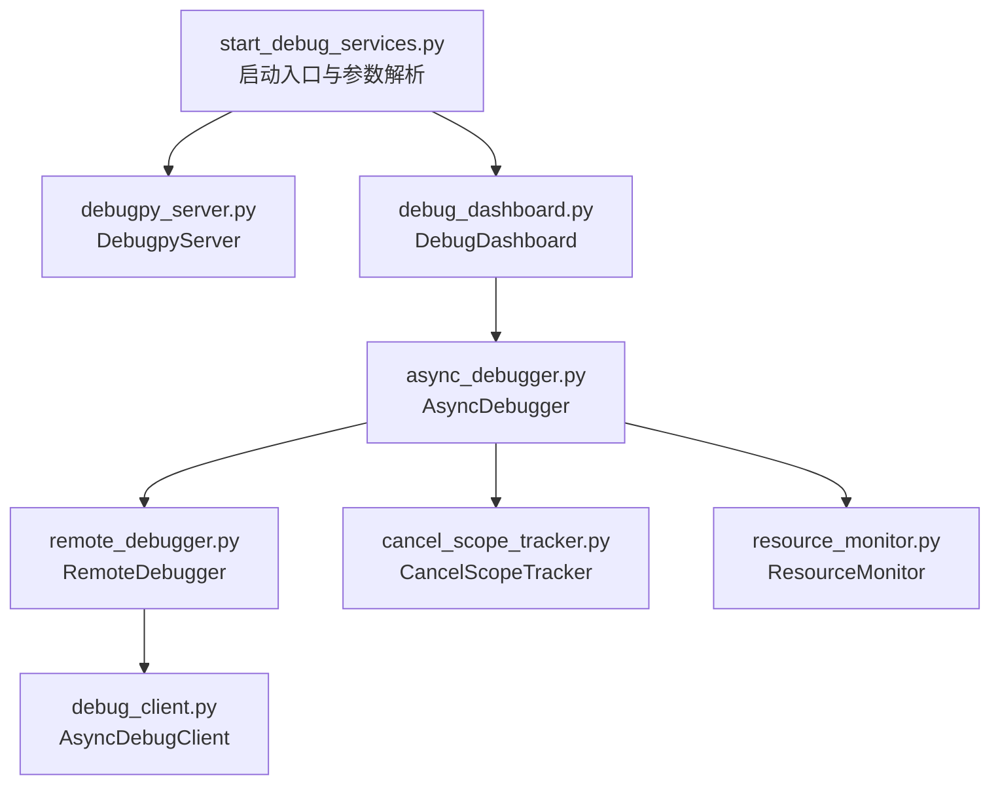
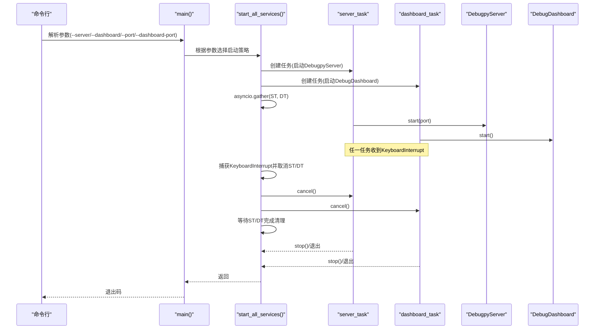
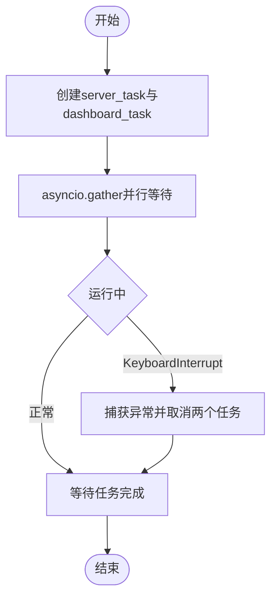
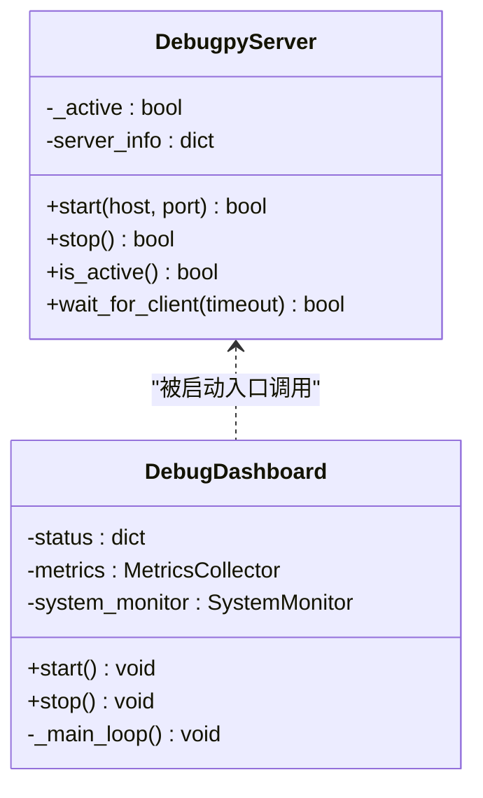
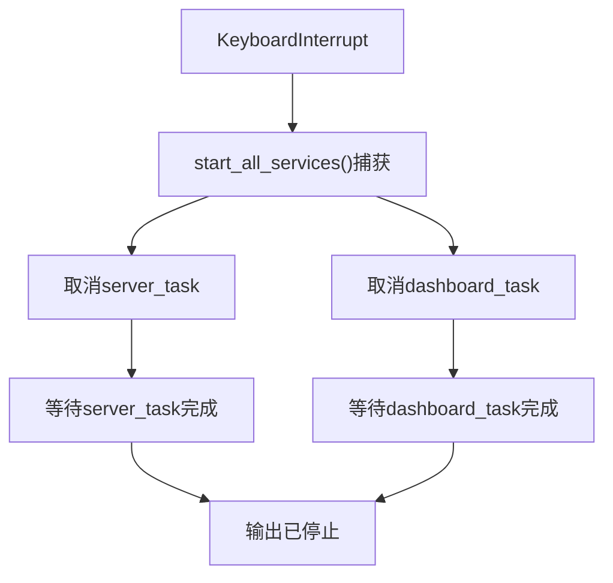
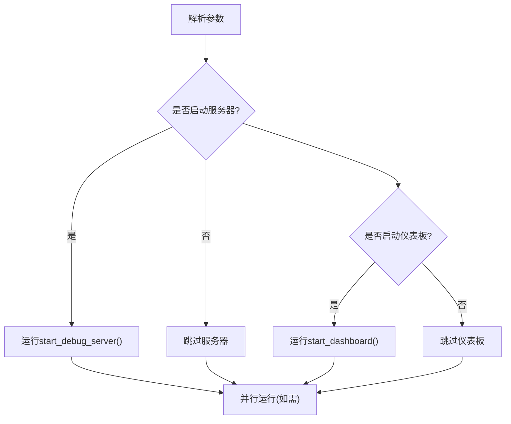
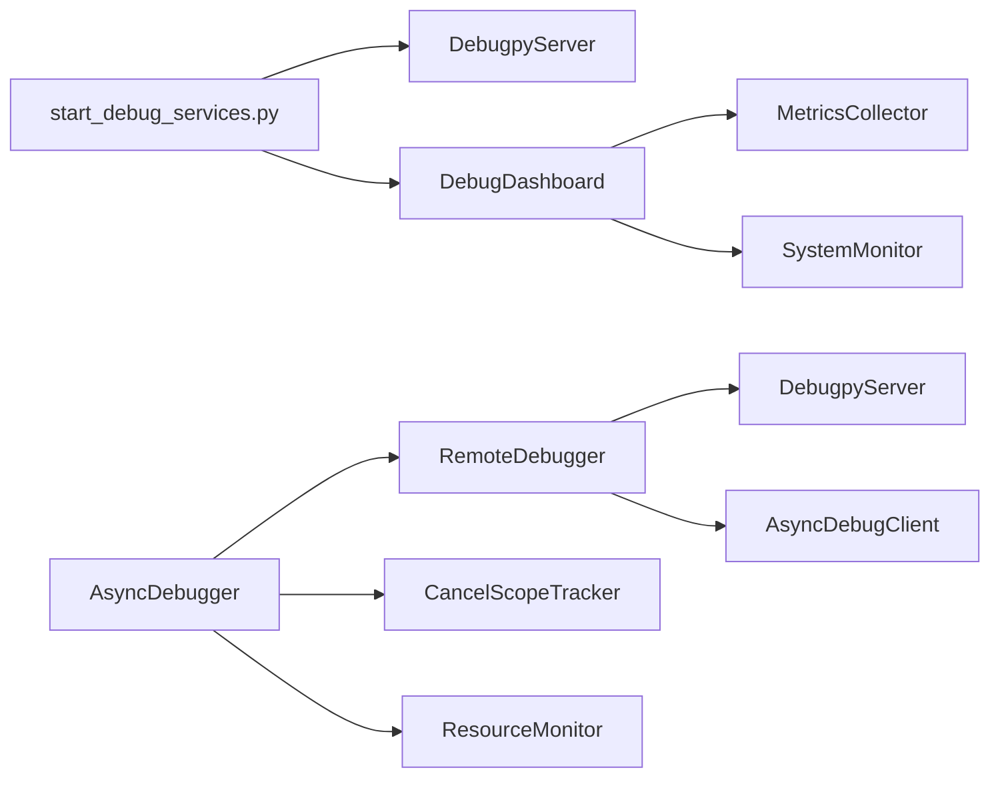

# 服务启动顺序与稳定性

<cite>
**本文引用的文件**
- [start_debug_services.py](file://BUGFIX_20260107/start_debug_services.py)
- [debugpy_server.py](file://autoBMAD/epic_automation/debugpy_integration/debugpy_server.py)
- [debug_dashboard.py](file://BUGFIX_20260107/enhanced_debug_suite/debug_dashboard.py)
- [async_debugger.py](file://BUGFIX_20260107/enhanced_debug_suite/async_debugger.py)
- [remote_debugger.py](file://autoBMAD/epic_automation/debugpy_integration/remote_debugger.py)
- [debug_client.py](file://autoBMAD/epic_automation/debugpy_integration/debug_client.py)
- [cancel_scope_tracker.py](file://BUGFIX_20260107/enhanced_debug_suite/cancel_scope_tracker.py)
- [resource_monitor.py](file://BUGFIX_20260107/enhanced_debug_suite/resource_monitor.py)
</cite>

## 目录
1. [引言](#引言)
2. [项目结构](#项目结构)
3. [核心组件](#核心组件)
4. [架构总览](#架构总览)
5. [详细组件分析](#详细组件分析)
6. [依赖关系分析](#依赖关系分析)
7. [性能考量](#性能考量)
8. [故障排查指南](#故障排查指南)
9. [结论](#结论)

## 引言
本文围绕调试环境的启动流程与稳定性展开，重点剖析脚本 start_debug_services.py 中 start_all_services() 如何通过 asyncio.gather() 并行启动 debugpy_server 与 debug_dashboard，并解释 server_task 与 dashboard_task 的协同机制、KeyboardInterrupt 异常处理如何确保优雅关闭；同时说明 argparse 参数解析器如何灵活组合服务启动（仅服务器、仅仪表板或两者），以及 sys.path 修改对模块导入的影响。最后强调服务启动顺序对调试环境稳定性的重要性：必须确保服务器先于客户端连接。

## 项目结构
本节聚焦与调试服务启动直接相关的模块组织与职责划分：
- 启动入口：start_debug_services.py 提供命令行入口与服务组合启动逻辑
- 调试服务器：debugpy_server.py 提供 debugpy 服务器的启动、等待客户端连接、停止等能力
- 调试仪表板：debug_dashboard.py 提供可视化监控界面与指标采集
- 增强调试套件：async_debugger.py、cancel_scope_tracker.py、resource_monitor.py 提供异步调试、取消作用域与资源监控能力
- 远程调试集成：remote_debugger.py、debug_client.py 提供与 debugpy 的交互接口

图表来源
- [start_debug_services.py](file://BUGFIX_20260107/start_debug_services.py#L1-L151)
- [debugpy_server.py](file://autoBMAD/epic_automation/debugpy_integration/debugpy_server.py#L1-L200)
- [debug_dashboard.py](file://BUGFIX_20260107/enhanced_debug_suite/debug_dashboard.py#L1-L200)
- [async_debugger.py](file://BUGFIX_20260107/enhanced_debug_suite/async_debugger.py#L1-L120)
- [remote_debugger.py](file://autoBMAD/epic_automation/debugpy_integration/remote_debugger.py#L1-L120)
- [debug_client.py](file://autoBMAD/epic_automation/debugpy_integration/debug_client.py#L1-L120)
- [cancel_scope_tracker.py](file://BUGFIX_20260107/enhanced_debug_suite/cancel_scope_tracker.py#L1-L120)
- [resource_monitor.py](file://BUGFIX_20260107/enhanced_debug_suite/resource_monitor.py#L1-L120)

章节来源
- [start_debug_services.py](file://BUGFIX_20260107/start_debug_services.py#L1-L151)

## 核心组件
- 启动入口与参数解析
  - 使用 argparse 支持 --server、--dashboard、--port、--dashboard-port 等选项，决定启动哪些服务
  - 通过 sys.path.insert(0, ...) 将当前目录加入模块搜索路径，确保相对导入能正确解析
- 并行启动与协同
  - start_all_services() 使用 asyncio.create_task() 创建 server_task 与 dashboard_task，再通过 asyncio.gather() 并行等待两个任务完成
  - 当任一任务因 KeyboardInterrupt 被取消时，统一触发取消信号并等待任务清理完成，保证优雅关闭
- 服务职责
  - DebugpyServer：监听指定地址与端口，等待调试器客户端连接，提供断点、等待客户端等能力
  - DebugDashboard：启动本地 Web 服务，周期性采集指标与系统资源，提供可视化展示

章节来源
- [start_debug_services.py](file://BUGFIX_20260107/start_debug_services.py#L57-L151)
- [debugpy_server.py](file://autoBMAD/epic_automation/debugpy_integration/debugpy_server.py#L99-L178)
- [debug_dashboard.py](file://BUGFIX_20260107/enhanced_debug_suite/debug_dashboard.py#L197-L226)

## 架构总览
下图展示了从命令行到服务启动、并行运行与优雅关闭的整体流程。

图表来源
- [start_debug_services.py](file://BUGFIX_20260107/start_debug_services.py#L57-L151)
- [debugpy_server.py](file://autoBMAD/epic_automation/debugpy_integration/debugpy_server.py#L99-L178)
- [debug_dashboard.py](file://BUGFIX_20260107/enhanced_debug_suite/debug_dashboard.py#L197-L226)

## 详细组件分析

### start_all_services() 并行启动与协同机制
- 任务创建
  - server_task：封装 start_debug_server()，负责启动 DebugpyServer 并在循环中等待中断
  - dashboard_task：封装 start_dashboard()，负责启动 DebugDashboard 并在循环中等待中断
- 并行等待
  - 使用 asyncio.gather(server_task, dashboard_task) 并行等待两个任务
  - 若任一任务抛出 KeyboardInterrupt，则捕获并取消另一个任务，随后等待两个任务完成清理
- 协同要点
  - 两个任务独立运行，互不阻塞，提升整体启动效率
  - 统一的取消与清理流程确保服务优雅关闭，避免资源泄漏

图表来源
- [start_debug_services.py](file://BUGFIX_20260107/start_debug_services.py#L57-L80)

章节来源
- [start_debug_services.py](file://BUGFIX_20260107/start_debug_services.py#L57-L80)

### DebugpyServer 与 DebugDashboard 生命周期
- DebugpyServer
  - start(host, port)：配置监听地址与端口，等待调试器客户端连接
  - stop()：标记服务器非活跃状态，记录运行时长
  - is_active()：查询服务器状态
- DebugDashboard
  - start()：启动主循环，周期性更新状态与指标
  - stop()：标记停止状态，结束主循环
  - _main_loop()：基于状态标志的循环控制，支持异常恢复

图表来源
- [debugpy_server.py](file://autoBMAD/epic_automation/debugpy_integration/debugpy_server.py#L99-L178)
- [debug_dashboard.py](file://BUGFIX_20260107/enhanced_debug_suite/debug_dashboard.py#L197-L226)

章节来源
- [debugpy_server.py](file://autoBMAD/epic_automation/debugpy_integration/debugpy_server.py#L99-L178)
- [debug_dashboard.py](file://BUGFIX_20260107/enhanced_debug_suite/debug_dashboard.py#L197-L226)

### 异常处理与优雅关闭
- KeyboardInterrupt 捕获
  - 在 start_all_services() 中捕获 KeyboardInterrupt，取消 server_task 与 dashboard_task
  - 等待两个任务完成后输出“全部服务已停止”，确保清理逻辑执行
- 服务内部处理
  - DebugpyServer 与 DebugDashboard 在各自循环中捕获 KeyboardInterrupt，执行 stop() 并输出停止信息
- 优雅关闭要点
  - 通过取消任务与等待完成，避免强制终止导致的数据丢失或资源未释放
  - 仪表板与服务器分别负责自身的清理，避免相互阻塞

图表来源
- [start_debug_services.py](file://BUGFIX_20260107/start_debug_services.py#L68-L80)
- [debugpy_server.py](file://autoBMAD/epic_automation/debugpy_integration/debugpy_server.py#L149-L183)
- [debug_dashboard.py](file://BUGFIX_20260107/enhanced_debug_suite/debug_dashboard.py#L207-L226)

章节来源
- [start_debug_services.py](file://BUGFIX_20260107/start_debug_services.py#L68-L80)
- [debugpy_server.py](file://autoBMAD/epic_automation/debugpy_integration/debugpy_server.py#L149-L183)
- [debug_dashboard.py](file://BUGFIX_20260107/enhanced_debug_suite/debug_dashboard.py#L207-L226)

### argparse 参数解析与服务组合启动
- 参数定义
  - --server：仅启动调试服务器
  - --dashboard：仅启动调试仪表板
  - --port：调试服务器端口，默认 5678
  - --dashboard-port：仪表板端口，默认 8080
- 启动策略
  - 若未显式指定 --dashboard，则默认启动两者
  - 若未显式指定 --server，则默认启动两者
  - 通过组合参数可实现“仅服务器”、“仅仪表板”或“两者”
- 示例
  - 启动两者：python start_debug_services.py
  - 仅服务器：python start_debug_services.py --server
  - 仅仪表板：python start_debug_services.py --dashboard
  - 自定义端口：python start_debug_services.py --port 5679 --dashboard-port 8081

图表来源
- [start_debug_services.py](file://BUGFIX_20260107/start_debug_services.py#L82-L138)

章节来源
- [start_debug_services.py](file://BUGFIX_20260107/start_debug_services.py#L82-L138)

### sys.path 修改对模块导入的影响
- 影响范围
  - 通过 sys.path.insert(0, str(Path(__file__).parent)) 将脚本所在目录插入到搜索路径首位
  - 使后续 from debugpy_integration import DebugpyServer 与 from enhanced_debug_suite import DebugDashboard 能够正确解析相对模块
- 注意事项
  - 插入到索引 0 可能覆盖系统安装包，建议在脚本入口处尽早执行
  - 若项目结构复杂，应结合虚拟环境与标准包布局，避免与第三方包冲突

章节来源
- [start_debug_services.py](file://BUGFIX_20260107/start_debug_services.py#L16-L18)

### 服务启动顺序与调试环境稳定性
- 关键原则
  - 必须确保服务器先于客户端连接，否则客户端将无法建立调试会话
  - DebugpyServer 在 start() 中调用 listen() 并 wait_for_client()，等待调试器连接
- 实践建议
  - 启动顺序：先启动 DebugpyServer，再启动 DebugDashboard
  - 仪表板作为客户端侧工具，可在服务器就绪后进行连接与监控
  - 通过并行启动提升效率，但需确保服务器端口可用且无冲突

章节来源
- [debugpy_server.py](file://autoBMAD/epic_automation/debugpy_integration/debugpy_server.py#L123-L147)
- [debug_dashboard.py](file://BUGFIX_20260107/enhanced_debug_suite/debug_dashboard.py#L197-L206)

## 依赖关系分析
- 启动入口依赖
  - start_debug_services.py 依赖 debugpy_integration.DebugpyServer 与 enhanced_debug_suite.DebugDashboard
- 仪表板依赖
  - DebugDashboard 依赖 MetricsCollector、SystemMonitor 等组件
- 远程调试集成
  - AsyncDebugger 依赖 RemoteDebugger，后者依赖 DebugpyServer 与 AsyncDebugClient
- 取消作用域与资源监控
  - AsyncDebugger 与 ResourceMonitor 提供异步调试与资源监控能力，辅助诊断 cancel scope 与任务生命周期问题

图表来源
- [start_debug_services.py](file://BUGFIX_20260107/start_debug_services.py#L1-L151)
- [debugpy_server.py](file://autoBMAD/epic_automation/debugpy_integration/debugpy_server.py#L1-L120)
- [debug_dashboard.py](file://BUGFIX_20260107/enhanced_debug_suite/debug_dashboard.py#L1-L120)
- [async_debugger.py](file://BUGFIX_20260107/enhanced_debug_suite/async_debugger.py#L1-L120)
- [remote_debugger.py](file://autoBMAD/epic_automation/debugpy_integration/remote_debugger.py#L1-L120)
- [debug_client.py](file://autoBMAD/epic_automation/debugpy_integration/debug_client.py#L1-L120)
- [cancel_scope_tracker.py](file://BUGFIX_20260107/enhanced_debug_suite/cancel_scope_tracker.py#L1-L120)
- [resource_monitor.py](file://BUGFIX_20260107/enhanced_debug_suite/resource_monitor.py#L1-L120)

章节来源
- [start_debug_services.py](file://BUGFIX_20260107/start_debug_services.py#L1-L151)
- [debugpy_server.py](file://autoBMAD/epic_automation/debugpy_integration/debugpy_server.py#L1-L200)
- [debug_dashboard.py](file://BUGFIX_20260107/enhanced_debug_suite/debug_dashboard.py#L1-L200)
- [async_debugger.py](file://BUGFIX_20260107/enhanced_debug_suite/async_debugger.py#L1-L200)
- [remote_debugger.py](file://autoBMAD/epic_automation/debugpy_integration/remote_debugger.py#L1-L200)
- [debug_client.py](file://autoBMAD/epic_automation/debugpy_integration/debug_client.py#L1-L200)
- [cancel_scope_tracker.py](file://BUGFIX_20260107/enhanced_debug_suite/cancel_scope_tracker.py#L1-L200)
- [resource_monitor.py](file://BUGFIX_20260107/enhanced_debug_suite/resource_monitor.py#L1-L200)

## 性能考量
- 并行启动
  - 使用 asyncio.gather() 并行启动服务器与仪表板，缩短整体启动时间
- 循环等待
  - 两服务均采用 while True + asyncio.sleep(1) 的轻量级等待方式，CPU 占用低
- 指标采集
  - DebugDashboard 的指标与系统监控按固定间隔采样，避免高频 IO 对性能造成影响
- 建议
  - 在高并发场景下，适当调整仪表板更新间隔，平衡可观测性与性能
  - 对于资源监控，注意采样频率与历史数据上限，避免内存占用过高

[本节为通用指导，无需列出具体文件来源]

## 故障排查指南
- 无法连接调试器
  - 检查 DebugpyServer 是否已监听目标地址与端口
  - 确认 wait_for_client() 已完成，客户端方可连接
- 仪表板无法访问
  - 检查 DebugDashboard 的端口是否被占用
  - 查看 _main_loop() 是否仍在运行，确认状态标志未被意外置为停止
- 优雅关闭失败
  - 确认 KeyboardInterrupt 是否被捕获并触发取消
  - 检查 server_task 与 dashboard_task 是否在取消后完成清理
- 模块导入失败
  - 确认 sys.path.insert 已在脚本入口执行
  - 检查 debugpy_integration 与 enhanced_debug_suite 的包结构与 __init__.py 导出

章节来源
- [debugpy_server.py](file://autoBMAD/epic_automation/debugpy_integration/debugpy_server.py#L123-L147)
- [debug_dashboard.py](file://BUGFIX_20260107/enhanced_debug_suite/debug_dashboard.py#L213-L226)
- [start_debug_services.py](file://BUGFIX_20260107/start_debug_services.py#L68-L80)

## 结论
通过 asyncio.gather() 并行启动 DebugpyServer 与 DebugDashboard，配合统一的 KeyboardInterrupt 异常处理与任务取消机制，实现了高效且稳定的调试环境启动。argparse 的灵活参数设计使得用户可以按需组合启动服务，而 sys.path 的修改确保了模块导入的正确性。最重要的是，必须遵循“服务器先于客户端”的启动顺序，以保证调试会话的连通性与稳定性。