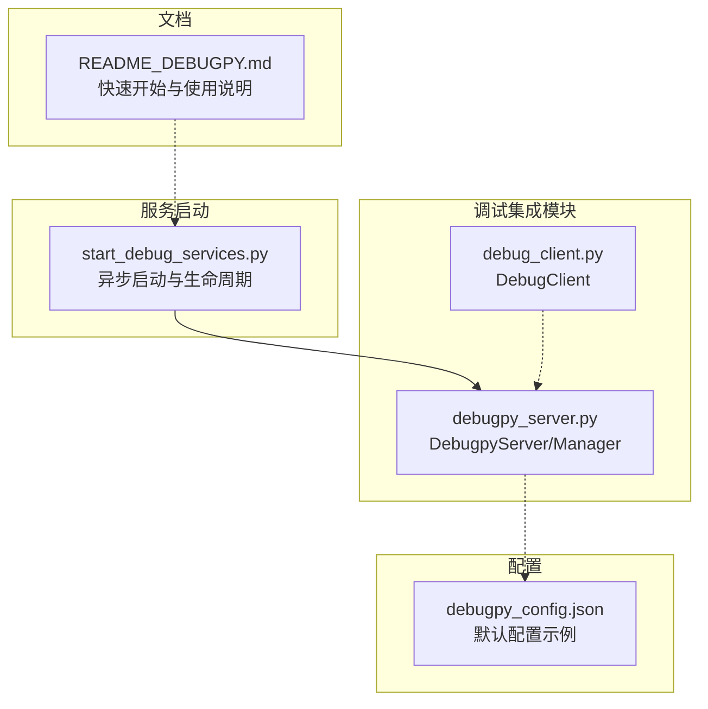
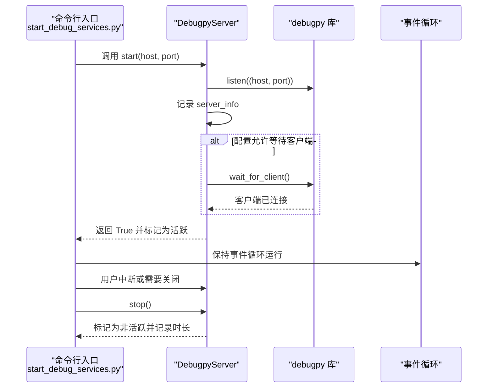
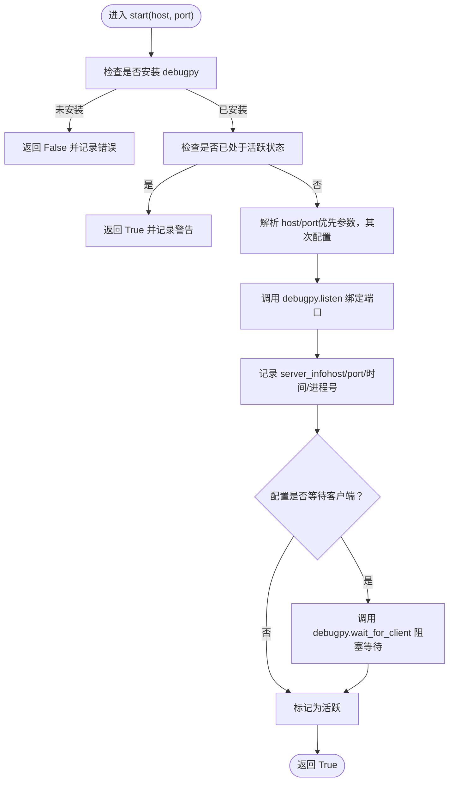
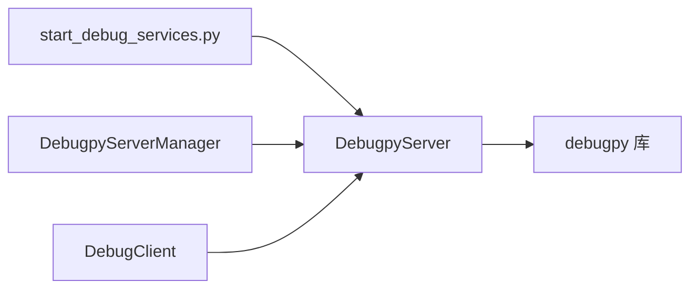

# 服务器生命周期管理

<cite>
**本文引用的文件**
- [debugpy_server.py](file://autoBMAD/epic_automation/debugpy_integration/debugpy_server.py)
- [start_debug_services.py](file://BUGFIX_20260107/start_debug_services.py)
- [debugpy_config.json](file://BUGFIX_20260107/configs/debugpy_config.json)
- [README_DEBUGPY.md](file://BUGFIX_20260107/README_DEBUGPY.md)
- [debug_client.py](file://autoBMAD/epic_automation/debugpy_integration/debug_client.py)
</cite>

## 目录
1. [引言](#引言)
2. [项目结构](#项目结构)
3. [核心组件](#核心组件)
4. [架构总览](#架构总览)
5. [详细组件分析](#详细组件分析)
6. [依赖关系分析](#依赖关系分析)
7. [性能考量](#性能考量)
8. [故障排查指南](#故障排查指南)
9. [结论](#结论)

## 引言
本文件围绕 DebugpyServer 类的完整生命周期管理进行深入解析，涵盖初始化阶段的配置继承与日志系统构建、start() 方法中的端口绑定与事件循环集成、stop() 方法的优雅关闭流程，以及 managed_server() 上下文管理器如何确保资源自动清理。同时，结合 DEFAULT_CONFIG 的配置项影响，重点说明 wait_for_client 参数在异步环境下的阻塞风险，并给出 wait_for_client(timeout) 的非阻塞替代方案。最后，结合 start_debug_services.py 的服务启动逻辑，阐述服务器实例在进程中的单例模式应用。

## 项目结构
- debugpy_integration 子模块提供远程调试能力，其中包含 DebugpyServer、DebugClient、RemoteDebugger 等组件。
- configs 目录提供 debugpy 的 JSON 配置示例，用于指导默认行为与特性开关。
- start_debug_services.py 提供命令行入口，演示如何以异步方式启动调试服务器与仪表板，并展示生命周期控制。



图表来源
- [debugpy_server.py](file://autoBMAD/epic_automation/debugpy_integration/debugpy_server.py#L1-L120)
- [start_debug_services.py](file://BUGFIX_20260107/start_debug_services.py#L1-L80)
- [debugpy_config.json](file://BUGFIX_20260107/configs/debugpy_config.json#L1-L56)
- [README_DEBUGPY.md](file://BUGFIX_20260107/README_DEBUGPY.md#L1-L120)

章节来源
- [debugpy_server.py](file://autoBMAD/epic_automation/debugpy_integration/debugpy_server.py#L1-L120)
- [start_debug_services.py](file://BUGFIX_20260107/start_debug_services.py#L1-L80)
- [debugpy_config.json](file://BUGFIX_20260107/configs/debugpy_config.json#L1-L56)
- [README_DEBUGPY.md](file://BUGFIX_20260107/README_DEBUGPY.md#L1-L120)

## 核心组件
- DebugpyServer：负责 debugpy 服务器的启动、停止、状态查询、断点触发、等待客户端连接等。
- DebugpyServerManager：多实例管理器，按端口维护多个 DebugpyServer 实例，提供全局单例访问。
- DebugClient：调试客户端连接工具（用于连接与断开）。
- start_debug_services.py：异步服务启动入口，演示如何以非阻塞方式运行服务器与仪表板。

章节来源
- [debugpy_server.py](file://autoBMAD/epic_automation/debugpy_integration/debugpy_server.py#L21-L120)
- [debugpy_server.py](file://autoBMAD/epic_automation/debugpy_integration/debugpy_server.py#L296-L408)
- [debug_client.py](file://autoBMAD/epic_automation/debugpy_integration/debug_client.py#L45-L85)
- [start_debug_services.py](file://BUGFIX_20260107/start_debug_services.py#L1-L80)

## 架构总览
DebugpyServer 作为核心组件，通过 debugpy.listen 绑定监听地址与端口；若配置允许，会在启动后调用 debugpy.wait_for_client 阻塞等待调试器连接；随后进入“活跃”状态。DebugpyServerManager 提供多实例管理与全局单例访问，避免同一进程内重复启动相同端口的服务器。start_debug_services.py 展示了异步事件循环中的服务启动与优雅退出流程。



图表来源
- [start_debug_services.py](file://BUGFIX_20260107/start_debug_services.py#L20-L40)
- [debugpy_server.py](file://autoBMAD/epic_automation/debugpy_integration/debugpy_server.py#L99-L147)

章节来源
- [start_debug_services.py](file://BUGFIX_20260107/start_debug_services.py#L20-L40)
- [debugpy_server.py](file://autoBMAD/epic_automation/debugpy_integration/debugpy_server.py#L99-L147)

## 详细组件分析

### DebugpyServer 生命周期与配置
- 初始化与日志系统
  - 从 DEFAULT_CONFIG 复制配置，构造 logger 并根据配置决定日志级别与是否落盘。
  - 若未安装 debugpy，初始化阶段会记录警告提示。
- start() 方法
  - 优先使用传入的 host/port，否则回退到配置中的 server 段默认值。
  - 调用 debugpy.listen 绑定端口；记录 server_info 包含 host、port、启动时间与进程号。
  - 若配置中 wait_for_client 为真，则调用 debugpy.wait_for_client 阻塞等待客户端连接；成功后标记为活跃。
- stop() 方法
  - 当前实现不直接调用 debugpy 的停止接口，而是将活跃状态置为 False，并记录服务器存活时长。
- wait_for_client(timeout)
  - 在异步环境中，使用 asyncio.wait_for 包裹 debugpy.wait_for_client 的同步调用，避免阻塞事件循环。
  - timeout 为 None 时等同于原生阻塞等待；设置超时可实现非阻塞等待。
- managed_server() 上下文管理器
  - 在进入时自动调用 start()，在退出时自动调用 stop()，确保资源清理。
- 断点与诊断
  - breakpoint() 在活跃状态下触发断点；is_active()/get_server_info() 提供状态与元信息查询。



图表来源
- [debugpy_server.py](file://autoBMAD/epic_automation/debugpy_integration/debugpy_server.py#L99-L147)

章节来源
- [debugpy_server.py](file://autoBMAD/epic_automation/debugpy_integration/debugpy_server.py#L29-L48)
- [debugpy_server.py](file://autoBMAD/epic_automation/debugpy_integration/debugpy_server.py#L50-L98)
- [debugpy_server.py](file://autoBMAD/epic_automation/debugpy_integration/debugpy_server.py#L99-L147)
- [debugpy_server.py](file://autoBMAD/epic_automation/debugpy_integration/debugpy_server.py#L154-L184)
- [debugpy_server.py](file://autoBMAD/epic_automation/debugpy_integration/debugpy_server.py#L216-L249)
- [debugpy_server.py](file://autoBMAD/epic_automation/debugpy_integration/debugpy_server.py#L263-L287)

### DEFAULT_CONFIG 对服务器行为的影响
- server 段
  - host/port：决定监听地址与端口，默认 127.0.0.1:5678。
  - wait_for_client：为真时，start() 将阻塞等待调试器连接；为假时立即返回活跃状态。
  - log_to_file：当前 DebugpyServer 的日志落盘由 logging 段控制，该字段在 DEFAULT_CONFIG 中存在但未被直接使用。
- features 段
  - async_debugging/multiprocess/Breakpoints 等：用于启用相关特性，不影响 DebugpyServer 的核心生命周期。
- logging 段
  - level/file：决定日志级别与文件路径，影响日志输出行为。

章节来源
- [debugpy_server.py](file://autoBMAD/epic_automation/debugpy_integration/debugpy_server.py#L29-L48)
- [debugpy_server.py](file://autoBMAD/epic_automation/debugpy_integration/debugpy_server.py#L68-L97)
- [debugpy_config.json](file://BUGFIX_20260107/configs/debugpy_config.json#L8-L21)

### 异步环境下的阻塞风险与非阻塞替代
- 阻塞风险
  - wait_for_client() 默认调用 debugpy.wait_for_client，该调用在同步上下文中会阻塞当前线程，从而阻塞事件循环。
- 非阻塞替代
  - 使用 wait_for_client(timeout)：内部通过 asyncio.wait_for 包裹 debugpy.wait_for_client 的同步调用，避免阻塞事件循环。
  - timeout=None 时仍会阻塞，建议在异步环境中始终提供超时或采用轮询策略。

章节来源
- [debugpy_server.py](file://autoBMAD/epic_automation/debugpy_integration/debugpy_server.py#L216-L249)

### 事件循环集成与优雅关闭
- start_debug_services.py 展示了典型的异步服务启动模式：
  - 通过 asyncio.run 启动异步任务，使用 asyncio.create_task 并发启动多个服务。
  - 在 KeyboardInterrupt 时取消任务并等待其完成，随后执行 stop() 清理。
- DebugpyServer.stop() 不直接关闭底层 socket，而是通过标记活跃状态与记录时长的方式实现“优雅关闭”。

章节来源
- [start_debug_services.py](file://BUGFIX_20260107/start_debug_services.py#L20-L80)
- [debugpy_server.py](file://autoBMAD/epic_automation/debugpy_integration/debugpy_server.py#L154-L184)

### managed_server() 上下文管理器
- 行为
  - 进入时调用 start()，失败则抛出异常；退出时无条件调用 stop()，确保资源清理。
- 适用场景
  - 在需要临时启用调试服务器的异步流程中，使用上下文管理器可避免遗漏 stop() 导致的资源泄漏。

章节来源
- [debugpy_server.py](file://autoBMAD/epic_automation/debugpy_integration/debugpy_server.py#L263-L287)

### 进程内的单例模式与多实例管理
- DebugpyServerManager
  - 以端口为键维护多实例映射，避免同一进程内重复启动相同端口的服务器。
  - 提供 get_server_manager() 获取全局单例，便于跨模块共享与统一管理。
- 单例模式要点
  - 通过全局变量保存单例实例，避免重复初始化。
  - start_server() 在端口已存在时直接返回已有实例，体现“进程内单例”的语义。

```mermaid
classDiagram
class DebugpyServer {
+DEFAULT_CONFIG
+__init__(config)
+start(host, port) bool
+stop() bool
+is_active() bool
+get_server_info() dict
+breakpoint() void
+wait_for_client(timeout) bool
+managed_server(host, port) asynccontextmanager
}
class DebugpyServerManager {
+servers : Dict[int, DebugpyServer]
+start_server(port, host, config) DebugpyServer
+stop_server(port) bool
+stop_all() void
+get_server(port) DebugpyServer
+list_servers() Dict[int, Dict]
}
class get_server_manager() {
+returns DebugpyServerManager
}
DebugpyServerManager --> DebugpyServer : "管理多个实例"
get_server_manager() --> DebugpyServerManager : "返回单例"
```

图表来源
- [debugpy_server.py](file://autoBMAD/epic_automation/debugpy_integration/debugpy_server.py#L296-L408)

章节来源
- [debugpy_server.py](file://autoBMAD/epic_automation/debugpy_integration/debugpy_server.py#L296-L408)

## 依赖关系分析
- DebugpyServer 依赖 debugpy 库进行监听与等待客户端。
- DebugpyServerManager 依赖 DebugpyServer 实例进行多端口管理。
- start_debug_services.py 依赖 DebugpyServer 进行服务启动与关闭。
- DebugClient 依赖 DebugpyServer 的连接信息进行连接与断开。



图表来源
- [start_debug_services.py](file://BUGFIX_20260107/start_debug_services.py#L20-L40)
- [debugpy_server.py](file://autoBMAD/epic_automation/debugpy_integration/debugpy_server.py#L99-L147)
- [debug_client.py](file://autoBMAD/epic_automation/debugpy_integration/debug_client.py#L45-L85)

章节来源
- [start_debug_services.py](file://BUGFIX_20260107/start_debug_services.py#L20-L40)
- [debugpy_server.py](file://autoBMAD/epic_automation/debugpy_integration/debugpy_server.py#L99-L147)
- [debug_client.py](file://autoBMAD/epic_automation/debugpy_integration/debug_client.py#L45-L85)

## 性能考量
- 阻塞等待客户端会占用主线程，导致事件循环无法推进。建议在异步环境中使用 wait_for_client(timeout) 或基于超时的轮询策略。
- 日志落盘可能带来 I/O 开销，可根据场景调整 logging.level 与 file。
- 多实例管理器按端口索引，查询与更新均为 O(1)，适合高并发调试场景。

## 故障排查指南
- 无法启动服务器
  - 检查是否安装 debugpy；若未安装，初始化阶段会记录警告。
  - 检查端口占用与权限问题；确认 host/port 解析逻辑是否符合预期。
- 客户端无法连接
  - 确认 wait_for_client 是否开启；若开启，需在 IDE 中连接。
  - 使用 DebugpyServer.get_server_info() 查看 server_info，确认 host/port。
- 优雅关闭无效
  - stop() 不会主动关闭底层 socket，而是标记为非活跃；进程退出时会自然释放资源。
- 资源未清理
  - 使用 managed_server() 上下文管理器确保 finally 分支执行 stop()。
  - 多实例场景下，确保调用 DebugpyServerManager.stop_server() 或 stop_all()。

章节来源
- [debugpy_server.py](file://autoBMAD/epic_automation/debugpy_integration/debugpy_server.py#L110-L152)
- [debugpy_server.py](file://autoBMAD/epic_automation/debugpy_integration/debugpy_server.py#L154-L184)
- [debugpy_server.py](file://autoBMAD/epic_automation/debugpy_integration/debugpy_server.py#L263-L287)
- [debugpy_server.py](file://autoBMAD/epic_automation/debugpy_integration/debugpy_server.py#L341-L369)

## 结论
DebugpyServer 通过清晰的生命周期管理与完善的日志系统，为异步调试提供了可靠的基础设施。DEFAULT_CONFIG 的 server.wait_for_client 决定了启动后的阻塞行为，结合 wait_for_client(timeout) 可在异步环境中实现非阻塞等待。DebugpyServerManager 提供进程内单例与多实例管理，配合 start_debug_services.py 的异步启动与优雅关闭流程，形成完整的调试服务器生命周期闭环。建议在生产或长时间运行的异步服务中，优先使用非阻塞等待与上下文管理器，确保稳定性与可观测性。