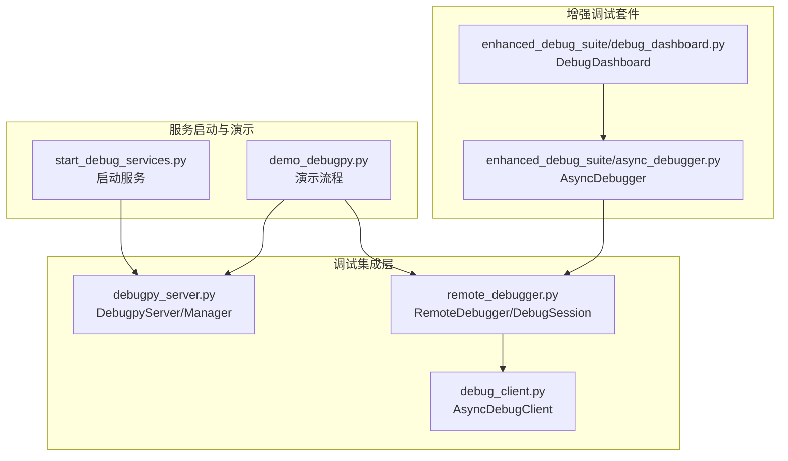
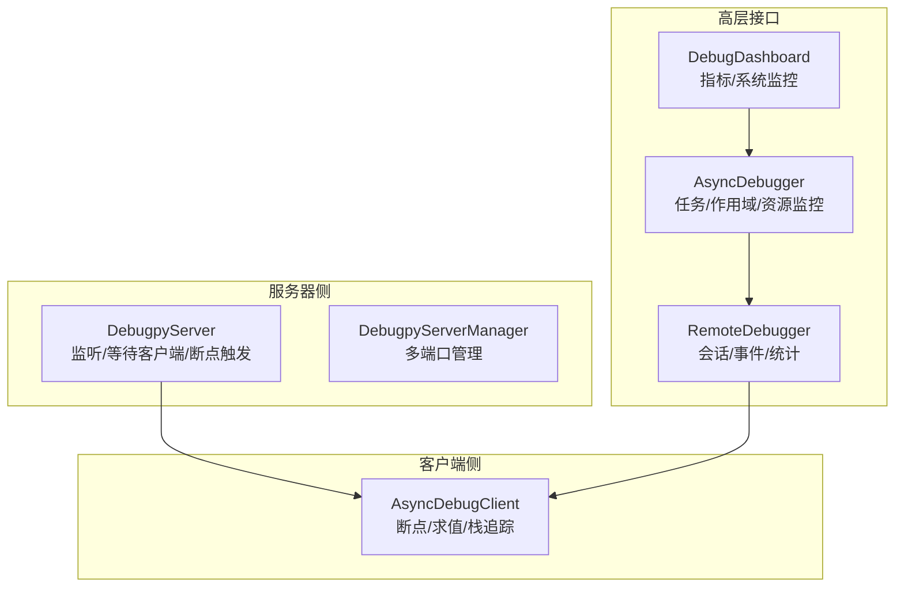
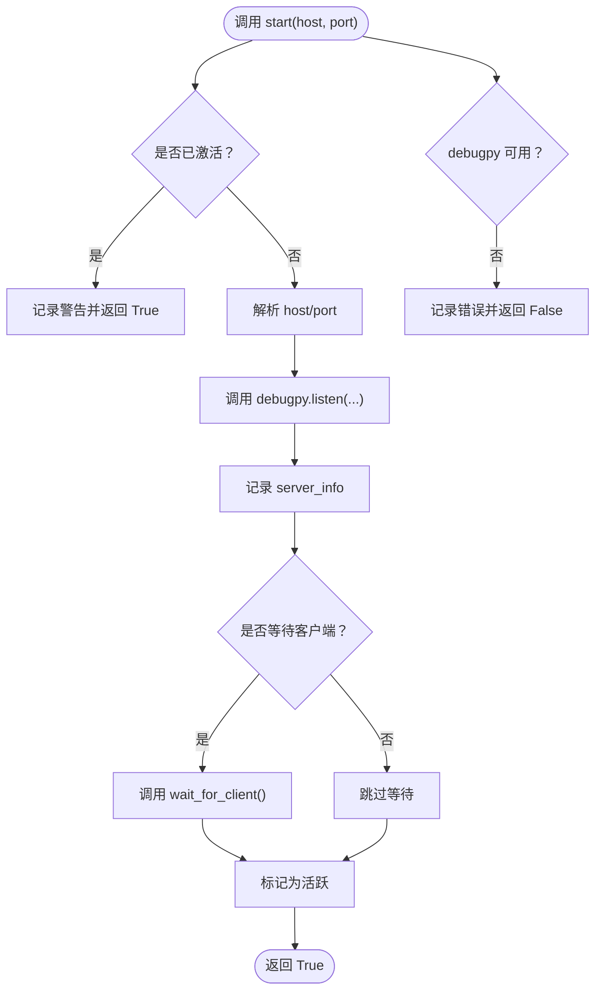
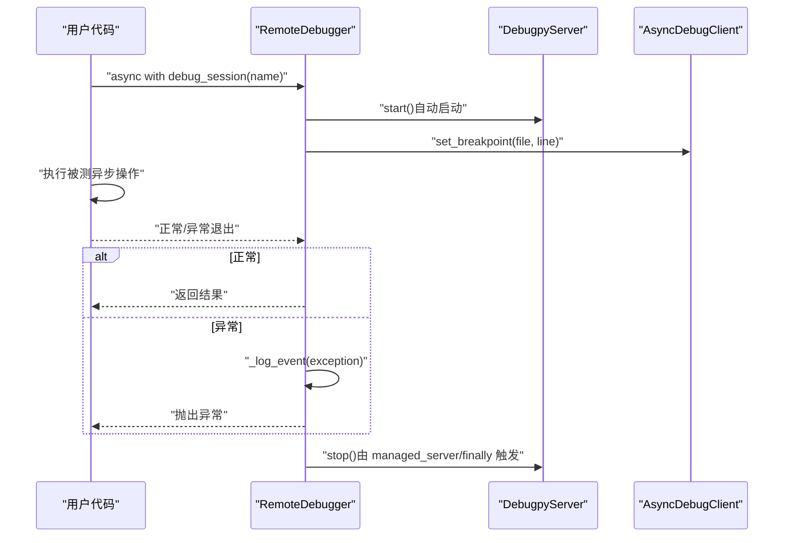
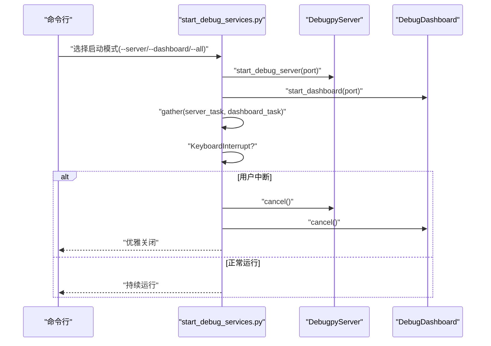
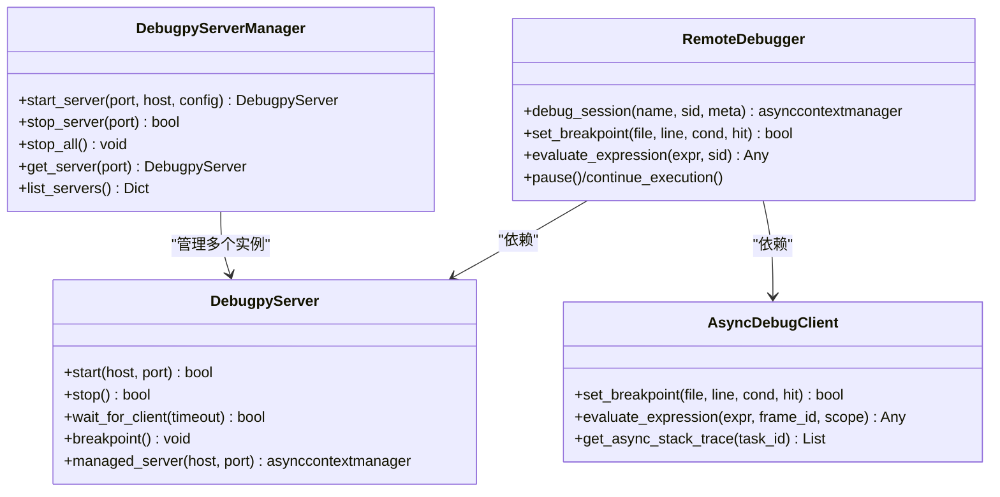
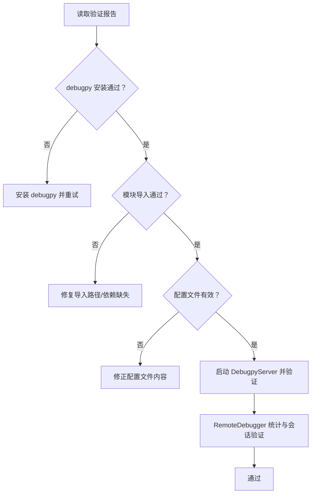

# 连接与会话管理

<cite>
**本文引用的文件**
- [debugpy_server.py](file://BUGFIX_20260107/debugpy_integration/debugpy_server.py)
- [remote_debugger.py](file://BUGFIX_20260107/debugpy_integration/remote_debugger.py)
- [debug_client.py](file://BUGFIX_20260107/debugpy_integration/debug_client.py)
- [start_debug_services.py](file://BUGFIX_20260107/start_debug_services.py)
- [demo_debugpy.py](file://BUGFIX_20260107/demo_debugpy.py)
- [debugpy_integration_verification_report.json](file://BUGFIX_20260107/debugpy_integration_verification_report.json)
- [async_debugger.py](file://BUGFIX_20260107/enhanced_debug_suite/async_debugger.py)
- [debug_dashboard.py](file://BUGFIX_20260107/enhanced_debug_suite/debug_dashboard.py)
</cite>

## 目录
1. [引言](#引言)
2. [项目结构](#项目结构)
3. [核心组件](#核心组件)
4. [架构总览](#架构总览)
5. [详细组件分析](#详细组件分析)
6. [依赖关系分析](#依赖关系分析)
7. [性能考量](#性能考量)
8. [故障排查指南](#故障排查指南)
9. [结论](#结论)
10. [附录](#附录)

## 引言
本文件聚焦于调试子系统的连接与会话管理，围绕以下目标展开：
- 深入分析 DebugpyServer 的生命周期管理：端口绑定、事件循环集成、异常恢复机制
- 解释 RemoteDebugger 如何通过 AsyncExitStack（async with）管理异步调试会话的上下文隔离，避免跨任务取消范围错误
- 说明 start_debug_services.py 中服务启动顺序对会话稳定性的影响
- 基于 demo_debugpy.py 展示从会话创建、断点设置到表达式计算的完整流程
- 提供连接超时、会话中断等网络问题的诊断方法，并结合 debugpy_integration_verification_report.json 构建连接状态验证流程

## 项目结构
该调试子系统位于“BUGFIX_20260107/debugpy_integration”目录，包含服务器、客户端、远程调试器以及配套的启动脚本与演示脚本；同时在“enhanced_debug_suite”中提供了增强的异步调试器与调试仪表板，用于监控与辅助诊断。

图表来源
- [debugpy_server.py](file://BUGFIX_20260107/debugpy_integration/debugpy_server.py#L1-L408)
- [remote_debugger.py](file://BUGFIX_20260107/debugpy_integration/remote_debugger.py#L1-L683)
- [debug_client.py](file://BUGFIX_20260107/debugpy_integration/debug_client.py#L1-L650)
- [start_debug_services.py](file://BUGFIX_20260107/start_debug_services.py#L1-L151)
- [demo_debugpy.py](file://BUGFIX_20260107/demo_debugpy.py#L1-L138)
- [async_debugger.py](file://BUGFIX_20260107/enhanced_debug_suite/async_debugger.py#L1-L559)
- [debug_dashboard.py](file://BUGFIX_20260107/enhanced_debug_suite/debug_dashboard.py#L1-L469)

章节来源
- [debugpy_server.py](file://BUGFIX_20260107/debugpy_integration/debugpy_server.py#L1-L408)
- [remote_debugger.py](file://BUGFIX_20260107/debugpy_integration/remote_debugger.py#L1-L683)
- [debug_client.py](file://BUGFIX_20260107/debugpy_integration/debug_client.py#L1-L650)
- [start_debug_services.py](file://BUGFIX_20260107/start_debug_services.py#L1-L151)
- [demo_debugpy.py](file://BUGFIX_20260107/demo_debugpy.py#L1-L138)
- [async_debugger.py](file://BUGFIX_20260107/enhanced_debug_suite/async_debugger.py#L1-L559)
- [debug_dashboard.py](file://BUGFIX_20260107/enhanced_debug_suite/debug_dashboard.py#L1-L469)

## 核心组件
- DebugpyServer：负责 debugpy 服务器的启动、停止、等待客户端连接、断点触发与生命周期上下文管理
- RemoteDebugger：高层远程调试器，封装会话管理、断点设置、表达式求值、暂停/继续、栈追踪等
- AsyncDebugClient：面向异步代码的调试客户端，提供异步栈追踪、协程信息、异步断点等能力
- start_debug_services.py：统一启动 debugpy 服务器与调试仪表板，演示服务启动顺序与并发控制
- demo_debugpy.py：演示从创建调试器、仪表板到启动服务器、进行断点与表达式求值的完整流程
- enhanced_debug_suite：提供 AsyncDebugger 与 DebugDashboard，用于异步任务与取消作用域的监控

章节来源
- [debugpy_server.py](file://BUGFIX_20260107/debugpy_integration/debugpy_server.py#L1-L408)
- [remote_debugger.py](file://BUGFIX_20260107/debugpy_integration/remote_debugger.py#L1-L683)
- [debug_client.py](file://BUGFIX_20260107/debugpy_integration/debug_client.py#L1-L650)
- [start_debug_services.py](file://BUGFIX_20260107/start_debug_services.py#L1-L151)
- [demo_debugpy.py](file://BUGFIX_20260107/demo_debugpy.py#L1-L138)
- [async_debugger.py](file://BUGFIX_20260107/enhanced_debug_suite/async_debugger.py#L1-L559)
- [debug_dashboard.py](file://BUGFIX_20260107/enhanced_debug_suite/debug_dashboard.py#L1-L469)

## 架构总览
整体架构采用“服务器-客户端-高层调试器”的分层设计，配合增强套件实现异步任务与取消作用域的可视化监控。

图表来源
- [debugpy_server.py](file://BUGFIX_20260107/debugpy_integration/debugpy_server.py#L1-L408)
- [remote_debugger.py](file://BUGFIX_20260107/debugpy_integration/remote_debugger.py#L1-L683)
- [debug_client.py](file://BUGFIX_20260107/debugpy_integration/debug_client.py#L1-L650)
- [async_debugger.py](file://BUGFIX_20260107/enhanced_debug_suite/async_debugger.py#L1-L559)
- [debug_dashboard.py](file://BUGFIX_20260107/enhanced_debug_suite/debug_dashboard.py#L1-L469)

## 详细组件分析

### DebugpyServer 生命周期管理
- 端口绑定与默认配置
  - 默认主机与端口常量定义，支持通过配置覆盖
  - 服务器配置包含等待客户端、日志级别与文件等
- 启动流程
  - 检查是否已激活，避免重复启动
  - 使用提供的 host/port 或配置默认值
  - 调用 listen 并记录 server_info（主机、端口、启动时间、进程ID）
  - 可选等待客户端 attach，支持阻塞或超时等待
- 停止流程
  - 标记为非活跃，记录运行时长
  - 由于 debugpy 无显式 stop 方法，依赖进程退出清理
- 异常恢复
  - 启动/停止过程中捕获异常并记录错误日志
  - 返回布尔值指示状态，便于上层重试策略
- 上下文管理
  - managed_server 提供 async with 自动启停，确保异常时也能安全关闭

图表来源
- [debugpy_server.py](file://BUGFIX_20260107/debugpy_integration/debugpy_server.py#L99-L183)

章节来源
- [debugpy_server.py](file://BUGFIX_20260107/debugpy_integration/debugpy_server.py#L1-L408)

### RemoteDebugger 会话上下文隔离与异常恢复
- 会话模型
  - DebugSession 记录会话标识、名称、起始时间、断点列表、事件列表与元数据
  - DebugEvent 记录事件类型、时间戳、会话ID、数据与源位置
- 会话管理
  - debug_session 使用 async with（AsyncExitStack）创建隔离上下文
  - 正常结束时记录时长并清理活动会话
  - 异常时记录异常事件并重新抛出，保证上层可感知
- 断点与表达式
  - set_breakpoint/remove_breakpoint 通过 AsyncDebugClient 与服务器交互
  - evaluate_expression 在当前上下文中评估表达式，返回结果或 None
- 事件处理
  - register_event_handler 注册事件处理器，_log_event 将事件写入会话并触发处理器
- 统计与查询
  - 维护 total_sessions/active_sessions/total_breakpoints/total_events 等统计
  - 提供 get_session_info/list_sessions/get_statistics

图表来源
- [remote_debugger.py](file://BUGFIX_20260107/debugpy_integration/remote_debugger.py#L122-L198)
- [debugpy_server.py](file://BUGFIX_20260107/debugpy_integration/debugpy_server.py#L99-L183)
- [debug_client.py](file://BUGFIX_20260107/debugpy_integration/debug_client.py#L95-L163)

章节来源
- [remote_debugger.py](file://BUGFIX_20260107/debugpy_integration/remote_debugger.py#L1-L683)
- [debug_client.py](file://BUGFIX_20260107/debugpy_integration/debug_client.py#L1-L650)

### 服务启动顺序与会话稳定性
- start_debug_services.py
  - 支持分别启动 debugpy 服务器与调试仪表板
  - 使用 asyncio.create_task 并 asyncio.gather 并发启动
  - 通过 KeyboardInterrupt 取消任务并等待完成，确保优雅关闭
- 对会话稳定性的影响
  - 先启动服务器再启动仪表板，可避免仪表板在服务器未就绪时的连接失败
  - 并发启动时需注意端口冲突与资源竞争，建议固定端口并串行初始化
  - 仪表板与服务器独立生命周期，服务器停止不影响仪表板的关闭流程

图表来源
- [start_debug_services.py](file://BUGFIX_20260107/start_debug_services.py#L20-L80)

章节来源
- [start_debug_services.py](file://BUGFIX_20260107/start_debug_services.py#L1-L151)

### 完整流程：会话创建、断点设置与表达式计算
- demo_debugpy.py 展示了从创建 AsyncDebugger、DebugDashboard 到启动 DebugpyServer、RemoteDebugger 的演示
- 关键步骤
  - 创建 AsyncDebugger 并启用远程调试（若可用）
  - 创建 DebugDashboard 并更新指标
  - 创建 DebugpyServer 并启动
  - 创建 RemoteDebugger 并在会话中设置断点
  - 执行异步操作并在 IDE 中观察断点与变量
  - 使用 evaluate_expression 在断点处查看表达式结果
- 注意事项
  - 若未安装 debugpy，远程调试会被禁用，演示会提示预期行为
  - 仪表板与服务器可独立运行，便于并行开发与调试

章节来源
- [demo_debugpy.py](file://BUGFIX_20260107/demo_debugpy.py#L1-L138)
- [async_debugger.py](file://BUGFIX_20260107/enhanced_debug_suite/async_debugger.py#L1-L559)
- [debug_dashboard.py](file://BUGFIX_20260107/enhanced_debug_suite/debug_dashboard.py#L1-L469)
- [debugpy_server.py](file://BUGFIX_20260107/debugpy_integration/debugpy_server.py#L1-L408)
- [remote_debugger.py](file://BUGFIX_20260107/debugpy_integration/remote_debugger.py#L1-L683)

## 依赖关系分析
- DebugpyServer 与 DebugpyServerManager
  - Manager 负责多端口实例管理，提供 start_server/stop_server/list_servers
  - 通过字典映射端口到实例，支持全局实例 get_server_manager
- RemoteDebugger 依赖 DebugpyServer 与 AsyncDebugClient
  - 通过 client.set_breakpoint/evaluate_expression 等方法与服务器交互
  - 通过 session 管理与事件记录实现上下文隔离
- AsyncDebugger 与 DebugDashboard
  - AsyncDebugger 提供任务/作用域/资源监控，并可与 RemoteDebugger 协同
  - DebugDashboard 提供指标收集与系统监控，输出报告

图表来源
- [debugpy_server.py](file://BUGFIX_20260107/debugpy_integration/debugpy_server.py#L296-L408)
- [remote_debugger.py](file://BUGFIX_20260107/debugpy_integration/remote_debugger.py#L67-L121)
- [debug_client.py](file://BUGFIX_20260107/debugpy_integration/debug_client.py#L489-L650)

章节来源
- [debugpy_server.py](file://BUGFIX_20260107/debugpy_integration/debugpy_server.py#L1-L408)
- [remote_debugger.py](file://BUGFIX_20260107/debugpy_integration/remote_debugger.py#L1-L683)
- [debug_client.py](file://BUGFIX_20260107/debugpy_integration/debug_client.py#L1-L650)

## 性能考量
- 服务器等待客户端
  - wait_for_client 支持超时等待，避免长时间阻塞
  - 建议在高并发场景下为不同会话分配不同端口，减少竞争
- 事件与日志
  - DebugpyServer/RemoteDebugger 均提供 INFO/DEBUG 级别日志，生产环境建议降低日志级别
- 异步栈追踪
  - AsyncDebugClient 的 get_async_stack_trace 会进行轻量级模拟，实际使用中应避免频繁调用
- 仪表板更新
  - DebugDashboard 的 update_interval 可调，避免过高频率导致 CPU 占用

[本节为通用指导，不直接分析具体文件]

## 故障排查指南

### 连接超时与会话中断
- 服务器端
  - 检查 DebugpyServer.start 是否返回 True，确认端口未被占用
  - 使用 wait_for_client(timeout) 并根据返回值判断是否超时
  - 查看日志中“Failed to start server”“Error waiting for client”等错误
- 客户端侧
  - AsyncDebugClient 的 connect/connected 状态与连接信息可用于诊断
  - set_breakpoint/evaluate_expression 返回 False 时检查连接状态
- 会话中断
  - RemoteDebugger 的异常事件记录（exception 事件）有助于定位中断原因
  - 通过 get_session_info 查看会话时长与断点命中情况

章节来源
- [debugpy_server.py](file://BUGFIX_20260107/debugpy_integration/debugpy_server.py#L139-L183)
- [debug_client.py](file://BUGFIX_20260107/debugpy_integration/debug_client.py#L39-L110)
- [remote_debugger.py](file://BUGFIX_20260107/debugpy_integration/remote_debugger.py#L434-L475)

### 基于验证报告的连接状态验证流程
- 使用 debugpy_integration_verification_report.json 的测试项作为基线
  - 检查 debugpy 安装状态与版本
  - 确认模块导入可用性（debugpy_server、debug_client、remote_debugger）
  - 验证配置文件有效性（debugpy_config.json、debug_config.yaml）
- 建议的验证步骤
  - 启动 DebugpyServer 并检查 is_active 与 server_info
  - 通过 RemoteDebugger 的统计信息确认会话创建与断点设置
  - 使用 AsyncDebugger 的 get_debug_statistics 检查远程调试开关与会话数

图表来源
- [debugpy_integration_verification_report.json](file://BUGFIX_20260107/debugpy_integration_verification_report.json#L1-L133)
- [debugpy_server.py](file://BUGFIX_20260107/debugpy_integration/debugpy_server.py#L185-L202)
- [remote_debugger.py](file://BUGFIX_20260107/debugpy_integration/remote_debugger.py#L513-L521)

章节来源
- [debugpy_integration_verification_report.json](file://BUGFIX_20260107/debugpy_integration_verification_report.json#L1-L133)

### 跨任务取消范围错误的规避
- 使用 RemoteDebugger.debug_session 的 async with 上下文，确保每个会话具有独立的生命周期
- 在 AsyncDebugger 中使用 tracked_scope/tracked_task 等上下文管理器，记录取消作用域与任务生命周期
- 通过 DebugDashboard 的统计与错误聚合，识别取消作用域错误的模式与趋势

章节来源
- [remote_debugger.py](file://BUGFIX_20260107/debugpy_integration/remote_debugger.py#L122-L198)
- [async_debugger.py](file://BUGFIX_20260107/enhanced_debug_suite/async_debugger.py#L368-L412)
- [debug_dashboard.py](file://BUGFIX_20260107/enhanced_debug_suite/debug_dashboard.py#L1-L469)

## 结论
- DebugpyServer 提供了稳健的服务器生命周期管理，支持端口绑定、等待客户端与异常恢复
- RemoteDebugger 通过 async with 实现会话上下文隔离，结合事件记录与统计，有效避免跨任务取消范围错误
- start_debug_services.py 的并发启动策略提升了开发效率，但需关注启动顺序与端口冲突
- demo_debugpy.py 展示了从服务器到会话、断点与表达式求值的完整流程
- 结合验证报告与增强套件，可建立完善的连接状态验证与监控体系

[本节为总结，不直接分析具体文件]

## 附录
- 术语
  - 会话：一次调试上下文，包含断点、事件与元数据
  - 断点：在指定文件/行设置的暂停点
  - 表达式求值：在调试上下文中评估表达式的值
  - 取消作用域：异步任务取消的边界，错误可能在此范围内传播

[本节为补充说明，不直接分析具体文件]