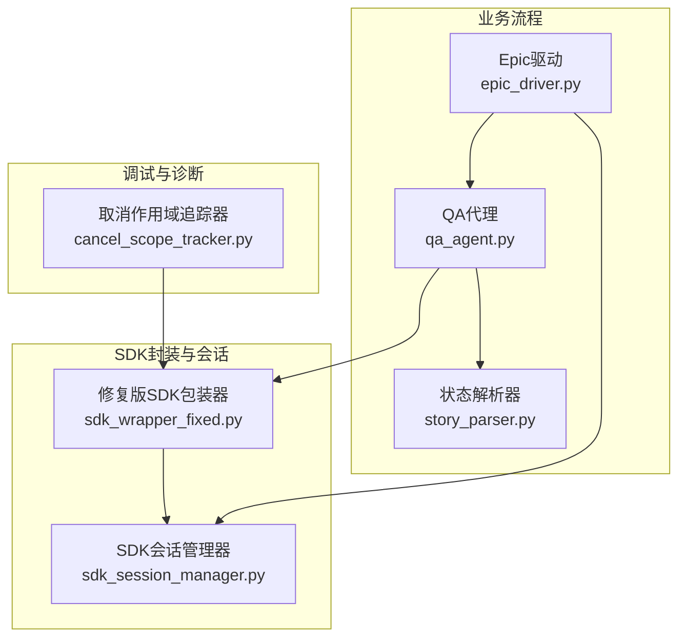
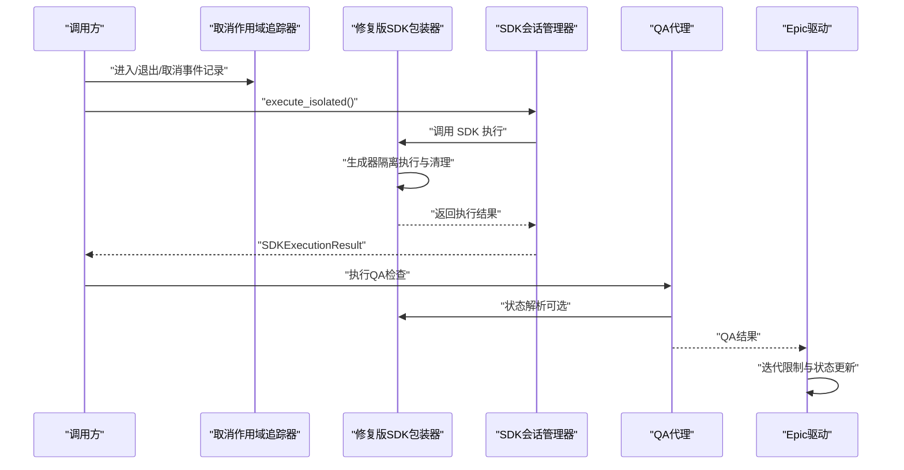
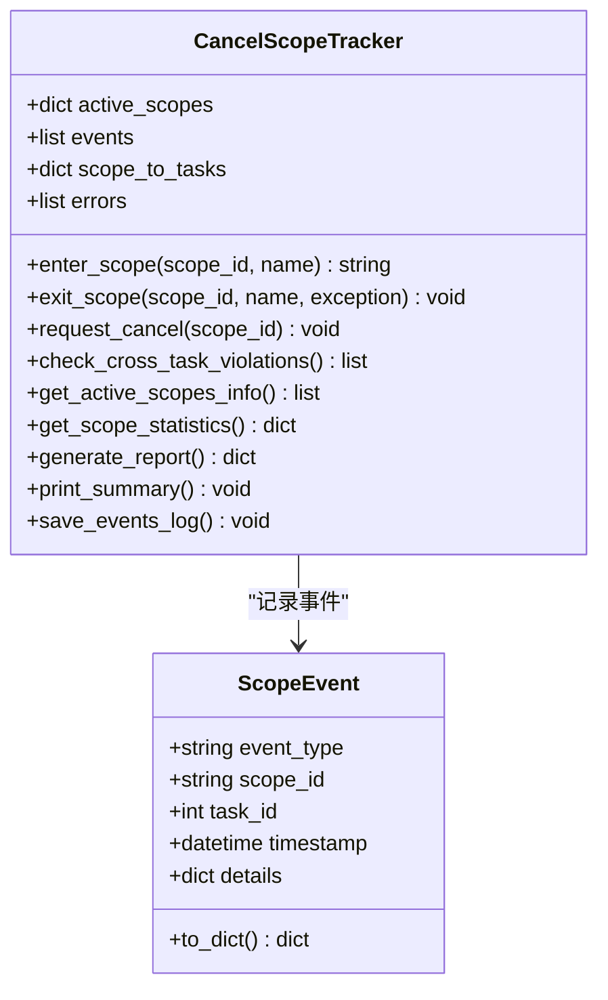
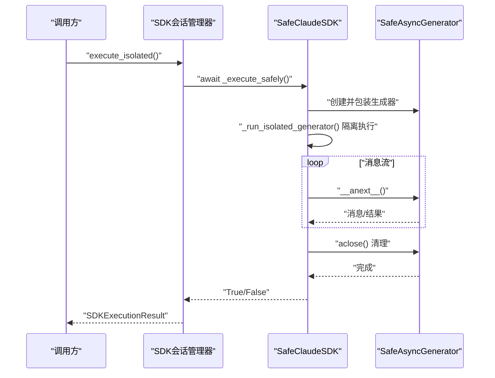
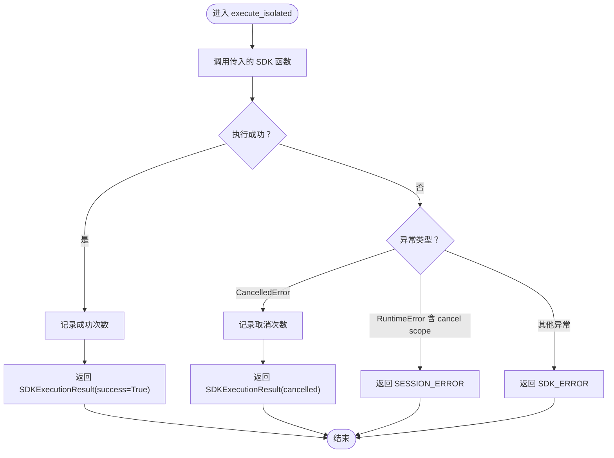
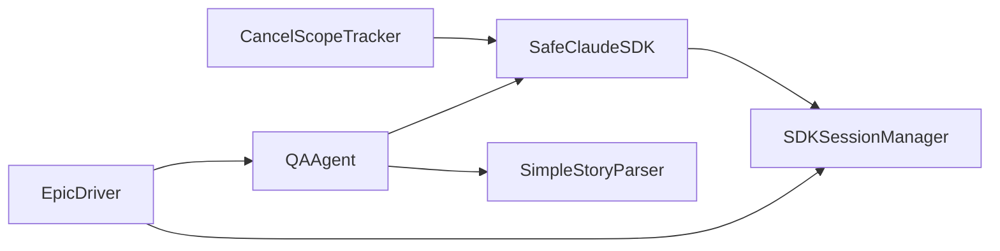

# 取消作用域问题

<cite>
**本文引用的文件**
- [ERROR_ANALYSIS_REPORT.md](file://ERROR_ANALYSIS_REPORT.md)
- [ASYNC_CANCEL_SCOPE_FIX.md](file://ASYNC_CANCEL_SCOPE_FIX.md)
- [BUGFIX_20260107/enhanced_debug_suite/cancel_scope_tracker.py](file://BUGFIX_20260107/enhanced_debug_suite/cancel_scope_tracker.py)
- [BUGFIX_20260107/fixed_modules/sdk_wrapper_fixed.py](file://BUGFIX_20260107/fixed_modules/sdk_wrapper_fixed.py)
- [verify_cancel_scope_fix.py](file://verify_cancel_scope_fix.py)
- [BUGFIX_20260107/tests/test_cancel_scope.py](file://BUGFIX_20260107/tests/test_cancel_scope.py)
- [autoBMAD/epic_automation/sdk_wrapper.py](file://autoBMAD/epic_automation/sdk_wrapper.py)
- [autoBMAD/epic_automation/sdk_session_manager.py](file://autoBMAD/epic_automation/sdk_session_manager.py)
- [autoBMAD/epic_automation/qa_agent.py](file://autoBMAD/epic_automation/qa_agent.py)
- [autoBMAD/epic_automation/epic_driver.py](file://autoBMAD/epic_automation/epic_driver.py)
- [autoBMAD/epic_automation/story_parser.py](file://autoBMAD/epic_automation/story_parser.py)
</cite>

## 目录
1. [引言](#引言)
2. [项目结构](#项目结构)
3. [核心组件](#核心组件)
4. [架构总览](#架构总览)
5. [详细组件分析](#详细组件分析)
6. [依赖关系分析](#依赖关系分析)
7. [性能考量](#性能考量)
8. [故障排查指南](#故障排查指南)
9. [结论](#结论)
10. [附录](#附录)

## 引言
本文件围绕“取消作用域（cancel scope）”中的异步任务泄漏问题展开，结合仓库中的错误分析报告与修复总结，系统阐述以下主题：
- 由 asyncio.CancelledError 处理不当导致的无限循环风险与资源泄漏隐患
- enhanced_debug_suite 中 cancel_scope_tracker 的实现机制，如何通过作用域跟踪确保资源正确释放
- 修复前后代码对比，重点展示 sdk_wrapper_fixed.py 中取消逻辑的改进
- 使用 verify_cancel_scope_fix.py 验证修复效果的方法
- 结合 test_cancel_scope.py 单元测试用例说明边界条件处理
- 指导开发者在自定义 Agent 中正确实现取消语义，避免超时累积与任务堆积

## 项目结构
本仓库围绕“Epic 自动化”构建，涉及 SDK 包装、会话管理、状态解析、QA 代理与驱动流程。与取消作用域修复直接相关的模块包括：
- enhanced_debug_suite/cancel_scope_tracker.py：取消作用域追踪器，用于检测跨任务访问与错误
- fixed_modules/sdk_wrapper_fixed.py：修复后的 SDK 包装器，解决跨任务 cancel scope 与生成器生命周期问题
- tests/test_cancel_scope.py：针对取消作用域修复的单元测试
- verify_cancel_scope_fix.py：端到端验证脚本
- autoBMAD/epic_automation/sdk_wrapper.py：原版 SDK 包装器（对比参考）
- autoBMAD/epic_automation/sdk_session_manager.py：会话管理器，提供会话隔离与取消处理
- autoBMAD/epic_automation/qa_agent.py：QA 代理，集成 SDK 包装器与状态解析
- autoBMAD/epic_automation/epic_driver.py：驱动流程，包含迭代限制与状态更新
- autoBMAD/epic_automation/story_parser.py：状态解析器，负责状态标准化

图表来源
- [BUGFIX_20260107/enhanced_debug_suite/cancel_scope_tracker.py](file://BUGFIX_20260107/enhanced_debug_suite/cancel_scope_tracker.py#L1-L368)
- [BUGFIX_20260107/fixed_modules/sdk_wrapper_fixed.py](file://BUGFIX_20260107/fixed_modules/sdk_wrapper_fixed.py#L1-L592)
- [autoBMAD/epic_automation/sdk_session_manager.py](file://autoBMAD/epic_automation/sdk_session_manager.py#L1-L440)
- [autoBMAD/epic_automation/qa_agent.py](file://autoBMAD/epic_automation/qa_agent.py#L1-L200)
- [autoBMAD/epic_automation/epic_driver.py](file://autoBMAD/epic_automation/epic_driver.py#L1060-L1259)
- [autoBMAD/epic_automation/story_parser.py](file://autoBMAD/epic_automation/story_parser.py#L420-L619)

章节来源
- [ERROR_ANALYSIS_REPORT.md](file://ERROR_ANALYSIS_REPORT.md#L24-L50)
- [ASYNC_CANCEL_SCOPE_FIX.md](file://ASYNC_CANCEL_SCOPE_FIX.md#L1-L97)

## 核心组件
- 取消作用域追踪器（CancelScopeTracker）
  - 记录进入/退出/取消/错误事件，检测跨任务访问
  - 提供统计信息与报告生成，便于定位问题
- 修复版 SDK 包装器（SafeClaudeSDK + SafeAsyncGenerator）
  - 通过隔离任务与超时保护，避免跨任务 cancel scope 错误
  - 在生成器清理阶段抑制预期错误，确保资源释放
- SDK 会话管理器（SDKSessionManager）
  - 为每个 Agent 创建独立执行上下文，防止 cancel scope 跨 Agent 传播
  - 统一错误分类与结果返回，支持取消与超时处理
- QA 代理与驱动流程
  - QA 代理集成 SDK 包装器与状态解析器
  - 驱动流程包含迭代限制与状态更新，避免无限循环

章节来源
- [BUGFIX_20260107/enhanced_debug_suite/cancel_scope_tracker.py](file://BUGFIX_20260107/enhanced_debug_suite/cancel_scope_tracker.py#L1-L368)
- [BUGFIX_20260107/fixed_modules/sdk_wrapper_fixed.py](file://BUGFIX_20260107/fixed_modules/sdk_wrapper_fixed.py#L1-L592)
- [autoBMAD/epic_automation/sdk_session_manager.py](file://autoBMAD/epic_automation/sdk_session_manager.py#L1-L440)
- [autoBMAD/epic_automation/qa_agent.py](file://autoBMAD/epic_automation/qa_agent.py#L1-L200)
- [autoBMAD/epic_automation/epic_driver.py](file://autoBMAD/epic_automation/epic_driver.py#L1060-L1259)

## 架构总览
下图展示了取消作用域修复在整体架构中的位置与交互关系。

图表来源
- [BUGFIX_20260107/enhanced_debug_suite/cancel_scope_tracker.py](file://BUGFIX_20260107/enhanced_debug_suite/cancel_scope_tracker.py#L1-L368)
- [BUGFIX_20260107/fixed_modules/sdk_wrapper_fixed.py](file://BUGFIX_20260107/fixed_modules/sdk_wrapper_fixed.py#L1-L592)
- [autoBMAD/epic_automation/sdk_session_manager.py](file://autoBMAD/epic_automation/sdk_session_manager.py#L1-L440)
- [autoBMAD/epic_automation/qa_agent.py](file://autoBMAD/epic_automation/qa_agent.py#L1-L200)
- [autoBMAD/epic_automation/epic_driver.py](file://autoBMAD/epic_automation/epic_driver.py#L1060-L1259)

## 详细组件分析

### 取消作用域追踪器（CancelScopeTracker）
- 设计要点
  - ScopeEvent 记录事件类型、scope_id、任务ID、时间戳与堆栈
  - enter_scope/exit_scope/request_cancel 提供完整的生命周期管理
  - 跨任务访问检测：当进入与退出任务不一致时记录错误事件
  - 统计与报告：输出事件总数、活动作用域、错误率与违规数量
- 适用场景
  - 诊断跨任务 cancel scope 错误
  - 监控作用域生命周期，辅助资源释放
- 关键行为
  - 检测 cross_task_access 并记录详细信息
  - 生成 JSON 报告与事件日志，便于离线分析

图表来源
- [BUGFIX_20260107/enhanced_debug_suite/cancel_scope_tracker.py](file://BUGFIX_20260107/enhanced_debug_suite/cancel_scope_tracker.py#L1-L368)

章节来源
- [BUGFIX_20260107/enhanced_debug_suite/cancel_scope_tracker.py](file://BUGFIX_20260107/enhanced_debug_suite/cancel_scope_tracker.py#L1-L368)

### 修复版 SDK 包装器（SafeClaudeSDK + SafeAsyncGenerator）
- 主要修复
  - 生成器生命周期隔离：在独立任务中运行生成器，避免跨任务 cancel scope
  - 清理阶段抑制预期错误：对 RuntimeError 中包含“cancel scope”或“Event loop is closed”的错误进行安全抑制
  - 取消处理：在取消时确保清理完成，避免资源泄漏
  - 消息追踪与周期性输出：提供实时进度与最终汇总
- 关键流程
  - _run_isolated_generator：在隔离任务中消费消息流，遇到 ResultMessage 后根据 is_error 决定成功/失败
  - SafeAsyncGenerator.aclose：带超时保护与错误抑制，确保清理不抛出异常
  - SDKSessionManager.execute_isolated：简化执行，不再使用外部超时与屏蔽，避免取消信号传播

图表来源
- [BUGFIX_20260107/fixed_modules/sdk_wrapper_fixed.py](file://BUGFIX_20260107/fixed_modules/sdk_wrapper_fixed.py#L1-L592)
- [autoBMAD/epic_automation/sdk_session_manager.py](file://autoBMAD/epic_automation/sdk_session_manager.py#L244-L341)

章节来源
- [BUGFIX_20260107/fixed_modules/sdk_wrapper_fixed.py](file://BUGFIX_20260107/fixed_modules/sdk_wrapper_fixed.py#L1-L592)
- [autoBMAD/epic_automation/sdk_session_manager.py](file://autoBMAD/epic_automation/sdk_session_manager.py#L244-L341)

### 会话管理器（SDKSessionManager）
- 设计要点
  - 为每个 Agent 创建独立的 IsolatedSDKContext，避免跨 Agent cancel scope 污染
  - execute_isolated：移除外部超时与屏蔽，直接返回 SDK 执行结果；对 cancel scope 错误进行分类与返回
  - 统计与健康检查：记录成功/失败次数、活跃会话数与健康率
- 边界处理
  - 对 CancelledError、RuntimeError（含 cancel scope）进行分类处理
  - 返回 SDKExecutionResult，包含 error_type、duration、retry_count 等字段

图表来源
- [autoBMAD/epic_automation/sdk_session_manager.py](file://autoBMAD/epic_automation/sdk_session_manager.py#L244-L341)

章节来源
- [autoBMAD/epic_automation/sdk_session_manager.py](file://autoBMAD/epic_automation/sdk_session_manager.py#L1-L440)

### QA 代理与状态解析
- QA 代理
  - 初始化时尝试创建 SDK 实例以支持 AI 解析；若不可用则回退到正则解析
  - 在解析状态时优先使用 AI，失败则回退正则
- 状态解析器
  - _extract_status_from_response：先清理再标准化，确保返回标准状态值
  - _simple_fallback_match：内置关键词匹配，兜底返回 unknown

章节来源
- [autoBMAD/epic_automation/qa_agent.py](file://autoBMAD/epic_automation/qa_agent.py#L1-L200)
- [autoBMAD/epic_automation/story_parser.py](file://autoBMAD/epic_automation/story_parser.py#L420-L619)

### 驱动流程与迭代限制
- 驱动流程包含 SM/Dev/QA 三阶段，其中 Dev 阶段引入迭代限制，防止无限循环
- 状态更新：Dev 成功后更新为 completed，QA 通过后同样更新为 completed；失败则回退为 in_progress

章节来源
- [autoBMAD/epic_automation/epic_driver.py](file://autoBMAD/epic_automation/epic_driver.py#L1153-L1259)

## 依赖关系分析
- 取消作用域追踪器与 SDK 包装器
  - 追踪器用于诊断与监控，SDK 包装器通过隔离与清理避免跨任务错误
- SDK 包装器与会话管理器
  - 会话管理器提供执行上下文与错误分类，SDK 包装器负责生成器生命周期与清理
- QA 代理与状态解析器
  - QA 代理在解析状态时可调用 SDK 包装器；状态解析器负责标准化状态值
- 驱动流程
  - 驱动流程贯穿三阶段与状态更新，迭代限制与状态一致性是关键

图表来源
- [BUGFIX_20260107/enhanced_debug_suite/cancel_scope_tracker.py](file://BUGFIX_20260107/enhanced_debug_suite/cancel_scope_tracker.py#L1-L368)
- [BUGFIX_20260107/fixed_modules/sdk_wrapper_fixed.py](file://BUGFIX_20260107/fixed_modules/sdk_wrapper_fixed.py#L1-L592)
- [autoBMAD/epic_automation/sdk_session_manager.py](file://autoBMAD/epic_automation/sdk_session_manager.py#L1-L440)
- [autoBMAD/epic_automation/qa_agent.py](file://autoBMAD/epic_automation/qa_agent.py#L1-L200)
- [autoBMAD/epic_automation/epic_driver.py](file://autoBMAD/epic_automation/epic_driver.py#L1060-L1259)

## 性能考量
- 隔离执行与清理
  - 通过隔离任务与超时保护，避免长时间阻塞主线程
  - 清理阶段抑制预期错误，减少异常传播带来的额外开销
- 统计与日志
  - 追踪器生成报告与事件日志，便于离线分析，但需注意磁盘 IO 与日志体量
- 会话管理
  - 健康检查与统计有助于及时发现异常，避免无效重试造成资源浪费

[本节为通用指导，无需列出具体文件来源]

## 故障排查指南
- 使用验证脚本
  - verify_cancel_scope_fix.py：验证模块导入、生成器清理、会话管理器与消息追踪器功能
- 单元测试
  - test_cancel_scope.py：覆盖跨任务访问检测、生成器清理、嵌套作用域、并发操作、异常处理与大数据场景
- 日志与报告
  - 追踪器生成 report.json 与 events.json，用于定位跨任务违规与错误事件
- 常见问题
  - 跨任务 cancel scope 错误：确认进入与退出是否在同一任务，避免在不同任务中退出作用域
  - 生成器未正确关闭：检查 aclose 是否被调用且未抛出异常
  - 取消传播：使用 SDKSessionManager 的隔离上下文，避免取消信号跨 Agent 传播

章节来源
- [verify_cancel_scope_fix.py](file://verify_cancel_scope_fix.py#L1-L226)
- [BUGFIX_20260107/tests/test_cancel_scope.py](file://BUGFIX_20260107/tests/test_cancel_scope.py#L1-L337)
- [BUGFIX_20260107/enhanced_debug_suite/cancel_scope_tracker.py](file://BUGFIX_20260107/enhanced_debug_suite/cancel_scope_tracker.py#L237-L305)

## 结论
- 通过隔离任务与清理阶段的错误抑制，修复了跨任务 cancel scope 导致的无限循环与资源泄漏风险
- 取消作用域追踪器提供了完善的诊断能力，帮助快速定位问题
- 会话管理器确保取消信号不跨 Agent 传播，避免相互干扰
- QA 代理与状态解析器在修复后具备更强的鲁棒性与可维护性
- 建议在自定义 Agent 中遵循统一的取消语义与资源清理规范，避免超时累积与任务堆积

[本节为总结性内容，无需列出具体文件来源]

## 附录

### 修复前后对比（关键差异）
- 原版 SDK 包装器（对比参考）
  - 生成器清理存在跨任务 cancel scope 风险
  - 对 RuntimeError 的处理较为粗放，可能引发异常传播
- 修复版 SDK 包装器
  - 引入 SafeAsyncGenerator，带超时保护与错误抑制
  - 在 SDK 执行与清理阶段抑制预期错误，确保资源释放
  - 会话管理器简化执行流程，避免外部超时与屏蔽导致的取消信号传播

章节来源
- [autoBMAD/epic_automation/sdk_wrapper.py](file://autoBMAD/epic_automation/sdk_wrapper.py#L99-L198)
- [BUGFIX_20260107/fixed_modules/sdk_wrapper_fixed.py](file://BUGFIX_20260107/fixed_modules/sdk_wrapper_fixed.py#L82-L135)
- [autoBMAD/epic_automation/sdk_session_manager.py](file://autoBMAD/epic_automation/sdk_session_manager.py#L244-L341)

### 验证修复步骤
- 运行验证脚本
  - 导入模块、测试生成器清理、会话管理器与消息追踪器
- 运行单元测试
  - 覆盖跨任务访问检测、生成器清理、嵌套与并发场景
- 分析报告
  - 检查 cancel_scope_tracker 生成的 report.json 与 events.json，确认无跨任务违规

章节来源
- [verify_cancel_scope_fix.py](file://verify_cancel_scope_fix.py#L1-L226)
- [BUGFIX_20260107/tests/test_cancel_scope.py](file://BUGFIX_20260107/tests/test_cancel_scope.py#L1-L337)
- [BUGFIX_20260107/enhanced_debug_suite/cancel_scope_tracker.py](file://BUGFIX_20260107/enhanced_debug_suite/cancel_scope_tracker.py#L237-L305)

### 边界条件与最佳实践
- 边界条件
  - 大数据生成器：测试大量消息的消费与截断
  - 嵌套与并发：验证多任务同时进入/退出作用域
  - 异常与取消：验证取消与异常在不同阶段的处理
- 最佳实践
  - 在 SDK 包装器中始终调用 aclose，确保清理
  - 使用 SDKSessionManager 的隔离上下文，避免取消信号跨 Agent 传播
  - 在驱动流程中设置合理的迭代上限与状态更新策略，防止无限循环

章节来源
- [BUGFIX_20260107/tests/test_cancel_scope.py](file://BUGFIX_20260107/tests/test_cancel_scope.py#L190-L337)
- [autoBMAD/epic_automation/epic_driver.py](file://autoBMAD/epic_automation/epic_driver.py#L1153-L1259)