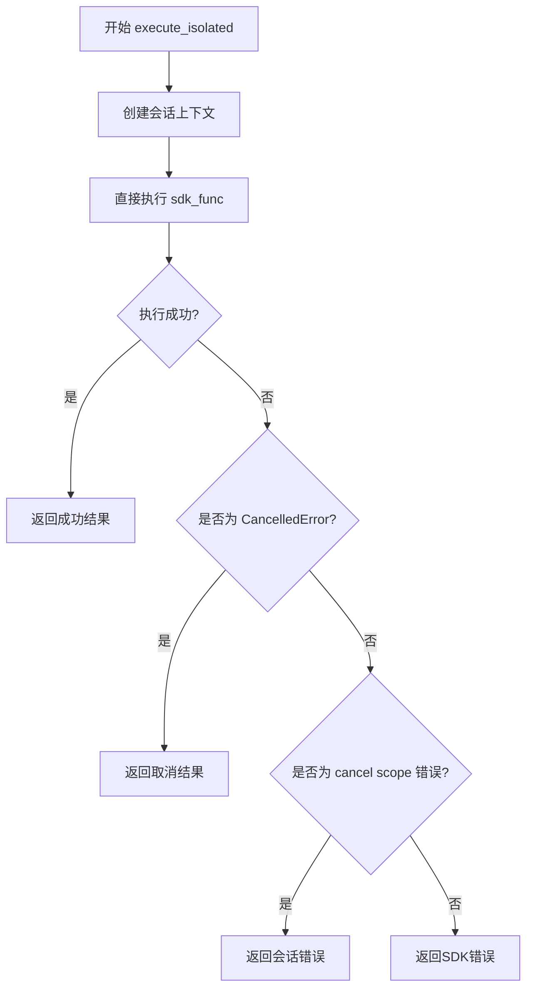
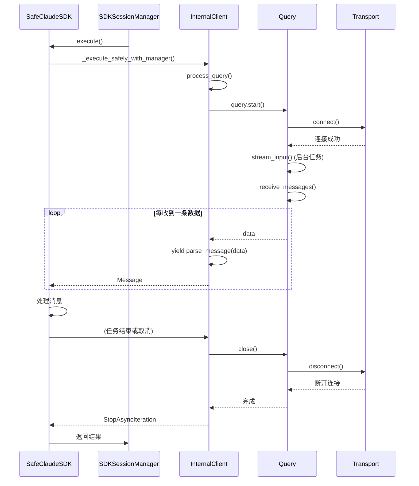

# 嵌套作用域与会话隔离

<cite>
**本文档引用的文件**   
- [ERROR_ANALYSIS_REPORT.md](file://ERROR_ANALYSIS_REPORT.md)
- [ASYNC_CANCEL_SCOPE_FIX.md](file://ASYNC_CANCEL_SCOPE_FIX.md)
- [autoBMAD/epic_automation/sdk_session_manager.py](file://autoBMAD/epic_automation/sdk_session_manager.py)
- [BUGFIX_20260107/fixed_modules/sdk_session_manager_fixed.py](file://BUGFIX_20260107/fixed_modules/sdk_session_manager_fixed.py)
- [autoBMAD/epic_automation/sdk_wrapper.py](file://autoBMAD/epic_automation/sdk_wrapper.py)
- [claude_agent_sdk/_internal/client.py](file://venv/Lib/site-packages/claude_agent_sdk/_internal/client.py)
</cite>

## 目录
1. [引言](#引言)
2. [问题分析](#问题分析)
3. [会话隔离机制](#会话隔离机制)
4. [生成器生命周期与取消作用域](#生成器生命周期与取消作用域)
5. [设计指南](#设计指南)
6. [结论](#结论)

## 引言

在复杂的异步工作流中，取消作用域（cancel scope）的管理是确保系统稳定性和资源正确释放的关键。本文档基于`ERROR_ANALYSIS_REPORT.md`中指出的“跨任务cancel scope传播”问题，深入分析了`safe_claude_sdk.py`中移除`asyncio.shield`的原因及其对会话隔离的影响。我们将探讨`SDKSessionManager`如何通过简化`execute_isolated()`逻辑，确保每个SDK调用在独立且一致的上下文中执行，从而避免cancel scope的污染和嵌套冲突。同时，我们将分析`claude_agent_sdk._internal.client.py`中`process_query`函数的调用栈，阐明生成器生命周期与cancel scope的绑定关系，并为开发者提供设计指南。

**Section sources**
- [ERROR_ANALYSIS_REPORT.md](file://ERROR_ANALYSIS_REPORT.md#L1-L296)

## 问题分析

### 跨任务取消作用域传播

根据`ERROR_ANALYSIS_REPORT.md`的分析，系统在执行过程中频繁出现`RuntimeError: Attempted to exit cancel scope in a different task than it was entered in`错误。此错误的根本原因在于：

1.  **跨任务传播**：SDK在生成器内部创建了cancel scope，但在不同的任务中尝试退出。
2.  **生命周期管理缺陷**：`SafeAsyncGenerator.aclose()`方法无法正确处理跨任务的cancel scope。
3.  **会话隔离不足**：原有的会话隔离机制未能完全防止cancel scope的污染。

该错误虽然未影响业务逻辑的完成，但导致了资源泄漏风险和大量的日志噪音，严重影响了系统的可维护性。

### `asyncio.shield`的移除原因

在`autoBMAD/epic_automation/sdk_session_manager.py`的早期版本中，`execute_isolated()`方法使用了`asyncio.shield`来保护任务不被外部取消。然而，这种做法加剧了cancel scope的复杂性。`asyncio.shield`会创建一个“屏蔽”任务，当外部任务被取消时，屏蔽任务会继续运行，但其内部的cancel scope管理变得异常复杂，极易导致“进入和退出不在同一任务”的错误。

因此，修复方案的核心是**移除`asyncio.shield`**，转而采用更简单、更直接的隔离策略，从根本上避免了因任务包装带来的cancel scope管理难题。

**Section sources**
- [ERROR_ANALYSIS_REPORT.md](file://ERROR_ANALYSIS_REPORT.md#L24-L50)
- [ASYNC_CANCEL_SCOPE_FIX.md](file://ASYNC_CANCEL_SCOPE_FIX.md#L1-L20)
- [autoBMAD/epic_automation/sdk_session_manager.py](file://autoBMAD/epic_automation/sdk_session_manager.py#L271-L273)

## 会话隔离机制

### `SDKSessionManager`的简化逻辑

为了解决上述问题，`SDKSessionManager`的`execute_isolated()`方法被大幅简化。其核心思想是：**让SDK调用自然地完成或被取消，而不是通过复杂的包装来“保护”它**。

**Diagram sources**
- [autoBMAD/epic_automation/sdk_session_manager.py](file://autoBMAD/epic_automation/sdk_session_manager.py#L244-L342)

如上图所示，新的逻辑流程清晰明了：
1.  创建一个隔离的会话上下文。
2.  直接调用用户提供的`sdk_func`。
3.  通过`try-except`块捕获所有可能的异常，包括`CancelledError`和`RuntimeError`（特别是cancel scope错误）。
4.  根据异常类型，返回结构化的`SDKExecutionResult`，而不是让异常向上抛出。

这种方法确保了cancel scope的进入和退出都在同一个任务内完成，彻底解决了跨任务传播的问题。

### 会话隔离的实现

`SDKSessionManager`通过`IsolatedSDKContext`类来实现会话隔离。每个会话都有一个唯一的`session_id`，并使用`asyncio.Lock`来管理活跃会话的字典。这确保了：
- 每个SDK调用都在一个独立的上下文中执行。
- 会话的创建和销毁是线程安全的。
- 可以追踪和统计所有会话的执行情况。

**Section sources**
- [autoBMAD/epic_automation/sdk_session_manager.py](file://autoBMAD/epic_automation/sdk_session_manager.py#L123-L165)
- [BUGFIX_20260107/fixed_modules/sdk_session_manager_fixed.py](file://BUGFIX_20260107/fixed_modules/sdk_session_manager_fixed.py#L114-L183)

## 生成器生命周期与取消作用域

### `process_query`调用栈分析

`claude_agent_sdk._internal.client.py`中的`process_query`函数是整个SDK调用链的起点。其调用栈和cancel scope的绑定关系如下：

**Diagram sources**
- [claude_agent_sdk/_internal/client.py](file://venv/Lib/site-packages/claude_agent_sdk/_internal/client.py#L43-L125)
- [autoBMAD/epic_automation/sdk_wrapper.py](file://autoBMAD/epic_automation/sdk_wrapper.py#L560-L687)

关键点在于`yield parse_message(data)`这一行。这是一个异步生成器，它在`process_query`协程中被创建。当外部代码（如`SafeClaudeSDK`）通过`async for`循环消费这些消息时，如果外部任务被取消，就会触发`GeneratorExit`异常。如果此时`process_query`协程已经结束或在另一个任务中，就会抛出`RuntimeError`。

### `SafeAsyncGenerator`的安全清理

为了解决生成器清理问题，`SafeAsyncGenerator`类被设计用来安全地处理`aclose()`操作。其核心策略是：
1.  **事件循环状态检测**：在清理前检查事件循环是否已关闭。
2.  **异常抑制**：捕获`CancelledError`和特定的`RuntimeError`（如"cancel scope"错误），并将其作为非致命错误记录，而不是重新抛出。
3.  **确保清理完成**：在返回前，短暂等待以确保所有清理操作都已结束。

这确保了即使在恶劣的条件下，生成器也能安全地关闭，不会导致整个系统崩溃。

**Section sources**
- [claude_agent_sdk/_internal/client.py](file://venv/Lib/site-packages/claude_agent_sdk/_internal/client.py#L120-L121)
- [autoBMAD/epic_automation/sdk_wrapper.py](file://autoBMAD/epic_automation/sdk_wrapper.py#L131-L191)

## 设计指南

为确保在构建复杂异步工作流时cancel scope的正确管理，请遵循以下指南：

1.  **避免过度使用`asyncio.shield`**：`shield`会增加cancel scope管理的复杂性。除非绝对必要，否则应避免使用。优先考虑让任务自然地处理取消信号。

2.  **确保进入和退出在同一任务内**：任何`async with`语句创建的上下文管理器，其`__aenter__`和`__aexit__`必须在同一个任务中执行。避免将生成器或协程传递到其他任务中进行消费。

3.  **使用隔离的执行上下文**：为每个独立的业务操作创建一个隔离的上下文（如`IsolatedSDKContext`），并在该上下文中执行所有相关操作。这可以防止状态和cancel scope的污染。

4.  **实现安全的资源清理**：对于异步生成器和需要清理的资源，实现一个安全的`aclose`或`cleanup`方法，该方法应能处理事件循环关闭和取消等异常情况，且自身不应抛出未处理的异常。

5.  **返回结构化结果**：不要让底层的取消或资源管理异常直接暴露给上层业务逻辑。应捕获这些异常，并返回一个结构化的结果对象（如`SDKExecutionResult`），让上层代码根据结果状态进行决策。

**Section sources**
- [autoBMAD/epic_automation/sdk_session_manager.py](file://autoBMAD/epic_automation/sdk_session_manager.py#L244-L342)
- [autoBMAD/epic_automation/sdk_wrapper.py](file://autoBMAD/epic_automation/sdk_wrapper.py#L131-L191)

## 结论

通过分析`ERROR_ANALYSIS_REPORT.md`中指出的“跨任务cancel scope传播”问题，我们理解了`asyncio.shield`在复杂异步场景下的局限性。`SDKSessionManager`通过移除`asyncio.shield`并简化`execute_isolated()`逻辑，实现了更可靠、更简单的会话隔离机制。`SafeAsyncGenerator`则通过安全的清理策略，确保了生成器生命周期与cancel scope的正确绑定。这些改进共同解决了cancel scope的污染和嵌套冲突问题，为构建健壮的异步应用提供了坚实的基础。开发者应遵循本文档提供的设计指南，以确保在未来的开发中避免类似的陷阱。