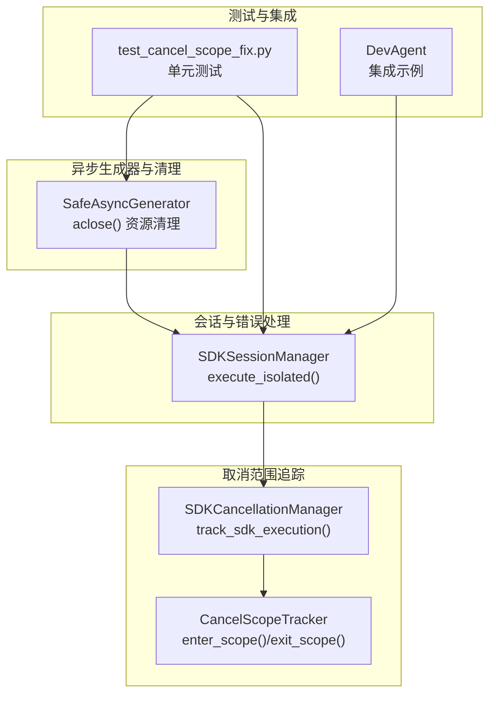
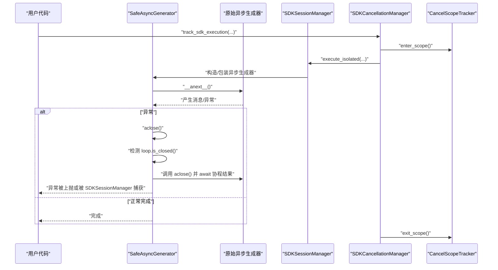
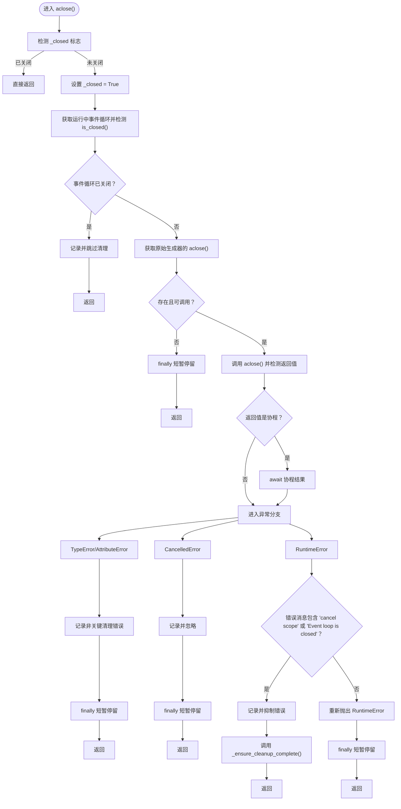
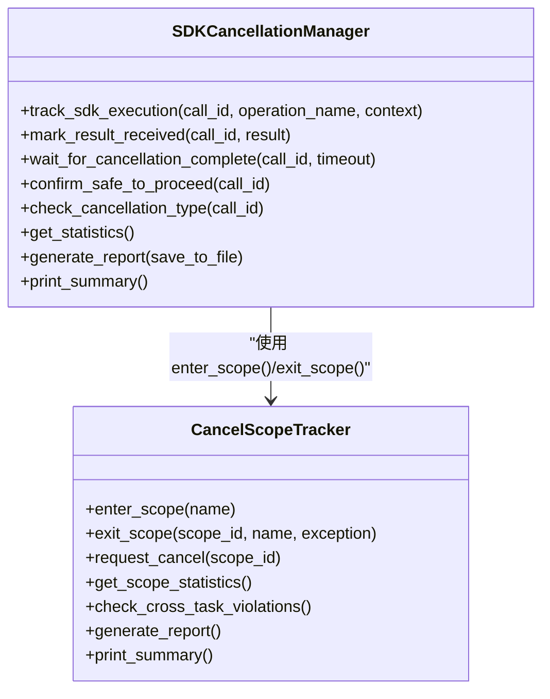
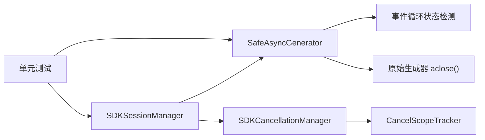

# 资源清理与生命周期管理

<cite>
**本文引用的文件**
- [sdk_wrapper.py](file://autoBMAD/epic_automation/sdk_wrapper.py)
- [sdk_session_manager.py](file://autoBMAD/epic_automation/sdk_session_manager.py)
- [cancel_scope_tracker.py](file://autoBMAD/epic_automation/monitoring/cancel_scope_tracker.py)
- [sdk_cancellation_manager.py](file://autoBMAD/epic_automation/monitoring/sdk_cancellation_manager.py)
- [test_cancel_scope_fix.py](file://tests/test_cancel_scope_fix.py)
- [dev_agent.py](file://autoBMAD/epic_automation/dev_agent.py)
</cite>

## 目录
1. [简介](#简介)
2. [项目结构](#项目结构)
3. [核心组件](#核心组件)
4. [架构总览](#架构总览)
5. [详细组件分析](#详细组件分析)
6. [依赖关系分析](#依赖关系分析)
7. [性能考量](#性能考量)
8. [故障排查指南](#故障排查指南)
9. [结论](#结论)
10. [附录](#附录)

## 简介
本文件围绕异步生成器的资源清理机制展开，重点解析 SafeAsyncGenerator.aclose() 中对事件循环状态的检测逻辑（loop.is_closed()）以及如何安全处理 RuntimeError 中的 cancel scope 错误；结合 enhanced_debug_suite/cancel_scope_tracker.py 的作用域跟踪实现，说明其如何监控和确保每个 cancel scope 在正确的任务中被正确退出；并通过 tests/test_cancel_scope_fix.py 中的单元测试用例（如 test_safe_async_generator_with_empty_generator、test_cancellation_handling）展示边界条件下的资源释放行为；最后给出开发者在实现自定义异步生成器时应遵循的最佳实践，防止资源泄漏。

## 项目结构
本仓库与异步生成器资源清理相关的核心模块包括：
- 异步生成器包装与清理：autoBMAD/epic_automation/sdk_wrapper.py
- 会话管理与错误处理：autoBMAD/epic_automation/sdk_session_manager.py
- 取消范围追踪与诊断：autoBMAD/epic_automation/monitoring/cancel_scope_tracker.py
- 统一取消管理器：autoBMAD/epic_automation/monitoring/sdk_cancellation_manager.py
- 单元测试：tests/test_cancel_scope_fix.py
- 集成示例（DevAgent）：autoBMAD/epic_automation/dev_agent.py

图表来源
- [sdk_wrapper.py](file://autoBMAD/epic_automation/sdk_wrapper.py#L101-L200)
- [sdk_session_manager.py](file://autoBMAD/epic_automation/sdk_session_manager.py#L244-L341)
- [cancel_scope_tracker.py](file://autoBMAD/epic_automation/monitoring/cancel_scope_tracker.py#L78-L174)
- [sdk_cancellation_manager.py](file://autoBMAD/epic_automation/monitoring/sdk_cancellation_manager.py#L87-L227)
- [test_cancel_scope_fix.py](file://tests/test_cancel_scope_fix.py#L296-L315)
- [dev_agent.py](file://autoBMAD/epic_automation/dev_agent.py#L579-L649)

章节来源
- [sdk_wrapper.py](file://autoBMAD/epic_automation/sdk_wrapper.py#L101-L200)
- [sdk_session_manager.py](file://autoBMAD/epic_automation/sdk_session_manager.py#L244-L341)
- [cancel_scope_tracker.py](file://autoBMAD/epic_automation/monitoring/cancel_scope_tracker.py#L78-L174)
- [sdk_cancellation_manager.py](file://autoBMAD/epic_automation/monitoring/sdk_cancellation_manager.py#L87-L227)
- [test_cancel_scope_fix.py](file://tests/test_cancel_scope_fix.py#L296-L315)
- [dev_agent.py](file://autoBMAD/epic_automation/dev_agent.py#L579-L649)

## 核心组件
- SafeAsyncGenerator：封装异步生成器，提供安全的 aclose() 资源清理，包含事件循环状态检测与 RuntimeError 的 cancel scope 错误安全处理。
- SDKSessionManager：提供隔离的 SDK 执行上下文，统一处理取消与错误，增强 cancel scope 错误检测。
- CancelScopeTracker：追踪 cancel scope 的进入/退出/取消/错误事件，检测跨任务访问违规。
- SDKCancellationManager：统一管理 SDK 取消流程，提供取消类型判定、清理完成确认、跨任务违规统计与诊断报告。
- 单元测试：覆盖空生成器、取消处理、事件循环状态检测等边界条件。

章节来源
- [sdk_wrapper.py](file://autoBMAD/epic_automation/sdk_wrapper.py#L101-L200)
- [sdk_session_manager.py](file://autoBMAD/epic_automation/sdk_session_manager.py#L244-L341)
- [cancel_scope_tracker.py](file://autoBMAD/epic_automation/monitoring/cancel_scope_tracker.py#L78-L174)
- [sdk_cancellation_manager.py](file://autoBMAD/epic_automation/monitoring/sdk_cancellation_manager.py#L87-L227)
- [test_cancel_scope_fix.py](file://tests/test_cancel_scope_fix.py#L296-L315)

## 架构总览
异步生成器生命周期与资源清理的关键流程如下：
- SafeAsyncGenerator 在消费过程中捕获异常并触发 aclose()。
- aclose() 首先检测事件循环状态（loop.is_closed()），若事件循环已关闭则跳过清理。
- 若存在原始生成器的 aclose()，则调用并确保在正确的任务上下文中执行（必要时 await 协程结果）。
- 对 RuntimeError 进行分类处理：若包含“cancel scope”或“Event loop is closed”，视为预期 SDK 关闭错误并抑制，确保清理完成后再返回。
- SDKSessionManager 在 execute_isolated() 中对 RuntimeError 进行二次识别，将 cancel scope 错误映射为会话错误类型。
- SDKCancellationManager 通过 track_sdk_execution() 统一追踪 SDK 调用生命周期，并在 finally 中标记清理完成；同时 CancelScopeTracker 检测跨任务违规并记录。

图表来源
- [sdk_wrapper.py](file://autoBMAD/epic_automation/sdk_wrapper.py#L115-L191)
- [sdk_session_manager.py](file://autoBMAD/epic_automation/sdk_session_manager.py#L244-L341)
- [sdk_cancellation_manager.py](file://autoBMAD/epic_automation/monitoring/sdk_cancellation_manager.py#L87-L227)
- [cancel_scope_tracker.py](file://autoBMAD/epic_automation/monitoring/cancel_scope_tracker.py#L78-L174)

## 详细组件分析

### SafeAsyncGenerator.aclose() 资源清理机制
- 事件循环状态检测：通过 get_running_loop() 与 is_closed() 判断事件循环是否仍在运行，若已关闭则直接返回，避免在关闭的事件循环中进行清理导致异常。
- 原始生成器 aclose() 调用：若原始生成器提供 aclose()，则调用并检测返回值是否为协程，若是则 await 以确保清理在正确的任务上下文中完成。
- RuntimeError 安全处理：对 RuntimeError 进行字符串匹配，若包含“cancel scope”或“Event loop is closed”，视为预期 SDK 关闭错误，记录日志并抑制异常，随后调用 _ensure_cleanup_complete() 确保清理彻底，最终返回。
- finally 短暂停留：在 finally 中短暂 sleep 以确保清理流程完成，忽略其中可能发生的异常，保证 aclose() 的幂等性与安全性。

图表来源
- [sdk_wrapper.py](file://autoBMAD/epic_automation/sdk_wrapper.py#L131-L191)

章节来源
- [sdk_wrapper.py](file://autoBMAD/epic_automation/sdk_wrapper.py#L131-L191)

### CancelScopeTracker 作用域跟踪与跨任务违规检测
- enter_scope()/exit_scope()：记录进入/退出 cancel scope 的任务、名称、持续时间、是否请求取消等信息；在退出时检测是否跨任务访问，若跨任务则记录错误事件。
- request_cancel()：记录取消请求来源任务。
- 统计与报告：提供统计信息、最近事件、跨任务违规数量，并生成 JSON 报告与控制台摘要。
- 与 SDKCancellationManager 集成：在 track_sdk_execution() 的 finally 中退出 cancel scope，确保生命周期闭环。

图表来源
- [cancel_scope_tracker.py](file://autoBMAD/epic_automation/monitoring/cancel_scope_tracker.py#L78-L174)
- [sdk_cancellation_manager.py](file://autoBMAD/epic_automation/monitoring/sdk_cancellation_manager.py#L87-L227)

章节来源
- [cancel_scope_tracker.py](file://autoBMAD/epic_automation/monitoring/cancel_scope_tracker.py#L78-L174)
- [sdk_cancellation_manager.py](file://autoBMAD/epic_automation/monitoring/sdk_cancellation_manager.py#L87-L227)

### SDKSessionManager 的取消与错误处理
- execute_isolated()：移除外部超时与 shield 包装，直接执行传入的 SDK 函数；对 CancelledError 返回会话错误类型，对 RuntimeError 进行字符串匹配识别 cancel scope 错误并返回会话错误类型，其余异常按 SDK_ERROR 返回。
- 该设计避免了跨任务 cancel scope 传播，确保错误被统一捕获与分类。

章节来源
- [sdk_session_manager.py](file://autoBMAD/epic_automation/sdk_session_manager.py#L244-L341)

### 单元测试用例与边界条件
- test_safe_async_generator_with_empty_generator：验证空生成器的消费与 aclose() 行为，断言生成器为空时仍能安全关闭并设置 _closed 标志。
- test_cancellation_handling：验证当生成器抛出 CancelledError 时，SDKSessionManager 能正确识别并返回 CANCELLED 类型结果。
- test_event_loop_state_detection：验证在事件循环正常运行时，aclose() 能正确检测并清理。
- 其他测试覆盖 cancel scope 错误预防、消息追踪器功能、Removed asyncio.shield 路径等。

章节来源
- [test_cancel_scope_fix.py](file://tests/test_cancel_scope_fix.py#L296-L315)
- [test_cancel_scope_fix.py](file://tests/test_cancel_scope_fix.py#L275-L293)
- [test_cancel_scope_fix.py](file://tests/test_cancel_scope_fix.py#L63-L88)

### 集成示例：DevAgent 与 SafeClaudeSDK
- DevAgent 在执行 SDK 调用时，通过 SDKSessionManager.execute_isolated() 进行隔离执行，避免跨 Agent cancel scope 污染；SafeClaudeSDK 将生成器包装为 SafeAsyncGenerator，确保资源清理与输出可见性。
- 该集成展示了从调用入口到资源清理的完整链路。

章节来源
- [dev_agent.py](file://autoBMAD/epic_automation/dev_agent.py#L579-L649)
- [sdk_wrapper.py](file://autoBMAD/epic_automation/sdk_wrapper.py#L560-L688)

## 依赖关系分析
- SafeAsyncGenerator 依赖 asyncio.get_running_loop() 与 loop.is_closed() 进行事件循环状态检测；依赖原始生成器的 aclose() 进行清理；在 finally 中短暂停留确保清理完成。
- SDKSessionManager 依赖 SDKCancellationManager 的统一取消管理能力，对 RuntimeError 进行二次识别与分类。
- SDKCancellationManager 依赖 CancelScopeTracker 进行 cancel scope 生命周期追踪与跨任务违规检测。
- 单元测试覆盖上述组件的关键路径，验证边界条件与错误处理。

图表来源
- [sdk_wrapper.py](file://autoBMAD/epic_automation/sdk_wrapper.py#L131-L191)
- [sdk_session_manager.py](file://autoBMAD/epic_automation/sdk_session_manager.py#L244-L341)
- [sdk_cancellation_manager.py](file://autoBMAD/epic_automation/monitoring/sdk_cancellation_manager.py#L87-L227)
- [cancel_scope_tracker.py](file://autoBMAD/epic_automation/monitoring/cancel_scope_tracker.py#L78-L174)
- [test_cancel_scope_fix.py](file://tests/test_cancel_scope_fix.py#L275-L315)

章节来源
- [sdk_wrapper.py](file://autoBMAD/epic_automation/sdk_wrapper.py#L131-L191)
- [sdk_session_manager.py](file://autoBMAD/epic_automation/sdk_session_manager.py#L244-L341)
- [sdk_cancellation_manager.py](file://autoBMAD/epic_automation/monitoring/sdk_cancellation_manager.py#L87-L227)
- [cancel_scope_tracker.py](file://autoBMAD/epic_automation/monitoring/cancel_scope_tracker.py#L78-L174)
- [test_cancel_scope_fix.py](file://tests/test_cancel_scope_fix.py#L275-L315)

## 性能考量
- 事件循环状态检测与短暂停留（sleep）均为轻量级操作，对整体性能影响可忽略。
- 对 RuntimeError 的字符串匹配与日志记录成本较低，但应避免在高频路径中重复构造大量日志。
- CancelScopeTracker 的事件与报告生成在调试阶段启用，生产环境可通过禁用追踪降低开销。

## 故障排查指南
- 现象：aclose() 抛出 RuntimeError，提示 cancel scope 或事件循环已关闭。
  - 处理：根据实现逻辑，此类错误会被抑制并记录，随后调用 _ensure_cleanup_complete() 确保清理完成。若仍出现异常，检查是否在事件循环关闭后仍尝试清理。
- 现象：跨任务访问 cancel scope 导致错误。
  - 处理：启用 CancelScopeTracker 并查看报告，定位进入与退出任务不一致的 scope；确保每个 cancel scope 在同一任务内进入与退出。
- 现象：SDKSessionManager 返回 SESSION_ERROR。
  - 处理：确认错误消息包含“cancel scope”，这是预期行为；若频繁发生，检查调用方是否在 SDK 执行期间主动取消或事件循环提前关闭。

章节来源
- [sdk_wrapper.py](file://autoBMAD/epic_automation/sdk_wrapper.py#L169-L179)
- [sdk_session_manager.py](file://autoBMAD/epic_automation/sdk_session_manager.py#L309-L326)
- [cancel_scope_tracker.py](file://autoBMAD/epic_automation/monitoring/cancel_scope_tracker.py#L116-L174)

## 结论
通过 SafeAsyncGenerator.aclose() 的事件循环状态检测与 RuntimeError 的 cancel scope 错误安全处理，配合 CancelScopeTracker 的跨任务违规检测与 SDKCancellationManager 的统一取消管理，本项目实现了可靠的异步生成器生命周期管理与资源清理。单元测试覆盖了空生成器、取消处理与事件循环状态等边界条件，确保在复杂场景下也能安全释放资源。开发者在实现自定义异步生成器时，应遵循本文最佳实践，优先使用统一的取消管理与追踪工具，避免跨任务 cancel scope 冲突与资源泄漏。

## 附录
- 开发者最佳实践清单
  - 在 aclose() 中始终检测事件循环状态（loop.is_closed()），若已关闭则跳过清理。
  - 调用原始生成器的 aclose() 并确保在正确的任务上下文中执行（必要时 await 协程结果）。
  - 对 RuntimeError 进行字符串匹配，识别 cancel scope 错误并抑制，随后确保清理彻底（调用 _ensure_cleanup_complete()）。
  - 使用 SDKCancellationManager 的 track_sdk_execution() 统一追踪 SDK 生命周期并在 finally 中标记清理完成。
  - 使用 CancelScopeTracker 检测跨任务违规，确保每个 cancel scope 在同一任务内进入与退出。
  - 在单元测试中覆盖空生成器、取消处理、事件循环状态等边界条件，验证资源释放行为。