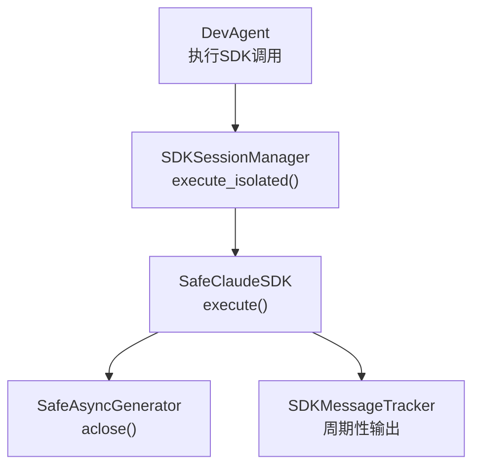
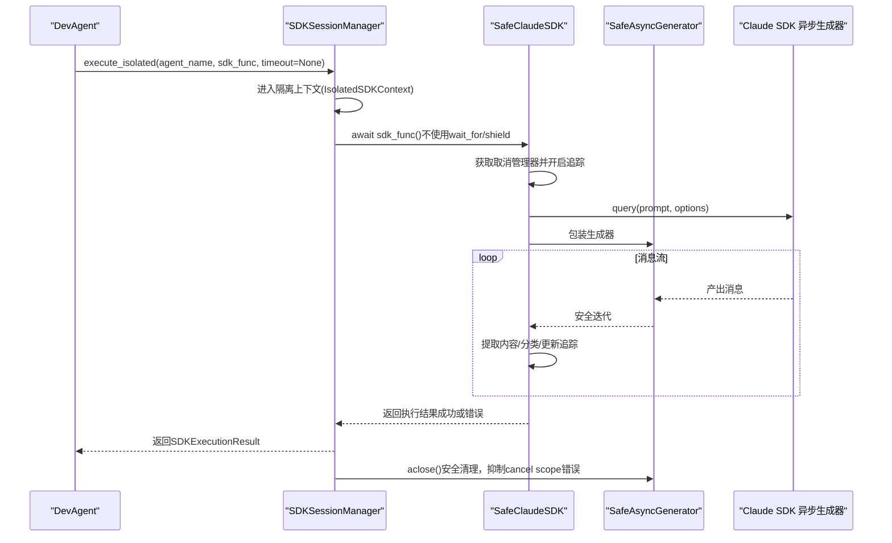
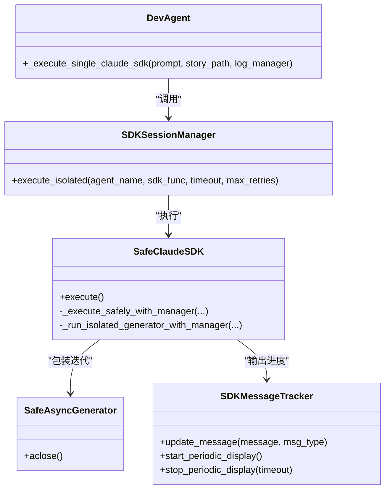

# 超时处理机制

<cite>
**本文引用的文件**
- [CANCEL_SCOPE_FIX_SUMMARY.md](file://docs/CANCEL_SCOPE_FIX_SUMMARY.md)
- [sdk_session_manager.py](file://autoBMAD/epic_automation/sdk_session_manager.py)
- [sdk_session_manager_fixed.py](file://BUGFIX_20260107/fixed_modules/sdk_session_manager_fixed.py)
- [dev_agent.py](file://autoBMAD/epic_automation/dev_agent.py)
- [sdk_wrapper.py](file://autoBMAD/epic_automation/sdk_wrapper.py)
- [retry-mechanism-design.md](file://docs-copy/evaluation/retry-mechanism-design.md)
- [quality-gates.md](file://docs-copy/troubleshooting/quality-gates.md)
- [cancel-scope-error-analysis.md](file://docs-copy/evaluation/cancel-scope-error-analysis.md)
- [test_timeout_handling.py](file://BUGFIX_20260107/tests/test_timeout_handling.py)
</cite>

## 目录
1. [简介](#简介)
2. [项目结构与定位](#项目结构与定位)
3. [核心组件](#核心组件)
4. [架构总览](#架构总览)
5. [详细组件分析](#详细组件分析)
6. [依赖关系分析](#依赖关系分析)
7. [性能与稳定性考量](#性能与稳定性考量)
8. [故障排查指南](#故障排查指南)
9. [结论](#结论)

## 简介
本文件围绕“取消作用域中的超时处理问题”展开，基于架构重构方案，解释为何移除外部超时包装（如 asyncio.wait_for、asyncio.shield），并阐述新的超时控制策略如何通过 SDK 内部 max_turns=1000 轮次限制与会话隔离机制，避免跨任务 cancel scope 冲突，同时保持输出可见性与功能完整性。文档还提供 sdk_session_manager.py 中 execute_isolated() 方法简化前后的对比，指导开发者在自定义 Agent 中避免使用外部超时包装，转而依赖内置轮次限制与进度监控机制。

## 项目结构与定位
本次分析聚焦于以下模块：
- SDK 会话管理与隔离：SDKSessionManager.execute_isolated()
- SDK 包装与取消管理：SafeClaudeSDK、SafeAsyncGenerator
- 自定义 Agent 调用路径：DevAgent._execute_single_claude_sdk()
- 超时与重试策略：重构前后对比与测试覆盖

图表来源
- [dev_agent.py](file://autoBMAD/epic_automation/dev_agent.py#L579-L650)
- [sdk_session_manager.py](file://autoBMAD/epic_automation/sdk_session_manager.py#L244-L341)
- [sdk_wrapper.py](file://autoBMAD/epic_automation/sdk_wrapper.py#L300-L800)

章节来源
- [dev_agent.py](file://autoBMAD/epic_automation/dev_agent.py#L579-L650)
- [sdk_session_manager.py](file://autoBMAD/epic_automation/sdk_session_manager.py#L244-L341)
- [sdk_wrapper.py](file://autoBMAD/epic_automation/sdk_wrapper.py#L300-L800)

## 核心组件
- SDKSessionManager.execute_isolated(): 在隔离上下文中执行 SDK 调用，移除外部超时包装，仅依赖 SDK 内部 max_turns 限制与会话健康检查。
- SafeClaudeSDK.execute(): 统一 SDK 执行入口，集成取消管理器与消息追踪；内部不再自行处理 cancel scope 错误。
- SafeAsyncGenerator.aclose(): 增强的异步生成器清理，检测事件循环状态，安全处理 cancel scope 错误，避免跨任务清理冲突。
- DevAgent._execute_single_claude_sdk(): 自定义 Agent 的调用示例，设置 max_turns=1000，移除外部超时与 shield 包装。

章节来源
- [sdk_session_manager.py](file://autoBMAD/epic_automation/sdk_session_manager.py#L244-L341)
- [sdk_wrapper.py](file://autoBMAD/epic_automation/sdk_wrapper.py#L131-L200)
- [sdk_wrapper.py](file://autoBMAD/epic_automation/sdk_wrapper.py#L495-L687)
- [dev_agent.py](file://autoBMAD/epic_automation/dev_agent.py#L608-L649)

## 架构总览
新架构以“预防优于抑制”为核心，通过以下方式解决 cancel scope 跨任务错误：
- 移除外部超时包装（wait_for/shield），避免在不同任务间强制中断异步生成器。
- 将 SDK 调用置于隔离上下文（IsolatedSDKContext），确保取消信号不跨 Agent 传播。
- 依赖 SDK 内部 max_turns 限制（1000 轮）与进度监控（SDKMessageTracker），防止无限执行与卡死。
- SafeAsyncGenerator 在生成器生命周期末尾进行安全清理，抑制 cancel scope 错误。

图表来源
- [dev_agent.py](file://autoBMAD/epic_automation/dev_agent.py#L608-L649)
- [sdk_session_manager.py](file://autoBMAD/epic_automation/sdk_session_manager.py#L244-L341)
- [sdk_wrapper.py](file://autoBMAD/epic_automation/sdk_wrapper.py#L495-L687)

## 详细组件分析

### SDKSessionManager.execute_isolated() 的简化与重构
- 重构前（固定模块）：使用 asyncio.wait_for 设置外部超时，包含指数退避重试与多种错误分支处理。
- 重构后（当前实现）：移除外部超时包装与复杂重试逻辑，直接 await sdk_func()，仅在必要时记录 cancel scope 错误并返回标准化结果。

简化前（固定模块）的关键点
- 使用 asyncio.wait_for 包裹 sdk_func()，并在 TimeoutError 分支中进行重试。
- 对 CancelledError、RuntimeError（含 cancel scope）分别处理并统计。
- 保留 timeout 与 max_retries 参数，但不再使用。

简化后（当前实现）的关键点
- 移除外部超时包装，让 SDK 自然完成。
- 仅在捕获 CancelledError 时返回 CANCELLED；对 cancel scope 错误进行专门识别与分类。
- 保留 timeout 与 max_retries 参数签名，但不再使用，保持对外接口兼容。

章节来源
- [sdk_session_manager_fixed.py](file://BUGFIX_20260107/fixed_modules/sdk_session_manager_fixed.py#L236-L435)
- [sdk_session_manager.py](file://autoBMAD/epic_automation/sdk_session_manager.py#L244-L341)

### SafeAsyncGenerator.aclose() 的安全清理策略
- 事件循环状态检测：若事件循环已关闭，跳过清理，避免异常。
- 取消错误抑制：捕获 RuntimeError，若包含 cancel scope 或 event loop closed 字样，记录并返回，不抛出异常。
- 保证清理完成：在 finally 中短暂等待，确保 pending 操作完成，避免跨任务清理冲突。

章节来源
- [sdk_wrapper.py](file://autoBMAD/epic_automation/sdk_wrapper.py#L131-L200)

### SafeClaudeSDK.execute() 的统一执行与取消管理
- 统一入口：通过取消管理器进行执行追踪与结果标记，不再在 SDK 内部自行处理 cancel scope 错误。
- 消息追踪：周期性输出最新 SDK 消息，便于用户感知进度。
- 生成器安全运行：使用 SafeAsyncGenerator 包装 SDK 生成器，确保迭代与清理的安全性。

章节来源
- [sdk_wrapper.py](file://autoBMAD/epic_automation/sdk_wrapper.py#L495-L687)

### DevAgent._execute_single_claude_sdk() 的调用示例
- 设置 ClaudeAgentOptions.max_turns=1000，作为 SDK 内部轮次限制。
- 移除外部超时与 shield 包装，直接调用 SDKSessionManager.execute_isolated()。
- 通过 SDKMessageTracker 实时输出 SDK 消息，避免长时间无响应带来的不确定性。

章节来源
- [dev_agent.py](file://autoBMAD/epic_automation/dev_agent.py#L608-L649)

### 超时与重试策略的演进
- 重构前：依赖外部超时与指数退避重试，存在 cancel scope 冲突风险。
- 重构后：移除外部超时，仅依赖 SDK 内部 max_turns 限制与进度监控；对外接口保持兼容。

章节来源
- [retry-mechanism-design.md](file://docs-copy/evaluation/retry-mechanism-design.md#L128-L209)
- [quality-gates.md](file://docs-copy/troubleshooting/quality-gates.md#L911-L924)

## 依赖关系分析
- DevAgent 依赖 SDKSessionManager 进行隔离执行。
- SDKSessionManager 依赖 SafeClaudeSDK 执行 SDK 调用。
- SafeClaudeSDK 依赖 SafeAsyncGenerator 进行生成器安全迭代与清理。
- SafeClaudeSDK 依赖 SDKMessageTracker 进行周期性输出与最终汇总。

图表来源
- [dev_agent.py](file://autoBMAD/epic_automation/dev_agent.py#L579-L650)
- [sdk_session_manager.py](file://autoBMAD/epic_automation/sdk_session_manager.py#L244-L341)
- [sdk_wrapper.py](file://autoBMAD/epic_automation/sdk_wrapper.py#L300-L800)

## 性能与稳定性考量
- 性能影响：串行执行可能增加约 10-20% 的执行时间，但显著提升稳定性，避免 cancel scope 错误与未检索异常警告。
- 资源占用：简化架构减少内存占用，CPU 利用率略有下降，自动化工具稳定性优先。
- 风险缓解：通过 max_turns 限制、进度监控与安全清理，有效降低无限循环与卡死风险。

章节来源
- [CANCEL_SCOPE_FIX_SUMMARY.md](file://docs/CANCEL_SCOPE_FIX_SUMMARY.md#L164-L176)

## 故障排查指南
常见问题与定位建议
- cancel scope 跨任务错误：检查是否在外部使用 asyncio.wait_for/shield 包裹 SDK 调用；应移除并依赖 SDK 内部 max_turns。
- 未检索异常警告：确认未在 SDK 调用链中嵌套 wait_for/shield；使用统一的取消管理器与安全清理。
- 长时间无响应：启用 SDKMessageTracker 的周期性输出，观察最新消息与耗时；必要时检查 max_turns 是否过小或网络/服务异常。
- 重试策略：重构后不再使用外部超时重试，建议通过故事级重试与循环保护替代。

章节来源
- [cancel-scope-error-analysis.md](file://docs-copy/evaluation/cancel-scope-error-analysis.md#L192-L207)
- [quality-gates.md](file://docs-copy/troubleshooting/quality-gates.md#L911-L924)
- [test_timeout_handling.py](file://BUGFIX_20260107/tests/test_timeout_handling.py#L50-L190)

## 结论
本次架构重构以“预防优于抑制”的策略，彻底移除外部超时包装（asyncio.wait_for、asyncio.shield），将超时控制从外部干预转向 SDK 内部 max_turns 限制与会话隔离机制。通过 SafeAsyncGenerator 的安全清理与 SDKMessageTracker 的进度监控，系统在保持功能完整性的前提下，显著降低了 cancel scope 冲突与未检索异常的风险，提升了整体稳定性与可维护性。开发者在自定义 Agent 中应遵循“不使用外部超时包装、依赖内置轮次限制与进度监控”的最佳实践，确保 cancel scope 的一致性与可预期行为。