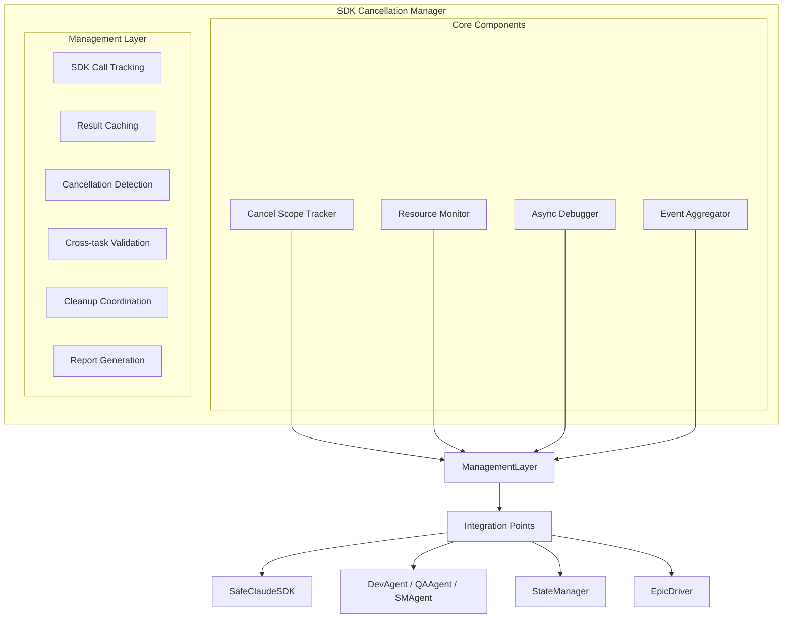

# 取消管理器实现

<cite>
**本文档引用的文件**   
- [cancellation_manager.py](file://autoBMAD/epic_automation/core/cancellation_manager.py)
- [sdk_cancellation_manager.py](file://autoBMAD/epic_automation/monitoring/sdk_cancellation_manager.py)
- [sdk_wrapper.py](file://autoBMAD/epic_automation/sdk_wrapper.py)
- [cancel_scope_tracker.py](file://BUGFIX_20260107/debug_suite/cancel_scope_tracker.py)
- [resource_monitor.py](file://autoBMAD/epic_automation/monitoring/resource_monitor.py)
- [async_debugger.py](file://BUGFIX_20260107/debug_suite/async_debugger.py)
- [test_cancellation_manager.py](file://tests/unit/test_cancellation_manager.py)
- [CANCEL_SCOPE_CROSS_TASK_FIX.md](file://docs/CANCEL_SCOPE_CROSS_TASK_FIX.md)
- [sdk-cancellation-manager-design.md](file://docs-copy/architecture/sdk-cancellation-manager-design.md)
- [sdk-cancellation-manager-implementation.md](file://docs-copy/architecture/sdk-cancellation-manager-implementation.md)
</cite>

## 目录
1. [取消管理器概述](#取消管理器概述)
2. [核心组件分析](#核心组件分析)
3. [SDK取消管理器实现](#sdk取消管理器实现)
4. [取消作用域追踪器](#取消作用域追踪器)
5. [资源监控器](#资源监控器)
6. [异步调试器](#异步调试器)
7. [集成与工作流](#集成与工作流)
8. [测试与验证](#测试与验证)
9. [架构图](#架构图)
10. [结论](#结论)

## 取消管理器概述

取消管理器是BMAD自动化系统中的关键组件，负责管理SDK调用的生命周期、取消请求和资源清理。该系统解决了AnyIO取消作用域跨任务错误的问题，确保异步操作的正确性和稳定性。取消管理器采用双条件验证机制，只有当取消请求和清理完成两个条件都满足时，才认为可以安全进行下一步操作。

取消管理器的主要功能包括：
- 跟踪活跃的SDK调用
- 管理取消请求
- 验证清理完成（双条件验证机制）
- 提供异步上下文管理器`track_sdk_execution`
- 生成诊断报告和统计信息

该系统通过引入强制同步点和优化的资源管理，解决了跨任务取消作用域错误，确保了Dev-QA工作流的稳定执行。

**Section sources**
- [cancellation_manager.py](file://autoBMAD/epic_automation/core/cancellation_manager.py)
- [CANCEL_SCOPE_CROSS_TASK_FIX.md](file://docs/CANCEL_SCOPE_CROSS_TASK_FIX.md)

## 核心组件分析

取消管理器系统由多个核心组件构成，每个组件都有明确的职责和功能。这些组件协同工作，确保SDK调用的正确管理和资源的适当清理。

### CallInfo 数据类

`CallInfo`数据类用于存储SDK调用的详细信息，包括调用标识、代理名称、开始时间、取消请求状态、清理完成状态、是否已找到目标结果和错误列表。这个数据类是取消管理器跟踪和管理SDK调用的基础。

```python
@dataclass
class CallInfo:
    """SDK调用信息数据类"""
    call_id: str
    agent_name: str
    start_time: float
    cancel_requested: bool = False
    cleanup_completed: bool = False
    has_target_result: bool = False
    errors: list[str] = field(default_factory=list)
```

### CancellationManager 类

`CancellationManager`类是取消管理器的核心，负责管理所有活跃的SDK调用。它实现了双条件验证机制，确保只有在取消请求和清理完成都满足时，才允许继续执行。该类提供了注册调用、请求取消、标记清理完成、标记找到目标结果等方法。

```python
class CancellationManager:
    """
    取消管理器
    
    负责管理所有活跃的SDK调用，实现双条件验证机制：
    1. cancel_requested = True
    2. cleanup_completed = True
    
    只有同时满足这两个条件，才认为可以安全进行下一步。
    """
```

**Section sources**
- [cancellation_manager.py](file://autoBMAD/epic_automation/core/cancellation_manager.py)

## SDK取消管理器实现

SDK取消管理器是取消管理器系统的高级实现，提供了更全面的功能和更好的集成。它整合了取消作用域追踪器、资源监控器和异步调试器，提供了统一的SDK调用管理。

### 初始化

SDK取消管理器在初始化时会创建和配置各个组件，包括日志目录、取消作用域追踪器、资源监控器和异步调试器。它还维护了活跃、已完成、已取消和失败的SDK调用列表，以及统计信息。

```python
def __init__(
    self,
    log_dir: Optional[Path] = None,
    enable_tracking: bool = True,
    enable_monitoring: bool = True,
    enable_debugging: bool = True
):
    """
    初始化 SDK 取消管理器
    
    Args:
        log_dir: 日志目录
        enable_tracking: 启用 cancel scope 追踪
        enable_monitoring: 启用资源监控
        enable_debugging: 启用异步调试
    """
```

### 跟踪SDK执行

`track_sdk_execution`方法是一个异步上下文管理器，用于追踪SDK执行。它在进入上下文时记录SDK调用的开始，在退出时处理成功完成、取消或失败的情况。该方法还负责清理和退出取消作用域。

```python
@asynccontextmanager
async def track_sdk_execution(
    self,
    call_id: str,
    operation_name: str,
    context: Optional[Dict[str, Any]] = None
):
    """
    追踪 SDK 执行的上下文管理器
    
    使用方法:
    ```python
    async with manager.track_sdk_execution("parse_status", "status_parsing"):
        result = await sdk.execute()
    ```
    
    Args:
        call_id: 调用唯一标识
        operation_name: 操作名称
        context: 上下文信息
    """
```

### 确认安全继续

`confirm_safe_to_proceed`方法用于确认SDK可以安全继续。它检查调用是否仍在活动列表中，或是否在取消列表中且未完全清理。只有当调用不在活动列表中且清理已完成时，才返回True。

```python
def confirm_safe_to_proceed(self, call_id: str) -> bool:
    """
    确认 SDK 可以安全继续
    
    🎯 Agent 在继续执行前必须调用此方法
    
    Args:
        call_id: 调用标识
        
    Returns:
        True if safe to proceed, False otherwise
    """
```

**Section sources**
- [sdk_cancellation_manager.py](file://autoBMAD/epic_automation/monitoring/sdk_cancellation_manager.py)

## 取消作用域追踪器

取消作用域追踪器负责追踪取消作用域的进入和退出，检测跨任务访问，记录作用域层级关系，并识别作用域泄漏。

### 职责

- 追踪取消作用域的进入/退出
- 检测跨任务访问
- 记录作用域层级关系
- 识别作用域泄漏

### 关键特性

取消作用域追踪器能够检测跨任务访问，当一个任务进入取消作用域而另一个任务退出时，会自动记录错误事件。这有助于识别和解决跨任务取消作用域错误。

```python
# 跨任务检测示例
tracker.enter_scope(scope_id="scope_001", name="sdk_execution")
# Task A 进入

# ... 异步操作 ...

tracker.exit_scope(scope_id="scope_001")
# Task B 退出 ❌ 跨任务访问！

# 自动记录错误事件
{
    "event_type": "error",
    "error_type": "cross_task_access",
    "scope_id": "scope_001",
    "entered_by_task": "Task-12345",
    "exited_by_task": "Task-67890",
    "stack_trace": "..."
}
```

**Section sources**
- [cancel_scope_tracker.py](file://BUGFIX_20260107/debug_suite/cancel_scope_tracker.py)
- [sdk-cancellation-manager-design.md](file://docs-copy/architecture/sdk-cancellation-manager-design.md)

## 资源监控器

资源监控器负责监控系统资源的使用情况，包括锁、会话、任务等资源的状态和生命周期。

### 职责

- 监控锁的获取/释放
- 追踪SDK会话生命周期
- 检测资源泄漏
- 统计资源使用情况

### 组件

资源监控器由多个子组件构成，包括锁监控器、会话监控器、任务监控器和系统监控器。每个子组件负责监控特定类型的资源。

```python
class ResourceMonitor:
    """资源监控器主类"""
    
    def __init__(self, log_file: Optional[Path] = None):
        self.lock_monitor = LockMonitor()
        self.session_monitor = SessionMonitor()
        self.task_monitor = TaskMonitor()
        self.system_monitor = SystemMonitor()
```

**Section sources**
- [resource_monitor.py](file://autoBMAD/epic_automation/monitoring/resource_monitor.py)
- [sdk-cancellation-manager-design.md](file://docs-copy/architecture/sdk-cancellation-manager-design.md)

## 异步调试器

异步调试器用于调试异步操作，提供详细的日志记录和调试信息。

### 职责

- 提供异步操作的详细日志
- 记录异步生成器的生命周期
- 捕获和报告异步错误
- 提供调试信息和堆栈跟踪

### 实现

异步调试器通过记录异步操作的开始和结束时间，以及捕获和报告任何异常，帮助开发者理解和调试异步代码。

```python
class AsyncDebugger:
    """异步调试器"""
    
    def __init__(self, log_file: Path):
        self.log_file = log_file
        self.logger = self._setup_logging()
```

**Section sources**
- [async_debugger.py](file://BUGFIX_20260107/debug_suite/async_debugger.py)

## 集成与工作流

取消管理器系统与BMAD自动化系统的其他组件紧密集成，确保整个工作流的稳定和高效。

### 与SDK包装器的集成

SDK包装器集成了SDK取消管理器，确保所有SDK调用都通过管理器进行追踪。这解决了取消作用域跨任务错误，并提供了统一的取消处理机制。

```python
class SafeClaudeSDK:
    """
    Fixed safe wrapper for Claude SDK with unified cancellation management.
    
    This wrapper ensures proper cleanup of async generators and prevents
    RuntimeError when event loop closes. Now integrated with SDKCancellationManager
    for unified cancellation handling.
    """
```

### 工作流

取消管理器的工作流包括以下步骤：
1. 注册SDK调用
2. 执行SDK操作
3. 处理成功完成、取消或失败
4. 清理资源
5. 确认安全继续

**Section sources**
- [sdk_wrapper.py](file://autoBMAD/epic_automation/sdk_wrapper.py)
- [sdk_cancellation_manager.py](file://autoBMAD/epic_automation/monitoring/sdk_cancellation_manager.py)

## 测试与验证

取消管理器系统经过了全面的测试和验证，确保其功能的正确性和稳定性。

### 单元测试

单元测试覆盖了取消管理器的所有主要功能，包括初始化、注册调用、请求取消、标记清理完成、标记找到目标结果和确认安全继续。

```python
@pytest.mark.anyio
class TestCancellationManager:
    """测试 CancellationManager 类"""
    
    @pytest.fixture
    def manager(self):
        """创建 CancellationManager 实例"""
        return CancellationManager()
```

### 集成测试

集成测试验证了取消管理器与其他组件的协作，包括SDK包装器、状态管理器和质量门控。

```python
@pytest.mark.integration
@pytest.mark.anyio
async def test_state_machine_with_failed_state_recovery(safe_task_group, temp_story_file):
    """测试状态机失败状态恢复"""
```

**Section sources**
- [test_cancellation_manager.py](file://tests/unit/test_cancellation_manager.py)

## 架构图



**Diagram sources**
- [sdk-cancellation-manager-design.md](file://docs-copy/architecture/sdk-cancellation-manager-design.md)

## 结论

取消管理器实现成功解决了AnyIO取消作用域跨任务错误的问题，确保了BMAD自动化系统的稳定性和可靠性。通过引入双条件验证机制、强制同步点和优化的资源管理，该系统提供了一个健壮的SDK调用管理框架。

主要成果包括：
- 解决了取消作用域跨任务错误
- 实现了统一的SDK调用管理
- 提供了详细的诊断报告和统计信息
- 增强了系统的稳定性和可靠性

未来的工作可以包括进一步优化性能、增加更多的监控指标和改进错误恢复机制。