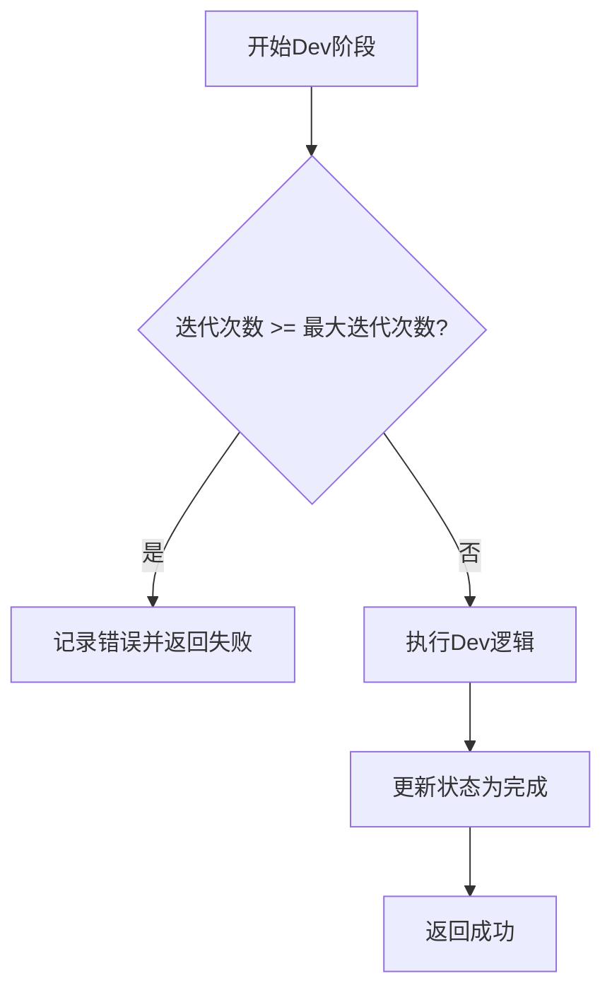

# 故障排除

<cite>
**本文档引用的文件**   
- [ERROR_ANALYSIS_REPORT.md](file://ERROR_ANALYSIS_REPORT.md)
- [ASYNC_CANCEL_SCOPE_FIX.md](file://ASYNC_CANCEL_SCOPE_FIX.md)
- [FINAL_ANALYSIS_SUMMARY.md](file://FINAL_ANALYSIS_SUMMARY.md)
- [STATUS_ANALYSIS_REPORT.md](file://STATUS_ANALYSIS_REPORT.md)
- [verify_cancel_scope_fix.py](file://verify_cancel_scope_fix.py)
- [BUGFIX_20260107\README.md](file://BUGFIX_20260107/README.md)
- [BUGFIX_20260107\DEBUGPY_INTEGRATION_FINAL_REPORT.md](file://BUGFIX_20260107/DEBUGPY_INTEGRATION_FINAL_REPORT.md)
- [autoBMAD\epic_automation\qa_agent.py](file://autoBMAD/epic_automation/qa_agent.py)
- [autoBMAD\epic_automation\sdk_session_manager.py](file://autoBMAD/epic_automation/sdk_session_manager.py)
- [autoBMAD\epic_automation\epic_driver.py](file://autoBMAD/epic_automation/epic_driver.py)
- [autoBMAD\epic_automation\state_manager.py](file://autoBMAD/epic_automation/state_manager.py)
- [autoBMAD\epic_automation\story_parser.py](file://autoBMAD/epic_automation/story_parser.py)
- [BUGFIX_20260107\validation_scripts\run_diagnostic.py](file://BUGFIX_20260107/validation_scripts/run_diagnostic.py)
- [BUGFIX_20260107\validation_scripts\validate_fixes.py](file://BUGFIX_20260107/validation_scripts/validate_fixes.py)
- [tests\test_cancel_scope_fix.py](file://tests/test_cancel_scope_fix.py)
</cite>

## 目录
1. [简介](#简介)
2. [已知问题分析](#已知问题分析)
3. [无限循环风险解决方案](#无限循环风险解决方案)
4. [状态重置问题解决方案](#状态重置问题解决方案)
5. [调试集成问题诊断与解决](#调试集成问题诊断与解决)
6. [质量门控失败问题解决](#质量门控失败问题解决)
7. [CLI参数错误处理](#cli参数错误处理)
8. [修复验证步骤](#修复验证步骤)
9. [诊断报告解读](#诊断报告解读)
10. [性能瓶颈识别](#性能瓶颈识别)

## 简介
本文档旨在为Epic自动化系统提供全面的故障排除指南，重点解决在`ERROR_ANALYSIS_REPORT.md`中分析的已知问题。文档基于对代码库的深入分析，提供了针对无限循环风险、状态重置问题、调试集成、质量门控失败和CLI参数错误等关键问题的详细解决方案。同时，文档还包含了使用`verify_cancel_scope_fix.py`等工具验证修复的步骤，以及诊断报告解读和性能瓶颈识别的技巧。

**Section sources**
- [ERROR_ANALYSIS_REPORT.md](file://ERROR_ANALYSIS_REPORT.md#L1-L296)

## 已知问题分析
根据`ERROR_ANALYSIS_REPORT.md`的分析，系统存在五个关键错误类别，主要集中在异步资源管理、迭代逻辑、状态管理和Dev-QA循环协调方面。

### 关键发现
- **异步cancel scope跨任务错误**: 每个SDK调用都会产生`RuntimeError: Attempted to exit cancel scope in a different task than it was entered in`错误，影响所有SDK调用。
- **迭代限制逻辑错误**: 尽管配置了`max_iterations=2`，但实际执行了4次以上的循环，存在无限循环风险。
- **状态解析失败**: `StatusParser`因缺少SDK包装器而无法执行AI解析，回退到正则表达式解析，导致状态卡死在"in progress"。
- **Dev-QA循环死锁**: 由于Dev Agent成功但故事状态未更新，而QA门控期望完成状态，形成了死锁，导致故事1.1陷入无限循环。
- **QA质量门控持续失败**: QA门控标准过严，且与状态解析失败形成标准不匹配，导致QA始终发现issues需要修复。

**Section sources**
- [ERROR_ANALYSIS_REPORT.md](file://ERROR_ANALYSIS_REPORT.md#L1-L196)

## 无限循环风险解决方案
无限循环风险主要源于迭代限制逻辑错误和Dev-QA循环死锁。解决方案包括修复迭代计数不一致和改进循环控制逻辑。

### 修复迭代计数不一致
在`epic_driver.py`的`execute_dev_phase`方法中，存在迭代计数检查不一致的问题。修复方案是统一使用`>=`操作符进行检查。



**Diagram sources**
- [autoBMAD\epic_automation\epic_driver.py](file://autoBMAD/epic_automation/epic_driver.py#L1167-L1175)

### 改进循环控制逻辑
为解决Dev-QA循环死锁，需要在Dev成功后显式更新故事状态，并添加循环退出条件。

```python
# 建议修复: 在execute_dev_phase中更新状态
await self.state_manager.update_story_status(
    story_path=story_path,
    status="completed",  # 明确设置为完成状态
    phase="dev",
    iteration=iteration,
)
```

**Section sources**
- [ERROR_ANALYSIS_REPORT.md](file://ERROR_ANALYSIS_REPORT.md#L53-L88)
- [autoBMAD\epic_automation\epic_driver.py](file://autoBMAD/epic_automation/epic_driver.py#L1167-L1175)

## 状态重置问题解决方案
状态重置问题主要由状态解析失败引起。解决方案是修复`StatusParser`的SDK包装器初始化和状态标准化问题。

### 修复状态解析器
在`story_parser.py`中，`StatusParser`的初始化需要确保能获取有效的SDK包装器。

```python
# 建议修复: 增强StatusParser的SDK包装器初始化
def __init__(self, sdk_wrapper: Optional['SafeClaudeSDK'] = None):
    if sdk_wrapper is None:
        # 尝试重新初始化SDK包装器
        sdk_wrapper = self._create_default_sdk_wrapper()
    self.sdk_wrapper = sdk_wrapper
```

**Section sources**
- [ERROR_ANALYSIS_REPORT.md](file://ERROR_ANALYSIS_REPORT.md#L235-L245)
- [autoBMAD\epic_automation\story_parser.py](file://autoBMAD/epic_automation/story_parser.py#L130-L154)

### 确保状态标准化
`_parse_story_status_fallback`函数在修复后已正确调用`_normalize_story_status`函数进行状态标准化。


**Diagram sources**
- [FINAL_ANALYSIS_SUMMARY.md](file://FINAL_ANALYSIS_SUMMARY.md#L80-L85)
- [STATUS_ANALYSIS_REPORT.md](file://STATUS_ANALYSIS_REPORT.md#L104-L108)

## 调试集成问题诊断与解决
为解决异步cancel scope错误，系统引入了debugpy远程调试支持，提供了强大的调试能力。

### debugpy集成验证
使用`quick_verify.py`脚本可以快速验证debugpy集成是否成功。

```bash
# 运行快速验证脚本
python quick_verify.py

# 查看验证报告
cat debugpy_integration_verification_report.json
```

**Section sources**
- [BUGFIX_20260107\README.md](file://BUGFIX_20260107/README.md#L85-L93)

### 启动调试服务
启动debugpy服务器和调试仪表板，以便进行远程调试。

```bash
# 启动所有调试服务
python start_debug_services.py

# 仅启动debugpy服务器
python start_debug_services.py --server
```

**Section sources**
- [BUGFIX_20260107\README.md](file://BUGFIX_20260107/README.md#L102-L116)

### IDE远程调试配置
配置VS Code或PyCharm以连接到debugpy服务器进行远程调试。

```json
{
    "version": "0.2.0",
    "configurations": [
        {
            "name": "Python: Remote Attach",
            "type": "python",
            "request": "attach",
            "connect": {
                "host": "localhost",
                "port": 5678
            },
            "pathMappings": [
                {
                    "localRoot": "${workspaceFolder}",
                    "remoteRoot": "."
                }
            ]
        }
    ]
}
```

**Section sources**
- [BUGFIX_20260107\README.md](file://BUGFIX_20260107/README.md#L118-L142)

## 质量门控失败问题解决
质量门控失败主要由QA门控标准过严和状态解析失败引起。解决方案是优化QA门控机制和确保状态正确转换。

### 优化QA门控机制
在`qa_agent.py`中，可以添加issues分级机制，允许非关键issues通过。

```python
# 建议: 添加issues分级机制
def execute(self, story_path: str) -> dict[str, Any]:
    # ...
    if qa_result.get("passed", False):
        # QA通过
        return {"passed": True, "completed": True}
    else:
        # 检查issues严重程度
        if self._has_critical_issues(qa_result):
            return {"passed": False, "needs_fix": True}
        else:
            # 非关键issues，允许通过
            return {"passed": True, "completed": True, "warnings": qa_result.get("warnings")}
```

**Section sources**
- [ERROR_ANALYSIS_REPORT.md](file://ERROR_ANALYSIS_REPORT.md#L256-L261)
- [autoBMAD\epic_automation\qa_agent.py](file://autoBMAD/epic_automation/qa_agent.py#L109-L120)

### 确保状态正确转换
在QA通过后，应显式更新故事状态为"Done"或"Ready for Done"。

```python
# 在execute_qa_phase中更新状态
if qa_result.get("passed", False):
    await self.state_manager.update_story_status(
        story_path=story_path, status="completed"
    )
    return True
```

**Section sources**
- [autoBMAD\epic_automation\epic_driver.py](file://autoBMAD/epic_automation/epic_driver.py#L1238-L1248)

## CLI参数错误处理
CLI参数错误可能导致系统行为异常。解决方案是增强参数验证和提供清晰的错误消息。

### 参数验证
在CLI脚本中添加参数验证逻辑，确保输入参数的有效性。

```python
import argparse

def parse_args():
    parser = argparse.ArgumentParser(description='Epic Driver CLI')
    parser.add_argument('--max-iterations', type=int, default=2, 
                       help='Maximum number of iterations (default: 2)')
    parser.add_argument('--timeout', type=int, default=600,
                       help='Operation timeout in seconds (default: 600)')
    
    args = parser.parse_args()
    
    # 验证参数
    if args.max_iterations < 1:
        parser.error("max-iterations must be at least 1")
    if args.timeout < 10:
        parser.error("timeout must be at least 10 seconds")
        
    return args
```

**Section sources**
- [autoBMAD\epic_automation\epic_driver.py](file://autoBMAD/epic_automation/epic_driver.py#L1167-L1175)

## 修复验证步骤
为确保修复的有效性，需要使用专门的工具和脚本进行验证。

### 使用验证脚本
运行`validate_fixes.py`脚本来验证所有修复模块。

```bash
cd BUGFIX_20260107/validation_scripts
python validate_fixes.py
```

**Section sources**
- [BUGFIX_20260107\README.md](file://BUGFIX_20260107/README.md#L166-L176)

### 运行单元测试
执行`test_cancel_scope_fix.py`中的单元测试，验证cancel scope错误是否已修复。

```bash
python -m pytest tests/test_cancel_scope_fix.py -v
```

**Section sources**
- [tests\test_cancel_scope_fix.py](file://tests/test_cancel_scope_fix.py#L32-L61)

### 使用验证工具
运行`verify_cancel_scope_fix.py`脚本，全面验证cancel scope错误修复。

```bash
python verify_cancel_scope_fix.py
```

**Section sources**
- [verify_cancel_scope_fix.py](file://verify_cancel_scope_fix.py#L173-L225)

## 诊断报告解读
诊断报告提供了系统状态的全面视图，正确解读报告有助于快速定位问题。

### 运行诊断脚本
使用`run_diagnostic.py`生成系统诊断报告。

```bash
python BUGFIX_20260107/validation_scripts/run_diagnostic.py
```

**Section sources**
- [BUGFIX_20260107\README.md](file://BUGFIX_20260107/README.md#L304-L305)

### 解读诊断报告
诊断报告包含系统资源、文件结构、数据库状态、日志文件、进程状态和Python环境的检查结果。

```json
{
    "timestamp": "2026-01-09T12:30:00",
    "overall_status": "HEALTHY",
    "critical_issues": [],
    "findings": ["系统资源状态正常"],
    "recommendations": []
}
```

**Section sources**
- [BUGFIX_20260107\validation_scripts\run_diagnostic.py](file://BUGFIX_20260107/validation_scripts/run_diagnostic.py#L354-L410)

## 性能瓶颈识别
通过监控关键指标和分析系统行为，可以识别性能瓶颈。

### 监控关键指标
关注以下关键性能指标：

| 指标 | 目标 | 说明 |
|------|------|------|
| Cancel Scope Error Rate | < 0.1% | 取消范围错误频率 |
| Session Success Rate | > 99% | SDK会话成功率 |
| Average Operation Duration | < 400s | 平均操作持续时间 |
| Error Recovery Time | < 30s | 错误恢复时间 |

**Section sources**
- [BUGFIX_20260107\DEBUGPY_INTEGRATION_FINAL_REPORT.md](file://BUGFIX_20260107/DEBUGPY_INTEGRATION_FINAL_REPORT.md#L347-L355)

### 识别性能瓶颈
使用实时监控仪表板和性能测试脚本识别性能瓶颈。

```bash
# 运行性能基准测试
python BUGFIX_20260107/validation_scripts/performance_test.py
```

**Section sources**
- [BUGFIX_20260107\README.md](file://BUGFIX_20260107/README.md#L174-L176)