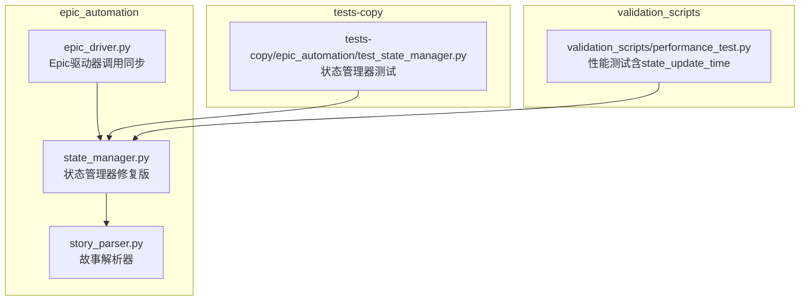
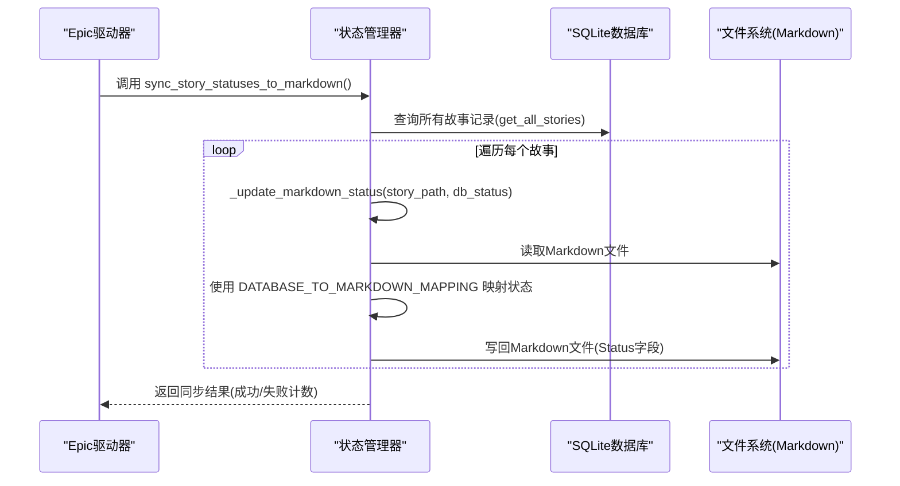
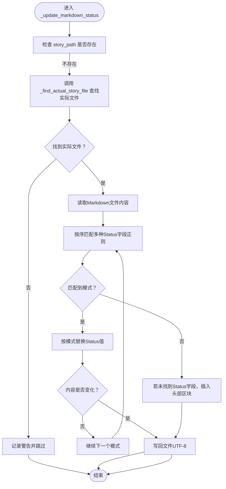
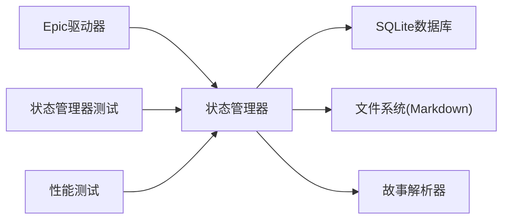

# 状态同步与延迟问题

<cite>
**本文引用的文件**
- [状态管理器（修复版）](file://autoBMAD/epic_automation/state_manager.py)
- [故事解析器](file://autoBMAD/epic_automation/story_parser.py)
- [Epic驱动器（状态同步调用处）](file://autoBMAD/epic_automation/epic_driver.py)
- [状态同步测试（epic_automation）](file://tests-copy/epic_automation/test_state_manager.py)
- [性能测试（状态更新指标）](file://BUGFIX_20260107/validation_scripts/performance_test.py)
- [状态分析报告](file://STATUS_ANALYSIS_REPORT.md)
</cite>

## 目录
1. [简介](#简介)
2. [项目结构](#项目结构)
3. [核心组件](#核心组件)
4. [架构总览](#架构总览)
5. [详细组件分析](#详细组件分析)
6. [依赖关系分析](#依赖关系分析)
7. [性能考量](#性能考量)
8. [故障排查指南](#故障排查指南)
9. [结论](#结论)

## 简介
本文件聚焦于“状态同步延迟与不一致”的根因分析与解决方案，围绕以下目标展开：
- 诊断状态管理器中异步操作与文件系统状态不同步的问题，尤其是状态同步到Markdown文件时的潜在延迟与一致性风险。
- 详解从数据库到Markdown文件的单向状态同步流程，包括映射表与文件路径不匹配的处理策略。
- 结合故事解析器的解析逻辑，说明如何确保内存中的状态与文件系统状态保持一致。
- 使用测试用例验证同步的可靠性，并参考性能测试中的state_update_time指标评估同步效率。

## 项目结构
本问题涉及的核心文件位于autoBMAD/epic_automation目录，以及tests-copy与validation_scripts目录下的测试与性能验证脚本。

图表来源
- [状态管理器（修复版）](file://autoBMAD/epic_automation/state_manager.py#L626-L866)
- [故事解析器](file://autoBMAD/epic_automation/story_parser.py#L1-L200)
- [Epic驱动器（状态同步调用处）](file://autoBMAD/epic_automation/epic_driver.py#L1910-L1927)
- [状态同步测试（epic_automation）](file://tests-copy/epic_automation/test_state_manager.py#L1-L310)
- [性能测试（状态更新指标）](file://BUGFIX_20260107/validation_scripts/performance_test.py#L193-L258)

章节来源
- [状态管理器（修复版）](file://autoBMAD/epic_automation/state_manager.py#L626-L866)
- [Epic驱动器（状态同步调用处）](file://autoBMAD/epic_automation/epic_driver.py#L1910-L1927)

## 核心组件
- 状态管理器（StateManager）
  - 负责数据库侧故事状态的增删改查、乐观锁、连接池、健康检查等。
  - 提供从数据库到Markdown文件的单向同步方法：sync_story_statuses_to_markdown。
- 故事解析器（SimpleStoryParser）
  - 提供状态解析能力，支持AI优先与正则回退；其标准化函数保证状态值的一致性。
- Epic驱动器（EpicDriver）
  - 在流程末尾调用状态同步方法，将数据库状态写回到Markdown文件。
- 测试与性能验证
  - 单元测试覆盖状态管理器的CRUD、并发、统计等；性能测试包含state_update_time基线。

章节来源
- [状态管理器（修复版）](file://autoBMAD/epic_automation/state_manager.py#L203-L349)
- [状态管理器（修复版）](file://autoBMAD/epic_automation/state_manager.py#L626-L866)
- [故事解析器](file://autoBMAD/epic_automation/story_parser.py#L113-L137)
- [Epic驱动器（状态同步调用处）](file://autoBMAD/epic_automation/epic_driver.py#L1910-L1927)
- [状态同步测试（epic_automation）](file://tests-copy/epic_automation/test_state_manager.py#L1-L310)
- [性能测试（状态更新指标）](file://BUGFIX_20260107/validation_scripts/performance_test.py#L193-L258)

## 架构总览
下面的序列图展示了从数据库到Markdown文件的单向状态同步流程，以及Epic驱动器的触发点。

图表来源
- [状态管理器（修复版）](file://autoBMAD/epic_automation/state_manager.py#L626-L866)
- [Epic驱动器（状态同步调用处）](file://autoBMAD/epic_automation/epic_driver.py#L1910-L1927)

## 详细组件分析

### 状态管理器：数据库到Markdown的单向同步
- 同步入口：sync_story_statuses_to_markdown
  - 从数据库获取全部故事记录，逐条调用_update_markdown_status。
  - 统计成功/失败数量并返回结果。
- 状态映射：DATABASE_TO_MARKDOWN_MAPPING
  - 将数据库侧状态（如pending、in_progress、review、completed、failed、cancelled、qa_*、error等）映射为Markdown文档的标准状态值。
  - 若未命中映射，默认采用“Draft”。
- Markdown更新策略：_update_markdown_status
  - 优先使用正则匹配多种Status字段格式，按匹配到的首个模式进行替换。
  - 若未找到Status字段，则在文件首部插入“### Status\n**<状态>**\n\n”区块。
  - 写回文件时采用UTF-8编码。
- 文件路径容错：_find_actual_story_file
  - 当数据库记录的story_path在文件系统不存在时，尝试通过文件名转换与目录扫描寻找实际文件。
  - 支持“点号转连字符”、“同目录下精确/连字符版本匹配”等策略，并通过数字前缀匹配同一故事的不同命名。
  - 若仍找不到，记录警告并跳过，避免阻塞整体同步。
- 锁与并发
  - _update_story_internal使用asyncio.Lock保护数据库操作，避免竞态。
  - 连接池DatabaseConnectionPool提升并发读写性能，启用WAL模式与适度同步策略。
- 错误处理
  - 同步过程捕获异常并计入错误计数，不影响其他故事的处理。
  - 文件不存在时记录警告并跳过，避免中断。

章节来源
- [状态管理器（修复版）](file://autoBMAD/epic_automation/state_manager.py#L626-L866)

### 故事解析器：确保内存状态与文件状态一致
- 标准化映射
  - 核心状态值集合与ProcessingStatus枚举，保证状态值在系统内统一。
  - 提供core_status_to_processing映射，便于从核心状态值推导处理状态。
- 状态解析策略
  - AI优先：通过SafeClaudeSDK执行解析，失败时回退到正则表达式。
  - 正则回退：支持多种Status字段格式，最终通过标准化函数统一为标准状态值。
- 与状态同步的关系
  - 解析器负责从文件中提取状态，而状态管理器负责将数据库状态写回文件。
  - 两者配合可确保“文件系统状态”与“内存/数据库状态”一致：文件状态由解析器标准化，数据库状态由状态管理器写回。

章节来源
- [故事解析器](file://autoBMAD/epic_automation/story_parser.py#L113-L137)
- [故事解析器](file://autoBMAD/epic_automation/story_parser.py#L234-L361)
- [故事解析器](file://autoBMAD/epic_automation/story_parser.py#L529-L668)

### Epic驱动器：触发同步的集成点
- 在质量门禁阶段结束后，调用sync_story_statuses_to_markdown进行状态落盘。
- 记录同步结果，若出现错误则告警但不阻断流程。

章节来源
- [Epic驱动器（状态同步调用处）](file://autoBMAD/epic_automation/epic_driver.py#L1910-L1927)

### 状态同步算法流程（面向_update_markdown_status）

图表来源
- [状态管理器（修复版）](file://autoBMAD/epic_automation/state_manager.py#L677-L796)
- [状态管理器（修复版）](file://autoBMAD/epic_automation/state_manager.py#L797-L866)

## 依赖关系分析
- 状态管理器依赖
  - story_parser：虽然状态同步不直接解析文件，但其标准化函数确保状态值在系统内一致，间接保障同步后文件状态的正确性。
  - 文件系统：读写Markdown文件，依赖路径容错逻辑。
  - SQLite：持久化状态，使用连接池与WAL模式。
- Epic驱动器依赖
  - 状态管理器：调用同步方法。
- 测试与性能
  - 单测覆盖状态管理器的CRUD、并发、统计等；性能测试包含state_update_time基线，用于评估状态更新性能。

图表来源
- [状态管理器（修复版）](file://autoBMAD/epic_automation/state_manager.py#L626-L866)
- [Epic驱动器（状态同步调用处）](file://autoBMAD/epic_automation/epic_driver.py#L1910-L1927)
- [状态同步测试（epic_automation）](file://tests-copy/epic_automation/test_state_manager.py#L1-L310)
- [性能测试（状态更新指标）](file://BUGFIX_20260107/validation_scripts/performance_test.py#L193-L258)

## 性能考量
- state_update_time基线
  - 性能测试脚本中定义了state_update_time的基线阈值，用于评估状态更新的平均耗时。
  - 该指标可用于衡量状态管理器在高并发场景下的表现，从而指导同步效率优化。
- 同步流程的性能瓶颈
  - 文件I/O：逐条读取/写回Markdown文件，可能成为同步的瓶颈。
  - 正则匹配：多模式匹配与替换，需注意复杂度。
  - 路径查找：当文件不存在时，_find_actual_story_file会进行目录扫描与正则匹配，增加额外开销。
- 优化建议
  - 批量处理：在保证一致性的前提下，考虑批量读取/写回，减少I/O次数。
  - 缓存策略：对常用文件内容进行轻量缓存，降低重复读取成本。
  - 并发控制：在同步阶段限制并发度，避免磁盘争用。
  - 日志降噪：减少不必要的日志输出，降低I/O压力。

章节来源
- [性能测试（状态更新指标）](file://BUGFIX_20260107/validation_scripts/performance_test.py#L193-L258)

## 故障排查指南
- 同步失败但未中断
  - 现象：sync_story_statuses_to_markdown返回错误计数大于0。
  - 排查：检查具体错误消息，定位失败的故事路径；确认数据库记录是否有效。
- 文件不存在或路径不匹配
  - 现象：跳过不存在的故事文件。
  - 排查：确认数据库中的story_path与实际文件命名差异；利用_find_actual_story_file的容错策略进行修正。
- 状态未更新或未插入
  - 现象：Markdown未出现Status区块或状态未改变。
  - 排查：确认正则模式是否匹配；若未找到Status字段，确认是否已插入头部区块。
- 并发冲突
  - 现象：数据库操作超时或锁竞争。
  - 排查：检查锁等待超时与死锁检测日志；适当调整并发度与连接池大小。
- 解析不一致
  - 现象：文件状态与数据库状态不一致。
  - 排查：确认解析器的标准化函数是否被正确使用；确保映射表与状态值一致。

章节来源
- [状态管理器（修复版）](file://autoBMAD/epic_automation/state_manager.py#L626-L866)
- [状态同步测试（epic_automation）](file://tests-copy/epic_automation/test_state_manager.py#L1-L310)

## 结论
- 根本原因
  - 状态同步延迟与不一致主要来源于文件I/O与路径容错逻辑的开销，以及正则匹配与写回的顺序处理。
  - 数据库侧通过锁与连接池保障一致性，但文件系统层面的容错与写回策略需要进一步优化。
- 解决方案
  - 在保证一致性的前提下，优化I/O与匹配策略，引入批量与缓存机制。
  - 加强路径容错与错误日志，提升可观测性与可维护性。
  - 使用测试与性能指标持续验证同步可靠性与效率。