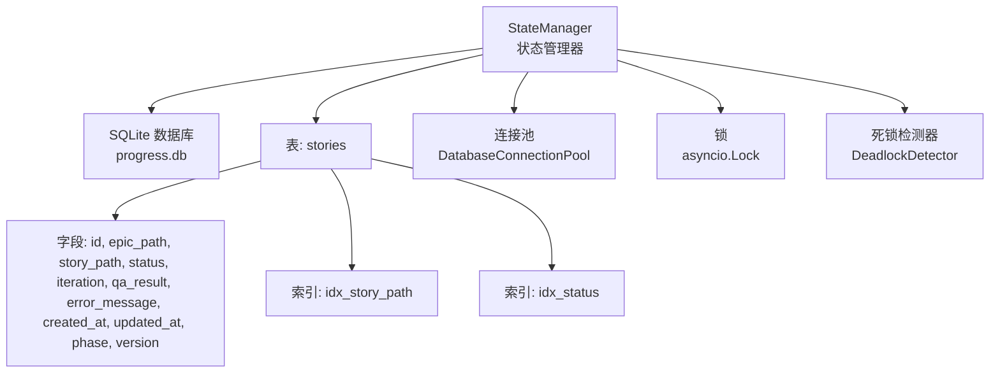
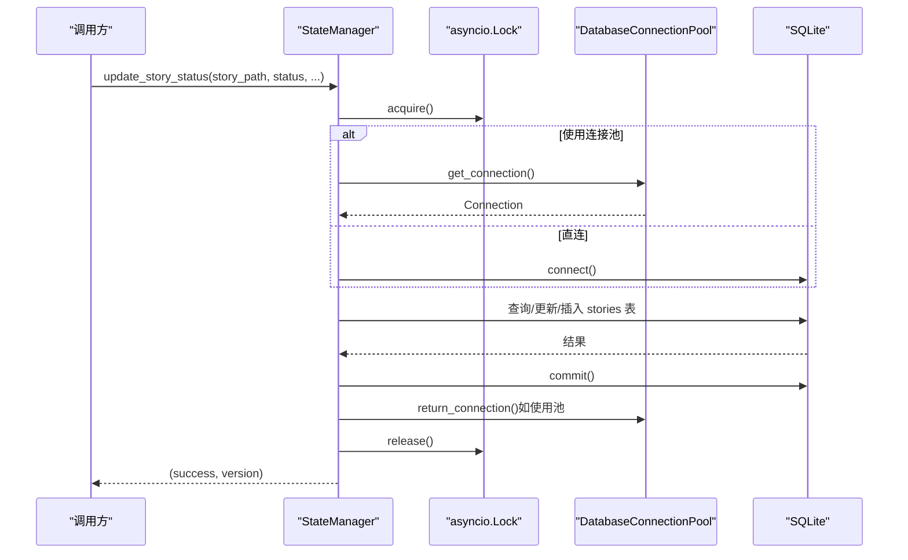
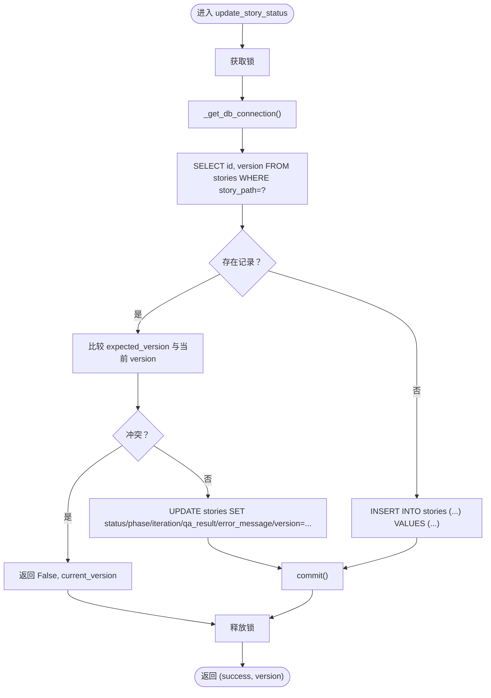
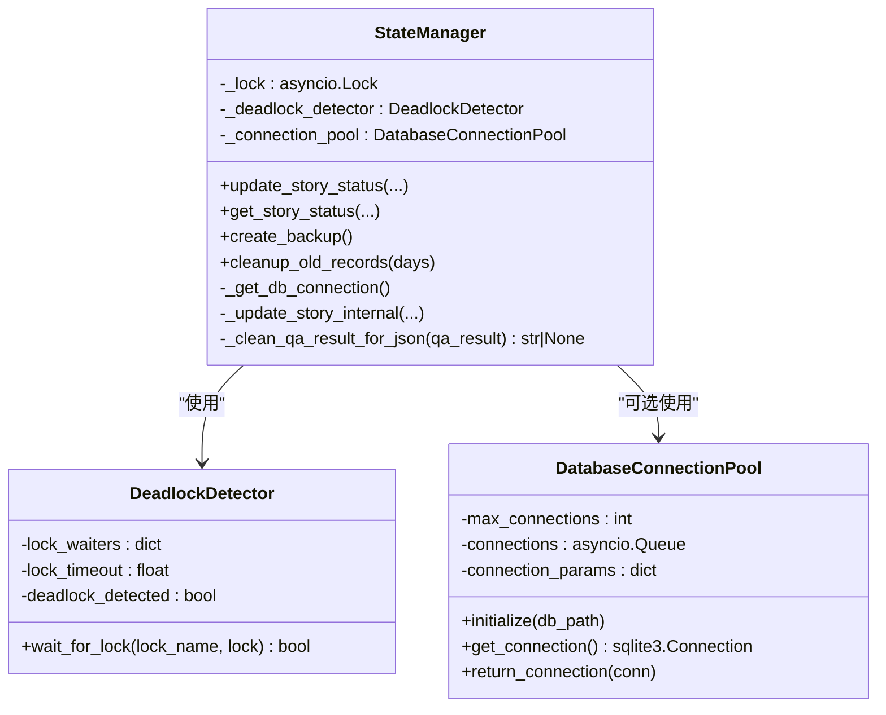
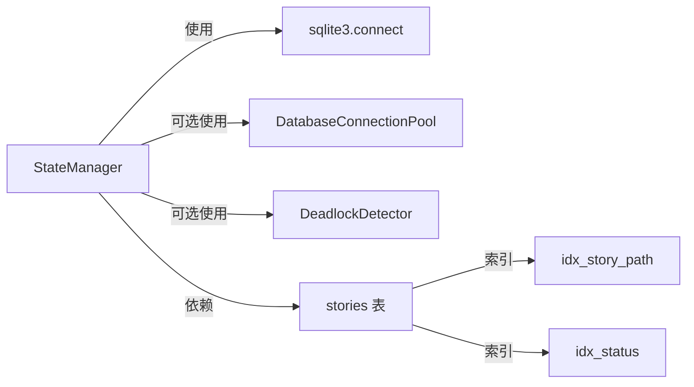

# 状态持久化机制

<cite>
**本文引用的文件**
- [state_manager.py](file://autoBMAD/epic_automation/state_manager.py)
- [state_manager_fixed.py](file://BUGFIX_20260107/fixed_modules/state_manager_fixed.py)
- [test_state_manager.py](file://tests-copy/epic_automation/test_state_manager.py)
- [状态系统重构实施方案.md](file://状态系统重构实施方案.md)
- [story_parser.py](file://autoBMAD/epic_automation/story_parser.py)
</cite>

## 目录
1. [简介](#简介)
2. [项目结构](#项目结构)
3. [核心组件](#核心组件)
4. [架构总览](#架构总览)
5. [详细组件分析](#详细组件分析)
6. [依赖关系分析](#依赖关系分析)
7. [性能考量](#性能考量)
8. [故障排查指南](#故障排查指南)
9. [结论](#结论)
10. [附录](#附录)

## 简介
本文件系统性阐述基于SQLite的状态持久化实现机制，聚焦于stories表的数据库模式设计、索引与版本控制策略，以及状态管理器在并发与一致性方面的保障手段。同时结合测试用例，说明update_story_status与get_story_status在原子性与一致性上的行为，并对比修复前后（state_manager_fixed.py）在连接池与乐观锁方面的改进，最后给出数据库备份与旧记录清理的最佳实践建议。

## 项目结构
围绕状态持久化的关键文件与职责：
- autoBMAD/epic_automation/state_manager.py：核心状态管理器，负责stories表的初始化、CRUD操作、并发控制、备份与清理。
- BUGFIX_20260107/fixed_modules/state_manager_fixed.py：修复版实现，引入连接池、乐观锁、死锁检测与更严格的锁获取流程。
- tests-copy/epic_automation/test_state_manager.py：覆盖数据库初始化、状态更新/查询、并发访问、QA结果序列化等测试。
- 状态系统重构实施方案.md：提供数据库备份与旧记录清理的最佳实践指南。
- autoBMAD/epic_automation/story_parser.py：提供统一的处理状态枚举ProcessingStatus，作为状态系统重构的基础。

图表来源
- [state_manager.py](file://autoBMAD/epic_automation/state_manager.py#L132-L179)
- [state_manager.py](file://autoBMAD/epic_automation/state_manager.py#L183-L202)
- [state_manager.py](file://autoBMAD/epic_automation/state_manager.py#L203-L369)
- [state_manager.py](file://autoBMAD/epic_automation/state_manager.py#L405-L512)
- [state_manager.py](file://autoBMAD/epic_automation/state_manager.py#L544-L604)

章节来源
- [state_manager.py](file://autoBMAD/epic_automation/state_manager.py#L132-L179)
- [state_manager.py](file://autoBMAD/epic_automation/state_manager.py#L183-L202)
- [state_manager.py](file://autoBMAD/epic_automation/state_manager.py#L203-L369)
- [state_manager.py](file://autoBMAD/epic_automation/state_manager.py#L405-L512)
- [state_manager.py](file://autoBMAD/epic_automation/state_manager.py#L544-L604)

## 核心组件
- stories表模式与字段
  - 主键与自增：id
  - 唯一约束：story_path
  - 核心状态：status
  - 迭代次数：iteration
  - QA结果：qa_result（JSON字符串）
  - 错误信息：error_message
  - 时间戳：created_at, updated_at
  - 阶段：phase
  - 版本：version（乐观锁）
- 索引策略
  - idx_story_path：加速按故事路径查询
  - idx_status：加速按状态聚合与过滤
- 版本控制（version列）
  - 默认值为1；每次更新时自增1，用于乐观锁冲突检测
- 迁移处理
  - 初始化时检测version列是否存在，若缺失则通过ALTER TABLE添加

章节来源
- [state_manager.py](file://autoBMAD/epic_automation/state_manager.py#L142-L179)

## 架构总览
状态管理器通过异步锁与可选连接池，确保并发安全；数据库层采用SQLite WAL模式与PRAGMA优化，提升并发读写性能；迁移逻辑保证向前兼容。

图表来源
- [state_manager.py](file://autoBMAD/epic_automation/state_manager.py#L203-L369)
- [state_manager.py](file://autoBMAD/epic_automation/state_manager.py#L183-L202)
- [state_manager.py](file://autoBMAD/epic_automation/state_manager.py#L132-L179)

## 详细组件分析

### 数据库模式与迁移（stories表）
- 表结构要点
  - 唯一索引：story_path
  - 辅助索引：status
  - 版本字段：version，默认1，用于乐观锁
- 迁移策略
  - 初始化时先尝试读取version列，若不存在则通过ALTER TABLE添加并设置默认值
- 索引策略
  - idx_story_path：按故事路径快速定位
  - idx_status：按状态统计与筛选

章节来源
- [state_manager.py](file://autoBMAD/epic_automation/state_manager.py#L142-L179)

### 并发与一致性保障
- 锁机制
  - update_story_status与get_story_status均在异步锁保护下执行，避免竞态
- 连接池（修复版）
  - DatabaseConnectionPool：固定大小队列，连接复用，降低连接开销
  - 初始化时启用WAL、NORMAL同步、缓存与内存临时表，提升并发
- 死锁检测（修复版）
  - DeadlockDetector：带超时等待，检测长时间等待的锁争用
- 乐观锁（修复版）
  - expected_version参数：比较当前version与期望值，冲突即拒绝更新并返回当前版本

章节来源
- [state_manager.py](file://autoBMAD/epic_automation/state_manager.py#L203-L369)
- [state_manager.py](file://autoBMAD/epic_automation/state_manager.py#L183-L202)
- [state_manager.py](file://autoBMAD/epic_automation/state_manager.py#L132-L179)
- [state_manager_fixed.py](file://BUGFIX_20260107/fixed_modules/state_manager_fixed.py#L77-L109)
- [state_manager_fixed.py](file://BUGFIX_20260107/fixed_modules/state_manager_fixed.py#L48-L76)
- [state_manager_fixed.py](file://BUGFIX_20260107/fixed_modules/state_manager_fixed.py#L223-L364)

### update_story_status与get_story_status的原子性与一致性
- 原子性
  - 在同一事务内完成查询、条件判断与更新，保证写入的可见性与一致性
- 一致性
  - 乐观锁：若version冲突，拒绝更新并返回当前版本，调用方可据此重试
  - QA结果序列化：清洗不可序列化对象后以JSON字符串存储，读取时尝试反序列化
- 测试验证
  - 测试覆盖新建、更新、并发访问、QA结果序列化、统计与时间戳等场景

图表来源
- [state_manager.py](file://autoBMAD/epic_automation/state_manager.py#L203-L369)

章节来源
- [state_manager.py](file://autoBMAD/epic_automation/state_manager.py#L203-L369)
- [test_state_manager.py](file://tests-copy/epic_automation/test_state_manager.py#L51-L94)
- [test_state_manager.py](file://tests-copy/epic_automation/test_state_manager.py#L199-L219)
- [test_state_manager.py](file://tests-copy/epic_automation/test_state_manager.py#L288-L310)

### 修复前后对比：连接池与乐观锁
- 修复前（参考原实现）
  - 使用简单连接直连，未显式连接池
  - 乐观锁逻辑在内部实现，但未暴露expected_version参数
- 修复后（state_manager_fixed.py）
  - 引入DatabaseConnectionPool，连接复用，降低开销
  - 明确expected_version参数，实现乐观锁冲突检测
  - 增加DeadlockDetector，带超时等待与死锁标记
  - 锁获取流程更严格：先通过死锁检测器获取锁，再进入内部更新

图表来源
- [state_manager_fixed.py](file://BUGFIX_20260107/fixed_modules/state_manager_fixed.py#L48-L76)
- [state_manager_fixed.py](file://BUGFIX_20260107/fixed_modules/state_manager_fixed.py#L77-L109)
- [state_manager_fixed.py](file://BUGFIX_20260107/fixed_modules/state_manager_fixed.py#L111-L160)
- [state_manager_fixed.py](file://BUGFIX_20260107/fixed_modules/state_manager_fixed.py#L223-L364)

章节来源
- [state_manager_fixed.py](file://BUGFIX_20260107/fixed_modules/state_manager_fixed.py#L48-L76)
- [state_manager_fixed.py](file://BUGFIX_20260107/fixed_modules/state_manager_fixed.py#L77-L109)
- [state_manager_fixed.py](file://BUGFIX_20260107/fixed_modules/state_manager_fixed.py#L223-L364)

### 数据库备份与旧记录清理最佳实践
- 备份（create_backup）
  - 基于文件复制（shutil.copy2），利用SQLite热备份特性，确保一致性
  - 建议在维护窗口执行，避免高并发写入
- 旧记录清理（cleanup_old_records）
  - 基于updated_at与状态过滤（completed/failed），批量删除
  - 建议定期执行（如每30天），并记录清理数量与耗时
  - 注意：清理前建议先备份

章节来源
- [state_manager.py](file://autoBMAD/epic_automation/state_manager.py#L544-L604)
- [状态系统重构实施方案.md](file://状态系统重构实施方案.md#L800-L1126)

## 依赖关系分析
- StateManager依赖sqlite3连接与异步锁
- 可选依赖DatabaseConnectionPool与DeadlockDetector
- stories表依赖idx_story_path与idx_status索引
- 迁移逻辑依赖version列的存在性检测

图表来源
- [state_manager.py](file://autoBMAD/epic_automation/state_manager.py#L132-L179)
- [state_manager.py](file://autoBMAD/epic_automation/state_manager.py#L183-L202)
- [state_manager.py](file://autoBMAD/epic_automation/state_manager.py#L203-L369)

章节来源
- [state_manager.py](file://autoBMAD/epic_automation/state_manager.py#L132-L179)
- [state_manager.py](file://autoBMAD/epic_automation/state_manager.py#L183-L202)
- [state_manager.py](file://autoBMAD/epic_automation/state_manager.py#L203-L369)

## 性能考量
- WAL模式与PRAGMA优化
  - WAL模式提升并发读写能力
  - NORMAL同步平衡性能与可靠性
  - 缓存与内存临时表减少磁盘IO
- 连接池
  - 固定大小队列，避免频繁创建/销毁连接
  - 适合高并发写入场景
- 索引
  - idx_story_path与idx_status提升查询与统计效率
- 乐观锁
  - 通过version自增与冲突检测，避免不必要的写放大

章节来源
- [state_manager.py](file://autoBMAD/epic_automation/state_manager.py#L132-L179)
- [state_manager_fixed.py](file://BUGFIX_20260107/fixed_modules/state_manager_fixed.py#L77-L109)

## 故障排查指南
- 常见问题
  - 锁超时/死锁：检查DeadlockDetector日志，确认锁等待时间与并发量
  - 版本冲突：当expected_version与当前version不一致时，更新会被拒绝，需重试
  - 连接池耗尽：检查max_connections与队列满情况
  - 备份失败：确认数据库文件权限与磁盘空间
- 建议
  - 使用get_health_status检查锁状态、死锁标记与连接池配置
  - 在高并发场景下启用连接池与WAL模式
  - 对外暴露的API增加超时与重试策略

章节来源
- [state_manager.py](file://autoBMAD/epic_automation/state_manager.py#L605-L626)
- [state_manager.py](file://autoBMAD/epic_automation/state_manager.py#L544-L604)
- [state_manager_fixed.py](file://BUGFIX_20260107/fixed_modules/state_manager_fixed.py#L48-L76)

## 结论
该状态持久化方案以SQLite为核心，通过合理的表结构、索引与版本控制，结合异步锁与可选连接池，有效保障了并发下的原子性与一致性。修复版进一步引入乐观锁与死锁检测，显著提升了系统的健壮性与可维护性。配合备份与旧记录清理的最佳实践，可在生产环境中稳定运行。

## 附录
- 状态系统统一与单向数据流
  - 通过ProcessingStatus统一处理状态，消除循环依赖与双向映射
  - 数据流向：文档核心状态 → 处理状态 → 数据库
- 测试覆盖要点
  - 初始化、CRUD、并发、序列化、统计、时间戳、删除等

章节来源
- [状态系统重构实施方案.md](file://状态系统重构实施方案.md#L1-L200)
- [story_parser.py](file://autoBMAD/epic_automation/story_parser.py#L80-L111)
- [test_state_manager.py](file://tests-copy/epic_automation/test_state_manager.py#L1-L310)