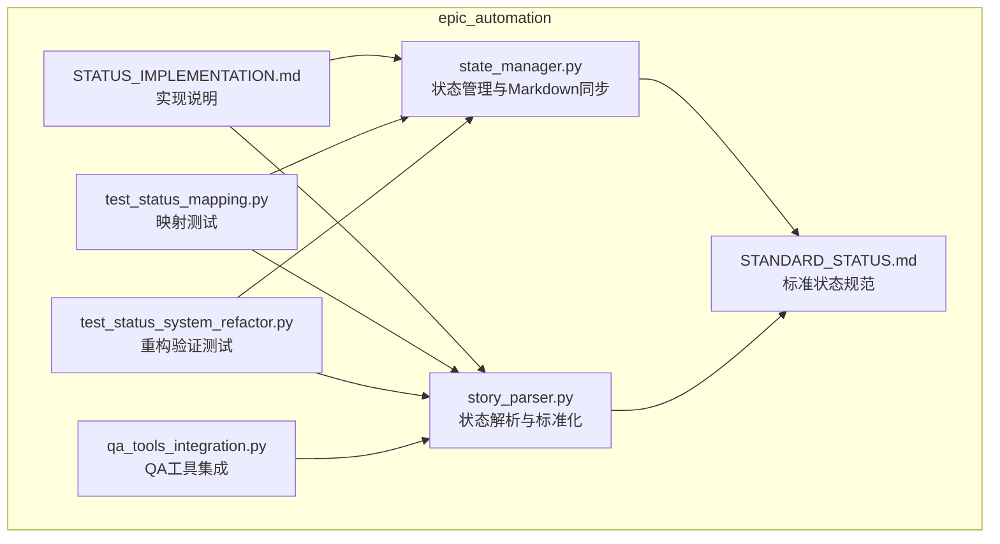
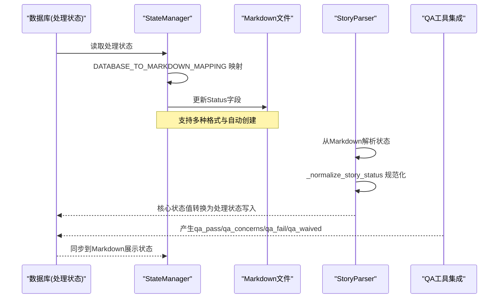
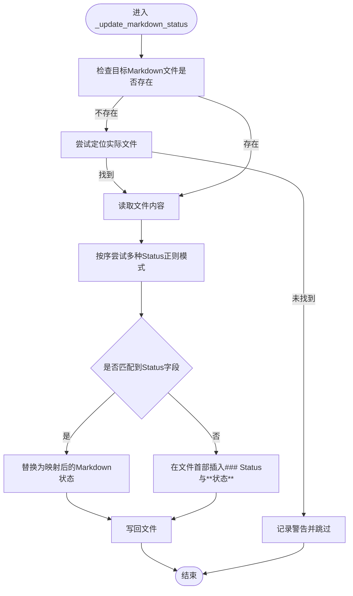
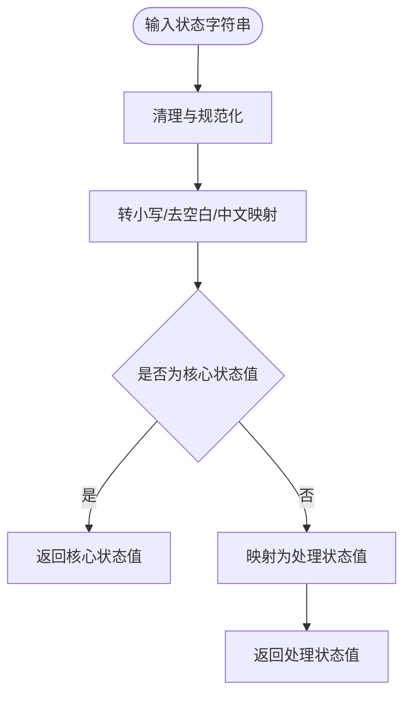
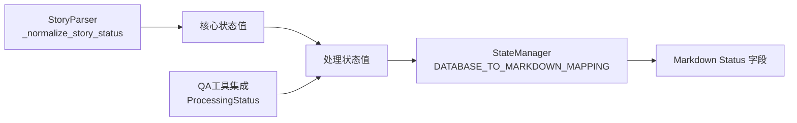

# 状态映射与解析错误

<cite>
**本文引用的文件**
- [state_manager.py](file://autoBMAD/epic_automation/state_manager.py)
- [story_parser.py](file://autoBMAD/epic_automation/story_parser.py)
- [STANDARD_STATUS.md](file://autoBMAD/epic_automation/STANDARD_STATUS.md)
- [状态值分析报告.md](file://状态值分析报告.md)
- [STATUS_IMPLEMENTATION.md](file://autoBMAD/epic_automation/STATUS_IMPLEMENTATION.md)
- [test_status_mapping.py](file://test_status_mapping.py)
- [test_status_system_refactor.py](file://test_status_system_refactor.py)
- [qa_tools_integration.py](file://autoBMAD/epic_automation/qa_tools_integration.py)
</cite>

## 目录
1. [简介](#简介)
2. [项目结构](#项目结构)
3. [核心组件](#核心组件)
4. [架构总览](#架构总览)
5. [详细组件分析](#详细组件分析)
6. [依赖关系分析](#依赖关系分析)
7. [性能考量](#性能考量)
8. [故障排查指南](#故障排查指南)
9. [结论](#结论)
10. [附录](#附录)

## 简介
本文件聚焦于“状态值映射错误与解析不准确”的问题，围绕以下目标展开：
- 分析 state_manager.py 中 DATABASE_TO_MARKDOWN_MAPPING 的映射逻辑，解释如何将数据库状态映射到 Markdown 的展示状态（例如将数据库状态 'qa_pass' 映射为 Markdown 的 'Done'，'pending' 映射为 'Draft'）。
- 解释单向映射的设计决策及其在 SM-Dev-QA 工作流中的意义。
- 说明 story_parser.py 如何从 Markdown 文件中提取状态信息，并与数据库状态进行比对以识别不一致。
- 结合 STANDARD_STATUS.md 中定义的标准状态值，确保代码实现与文档规范完全对齐。
- 提供处理边缘情况的指南，特别是当 Markdown 文件中的状态字段格式不规范时，_update_markdown_status() 方法中的正则表达式如何进行容错处理。

## 项目结构
本问题涉及的关键文件位于 autoBMAD/epic_automation 目录下，核心包括：
- 状态管理器：state_manager.py
- 状态解析器：story_parser.py
- 标准状态规范：STANDARD_STATUS.md
- 状态系统重构与实现说明：STATUS_IMPLEMENTATION.md
- 辅助测试脚本：test_status_mapping.py、test_status_system_refactor.py
- QA 工具集成：qa_tools_integration.py

图表来源
- [state_manager.py](file://autoBMAD/epic_automation/state_manager.py#L687-L709)
- [story_parser.py](file://autoBMAD/epic_automation/story_parser.py#L59-L110)
- [STANDARD_STATUS.md](file://autoBMAD/epic_automation/STANDARD_STATUS.md#L1-L120)
- [STATUS_IMPLEMENTATION.md](file://autoBMAD/epic_automation/STATUS_IMPLEMENTATION.md#L1-L120)
- [test_status_mapping.py](file://test_status_mapping.py#L1-L165)
- [test_status_system_refactor.py](file://test_status_system_refactor.py#L1-L222)
- [qa_tools_integration.py](file://autoBMAD/epic_automation/qa_tools_integration.py#L1-L140)

章节来源
- [state_manager.py](file://autoBMAD/epic_automation/state_manager.py#L687-L709)
- [story_parser.py](file://autoBMAD/epic_automation/story_parser.py#L59-L110)
- [STANDARD_STATUS.md](file://autoBMAD/epic_automation/STANDARD_STATUS.md#L1-L120)
- [STATUS_IMPLEMENTATION.md](file://autoBMAD/epic_automation/STATUS_IMPLEMENTATION.md#L1-L120)

## 核心组件
- 状态管理器（StateManager）
  - 负责将数据库中的处理状态同步到 Markdown 文件的 Status 字段。
  - 提供 DATABASE_TO_MARKDOWN_MAPPING 映射字典，将数据库状态映射为 Markdown 展示状态。
  - 提供 _update_markdown_status() 方法，支持多种 Markdown 格式，自动写回文件。
- 状态解析器（SimpleStoryParser）
  - 从 Markdown 文档中解析状态，支持 AI 优先与正则回退。
  - 提供 _normalize_story_status() 等函数，将非标准输入规范化为核心状态值。
  - 提供核心状态值与处理状态值之间的双向映射函数。
- 标准状态规范（STANDARD_STATUS.md）
  - 定义核心状态值（文档与人类可读）、处理状态值（数据库与内部跟踪）及特殊状态值。
  - 明确状态流转与组件使用规范，确保跨模块一致性。
- QA 工具集成（qa_tools_integration.py）
  - 产生 QA 状态（qa_pass、qa_concerns、qa_fail、qa_waived），并与数据库状态映射协同工作。

章节来源
- [state_manager.py](file://autoBMAD/epic_automation/state_manager.py#L687-L709)
- [story_parser.py](file://autoBMAD/epic_automation/story_parser.py#L59-L110)
- [STANDARD_STATUS.md](file://autoBMAD/epic_automation/STANDARD_STATUS.md#L1-L120)
- [qa_tools_integration.py](file://autoBMAD/epic_automation/qa_tools_integration.py#L70-L140)

## 架构总览
SM-Dev-QA 工作流中的状态流转与映射如下：

图表来源
- [state_manager.py](file://autoBMAD/epic_automation/state_manager.py#L687-L709)
- [story_parser.py](file://autoBMAD/epic_automation/story_parser.py#L850-L901)
- [qa_tools_integration.py](file://autoBMAD/epic_automation/qa_tools_integration.py#L70-L140)

## 详细组件分析

### 组件A：状态管理器（StateManager）与 Markdown 同步
- DATABASE_TO_MARKDOWN_MAPPING 的映射逻辑
  - 设计为单向映射：数据库状态 → Markdown 展示状态。
  - 例如：
    - 'pending' → 'Draft'
    - 'qa_pass' → 'Done'
    - 'qa_concerns' → 'Ready for Review'
    - 'qa_fail' → 'Failed'
    - 'qa_waived' → 'Done'
    - 'error' → 'Failed'
    - 未命中时默认映射为 'Draft'，以保证 Markdown 文件始终有合理状态。
- _update_markdown_status() 的容错策略
  - 支持多种 Markdown 格式：
    - ### Status 下的 **Status**: **value**
    - ### Status 下的 **value**
    - ## Status 下的 **value**
  - 若未找到 Status 字段，则在文件首部插入 ### Status 与 **value**。
  - 若目标 Markdown 文件不存在，尝试通过路径与文件名规则定位实际文件，找不到则记录警告并跳过。
  - 正则表达式按顺序尝试匹配，一旦命中即停止替换，避免重复或误改。
- 单向映射的意义
  - 将数据库的“处理状态”与 Markdown 的“展示状态”解耦，避免双向映射带来的循环依赖与歧义。
  - 便于在不同阶段（开发、审查、QA）以统一的展示语言呈现状态，同时保留数据库内部状态的完整性。

图表来源
- [state_manager.py](file://autoBMAD/epic_automation/state_manager.py#L687-L709)
- [state_manager.py](file://autoBMAD/epic_automation/state_manager.py#L725-L761)
- [state_manager.py](file://autoBMAD/epic_automation/state_manager.py#L762-L788)

章节来源
- [state_manager.py](file://autoBMAD/epic_automation/state_manager.py#L687-L709)
- [state_manager.py](file://autoBMAD/epic_automation/state_manager.py#L725-L788)

### 组件B：状态解析器（StoryParser）与标准化
- 核心状态值与处理状态值
  - 核心状态值（人类可读）：Draft、Ready for Development、In Progress、Ready for Review、Ready for Done、Done、Failed。
  - 处理状态值（数据库内部）：pending、in_progress、review、completed、failed、cancelled、error。
- 核心状态值标准化
  - _normalize_story_status() 将非标准输入（如大小写、空格、中文等）统一为标准核心状态值。
  - 对特殊状态（如 sm_completed）保持原样，不参与核心状态映射。
- 核心状态值 ↔ 处理状态值映射
  - 核心 → 处理：Draft/Ready for Development → pending；In Progress → in_progress；Ready for Review/Ready for Done → review；Done → completed；Failed → failed。
  - 处理 → 核心：pending/in_progress/review/completed/failed → 对应核心状态；cancelled/error → 映射为 Draft（用于展示一致性）。

图表来源
- [story_parser.py](file://autoBMAD/epic_automation/story_parser.py#L850-L901)
- [story_parser.py](file://autoBMAD/epic_automation/story_parser.py#L102-L110)
- [story_parser.py](file://autoBMAD/epic_automation/story_parser.py#L113-L124)

章节来源
- [story_parser.py](file://autoBMAD/epic_automation/story_parser.py#L59-L110)
- [story_parser.py](file://autoBMAD/epic_automation/story_parser.py#L850-L901)

### 组件C：QA 状态与数据库状态映射
- QA 工具集成产生四种状态：qa_pass、qa_concerns、qa_fail、qa_waived。
- StateManager 的映射规则：
  - qa_pass → Done
  - qa_concerns → Ready for Review
  - qa_fail → Failed
  - qa_waived → Done
- 该映射确保 QA 结果能正确反映到 Markdown 展示状态，避免因 QA 状态未被识别而造成状态不一致。

章节来源
- [qa_tools_integration.py](file://autoBMAD/epic_automation/qa_tools_integration.py#L70-L140)
- [state_manager.py](file://autoBMAD/epic_automation/state_manager.py#L687-L709)

### 组件D：与标准状态规范对齐
- STANDARD_STATUS.md 明确：
  - 核心状态值用于文档与人类可读。
  - 处理状态值用于数据库与内部跟踪。
  - 特殊状态值（cancelled、error）用于特殊情况。
- STATUS_IMPLEMENTATION.md 提供了实现指南与迁移计划，确保各组件按规范执行。

章节来源
- [STANDARD_STATUS.md](file://autoBMAD/epic_automation/STANDARD_STATUS.md#L1-L120)
- [STATUS_IMPLEMENTATION.md](file://autoBMAD/epic_automation/STATUS_IMPLEMENTATION.md#L1-L120)

## 依赖关系分析
- 状态管理器依赖：
  - DATABASE_TO_MARKDOWN_MAPPING（映射字典）
  - Markdown 文件格式（支持多种格式）
- 状态解析器依赖：
  - _normalize_story_status()（标准化）
  - 核心状态值集合与映射函数
- QA 工具集成依赖：
  - ProcessingStatus（qa_pass/qa_concerns/qa_fail/qa_waived）

图表来源
- [story_parser.py](file://autoBMAD/epic_automation/story_parser.py#L850-L901)
- [state_manager.py](file://autoBMAD/epic_automation/state_manager.py#L687-L709)
- [qa_tools_integration.py](file://autoBMAD/epic_automation/qa_tools_integration.py#L70-L140)

章节来源
- [story_parser.py](file://autoBMAD/epic_automation/story_parser.py#L850-L901)
- [state_manager.py](file://autoBMAD/epic_automation/state_manager.py#L687-L709)
- [qa_tools_integration.py](file://autoBMAD/epic_automation/qa_tools_integration.py#L70-L140)

## 性能考量
- 状态映射为 O(1) 查找，开销极低。
- 正则匹配按序尝试，命中即停，避免多余扫描。
- 文件读写为本地 I/O，受磁盘性能限制；建议批量同步时合并写入以减少 I/O 次数。
- 并发安全：StateManager 使用 asyncio.Lock 保护数据库操作，避免竞态。

[本节为通用指导，不直接分析具体文件]

## 故障排查指南
- Markdown 状态字段格式不规范
  - 现象：状态未被识别或误改。
  - 处理：_update_markdown_status() 会按序尝试多种正则模式；若均未命中，会在文件首部插入 ### Status 与 **状态**。若仍无法插入，记录警告并跳过。
  - 建议：确保 Markdown 中包含 ### Status 或 ## Status 标题，或至少包含 **Status**: **value** 的结构。
- 目标 Markdown 文件不存在
  - 现象：跳过更新并记录警告。
  - 处理：StateManager 会尝试通过路径与文件名规则定位实际文件；若仍找不到，建议检查 story_path 是否正确。
- 状态映射不一致
  - 现象：数据库状态与 Markdown 展示状态不符。
  - 处理：核对 DATABASE_TO_MARKDOWN_MAPPING 与 QA 状态映射；确认是否使用了最新映射规则。
- 解析器返回默认值
  - 现象：解析结果为 Draft。
  - 处理：检查 Markdown 中 Status 字段是否符合支持格式；必要时手动修正格式或补充 Status 字段。

章节来源
- [state_manager.py](file://autoBMAD/epic_automation/state_manager.py#L725-L788)
- [state_manager.py](file://autoBMAD/epic_automation/state_manager.py#L797-L866)
- [test_status_mapping.py](file://test_status_mapping.py#L1-L165)

## 结论
- 通过单向映射（数据库处理状态 → Markdown 展示状态）与严格的正则容错策略，SM-Dev-QA 工作流中的状态一致性得到显著改善。
- STANDARD_STATUS.md 与 STATUS_IMPLEMENTATION.md 为跨模块一致性提供了权威依据。
- 建议持续完善测试覆盖，确保映射规则与解析逻辑在不同 Markdown 格式与边缘情况下稳定运行。

[本节为总结，不直接分析具体文件]

## 附录
- 关键映射参考
  - DATABASE_TO_MARKDOWN_MAPPING：见 [state_manager.py](file://autoBMAD/epic_automation/state_manager.py#L687-L709)
  - 核心/处理状态映射：见 [story_parser.py](file://autoBMAD/epic_automation/story_parser.py#L102-L110)
  - 标准状态规范：见 [STANDARD_STATUS.md](file://autoBMAD/epic_automation/STANDARD_STATUS.md#L1-L120)
- 测试参考
  - 状态映射测试：见 [test_status_mapping.py](file://test_status_mapping.py#L1-L165)
  - 状态系统重构验证：见 [test_status_system_refactor.py](file://test_status_system_refactor.py#L1-L222)