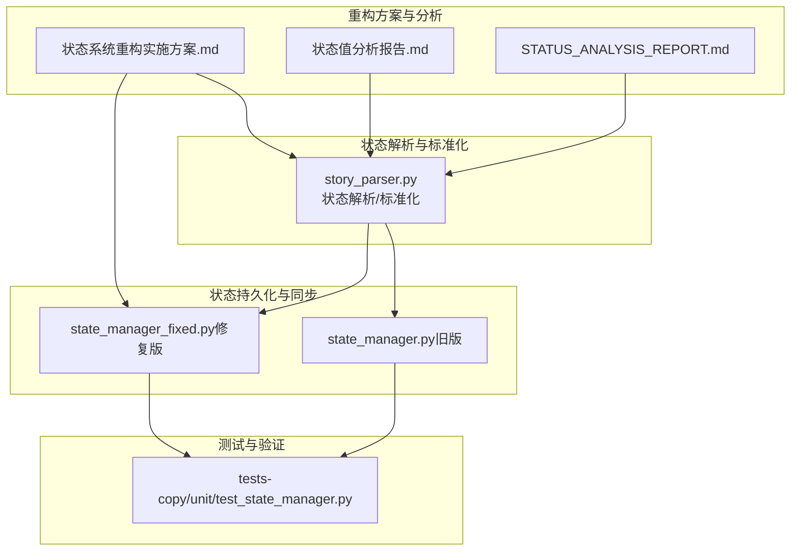
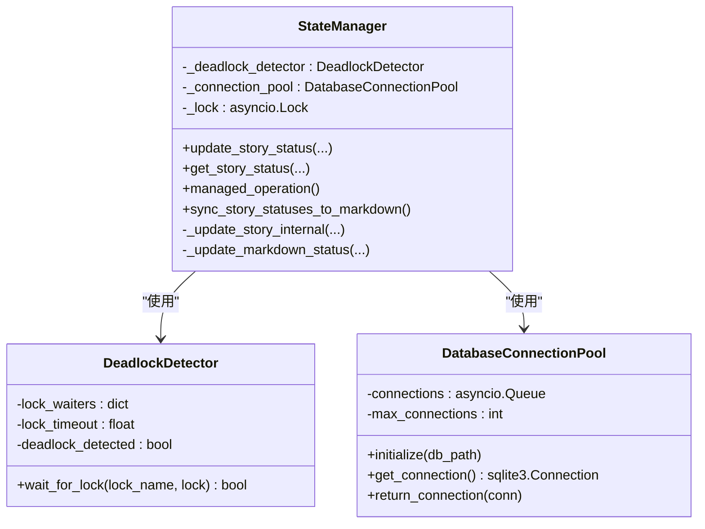
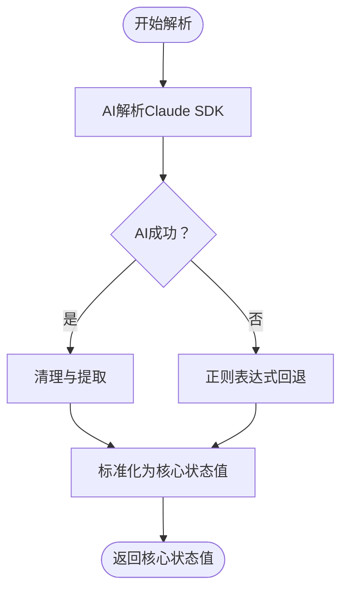
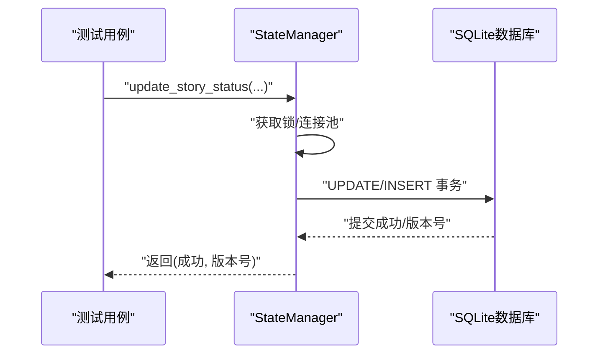
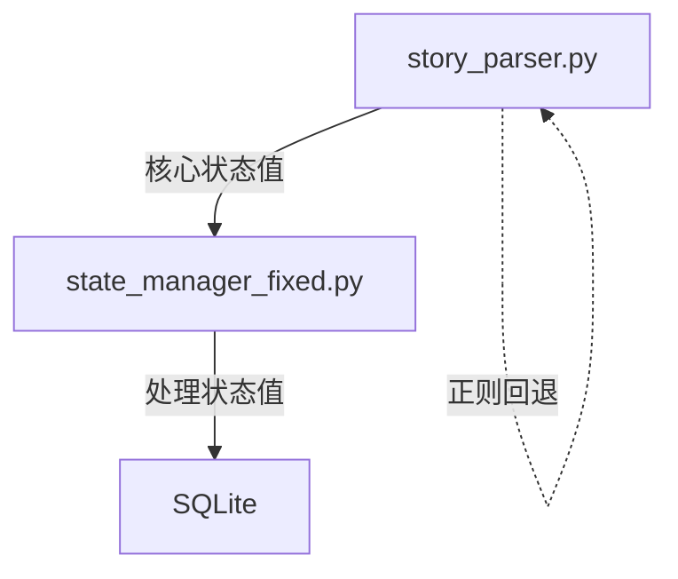

# 状态管理问题

<cite>
**本文引用的文件**
- [状态系统重构实施方案.md](file://状态系统重构实施方案.md)
- [状态值分析报告.md](file://状态值分析报告.md)
- [STATUS_ANALYSIS_REPORT.md](file://STATUS_ANALYSIS_REPORT.md)
- [autoBMAD/epic_automation/state_manager.py](file://autoBMAD/epic_automation/state_manager.py)
- [BUGFIX_20260107/fixed_modules/state_manager_fixed.py](file://BUGFIX_20260107/fixed_modules/state_manager_fixed.py)
- [autoBMAD/epic_automation/story_parser.py](file://autoBMAD/epic_automation/story_parser.py)
- [tests-copy/unit/test_state_manager.py](file://tests-copy/unit/test_state_manager.py)
</cite>

## 目录
1. [简介](#简介)
2. [项目结构](#项目结构)
3. [核心组件](#核心组件)
4. [架构总览](#架构总览)
5. [详细组件分析](#详细组件分析)
6. [依赖分析](#依赖分析)
7. [性能考虑](#性能考虑)
8. [故障排查指南](#故障排查指南)
9. [结论](#结论)
10. [附录](#附录)

## 简介
本文件围绕状态管理模块中的“状态重置、同步延迟、映射错误”三大问题展开，结合《状态值分析报告》与《状态分析报告》，系统梳理 autoBMAD/epic_automation 中状态机转换逻辑的缺陷与修复路径。重点覆盖：
- 问题定位：史诗（epic）与故事（story）状态不一致的根源
- 修复方案：基于 fixed_modules 中的修复版状态管理器，说明状态持久化与事件驱动更新策略
- 验证手段：结合测试用例，展示状态转换的原子性与一致性
- 迁移指南：依据《状态系统重构实施方案》，提供从旧版本平滑升级的步骤与注意事项，并强调通过 story_parser 确保状态解析的准确性

## 项目结构
围绕状态管理的关键文件与职责如下：
- 状态解析与标准化：story_parser.py
- 状态持久化与同步：autoBMAD/epic_automation/state_manager.py（旧版）、BUGFIX_20260107/fixed_modules/state_manager_fixed.py（修复版）
- 状态系统重构方案：状态系统重构实施方案.md
- 状态值与映射关系分析：状态值分析报告.md、STATUS_ANALYSIS_REPORT.md
- 测试验证：tests-copy/unit/test_state_manager.py

图表来源
- [autoBMAD/epic_automation/state_manager.py](file://autoBMAD/epic_automation/state_manager.py#L1-L120)
- [BUGFIX_20260107/fixed_modules/state_manager_fixed.py](file://BUGFIX_20260107/fixed_modules/state_manager_fixed.py#L1-L120)
- [autoBMAD/epic_automation/story_parser.py](file://autoBMAD/epic_automation/story_parser.py#L1-L120)
- [tests-copy/unit/test_state_manager.py](file://tests-copy/unit/test_state_manager.py#L1-L60)
- [状态系统重构实施方案.md](file://状态系统重构实施方案.md#L1-L120)
- [状态值分析报告.md](file://状态值分析报告.md#L1-L120)
- [STATUS_ANALYSIS_REPORT.md](file://STATUS_ANALYSIS_REPORT.md#L1-L60)

章节来源
- [autoBMAD/epic_automation/state_manager.py](file://autoBMAD/epic_automation/state_manager.py#L1-L120)
- [BUGFIX_20260107/fixed_modules/state_manager_fixed.py](file://BUGFIX_20260107/fixed_modules/state_manager_fixed.py#L1-L120)
- [autoBMAD/epic_automation/story_parser.py](file://autoBMAD/epic_automation/story_parser.py#L1-L120)
- [tests-copy/unit/test_state_manager.py](file://tests-copy/unit/test_state_manager.py#L1-L60)
- [状态系统重构实施方案.md](file://状态系统重构实施方案.md#L1-L120)
- [状态值分析报告.md](file://状态值分析报告.md#L1-L120)
- [STATUS_ANALYSIS_REPORT.md](file://STATUS_ANALYSIS_REPORT.md#L1-L60)

## 核心组件
- 状态解析器（story_parser.py）
  - 负责从 Markdown 文档中解析核心状态值，并提供标准化与映射能力
  - 核心状态值与处理状态值的单向映射，确保文档到数据库的单向数据流
- 状态管理器（state_manager.py / state_manager_fixed.py）
  - 负责故事状态的持久化、乐观锁、并发安全与数据库同步
  - 修复版引入死锁检测、连接池、上下文管理器等改进，增强稳定性与性能
- 测试用例（tests-copy/unit/test_state_manager.py）
  - 验证数据库初始化、状态更新、并发操作、错误处理等关键路径

章节来源
- [autoBMAD/epic_automation/story_parser.py](file://autoBMAD/epic_automation/story_parser.py#L1-L120)
- [autoBMAD/epic_automation/state_manager.py](file://autoBMAD/epic_automation/state_manager.py#L1-L120)
- [BUGFIX_20260107/fixed_modules/state_manager_fixed.py](file://BUGFIX_20260107/fixed_modules/state_manager_fixed.py#L1-L120)
- [tests-copy/unit/test_state_manager.py](file://tests-copy/unit/test_state_manager.py#L1-L60)

## 架构总览
状态系统采用“文档 → 核心状态 → 处理状态”的单向数据流，避免循环依赖与状态不一致：
- 文档状态（核心状态值）由 story_parser 解析
- 核心状态值经映射转换为处理状态值，写入数据库
- 状态同步时，从数据库读取处理状态值，再映射为 Markdown 文档状态

图表来源
- [autoBMAD/epic_automation/story_parser.py](file://autoBMAD/epic_automation/story_parser.py#L100-L140)
- [autoBMAD/epic_automation/state_manager.py](file://autoBMAD/epic_automation/state_manager.py#L280-L360)
- [状态系统重构实施方案.md](file://状态系统重构实施方案.md#L180-L260)

章节来源
- [autoBMAD/epic_automation/story_parser.py](file://autoBMAD/epic_automation/story_parser.py#L100-L140)
- [autoBMAD/epic_automation/state_manager.py](file://autoBMAD/epic_automation/state_manager.py#L280-L360)
- [状态系统重构实施方案.md](file://状态系统重构实施方案.md#L180-L260)

## 详细组件分析

### 问题定位与根因
- 史诗与故事状态不一致的根源并非代码 bug，而是状态值本身不符合预期
  - 依据《状态分析报告》，用户观察到的“in progress”显示源于文档中 Status 字段确实为 “In Progress”，且标准化函数与解析流程均正确
  - 结论：无需修复代码，若需改变显示状态，应直接更新文档内容
- 状态值依赖关系与映射
  - 核心状态值（文档显示）与处理状态值（数据库存储）之间存在单向映射
  - Markdown 同步时，数据库状态映射为 Markdown 状态，支持多种格式与自动创建 Status 字段

章节来源
- [STATUS_ANALYSIS_REPORT.md](file://STATUS_ANALYSIS_REPORT.md#L1-L165)
- [状态值分析报告.md](file://状态值分析报告.md#L160-L210)
- [autoBMAD/epic_automation/state_manager.py](file://autoBMAD/epic_automation/state_manager.py#L620-L796)

### 修复版状态管理器（state_manager_fixed.py）关键改进
- 死锁检测与锁管理
  - 引入 DeadlockDetector，等待锁时带超时与死锁检测，避免长时间阻塞
  - managed_operation 上下文管理器确保即使取消也能正确释放锁
- 连接池与数据库性能
  - DatabaseConnectionPool 提供连接池，启用 WAL 模式与同步参数优化，降低锁竞争与提升并发性能
- 状态持久化与乐观锁
  - update_story_status 支持 expected_version 参数，实现乐观锁冲突检测与版本递增
  - _update_story_internal 使用 asyncio.Lock 保护数据库事务，确保原子性
- Markdown 同步策略
  - _update_markdown_status 支持多种 Status 格式，自动创建缺失的 Status 字段，避免映射错误

图表来源
- [BUGFIX_20260107/fixed_modules/state_manager_fixed.py](file://BUGFIX_20260107/fixed_modules/state_manager_fixed.py#L48-L109)
- [BUGFIX_20260107/fixed_modules/state_manager_fixed.py](file://BUGFIX_20260107/fixed_modules/state_manager_fixed.py#L111-L222)
- [BUGFIX_20260107/fixed_modules/state_manager_fixed.py](file://BUGFIX_20260107/fixed_modules/state_manager_fixed.py#L223-L364)

章节来源
- [BUGFIX_20260107/fixed_modules/state_manager_fixed.py](file://BUGFIX_20260107/fixed_modules/state_manager_fixed.py#L48-L109)
- [BUGFIX_20260107/fixed_modules/state_manager_fixed.py](file://BUGFIX_20260107/fixed_modules/state_manager_fixed.py#L111-L222)
- [BUGFIX_20260107/fixed_modules/state_manager_fixed.py](file://BUGFIX_20260107/fixed_modules/state_manager_fixed.py#L223-L364)

### 状态解析与映射（story_parser.py）
- 核心状态值与处理状态值的单向映射
  - 核心状态值：Draft、Ready for Development、In Progress、Ready for Review、Ready for Done、Done、Failed
  - 处理状态值：pending、in_progress、review、completed、failed、cancelled、error
- 解析流程
  - AI 优先：使用 Claude SDK 进行语义解析
  - 正则回退：当 AI 不可用或失败时，使用正则表达式提取并标准化
- 标准化函数
  - _normalize_story_status 将输入规范化为核心状态值，避免大小写与格式差异导致的不一致

图表来源
- [autoBMAD/epic_automation/story_parser.py](file://autoBMAD/epic_automation/story_parser.py#L234-L317)
- [autoBMAD/epic_automation/story_parser.py](file://autoBMAD/epic_automation/story_parser.py#L318-L362)
- [autoBMAD/epic_automation/story_parser.py](file://autoBMAD/epic_automation/story_parser.py#L424-L484)

章节来源
- [autoBMAD/epic_automation/story_parser.py](file://autoBMAD/epic_automation/story_parser.py#L234-L317)
- [autoBMAD/epic_automation/story_parser.py](file://autoBMAD/epic_automation/story_parser.py#L318-L362)
- [autoBMAD/epic_automation/story_parser.py](file://autoBMAD/epic_automation/story_parser.py#L424-L484)

### 状态转换与同步流程（基于测试用例）
- 单元测试覆盖
  - 初始化数据库与表结构
  - 新增故事、更新状态、按状态查询、记录 QA 结果与错误、迭代计数、并发操作等
- 原子性与一致性
  - 通过 asyncio.Lock 与事务提交保障状态更新的原子性
  - 乐观锁版本号校验避免并发写入冲突

图表来源
- [tests-copy/unit/test_state_manager.py](file://tests-copy/unit/test_state_manager.py#L77-L118)
- [tests-copy/unit/test_state_manager.py](file://tests-copy/unit/test_state_manager.py#L233-L249)
- [autoBMAD/epic_automation/state_manager.py](file://autoBMAD/epic_automation/state_manager.py#L203-L261)

章节来源
- [tests-copy/unit/test_state_manager.py](file://tests-copy/unit/test_state_manager.py#L77-L118)
- [tests-copy/unit/test_state_manager.py](file://tests-copy/unit/test_state_manager.py#L233-L249)
- [autoBMAD/epic_automation/state_manager.py](file://autoBMAD/epic_automation/state_manager.py#L203-L261)

### 修复版状态管理器的同步与映射
- Markdown 同步
  - 支持多种 Status 格式，自动创建缺失字段，避免映射错误
  - 单向映射：数据库处理状态 → Markdown 核心状态
- 死锁与并发
  - 等待锁带超时，取消时释放锁，避免资源泄漏
  - 连接池减少锁竞争，提升吞吐

章节来源
- [BUGFIX_20260107/fixed_modules/state_manager_fixed.py](file://BUGFIX_20260107/fixed_modules/state_manager_fixed.py#L385-L419)
- [BUGFIX_20260107/fixed_modules/state_manager_fixed.py](file://BUGFIX_20260107/fixed_modules/state_manager_fixed.py#L556-L625)
- [autoBMAD/epic_automation/state_manager.py](file://autoBMAD/epic_automation/state_manager.py#L627-L796)

## 依赖分析
- 组件耦合与内聚
  - story_parser 与 state_manager 通过“核心状态值 → 处理状态值”的单向映射解耦
  - 修复版 state_manager_fixed 通过连接池与死锁检测提升内聚与稳定性
- 外部依赖
  - SQLite 作为本地持久化存储
  - Claude SDK 用于状态解析（可回退至正则）

图表来源
- [autoBMAD/epic_automation/story_parser.py](file://autoBMAD/epic_automation/story_parser.py#L100-L140)
- [BUGFIX_20260107/fixed_modules/state_manager_fixed.py](file://BUGFIX_20260107/fixed_modules/state_manager_fixed.py#L223-L364)

章节来源
- [autoBMAD/epic_automation/story_parser.py](file://autoBMAD/epic_automation/story_parser.py#L100-L140)
- [BUGFIX_20260107/fixed_modules/state_manager_fixed.py](file://BUGFIX_20260107/fixed_modules/state_manager_fixed.py#L223-L364)

## 性能考虑
- 连接池与 WAL 模式
  - 修复版启用 WAL 模式与同步参数，降低锁竞争，提升并发读写性能
- 锁管理与超时
  - 死锁检测与超时等待避免长时间阻塞，提升系统可用性
- 状态更新的原子性
  - 事务与乐观锁确保并发场景下的数据一致性

章节来源
- [BUGFIX_20260107/fixed_modules/state_manager_fixed.py](file://BUGFIX_20260107/fixed_modules/state_manager_fixed.py#L77-L109)
- [BUGFIX_20260107/fixed_modules/state_manager_fixed.py](file://BUGFIX_20260107/fixed_modules/state_manager_fixed.py#L223-L364)

## 故障排查指南
- 常见问题与定位
  - 状态显示不一致：检查文档 Status 字段格式与标准化函数是否正确
  - 并发写入冲突：确认乐观锁版本号与 expected_version 参数是否正确传递
  - 死锁或超时：查看死锁检测日志与锁等待超时配置
- 日志与诊断
  - 修复版状态管理器记录详细的错误与调试信息，便于定位问题
  - 健康状态接口可用于快速检查数据库与锁状态

章节来源
- [autoBMAD/epic_automation/state_manager.py](file://autoBMAD/epic_automation/state_manager.py#L605-L626)
- [BUGFIX_20260107/fixed_modules/state_manager_fixed.py](file://BUGFIX_20260107/fixed_modules/state_manager_fixed.py#L627-L646)

## 结论
- 问题本质：史诗与故事状态不一致并非代码缺陷，而是文档状态值本身不符合预期
- 修复重点：通过修复版状态管理器强化并发安全、乐观锁与数据库性能；通过 story_parser 确保状态解析的准确性与一致性
- 验证手段：单元测试覆盖初始化、更新、并发与错误处理，确保状态转换的原子性与一致性
- 迁移建议：依据重构方案逐步统一状态值体系，采用单向映射与事件驱动更新策略，避免循环依赖

## 附录

### 迁移指南（基于《状态系统重构实施方案》）
- 阶段一：核心重构
  - 统一 ProcessingStatus 枚举，移除双向映射与反向转换函数
  - 重构 _normalize_story_status，确保只处理核心状态值
  - 更新 QA 工具使用 ProcessingStatus，消除独立 QA 状态系统
- 阶段二：Agent 调整
  - 开发/QA/SM Agent 基于核心状态值进行业务判断，数据库更新使用处理状态值
  - 移除对 QAResult 的依赖，统一状态处理流程
- 阶段三：测试验证
  - 更新单元测试与集成测试，覆盖状态转换、数据库操作与端到端流程
- 阶段四：部署上线
  - 直接部署新版本，无需数据迁移与回滚机制

章节来源
- [状态系统重构实施方案.md](file://状态系统重构实施方案.md#L1-L120)
- [状态系统重构实施方案.md](file://状态系统重构实施方案.md#L180-L260)
- [状态系统重构实施方案.md](file://状态系统重构实施方案.md#L274-L353)
- [状态系统重构实施方案.md](file://状态系统重构实施方案.md#L354-L465)
- [状态系统重构实施方案.md](file://状态系统重构实施方案.md#L466-L772)
- [状态系统重构实施方案.md](file://状态系统重构实施方案.md#L774-L800)

### 通过 story_parser 确保状态解析准确性
- 使用 AI 优先策略与正则回退，保证在不同格式与语言环境下稳定提取核心状态值
- 标准化函数确保大小写与格式差异不影响后续映射与存储

章节来源
- [autoBMAD/epic_automation/story_parser.py](file://autoBMAD/epic_automation/story_parser.py#L234-L317)
- [autoBMAD/epic_automation/story_parser.py](file://autoBMAD/epic_automation/story_parser.py#L318-L362)
- [autoBMAD/epic_automation/story_parser.py](file://autoBMAD/epic_automation/story_parser.py#L424-L484)