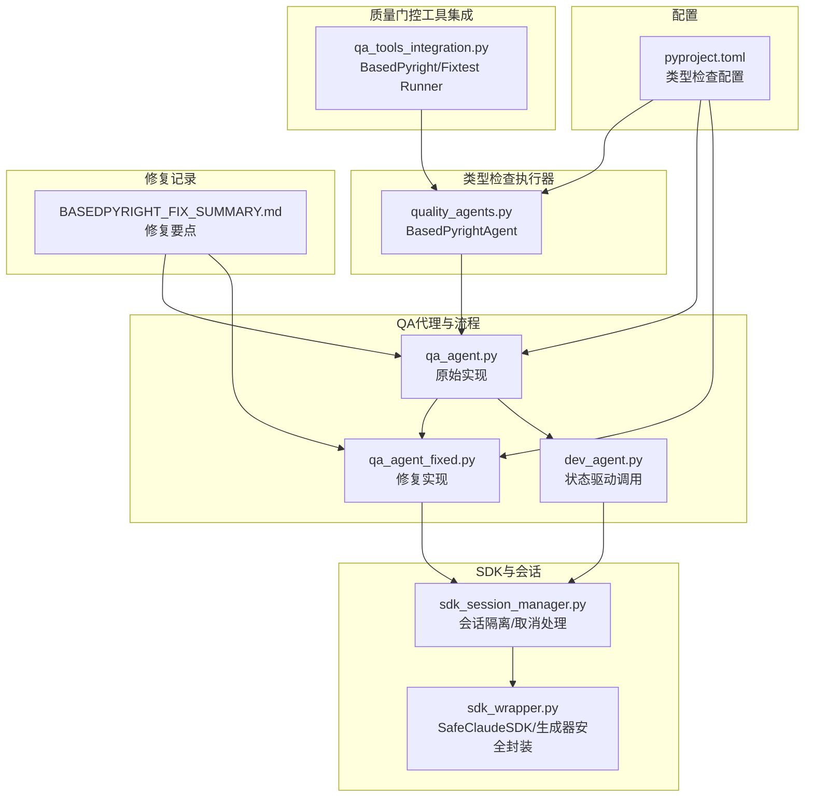
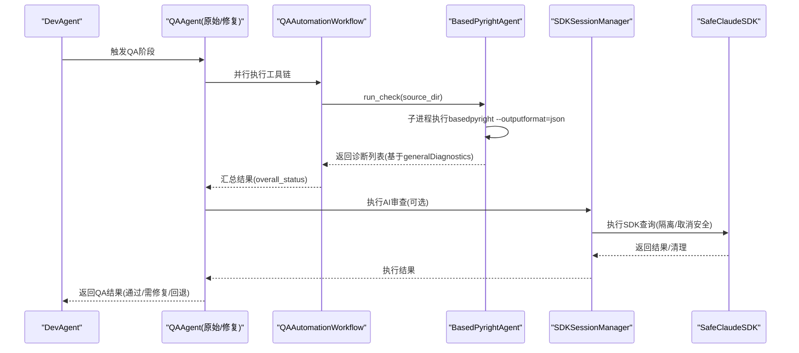
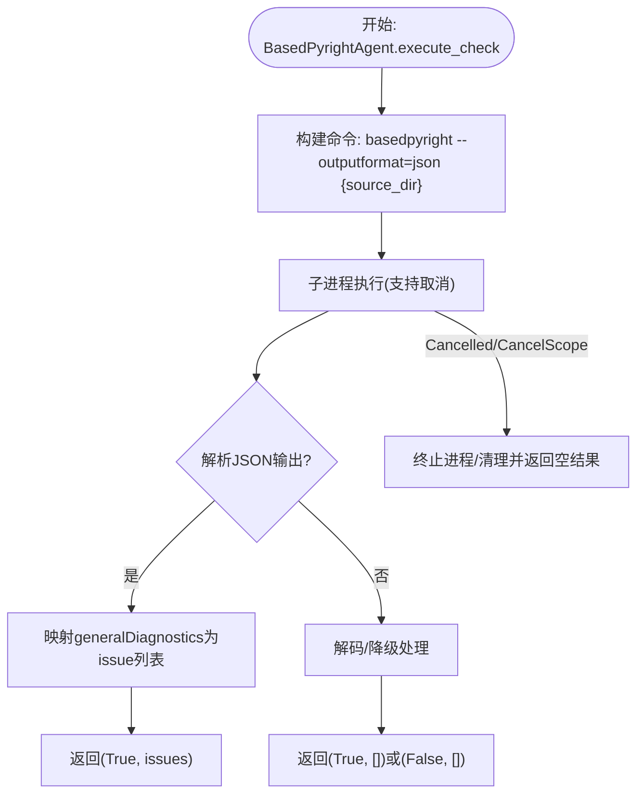
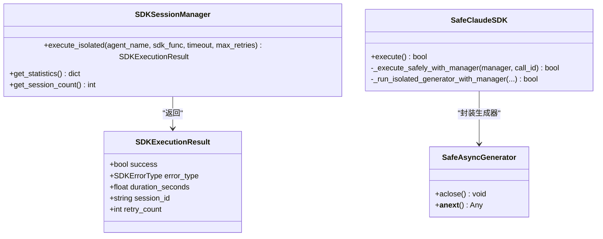
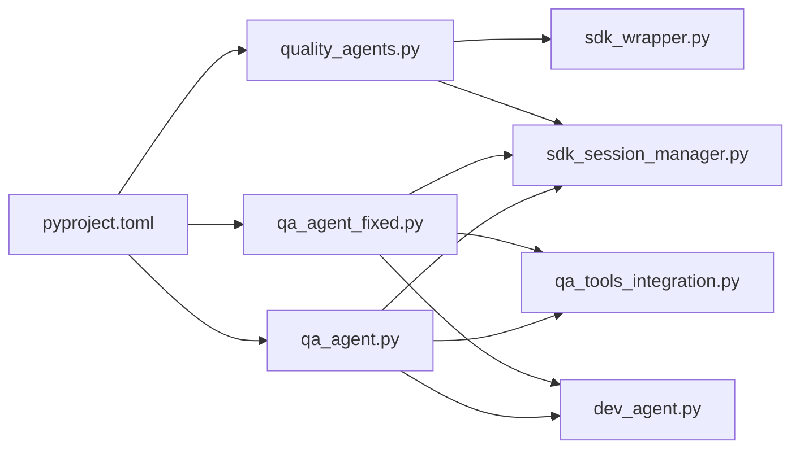

# BasedPyright类型检查失败分析

<cite>
**本文引用的文件**
- [qa_agent.py](file://autoBMAD/epic_automation/qa_agent.py)
- [qa_agent_fixed.py](file://BUGFIX_20260107/fixed_modules/qa_agent_fixed.py)
- [quality_agents.py](file://autoBMAD/epic_automation/quality_agents.py)
- [qa_tools_integration.py](file://autoBMAD/epic_automation/qa_tools_integration.py)
- [BASEDPYRIGHT_FIX_SUMMARY.md](file://BASEDPYRIGHT_FIX_SUMMARY.md)
- [pyproject.toml](file://pyproject.toml)
- [sdk_session_manager.py](file://autoBMAD/epic_automation/sdk_session_manager.py)
- [sdk_wrapper.py](file://autoBMAD/epic_automation/sdk_wrapper.py)
- [dev_agent.py](file://autoBMAD/epic_automation/dev_agent.py)
</cite>

## 目录
1. [简介](#简介)
2. [项目结构](#项目结构)
3. [核心组件](#核心组件)
4. [架构总览](#架构总览)
5. [详细组件分析](#详细组件分析)
6. [依赖关系分析](#依赖关系分析)
7. [性能考量](#性能考量)
8. [故障排查指南](#故障排查指南)
9. [结论](#结论)
10. [附录](#附录)

## 简介
本文件聚焦于“BasedPyright类型检查失败”的根本原因分析，结合修复记录与代码实现，系统梳理以下方面：
- 类型不匹配、未定义变量、可选类型处理不当等常见问题
- 基于`BASEDPYRIGHT_FIX_SUMMARY.md`的修复要点与对比`qa_agent.py`原始实现与`qa_agent_fixed.py`的改进逻辑
- `quality_agents.py`中类型检查的执行流程、超时处理与错误解析机制
- 实际错误模式与修复方法示例
- 针对`pyproject.toml`中类型检查配置的优化建议

## 项目结构
围绕质量门控与类型检查的关键模块如下：
- 质量门控工具集成：qa_tools_integration.py
- 类型检查执行器：quality_agents.py（BasedPyrightAgent）
- QA代理与流程：qa_agent.py、qa_agent_fixed.py
- SDK会话与安全封装：sdk_session_manager.py、sdk_wrapper.py
- 项目配置：pyproject.toml
- 修复记录：BASEDPYRIGHT_FIX_SUMMARY.md

图表来源
- [qa_tools_integration.py](file://autoBMAD/epic_automation/qa_tools_integration.py#L1-L200)
- [quality_agents.py](file://autoBMAD/epic_automation/quality_agents.py#L565-L760)
- [qa_agent.py](file://autoBMAD/epic_automation/qa_agent.py#L330-L495)
- [qa_agent_fixed.py](file://BUGFIX_20260107/fixed_modules/qa_agent_fixed.py#L138-L290)
- [dev_agent.py](file://autoBMAD/epic_automation/dev_agent.py#L651-L700)
- [sdk_session_manager.py](file://autoBMAD/epic_automation/sdk_session_manager.py#L244-L341)
- [sdk_wrapper.py](file://autoBMAD/epic_automation/sdk_wrapper.py#L495-L688)
- [pyproject.toml](file://pyproject.toml#L1-L110)
- [BASEDPYRIGHT_FIX_SUMMARY.md](file://BASEDPYRIGHT_FIX_SUMMARY.md#L1-L132)

章节来源
- [qa_tools_integration.py](file://autoBMAD/epic_automation/qa_tools_integration.py#L1-L200)
- [quality_agents.py](file://autoBMAD/epic_automation/quality_agents.py#L565-L760)
- [qa_agent.py](file://autoBMAD/epic_automation/qa_agent.py#L330-L495)
- [qa_agent_fixed.py](file://BUGFIX_20260107/fixed_modules/qa_agent_fixed.py#L138-L290)
- [dev_agent.py](file://autoBMAD/epic_automation/dev_agent.py#L651-L700)
- [sdk_session_manager.py](file://autoBMAD/epic_automation/sdk_session_manager.py#L244-L341)
- [sdk_wrapper.py](file://autoBMAD/epic_automation/sdk_wrapper.py#L495-L688)
- [pyproject.toml](file://pyproject.toml#L1-L110)
- [BASEDPYRIGHT_FIX_SUMMARY.md](file://BASEDPYRIGHT_FIX_SUMMARY.md#L1-L132)

## 核心组件
- BasedPyrightAgent：基于子进程执行基于JSON输出的类型检查，解析诊断并交给父类统一的修复流程
- QAAutomationWorkflow：并行运行BasedPyright与Fixtest，汇总整体状态
- QAAgent（原始/修复版）：状态驱动的QA执行，结合工具链结果决定是否通过或回退
- SDKSessionManager/SafeClaudeSDK：隔离SDK调用，屏蔽取消传播，保障生成器清理与结果判定
- pyproject.toml：定义类型检查工具与规则（mypy、ruff等）

章节来源
- [quality_agents.py](file://autoBMAD/epic_automation/quality_agents.py#L565-L760)
- [qa_tools_integration.py](file://autoBMAD/epic_automation/qa_tools_integration.py#L583-L741)
- [qa_agent.py](file://autoBMAD/epic_automation/qa_agent.py#L330-L495)
- [qa_agent_fixed.py](file://BUGFIX_20260107/fixed_modules/qa_agent_fixed.py#L138-L290)
- [sdk_session_manager.py](file://autoBMAD/epic_automation/sdk_session_manager.py#L244-L341)
- [sdk_wrapper.py](file://autoBMAD/epic_automation/sdk_wrapper.py#L495-L688)
- [pyproject.toml](file://pyproject.toml#L1-L110)

## 架构总览
BasedPyright类型检查在质量门控中的端到端流程如下：

图表来源
- [qa_agent.py](file://autoBMAD/epic_automation/qa_agent.py#L222-L319)
- [qa_agent_fixed.py](file://BUGFIX_20260107/fixed_modules/qa_agent_fixed.py#L138-L290)
- [qa_tools_integration.py](file://autoBMAD/epic_automation/qa_tools_integration.py#L607-L741)
- [quality_agents.py](file://autoBMAD/epic_automation/quality_agents.py#L565-L760)
- [sdk_session_manager.py](file://autoBMAD/epic_automation/sdk_session_manager.py#L244-L341)
- [sdk_wrapper.py](file://autoBMAD/epic_automation/sdk_wrapper.py#L495-L688)

## 详细组件分析

### 基于Pyright修复记录与对比分析
- 未定义属性：`DevAgent`缺少`_current_story_path`属性导致类型检查报错
- 返回类型不匹配：`QAAgent._execute_qa_review`在while循环后可能无返回，导致类型检查失败
- 修复策略：
  - 在`DevAgent.__init__`中初始化`_current_story_path = None`
  - 在`QAAgent._execute_qa_review`末尾添加默认返回，确保所有路径都有返回值

章节来源
- [BASEDPYRIGHT_FIX_SUMMARY.md](file://BASEDPYRIGHT_FIX_SUMMARY.md#L1-L132)
- [dev_agent.py](file://autoBMAD/epic_automation/dev_agent.py#L70-L85)
- [qa_agent.py](file://autoBMAD/epic_automation/qa_agent.py#L360-L456)

### 原始实现与修复实现对比（qa_agent.py vs qa_agent_fixed.py）
- 原始实现（qa_agent.py）：
  - 异步流程复杂，状态驱动审查与回退逻辑在一处，存在潜在分支遗漏
  - 对取消传播与SDK清理的处理较为分散
- 修复实现（qa_agent_fixed.py）：
  - 明确的重试机制与指数退避
  - 统一的QAResult数据结构，包含gate_paths、fallback_review等字段
  - 更清晰的错误分类与回退路径
  - 与SDKSessionManager集成，显式设置超时与重试策略

章节来源
- [qa_agent.py](file://autoBMAD/epic_automation/qa_agent.py#L330-L495)
- [qa_agent_fixed.py](file://BUGFIX_20260107/fixed_modules/qa_agent_fixed.py#L138-L290)
- [sdk_session_manager.py](file://autoBMAD/epic_automation/sdk_session_manager.py#L244-L341)

### quality_agents.py中BasedPyrightAgent的执行流程与错误解析
- 基于子进程执行`basedpyright --outputformat=json`，捕获stdout/stderr并解析为诊断列表
- 从JSON响应中提取`generalDiagnostics`，映射为统一的issue结构（file、line、column、severity、message、rule等）
- 对取消传播与异常进行抑制与清理，避免取消scope错误影响上层流程
- 与父类统一的修复流程协作，将诊断交给SDK生成修复建议

图表来源
- [quality_agents.py](file://autoBMAD/epic_automation/quality_agents.py#L581-L696)

章节来源
- [quality_agents.py](file://autoBMAD/epic_automation/quality_agents.py#L581-L696)

### SDK会话管理与取消处理（SDKSessionManager、SafeClaudeSDK）
- SDKSessionManager：
  - 移除外部超时包装，避免与anyio取消scope冲突
  - 统一错误类型分类（TIMEOUT、CANCELLED、SDK_ERROR、SESSION_ERROR等）
  - 记录会话健康度，支持恢复与统计
- SafeClaudeSDK：
  - 将异步生成器封装为SafeAsyncGenerator，确保清理过程不抛出未处理异常
  - 通过消息跟踪器实时输出进度，避免长时间无输出导致的误解
  - 与取消管理器集成，区分“取消后成功”与“真正取消”

图表来源
- [sdk_session_manager.py](file://autoBMAD/epic_automation/sdk_session_manager.py#L244-L341)
- [sdk_wrapper.py](file://autoBMAD/epic_automation/sdk_wrapper.py#L495-L688)

章节来源
- [sdk_session_manager.py](file://autoBMAD/epic_automation/sdk_session_manager.py#L244-L341)
- [sdk_wrapper.py](file://autoBMAD/epic_automation/sdk_wrapper.py#L495-L688)

### QA工具链集成（QAAutomationWorkflow）
- 并行运行BasedPyright与Fixtest，分别统计错误/失败/错误数量
- 基于ProcessingStatus聚合整体状态（WAIVED/PASS/CONCERNS/FAIL）
- 输出人类可读摘要与改进建议

章节来源
- [qa_tools_integration.py](file://autoBMAD/epic_automation/qa_tools_integration.py#L583-L741)

## 依赖关系分析
- 原始实现（qa_agent.py）依赖：
  - qa_tools_integration：工具链运行与结果汇总
  - sdk_session_manager：隔离SDK调用
  - dev_agent：状态驱动的QA触发
- 修复实现（qa_agent_fixed.py）依赖：
  - 同上，但更强调重试、回退与QAResult结构化输出
- quality_agents.py：
  - 基于子进程的类型检查与SDK修复流程
  - 与pyproject.toml中的类型检查配置协同

图表来源
- [qa_agent.py](file://autoBMAD/epic_automation/qa_agent.py#L222-L319)
- [qa_agent_fixed.py](file://BUGFIX_20260107/fixed_modules/qa_agent_fixed.py#L138-L290)
- [qa_tools_integration.py](file://autoBMAD/epic_automation/qa_tools_integration.py#L583-L741)
- [sdk_session_manager.py](file://autoBMAD/epic_automation/sdk_session_manager.py#L244-L341)
- [sdk_wrapper.py](file://autoBMAD/epic_automation/sdk_wrapper.py#L495-L688)
- [dev_agent.py](file://autoBMAD/epic_automation/dev_agent.py#L651-L700)
- [pyproject.toml](file://pyproject.toml#L1-L110)

章节来源
- [qa_agent.py](file://autoBMAD/epic_automation/qa_agent.py#L222-L319)
- [qa_agent_fixed.py](file://BUGFIX_20260107/fixed_modules/qa_agent_fixed.py#L138-L290)
- [qa_tools_integration.py](file://autoBMAD/epic_automation/qa_tools_integration.py#L583-L741)
- [sdk_session_manager.py](file://autoBMAD/epic_automation/sdk_session_manager.py#L244-L341)
- [sdk_wrapper.py](file://autoBMAD/epic_automation/sdk_wrapper.py#L495-L688)
- [dev_agent.py](file://autoBMAD/epic_automation/dev_agent.py#L651-L700)
- [pyproject.toml](file://pyproject.toml#L1-L110)

## 性能考量
- 子进程隔离与取消安全：通过子进程与异步shield避免取消scope传播，减少任务泄漏风险
- 生成器安全封装：确保SDK生成器在取消时也能正确清理，避免资源泄露
- 重试与指数退避：在工具链失败时降低压力，提高成功率
- 日志与消息跟踪：实时输出有助于定位问题，避免长时间无响应

章节来源
- [quality_agents.py](file://autoBMAD/epic_automation/quality_agents.py#L581-L696)
- [sdk_session_manager.py](file://autoBMAD/epic_automation/sdk_session_manager.py#L244-L341)
- [sdk_wrapper.py](file://autoBMAD/epic_automation/sdk_wrapper.py#L495-L688)
- [qa_agent_fixed.py](file://BUGFIX_20260107/fixed_modules/qa_agent_fixed.py#L138-L290)

## 故障排查指南
- 类型不匹配/未定义变量
  - 现象：BasedPyRight报告属性未定义或返回类型不匹配
  - 排查：确认类初始化是否包含缺失属性；检查函数所有分支是否返回一致类型
  - 参考修复：为`DevAgent`添加`_current_story_path`；为`QAAgent._execute_qa_review`补充默认返回
- 可选类型处理不当
  - 现象：Optional/Union类型未显式标注，导致类型检查失败
  - 排查：为变量、参数与返回值添加明确类型注解；使用`|`或`Union`/`Optional`统一风格
- 取消传播与SDK清理
  - 现象：取消scope错误导致崩溃或清理异常
  - 排查：使用SDKSessionManager隔离执行；通过SafeAsyncGenerator确保清理
- 工具链输出解析
  - 现象：JSON解析失败或输出编码异常
  - 排查：增加降级解码策略；对stdout/stderr进行安全decode；捕获TimeoutExpired并清理进程

章节来源
- [BASEDPYRIGHT_FIX_SUMMARY.md](file://BASEDPYRIGHT_FIX_SUMMARY.md#L1-L132)
- [qa_agent.py](file://autoBMAD/epic_automation/qa_agent.py#L330-L495)
- [qa_agent_fixed.py](file://BUGFIX_20260107/fixed_modules/qa_agent_fixed.py#L138-L290)
- [quality_agents.py](file://autoBMAD/epic_automation/quality_agents.py#L581-L696)
- [sdk_session_manager.py](file://autoBMAD/epic_automation/sdk_session_manager.py#L244-L341)
- [sdk_wrapper.py](file://autoBMAD/epic_automation/sdk_wrapper.py#L495-L688)

## 结论
- BasedPyright类型检查失败多源于类型注解不完整与控制流分支遗漏
- 通过明确的初始化与返回路径修复，可显著提升类型检查通过率
- 基于子进程的类型检查与SDK安全封装，配合会话隔离与生成器清理，能有效规避取消传播与资源泄露
- 建议在项目配置中完善类型检查规则，结合工具链并行执行与回退策略，形成稳健的质量门控体系

## 附录

### 实际错误模式与修复方法示例（路径指引）
- 未定义属性（DevAgent）
  - 修复位置：[dev_agent.py](file://autoBMAD/epic_automation/dev_agent.py#L70-L85)
  - 修复要点：在`__init__`中初始化`_current_story_path = None`
- 返回类型不匹配（QAAgent）
  - 修复位置：[qa_agent.py](file://autoBMAD/epic_automation/qa_agent.py#L360-L456)
  - 修复要点：在while循环结束后添加默认返回，确保所有路径都有返回值
- 取消传播与SDK清理
  - 修复位置：[sdk_session_manager.py](file://autoBMAD/epic_automation/sdk_session_manager.py#L244-L341)
  - 修复要点：移除外部超时包装，统一错误类型；记录健康度与统计
  - 修复位置：[sdk_wrapper.py](file://autoBMAD/epic_automation/sdk_wrapper.py#L495-L688)
  - 修复要点：SafeAsyncGenerator确保清理过程不抛异常

章节来源
- [BASEDPYRIGHT_FIX_SUMMARY.md](file://BASEDPYRIGHT_FIX_SUMMARY.md#L1-L132)
- [dev_agent.py](file://autoBMAD/epic_automation/dev_agent.py#L70-L85)
- [qa_agent.py](file://autoBMAD/epic_automation/qa_agent.py#L360-L456)
- [sdk_session_manager.py](file://autoBMAD/epic_automation/sdk_session_manager.py#L244-L341)
- [sdk_wrapper.py](file://autoBMAD/epic_automation/sdk_wrapper.py#L495-L688)

### pyproject.toml中类型检查配置优化建议
- 当前配置要点
  - mypy启用：`warn_return_any=true`、`warn_unused_configs=true`、`disallow_untyped_defs=true`
  - ruff配置：行宽、目标版本、lint规则与忽略项
- 建议优化
  - 明确mypy目标版本与严格级别，避免宽松规则掩盖问题
  - 在mypy中开启`strict`或`strict_optional`，强化可选类型检查
  - 为特定文件或包添加per-file-ignore，减少噪音同时保留关键检查
  - 与基于子进程的类型检查工具（如BasedPyright）并行，互补发现不同类型的错误

章节来源
- [pyproject.toml](file://pyproject.toml#L1-L110)
- [quality_agents.py](file://autoBMAD/epic_automation/quality_agents.py#L581-L696)