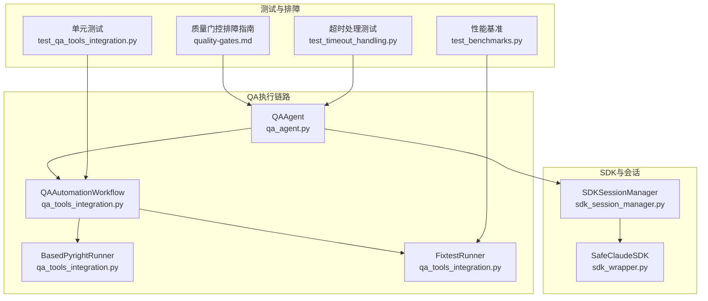
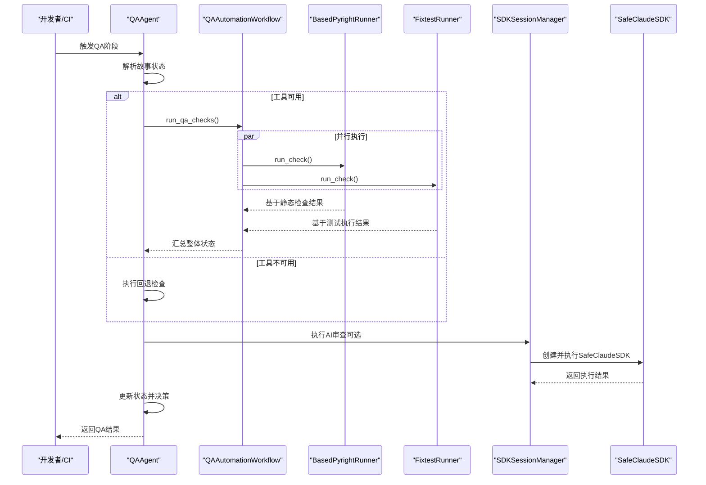
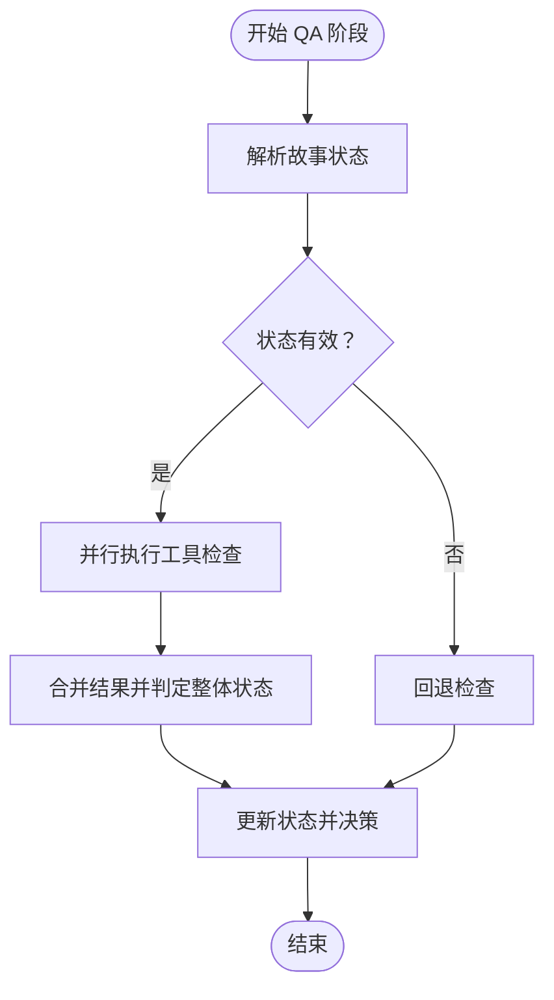
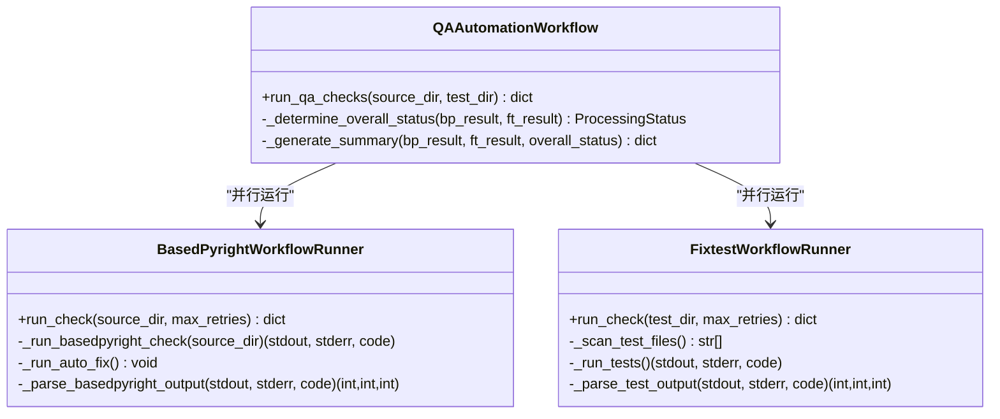
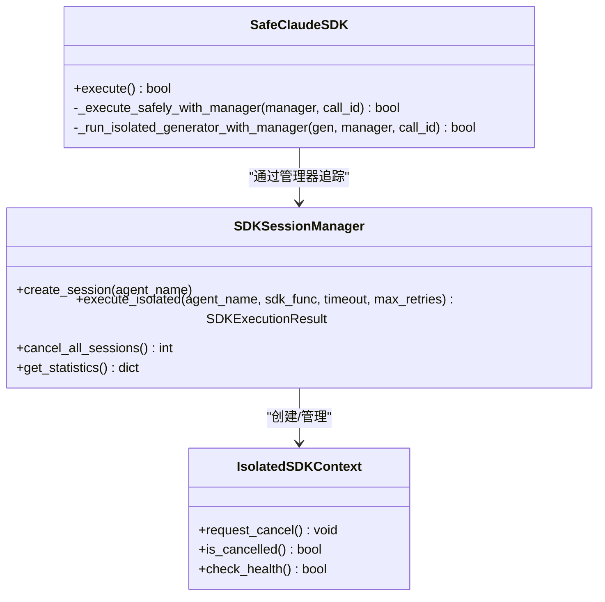
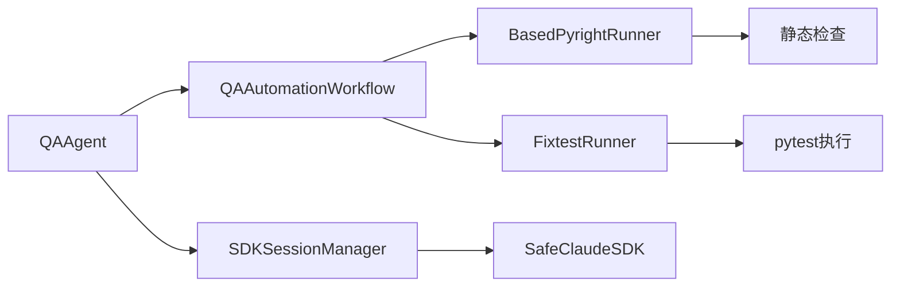

# Pytest测试失败分析

<cite>
**本文引用的文件**
- [qa_agent.py](file://autoBMAD/epic_automation/qa_agent.py)
- [qa_tools_integration.py](file://autoBMAD/epic_automation/qa_tools_integration.py)
- [sdk_session_manager.py](file://autoBMAD/epic_automation/sdk_session_manager.py)
- [sdk_wrapper.py](file://autoBMAD/epic_automation/sdk_wrapper.py)
- [test_qa_tools_integration.py](file://tests-copy/unit/test_qa_tools_integration.py)
- [quality-gates.md](file://docs-copy/troubleshooting/quality-gates.md)
- [test_benchmarks.py](file://tests-copy/performance/test_benchmarks.py)
- [test_timeout_handling.py](file://BUGFIX_20260107/tests/test_timeout_handling.py)
</cite>

## 目录
1. [引言](#引言)
2. [项目结构](#项目结构)
3. [核心组件](#核心组件)
4. [架构总览](#架构总览)
5. [详细组件分析](#详细组件分析)
6. [依赖关系分析](#依赖关系分析)
7. [性能考量](#性能考量)
8. [故障排查指南](#故障排查指南)
9. [结论](#结论)
10. [附录](#附录)

## 引言
本文件系统性分析Pytest质量门控失败的典型场景与诊断路径，围绕以下目标展开：
- 单元测试失败、覆盖率不足、超时中断、断言错误的识别与处置
- 基于qa_agent.py的测试执行逻辑，说明测试用例发现、执行调度与结果收集的完整流程
- 结合tests-copy/unit/test_qa_tools_integration.py中的集成测试，演示如何模拟测试失败并验证修复效果
- 详解qa_tools_integration.py中测试环境准备与依赖注入机制
- 提供测试失败诊断路径、日志解读方法与常见问题解决方案

## 项目结构
本仓库将质量门控相关能力拆分为多个模块：
- QA代理与状态解析：qa_agent.py
- 工具集成与并行执行：qa_tools_integration.py
- SDK会话与取消管理：sdk_session_manager.py、sdk_wrapper.py
- 单元测试与基准测试：tests-copy/unit/test_qa_tools_integration.py、tests-copy/performance/test_benchmarks.py
- 质量门控排障指南：docs-copy/troubleshooting/quality-gates.md
- 超时处理专项测试：BUGFIX_20260107/tests/test_timeout_handling.py

图表来源
- [qa_agent.py](file://autoBMAD/epic_automation/qa_agent.py#L222-L359)
- [qa_tools_integration.py](file://autoBMAD/epic_automation/qa_tools_integration.py#L583-L741)
- [sdk_session_manager.py](file://autoBMAD/epic_automation/sdk_session_manager.py#L193-L342)
- [sdk_wrapper.py](file://autoBMAD/epic_automation/sdk_wrapper.py#L300-L688)
- [test_qa_tools_integration.py](file://tests-copy/unit/test_qa_tools_integration.py#L1-L184)
- [quality-gates.md](file://docs-copy/troubleshooting/quality-gates.md#L464-L660)
- [test_benchmarks.py](file://tests-copy/performance/test_benchmarks.py#L218-L252)
- [test_timeout_handling.py](file://BUGFIX_20260107/tests/test_timeout_handling.py#L481-L552)

章节来源
- [qa_agent.py](file://autoBMAD/epic_automation/qa_agent.py#L222-L359)
- [qa_tools_integration.py](file://autoBMAD/epic_automation/qa_tools_integration.py#L583-L741)

## 核心组件
- QAAgent：负责故事状态解析、QA阶段执行、状态更新与业务决策；封装AI驱动的QA审查与回退审查流程。
- QAAutomationWorkflow：并行运行BasedPyright与Fixtest两类工具，汇总整体质量门控状态。
- BasedPyrightWorkflowRunner/FixtestWorkflowRunner：分别对接静态检查与测试执行，内置超时保护与自动修复/扫描逻辑。
- SDKSessionManager/SafeClaudeSDK：提供隔离的SDK会话、统一的取消管理与安全的异步生成器清理，避免cancel scope跨任务错误。

章节来源
- [qa_agent.py](file://autoBMAD/epic_automation/qa_agent.py#L109-L359)
- [qa_tools_integration.py](file://autoBMAD/epic_automation/qa_tools_integration.py#L27-L146)
- [sdk_session_manager.py](file://autoBMAD/epic_automation/sdk_session_manager.py#L193-L342)
- [sdk_wrapper.py](file://autoBMAD/epic_automation/sdk_wrapper.py#L300-L688)

## 架构总览
质量门控的整体流程如下：
- QAAgent解析故事状态，决定是否进入QA阶段
- 若工具可用，则并行执行BasedPyright与Fixtest
- 基于两类工具结果综合判定整体状态（PASS/CONCERNS/FAIL/WAIVED）
- 若工具不可用或出现异常，执行回退检查
- 将最终状态写入状态管理器，并据此做出业务决策

图表来源
- [qa_agent.py](file://autoBMAD/epic_automation/qa_agent.py#L222-L359)
- [qa_tools_integration.py](file://autoBMAD/epic_automation/qa_tools_integration.py#L607-L741)
- [sdk_session_manager.py](file://autoBMAD/epic_automation/sdk_session_manager.py#L244-L342)
- [sdk_wrapper.py](file://autoBMAD/epic_automation/sdk_wrapper.py#L495-L688)

## 详细组件分析

### QA代理与测试执行流程
- 故事状态解析：优先使用AI解析，失败则回退正则匹配
- QA阶段执行：调用QAAutomationWorkflow并行运行两类工具，根据整体状态更新故事处理状态
- 回退审查：当工具不可用或异常时，执行基础检查（文件存在性、目录结构等）
- 会话管理：通过SDKSessionManager隔离SDK调用，避免cancel scope跨任务传播

图表来源
- [qa_agent.py](file://autoBMAD/epic_automation/qa_agent.py#L222-L359)

章节来源
- [qa_agent.py](file://autoBMAD/epic_automation/qa_agent.py#L163-L221)
- [qa_agent.py](file://autoBMAD/epic_automation/qa_agent.py#L222-L359)
- [qa_agent.py](file://autoBMAD/epic_automation/qa_agent.py#L611-L668)

### 工具集成与并行执行
- QAAutomationWorkflow并行启动BasedPyright与Fixtest，聚合结果并生成摘要
- 基于静态检查与测试执行结果，按WAIVED/PASS/CONCERNS/FAIL规则合成整体状态
- FixtestRunner扫描测试文件并执行pytest，解析输出统计失败/错误数量
- BasedPyrightRunner执行静态检查，支持自动修复与二次校验

图表来源
- [qa_tools_integration.py](file://autoBMAD/epic_automation/qa_tools_integration.py#L583-L741)
- [qa_tools_integration.py](file://autoBMAD/epic_automation/qa_tools_integration.py#L27-L146)
- [qa_tools_integration.py](file://autoBMAD/epic_automation/qa_tools_integration.py#L323-L581)

章节来源
- [qa_tools_integration.py](file://autoBMAD/epic_automation/qa_tools_integration.py#L583-L741)
- [qa_tools_integration.py](file://autoBMAD/epic_automation/qa_tools_integration.py#L27-L146)
- [qa_tools_integration.py](file://autoBMAD/epic_automation/qa_tools_integration.py#L323-L581)

### SDK会话与取消管理
- SDKSessionManager提供隔离的执行上下文，避免cancel scope跨Agent传播
- SafeClaudeSDK集成统一的取消管理与异步生成器安全清理，防止RuntimeError与scope冲突
- 通过消息跟踪器实时输出SDK消息，便于诊断

图表来源
- [sdk_session_manager.py](file://autoBMAD/epic_automation/sdk_session_manager.py#L193-L342)
- [sdk_session_manager.py](file://autoBMAD/epic_automation/sdk_session_manager.py#L123-L192)
- [sdk_wrapper.py](file://autoBMAD/epic_automation/sdk_wrapper.py#L300-L688)

章节来源
- [sdk_session_manager.py](file://autoBMAD/epic_automation/sdk_session_manager.py#L193-L342)
- [sdk_wrapper.py](file://autoBMAD/epic_automation/sdk_wrapper.py#L300-L688)

### 单元测试与模拟失败验证
- 单元测试覆盖QAAutomationWorkflow、BasedPyrightRunner、FixtestRunner的关键行为
- 通过mock子进程与异常路径，验证超时、失败、重试等场景
- 为后续集成测试提供基础保障

章节来源
- [test_qa_tools_integration.py](file://tests-copy/unit/test_qa_tools_integration.py#L1-L184)

## 依赖关系分析
- QAAgent依赖QAAutomationWorkflow进行工具并行执行
- QAAutomationWorkflow依赖BasedPyrightWorkflowRunner与FixtestWorkflowRunner
- QAAgent在AI审查路径上依赖SDKSessionManager与SafeClaudeSDK
- FixtestRunner依赖pytest执行与输出解析
- 基于静态检查的工具链由BasedPyrightRunner负责

图表来源
- [qa_agent.py](file://autoBMAD/epic_automation/qa_agent.py#L222-L359)
- [qa_tools_integration.py](file://autoBMAD/epic_automation/qa_tools_integration.py#L583-L741)
- [sdk_session_manager.py](file://autoBMAD/epic_automation/sdk_session_manager.py#L193-L342)
- [sdk_wrapper.py](file://autoBMAD/epic_automation/sdk_wrapper.py#L300-L688)

章节来源
- [qa_agent.py](file://autoBMAD/epic_automation/qa_agent.py#L222-L359)
- [qa_tools_integration.py](file://autoBMAD/epic_automation/qa_tools_integration.py#L583-L741)

## 性能考量
- 基于静态检查与测试执行的并行化设计，缩短整体质量门控耗时
- FixtestRunner对测试扫描与执行设置合理超时，避免长时间阻塞
- 性能基准测试对带覆盖率的完整测试套件设定上限，确保质量门控在可接受时间内完成

章节来源
- [qa_tools_integration.py](file://autoBMAD/epic_automation/qa_tools_integration.py#L323-L581)
- [test_benchmarks.py](file://tests-copy/performance/test_benchmarks.py#L218-L252)

## 故障排查指南

### 场景一：单元测试失败（断言错误）
- 现象：pytest收集到测试用例但执行失败，返回码非零
- 排查要点：
  - 检查测试文件命名与函数命名规范，确保被pytest发现
  - 定位具体失败用例，核对断言条件与输入数据
  - 使用pytest的详细输出与报告定位失败位置
- 参考指南：
  - pytest测试失败的常见原因与修复建议（断言错误、导入错误、Fixture缺失、参数化失败等）

章节来源
- [quality-gates.md](file://docs-copy/troubleshooting/quality-gates.md#L464-L660)

### 场景二：覆盖率不足
- 现象：覆盖率报告低于阈值
- 排查要点：
  - 生成HTML覆盖率报告，定位未覆盖分支
  - 补充边界条件与异常路径的测试用例
- 参考指南：
  - 覆盖率不足的诊断与提升步骤

章节来源
- [quality-gates.md](file://docs-copy/troubleshooting/quality-gates.md#L632-L660)

### 场景三：超时中断
- 现象：FixtestRunner/BasedPyrightRunner执行超时或被取消
- 排查要点：
  - FixtestRunner对测试执行设置了超时保护，超时将标记为FAIL并记录详情
  - BasedPyrightRunner对静态检查设置了超时保护，超时同样标记为FAIL
  - SDK侧通过SDKSessionManager与SafeClaudeSDK避免cancel scope跨任务错误
- 参考指南：
  - 超时处理专项测试覆盖多种并发与中间结果场景
  - 质量门控排障指南强调不要使用外部超时包装，应采用SDK内置max_turns

章节来源
- [qa_tools_integration.py](file://autoBMAD/epic_automation/qa_tools_integration.py#L136-L145)
- [qa_tools_integration.py](file://autoBMAD/epic_automation/qa_tools_integration.py#L417-L425)
- [sdk_session_manager.py](file://autoBMAD/epic_automation/sdk_session_manager.py#L292-L342)
- [sdk_wrapper.py](file://autoBMAD/epic_automation/sdk_wrapper.py#L536-L559)
- [test_timeout_handling.py](file://BUGFIX_20260107/tests/test_timeout_handling.py#L481-L552)
- [quality-gates.md](file://docs-copy/troubleshooting/quality-gates.md#L15-L45)

### 场景四：断言错误（AssertionError）
- 现象：断言失败导致测试用例失败
- 排查要点：
  - 对比期望值与实际值，修正断言条件
  - 在参数化测试中为各用例添加清晰的ids，便于定位失败用例
- 参考指南：
  - 断言错误的示例与修复方法

章节来源
- [quality-gates.md](file://docs-copy/troubleshooting/quality-gates.md#L499-L520)

### 日志解读与诊断路径
- 基于静态检查与测试执行的日志：
  - 输出包含错误/警告数量、自动修复尝试次数、重试次数等
  - 通过“details”字段获取更详细的失败原因
- SDK执行日志：
  - 通过消息跟踪器输出最新消息与累计消息数
  - 发生取消或错误时，记录详细信息并进行安全清理
- QA代理日志：
  - 状态解析、工具执行、回退检查、状态更新等关键节点均有日志输出

章节来源
- [qa_tools_integration.py](file://autoBMAD/epic_automation/qa_tools_integration.py#L90-L146)
- [qa_tools_integration.py](file://autoBMAD/epic_automation/qa_tools_integration.py#L383-L426)
- [sdk_wrapper.py](file://autoBMAD/epic_automation/sdk_wrapper.py#L202-L299)
- [sdk_session_manager.py](file://autoBMAD/epic_automation/sdk_session_manager.py#L193-L342)
- [qa_agent.py](file://autoBMAD/epic_automation/qa_agent.py#L163-L221)

### 常见问题与解决方案
- 外部超时包装导致cancel scope冲突：
  - 不要在SDK调用或工具执行中使用asyncio.wait_for/asyncio.shield
  - 使用SDK内置max_turns进行超时保护
- 测试文件未被发现：
  - 确认测试文件命名与pytest发现规则匹配
- 调试持久性失败：
  - 质量门控排障指南提供Debugpy激活与连接方法
- 性能瓶颈：
  - 使用并行执行与合理的超时配置
  - 对慢测试进行标记或分组执行

章节来源
- [quality-gates.md](file://docs-copy/troubleshooting/quality-gates.md#L15-L45)
- [quality-gates.md](file://docs-copy/troubleshooting/quality-gates.md#L662-L788)
- [test_benchmarks.py](file://tests-copy/performance/test_benchmarks.py#L218-L252)

## 结论
通过对QAAgent、QAAutomationWorkflow、BasedPyrightRunner、FixtestRunner以及SDK会话管理器的系统分析，可以形成一套完整的Pytest质量门控失败诊断与修复闭环：
- 明确测试失败的四大场景（单元测试失败、覆盖率不足、超时中断、断言错误）
- 基于并行工具执行与回退检查，确保质量门控的鲁棒性
- 通过SDK会话隔离与安全清理，避免cancel scope跨任务错误
- 借助单元测试与专项测试，验证修复效果并持续改进

## 附录
- 单元测试覆盖范围：QAAutomationWorkflow、BasedPyrightRunner、FixtestRunner
- 性能基准：带覆盖率的完整测试套件执行时间上限
- 超时处理专项测试：并发、中间结果、取消链路等复杂场景

章节来源
- [test_qa_tools_integration.py](file://tests-copy/unit/test_qa_tools_integration.py#L1-L184)
- [test_benchmarks.py](file://tests-copy/performance/test_benchmarks.py#L218-L252)
- [test_timeout_handling.py](file://BUGFIX_20260107/tests/test_timeout_handling.py#L481-L552)