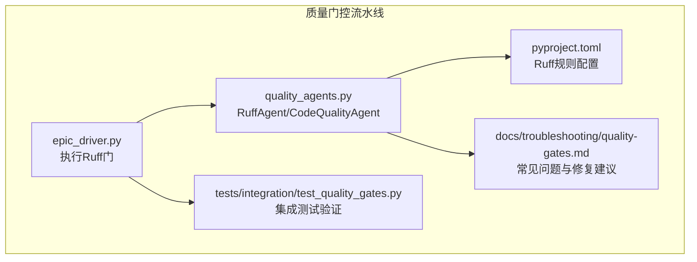
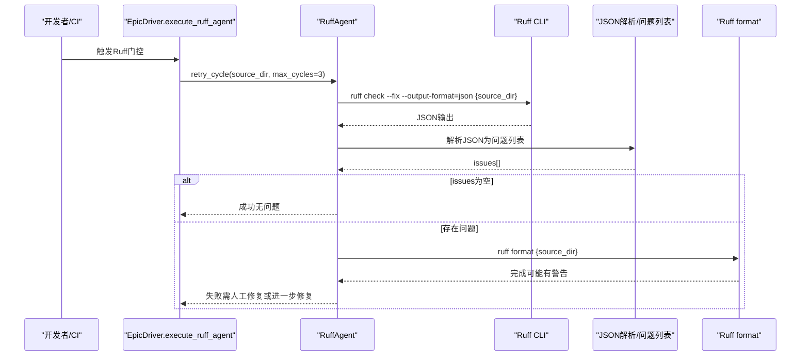
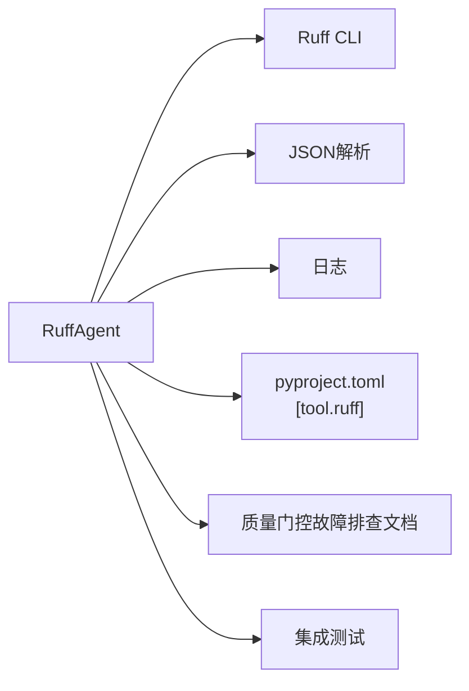

# Ruff代码检查失败分析

<cite>
**本文引用的文件列表**
- [quality_agents.py](file://autoBMAD/epic_automation/quality_agents.py)
- [epic_driver.py](file://autoBMAD/epic_automation/epic_driver.py)
- [pyproject.toml](file://pyproject.toml)
- [quality-gates.md](file://docs-copy/troubleshooting/quality-gates.md)
- [quality-gates.md（用户指南）](file://docs-copy/user-guide/quality-gates.md)
- [risk-20260108.md](file://docs-copy/qa/assessments/003.1-risk-20260108.md)
- [nfr-20260108.md](file://docs-copy/qa/assessments/003.1-nfr-20260108.md)
- [test_quality_gates.py](file://tests/integration/test_quality_gates.py)
</cite>

## 目录
1. [引言](#引言)
2. [项目结构与质量门控概览](#项目结构与质量门控概览)
3. [核心组件](#核心组件)
4. [架构总览](#架构总览)
5. [详细组件分析](#详细组件分析)
6. [依赖关系分析](#依赖关系分析)
7. [性能与可靠性考量](#性能与可靠性考量)
8. [故障排查与常见问题](#故障排查与常见问题)
9. [结论](#结论)
10. [附录](#附录)

## 引言
本文件聚焦于Ruff质量门控失败的常见原因与应对策略，结合质量代理的执行逻辑、CLI参数与配置、测试用例与日志证据，帮助开发者快速定位问题、修复误报、优化规则集，并将Ruff集成到日常开发工作流中，实现预防性检查与自动化修复。

## 项目结构与质量门控概览
- 质量门控由驱动器模块触发，Ruff作为第一道门，随后是类型检查与测试阶段。
- Ruff代理负责：
  - 调用Ruff执行检查与自动修复
  - 将JSON输出解析为统一问题列表
  - 在多轮次中尝试修复并最终格式化代码
- pyproject.toml中定义了Ruff规则选择、忽略项与按文件忽略策略，直接影响门控通过率与误报情况。

图表来源
- [epic_driver.py](file://autoBMAD/epic_automation/epic_driver.py#L162-L228)
- [quality_agents.py](file://autoBMAD/epic_automation/quality_agents.py#L466-L530)
- [pyproject.toml](file://pyproject.toml#L78-L101)
- [quality-gates.md](file://docs-copy/troubleshooting/quality-gates.md#L340-L364)
- [test_quality_gates.py](file://tests/integration/test_quality_gates.py#L208-L242)

章节来源
- [epic_driver.py](file://autoBMAD/epic_automation/epic_driver.py#L162-L228)
- [quality_agents.py](file://autoBMAD/epic_automation/quality_agents.py#L466-L530)
- [pyproject.toml](file://pyproject.toml#L78-L101)

## 核心组件
- CodeQualityAgent：抽象基类，封装工具执行、JSON解析、重试与格式化通用逻辑。
- RuffAgent：继承自CodeQualityAgent，专门处理Ruff检查、自动修复与格式化。
- EpicDriver：在流水线中调用RuffAgent并汇总结果，决定门控成败。
- pyproject.toml：集中管理Ruff规则选择、忽略与按文件忽略，影响门控通过率。

章节来源
- [quality_agents.py](file://autoBMAD/epic_automation/quality_agents.py#L41-L170)
- [quality_agents.py](file://autoBMAD/epic_automation/quality_agents.py#L466-L530)
- [epic_driver.py](file://autoBMAD/epic_automation/epic_driver.py#L162-L228)
- [pyproject.toml](file://pyproject.toml#L78-L101)

## 架构总览
Ruff门控的端到端流程如下：

图表来源
- [epic_driver.py](file://autoBMAD/epic_automation/epic_driver.py#L162-L228)
- [quality_agents.py](file://autoBMAD/epic_automation/quality_agents.py#L466-L530)
- [quality_agents.py](file://autoBMAD/epic_automation/quality_agents.py#L531-L563)

## 详细组件分析

### RuffAgent执行逻辑与参数配置
- 命令模板：使用“ruff check --fix --output-format=json {source_dir}”，确保输出为JSON，便于统一解析。
- 执行方式：通过子进程同步执行并在独立线程中隔离取消作用域，避免取消传播导致的异常。
- JSON解析：对标准输出进行UTF-8解码后解析为问题列表；若解析失败则记录错误并返回空列表。
- 格式化：在每轮循环结束后执行“ruff format {source_dir}”，即使返回码非零也视为流程继续，仅记录警告。

章节来源
- [quality_agents.py](file://autoBMAD/epic_automation/quality_agents.py#L466-L530)
- [quality_agents.py](file://autoBMAD/epic_automation/quality_agents.py#L531-L563)

### 质量门控调用流程（EpicDriver）
- 当skip_quality为False时，加载RuffAgent并执行retry_cycle。
- 若successful_cycles大于0，则判定门控通过；否则记录失败并包含总轮次信息。
- 该流程与CLI标志配合，支持跳过质量门控。

章节来源
- [epic_driver.py](file://autoBMAD/epic_automation/epic_driver.py#L162-L228)

### CLI参数与临时调整
- 常用命令：
  - 仅检查：ruff check src/
  - 自动修复：ruff check --fix src/
  - 格式化：ruff format src/
- 临时调整检查级别（示例思路）：
  - 通过--select仅启用部分规则，降低误报与耗时
  - 通过--ignore针对特定规则临时放行
  - 通过--exclude排除特定文件/目录
- 注意：上述命令为Ruff CLI参数，与质量代理内部命令模板互补，可在本地快速验证规则效果。

章节来源
- [quality-gates.md（用户指南）](file://docs-copy/user-guide/quality-gates.md#L288-L300)
- [quality-gates.md（用户指南）](file://docs-copy/user-guide/quality-gates.md#L322-L341)

### 测试用例与复现方法
- 集成测试验证：
  - 跳过质量门控：断言返回结果包含skipped字段且为True
  - 正常执行：断言successful_cycles大于0时返回success为True
- 可通过修改源码或配置模拟失败场景：
  - 在源码中引入未使用导入、导入顺序错误、行过长等Ruff可检测的问题
  - 运行Ruff门控，观察失败与重试行为

章节来源
- [test_quality_gates.py](file://tests/integration/test_quality_gates.py#L208-L242)
- [test_quality_gates.py](file://tests/integration/test_quality_gates.py#L43-L83)

## 依赖关系分析
- RuffAgent依赖：
  - Ruff CLI（通过命令模板调用）
  - JSON解析（统一问题格式）
  - 日志记录（错误与警告）
- 配置依赖：
  - pyproject.toml中的[tool.ruff]、[tool.ruff.lint]、[tool.ruff.lint.per-file-ignores]决定规则集与忽略策略
- 文档与测试：
  - 故障排查文档提供常见错误码与修复建议
  - 集成测试验证门控行为与跳过逻辑

图表来源
- [quality_agents.py](file://autoBMAD/epic_automation/quality_agents.py#L466-L530)
- [pyproject.toml](file://pyproject.toml#L78-L101)
- [quality-gates.md](file://docs-copy/troubleshooting/quality-gates.md#L340-L364)
- [test_quality_gates.py](file://tests/integration/test_quality_gates.py#L208-L242)

## 性能与可靠性考量
- 取消作用域安全：RuffAgent通过线程池与屏蔽任务避免取消传播，减少意外中断。
- 重试机制：最大3个周期、每周期最多2次重试，提升稳定性。
- 格式化容忍：格式化阶段即使有警告也继续流程，避免阻塞整体门控。
- 风险评估：低风险实现，具备完善的错误处理、降级与可观察性。

章节来源
- [quality_agents.py](file://autoBMAD/epic_automation/quality_agents.py#L279-L422)
- [risk-20260108.md](file://docs-copy/qa/assessments/003.1-risk-20260108.md#L1-L123)
- [nfr-20260108.md](file://docs-copy/qa/assessments/003.1-nfr-20260108.md#L237-L257)

## 故障排查与常见问题

### 常见Ruff规则与误报规避
- 导入顺序错误（I001）：Ruff会报告导入顺序不合规，可通过自动修复或手动调整解决。
- 未使用导入（F401）：移除未使用的导入可避免误报。
- 行过长（E501）：当前配置已忽略此规则，交由格式化工具处理。
- 其他常见规则与修复建议参见故障排查文档。

章节来源
- [quality-gates.md（用户指南）](file://docs-copy/user-guide/quality-gates.md#L322-L341)
- [quality-gates.md](file://docs-copy/troubleshooting/quality-gates.md#L340-L364)

### 如何在pyproject.toml中正确配置Ruff规则
- 规则选择（select）：建议保留E、F、W、I等基础规则，按需增加命名与注解相关规则。
- 忽略规则（ignore）：对特定误报规则进行忽略，如行过长（E501）等。
- 按文件忽略（per-file-ignores）：对__init__.py、tests/*等文件设置差异化忽略策略。
- 版本与行宽：target-version与line-length应与团队规范一致。

章节来源
- [pyproject.toml](file://pyproject.toml#L78-L101)

### 通过CLI临时调整检查级别
- 仅检查：ruff check src/
- 自动修复：ruff check --fix src/
- 临时缩小规则范围：ruff check --select E,F,W,I src/
- 临时忽略规则：ruff check --ignore E501 src/
- 排除文件/目录：ruff check --exclude venv,tests src/

章节来源
- [quality-gates.md（用户指南）](file://docs-copy/user-guide/quality-gates.md#L288-L300)
- [quality-gates.md（用户指南）](file://docs-copy/user-guide/quality-gates.md#L322-L341)

### 如何复现与调试Ruff检查失败场景
- 在源码中引入典型问题（如未使用导入、导入顺序错误、行过长等），运行Ruff门控，观察失败与重试行为。
- 使用集成测试中的断言模式，验证跳过与通过逻辑。
- 结合日志与故障排查文档，定位具体规则与修复路径。

章节来源
- [test_quality_gates.py](file://tests/integration/test_quality_gates.py#L208-L242)
- [quality-gates.md](file://docs-copy/troubleshooting/quality-gates.md#L340-L364)

### 将Ruff集成到开发工作流中
- 开发阶段：每次提交前运行ruff check --fix src/，自动修复可修复问题。
- 提交后：运行ruff format src/统一格式，确保导入顺序与缩进一致。
- CI阶段：在质量门控中执行RuffAgent，结合重试与格式化，保证通过率稳定。

章节来源
- [quality-gates.md（用户指南）](file://docs-copy/user-guide/quality-gates.md#L288-L300)
- [quality_agents.py](file://autoBMAD/epic_automation/quality_agents.py#L466-L530)

## 结论
Ruff质量门控通过明确的命令模板、健壮的JSON解析与重试机制，有效降低了误报与失败概率。结合pyproject.toml的规则配置与按文件忽略策略，可在保证质量的同时减少不必要的干扰。通过CLI参数与工作流集成，开发者可以快速定位问题、修复误报，并将Ruff纳入日常开发实践，实现预防性检查与自动化修复。

## 附录

### Ruff规则与修复示例（来自故障排查文档）
- 导入顺序错误（I001）：参考自动修复命令与示例代码。
- 代码格式问题（E701等）：参考格式化命令与示例代码。
- 类型注解缺失（ANN101等）：参考类型注解修复建议。
- 可变默认参数（B006）：参考修复示例。

章节来源
- [quality-gates.md](file://docs-copy/troubleshooting/quality-gates.md#L340-L364)
- [quality-gates.md](file://docs-copy/troubleshooting/quality-gates.md#L365-L388)
- [quality-gates.md](file://docs-copy/troubleshooting/quality-gates.md#L389-L411)
- [quality-gates.md](file://docs-copy/troubleshooting/quality-gates.md#L412-L434)