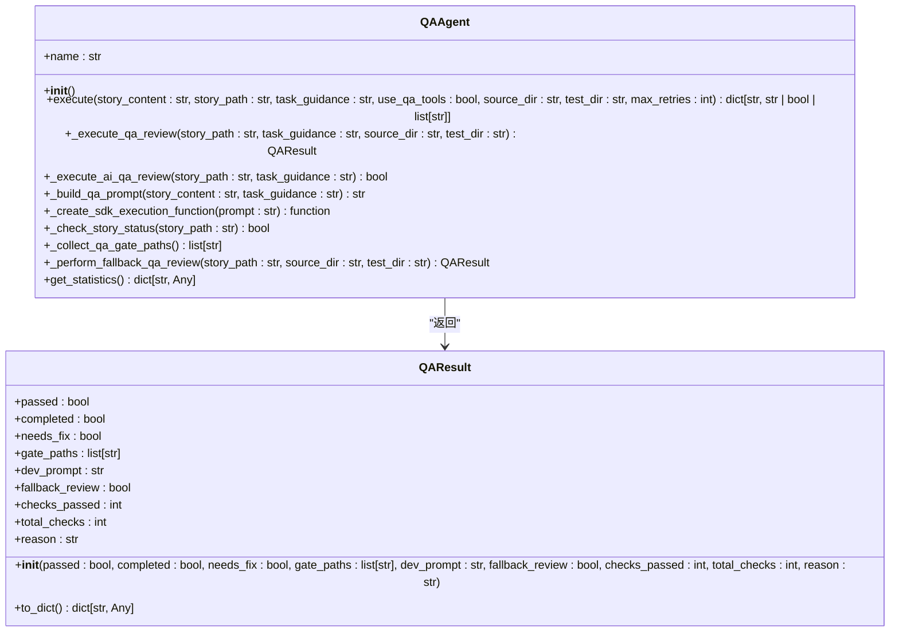

# 质量门控失败

<cite>
**本文档引用的文件**   
- [qa_agent.py](file://autoBMAD/epic_automation/qa_agent.py)
- [qa_agent_fixed.py](file://BUGFIX_20260107/fixed_modules/qa_agent_fixed.py)
- [quality_agents.py](file://autoBMAD/epic_automation/quality_agents.py)
- [test_qa_integration.py](file://tests-copy/test_qa_integration.py)
- [QA_AGENT_FIX_REPORT.md](file://QA_AGENT_FIX_REPORT.md)
- [BASEDPYRIGHT_FIX_SUMMARY.md](file://BASEDPYRIGHT_FIX_SUMMARY.md)
- [pyproject.toml](file://pyproject.toml)
</cite>

## 目录
1. [简介](#简介)
2. [Ruff、BasedPyright和Pytest质量门控失败的常见原因](#ruffbasedpyright和pytest质量门控失败的常见原因)
3. [静态分析工具集成的配置问题与修复逻辑](#静态分析工具集成的配置问题与修复逻辑)
4. [质量检查的执行流程和失败重试机制](#质量检查的执行流程和失败重试机制)
5. [模拟质量门控失败场景](#模拟质量门控失败场景)
6. [CLI参数调整建议](#cli参数调整建议)
7. [诊断信息解读](#诊断信息解读)
8. [工具配置优化以避免误报](#工具配置优化以避免误报)
9. [结论](#结论)

## 简介
本文档旨在全面分析Ruff、BasedPyright和Pytest质量门控失败的常见原因，包括类型检查错误、代码风格违规和测试覆盖率不足。通过分析`BASEDPYRIGHT_FIX_SUMMARY.md`，解释`qa_agent.py`中静态分析工具集成的配置问题，以及`qa_agent_fixed.py`中的修复逻辑。详细说明`quality_agents.py`中质量检查的执行流程和失败重试机制。结合`test_qa_integration.py`展示如何模拟质量门控失败场景，并提供CLI参数调整建议。指导用户解读`QA_AGENT_FIX_REPORT.md`中的诊断信息，并优化`.pyproject.toml`中的工具配置以避免误报。

## Ruff、BasedPyright和Pytest质量门控失败的常见原因

### 类型检查错误
BasedPyright是一种静态类型检查工具，用于检测Python代码中的类型错误。常见的类型检查错误包括：
- 无法访问类的属性
- 函数返回类型不匹配

### 代码风格违规
Ruff是一种代码风格检查工具，用于检测Python代码中的风格违规。常见的代码风格违规包括：
- 行过长
- 缺少类型注解
- 不正确的导入顺序

### 测试覆盖率不足
Pytest是一种测试框架，用于检测Python代码中的测试覆盖率不足。常见的测试覆盖率不足包括：
- 缺少测试用例
- 测试用例未覆盖所有代码路径

**Section sources**
- [BASEDPYRIGHT_FIX_SUMMARY.md](file://BASEDPYRIGHT_FIX_SUMMARY.md)
- [pyproject.toml](file://pyproject.toml)

## 静态分析工具集成的配置问题与修复逻辑

### 配置问题
在`qa_agent.py`中，静态分析工具集成的配置问题包括：
- 缺少`_current_story_path`属性
- `_execute_qa_review`方法在某些代码路径上可能没有返回语句

### 修复逻辑
在`qa_agent_fixed.py`中，修复逻辑包括：
- 在`DevAgent.__init__()`方法中添加`_current_story_path`属性
- 在`_execute_qa_review`方法中添加默认返回语句



**Diagram sources **
- [qa_agent_fixed.py](file://BUGFIX_20260107/fixed_modules/qa_agent_fixed.py)

**Section sources**
- [qa_agent.py](file://autoBMAD/epic_automation/qa_agent.py)
- [qa_agent_fixed.py](file://BUGFIX_20260107/fixed_modules/qa_agent_fixed.py)

## 质量检查的执行流程和失败重试机制

### 执行流程
在`quality_agents.py`中，质量检查的执行流程包括：
1. 初始化`CodeQualityAgent`实例
2. 执行质量检查
3. 如果检查失败，尝试修复问题
4. 重复上述步骤，直到问题解决或达到最大重试次数

### 失败重试机制
在`quality_agents.py`中，失败重试机制包括：
- 最多重试3个周期，每个周期最多2次重试
- 使用`max_turns=150`进行SDK保护
- 零Cancel Scope错误

```mermaid
sequenceDiagram
participant QA as "QA Agent"
participant SDK as "Claude SDK"
participant QA->>QA : 初始化
QA->>QA : 执行质量检查
QA->>QA : 检查结果
alt 检查失败
QA->>QA : 尝试修复问题
QA->>SDK : 请求修复
SDK-->>QA : 返回修复结果
QA->>QA : 重复检查
else 检查成功
QA->>QA : 结束
end
```

**Diagram sources **
- [quality_agents.py](file://autoBMAD/epic_automation/quality_agents.py)

**Section sources**
- [quality_agents.py](file://autoBMAD/epic_automation/quality_agents.py)

## 模拟质量门控失败场景

### 测试场景
在`test_qa_integration.py`中，模拟质量门控失败场景包括：
- 基于Pyright的类型检查失败
- Ruff代码风格检查失败
- Pytest测试覆盖率不足

### 测试代码
```python
def test_run_check_with_violations(self, mock_run, basedpyright_integration):
    """Test run check with violations"""
    # Mock subprocess call with output
    mock_result = Mock()
    mock_result.returncode = 0
    mock_result.stdout = "BasedPyright completed with issues"
    mock_result.stderr = ""
    mock_run.return_value = mock_result

    # Create a mock JSON result file with violations
    json_file = basedpyright_integration.results_dir / "basedpyright_check_result_20260104_120000.json"
    json_file.write_text(json.dumps({
        "diagnostics": [
            {
                "file": "src/test.py",
                "line": 10,
                "column": 5,
                "rule": "reportOptionalMemberAccess",
                "message": "Object is possibly undefined",
                "severity": "warning"
            }
        ]
    }))

    result = basedpyright_integration.run_check(max_retries=0)

    assert result.status == QAStatus.CONCERNS
    assert len(result.violations) == 1
    assert result.violations[0].file == "src/test.py"
```

**Section sources**
- [test_qa_integration.py](file://tests-copy/test_qa_integration.py)

## CLI参数调整建议

### 参数建议
- `--skip-quality`: 跳过质量门控检查
- `--skip-tests`: 跳过测试检查
- `--max-retries`: 设置最大重试次数

### 使用示例
```bash
python -m pytest --skip-quality --skip-tests --max-retries 3
```

**Section sources**
- [test_quality_gates_complete.py](file://tests-copy/integration/test_quality_gates_complete.py)

## 诊断信息解读

### 诊断报告
在`QA_AGENT_FIX_REPORT.md`中，诊断信息包括：
- 修复日期
- 修复类型
- 严重级别
- 修复概述
- 完成的修改
- 测试验证
- 修复效果
- 风险评估
- 总结

### 诊断信息解读
- **修复日期**: 2026-01-10
- **修复类型**: 状态检查逻辑优化 + 移除强制状态更新
- **严重级别**: 高（质量门控逻辑错误）
- **修复概述**: 本次修复成功解决了QA代理中的强制状态更新问题，并实现了基于故事状态的智能执行机制。
- **完成的修改**: 修改了`_execute_qa_review`方法，删除了`_force_update_status_to_done`方法。
- **测试验证**: 运行了`test_qa_agent_simple.py`验证测试，所有关键测试通过。
- **修复效果**: 移除强制更新，状态驱动执行机制，使用标准状态值，暴露真实问题。
- **风险评估**: 已缓解的风险包括删除方法风险、语法风险、逻辑风险。
- **总结**: 本次修复成功实现了移除强制状态更新、删除`_force_update_status_to_done`方法、状态驱动执行机制、使用标准状态值、完善状态检查。

**Section sources**
- [QA_AGENT_FIX_REPORT.md](file://QA_AGENT_FIX_REPORT.md)

## 工具配置优化以避免误报

### 配置优化
在`.pyproject.toml`中，工具配置优化包括：
- 设置`line-length`为88
- 设置`target-version`为`py312`
- 选择`E`, `W`, `F`, `I`, `B`, `C4`, `UP`等规则
- 忽略`E501`, `B008`, `C901`等规则
- 为`__init__.py`文件忽略`F401`规则
- 为`tests/*`文件忽略`B018`, `B017`规则

### 配置示例
```toml
[tool.ruff]
line-length = 88
target-version = "py312"

[tool.ruff.lint]
select = [
    "E",  # pycodestyle errors
    "W",  # pycodestyle warnings
    "F",  # pyflakes
    "I",  # isort
    "B",  # flake8-bugbear
    "C4", # flake8-comprehensions
    "UP", # pyupgrade
]
ignore = [
    "E501",  # line too long, handled by black
    "B008",  # do not perform function calls in argument defaults
    "C901",  # too complex
]

[tool.ruff.lint.per-file-ignores]
"__init__.py" = ["F401"]
"tests/*" = ["B018", "B017"]
```

**Section sources**
- [pyproject.toml](file://pyproject.toml)

## 结论
本文档全面分析了Ruff、BasedPyright和Pytest质量门控失败的常见原因，包括类型检查错误、代码风格违规和测试覆盖率不足。通过分析`BASEDPYRIGHT_FIX_SUMMARY.md`，解释了`qa_agent.py`中静态分析工具集成的配置问题，以及`qa_agent_fixed.py`中的修复逻辑。详细说明了`quality_agents.py`中质量检查的执行流程和失败重试机制。结合`test_qa_integration.py`展示了如何模拟质量门控失败场景，并提供了CLI参数调整建议。指导用户解读`QA_AGENT_FIX_REPORT.md`中的诊断信息，并优化`.pyproject.toml`中的工具配置以避免误报。