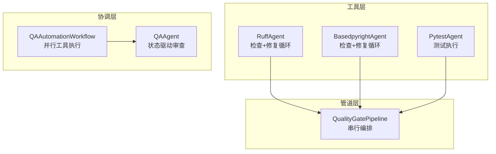
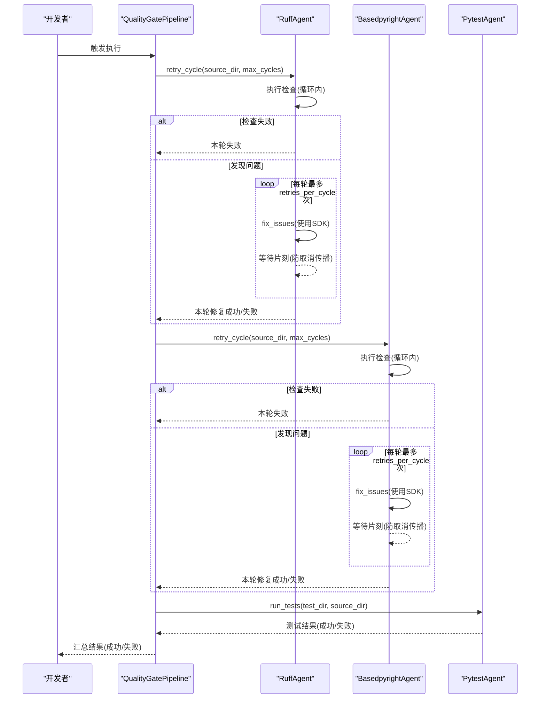
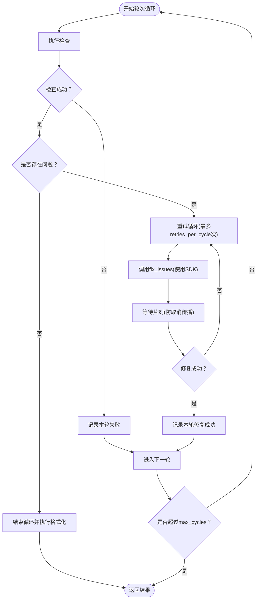
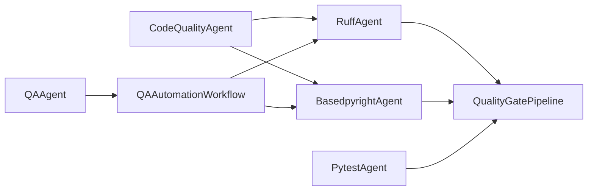

# 质量门控失败重试机制

<cite>
**本文引用的文件**
- [quality_agents.py](file://autoBMAD/epic_automation/quality_agents.py)
- [qa_agent.py](file://autoBMAD/epic_automation/qa_agent.py)
- [qa_tools_integration.py](file://autoBMAD/epic_automation/qa_tools_integration.py)
- [test_qa_integration.py](file://tests/test_qa_integration.py)
- [retry-mechanism-design.md](file://docs-copy/evaluation/retry-mechanism-design.md)
- [quality-gates.md](file://docs-copy/troubleshooting/quality-gates.md)
- [epic_driver.py](file://autoBMAD/epic_automation/epic_driver.py)
</cite>

## 目录
1. [引言](#引言)
2. [项目结构](#项目结构)
3. [核心组件](#核心组件)
4. [架构总览](#架构总览)
5. [详细组件分析](#详细组件分析)
6. [依赖关系分析](#依赖关系分析)
7. [性能考量](#性能考量)
8. [故障排查指南](#故障排查指南)
9. [结论](#结论)
10. [附录](#附录)

## 引言
本文件围绕质量门控系统的“失败重试机制”展开，重点基于以下文件：
- quality_agents.py：实现 Ruff/BasedPyright 的检查与修复循环、重试策略、最大尝试次数配置与间隔控制。
- qa_agent.py：协调不同检查工具（Ruff、BasedPyright、Pytest）的重试行为与状态同步机制。
- qa_tools_integration.py：基于工具工作流的并行执行与重试（BasedPyright/Fixtest）。
- test_qa_integration.py：测试用例覆盖工具集成与重试场景。
- retry-mechanism-design.md、quality-gates.md：设计建议与非阻塞重试的指导原则。
- epic_driver.py：质量门控管道的非阻塞失败处理策略。

目标是帮助读者理解重试触发条件、间隔控制、最大尝试次数配置，以及在多工具流水线中的状态同步与一致性保障，并提供配置建议与最佳实践，避免无限循环或资源耗尽。

## 项目结构
质量门控系统由三个层面构成：
- 工具层：Ruff/BasedPyright/Pytest 的检查与修复执行器。
- 管道层：QualityGatePipeline 串行编排三类工具，负责失败判定与错误收集。
- 协调层：QA Agent 与 QA Tools Integration 并行执行两类工具，分别在各自范围内进行重试。

图表来源
- [quality_agents.py](file://autoBMAD/epic_automation/quality_agents.py#L907-L1012)
- [qa_agent.py](file://autoBMAD/epic_automation/qa_agent.py#L1-L200)
- [qa_tools_integration.py](file://autoBMAD/epic_automation/qa_tools_integration.py#L583-L741)

章节来源
- [quality_agents.py](file://autoBMAD/epic_automation/quality_agents.py#L907-L1012)
- [qa_agent.py](file://autoBMAD/epic_automation/qa_agent.py#L1-L200)
- [qa_tools_integration.py](file://autoBMAD/epic_automation/qa_tools_integration.py#L583-L741)

## 核心组件
- CodeQualityAgent.retry_cycle：统一的“检查-修复-重试”循环，支持每轮固定次数的重试与最大轮次限制。
- RuffAgent/BasedpyrightAgent：继承自 CodeQualityAgent，分别对接 Ruff 与 BasedPyright 的检查与修复。
- PytestAgent：在质量门控最后阶段执行测试，失败即标记门禁失败。
- QualityGatePipeline.execute_pipeline：按顺序串联 Ruff → BasedPyright → Pytest，并对每一步的结果进行汇总与失败判定。
- QAAgent：状态驱动的 QA 审查，配合 SDK 会话管理器，实现取消安全与状态同步。
- QAAutomationWorkflow：并行执行 BasedPyright 与 Fixtest，各自在 Runner 内部进行重试。

章节来源
- [quality_agents.py](file://autoBMAD/epic_automation/quality_agents.py#L279-L422)
- [quality_agents.py](file://autoBMAD/epic_automation/quality_agents.py#L423-L564)
- [quality_agents.py](file://autoBMAD/epic_automation/quality_agents.py#L565-L760)
- [quality_agents.py](file://autoBMAD/epic_automation/quality_agents.py#L762-L906)
- [quality_agents.py](file://autoBMAD/epic_automation/quality_agents.py#L907-L1012)
- [qa_agent.py](file://autoBMAD/epic_automation/qa_agent.py#L1-L200)
- [qa_tools_integration.py](file://autoBMAD/epic_automation/qa_tools_integration.py#L583-L741)

## 架构总览
质量门控的失败重试机制贯穿三层：
- 工具层：每轮最多 retries_per_cycle 次重试；若某轮修复成功，则进入下一轮或结束。
- 管道层：每种工具最多 max_cycles 轮；若某轮修复成功计数大于零，则视为该工具通过。
- 协调层：QA Agent 在状态驱动下进行有限次重试；QAAutomationWorkflow 在 Runner 内部进行有限次重试。

图表来源
- [quality_agents.py](file://autoBMAD/epic_automation/quality_agents.py#L907-L1012)
- [quality_agents.py](file://autoBMAD/epic_automation/quality_agents.py#L279-L422)

## 详细组件分析

### CodeQualityAgent.retry_cycle：重试策略与最大尝试次数
- 触发条件
  - 检查失败：execute_check 返回失败。
  - 发现问题：execute_check 返回 issues 列表非空。
- 重试次数与轮次
  - 外层轮次：max_cycles，默认 3。
  - 内层重试：retries_per_cycle，默认 2。
- 间隔控制
  - 每次修复尝试后，等待短暂时间（sleep）以允许取消作用域清理，避免后续子进程调用受取消传播影响。
- 成功判定
  - 若某轮修复成功计数大于 0，则计入 successful_cycles。
  - 若某轮无问题，则直接结束循环并执行一次格式化。
- 结果聚合
  - 记录 total_cycles、successful_cycles、total_issues_found、total_issues_fixed、每轮明细 cycles。

图表来源
- [quality_agents.py](file://autoBMAD/epic_automation/quality_agents.py#L279-L422)

章节来源
- [quality_agents.py](file://autoBMAD/epic_automation/quality_agents.py#L279-L422)

### RuffAgent/BasedpyrightAgent：重试与格式化
- RuffAgent
  - 继承 CodeQualityAgent，复用 retry_cycle。
  - 在每轮结束后执行格式化（ruff format），即使格式化失败也不影响整体成功状态。
- BasedpyrightAgent
  - 继承 CodeQualityAgent，复用 retry_cycle。
  - 检查输出为诊断列表，转换为统一 issues 格式供父类修复流程使用。

章节来源
- [quality_agents.py](file://autoBMAD/epic_automation/quality_agents.py#L423-L564)
- [quality_agents.py](file://autoBMAD/epic_automation/quality_agents.py#L565-L760)

### PytestAgent：最终门禁
- 在质量门控的最后阶段执行测试。
- 若测试目录不存在或无测试文件，按约定返回“成功”（视作跳过）。
- 若返回码为特定值（例如未收集到测试），也按“成功”处理，避免误判。
- 任何失败都会导致整条管线失败标记。

章节来源
- [quality_agents.py](file://autoBMAD/epic_automation/quality_agents.py#L762-L906)

### QualityGatePipeline.execute_pipeline：串行编排与失败判定
- 顺序执行：Ruff → BasedPyright → Pytest。
- 失败判定：若任一步的 successful_cycles 或 success 为 False，则整条管线失败。
- 错误收集：将各步错误追加到 errors 列表，便于定位问题来源。

章节来源
- [quality_agents.py](file://autoBMAD/epic_automation/quality_agents.py#L907-L1012)

### QA Agent：状态驱动的审查与重试
- 状态驱动：先解析故事状态，再决定是否执行 QA 审查；审查后再次解析状态，依据标准状态值（如 Done/Ready for Done）判定通过与否。
- 重试策略：在 Ready for Review 状态下，最多重试 1 次；其他异常（取消、异常）采用回退审查。
- SDK 会话隔离：使用 SDKSessionManager 执行 SDK 调用，避免取消作用域污染。

章节来源
- [qa_agent.py](file://autoBMAD/epic_automation/qa_agent.py#L330-L456)

### QA Tools Integration：并行工具执行与重试
- 并行执行：BasedPyright 与 Fixtest 同时运行，减少总耗时。
- 基于 Runner 的重试：BasedPyrightWorkflowRunner 与 FixtestWorkflowRunner 分别在自身范围内进行有限次重试（max_retries），并在必要时执行自动修复或扫描测试文件。
- 整体状态：综合两类工具结果，按规则映射为 QA_PASS/CONCERNS/FAIL/WAIVED。

章节来源
- [qa_tools_integration.py](file://autoBMAD/epic_automation/qa_tools_integration.py#L583-L741)

## 依赖关系分析
- 工具层依赖
  - CodeQualityAgent 作为基类，被 RuffAgent 与 BasedpyrightAgent 继承，共享重试与修复逻辑。
  - PytestAgent 独立于上述两类工具，仅在最终阶段参与门禁。
- 管道层依赖
  - QualityGatePipeline 依赖三个 Agent，负责失败判定与错误汇总。
- 协调层依赖
  - QAAgent 依赖 SDKSessionManager 与状态解析模块，确保取消安全与状态同步。
  - QAAutomationWorkflow 依赖两类 Runner，Runner 内部进行重试。

图表来源
- [quality_agents.py](file://autoBMAD/epic_automation/quality_agents.py#L279-L422)
- [quality_agents.py](file://autoBMAD/epic_automation/quality_agents.py#L907-L1012)
- [qa_tools_integration.py](file://autoBMAD/epic_automation/qa_tools_integration.py#L583-L741)
- [qa_agent.py](file://autoBMAD/epic_automation/qa_agent.py#L1-L200)

## 性能考量
- 重试次数与轮次
  - 工具层：max_cycles=3，retries_per_cycle=2，合计最多 6 次修复尝试，避免过度重试。
  - 工具集成层：max_retries=2，Runner 内部重试，避免外部超时带来的取消作用域问题。
- 取消安全
  - 使用 asyncio.shield 保护子进程与 SDK 调用，避免取消传播导致的资源泄漏与状态不一致。
  - 在修复后等待短暂时间，确保取消作用域清理完成，再发起下一次子进程调用。
- 并行化
  - QA Tools Integration 并行执行两类工具，缩短总耗时；同时注意任务清理，避免任务泄漏。

章节来源
- [quality_agents.py](file://autoBMAD/epic_automation/quality_agents.py#L279-L422)
- [qa_tools_integration.py](file://autoBMAD/epic_automation/qa_tools_integration.py#L583-L741)
- [retry-mechanism-design.md](file://docs-copy/evaluation/retry-mechanism-design.md#L1-L357)

## 故障排查指南
- 常见失败场景
  - 子进程超时：检查工具命令与路径，确认虚拟环境与可执行文件存在。
  - SDK 取消：确认 SDKSessionManager 的使用，避免外部超时包装导致取消作用域错误。
  - JSON 输出解析失败：检查工具输出格式是否符合预期。
- 日志与错误收集
  - 管道层将各步错误汇总至 errors 列表，便于定位问题来源。
  - QA Agent 在取消或异常情况下返回回退审查结果，确保流程继续。
- 非阻塞失败
  - 质量门控失败不阻断史诗流程，系统继续执行并提示后续人工审查。

章节来源
- [quality_agents.py](file://autoBMAD/epic_automation/quality_agents.py#L907-L1012)
- [qa_agent.py](file://autoBMAD/epic_automation/qa_agent.py#L330-L456)
- [epic_driver.py](file://autoBMAD/epic_automation/epic_driver.py#L1984-L2013)

## 结论
质量门控的失败重试机制通过“轮次-重试”的双层设计，在保证稳定性的同时避免无限循环与资源耗尽：
- 工具层：每轮最多固定次数重试，修复成功即进入下一轮；无问题则提前结束并执行格式化。
- 管道层：每种工具最多固定轮次，任一步失败即标记整条管线失败。
- 协调层：QA Agent 与 QA Tools Integration 在各自范围内进行有限重试，并通过状态驱动与 SDK 会话隔离确保取消安全与状态同步。
- 非阻塞失败：质量门控失败不影响史诗流程，便于后续人工审查与修复。

## 附录

### 配置建议与最佳实践
- 工具层重试配置
  - max_cycles：建议 3，兼顾稳定性与效率。
  - retries_per_cycle：建议 2，避免过度重试。
  - 间隔控制：每次修复后等待短暂时间，确保取消作用域清理完成。
- 工具集成层重试配置
  - max_retries：建议 2，Runner 内部重试，避免外部超时。
- SDK 会话与取消安全
  - 使用 max_turns 限制对话轮数，避免无限等待。
  - 避免外部超时包装，改用 SDK 内部保护。
- 状态同步与非阻塞
  - QA 审查后再次解析状态，依据标准状态值判定结果。
  - 质量门控失败不阻断流程，便于后续人工干预。

章节来源
- [retry-mechanism-design.md](file://docs-copy/evaluation/retry-mechanism-design.md#L1-L357)
- [quality-gates.md](file://docs-copy/troubleshooting/quality-gates.md#L33-L71)
- [qa_agent.py](file://autoBMAD/epic_automation/qa_agent.py#L330-L456)

### 测试场景参考
- 基于测试文件的重试场景覆盖
  - 基于工具的重试：模拟第一次失败、第二次成功，验证 retry_count 与状态变化。
  - 工具集成的并行执行：验证两类工具并行运行与整体状态判定。
- 测试文件路径
  - [test_qa_integration.py](file://tests/test_qa_integration.py#L1-L602)

章节来源
- [test_qa_integration.py](file://tests/test_qa_integration.py#L1-L602)