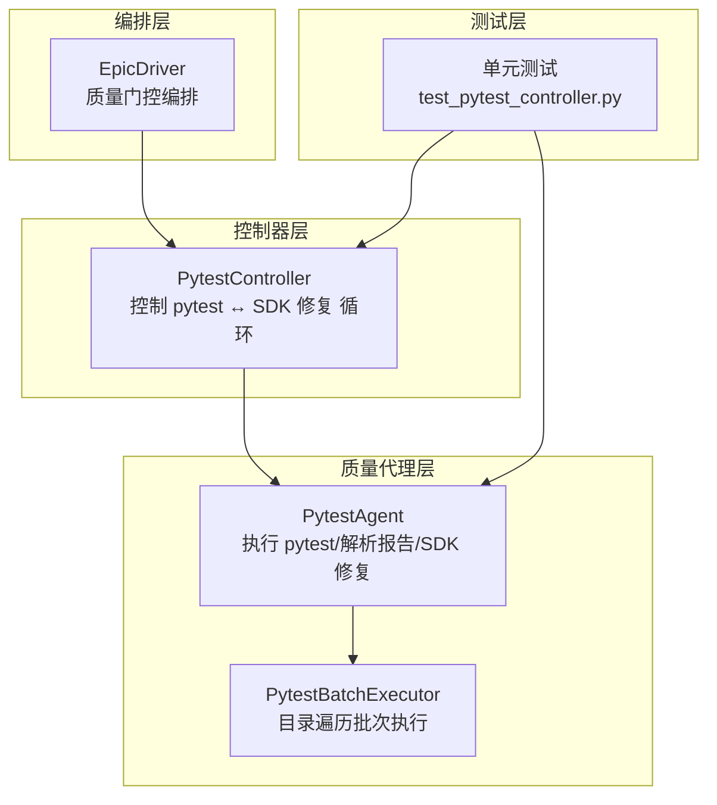
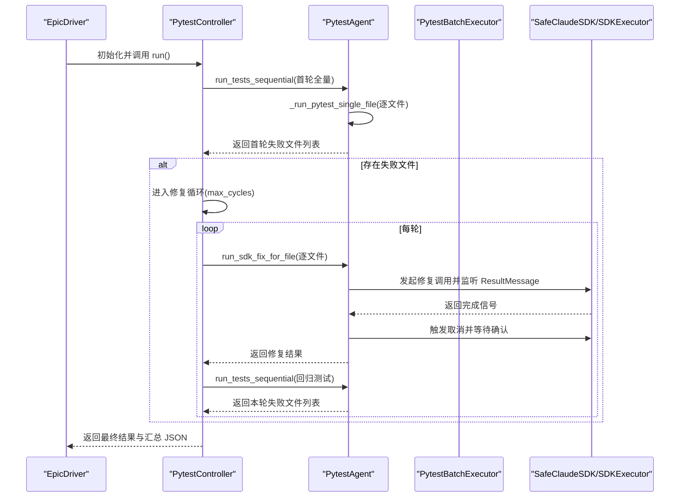
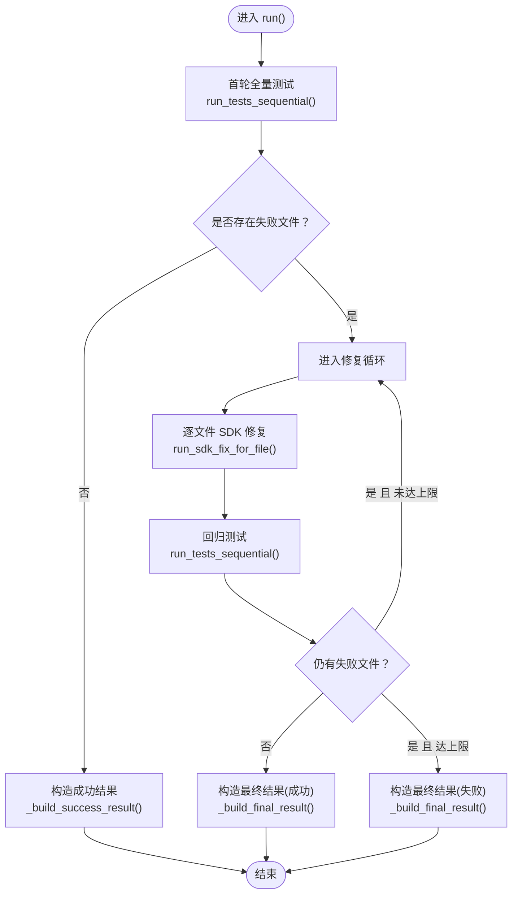
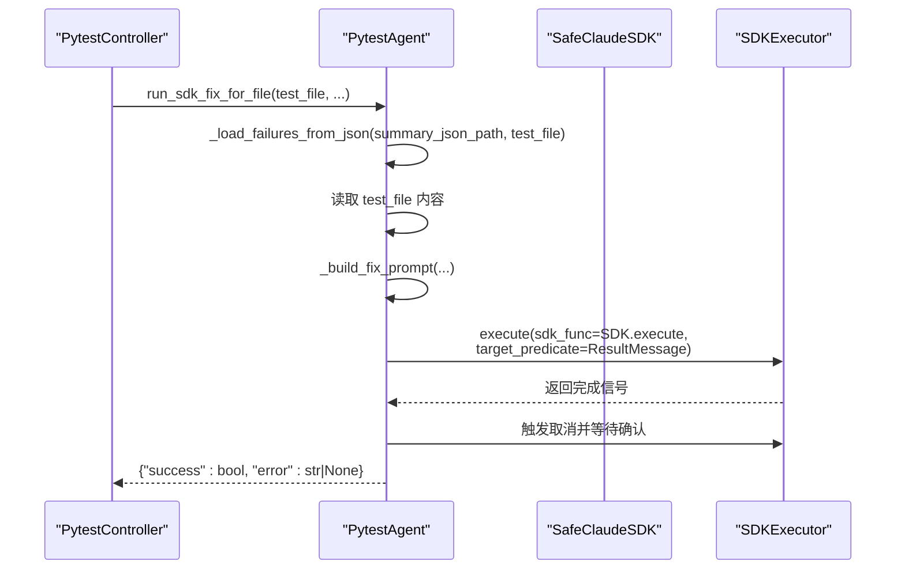
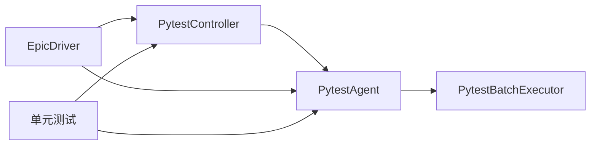

# Pytest控制器

<cite>
**本文引用的文件**
- [pytest_controller.py](file://autoBMAD/epic_automation/controllers/pytest_controller.py)
- [base_controller.py](file://autoBMAD/epic_automation/controllers/base_controller.py)
- [quality_agents.py](file://autoBMAD/epic_automation/agents/quality_agents.py)
- [pytest_batch_executor.py](file://autoBMAD/epic_automation/agents/pytest_batch_executor.py)
- [epic_driver.py](file://autoBMAD/epic_automation/epic_driver.py)
- [test_pytest_controller.py](file://tests-copy/unit/test_pytest_controller.py)
</cite>

## 目录
1. [简介](#简介)
2. [项目结构](#项目结构)
3. [核心组件](#核心组件)
4. [架构总览](#架构总览)
5. [详细组件分析](#详细组件分析)
6. [依赖关系分析](#依赖关系分析)
7. [性能考量](#性能考量)
8. [故障排查指南](#故障排查指南)
9. [结论](#结论)

## 简介
本文件系统性梳理“Pytest控制器”的设计与实现，聚焦其在质量门控流水线中的角色：控制 pytest 与 SDK 修复之间的多轮循环，维护失败文件列表与汇总 JSON，决定循环终止条件，并提供可扩展的测试文件发现与执行策略。同时结合上层编排器与质量代理，形成从“发现-执行-修复-回归”的闭环。

## 项目结构
围绕 Pytest 控制器的关键模块分布如下：
- 控制器层：PytestController（位于控制器目录），负责流程编排与状态管理。
- 质量代理层：PytestAgent（位于质量代理目录），封装 pytest 子进程执行、报告解析与 SDK 修复调用。
- 批次执行器：PytestBatchExecutor（位于质量代理目录），提供目录遍历与批次执行能力（在 PytestAgent 中被调用）。
- 编排层：EpicDriver（位于 epic_driver.py），在质量门控阶段调用 PytestController，串联 Ruff/BasedPyright/格式化/Pytest 全链路。
- 测试层：单元测试覆盖控制器初始化、文件发现、汇总 JSON 追加、SDK 修复阶段等关键路径。

图表来源
- [pytest_controller.py](file://autoBMAD/epic_automation/controllers/pytest_controller.py#L1-L399)
- [quality_agents.py](file://autoBMAD/epic_automation/agents/quality_agents.py#L497-L1036)
- [pytest_batch_executor.py](file://autoBMAD/epic_automation/agents/pytest_batch_executor.py#L1-L311)
- [epic_driver.py](file://autoBMAD/epic_automation/epic_driver.py#L378-L518)
- [test_pytest_controller.py](file://tests-copy/unit/test_pytest_controller.py#L1-L450)

章节来源
- [pytest_controller.py](file://autoBMAD/epic_automation/controllers/pytest_controller.py#L1-L399)
- [quality_agents.py](file://autoBMAD/epic_automation/agents/quality_agents.py#L497-L1036)
- [pytest_batch_executor.py](file://autoBMAD/epic_automation/agents/pytest_batch_executor.py#L1-L311)
- [epic_driver.py](file://autoBMAD/epic_automation/epic_driver.py#L378-L518)
- [test_pytest_controller.py](file://tests-copy/unit/test_pytest_controller.py#L1-L450)

## 核心组件
- PytestController
  - 职责：控制 pytest 与 SDK 修复的多轮循环；维护失败文件列表与汇总 JSON；决定循环终止条件。
  - 关键方法：run、_run_test_phase_all_files、_run_test_phase_failed_files、_run_sdk_phase、_discover_test_files、_append_round_to_summary_json、_build_success_result、_build_final_result。
- PytestAgent
  - 职责：顺序执行 pytest（支持超时）、解析 JSON 报告、构造 SDK 修复提示词并调用 SDKExecutor 执行，支持取消与确认。
  - 关键方法：run_tests_sequential、_run_pytest_single_file、_parse_json_report、run_sdk_fix_for_file、_execute_sdk_call_with_cancel。
- PytestBatchExecutor
  - 职责：动态扫描测试目录，基于启发式规则映射批次配置，构建命令并执行，支持并行、覆盖率与阻断策略。
  - 关键方法：discover_batches、execute_batches、_execute_batch、_build_command。
- EpicDriver（编排）
  - 职责：在质量门控阶段调用 PytestController，串联 Ruff/BasedPyright/格式化/Pytest 全链路。
  - 关键方法：execute_pytest_agent、execute_quality_gates。
- 测试
  - 覆盖：初始化、文件发现、成功/失败结果构造、汇总 JSON 追加、SDK 修复阶段异常处理等。

章节来源
- [pytest_controller.py](file://autoBMAD/epic_automation/controllers/pytest_controller.py#L64-L399)
- [quality_agents.py](file://autoBMAD/epic_automation/agents/quality_agents.py#L548-L1036)
- [pytest_batch_executor.py](file://autoBMAD/epic_automation/agents/pytest_batch_executor.py#L1-L311)
- [epic_driver.py](file://autoBMAD/epic_automation/epic_driver.py#L378-L518)
- [test_pytest_controller.py](file://tests-copy/unit/test_pytest_controller.py#L1-L450)

## 架构总览
Pytest 控制器位于“控制器层”，向上由 EpicDriver 编排，向下依赖 PytestAgent 执行 pytest 与 SDK 修复，PytestAgent 内部可委托 PytestBatchExecutor 进行目录遍历与批次执行（在顺序执行模式下，PytestAgent 逐文件执行，不使用批次执行器）。

图表来源
- [epic_driver.py](file://autoBMAD/epic_automation/epic_driver.py#L378-L518)
- [pytest_controller.py](file://autoBMAD/epic_automation/controllers/pytest_controller.py#L64-L213)
- [quality_agents.py](file://autoBMAD/epic_automation/agents/quality_agents.py#L548-L820)

## 详细组件分析

### PytestController 分析
- 初始化与状态
  - 接收 source_dir、test_dir、max_cycles、summary_json_path，初始化 current_cycle、failed_files、initial_failed_files、sdk_fix_errors。
  - 引入 PytestAgent 作为内部协作方。
- 主流程 run
  - 首轮全量测试，记录初始失败文件。
  - 若无失败则直接成功返回。
  - 进入修复循环：每轮先 SDK 修复，再回归测试，直到失败文件清零或达到 max_cycles。
  - 异常捕获并记录到 sdk_fix_errors。
- 测试阶段
  - _run_test_phase_all_files：枚举 test_dir 下所有测试文件，顺序执行 pytest，提取失败文件并写入汇总 JSON。
  - _run_test_phase_failed_files：仅对失败文件执行回归测试，同样写入汇总 JSON。
- SDK 修复阶段
  - _run_sdk_phase：对每个失败文件调用 PytestAgent.run_sdk_fix_for_file，记录 SDK 层错误但不中断后续文件修复。
- 文件发现与汇总
  - _discover_test_files：递归发现 test_dir 下 test_*.py 与 *_test.py，按字典序排序。
  - _append_round_to_summary_json/_load_summary_json：维护汇总 JSON，记录每轮失败文件与统计信息。
- 结果构造
  - _build_success_result/_build_final_result：构造统一结果结构，包含状态、循环次数、初始/最终失败文件、汇总 JSON 路径与 SDK 错误列表。

图表来源
- [pytest_controller.py](file://autoBMAD/epic_automation/controllers/pytest_controller.py#L64-L213)

章节来源
- [pytest_controller.py](file://autoBMAD/epic_automation/controllers/pytest_controller.py#L31-L128)
- [pytest_controller.py](file://autoBMAD/epic_automation/controllers/pytest_controller.py#L129-L213)
- [pytest_controller.py](file://autoBMAD/epic_automation/controllers/pytest_controller.py#L214-L399)

### PytestAgent 分析
- 顺序执行 run_tests_sequential
  - 逐文件调用 _run_pytest_single_file，收集每个文件的状态与失败详情。
- 单文件执行 _run_pytest_single_file
  - 通过子进程运行 pytest，生成 JSON 报告，解析失败用例，判定状态（passed/failed/error/timeout）。
- 报告解析 _parse_json_report
  - 读取 JSON 报告，筛选当前文件的失败用例，提取 nodeid、failure_type、message、short_tb。
- SDK 修复 run_sdk_fix_for_file
  - 从汇总 JSON 读取失败信息，读取测试文件内容，构造 Prompt，调用 SafeClaudeSDK 并通过 SDKExecutor 执行，收到 ResultMessage 后触发取消并等待确认，返回成功/失败标志。
- 取消流程 _execute_sdk_call_with_cancel
  - 通过 SDKExecutor 注册取消管理，收到完成信号后取消 SDK 调用并等待确认。

图表来源
- [quality_agents.py](file://autoBMAD/epic_automation/agents/quality_agents.py#L721-L820)

章节来源
- [quality_agents.py](file://autoBMAD/epic_automation/agents/quality_agents.py#L548-L720)
- [quality_agents.py](file://autoBMAD/epic_automation/agents/quality_agents.py#L721-L820)
- [quality_agents.py](file://autoBMAD/epic_automation/agents/quality_agents.py#L821-L1036)

### PytestBatchExecutor 分析
- 动态发现 discover_batches
  - 扫描 test_dir 子目录，排除常见缓存/依赖目录；根据目录名启发式规则映射批次配置（timeout、parallel、workers、blocking、priority）。
  - 若存在散装测试文件，则映射为 loose_tests 批次。
- 执行 execute_batches
  - 按优先级顺序执行批次；阻断批次失败即停止，非阻断批次失败继续。
- 单批执行 _execute_batch
  - 构建命令（pytest、-v、--tb=short、并行参数、覆盖率、失败快速停止），执行子进程并解析输出统计。
- 命令构建 _build_command
  - 根据批次类型选择并行工作数、覆盖率参数与失败快速停止策略。

章节来源
- [pytest_batch_executor.py](file://autoBMAD/epic_automation/agents/pytest_batch_executor.py#L1-L311)

### EpicDriver（编排）分析
- execute_pytest_agent
  - 前置检查：测试目录存在性、测试文件数量、pytest 命令可用性。
  - 创建 PytestController 并调用 run，记录阶段进度与耗时，根据结果更新整体成功状态。
- execute_quality_gates
  - 串行执行 Ruff/BasedPyright/格式化/Pytest 四阶段，其中 Pytest 使用 PytestController。

章节来源
- [epic_driver.py](file://autoBMAD/epic_automation/epic_driver.py#L378-L518)
- [epic_driver.py](file://autoBMAD/epic_automation/epic_driver.py#L520-L612)

## 依赖关系分析
- 控制器依赖
  - PytestController 依赖 PytestAgent（内部实例化）。
  - PytestController 依赖文件系统（test_dir）与 JSON 文件（summary_json）。
- 质量代理依赖
  - PytestAgent 依赖子进程执行（pytest）、JSON 报告解析、SDK 包装与 SDKExecutor 取消管理。
  - PytestAgent 可委托 PytestBatchExecutor（在目录遍历批次执行场景）。
- 编排依赖
  - EpicDriver 在质量门控阶段调用 PytestController，串联多个质量检查阶段。

图表来源
- [pytest_controller.py](file://autoBMAD/epic_automation/controllers/pytest_controller.py#L59-L63)
- [quality_agents.py](file://autoBMAD/epic_automation/agents/quality_agents.py#L500-L547)
- [pytest_batch_executor.py](file://autoBMAD/epic_automation/agents/pytest_batch_executor.py#L1-L311)
- [epic_driver.py](file://autoBMAD/epic_automation/epic_driver.py#L378-L518)
- [test_pytest_controller.py](file://tests-copy/unit/test_pytest_controller.py#L1-L450)

章节来源
- [pytest_controller.py](file://autoBMAD/epic_automation/controllers/pytest_controller.py#L59-L63)
- [quality_agents.py](file://autoBMAD/epic_automation/agents/quality_agents.py#L500-L547)
- [pytest_batch_executor.py](file://autoBMAD/epic_automation/agents/pytest_batch_executor.py#L1-L311)
- [epic_driver.py](file://autoBMAD/epic_automation/epic_driver.py#L378-L518)
- [test_pytest_controller.py](file://tests-copy/unit/test_pytest_controller.py#L1-L450)

## 性能考量
- 超时与并发
  - 首轮全量测试 timeout_per_file=180s，回归测试 timeout_per_file=600s，避免长时间阻塞。
  - PytestBatchExecutor 支持并行执行（-n auto 或指定 workers），并行度与超时策略需结合测试规模与资源情况权衡。
- I/O 与磁盘
  - 顺序执行模式下逐文件运行 pytest，I/O 开销可控；若使用批次执行器，建议合理设置 --maxfail 与阻断策略，减少无效执行。
- 日志与报告
  - 汇总 JSON 按轮次追加，建议定期清理历史文件，避免 JSON 过大影响 IO。
- 取消与取消确认
  - SDK 修复采用“收到完成信号后取消”的策略，避免长时间占用资源；取消确认失败不影响后续文件修复，提高鲁棒性。

## 故障排查指南
- 常见问题定位
  - 测试目录不存在或为空：控制器会记录警告并返回空失败列表；编排器在 execute_pytest_agent 中会跳过或记录相应状态。
  - pytest 命令不可用：编排器会跳过 pytest 阶段并记录消息。
  - SDK 修复失败：控制器将错误记录到 sdk_fix_errors，不影响其他文件修复。
  - JSON 报告解析失败：PytestAgent 会记录错误并返回空失败列表，避免中断。
- 单元测试覆盖点
  - 初始化参数校验、文件发现、成功/失败结果构造、汇总 JSON 读写、SDK 修复阶段异常处理等均有覆盖，便于定位问题。

章节来源
- [epic_driver.py](file://autoBMAD/epic_automation/epic_driver.py#L418-L469)
- [quality_agents.py](file://autoBMAD/epic_automation/agents/quality_agents.py#L652-L703)
- [test_pytest_controller.py](file://tests-copy/unit/test_pytest_controller.py#L1-L450)

## 结论
Pytest 控制器通过“发现-执行-修复-回归”的多轮循环，有效整合 pytest 与 SDK 修复能力，形成稳定的质量门控闭环。配合 EpicDriver 的编排与 PytestAgent 的执行细节，系统在可扩展性、可观测性与鲁棒性方面均具备良好表现。建议在实际工程中结合项目规模与资源情况，合理设置超时、并行度与阻断策略，并持续完善汇总 JSON 的监控与清理机制。