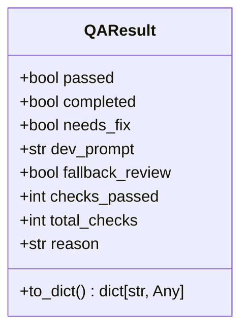
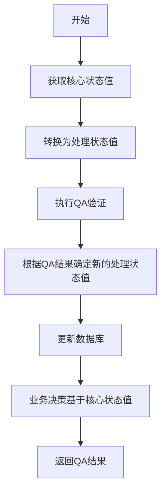
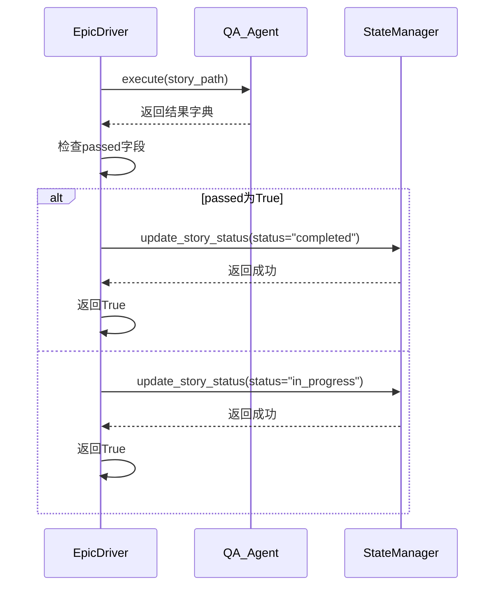
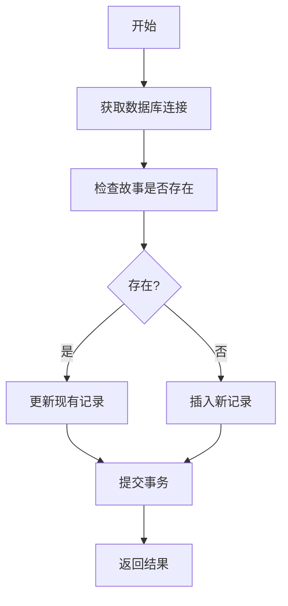
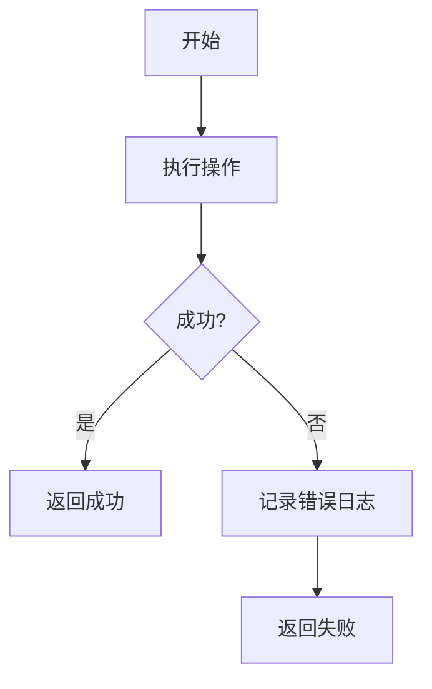
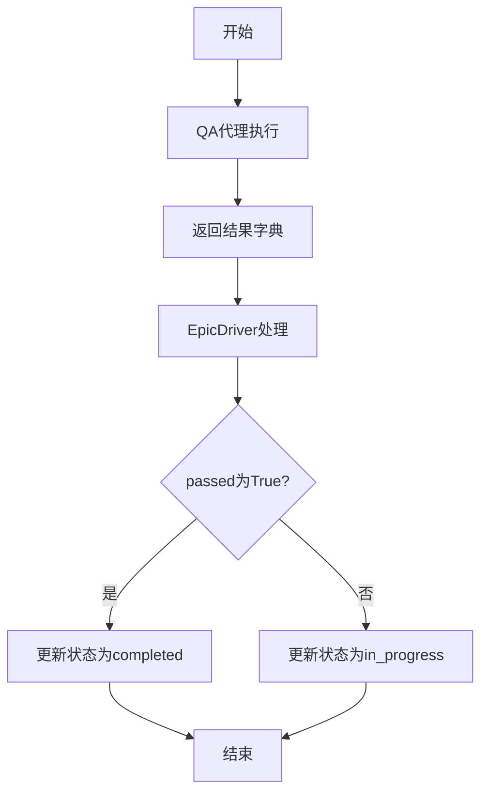

# QA代理与状态管理集成

<cite>
**本文档引用的文件**   
- [qa_agent.py](file://autoBMAD/epic_automation/qa_agent.py)
- [epic_driver.py](file://autoBMAD/epic_automation/epic_driver.py)
- [state_manager.py](file://autoBMAD/epic_automation/state_manager.py)
- [story_parser.py](file://autoBMAD/epic_automation/story_parser.py)
- [qa_tools_integration.py](file://autoBMAD/epic_automation/qa_tools_integration.py)
</cite>

## 目录
1. [引言](#引言)
2. [QAResult类结构与状态决策](#qarresult类结构与状态决策)
3. [QA代理执行流程](#qa代理执行流程)
4. [EpicDriver中的QA结果处理](#epicdriver中的qa结果处理)
5. [状态管理器更新机制](#状态管理器更新机制)
6. [数据流完整示例](#数据流完整示例)
7. [异常处理机制](#异常处理机制)
8. [集成流程图](#集成流程图)

## 引言
本文档深入分析QA代理与状态管理器的集成机制，重点阐述`qa_agent.execute`方法返回的完整结果字典如何被`epic_driver`接收和处理。详细描述`QAResult`类的结构及其在状态决策中的作用，包括`passed`、`completed`、`needs_fix`等字段的含义。说明`state_manager.update_story_status`如何根据QA结果更新故事状态。提供代码示例，展示从`qa_agent.execute`返回结果到状态更新的完整数据流。解释在集成过程中可能出现的异常及其处理方式。

## QAResult类结构与状态决策

`QAResult`类是QA代理执行结果的核心数据结构，定义了QA验证的完整结果信息。该类在`qa_agent.py`文件中定义，包含多个关键字段用于状态决策。



**Diagram sources**
- [qa_agent.py](file://autoBMAD/epic_automation/qa_agent.py#L71-L105)

**Section sources**
- [qa_agent.py](file://autoBMAD/epic_automation/qa_agent.py#L71-L105)

### 字段含义

- **passed**: 布尔值，表示QA验证是否通过。`True`表示通过，`False`表示未通过。
- **completed**: 布尔值，表示故事是否已完成。`True`表示故事已完成，`False`表示仍在进行中。
- **needs_fix**: 布尔值，表示是否需要修复。`True`表示需要修复，`False`表示无需修复。
- **dev_prompt**: 字符串，包含开发代理的提示信息，用于指导后续开发工作。
- **fallback_review**: 布尔值，表示是否使用了回退审查机制。
- **checks_passed**: 整数，表示通过的检查项数量。
- **total_checks**: 整数，表示总检查项数量。
- **reason**: 字符串，包含QA结果的原因说明。

这些字段共同构成了QA验证的完整结果，为后续的状态决策提供了依据。

## QA代理执行流程

QA代理的执行流程由`execute`方法实现，该方法返回一个包含QA结果的字典。执行流程包括获取核心状态值、转换为处理状态值、执行QA验证、更新数据库和业务决策等步骤。



**Diagram sources**
- [qa_agent.py](file://autoBMAD/epic_automation/qa_agent.py#L222-L328)

**Section sources**
- [qa_agent.py](file://autoBMAD/epic_automation/qa_agent.py#L222-L328)

### 执行步骤

1. **获取核心状态值**: 从故事文档中解析状态值，使用`_parse_story_status`方法。
2. **转换为处理状态值**: 将核心状态值转换为程序内部使用的处理状态值。
3. **执行QA验证**: 调用`QAAutomationWorkflow`执行QA检查。
4. **确定新的处理状态值**: 根据QA结果确定新的处理状态值。
5. **更新数据库**: 调用`state_manager.update_story_status`更新数据库。
6. **业务决策**: 基于核心状态值进行业务决策。

## EpicDriver中的QA结果处理

`epic_driver.py`文件中的`execute_qa_phase`方法负责处理QA代理返回的结果。该方法接收`qa_agent.execute`返回的字典，并根据结果决定后续流程。



**Diagram sources**
- [epic_driver.py](file://autoBMAD/epic_automation/epic_driver.py#L1211-L1262)

**Section sources**
- [epic_driver.py](file://autoBMAD/epic_automation/epic_driver.py#L1211-L1262)

### 处理逻辑

1. 调用`qa_agent.execute`方法执行QA验证。
2. 检查返回结果中的`passed`字段。
3. 如果`passed`为`True`，调用`state_manager.update_story_status`将状态更新为`completed`。
4. 如果`passed`为`False`，调用`state_manager.update_story_status`将状态更新为`in_progress`。
5. 返回处理结果。

## 状态管理器更新机制

`state_manager.py`文件中的`update_story_status`方法负责更新故事状态。该方法接收故事路径、状态值和其他元数据，并将这些信息存储到数据库中。



**Diagram sources**
- [state_manager.py](file://autoBMAD/epic_automation/state_manager.py#L203-L349)

**Section sources**
- [state_manager.py](file://autoBMAD/epic_automation/state_manager.py#L203-L349)

### 更新流程

1. 获取数据库连接。
2. 检查故事是否存在。
3. 如果存在，更新现有记录；如果不存在，插入新记录。
4. 提交事务。
5. 返回更新结果。

## 数据流完整示例

以下是一个从`qa_agent.execute`返回结果到状态更新的完整数据流示例：

```python
# QA代理执行
qa_result = await qa_agent.execute(story_path)

# 返回结果示例
{
    "passed": True,
    "completed": True,
    "needs_fix": False,
    "dev_prompt": None,
    "fallback_review": False,
    "checks_passed": 3,
    "total_checks": 3,
    "reason": "All checks passed"
}

# EpicDriver处理结果
if qa_result.get("passed", False):
    await state_manager.update_story_status(
        story_path=story_path, 
        status="completed"
    )
else:
    await state_manager.update_story_status(
        story_path=story_path, 
        status="in_progress"
    )
```

**Section sources**
- [qa_agent.py](file://autoBMAD/epic_automation/qa_agent.py#L222-L328)
- [epic_driver.py](file://autoBMAD/epic_automation/epic_driver.py#L1211-L1262)
- [state_manager.py](file://autoBMAD/epic_automation/state_manager.py#L203-L349)

## 异常处理机制

在集成过程中，可能会出现各种异常情况，系统通过以下机制进行处理：

1. **QA代理异常**: 在`qa_agent.execute`方法中捕获异常，并返回包含错误信息的结果字典。
2. **状态管理器异常**: 在`update_story_status`方法中捕获异常，并记录错误日志。
3. **数据库连接异常**: 使用连接池和死锁检测器确保数据库操作的稳定性。



**Diagram sources**
- [qa_agent.py](file://autoBMAD/epic_automation/qa_agent.py#L320-L328)
- [state_manager.py](file://autoBMAD/epic_automation/state_manager.py#L249-L261)

**Section sources**
- [qa_agent.py](file://autoBMAD/epic_automation/qa_agent.py#L320-L328)
- [state_manager.py](file://autoBMAD/epic_automation/state_manager.py#L249-L261)

## 集成流程图

以下是QA代理与状态管理器集成的完整流程图：



**Diagram sources**
- [qa_agent.py](file://autoBMAD/epic_automation/qa_agent.py#L222-L328)
- [epic_driver.py](file://autoBMAD/epic_automation/epic_driver.py#L1211-L1262)
- [state_manager.py](file://autoBMAD/epic_automation/state_manager.py#L203-L349)