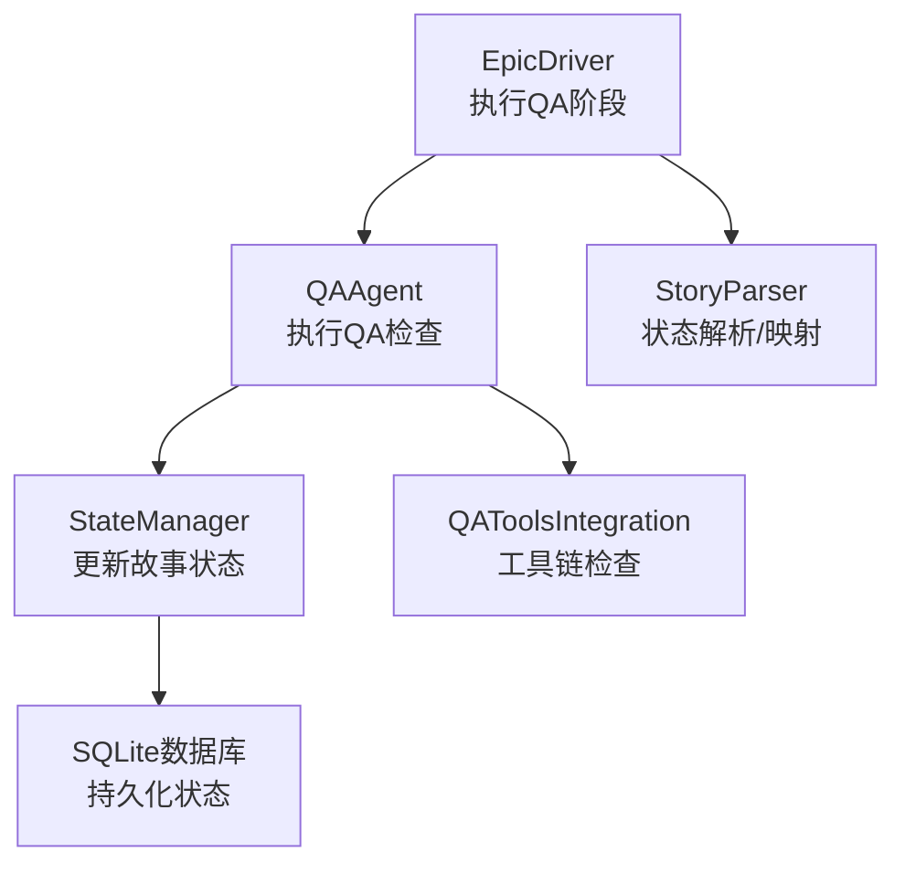
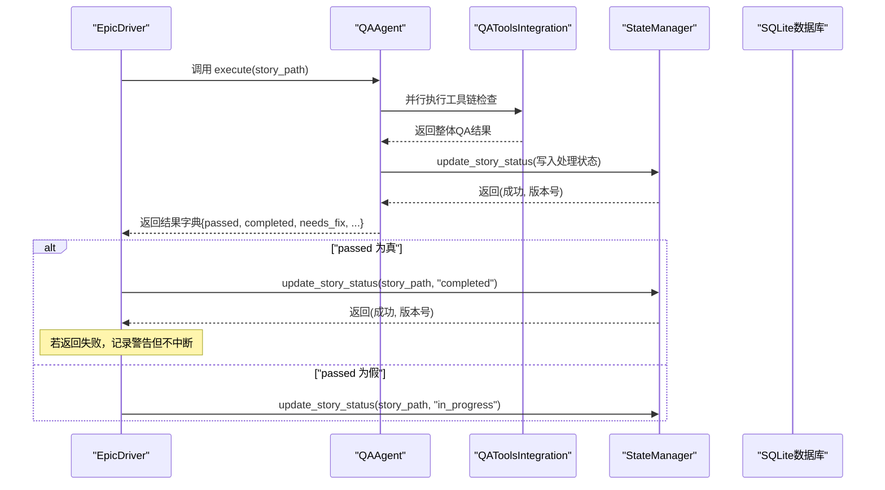
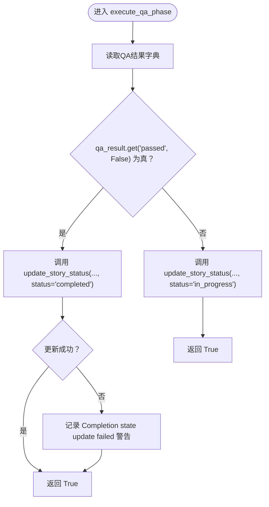
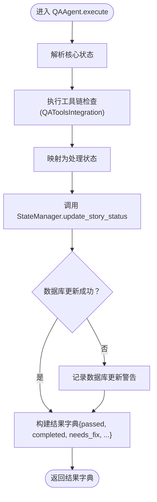
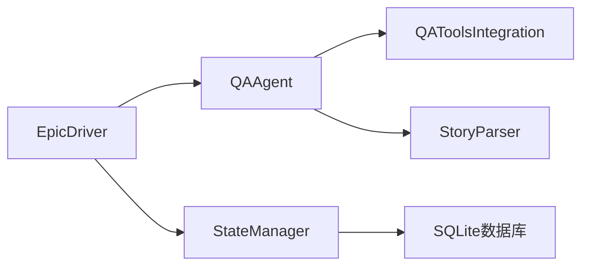

# QA结果处理逻辑

<cite>
**本文引用的文件**
- [epic_driver.py](file://autoBMAD/epic_automation/epic_driver.py)
- [qa_agent.py](file://autoBMAD/epic_automation/qa_agent.py)
- [state_manager.py](file://autoBMAD/epic_automation/state_manager.py)
- [story_parser.py](file://autoBMAD/epic_automation/story_parser.py)
- [qa_tools_integration.py](file://autoBMAD/epic_automation/qa_tools_integration.py)
</cite>

## 目录
1. [简介](#简介)
2. [项目结构](#项目结构)
3. [核心组件](#核心组件)
4. [架构总览](#架构总览)
5. [详细组件分析](#详细组件分析)
6. [依赖关系分析](#依赖关系分析)
7. [性能考量](#性能考量)
8. [故障排查指南](#故障排查指南)
9. [结论](#结论)

## 简介
本文件聚焦于QA结果处理逻辑，围绕“execute_qa_phase”函数如何通过“qa_result.get('passed', False)”判断验证是否通过，并进一步调用“state_manager.update_story_status”更新故事状态为“completed”或“in_progress”。同时，文档阐述状态更新失败时的警告处理机制，给出QA成功与失败两条不同状态更新路径的实际代码示例路径，并说明在QA通过、失败和异常时的日志记录策略。

## 项目结构
与QA结果处理直接相关的模块与职责如下：
- epic_driver.py：编排层，负责执行QA阶段，依据QA结果调用状态管理器更新故事状态。
- qa_agent.py：QA执行层，负责执行QA检查、生成结果字典，并提供简化版的QA阶段执行入口。
- state_manager.py：状态持久化层，提供更新/查询故事状态的能力，支持乐观锁与连接池。
- story_parser.py：状态解析与映射层，提供核心状态与处理状态之间的转换。
- qa_tools_integration.py：QA工具集成层，封装基于工具链的自动化检查流程。

图表来源
- [epic_driver.py](file://autoBMAD/epic_automation/epic_driver.py#L1211-L1262)
- [qa_agent.py](file://autoBMAD/epic_automation/qa_agent.py#L222-L329)
- [state_manager.py](file://autoBMAD/epic_automation/state_manager.py#L203-L349)
- [story_parser.py](file://autoBMAD/epic_automation/story_parser.py#L80-L124)
- [qa_tools_integration.py](file://autoBMAD/epic_automation/qa_tools_integration.py#L583-L741)

章节来源
- [epic_driver.py](file://autoBMAD/epic_automation/epic_driver.py#L1211-L1262)
- [qa_agent.py](file://autoBMAD/epic_automation/qa_agent.py#L222-L329)
- [state_manager.py](file://autoBMAD/epic_automation/state_manager.py#L203-L349)
- [story_parser.py](file://autoBMAD/epic_automation/story_parser.py#L80-L124)
- [qa_tools_integration.py](file://autoBMAD/epic_automation/qa_tools_integration.py#L583-L741)

## 核心组件
- EpicDriver.execute_qa_phase：QA阶段入口，依据QA结果字典中的“passed”字段决定后续状态更新。
- QAAgent.execute：QA执行主流程，返回包含“passed”“completed”“needs_fix”等键的结果字典；并在内部调用StateManager更新数据库状态。
- StateManager.update_story_status：原子性地更新或插入故事状态，支持超时、取消与错误处理。
- StoryParser.ProcessingStatus：统一的处理状态枚举，用于内部状态流转。
- QAToolsIntegration：并行运行工具链检查，汇总整体QA状态。

章节来源
- [epic_driver.py](file://autoBMAD/epic_automation/epic_driver.py#L1211-L1262)
- [qa_agent.py](file://autoBMAD/epic_automation/qa_agent.py#L222-L329)
- [state_manager.py](file://autoBMAD/epic_automation/state_manager.py#L203-L349)
- [story_parser.py](file://autoBMAD/epic_automation/story_parser.py#L80-L124)
- [qa_tools_integration.py](file://autoBMAD/epic_automation/qa_tools_integration.py#L583-L741)

## 架构总览
下图展示了QA阶段从入口到状态更新的关键调用链路与数据流。

图表来源
- [epic_driver.py](file://autoBMAD/epic_automation/epic_driver.py#L1211-L1262)
- [qa_agent.py](file://autoBMAD/epic_automation/qa_agent.py#L222-L329)
- [state_manager.py](file://autoBMAD/epic_automation/state_manager.py#L203-L349)
- [qa_tools_integration.py](file://autoBMAD/epic_automation/qa_tools_integration.py#L583-L741)

## 详细组件分析

### execute_qa_phase 的状态判定与更新路径
- 判定依据：函数读取QA结果字典，通过“qa_result.get('passed', False)”判断是否通过。
- 通过路径：
  - 记录“QA phase passed”日志；
  - 调用“state_manager.update_story_status(story_path, status='completed')”；
  - 若状态更新返回失败，记录“Completion state update failed”警告，但仍视为QA通过。
- 失败路径：
  - 记录“QA phase failed”日志；
  - 调用“state_manager.update_story_status(story_path, status='in_progress')”。

图表来源
- [epic_driver.py](file://autoBMAD/epic_automation/epic_driver.py#L1211-L1262)

章节来源
- [epic_driver.py](file://autoBMAD/epic_automation/epic_driver.py#L1211-L1262)

### QAAgent.execute 的结果字典与内部状态更新
- QAAgent.execute 返回字典，包含“passed”“completed”“needs_fix”等键，供上层决策使用。
- 在内部，QAAgent会将工具链检查结果映射为处理状态，并调用StateManager更新数据库状态。
- 若内部更新失败，记录“Failed to update database”警告，不影响上层对“passed”的判断。

图表来源
- [qa_agent.py](file://autoBMAD/epic_automation/qa_agent.py#L222-L329)
- [state_manager.py](file://autoBMAD/epic_automation/state_manager.py#L203-L349)
- [qa_tools_integration.py](file://autoBMAD/epic_automation/qa_tools_integration.py#L583-L741)

章节来源
- [qa_agent.py](file://autoBMAD/epic_automation/qa_agent.py#L222-L329)
- [state_manager.py](file://autoBMAD/epic_automation/state_manager.py#L203-L349)
- [qa_tools_integration.py](file://autoBMAD/epic_automation/qa_tools_integration.py#L583-L741)

### 状态更新失败的警告处理机制
- EpicDriver在调用“update_story_status”后，若返回失败（布尔值为False），会记录“Completion state update failed”警告，但不会中断流程，仍返回True表示QA阶段本身已执行完成。
- StateManager.update_story_status对超时、取消与异常均进行捕获与日志记录，返回(False, None)，便于上层感知失败并采取降级措施。

章节来源
- [epic_driver.py](file://autoBMAD/epic_automation/epic_driver.py#L1236-L1255)
- [state_manager.py](file://autoBMAD/epic_automation/state_manager.py#L232-L260)

### 日志记录策略
- QA通过：
  - 记录“QA phase passed”信息日志；
  - 若状态更新失败，记录“Completion state update failed”警告。
- QA失败：
  - 记录“QA phase failed”信息日志；
  - 设置状态为“in_progress”。
- 异常：
  - 记录“QA phase failed”错误日志；
  - 设置状态为“error”。

章节来源
- [epic_driver.py](file://autoBMAD/epic_automation/epic_driver.py#L1211-L1262)

## 依赖关系分析
- EpicDriver依赖QAAgent与StateManager，前者负责编排，后者负责状态持久化。
- QAAgent依赖QAToolsIntegration与StoryParser，前者产出整体QA状态，后者提供状态映射。
- StateManager依赖SQLite数据库，提供线程安全与乐观锁能力。

图表来源
- [epic_driver.py](file://autoBMAD/epic_automation/epic_driver.py#L1211-L1262)
- [qa_agent.py](file://autoBMAD/epic_automation/qa_agent.py#L222-L329)
- [state_manager.py](file://autoBMAD/epic_automation/state_manager.py#L203-L349)
- [story_parser.py](file://autoBMAD/epic_automation/story_parser.py#L80-L124)
- [qa_tools_integration.py](file://autoBMAD/epic_automation/qa_tools_integration.py#L583-L741)

章节来源
- [epic_driver.py](file://autoBMAD/epic_automation/epic_driver.py#L1211-L1262)
- [qa_agent.py](file://autoBMAD/epic_automation/qa_agent.py#L222-L329)
- [state_manager.py](file://autoBMAD/epic_automation/state_manager.py#L203-L349)
- [story_parser.py](file://autoBMAD/epic_automation/story_parser.py#L80-L124)
- [qa_tools_integration.py](file://autoBMAD/epic_automation/qa_tools_integration.py#L583-L741)

## 性能考量
- 并行工具链检查：QAToolsIntegration通过并发运行BasedPyright与Fixtest，缩短整体QA耗时。
- 连接池与锁：StateManager使用连接池与锁保护数据库操作，降低锁竞争与阻塞风险。
- 超时与取消：StateManager对更新操作设置超时与取消处理，避免长时间阻塞。

章节来源
- [qa_tools_integration.py](file://autoBMAD/epic_automation/qa_tools_integration.py#L620-L664)
- [state_manager.py](file://autoBMAD/epic_automation/state_manager.py#L59-L125)
- [state_manager.py](file://autoBMAD/epic_automation/state_manager.py#L232-L260)

## 故障排查指南
- QA通过但状态未更新：
  - 检查“Completion state update failed”警告日志；
  - 确认StateManager.update_story_status返回值与异常堆栈；
  - 核对数据库连接池与锁状态。
- QA失败但状态未回滚：
  - 检查“QA phase failed”日志；
  - 确认调用“update_story_status(..., status='in_progress')”是否被执行。
- 异常导致QA阶段失败：
  - 检查“QA phase failed”错误日志；
  - 确认异常被捕获并设置状态为“error”。

章节来源
- [epic_driver.py](file://autoBMAD/epic_automation/epic_driver.py#L1211-L1262)
- [state_manager.py](file://autoBMAD/epic_automation/state_manager.py#L232-L260)

## 结论
- “execute_qa_phase”通过“qa_result.get('passed', False)”进行快速判定，确保流程简洁可靠。
- 成功路径将状态更新为“completed”，失败路径回滚为“in_progress”，并提供完善的日志与警告机制。
- StateManager提供健壮的更新保障，即便出现异常或超时，也能通过日志与返回值辅助定位问题。
- 工具链检查采用并行策略，显著提升整体效率，配合状态映射与解析模块，形成清晰、可维护的QA处理闭环。