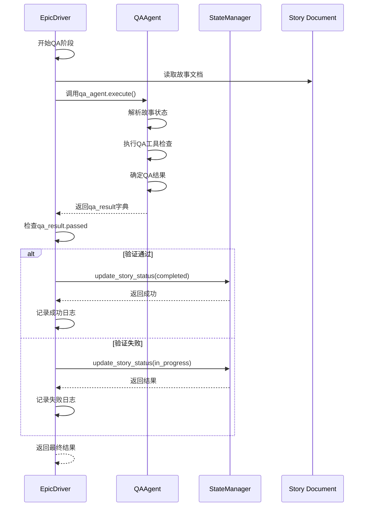
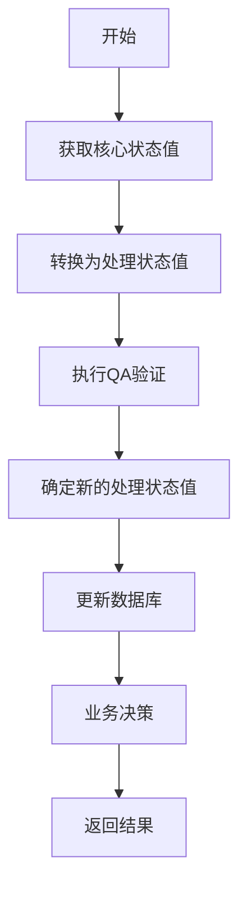

# QA验证

<cite>
**本文档引用的文件**   
- [qa_agent.py](file://autoBMAD/epic_automation/qa_agent.py)
- [epic_driver.py](file://autoBMAD/epic_automation/epic_driver.py)
- [state_manager.py](file://autoBMAD/epic_automation/state_manager.py)
- [qa_tools_integration.py](file://autoBMAD/epic_automation/qa_tools_integration.py)
- [story_parser.py](file://autoBMAD/epic_automation/story_parser.py)
</cite>

## 目录
1. [执行流程](#执行流程)
2. [QA结果处理逻辑](#qa结果处理逻辑)
3. [QA代理与状态管理器的集成](#qa代理与状态管理器的集成)
4. [日志记录策略](#日志记录策略)
5. [异常处理](#异常处理)

## 执行流程

`execute_qa_phase` 函数是QA验证阶段的核心执行方法，其主要职责是协调QA代理与状态管理器，完成对故事文档的验证。该函数在 `epic_driver.py` 文件中定义，作为 `EpicDriver` 类的一个方法。

执行流程如下：
1. 读取指定路径的故事文档内容。
2. 调用 `qa_agent.execute` 方法执行完整的QA验证流程。
3. 根据 `qa_result.get('passed', False)` 的布尔值判断验证是否通过。
4. 如果通过，则调用 `state_manager.update_story_status` 将故事状态更新为 `completed`。
5. 如果未通过或发生异常，则进行相应的状态更新和错误处理。



**图示来源**
- [epic_driver.py](file://autoBMAD/epic_automation/epic_driver.py#L1210-L1261)
- [qa_agent.py](file://autoBMAD/epic_automation/qa_agent.py#L221-L327)
- [state_manager.py](file://autoBMAD/epic_automation/state_manager.py#L203-L261)

**本节来源**
- [epic_driver.py](file://autoBMAD/epic_automation/epic_driver.py#L1210-L1261)

## QA结果处理逻辑

QA结果的处理逻辑是整个验证阶段的核心，它决定了故事的后续走向。处理逻辑主要基于 `qa_result` 字典中的 `passed` 键值。

### 验证通过的处理

当 `qa_result.get('passed', False)` 为 `True` 时，表示QA验证成功。此时，系统会尝试将故事的状态更新为 `completed`。

```python
if qa_result.get("passed", False):
    logger.info(f"QA phase passed for {story_path}")
    completion_state_update_success = (
        await self.state_manager.update_story_status(
            story_path=story_path, status="completed"
        )
    )
    if not completion_state_update_success:
        logger.warning(
            f"Completion state update failed for {story_path} but QA passed successfully"
        )
    return True
```

此逻辑在 `epic_driver.py` 的 `execute_qa_phase` 方法中实现。即使状态更新失败，只要QA验证本身通过，函数仍会返回 `True`，并记录警告日志，确保流程不会因状态更新的次要问题而中断。

### 验证失败的处理

当 `qa_result.get('passed', False)` 为 `False` 时，表示QA验证失败。此时，系统会将故事的状态重置为 `in_progress`，以便开发代理可以继续进行修复。

```python
else:
    logger.info(f"QA phase failed for {story_path}, setting in_progress")
    await self.state_manager.update_story_status(
        story_path=story_path, status="in_progress"
    )
    return True
```

值得注意的是，无论验证成功或失败，该函数在正常执行时都返回 `True`。只有在发生异常时才会返回 `False`。

**本节来源**
- [epic_driver.py](file://autoBMAD/epic_automation/epic_driver.py#L1235-L1254)

## QA代理与状态管理器的集成

QA代理（`QAAgent`）与状态管理器（`StateManager`）的集成是通过 `execute` 方法和 `update_story_status` 方法实现的。这种集成确保了QA结果能够被持久化并影响后续的业务流程。

### QA代理的执行流程

`QAAgent.execute` 方法是整个QA验证的入口点。它遵循一个六步流程：
1.  **获取核心状态值**：从故事文档中解析出人类可读的状态（如 "Ready for Review"）。
2.  **转换为处理状态值**：将核心状态值转换为程序内部使用的处理状态值（如 "review"）。
3.  **执行QA验证**：调用 `QAAutomationWorkflow` 运行基于 `BasedPyright-Workflow` 和 `Fixtest-Workflow` 的自动化检查。
4.  **确定新的处理状态值**：根据工具检查的综合结果，确定新的处理状态（如 `QA_PASS`, `QA_FAIL`）。
5.  **更新数据库**：调用 `StateManager` 的 `update_story_status` 方法，将新的处理状态值写入数据库。
6.  **业务决策**：基于原始的核心状态值做出最终的业务决策（如是否跳过QA）。



**图示来源**
- [qa_agent.py](file://autoBMAD/epic_automation/qa_agent.py#L230-L236)
- [qa_tools_integration.py](file://autoBMAD/epic_automation/qa_tools_integration.py#L607-L663)
- [state_manager.py](file://autoBMAD/epic_automation/state_manager.py#L203-L261)

### QA结果的存储

`qa_agent.execute` 方法返回的完整结果字典包含了丰富的信息，这些信息最终会被存储到状态管理器的数据库中。

`QAAutomationWorkflow.run_qa_checks` 方法会并行运行 `BasedPyright` 和 `Fixtest` 两个检查，并将它们的结果汇总成一个包含 `overall_status`、`basedpyright`、`fixtest` 和 `summary` 的完整字典。这个字典在 `QAAgent.execute` 方法中被序列化为JSON字符串，并作为 `qa_result` 字段存入数据库。

```python
# 在 qa_tools_integration.py 中
results = {
    "timestamp": datetime.now().isoformat(),
    "basedpyright": basedpyright_result,
    "fixtest": fixtest_result,
    "overall_status": overall_status.value,
    "summary": self._generate_summary(basedpyright_result, fixtest_result, overall_status),
}
```

**本节来源**
- [qa_agent.py](file://autoBMAD/epic_automation/qa_agent.py#L221-L327)
- [qa_tools_integration.py](file://autoBMAD/epic_automation/qa_tools_integration.py#L607-L663)
- [state_manager.py](file://autoBMAD/epic_automation/state_manager.py#L288-L290)

## 日志记录策略

日志记录策略对于调试和监控系统行为至关重要。系统在QA验证的不同阶段记录了不同级别的日志信息。

### QA通过时的日志

当QA验证通过时，系统会记录一条 `INFO` 级别的日志，明确指出验证已通过。

```python
logger.info(f"QA phase passed for {story_path}")
```

### QA失败时的日志

当QA验证失败时，系统同样会记录一条 `INFO` 级别的日志，说明验证失败并已将状态重置。

```python
logger.info(f"QA phase failed for {story_path}, setting in_progress")
```

### 异常发生时的日志

当在执行QA阶段发生异常时，系统会记录一条 `ERROR` 级别的日志，包含异常的详细信息，并将故事状态更新为 `error`。

```python
except Exception as e:
    logger.error(f"QA phase failed for {story_path}: {e}")
    await self.state_manager.update_story_status(
        story_path=story_path, status="error", error=str(e)
    )
    return False
```

此外，`QAAgent` 内部也会记录详细的日志，例如在解析状态、执行AI审查或进行回退检查时，都会使用 `logger.info` 或 `logger.debug` 进行记录。

**本节来源**
- [epic_driver.py](file://autoBMAD/epic_automation/epic_driver.py#L1237-L1260)
- [qa_agent.py](file://autoBMAD/epic_automation/qa_agent.py#L247-L255)

## 异常处理

异常处理机制确保了系统的健壮性。`execute_qa_phase` 函数使用了 `try...except` 块来捕获所有可能的异常。

如果在执行过程中发生任何异常（如文件读取错误、网络问题或内部逻辑错误），函数会：
1.  记录一条 `ERROR` 级别的日志。
2.  调用 `state_manager.update_story_status` 将故事状态更新为 `error`，并附带错误信息。
3.  返回 `False`，向调用者表明整个QA阶段执行失败。

这种设计将异常处理与正常流程分离，确保了即使在出现问题时，系统状态也能被正确地反映在数据库中，便于后续的排查和恢复。

**本节来源**
- [epic_driver.py](file://autoBMAD/epic_automation/epic_driver.py#L1256-L1261)