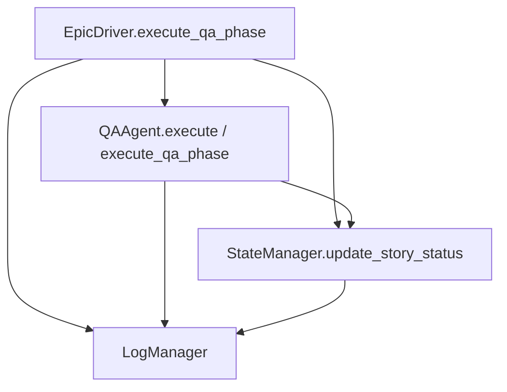
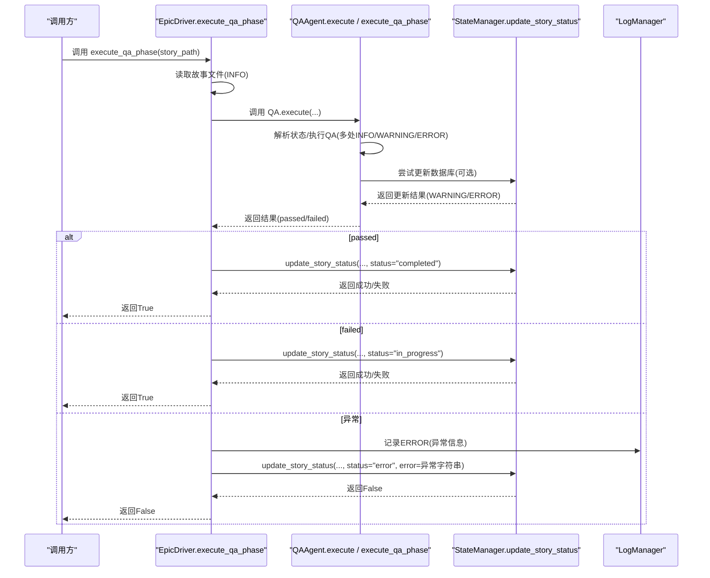
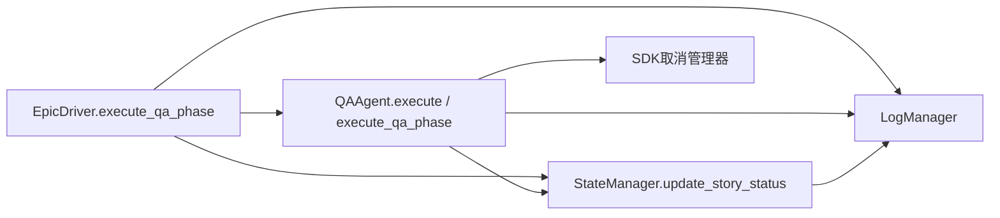

# 异常处理与日志记录

<cite>
**本文引用的文件**
- [epic_driver.py](file://autoBMAD/epic_automation/epic_driver.py)
- [state_manager.py](file://autoBMAD/epic_automation/state_manager.py)
- [qa_agent.py](file://autoBMAD/epic_automation/qa_agent.py)
- [log_manager.py](file://autoBMAD/epic_automation/log_manager.py)
- [sdk-cancellation-manager-implementation.md](file://docs-copy/architecture/sdk-cancellation-manager-implementation.md)
</cite>

## 目录
1. [简介](#简介)
2. [项目结构](#项目结构)
3. [核心组件](#核心组件)
4. [架构总览](#架构总览)
5. [详细组件分析](#详细组件分析)
6. [依赖关系分析](#依赖关系分析)
7. [性能考量](#性能考量)
8. [故障排查指南](#故障排查指南)
9. [结论](#结论)

## 简介
本章节聚焦于QA验证阶段的异常处理与日志记录机制，围绕以下目标展开：
- 深入解释在 execute_qa_phase 方法中如何捕获和处理异常
- 详细说明当发生异常时，如何通过 state_manager.update_story_status 将故事状态更新为“error”，并记录错误信息
- 明确不同级别的日志策略：INFO（流程日志）、WARNING（非阻塞性警告）、ERROR（严重错误）
- 提供从异常捕获到状态更新与日志记录的完整处理流程图
- 列举常见异常场景及其对应的日志信息与状态更新行为

## 项目结构
与QA验证阶段异常处理直接相关的核心模块如下：
- EpicDriver.execute_qa_phase：QA阶段入口，负责读取故事文件、调用QA代理、根据结果更新状态，并在异常时统一设置为“error”
- QAAgent.execute / execute_qa_phase：QA代理执行流程，包含状态解析、工具集成、数据库更新尝试与异常捕获
- StateManager.update_story_status/_update_story_internal：状态持久化与并发控制，提供乐观锁、超时与取消保护
- LogManager：统一日志系统，支持双写（控制台+文件）、异常追踪、SDK消息记录与状态重同步日志
- SDK取消管理器：对SDK调用进行跟踪、监控与清理，辅助定位取消与异常场景

图表来源
- [epic_driver.py](file://autoBMAD/epic_automation/epic_driver.py#L1211-L1262)
- [qa_agent.py](file://autoBMAD/epic_automation/qa_agent.py#L221-L358)
- [state_manager.py](file://autoBMAD/epic_automation/state_manager.py#L202-L347)
- [log_manager.py](file://autoBMAD/epic_automation/log_manager.py#L1-L215)

章节来源
- [epic_driver.py](file://autoBMAD/epic_automation/epic_driver.py#L1211-L1262)
- [qa_agent.py](file://autoBMAD/epic_automation/qa_agent.py#L221-L358)
- [state_manager.py](file://autoBMAD/epic_automation/state_manager.py#L202-L347)
- [log_manager.py](file://autoBMAD/epic_automation/log_manager.py#L1-L215)

## 核心组件
- EpicDriver.execute_qa_phase
  - 功能：读取故事文件，调用QA代理执行，依据结果更新状态；异常时统一设置为“error”
  - 关键点：INFO级别记录开始与结果；ERROR级别记录异常；调用 state_manager.update_story_status 并传入错误字符串
- QAAgent.execute / execute_qa_phase
  - 功能：解析故事状态、执行QA工具链、尝试更新数据库、业务决策；异常时记录ERROR并返回失败
  - 关键点：INFO/WARNING/ERROR多级日志；数据库更新失败时记录WARNING
- StateManager.update_story_status/_update_story_internal
  - 功能：线程安全地更新/插入故事状态，支持乐观锁、超时与取消保护；异常时记录ERROR并返回False
- LogManager
  - 功能：统一日志输出、异常追踪、SDK消息记录、状态重同步日志；支持双写与刷新
- SDK取消管理器
  - 功能：对SDK调用进行生命周期跟踪、取消检测、清理与统计，辅助定位“成功后取消”等边界情况

章节来源
- [epic_driver.py](file://autoBMAD/epic_automation/epic_driver.py#L1211-L1262)
- [qa_agent.py](file://autoBMAD/epic_automation/qa_agent.py#L221-L358)
- [state_manager.py](file://autoBMAD/epic_automation/state_manager.py#L202-L347)
- [log_manager.py](file://autoBMAD/epic_automation/log_manager.py#L1-L215)
- [sdk-cancellation-manager-implementation.md](file://docs-copy/architecture/sdk-cancellation-manager-implementation.md#L105-L668)

## 架构总览
下面的序列图展示了QA阶段从异常捕获到状态更新与日志记录的完整流程。

图表来源
- [epic_driver.py](file://autoBMAD/epic_automation/epic_driver.py#L1211-L1262)
- [qa_agent.py](file://autoBMAD/epic_automation/qa_agent.py#L221-L358)
- [state_manager.py](file://autoBMAD/epic_automation/state_manager.py#L202-L347)
- [log_manager.py](file://autoBMAD/epic_automation/log_manager.py#L1-L215)

## 详细组件分析

### EpicDriver.execute_qa_phase 异常处理与状态更新
- 流程要点
  - 读取故事文件，调用 QA.execute
  - 若结果 passed 为真：INFO记录通过，尝试将状态更新为“completed”，若更新失败则记录WARNING
  - 若结果 passed 为假：INFO记录失败，将状态更新为“in_progress”
  - 捕获任何异常：ERROR记录异常，调用 state_manager.update_story_status(..., status="error", error=str(e))，返回False
- 日志级别
  - INFO：开始执行、通过/失败、最大循环警告
  - WARNING：状态更新失败、一致性检查不通过
  - ERROR：异常捕获、处理失败
- 状态更新行为
  - passed=True：completed
  - passed=False：in_progress
  - 异常：error（同时附带错误字符串）

章节来源
- [epic_driver.py](file://autoBMAD/epic_automation/epic_driver.py#L1211-L1262)

### QAAgent.execute / execute_qa_phase 的异常处理与日志
- 流程要点
  - 解析故事状态（INFO/WARNING/ERROR）
  - 执行QA工具链（ImportError时回退，INFO/WARNING/ERROR）
  - 尝试更新数据库（异常时记录WARNING）
  - 返回业务决策结果（passed/needs_fix/dev_prompt/reason）
  - execute_qa_phase 对外提供简化接口，异常时记录ERROR并返回False
- 日志级别
  - INFO：使用缓存状态、解析状态、工具链执行、数据库更新尝试
  - WARNING：无法解析状态、数据库更新失败、工具不可用、文件不存在
  - ERROR：解析状态异常、执行阶段异常、文件不存在
- 状态更新行为
  - 数据库更新由内部execute路径触发；对外execute_qa_phase仅返回布尔值

章节来源
- [qa_agent.py](file://autoBMAD/epic_automation/qa_agent.py#L221-L358)

### StateManager.update_story_status 的并发与错误处理
- 流程要点
  - update_story_status 包装内部更新逻辑，提供超时与取消保护（TimeoutError/CancelledError）
  - _update_story_internal 使用锁保护数据库操作，支持乐观锁（version对比）
  - 成功/失败均记录INFO/WARNING/ERROR，并返回(是否成功, 当前版本)
- 日志级别
  - INFO：插入/更新记录、版本号变化
  - WARNING：超时、取消、版本冲突
  - ERROR：其他异常
- 性能与可靠性
  - 锁粒度：按故事路径加锁，避免并发冲突
  - 乐观锁：通过version字段保证并发一致性
  - 超时控制：避免长时间阻塞

章节来源
- [state_manager.py](file://autoBMAD/epic_automation/state_manager.py#L202-L347)

### 日志系统与SDK取消管理
- LogManager
  - 提供统一日志输出、异常追踪（write_exception）、SDK消息记录（write_sdk_message）、状态重同步日志（log_state_resync）
  - 支持双写（控制台+文件）与flush
- SDK取消管理器
  - 对SDK调用进行生命周期跟踪，区分“完成前取消”与“成功后取消”，并提供等待取消完成的强制同步点
  - 有助于在QA阶段出现取消/异常时快速定位问题

章节来源
- [log_manager.py](file://autoBMAD/epic_automation/log_manager.py#L1-L215)
- [sdk-cancellation-manager-implementation.md](file://docs-copy/architecture/sdk-cancellation-manager-implementation.md#L105-L668)

## 依赖关系分析
- EpicDriver.execute_qa_phase 依赖
  - QAAgent.execute：执行QA并返回结果
  - StateManager.update_story_status：更新状态
  - 日志：INFO/WARNING/ERROR
- QAAgent.execute 依赖
  - 状态解析（AI/正则）
  - 工具链（QAAutomationWorkflow）
  - StateManager.update_story_status（内部路径）
  - 日志：INFO/WARNING/ERROR
- StateManager.update_story_status 依赖
  - _update_story_internal：锁保护与乐观锁
  - 数据库连接池/连接管理
  - 日志：INFO/WARNING/ERROR
- LogManager 与 SDK取消管理器
  - 作为QA阶段异常诊断与追踪的支撑工具

图表来源
- [epic_driver.py](file://autoBMAD/epic_automation/epic_driver.py#L1211-L1262)
- [qa_agent.py](file://autoBMAD/epic_automation/qa_agent.py#L221-L358)
- [state_manager.py](file://autoBMAD/epic_automation/state_manager.py#L202-L347)
- [log_manager.py](file://autoBMAD/epic_automation/log_manager.py#L1-L215)
- [sdk-cancellation-manager-implementation.md](file://docs-copy/architecture/sdk-cancellation-manager-implementation.md#L105-L668)

## 性能考量
- 锁竞争与超时
  - StateManager通过锁与乐观锁降低并发冲突风险；超时保护避免长时间阻塞
- 日志开销
  - 双写与频繁flush会带来I/O开销；建议在生产环境适当减少DEBUG级别日志量
- SDK取消与清理
  - SDK取消管理器提供等待取消完成的强制同步点，避免“成功后取消”带来的状态不一致

[本节为通用指导，无需列出具体文件来源]

## 故障排查指南
- 常见异常场景与日志/状态行为
  - 故事文件不存在
    - 日志：QAAgent.execute_qa_phase记录ERROR；EpicDriver.execute_qa_phase记录ERROR
    - 状态：EpicDriver在异常分支设置“error”
  - 状态解析失败
    - 日志：QAAgent._parse_story_status记录WARNING/ERROR
    - 行为：execute_qa_phase返回False，EpicDriver按异常路径设置“error”
  - 数据库更新失败
    - 日志：QAAgent记录WARNING；StateManager记录ERROR
    - 行为：EpicDriver在passed=True时仍可能记录WARNING（更新失败），但流程继续
  - SDK取消/异常
    - 日志：LogManager与SDK取消管理器记录取消事件与异常
    - 行为：EpicDriver在异常分支统一设置“error”
- 排查步骤
  - 查看LogManager生成的epic_*.log文件，定位ERROR级别异常
  - 检查StateManager数据库记录，确认状态与version是否符合预期
  - 使用SDK取消管理器报告，识别“成功后取消”等边界情况
  - 在QA代理路径中，关注WARNING级别提示（如工具不可用、文件不存在）

章节来源
- [epic_driver.py](file://autoBMAD/epic_automation/epic_driver.py#L1211-L1262)
- [qa_agent.py](file://autoBMAD/epic_automation/qa_agent.py#L221-L358)
- [state_manager.py](file://autoBMAD/epic_automation/state_manager.py#L202-L347)
- [log_manager.py](file://autoBMAD/epic_automation/log_manager.py#L1-L215)
- [sdk-cancellation-manager-implementation.md](file://docs-copy/architecture/sdk-cancellation-manager-implementation.md#L105-L668)

## 结论
- QA验证阶段的异常处理遵循“捕获—记录—更新—返回”的统一模式：任何异常都会被记录为ERROR，并将故事状态更新为“error”，确保流程可追踪、可恢复
- 日志体系采用分级策略：INFO用于流程与结果，WARNING用于非阻塞性问题，ERROR用于严重错误；LogManager与SDK取消管理器共同提供完整的诊断能力
- StateManager通过锁与乐观锁保障并发一致性，结合超时与取消保护提升稳定性
- 建议在生产环境中合理配置日志级别与I/O频率，优先保留ERROR与关键WARNING，以平衡可观测性与性能