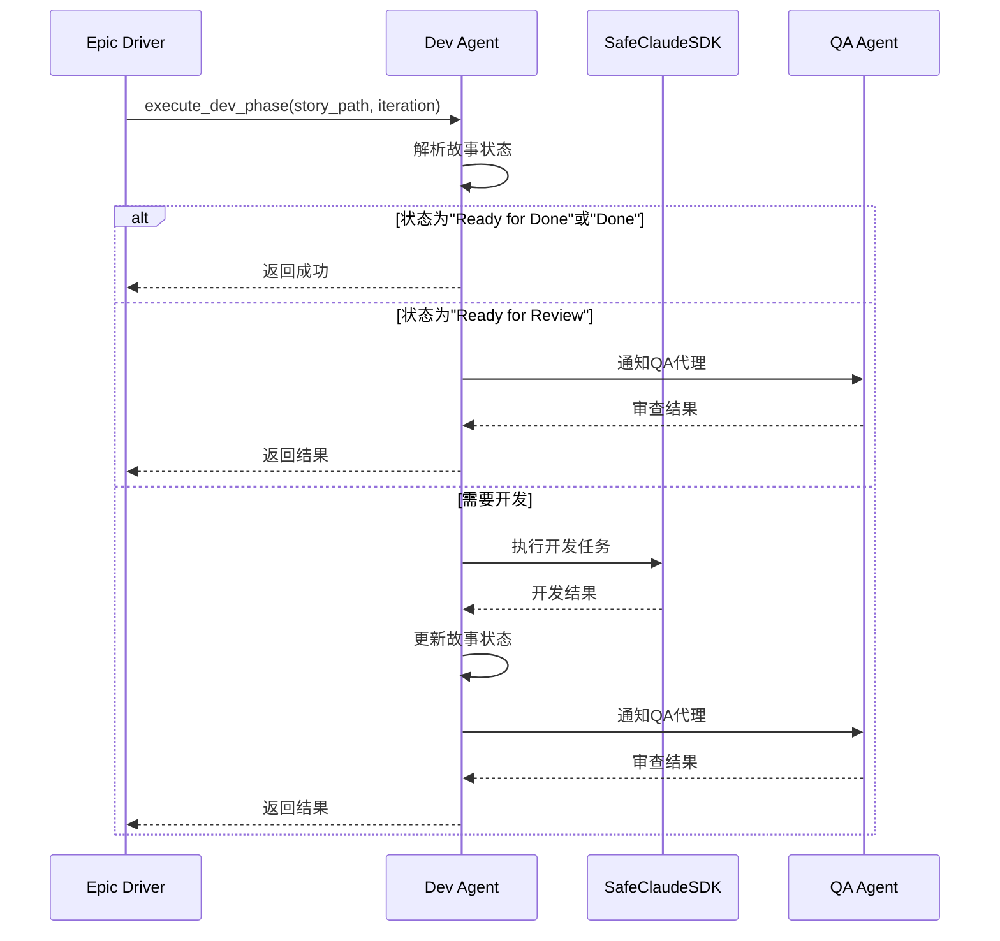
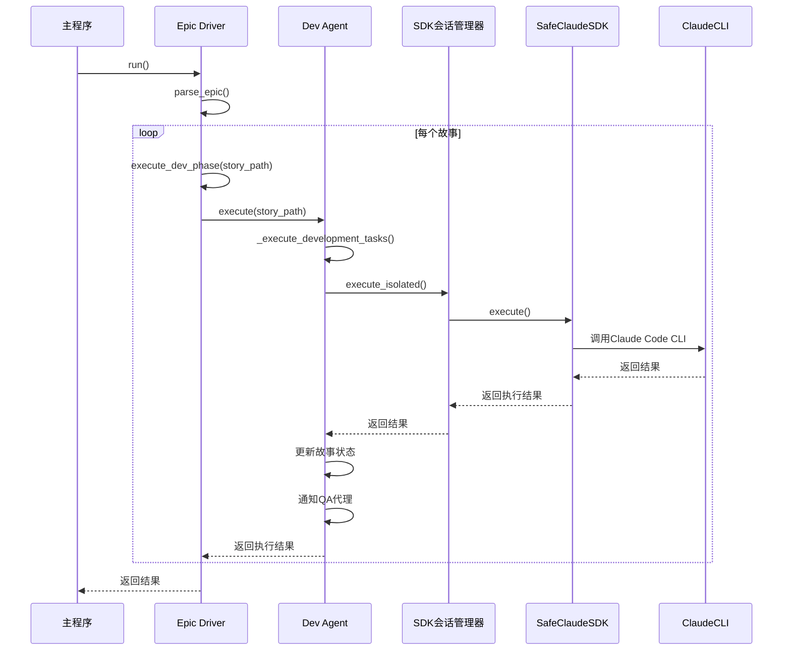

# 代理执行流程

<cite>
**本文档引用的文件**   
- [epic_driver.py](file://autoBMAD/epic_automation/epic_driver.py)
- [dev_agent.py](file://autoBMAD/epic_automation/dev_agent.py)
- [qa_agent.py](file://autoBMAD/epic_automation/qa_agent.py)
- [state_manager.py](file://autoBMAD/epic_automation/state_manager.py)
- [sdk_wrapper.py](file://autoBMAD/epic_automation/sdk_wrapper.py)
- [sdk_session_manager.py](file://autoBMAD/epic_automation/sdk_session_manager.py)
- [story_parser.py](file://autoBMAD/epic_automation/story_parser.py)
</cite>

## 目录
1. [代理执行流程概述](#代理执行流程概述)
2. [核心组件分析](#核心组件分析)
3. [`epic_driver`调用`dev_agent.execute`流程](#epic_driver调用dev_agentexecute流程)
4. [`dev_agent.execute`方法内部状态判断逻辑](#dev_agentexecute方法内部状态判断逻辑)
5. [`dev_agent`执行开发任务和通知QA代理的完整流程](#dev_agent执行开发任务和通知qa代理的完整流程)
6. [代码调用链示例](#代码调用链示例)
7. [`dev_agent`利用`SafeClaudeSDK`执行开发指令](#dev_agent利用safeclaudesdk执行开发指令)

## 代理执行流程概述

在BMAD自动化系统中，代理执行流程是驱动整个开发周期的核心机制。该流程由`epic_driver`作为主协调器，负责解析史诗（Epic）文档并驱动SM-Dev-QA循环。`epic_driver`通过调用`dev_agent.execute`方法来执行开发任务，而`dev_agent`则利用`SafeClaudeSDK`与Claude Code CLI进行交互，实现自动化开发。

该流程的关键在于状态驱动的执行机制。`dev_agent.execute`方法首先会解析故事文档中的状态值，根据状态决定是否跳过已为"Ready for Done"或"Done"状态的故事。对于需要开发的故事，`dev_agent`会执行开发任务，并在完成后通知QA代理进行审查。

## 核心组件分析

BMAD自动化系统由多个核心组件构成，它们协同工作以实现自动化开发流程。

**`epic_driver`** 是整个系统的主协调器，负责解析史诗文档、管理故事列表，并驱动SM-Dev-QA循环。它初始化并协调`sm_agent`、`dev_agent`、`qa_agent`和`state_manager`等组件。

**`dev_agent`** 负责处理开发任务和实现。它使用Claude Code CLI进行实际的开发实现，并集成任务指导进行开发特定操作。`dev_agent`通过`SafeClaudeSDK`与Claude Agent SDK进行交互。

**`qa_agent`** 负责质量保证审查。它执行QA检查，包括代码质量检查和测试执行，并根据结果决定是否需要重新开发。

**`state_manager`** 是基于SQLite的状态管理器，用于跟踪故事进度。它存储故事的状态、迭代次数、QA结果等信息。

**`SafeClaudeSDK`** 是Claude SDK的安全包装器，用于处理异步生成器的生命周期管理，防止在事件循环关闭时出现运行时错误。

**`sdk_session_manager`** 确保每个代理的SDK调用都是隔离的，防止取消作用域（cancel scope）跨代理传播。

**`story_parser`** 负责解析故事和史诗文档，提取故事ID、状态和其他元数据。

**Section sources**
- [epic_driver.py](file://autoBMAD/epic_automation/epic_driver.py#L535-L536)
- [dev_agent.py](file://autoBMAD/epic_automation/dev_agent.py#L57-L58)
- [qa_agent.py](file://autoBMAD/epic_automation/qa_agent.py#L109-L110)
- [state_manager.py](file://autoBMAD/epic_automation/state_manager.py#L97-L98)
- [sdk_wrapper.py](file://autoBMAD/epic_automation/sdk_wrapper.py#L300-L301)
- [sdk_session_manager.py](file://autoBMAD/epic_automation/sdk_session_manager.py#L193-L194)
- [story_parser.py](file://autoBMAD/epic_automation/story_parser.py#L213-L214)

## `epic_driver`调用`dev_agent.execute`流程

`epic_driver`通过`execute_dev_phase`函数调用`dev_agent.execute`方法来执行开发阶段。这个过程是整个开发-审查循环的关键部分。

当`epic_driver`需要执行开发阶段时，它会调用`execute_dev_phase`函数，该函数接受故事路径和迭代次数作为参数。在函数内部，`epic_driver`首先记录开发阶段的开始，然后调用`dev_agent.execute`方法。

`dev_agent.execute`方法是开发代理的主要入口点。它接收故事路径作为参数，并根据故事的当前状态决定执行策略。如果故事状态已经是"Ready for Done"或"Done"，则直接返回成功，跳过整个开发-审查循环。如果状态是"Ready for Review"，则跳过开发，直接通知QA代理。

对于需要开发的故事，`dev_agent`会执行开发任务，这通常涉及调用Claude Code CLI来生成或修改代码。开发完成后，`dev_agent`会更新故事状态为"Ready for Review"，然后通知QA代理进行审查。



**Diagram sources**
- [epic_driver.py](file://autoBMAD/epic_automation/epic_driver.py#L1152-L1153)
- [dev_agent.py](file://autoBMAD/epic_automation/dev_agent.py#L239-L240)

## `dev_agent.execute`方法内部状态判断逻辑

`dev_agent.execute`方法包含复杂的内部状态判断逻辑，这是确保开发流程正确执行的关键。

当`dev_agent.execute`被调用时，它首先会解析故事文档中的核心状态值。这通过`status_parser`完成，`status_parser`使用AI驱动的解析或正则表达式回退策略来提取状态。

```python
# 解析核心状态值（从文档）
if hasattr(self, 'status_parser') and self.status_parser:
    story_file = Path(story_path)
    if story_file.exists():
        content = story_file.read_text(encoding="utf-8")
        story_status = await self.status_parser.parse_status(content)
    else:
        logger.warning(f"[Dev Agent] Story file not found: {story_path}")
        story_status = "Unknown"
else:
    logger.warning("[Dev Agent] Status parser not available")
    story_status = "Unknown"
```

解析出状态后，`dev_agent`会根据状态值决定执行路径：

1. **"Ready for Done"或"Done"状态**：如果故事状态已经是"Ready for Done"或"Done"，则直接返回成功，跳过整个开发-审查循环。这是为了避免对已完成的故事进行不必要的处理。

```python
# 状态判断（基于核心状态值）
if story_status.lower() in ["ready for done", "done"]:
    # 跳过整个dev-qa周期
    logger.info(f"[Dev Agent] Story '{story_path}' already completed ({story_status}), skipping dev-qa cycle")
    return True
```

2. **"Ready for Review"状态**：如果状态是"Ready for Review"，则跳过开发任务，直接通知QA代理进行审查。这适用于开发已经完成但尚未经过QA审查的情况。

```python
elif story_status == "Ready for Review":
    # 跳过开发，直接通知QA
    logger.info(f"[Dev Agent] Story '{story_path}' already ready for review, skipping SDK calls")
    return await self._notify_qa_agent_safe(story_path)
```

3. **其他状态**：对于其他状态（如"Draft"、"In Progress"等），`dev_agent`会执行完整的开发任务。这包括调用Claude Code CLI来实现开发需求，更新故事状态，然后通知QA代理。

这种状态驱动的逻辑确保了开发流程的高效性和正确性，避免了不必要的重复工作。

**Section sources**
- [dev_agent.py](file://autoBMAD/epic_automation/dev_agent.py#L255-L272)

## `dev_agent`执行开发任务和通知QA代理的完整流程

`dev_agent`执行开发任务和通知QA代理的完整流程是一个复杂的多步骤过程，涉及状态检查、开发执行、状态更新和QA通知。

流程开始于`dev_agent.execute`方法被调用。首先，`dev_agent`会解析故事文档的状态，如前所述。如果需要执行开发任务，流程继续如下：

1. **执行开发任务**：`dev_agent`调用`_execute_development_tasks`方法来执行实际的开发工作。这通常涉及构建一个提示（prompt）并使用`SafeClaudeSDK`来调用Claude Code CLI。

```python
# 执行开发任务（原有逻辑）
logger.info(f"[Dev Agent] Executing development tasks for '{story_path}'")
# 这里应该包含实际的开发任务执行逻辑
# 简化实现，假设开发任务成功完成
development_success = True
```

2. **更新故事状态**：开发任务成功完成后，`dev_agent`会更新故事状态为"Ready for Review"。这通过`state_manager`完成，确保状态变更被持久化。

```python
# 4. 更新故事状态为"Ready for Review"
try:
    from .state_manager import StateManager
    state_manager = StateManager()
    processing_status = "review"  # 处理状态值
    await state_manager.update_story_status(story_path, processing_status)
except Exception as e:
    logger.warning(f"[Dev Agent] Failed to update story status: {e}")
```

3. **通知QA代理**：状态更新后，`dev_agent`会通知QA代理进行审查。这是通过调用`_notify_qa_agent_safe`方法完成的，该方法会实例化`qa_agent`并调用其`execute`方法。

```python
# 5. 通知QA
return await self._notify_qa_agent_safe(story_path)
```

4. **处理QA结果**：`_notify_qa_agent_safe`方法会处理QA代理的响应。如果QA发现需要修复的问题，它会返回相应的提示，`dev_agent`可能会根据这些提示进行进一步的开发。

整个流程是循环的，直到故事通过QA审查或达到最大迭代次数。这种设计确保了开发质量和自动化流程的完整性。

**Section sources**
- [dev_agent.py](file://autoBMAD/epic_automation/dev_agent.py#L279-L299)

## 代码调用链示例

以下是`epic_driver`到`dev_agent`的完整代码调用链示例，展示了从主协调器到开发代理的调用过程。



这个调用链展示了从`epic_driver.run()`开始，到`dev_agent.execute()`，再到`SafeClaudeSDK.execute()`的完整过程。`sdk_session_manager`确保了SDK调用的隔离性，防止取消作用域跨代理传播。

**Diagram sources**
- [epic_driver.py](file://autoBMAD/epic_automation/epic_driver.py#L1152-L1153)
- [dev_agent.py](file://autoBMAD/epic_automation/dev_agent.py#L239-L240)
- [sdk_session_manager.py](file://autoBMAD/epic_automation/sdk_session_manager.py#L244-L245)
- [sdk_wrapper.py](file://autoBMAD/epic_automation/sdk_wrapper.py#L495-L496)

## `dev_agent`利用`SafeClaudeSDK`执行开发指令

`dev_agent`利用`SafeClaudeSDK`执行开发指令是整个自动化开发流程的核心。`SafeClaudeSDK`作为Claude SDK的安全包装器，处理了异步生成器的生命周期管理，防止在事件循环关闭时出现运行时错误。

`dev_agent`通过`_execute_single_claude_sdk`方法来执行Claude SDK调用。这个方法使用`sdk_session_manager`来确保SDK调用的隔离性。

```python
async def _execute_single_claude_sdk(
    self, prompt: str, story_path: str, log_manager: LogManager | None = None
) -> bool:
    """
    Execute Claude SDK call with safe wrapper, isolation, and detailed diagnostics.
    
    Uses SDKSessionManager to ensure SDK calls are isolated from other agents,
    preventing cancel scope propagation issues.
    
    Args:
        prompt: Prompt for the SDK call
        story_path: Path to the story file
        log_manager: LogManager instance for logging
        
    Returns:
        True if successful, False otherwise
    """
    # Check if SDK classes are available
    if ClaudeAgentOptions is None or query is None:
        logger.warning(
            "[Dev Agent] Claude Agent SDK not available - using simulation mode"
        )
        return True
        
    # 预检提示词格式
    if not self._validate_prompt_format(prompt):
        logger.error(f"[Dev Agent] Invalid prompt format for {story_path}")
        return False
        
    async def sdk_call() -> bool:
        """内部 SDK 调用 - 无外部超时保护"""
        if SafeClaudeSDK is None:
            logger.error("[Dev Agent] SafeClaudeSDK not available")
            return False
            
        assert ClaudeAgentOptions is not None, (
            "ClaudeAgentOptions should not be None"
        )
        options = ClaudeAgentOptions(
            permission_mode="bypassPermissions",
            cwd=str(Path.cwd()),
            max_turns=1000,  # 唯一防护：限制对话轮数
            cli_path=r"D:\GITHUB\pytQt_template\venv\Lib\site-packages\claude_agent_sdk\_bundled\claude.exe",
        )
        # 使用 SafeClaudeSDK 抑制 cancel scope 错误
        sdk = SafeClaudeSDK(prompt, options, timeout=None, log_manager=log_manager)
        return await sdk.execute()
        
    try:
        # 关键修复：移除 asyncio.wait_for 和 asyncio.shield 嵌套
        # 直接执行，让 SDK 自然完成
        result = await self._session_manager.execute_isolated(
            agent_name="DevAgent",
            sdk_func=sdk_call,
            timeout=None,  # 移除外部超时
        )
        
        if result.success:
            logger.info(
                f"[Dev Agent] SDK call succeeded for {story_path} in {result.duration_seconds:.1f}s"
            )
            return True
        else:
            logger.warning(f"[Dev Agent] SDK call failed: {result.error_message}")
            return False
            
    except Exception as e:
        logger.error(
            f"[Dev Agent] SDK call exception: {type(e).__name__}: {str(e)}"
        )
        return False
```

这个方法的关键特点包括：

1. **SDK可用性检查**：首先检查Claude Agent SDK是否可用，如果不可用则使用模拟模式。

2. **提示词格式验证**：预检提示词格式，确保其符合BMAD命令格式。

3. **内部SDK调用**：定义一个内部异步函数`sdk_call`来执行实际的SDK调用。

4. **会话隔离**：使用`sdk_session_manager.execute_isolated`来确保SDK调用的隔离性，防止取消作用域跨代理传播。

5. **错误处理**：包含全面的错误处理机制，记录成功和失败的情况。

通过这种方式，`dev_agent`能够安全、可靠地执行开发指令，同时保持与其他代理的隔离性。

**Section sources**
- [dev_agent.py](file://autoBMAD/epic_automation/dev_agent.py#L579-L650)