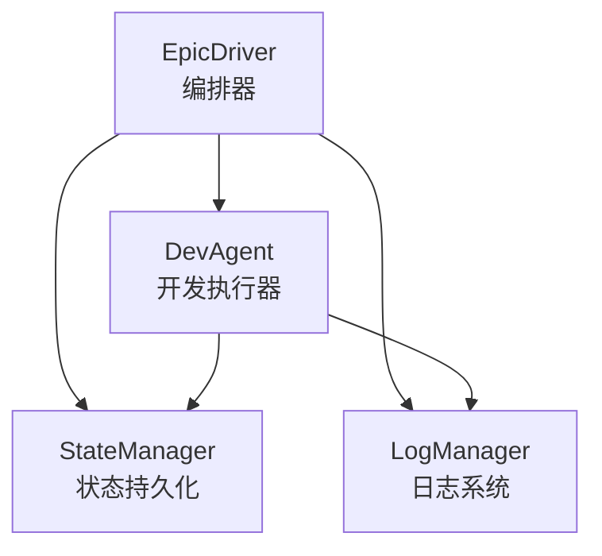
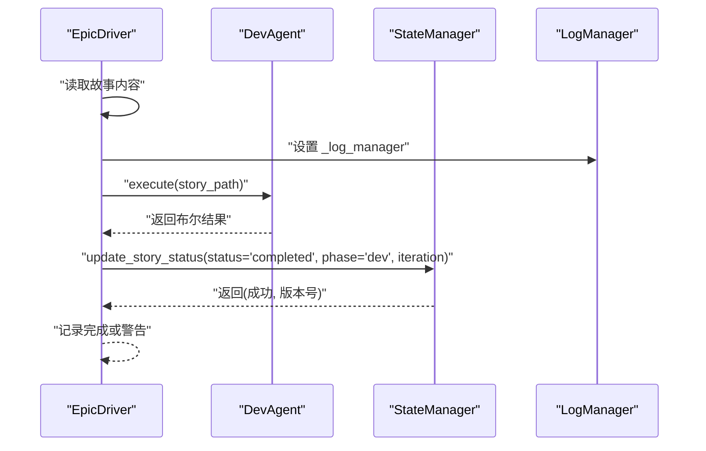
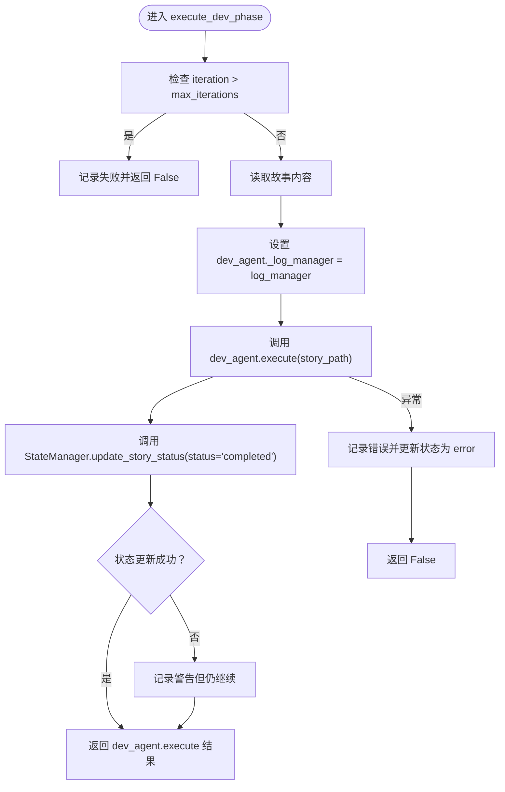
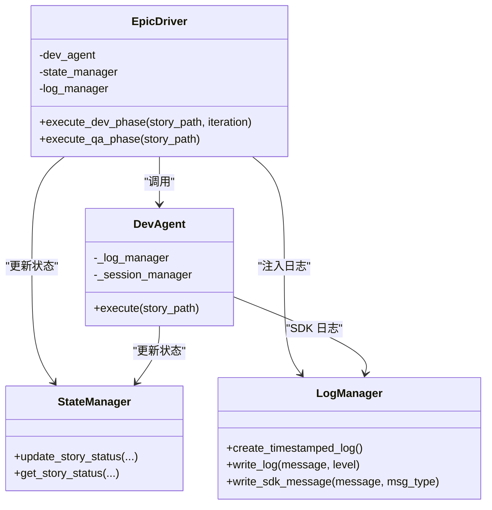

# 开发阶段

<cite>
**本文引用的文件**
- [epic_driver.py](file://autoBMAD/epic_automation/epic_driver.py)
- [dev_agent.py](file://autoBMAD/epic_automation/dev_agent.py)
- [log_manager.py](file://autoBMAD/epic_automation/log_manager.py)
- [state_manager.py](file://autoBMAD/epic_automation/state_manager.py)
- [ERROR_ANALYSIS_REPORT.md](file://ERROR_ANALYSIS_REPORT.md)
</cite>

## 目录
1. [简介](#简介)
2. [项目结构](#项目结构)
3. [核心组件](#核心组件)
4. [架构总览](#架构总览)
5. [详细组件分析](#详细组件分析)
6. [依赖关系分析](#依赖关系分析)
7. [性能与稳定性考量](#性能与稳定性考量)
8. [故障排查指南](#故障排查指南)
9. [结论](#结论)

## 简介
本文聚焦“开发阶段”的执行流程，围绕 EpicDriver 的 execute_dev_phase 方法展开，系统性说明：
- 迭代控制机制与 max_iterations 安全防护如何防止无限循环
- iteration 参数在开发循环中的作用与传递
- 每次迭代中如何调用 dev_agent.execute
- 日志管理器 log_manager 如何注入到 dev_agent 以进行 SDK 日志记录
- 成功与失败场景的状态更新逻辑：开发完成后将状态更新为 completed；发生异常时更新为 error
- 结合 ERROR_ANALYSIS_REPORT 对迭代计数不一致与状态重置问题的说明

## 项目结构
与开发阶段相关的核心文件位于 autoBMAD/epic_automation 目录，关键模块如下：
- EpicDriver：编排器，负责 Dev/QA 循环、迭代控制、状态更新与日志集成
- DevAgent：开发执行器，封装 SDK 调用、状态解析与 QA 通知
- LogManager：统一日志系统，支持双写与 SDK 消息追踪
- StateManager：状态持久化与乐观锁更新，提供 get/update 接口

图表来源
- [epic_driver.py](file://autoBMAD/epic_automation/epic_driver.py#L1153-L1210)
- [dev_agent.py](file://autoBMAD/epic_automation/dev_agent.py#L239-L304)
- [log_manager.py](file://autoBMAD/epic_automation/log_manager.py#L1-L120)
- [state_manager.py](file://autoBMAD/epic_automation/state_manager.py#L203-L349)

章节来源
- [epic_driver.py](file://autoBMAD/epic_automation/epic_driver.py#L1153-L1210)
- [dev_agent.py](file://autoBMAD/epic_automation/dev_agent.py#L239-L304)
- [log_manager.py](file://autoBMAD/epic_automation/log_manager.py#L1-L120)
- [state_manager.py](file://autoBMAD/epic_automation/state_manager.py#L203-L349)

## 核心组件
- EpicDriver.execute_dev_phase
  - 输入：story_path、iteration
  - 行为：读取故事内容、注入 log_manager、调用 dev_agent.execute、更新状态为 completed 或 error
  - 安全：当 iteration 超过 max_iterations 时，记录失败并返回 False
- DevAgent.execute
  - 输入：story_path
  - 行为：解析故事状态、必要时执行开发任务、通知 QA、更新状态
  - 集成：通过 _log_manager 接收 SDK 日志
- LogManager
  - 功能：创建时间戳日志文件、双写控制台与文件、SDK 消息追踪、异常与取消事件记录
- StateManager
  - 功能：原子更新故事状态（含乐观锁版本号）、查询状态、同步到 Markdown

章节来源
- [epic_driver.py](file://autoBMAD/epic_automation/epic_driver.py#L1153-L1210)
- [dev_agent.py](file://autoBMAD/epic_automation/dev_agent.py#L239-L304)
- [log_manager.py](file://autoBMAD/epic_automation/log_manager.py#L1-L120)
- [state_manager.py](file://autoBMAD/epic_automation/state_manager.py#L203-L349)

## 架构总览
开发阶段在 EpicDriver 中以“Dev-QA 循环”组织，其中 Dev 阶段由 execute_dev_phase 驱动，QA 阶段由 execute_qa_phase 驱动。两者均通过 StateManager 更新状态，EpicDriver 在 Dev 阶段注入 LogManager 到 DevAgent，使 SDK 调用产生的消息被统一记录。

图表来源
- [epic_driver.py](file://autoBMAD/epic_automation/epic_driver.py#L1153-L1210)
- [dev_agent.py](file://autoBMAD/epic_automation/dev_agent.py#L239-L304)
- [state_manager.py](file://autoBMAD/epic_automation/state_manager.py#L203-L349)
- [log_manager.py](file://autoBMAD/epic_automation/log_manager.py#L1-L120)

## 详细组件分析

### execute_dev_phase 执行流程
- 入口参数
  - story_path：故事 Markdown 文件路径
  - iteration：当前迭代计数（用于安全防护）
- 安全防护
  - 若 iteration > self.max_iterations，则记录错误并调用 StateManager.update_story_status(status="failed", error="Max iterations exceeded")，返回 False
- 开发执行
  - 读取故事内容
  - 将 self.log_manager 注入到 self.dev_agent._log_manager，使 SDK 调用的日志经由 LogManager 记录
  - 调用 self.dev_agent.execute(story_path)，得到布尔结果
- 状态更新
  - 调用 StateManager.update_story_status(story_path, status="completed", phase="dev", iteration=iteration)
  - 若状态更新失败，记录警告但仍继续（业务逻辑已执行）
- 异常处理
  - 捕获异常后记录错误并调用 StateManager.update_story_status(story_path, status="error", error=str(e))，返回 False

图表来源
- [epic_driver.py](file://autoBMAD/epic_automation/epic_driver.py#L1153-L1210)
- [state_manager.py](file://autoBMAD/epic_automation/state_manager.py#L203-L349)

章节来源
- [epic_driver.py](file://autoBMAD/epic_automation/epic_driver.py#L1153-L1210)

### DevAgent.execute 的职责与日志集成
- 输入：story_path
- 行为要点
  - 解析故事状态（若已完成或已就绪评审，则跳过开发或直接通知 QA）
  - 执行开发任务（简化实现处返回成功）
  - 通知 QA Agent 并返回结果
- 日志集成
  - DevAgent 在构造时可接收 log_manager，并在 SDK 调用中传入该实例，从而由 LogManager 记录 SDK 消息
  - EpicDriver 在 Dev 阶段将 self.log_manager 赋值给 self.dev_agent._log_manager，确保 SDK 日志被统一记录

章节来源
- [dev_agent.py](file://autoBMAD/epic_automation/dev_agent.py#L239-L304)
- [dev_agent.py](file://autoBMAD/epic_automation/dev_agent.py#L579-L650)
- [epic_driver.py](file://autoBMAD/epic_automation/epic_driver.py#L1176-L1185)

### 迭代控制机制与 max_iterations 安全防护
- 迭代计数来源
  - 在 EpicDriver._execute_story_processing 中，循环变量 iteration 从 1 开始，最大 Dev-QA 循环次数为 10（max_dev_qa_cycles）
- 安全防护
  - execute_dev_phase 内部检查 iteration > self.max_iterations，超过即判定失败并更新状态
- 一致性问题说明
  - ERROR_ANALYSIS_REPORT 指出：execute_dev_phase 检查 max_iterations，而循环控制使用固定上限 10，二者不一致可能导致无限循环与资源浪费
  - 建议：统一使用同一上限策略（例如将 max_dev_qa_cycles 与 max_iterations 合并为一个配置项）

章节来源
- [epic_driver.py](file://autoBMAD/epic_automation/epic_driver.py#L1336-L1375)
- [epic_driver.py](file://autoBMAD/epic_automation/epic_driver.py#L1166-L1174)
- [ERROR_ANALYSIS_REPORT.md](file://ERROR_ANALYSIS_REPORT.md#L75-L86)

### 每次迭代中调用 dev_agent.execute 的时机与参数
- 调用时机
  - 在 Dev-QA 循环中，每次迭代先执行 Dev 阶段，再执行 QA 阶段
- 参数传递
  - execute_dev_phase(story_path, iteration)
  - DevAgent.execute(story_path) 仅接收故事路径，不直接使用 iteration
- 作用
  - iteration 主要用于安全防护与状态更新（记录迭代次数）

章节来源
- [epic_driver.py](file://autoBMAD/epic_automation/epic_driver.py#L1336-L1375)
- [epic_driver.py](file://autoBMAD/epic_automation/epic_driver.py#L1153-L1210)

### 日志管理器集成与 SDK 日志记录
- 注入方式
  - EpicDriver 在 Dev 阶段将 self.log_manager 赋值给 self.dev_agent._log_manager
- 记录范围
  - DevAgent 在 SDK 调用中使用该 log_manager，LogManager 支持：
    - 创建时间戳日志文件
    - 双写控制台与文件
    - SDK 消息格式化输出
    - 异常与取消事件记录
- 输出位置
  - 控制台与文件同时输出，便于运行时观察与离线分析

章节来源
- [epic_driver.py](file://autoBMAD/epic_automation/epic_driver.py#L1176-L1185)
- [log_manager.py](file://autoBMAD/epic_automation/log_manager.py#L1-L120)
- [log_manager.py](file://autoBMAD/epic_automation/log_manager.py#L377-L420)

### 状态更新逻辑与异常处理
- 成功路径
  - execute_dev_phase 返回 dev_agent.execute 的结果
  - 调用 StateManager.update_story_status(story_path, status="completed", phase="dev", iteration=iteration)
  - 若更新失败，记录警告但仍继续
- 失败路径
  - 捕获异常后记录错误并调用 StateManager.update_story_status(story_path, status="error", error=str(e))
- QA 阶段补充
  - execute_qa_phase 在 QA 通过时更新为 completed，否则更新为 in_progress

章节来源
- [epic_driver.py](file://autoBMAD/epic_automation/epic_driver.py#L1187-L1210)
- [epic_driver.py](file://autoBMAD/epic_automation/epic_driver.py#L1211-L1262)
- [state_manager.py](file://autoBMAD/epic_automation/state_manager.py#L203-L349)

## 依赖关系分析
- EpicDriver 依赖
  - DevAgent：执行开发任务
  - StateManager：更新/查询故事状态
  - LogManager：统一日志输出
- DevAgent 依赖
  - SDKSessionManager：隔离 SDK 调用
  - StateManager：更新故事状态
  - LogManager：SDK 日志注入
- StateManager 依赖
  - SQLite：持久化状态
  - 连接池与锁：并发安全与性能

图表来源
- [epic_driver.py](file://autoBMAD/epic_automation/epic_driver.py#L1153-L1210)
- [dev_agent.py](file://autoBMAD/epic_automation/dev_agent.py#L239-L304)
- [state_manager.py](file://autoBMAD/epic_automation/state_manager.py#L203-L349)
- [log_manager.py](file://autoBMAD/epic_automation/log_manager.py#L1-L120)

## 性能与稳定性考量
- 迭代上限与安全防护
  - 建议统一 max_iterations 与循环上限，避免不一致导致的无限循环与资源浪费
- SDK 调用隔离
  - DevAgent 使用 SDKSessionManager 隔离 SDK 调用，减少跨 Agent 取消传播问题
- 日志开销
  - 双写与 SDK 消息追踪会增加 IO，建议在高并发场景下评估日志级别与刷新频率
- 状态更新的乐观锁
  - StateManager 使用版本号与锁保护，避免并发冲突；注意超时与取消处理

章节来源
- [ERROR_ANALYSIS_REPORT.md](file://ERROR_ANALYSIS_REPORT.md#L75-L86)
- [dev_agent.py](file://autoBMAD/epic_automation/dev_agent.py#L579-L650)
- [state_manager.py](file://autoBMAD/epic_automation/state_manager.py#L203-L349)

## 故障排查指南
- 开发阶段未完成
  - 检查是否超过 max_iterations 导致提前失败
  - 查看状态是否被更新为 error 或 failed
- 日志缺失或不完整
  - 确认 EpicDriver 已将 log_manager 注入 DevAgent
  - 检查 LogManager 是否创建了时间戳日志文件
- 状态不同步
  - 使用 StateManager.get_story_status 核对数据库记录
  - 必要时触发同步到 Markdown 文档
- 迭代计数不一致
  - 参考 ERROR_ANALYSIS_REPORT，统一 max_iterations 与循环上限策略

章节来源
- [epic_driver.py](file://autoBMAD/epic_automation/epic_driver.py#L1153-L1210)
- [log_manager.py](file://autoBMAD/epic_automation/log_manager.py#L1-L120)
- [state_manager.py](file://autoBMAD/epic_automation/state_manager.py#L405-L461)
- [ERROR_ANALYSIS_REPORT.md](file://ERROR_ANALYSIS_REPORT.md#L75-L86)

## 结论
- execute_dev_phase 是 Dev-QA 循环中的关键节点，承担安全防护、日志注入与状态更新职责
- iteration 参数主要用于安全防护与状态记录，DevAgent.execute 不直接使用该参数
- LogManager 的注入确保 SDK 调用日志被统一记录，便于问题定位
- StateManager 的乐观锁与版本号机制保障并发安全与状态一致性
- 建议统一 max_iterations 与循环上限，避免不一致引发的无限循环风险