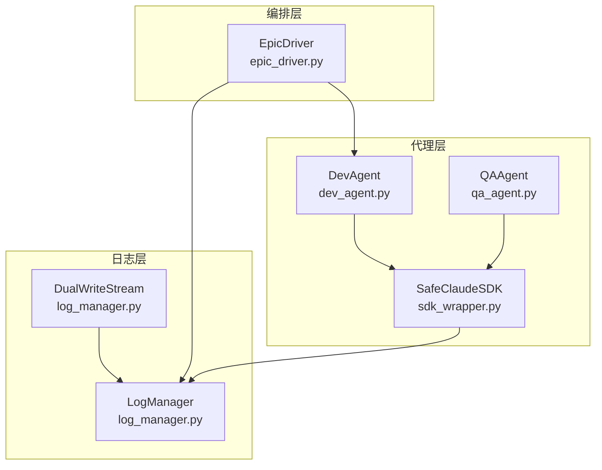
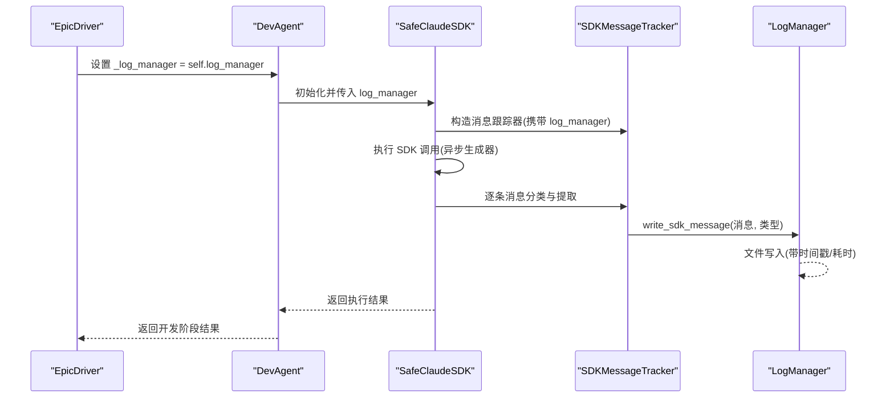
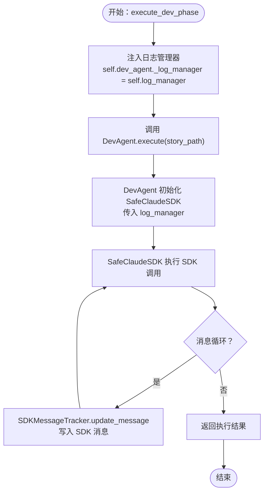
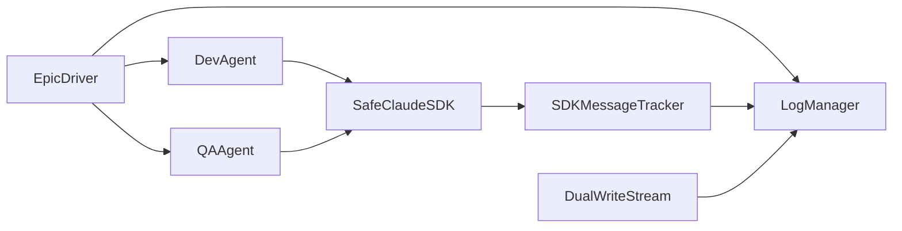

# 日志管理集成

<cite>
**本文引用的文件**
- [epic_driver.py](file://autoBMAD/epic_automation/epic_driver.py)
- [log_manager.py](file://autoBMAD/epic_automation/log_manager.py)
- [dev_agent.py](file://autoBMAD/epic_automation/dev_agent.py)
- [sdk_wrapper.py](file://autoBMAD/epic_automation/sdk_wrapper.py)
- [qa_agent.py](file://autoBMAD/epic_automation/qa_agent.py)
</cite>

## 目录
1. [简介](#简介)
2. [项目结构](#项目结构)
3. [核心组件](#核心组件)
4. [架构总览](#架构总览)
5. [详细组件分析](#详细组件分析)
6. [依赖关系分析](#依赖关系分析)
7. [性能与可靠性考量](#性能与可靠性考量)
8. [故障排查指南](#故障排查指南)
9. [结论](#结论)

## 简介
本文件聚焦于“日志管理集成”的工程实践，围绕 epic_driver 如何将 log_manager 注入到 dev_agent 中，以实现 SDK 日志记录的统一与可追溯。文档详细说明：
- 在 execute_dev_phase 中，通过 self.dev_agent._log_manager = self.log_manager 将 epic_driver 的日志管理器实例赋值给 dev_agent 的私有属性；
- log_manager 在协调不同代理（Dev/QA）日志输出中的作用；
- SafeClaudeSDK 如何利用该 log_manager 实例记录 SDK 调用的详细日志；
- 日志从 dev_agent 到 log_manager 的传递与记录流程，并给出可定位的代码片段路径。

## 项目结构
本专题涉及的关键模块与文件如下：
- epic_driver：编排器，负责初始化 log_manager 并在执行阶段注入 dev_agent；
- log_manager：统一日志系统，提供文件写入、双写模式、SDK 消息跟踪等能力；
- dev_agent：开发代理，执行 SDK 调用并将 SDK 消息写入 log_manager；
- sdk_wrapper：封装 SafeClaudeSDK，内部通过 SDKMessageTracker 将 SDK 消息写入 log_manager；
- qa_agent：质量代理，同样可复用 SDK 与日志系统，保障多代理日志一致性。

图表来源
- [epic_driver.py](file://autoBMAD/epic_automation/epic_driver.py#L1153-L1202)
- [log_manager.py](file://autoBMAD/epic_automation/log_manager.py#L377-L426)
- [dev_agent.py](file://autoBMAD/epic_automation/dev_agent.py#L579-L650)
- [sdk_wrapper.py](file://autoBMAD/epic_automation/sdk_wrapper.py#L202-L268)

章节来源
- [epic_driver.py](file://autoBMAD/epic_automation/epic_driver.py#L1153-L1202)
- [log_manager.py](file://autoBMAD/epic_automation/log_manager.py#L377-L426)

## 核心组件
- EpicDriver：在初始化阶段创建并配置 LogManager，随后在执行开发阶段将 log_manager 注入 dev_agent，使后续 SDK 调用的日志统一落盘。
- LogManager：负责创建带时间戳的日志文件、实时增量写入、双写模式（控制台+文件）、SDK 消息专用格式化写入、异常与取消事件记录、日志列表与刷新等。
- DevAgent：在执行 SDK 调用时，将 log_manager 传入 SafeClaudeSDK；SafeClaudeSDK 的消息跟踪器通过 SDKMessageTracker 将 SDK 消息写入 log_manager。
- SafeClaudeSDK：封装 SDK 异步生成器生命周期管理，统一取消处理，同时通过 SDKMessageTracker 将消息写入 log_manager。
- QAAgent：同样可使用 SDK 与日志系统，保证多代理日志一致性。

章节来源
- [epic_driver.py](file://autoBMAD/epic_automation/epic_driver.py#L1153-L1202)
- [log_manager.py](file://autoBMAD/epic_automation/log_manager.py#L18-L215)
- [dev_agent.py](file://autoBMAD/epic_automation/dev_agent.py#L579-L650)
- [sdk_wrapper.py](file://autoBMAD/epic_automation/sdk_wrapper.py#L202-L268)
- [qa_agent.py](file://autoBMAD/epic_automation/qa_agent.py#L121-L161)

## 架构总览
下面的序列图展示了从 epic_driver 到 dev_agent，再到 SafeClaudeSDK 与 LogManager 的完整日志链路。

图表来源
- [epic_driver.py](file://autoBMAD/epic_automation/epic_driver.py#L1181-L1185)
- [dev_agent.py](file://autoBMAD/epic_automation/dev_agent.py#L579-L650)
- [sdk_wrapper.py](file://autoBMAD/epic_automation/sdk_wrapper.py#L202-L268)
- [log_manager.py](file://autoBMAD/epic_automation/log_manager.py#L116-L146)

## 详细组件分析

### 1) epic_driver 如何将 log_manager 注入 dev_agent
- 关键点：在 execute_dev_phase 中，先读取故事内容，然后将 self.log_manager 赋值给 self.dev_agent._log_manager，再调用 dev_agent.execute(story_path)。
- 影响：dev_agent 在执行 SDK 调用时，会将该 log_manager 传入 SafeClaudeSDK，从而实现 SDK 消息的统一记录。

代码片段路径
- [execute_dev_phase 中的注入与调用](file://autoBMAD/epic_automation/epic_driver.py#L1181-L1185)

章节来源
- [epic_driver.py](file://autoBMAD/epic_automation/epic_driver.py#L1181-L1185)

### 2) log_manager 在协调多代理日志中的作用
- 统一日志文件：init_logging 创建带时间戳的日志文件，setup_dual_write 将 stdout/stderr 重定向到 DualWriteStream，实现控制台与文件的双写。
- SDK 消息专用记录：write_sdk_message 提供 SDK 消息的格式化写入，便于区分 THINKING/TOOL_USE/TOOL_RESULT/USER/SYSTEM 等类型。
- 实时增量与持久化：write_log、write_exception、log_cancellation、log_state_resync 等方法确保运行期事件与异常得到记录。
- 列表与刷新：list_log_files 提供最近日志文件列表；flush 确保缓冲区数据及时落盘。

代码片段路径
- [init_logging 与 setup_dual_write](file://autoBMAD/epic_automation/log_manager.py#L377-L426)
- [write_sdk_message](file://autoBMAD/epic_automation/log_manager.py#L116-L146)
- [write_log](file://autoBMAD/epic_automation/log_manager.py#L89-L115)
- [log_cancellation](file://autoBMAD/epic_automation/log_manager.py#L225-L242)
- [log_state_resync](file://autoBMAD/epic_automation/log_manager.py#L243-L261)
- [list_log_files](file://autoBMAD/epic_automation/log_manager.py#L262-L284)
- [flush](file://autoBMAD/epic_automation/log_manager.py#L285-L299)

章节来源
- [log_manager.py](file://autoBMAD/epic_automation/log_manager.py#L377-L426)
- [log_manager.py](file://autoBMAD/epic_automation/log_manager.py#L89-L146)
- [log_manager.py](file://autoBMAD/epic_automation/log_manager.py#L225-L299)

### 3) SafeClaudeSDK 如何利用 log_manager 记录 SDK 调用
- SDKMessageTracker：持有 log_manager，在 update_message 时调用 log_manager.write_sdk_message，将 SDK 消息按类型写入日志文件。
- SafeClaudeSDK：在执行 SDK 调用时，构造 SDKMessageTracker 并在消息到达时更新；最终在成功或失败时输出汇总信息。
- 双写模式：由于 epic_driver 初始化了 DualWriteStream，控制台输出也会被记录到日志文件，形成“双写”效果。

代码片段路径
- [SDKMessageTracker.update_message 写入 SDK 消息](file://autoBMAD/epic_automation/sdk_wrapper.py#L214-L230)
- [SafeClaudeSDK 构造 SDKMessageTracker](file://autoBMAD/epic_automation/sdk_wrapper.py#L317-L328)
- [SafeClaudeSDK._run_isolated_generator_with_manager 写入消息与结果](file://autoBMAD/epic_automation/sdk_wrapper.py#L606-L665)
- [init_logging 与 setup_dual_write](file://autoBMAD/epic_automation/log_manager.py#L377-L426)

章节来源
- [sdk_wrapper.py](file://autoBMAD/epic_automation/sdk_wrapper.py#L202-L268)
- [sdk_wrapper.py](file://autoBMAD/epic_automation/sdk_wrapper.py#L300-L494)
- [log_manager.py](file://autoBMAD/epic_automation/log_manager.py#L377-L426)

### 4) 日志从 dev_agent 到 log_manager 的传递流程
- 注入阶段：EpicDriver 在 execute_dev_phase 中设置 dev_agent._log_manager = self.log_manager。
- 执行阶段：DevAgent 在执行 SDK 调用时，将 _log_manager 传入 SafeClaudeSDK。
- 记录阶段：SafeClaudeSDK 的 SDKMessageTracker 将 SDK 消息写入 LogManager；同时控制台输出经由 DualWriteStream 同步写入日志文件。

图表来源
- [epic_driver.py](file://autoBMAD/epic_automation/epic_driver.py#L1181-L1185)
- [dev_agent.py](file://autoBMAD/epic_automation/dev_agent.py#L579-L650)
- [sdk_wrapper.py](file://autoBMAD/epic_automation/sdk_wrapper.py#L202-L268)
- [log_manager.py](file://autoBMAD/epic_automation/log_manager.py#L377-L426)

章节来源
- [epic_driver.py](file://autoBMAD/epic_automation/epic_driver.py#L1181-L1185)
- [dev_agent.py](file://autoBMAD/epic_automation/dev_agent.py#L579-L650)
- [sdk_wrapper.py](file://autoBMAD/epic_automation/sdk_wrapper.py#L202-L268)
- [log_manager.py](file://autoBMAD/epic_automation/log_manager.py#L377-L426)

### 5) 多代理日志一致性与协同
- DevAgent 与 QAAgent 均可使用 SafeClaudeSDK，若两者均传入相同的 log_manager，则 SDK 消息会在同一份日志文件中汇聚，便于跨阶段对比与审计。
- 双写模式确保控制台输出与文件输出一致，避免信息遗漏。

代码片段路径
- [DevAgent 初始化 SDK 时传入 log_manager](file://autoBMAD/epic_automation/dev_agent.py#L95-L101)
- [QAAgent 初始化 SDK 时可传入 log_manager（可选）](file://autoBMAD/epic_automation/qa_agent.py#L132-L150)

章节来源
- [dev_agent.py](file://autoBMAD/epic_automation/dev_agent.py#L95-L101)
- [qa_agent.py](file://autoBMAD/epic_automation/qa_agent.py#L132-L150)

## 依赖关系分析
- epic_driver 依赖 log_manager 进行日志初始化与双写设置；
- dev_agent 依赖 SafeClaudeSDK，后者依赖 SDKMessageTracker 与 LogManager；
- qa_agent 也可依赖 SafeClaudeSDK 与 LogManager，实现跨代理日志一致性。

图表来源
- [epic_driver.py](file://autoBMAD/epic_automation/epic_driver.py#L1153-L1202)
- [log_manager.py](file://autoBMAD/epic_automation/log_manager.py#L377-L426)
- [dev_agent.py](file://autoBMAD/epic_automation/dev_agent.py#L579-L650)
- [sdk_wrapper.py](file://autoBMAD/epic_automation/sdk_wrapper.py#L202-L268)
- [qa_agent.py](file://autoBMAD/epic_automation/qa_agent.py#L121-L161)

章节来源
- [epic_driver.py](file://autoBMAD/epic_automation/epic_driver.py#L1153-L1202)
- [log_manager.py](file://autoBMAD/epic_automation/log_manager.py#L377-L426)
- [dev_agent.py](file://autoBMAD/epic_automation/dev_agent.py#L579-L650)
- [sdk_wrapper.py](file://autoBMAD/epic_automation/sdk_wrapper.py#L202-L268)
- [qa_agent.py](file://autoBMAD/epic_automation/qa_agent.py#L121-L161)

## 性能与可靠性考量
- 双写模式：stdout/stderr 重定向至 DualWriteStream，避免额外 IO 堪忧，但需注意编码兼容性与 flush 频率。
- SDK 消息写入：write_sdk_message 与 write_log 采用增量写入，建议在关键节点调用 flush 以降低丢失风险。
- 取消与异常：LogManager 提供 log_cancellation 与 write_exception，有助于在取消或异常场景快速定位问题。
- 日志滚动：list_log_files 支持按时间排序列出最近日志，便于维护与归档。

章节来源
- [log_manager.py](file://autoBMAD/epic_automation/log_manager.py#L300-L357)
- [log_manager.py](file://autoBMAD/epic_automation/log_manager.py#L116-L185)
- [log_manager.py](file://autoBMAD/epic_automation/log_manager.py#L262-L299)

## 故障排查指南
- SDK 消息未记录：检查 epic_driver 是否正确注入 log_manager，以及 dev_agent 是否将 _log_manager 传入 SafeClaudeSDK；确认 SDKMessageTracker.update_message 是否被调用。
- 控制台与文件不一致：确认 init_logging 与 setup_dual_write 是否在 epic_driver 初始化阶段执行。
- 日志文件未创建：检查 create_timestamped_log 是否被调用，以及 logs 目录权限与路径。
- 编码问题导致写入失败：DualWriteStream 与 LogManager 已内置编码容错处理，若仍失败，检查终端编码与文件编码。

章节来源
- [epic_driver.py](file://autoBMAD/epic_automation/epic_driver.py#L1181-L1185)
- [log_manager.py](file://autoBMAD/epic_automation/log_manager.py#L377-L426)
- [sdk_wrapper.py](file://autoBMAD/epic_automation/sdk_wrapper.py#L202-L268)

## 结论
通过在 epic_driver 的 execute_dev_phase 中将 log_manager 注入 dev_agent，并由 SafeClaudeSDK 的 SDKMessageTracker 将 SDK 消息写入 LogManager，实现了 SDK 日志的统一采集与持久化。配合 DualWriteStream，控制台输出与文件输出保持一致，便于跨阶段审计与问题定位。该方案为 Dev/QA 等多代理提供了统一的日志视图，提升了可观测性与可维护性。