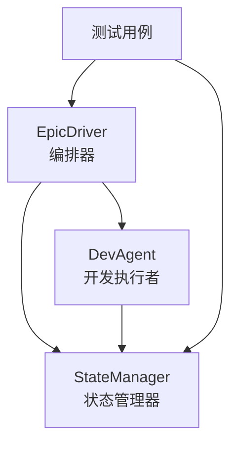
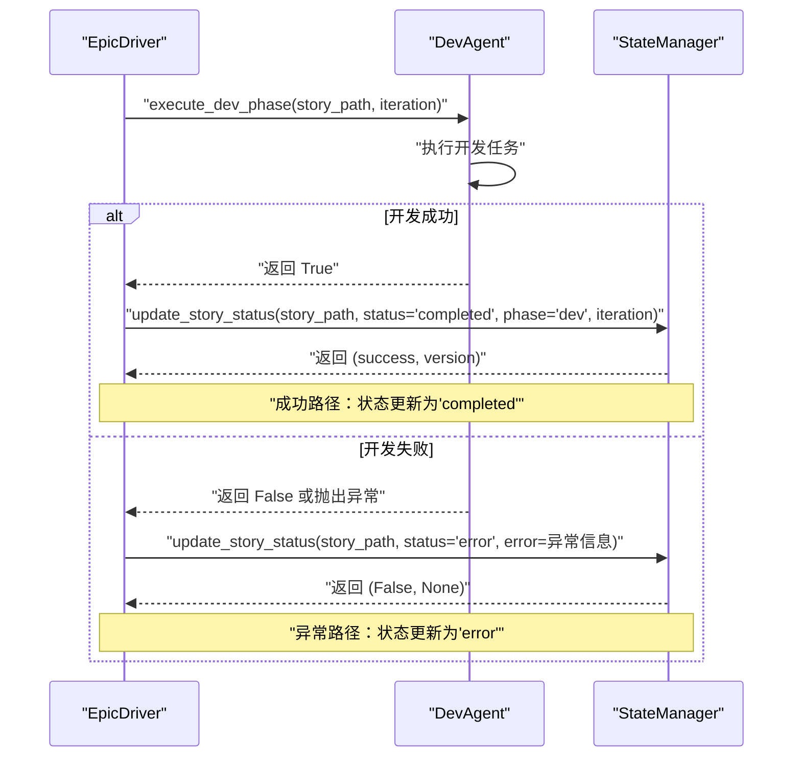
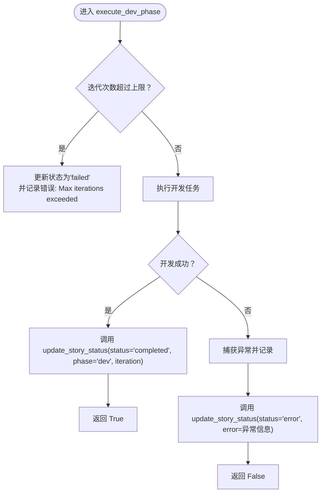
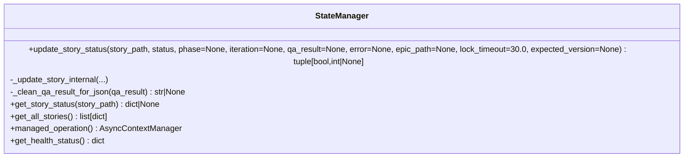

# 状态更新逻辑

<cite>
**本文引用的文件**
- [epic_driver.py](file://autoBMAD/epic_automation/epic_driver.py)
- [state_manager.py](file://autoBMAD/epic_automation/state_manager.py)
- [dev_agent.py](file://autoBMAD/epic_automation/dev_agent.py)
- [test_epic_automation.py](file://tests-copy/test_epic_automation.py)
- [test_spec_state_manager.py](file://spec_automation/tests/test_spec_state_manager.py)
</cite>

## 目录
1. [简介](#简介)
2. [项目结构与角色定位](#项目结构与角色定位)
3. [核心组件](#核心组件)
4. [架构总览](#架构总览)
5. [详细组件分析](#详细组件分析)
6. [依赖关系分析](#依赖关系分析)
7. [性能与可靠性考量](#性能与可靠性考量)
8. [故障排查指南](#故障排查指南)
9. [结论](#结论)

## 简介
本文聚焦于“开发阶段”完成后如何将故事状态更新为“completed”的完整流程，围绕 EpicDriver 中的 execute_dev_phase 函数调用 StateManager.update_story_status 的机制展开，详细说明：
- 参数含义：status、phase、iteration、qa_result、error 等的作用与传递方式
- 成功路径：开发阶段完成后，如何将状态更新为“completed”，并附带阶段与迭代信息
- 异常路径：发生异常时如何捕获并调用 StateManager 将状态更新为“error”，同时记录错误信息
- StateManager 在维护故事生命周期中的核心职责
- 状态更新失败时的告警与容错策略
- 提供成功与失败两种场景下的调用示例路径

## 项目结构与角色定位
- EpicDriver：编排器，负责驱动 SM-Dev-QA 循环，其中 Dev 阶段结束后调用 StateManager 更新状态
- DevAgent：开发执行者，完成开发任务后通知 QA，并在必要时更新文档状态
- StateManager：状态持久化与并发控制中心，提供线程/协程安全的更新接口
- 测试用例：覆盖状态更新、异常处理、多轮更新等行为

图表来源
- [epic_driver.py](file://autoBMAD/epic_automation/epic_driver.py#L1153-L1210)
- [dev_agent.py](file://autoBMAD/epic_automation/dev_agent.py#L239-L304)
- [state_manager.py](file://autoBMAD/epic_automation/state_manager.py#L203-L296)

章节来源
- [epic_driver.py](file://autoBMAD/epic_automation/epic_driver.py#L1153-L1210)
- [dev_agent.py](file://autoBMAD/epic_automation/dev_agent.py#L239-L304)
- [state_manager.py](file://autoBMAD/epic_automation/state_manager.py#L203-L296)

## 核心组件
- EpicDriver.execute_dev_phase：在开发阶段完成后，统一调用 StateManager.update_story_status 将状态置为“completed”，并设置 phase 与 iteration
- StateManager.update_story_status：提供带超时与锁保护的状态更新接口；内部实现支持乐观锁、JSON 序列化清理、版本号递增、错误日志与告警
- DevAgent.execute：在开发阶段内可能进行状态更新（例如从“Draft”更新为“Ready for Review”），并在异常时返回 False 供上层处理

章节来源
- [epic_driver.py](file://autoBMAD/epic_automation/epic_driver.py#L1153-L1210)
- [state_manager.py](file://autoBMAD/epic_automation/state_manager.py#L203-L348)
- [dev_agent.py](file://autoBMAD/epic_automation/dev_agent.py#L239-L304)

## 架构总览
下面的时序图展示了开发阶段成功完成后的状态更新流程，以及异常时的状态更新流程。

图表来源
- [epic_driver.py](file://autoBMAD/epic_automation/epic_driver.py#L1153-L1210)
- [state_manager.py](file://autoBMAD/epic_automation/state_manager.py#L203-L296)

## 详细组件分析

### 组件A：EpicDriver.execute_dev_phase 的状态更新机制
- 入口：execute_dev_phase 接收 story_path 与 iteration，执行开发任务
- 成功路径：开发完成后，调用 StateManager.update_story_status，传入 status="completed"、phase="dev"、iteration=当前迭代数
- 异常路径：捕获异常后，调用 StateManager.update_story_status，传入 status="error" 与 error=str(e)
- 返回值：无论状态更新是否成功，都返回开发任务的执行结果（True/False）

图表来源
- [epic_driver.py](file://autoBMAD/epic_automation/epic_driver.py#L1153-L1210)

章节来源
- [epic_driver.py](file://autoBMAD/epic_automation/epic_driver.py#L1153-L1210)

### 组件B：StateManager.update_story_status 的实现要点
- 参数语义
  - story_path：故事文件路径（唯一索引）
  - status：当前状态（如 "completed"、"error"、"in_progress" 等）
  - phase：当前阶段（如 "dev"、"qa"、"sm" 等）
  - iteration：当前迭代次数（用于追踪 Dev-QA 循环次数）
  - qa_result：QA 结果（可为字典，内部会清理并序列化为字符串）
  - error：错误信息（字符串）
  - epic_path：所属 Epic 文件路径（可选）
  - lock_timeout：锁获取超时（秒）
  - expected_version：乐观锁期望版本（用于并发冲突检测）
- 并发与一致性
  - 使用 asyncio.Lock 保护数据库操作
  - 支持连接池（可选）提升并发性能
  - 乐观锁：若传入 expected_version 且与数据库当前版本不一致，返回 False 并返回当前版本
- 行为细节
  - 若记录存在：更新状态、phase、iteration、qa_result、error、updated_at，并将 version+1
  - 若记录不存在：插入新记录，version=1
  - 返回值：(success, current_version)，其中 success 为布尔，current_version 为整数或 None
  - 异常处理：超时、CancelledError、其他异常均记录日志并返回 (False, None)

图表来源
- [state_manager.py](file://autoBMAD/epic_automation/state_manager.py#L203-L348)

章节来源
- [state_manager.py](file://autoBMAD/epic_automation/state_manager.py#L203-L348)

### 组件C：DevAgent.execute 的状态更新与异常处理
- DevAgent 在开发阶段内部可能更新文档状态（例如从“Draft”更新为“Ready for Review”），并通过 StateManager.update_story_status 完成
- 若开发阶段出现异常，DevAgent 返回 False，由上层 EpicDriver 捕获并统一更新为“error”
- 该行为体现了“上层统一状态更新”的设计原则

章节来源
- [dev_agent.py](file://autoBMAD/epic_automation/dev_agent.py#L239-L304)

### 组件D：测试用例对状态更新的验证
- 测试覆盖了：
  - 成功更新状态（如 "completed"）、阶段（如 "done"）与版本号递增
  - 异常路径下 error 字段的写入
  - 多轮更新顺序与最终状态一致性
  - 特殊字符、空字符串等边界情况
- 这些测试为状态更新逻辑提供了回归保障

章节来源
- [test_spec_state_manager.py](file://spec_automation/tests/test_spec_state_manager.py#L80-L122)
- [test_spec_state_manager.py](file://spec_automation/tests/test_spec_state_manager.py#L284-L348)
- [test_spec_state_manager.py](file://spec_automation/tests/test_spec_state_manager.py#L314-L326)
- [test_spec_state_manager.py](file://spec_automation/tests/test_spec_state_manager.py#L327-L348)

## 依赖关系分析
- EpicDriver 依赖 DevAgent 与 StateManager
- DevAgent 依赖状态解析器与 SDK 会话管理器，内部也可能调用 StateManager
- StateManager 依赖 SQLite 数据库与连接池，提供线程/协程安全的 CRUD 操作

图表来源
- [epic_driver.py](file://autoBMAD/epic_automation/epic_driver.py#L617-L630)
- [dev_agent.py](file://autoBMAD/epic_automation/dev_agent.py#L239-L304)
- [state_manager.py](file://autoBMAD/epic_automation/state_manager.py#L203-L296)

章节来源
- [epic_driver.py](file://autoBMAD/epic_automation/epic_driver.py#L617-L630)
- [dev_agent.py](file://autoBMAD/epic_automation/dev_agent.py#L239-L304)
- [state_manager.py](file://autoBMAD/epic_automation/state_manager.py#L203-L296)

## 性能与可靠性考量
- 锁与超时：update_story_status 内部使用 asyncio.Lock 保护数据库操作，并通过 asyncio.wait_for 控制超时，避免长时间阻塞
- 连接池：可选的连接池在高并发场景下显著降低连接开销
- 乐观锁：通过 version 字段检测并发冲突，避免覆盖最新变更
- 日志与告警：对超时、取消、异常进行记录，便于诊断；状态更新失败时仅发出 warning，保证流程继续推进

章节来源
- [state_manager.py](file://autoBMAD/epic_automation/state_manager.py#L203-L348)

## 故障排查指南
- 症状：状态未更新或更新失败
  - 检查返回值：update_story_status 返回 (success, version)，当 success=False 时需查看日志
  - 查看日志：确认是否存在超时、取消或异常
  - 并发冲突：若传入 expected_version，可能因版本不一致导致失败
- 症状：开发阶段异常但状态未变为“error”
  - 确认 EpicDriver 是否捕获异常并调用 update_story_status(status="error", error=...)
  - 检查 DevAgent 是否返回 False 或抛出异常
- 症状：QA 通过但状态仍为“Ready for Review”
  - QA 阶段结束后会再次读取文档状态并决定是否置为“completed”，若仍为“Ready for Review”，需检查 QA 逻辑或文档状态解析

章节来源
- [epic_driver.py](file://autoBMAD/epic_automation/epic_driver.py#L1153-L1210)
- [state_manager.py](file://autoBMAD/epic_automation/state_manager.py#L203-L296)

## 结论
- 在开发阶段成功完成后，EpicDriver 通过 StateManager.update_story_status 将状态置为“completed”，并附带 phase 与 iteration 信息，确保生命周期可追踪
- 发生异常时，EpicDriver 捕获异常并调用 StateManager 将状态置为“error”，同时记录错误信息，保证可观测性
- StateManager 在维护故事生命周期中承担核心职责：提供线程/协程安全的更新、乐观锁、版本管理与日志告警
- 状态更新失败时采用 warning 告警而非中断流程，体现系统的韧性与可恢复性