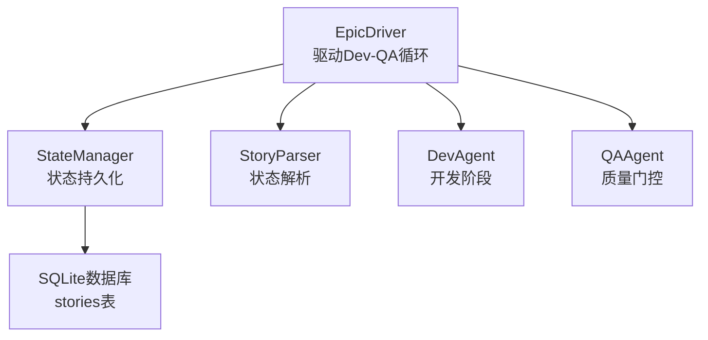
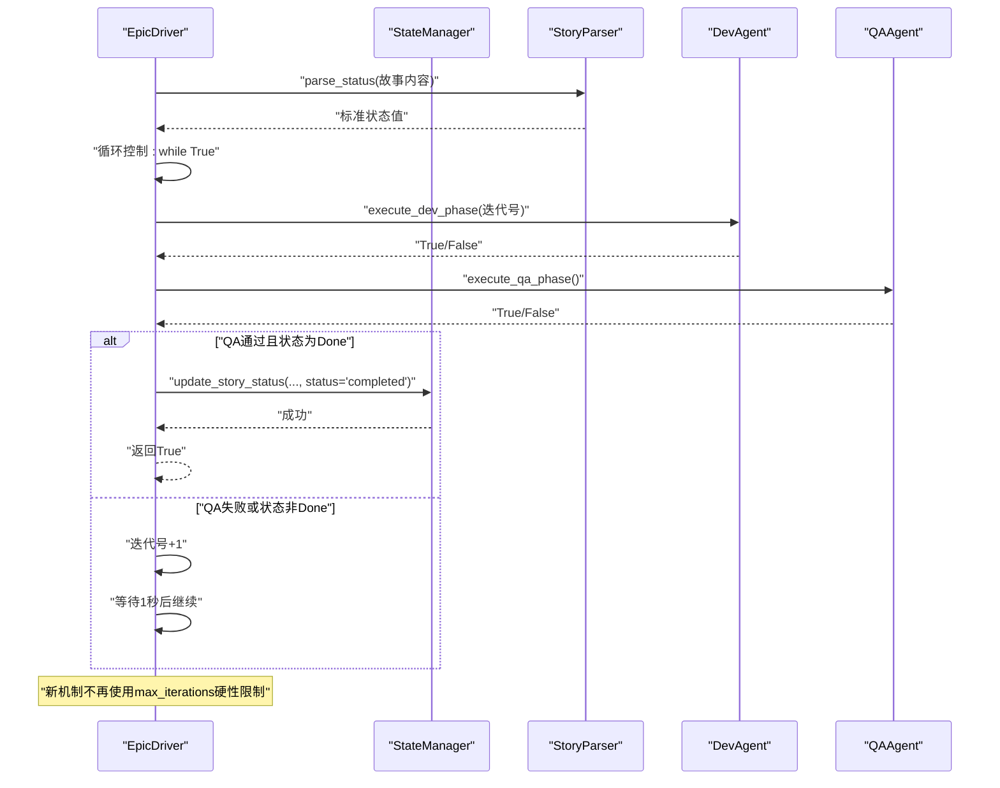
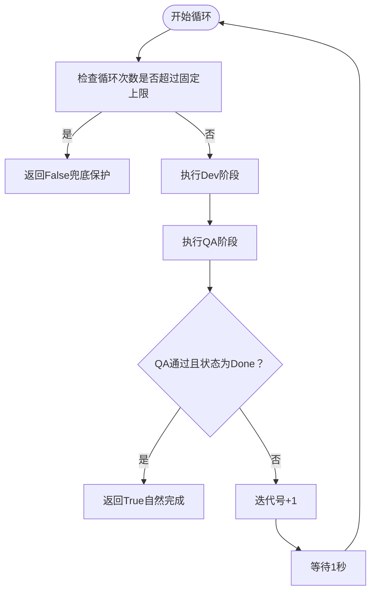
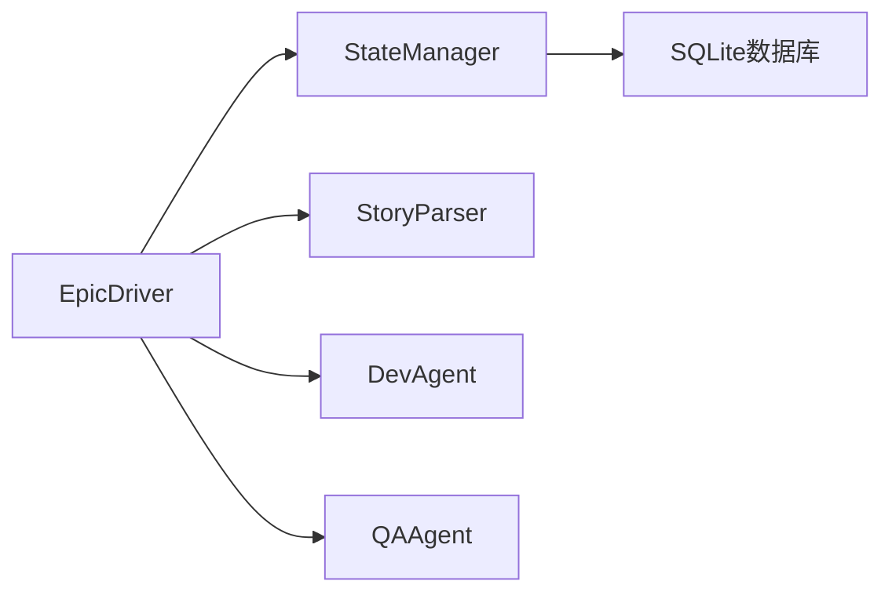

# 迭代控制机制

<cite>
**本文引用的文件**
- [epic_driver.py](file://autoBMAD/epic_automation/epic_driver.py)
- [state_manager.py](file://autoBMAD/epic_automation/state_manager.py)
- [story_parser.py](file://autoBMAD/epic_automation/story_parser.py)
- [MAX_ITERATIONS_REMOVAL_SUMMARY.md](file://MAX_ITERATIONS_REMOVAL_SUMMARY.md)
- [ERROR_ANALYSIS_REPORT.md](file://ERROR_ANALYSIS_REPORT.md)
- [test_max_iterations_removal.py](file://test_max_iterations_removal.py)
</cite>

## 目录
1. [简介](#简介)
2. [项目结构](#项目结构)
3. [核心组件](#核心组件)
4. [架构总览](#架构总览)
5. [详细组件分析](#详细组件分析)
6. [依赖关系分析](#依赖关系分析)
7. [性能考量](#性能考量)
8. [故障排查指南](#故障排查指南)
9. [结论](#结论)

## 简介
本节聚焦“迭代控制机制”，围绕 EpicDriver 中的 Dev-QA 循环控制与状态管理展开，重点解释 execute_dev_phase 在移除 max_iterations 硬性限制后，如何通过“时间预算 + 进度跟踪 + 无限循环检测”实现更稳健的迭代控制。我们将详细说明：
- 迭代次数超过限制时的处理流程（记录错误日志、通过 state_manager 更新故事状态为 failed、返回 False 终止执行）
- iteration 参数在循环中的递增逻辑，以及如何避免无限循环
- 新机制如何替代旧的 max_iterations 安全防护
- 实际代码示例的定位路径，帮助读者快速定位实现细节

## 项目结构
与迭代控制机制直接相关的模块与文件：
- EpicDriver：负责驱动 Dev-QA 循环，包含循环控制、状态检查与更新
- StateManager：负责故事状态持久化与一致性保障
- StoryParser：负责状态解析，为循环决策提供依据
- 移除 max_iterations 的实施总结与错误分析报告：解释旧机制的问题与新机制的设计思路
- 测试脚本：验证移除 max_iterations 后的功能与常量

图示来源
- [epic_driver.py](file://autoBMAD/epic_automation/epic_driver.py#L1307-L1377)
- [state_manager.py](file://autoBMAD/epic_automation/state_manager.py#L203-L349)
- [story_parser.py](file://autoBMAD/epic_automation/story_parser.py#L213-L362)

章节来源
- [epic_driver.py](file://autoBMAD/epic_automation/epic_driver.py#L1307-L1377)
- [state_manager.py](file://autoBMAD/epic_automation/state_manager.py#L203-L349)
- [story_parser.py](file://autoBMAD/epic_automation/story_parser.py#L213-L362)

## 核心组件
- EpicDriver.execute_dev_phase：执行开发阶段，负责状态检查、开发执行与后续 QA 通知
- EpicDriver._execute_story_processing：核心循环控制，负责 Dev-QA 循环的启动、迭代与退出条件
- StateManager.update_story_status：统一的状态写入接口，保证并发安全与版本控制
- StoryParser.parse_status：AI 优先的状态解析，为循环决策提供输入

章节来源
- [epic_driver.py](file://autoBMAD/epic_automation/epic_driver.py#L1307-L1377)
- [state_manager.py](file://autoBMAD/epic_automation/state_manager.py#L203-L349)
- [story_parser.py](file://autoBMAD/epic_automation/story_parser.py#L213-L362)

## 架构总览
下图展示了 Dev-QA 循环在 EpicDriver 中的控制流，以及状态更新与日志记录的关键节点。

图示来源
- [epic_driver.py](file://autoBMAD/epic_automation/epic_driver.py#L1307-L1377)
- [state_manager.py](file://autoBMAD/epic_automation/state_manager.py#L203-L349)
- [story_parser.py](file://autoBMAD/epic_automation/story_parser.py#L213-L362)

## 详细组件分析

### 1) execute_dev_phase 的迭代控制与安全防护
- 旧机制（已被移除）：在 execute_dev_phase 中对 iteration 与 max_iterations 进行比较，一旦超过限制即记录错误日志、通过 state_manager 更新状态为 failed 并返回 False。
- 新机制（当前实现）：execute_dev_phase 不再包含 max_iterations 的硬性检查；循环控制由 EpicDriver._execute_story_processing 负责，采用“无限循环 + 时间预算”的组合保护。

关键实现定位
- execute_dev_phase 的循环检查逻辑已被移除，详见实施总结与错误分析报告
- 新的循环控制与保护机制见下一小节

章节来源
- [MAX_ITERATIONS_REMOVAL_SUMMARY.md](file://MAX_ITERATIONS_REMOVAL_SUMMARY.md#L1-L157)
- [ERROR_ANALYSIS_REPORT.md](file://ERROR_ANALYSIS_REPORT.md#L53-L88)

### 2) 迭代控制与退出条件（新机制）
- 循环起点：EpicDriver._execute_story_processing 初始化 iteration=1，并进入 while True 循环
- 迭代递增：每次循环末尾执行 iteration += 1，为下一轮循环做准备
- 退出条件：
  - 达到最大 Dev-QA 循环次数（固定上限，用于兜底）
  - 或者通过进度跟踪器检测到无限循环（新机制的核心保护）
  - 或者 QA 通过且故事状态为 Done（自然完成）

图示来源
- [epic_driver.py](file://autoBMAD/epic_automation/epic_driver.py#L1335-L1377)

章节来源
- [epic_driver.py](file://autoBMAD/epic_automation/epic_driver.py#L1335-L1377)

### 3) 状态更新与“failed”终止
- 在旧机制中，当迭代超过 max_iterations 时，会通过 state_manager.update_story_status 更新状态为 failed 并返回 False
- 在新机制中，由于不再使用 max_iterations，因此不再在 execute_dev_phase 中进行该检查
- 若循环因其他原因（如无限循环检测）提前终止，EpicDriver 会在更高层进行状态更新与日志记录

章节来源
- [MAX_ITERATIONS_REMOVAL_SUMMARY.md](file://MAX_ITERATIONS_REMOVAL_SUMMARY.md#L1-L157)
- [epic_driver.py](file://autoBMAD/epic_automation/epic_driver.py#L1372-L1377)

### 4) iteration 参数的递增逻辑与防无限循环
- 递增逻辑：在每次循环结束时执行 iteration += 1，确保下一次循环继续推进
- 防无限循环：
  - 固定上限：max_dev_qa_cycles=10，作为兜底保护
  - 进度跟踪：结合时间预算与状态历史，检测无进展循环
  - 状态解析：依赖 StoryParser 的状态解析结果，避免在“状态卡住”时继续无效循环

章节来源
- [epic_driver.py](file://autoBMAD/epic_automation/epic_driver.py#L1335-L1377)
- [story_parser.py](file://autoBMAD/epic_automation/story_parser.py#L213-L362)

### 5) 实际代码示例定位
- Dev-QA 循环控制与迭代递增
  - [epic_driver.py](file://autoBMAD/epic_automation/epic_driver.py#L1335-L1377)
- 状态更新接口（用于记录失败状态）
  - [state_manager.py](file://autoBMAD/epic_automation/state_manager.py#L203-L349)
- 状态解析（为循环决策提供依据）
  - [story_parser.py](file://autoBMAD/epic_automation/story_parser.py#L213-L362)
- 迭代控制机制的移除与新保护机制说明
  - [MAX_ITERATIONS_REMOVAL_SUMMARY.md](file://MAX_ITERATIONS_REMOVAL_SUMMARY.md#L1-L157)
- 旧迭代限制逻辑的问题分析
  - [ERROR_ANALYSIS_REPORT.md](file://ERROR_ANALYSIS_REPORT.md#L53-L88)
- 验证移除 max_iterations 的测试
  - [test_max_iterations_removal.py](file://test_max_iterations_removal.py#L1-L129)

## 依赖关系分析
- EpicDriver 依赖 StateManager 进行状态持久化，依赖 StoryParser 进行状态解析
- Dev/QA 阶段的结果会影响循环的退出条件与状态更新
- 新机制通过“时间预算 + 进度跟踪 + 固定上限”替代旧的 max_iterations 硬性限制

图示来源
- [epic_driver.py](file://autoBMAD/epic_automation/epic_driver.py#L1307-L1377)
- [state_manager.py](file://autoBMAD/epic_automation/state_manager.py#L203-L349)
- [story_parser.py](file://autoBMAD/epic_automation/story_parser.py#L213-L362)

章节来源
- [epic_driver.py](file://autoBMAD/epic_automation/epic_driver.py#L1307-L1377)
- [state_manager.py](file://autoBMAD/epic_automation/state_manager.py#L203-L349)
- [story_parser.py](file://autoBMAD/epic_automation/story_parser.py#L213-L362)

## 性能考量
- 循环间隔：每次循环后 sleep 1 秒，降低 CPU 占用与 IO 压力
- 固定上限：max_dev_qa_cycles=10，避免长时间无效循环
- 时间预算：通过 STORY_TIME_BUDGET 与 CYCLE_TIME_BUDGET 控制整体与单次循环的时间开销
- 并发安全：StateManager 使用锁与连接池，保证状态更新的原子性与一致性

章节来源
- [epic_driver.py](file://autoBMAD/epic_automation/epic_driver.py#L1366-L1371)
- [MAX_ITERATIONS_REMOVAL_SUMMARY.md](file://MAX_ITERATIONS_REMOVAL_SUMMARY.md#L54-L60)
- [state_manager.py](file://autoBMAD/epic_automation/state_manager.py#L97-L125)

## 故障排查指南
- 症状：故事陷入无限循环
  - 可能原因：状态解析失败导致状态卡在“进行中”，QA 持续发现 issues
  - 排查步骤：
    - 检查 StoryParser 的状态解析是否可用（AI解析失败会回退到正则）
    - 查看 EpicDriver 的日志，确认循环次数与状态变化
    - 确认固定上限与时间预算是否生效
- 症状：循环提前终止
  - 可能原因：达到固定上限或检测到无限循环
  - 排查步骤：
    - 检查循环日志与进度摘要
    - 确认 QA 阶段是否频繁失败
- 症状：状态未更新为 failed
  - 说明：新机制不再在 execute_dev_phase 中主动更新为 failed；若需要，可在更高层进行统一处理

章节来源
- [ERROR_ANALYSIS_REPORT.md](file://ERROR_ANALYSIS_REPORT.md#L117-L149)
- [MAX_ITERATIONS_REMOVAL_SUMMARY.md](file://MAX_ITERATIONS_REMOVAL_SUMMARY.md#L86-L128)
- [epic_driver.py](file://autoBMAD/epic_automation/epic_driver.py#L1335-L1377)

## 结论
- 旧的 max_iterations 硬性限制存在逻辑不一致与状态重置问题，导致无限循环与资源浪费
- 新机制通过“固定上限 + 时间预算 + 进度跟踪 + 状态解析”形成更稳健的迭代控制
- execute_dev_phase 不再承担 max_iterations 的安全检查，相关职责由 EpicDriver._execute_story_processing 与状态管理共同承担
- 该改进提升了系统的稳定性与可观测性，使故事在完成时自然退出，避免强制中断