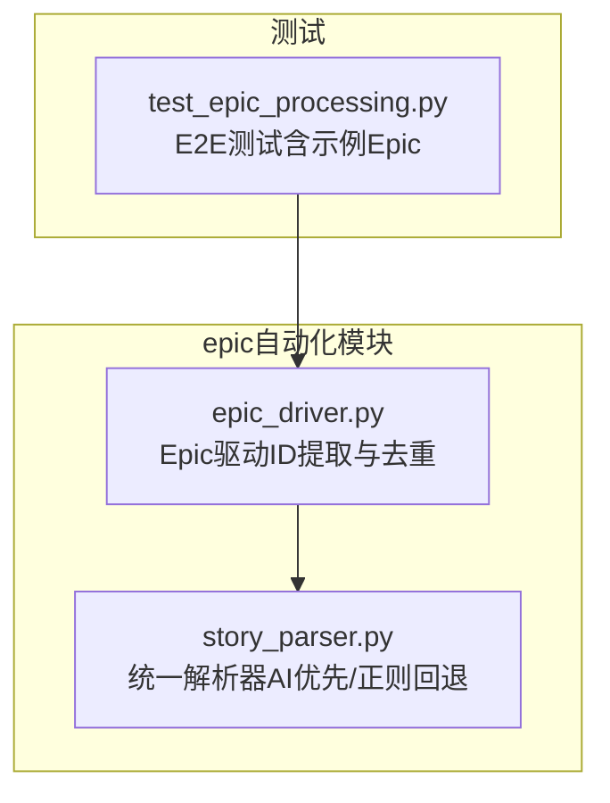
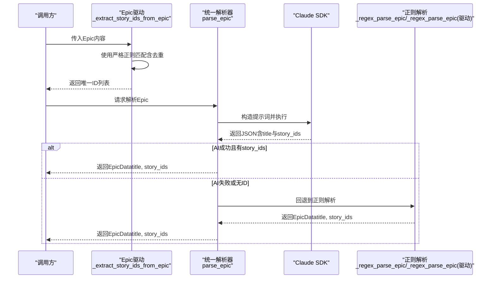
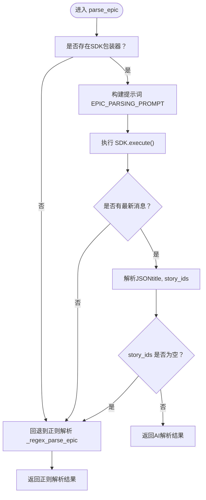
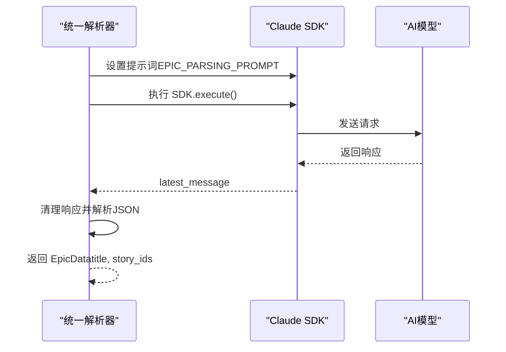
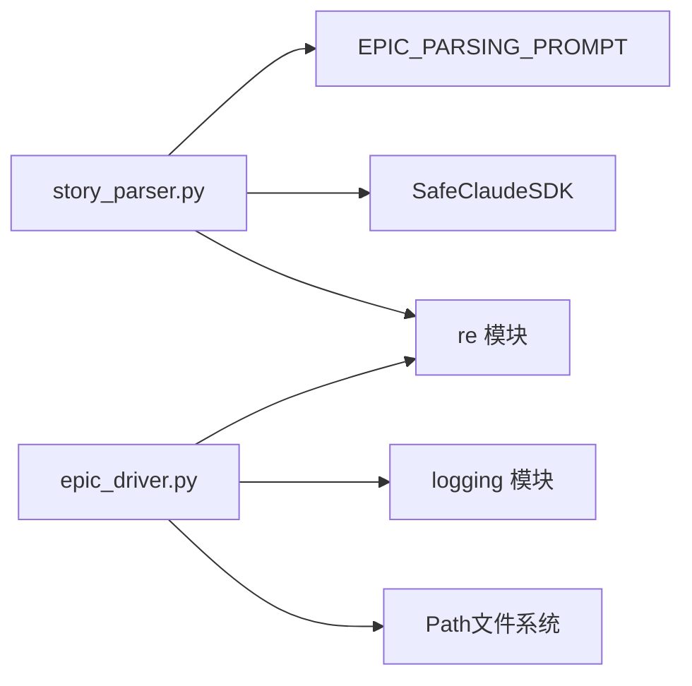

# 故事ID提取

<cite>
**本文引用的文件**
- [story_parser.py](file://autoBMAD/epic_automation/story_parser.py)
- [epic_driver.py](file://autoBMAD/epic_automation/epic_driver.py)
- [test_epic_processing.py](file://tests-copy/e2e/test_epic_processing.py)
</cite>

## 目录
1. [引言](#引言)
2. [项目结构](#项目结构)
3. [核心组件](#核心组件)
4. [架构总览](#架构总览)
5. [详细组件分析](#详细组件分析)
6. [依赖关系分析](#依赖关系分析)
7. [性能考量](#性能考量)
8. [故障排查指南](#故障排查指南)
9. [结论](#结论)

## 引言
本章节聚焦“故事ID提取”机制，围绕两个关键目标展开：
- 解释如何从Epic文档中识别两种匹配模式：“### Story X.Y: Title”与“**Story ID**: X.Y”，并说明对应的正则表达式工作原理、捕获组使用与多行模式匹配。
- 描述AI优先解析策略如何通过提示词引导Claude SDK进行语义理解；当AI解析失败时如何回退到正则表达式解析，并解释正则解析如何保证提取结果的唯一性与原始格式保持。

## 项目结构
本次文档涉及的核心文件位于自动化的epic自动化模块中，分别承担“AI优先解析”和“正则回退解析”的职责：
- 自动化解析器：负责统一入口、AI优先策略与正则回退，位于 [story_parser.py](file://autoBMAD/epic_automation/story_parser.py)。
- 驱动层提取：负责在驱动流程中从Epic文档提取故事ID并去重，位于 [epic_driver.py](file://autoBMAD/epic_automation/epic_driver.py)。
- 端到端测试：提供包含两种匹配模式的示例Epic文档，便于验证解析行为，位于 [test_epic_processing.py](file://tests-copy/e2e/test_epic_processing.py)。



图表来源
- [story_parser.py](file://autoBMAD/epic_automation/story_parser.py#L673-L765)
- [epic_driver.py](file://autoBMAD/epic_automation/epic_driver.py#L874-L962)
- [test_epic_processing.py](file://tests-copy/e2e/test_epic_processing.py#L45-L63)

章节来源
- [story_parser.py](file://autoBMAD/epic_automation/story_parser.py#L673-L765)
- [epic_driver.py](file://autoBMAD/epic_automation/epic_driver.py#L874-L962)
- [test_epic_processing.py](file://tests-copy/e2e/test_epic_processing.py#L45-L63)

## 核心组件
- 统一解析器（AI优先/正则回退）：在 [story_parser.py](file://autoBMAD/epic_automation/story_parser.py) 中，提供 parse_epic 方法，采用“AI优先、正则回退”的策略，通过提示词模板引导Claude SDK进行语义理解，若失败则回落到正则表达式解析。
- Epic驱动（ID提取与去重）：在 [epic_driver.py](file://autoBMAD/epic_automation/epic_driver.py) 中，提供 _extract_story_ids_from_epic 方法，使用更严格的正则匹配与去重策略，确保输出唯一且保留原始格式。

章节来源
- [story_parser.py](file://autoBMAD/epic_automation/story_parser.py#L673-L765)
- [epic_driver.py](file://autoBMAD/epic_automation/epic_driver.py#L874-L962)

## 架构总览
下图展示了从Epic文档到最终唯一故事ID列表的两条路径：AI优先与正则回退。



图表来源
- [epic_driver.py](file://autoBMAD/epic_automation/epic_driver.py#L874-L962)
- [story_parser.py](file://autoBMAD/epic_automation/story_parser.py#L673-L765)

## 详细组件分析

### 组件A：统一解析器（AI优先/正则回退）
该组件负责Epic解析的统一入口，策略为“AI优先、正则回退”。其关键点如下：
- 提示词模板：通过 EPIC_PARSING_PROMPT 明确提取规则，要求从“### Story X.Y: Title”与“**Story ID**: X.Y”两类格式中提取X.Y，并返回所有唯一的故事ID，保持原始格式。
- AI解析流程：构造提示词，调用 SDK 执行，从最新消息中解析JSON，提取 title 与 story_ids。
- 正则回退流程：当AI失败或返回空ID时，使用 _regex_parse_epic 进行正则解析，提取标题与故事ID列表。



图表来源
- [story_parser.py](file://autoBMAD/epic_automation/story_parser.py#L673-L765)

章节来源
- [story_parser.py](file://autoBMAD/epic_automation/story_parser.py#L191-L205)
- [story_parser.py](file://autoBMAD/epic_automation/story_parser.py#L673-L765)

### 组件B：Epic驱动（ID提取与去重）
该组件在驱动层直接从Epic文档中提取故事ID，并进行严格去重与格式保持：
- 匹配模式：
  - “### Story X.Y: Title”：使用正则 r"### Story\s+(\d+(?:\.\d+)?)\s*:\s*(.+?)(?:\n|\$)"，捕获组1为X.Y，捕获组2为Title；通过findall返回元组列表，再拼接为“X.Y: Title”形式。
  - “**Story ID**: 004.1”：使用正则 r"\*\*Story ID\*\*\s*:\s*(\d+(?:\.\d+)?)”，捕获组为X.Y，直接追加到列表。
- 去重与格式保持：
  - 先收集所有匹配到的ID（可能包含纯数字与带标题两种形式），随后遍历去重。
  - 去重策略：对每个ID提取“故事编号部分”，进行规范化比较（去除前导零仅针对整数部分，保留小数点后格式），同一编号优先保留“带标题”的完整形式，否则保留首次出现的原始格式。
  - 规范化比较：将“004.1”与“1”等编号归一为“4.1”“1”进行比较，从而识别重复。

```mermaid
flowchart TD
S(["进入 _extract_story_ids_from_epic"]) --> P1["匹配模式1：<br/>r\"### Story\\s+(\\d+(?:\\.\\d+)?)\\s*:\\s*(.+?)(?:\\n|\\$)\""]
P1 --> M1["收集匹配元组编号, 标题"]
M1 --> Join1["拼接为 \"编号: 标题\" 形式"]
S --> P2["匹配模式2：<br/>r\"\\*\\*Story ID\\*\\*\\s*:\\s*(\\d+(?:\\.\\d+)?))\""]
P2 --> M2["收集匹配编号"]
M2 --> Dedup["去重与规范化比较"]
Join1 --> Merge["合并两批ID"]
Merge --> Dedup
Dedup --> KeepTitle{"同一编号是否已有标题版本？"}
KeepTitle --> |是| PreferTitle["保留带标题版本"]
KeepTitle --> |否| KeepFirst["保留首次出现版本"]
PreferTitle --> Out["输出唯一ID列表"]
KeepFirst --> Out
```

图表来源
- [epic_driver.py](file://autoBMAD/epic_automation/epic_driver.py#L874-L962)

章节来源
- [epic_driver.py](file://autoBMAD/epic_automation/epic_driver.py#L874-L962)

### 正则表达式详解与捕获组使用
- 模式1：r"### Story\s+(\d+(?:\.\d+)?)\s*:\s*(.+?)(?:\n|\$)"
  - 捕获组1：编号（X.Y），支持整数与小数格式。
  - 捕获组2：标题（Title），非贪婪匹配，避免跨段落误吞。
  - 多行模式：配合 re.MULTILINE，使 ^ 与 $ 在每行生效，提升鲁棒性。
  - 结果处理：将捕获组拼接为“编号: 标题”形式，便于后续去重时优先保留完整信息。
- 模式2：r"\*\*Story ID\*\*\s*:\s*(\d+(?:\.\d+)?)" 
  - 捕获组：编号（X.Y），同样支持整数与小数格式。
  - 多行模式：同上。
  - 去重策略：若与“编号: 标题”重复，则优先保留带标题版本。

章节来源
- [epic_driver.py](file://autoBMAD/epic_automation/epic_driver.py#L890-L907)
- [epic_driver.py](file://autoBMAD/epic_automation/epic_driver.py#L914-L960)

### AI优先解析策略与提示词引导
- 提示词模板 EPIC_PARSING_PROMPT 明确要求：
  - 从“### Story X.Y: Title”与“**Story ID**: X.Y”两类格式提取X.Y；
  - 返回所有唯一的故事ID，保持原始格式（如“001.1”或“1.1”）。
- 执行流程：
  - 构造提示词并设置到SDK；
  - 执行 SDK.execute()；
  - 从 message_tracker.latest_message 获取最新消息；
  - 清理并解析JSON，提取 title 与 story_ids；
  - 若返回的 story_ids 非空，则直接返回；否则回退到正则解析。



图表来源
- [story_parser.py](file://autoBMAD/epic_automation/story_parser.py#L673-L765)

章节来源
- [story_parser.py](file://autoBMAD/epic_automation/story_parser.py#L191-L205)
- [story_parser.py](file://autoBMAD/epic_automation/story_parser.py#L673-L765)

### 实际代码示例（路径引用）
- AI优先解析入口与回退逻辑：[story_parser.py](file://autoBMAD/epic_automation/story_parser.py#L673-L765)
- 正则解析（统一解析器）：[story_parser.py](file://autoBMAD/epic_automation/story_parser.py#L740-L764)
- 驱动层严格正则与去重：[epic_driver.py](file://autoBMAD/epic_automation/epic_driver.py#L874-L962)
- 示例Epic文档（包含两种匹配模式）：[test_epic_processing.py](file://tests-copy/e2e/test_epic_processing.py#L45-L63)

章节来源
- [story_parser.py](file://autoBMAD/epic_automation/story_parser.py#L673-L765)
- [story_parser.py](file://autoBMAD/epic_automation/story_parser.py#L740-L764)
- [epic_driver.py](file://autoBMAD/epic_automation/epic_driver.py#L874-L962)
- [test_epic_processing.py](file://tests-copy/e2e/test_epic_processing.py#L45-L63)

## 依赖关系分析
- 统一解析器依赖：
  - 提示词模板 EPIC_PARSING_PROMPT；
  - SDK包装器（SafeClaudeSDK）用于AI解析；
  - 正则模块 re 用于回退解析。
- Epic驱动依赖：
  - 正则模块 re；
  - 日志模块 logging；
  - 文件系统路径 Path（用于故事文件匹配）。



图表来源
- [story_parser.py](file://autoBMAD/epic_automation/story_parser.py#L191-L205)
- [epic_driver.py](file://autoBMAD/epic_automation/epic_driver.py#L874-L962)

章节来源
- [story_parser.py](file://autoBMAD/epic_automation/story_parser.py#L191-L205)
- [epic_driver.py](file://autoBMAD/epic_automation/epic_driver.py#L874-L962)

## 性能考量
- 正则匹配复杂度：两次findall操作，时间复杂度近似 O(N)，其中N为文档长度；去重与规范化比较为线性扫描，整体仍为线性级别。
- AI解析成本：受SDK执行时间影响，建议在批量处理时控制并发与提示词长度，避免超时。
- 去重策略：通过规范化比较与优先保留带标题版本，减少重复数据，提高下游匹配效率。

[本节为通用性能讨论，无需特定文件引用]

## 故障排查指南
- AI解析失败或返回空ID：
  - 统一解析器会记录警告并回退到正则解析。检查提示词是否过长、SDK连接是否异常、响应是否包含JSON块。
  - 参考路径：[story_parser.py](file://autoBMAD/epic_automation/story_parser.py#L673-L765)
- 正则匹配不到ID：
  - 确认Epic文档格式是否符合“### Story X.Y: Title”或“**Story ID**: X.Y”；
  - 检查大小写、标点与空白字符是否一致；
  - 参考路径：[epic_driver.py](file://autoBMAD/epic_automation/epic_driver.py#L874-L962)
- 去重结果不符合预期：
  - 核对编号规范化逻辑（仅去除整数部分前导零，保留小数点后格式）；
  - 确认同一编号是否同时出现“纯数字”与“带标题”两种形式；
  - 参考路径：[epic_driver.py](file://autoBMAD/epic_automation/epic_driver.py#L914-L960)

章节来源
- [story_parser.py](file://autoBMAD/epic_automation/story_parser.py#L673-L765)
- [epic_driver.py](file://autoBMAD/epic_automation/epic_driver.py#L874-L962)

## 结论
- 两种解析路径互补：AI优先解析具备更强的语义理解能力，适合复杂文档；正则回退解析稳定可靠，适合作为兜底策略。
- 针对“### Story X.Y: Title”与“**Story ID**: X.Y”两类模式，统一解析器与驱动层均提供了清晰的正则匹配与去重策略，确保输出唯一且保留原始格式。
- 在工程实践中，建议优先启用AI解析，同时保留正则回退，以应对不同格式与边界情况，保障稳定性与一致性。