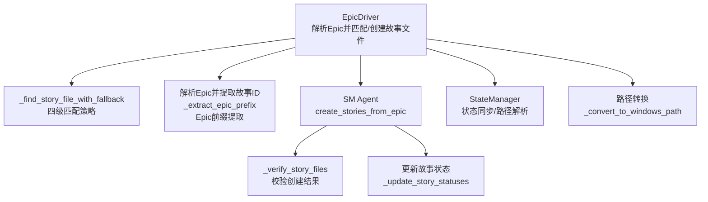
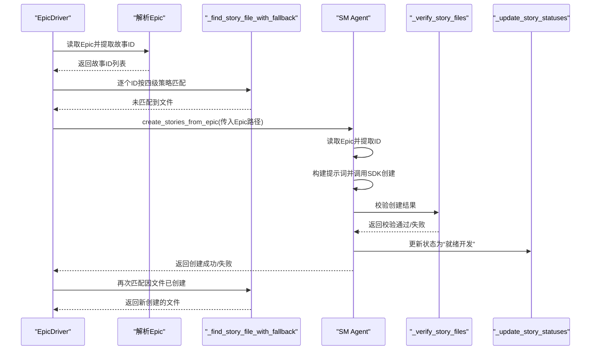
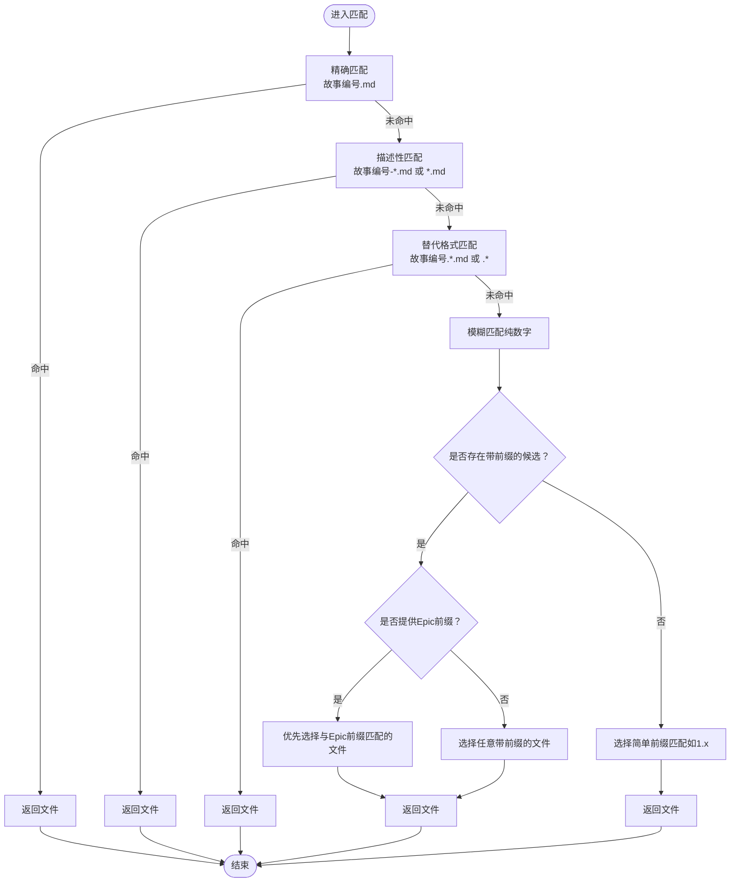
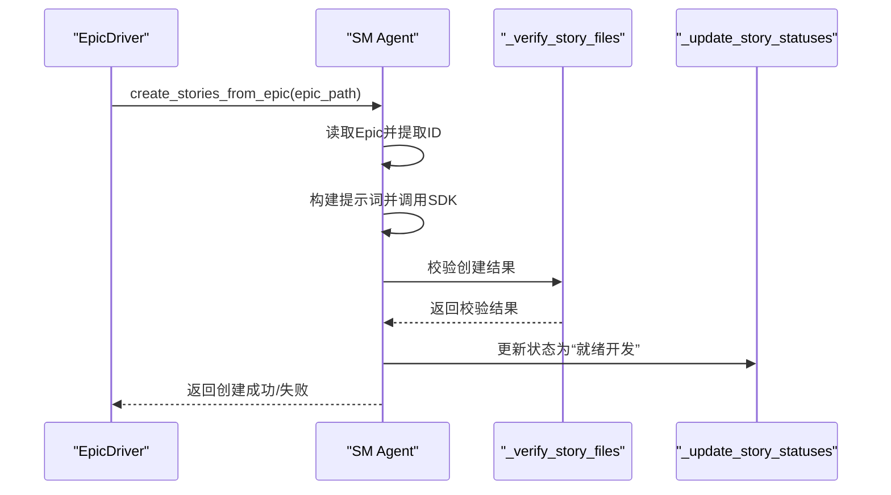
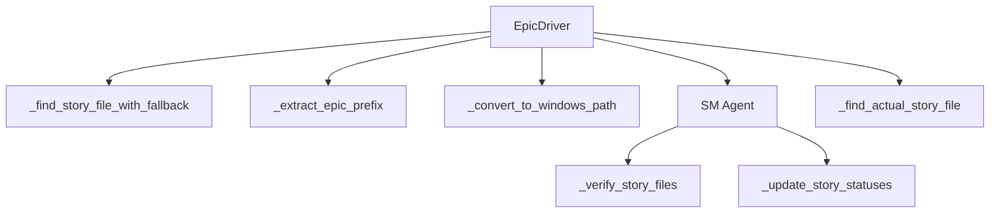

# 故事文件匹配

<cite>
**本文引用的文件**
- [epic_driver.py](file://autoBMAD/epic_automation/epic_driver.py)
- [sm_agent.py](file://autoBMAD/epic_automation/sm_agent.py)
- [state_manager.py](file://autoBMAD/epic_automation/state_manager.py)
- [test_sm_agent.py](file://tests-copy/unit/test_sm_agent.py)
- [WINDOWS_PATH_CONVERSION_SUMMARY.md](file://WINDOWS_PATH_CONVERSION_SUMMARY.md)
</cite>

## 目录
1. [简介](#简介)
2. [项目结构](#项目结构)
3. [核心组件](#核心组件)
4. [架构总览](#架构总览)
5. [详细组件分析](#详细组件分析)
6. [依赖关系分析](#依赖关系分析)
7. [性能考量](#性能考量)
8. [故障排查指南](#故障排查指南)
9. [结论](#结论)

## 简介
本文聚焦于“故事文件匹配”机制，系统性阐述 Epic 驱动器如何通过四级匹配策略定位或自动创建缺失的故事文件，并详解 Epic 前缀提取与模糊匹配的协同优化。重点覆盖：
- 第一级：精确匹配（如“004.1.md”）
- 第二级：描述性匹配（如“004.1-故事标题.md”）
- 第三级：替代格式匹配（如“004.1.description.md”）
- 第四级：模糊匹配（基于 Epic 前缀的智能匹配）

同时说明当所有匹配策略均失败时，系统如何借助 SM Agent 的“从 Epic 创建故事”能力自动补齐缺失文件，并给出流程图与调用序列图帮助理解。

## 项目结构
围绕“故事文件匹配”的关键文件与职责如下：
- epic_driver.py：负责解析 Epic、抽取故事 ID、定位/创建故事文件、执行阶段推进
- sm_agent.py：负责从 Epic 生成故事文件、校验与状态更新
- state_manager.py：负责状态同步与故事文件实际路径解析（辅助匹配）
- test_sm_agent.py：单元测试，验证 SM Agent 的创建与校验流程
- WINDOWS_PATH_CONVERSION_SUMMARY.md：路径转换工具说明，确保在不同平台下路径一致

图表来源
- [epic_driver.py](file://autoBMAD/epic_automation/epic_driver.py#L705-L959)
- [sm_agent.py](file://autoBMAD/epic_automation/sm_agent.py#L264-L366)
- [state_manager.py](file://autoBMAD/epic_automation/state_manager.py#L800-L866)

章节来源
- [epic_driver.py](file://autoBMAD/epic_automation/epic_driver.py#L705-L959)
- [sm_agent.py](file://autoBMAD/epic_automation/sm_agent.py#L264-L366)
- [state_manager.py](file://autoBMAD/epic_automation/state_manager.py#L800-L866)
- [WINDOWS_PATH_CONVERSION_SUMMARY.md](file://WINDOWS_PATH_CONVERSION_SUMMARY.md#L1-L51)

## 核心组件
- EpicDriver：主控流程，负责：
  - 从 Epic 文档中提取故事 ID（含规范化与去重）
  - 计算 Epic 前缀（如 epic-004-xxx.md → “004”），用于第四级模糊匹配的优先选择
  - 在 docs/stories 目录中按四级策略匹配故事文件；若失败则调用 SM Agent 自动创建
  - 对 Windows 环境进行路径转换，保证提示词注入稳定
- SMAgent：负责：
  - 从 Epic 提取故事 ID 列表
  - 调用外部 SDK 创建缺失的故事文件
  - 校验创建结果并更新状态为“就绪开发”
- StateManager：负责：
  - 将数据库记录映射到实际存在的故事文件（辅助匹配）
  - 处理文件名差异（如“.”与“-”互换）与数字前缀匹配

章节来源
- [epic_driver.py](file://autoBMAD/epic_automation/epic_driver.py#L705-L959)
- [sm_agent.py](file://autoBMAD/epic_automation/sm_agent.py#L264-L366)
- [state_manager.py](file://autoBMAD/epic_automation/state_manager.py#L800-L866)

## 架构总览
下面的序列图展示了“当所有匹配策略失败时，系统如何自动创建缺失故事文件”的完整流程。

图表来源
- [epic_driver.py](file://autoBMAD/epic_automation/epic_driver.py#L760-L838)
- [sm_agent.py](file://autoBMAD/epic_automation/sm_agent.py#L264-L366)
- [test_sm_agent.py](file://tests-copy/unit/test_sm_agent.py#L312-L333)

## 详细组件分析

### 四级匹配策略：_find_story_file_with_fallback
该函数在 docs/stories 目录中按优先级尝试四种模式，最终返回命中的文件或 None。其核心逻辑如下：
- 第一级：精确匹配
  - 直接以“故事编号.md”形式查找
- 第二级：描述性匹配
  - 支持“故事编号-描述.md”或“描述-故事编号.md”等变体
- 第三级：替代格式匹配
  - 支持“故事编号.*.md”等替代扩展名格式
- 第四级：模糊匹配（含 Epic 前缀优化）
  - 若故事编号为纯数字，尝试“以该数字开头”的文件（如“1”匹配“004.1”）
  - 优先考虑带有 Epic 前缀的文件（如“story-004.1”），提升准确性
  - 同时兼容“story-XXX.1.”或“XXX.1-”等包含前缀的变体

图表来源
- [epic_driver.py](file://autoBMAD/epic_automation/epic_driver.py#L1012-L1111)

章节来源
- [epic_driver.py](file://autoBMAD/epic_automation/epic_driver.py#L1012-L1111)

### Epic 前缀提取：_extract_epic_prefix
- 功能：从 Epic 文件名中提取前缀（如 epic-004-xxx.md → “004”）
- 用途：在第四级模糊匹配中，优先选择与 Epic 前缀一致的候选文件，提高匹配准确率
- 行为：匹配形如“epic-004-”或“epic-004.”的模式，返回数字前缀

章节来源
- [epic_driver.py](file://autoBMAD/epic_automation/epic_driver.py#L996-L1011)

### 从 Epic 自动创建故事：create_stories_from_epic
- 触发条件：当某故事 ID 无法通过任何匹配策略找到对应文件，且该 ID 不在现有文件集合中时，系统会调用 SM Agent
- 主要步骤：
  - 读取 Epic 内容并提取故事 ID 列表
  - 预检查：若所有文件均已存在则跳过创建
  - 构建提示词并调用 SDK 创建缺失文件
  - 校验创建结果（长度、关键段落存在性）
  - 更新状态为“就绪开发”

图表来源
- [epic_driver.py](file://autoBMAD/epic_automation/epic_driver.py#L792-L833)
- [sm_agent.py](file://autoBMAD/epic_automation/sm_agent.py#L264-L366)

章节来源
- [epic_driver.py](file://autoBMAD/epic_automation/epic_driver.py#L792-L833)
- [sm_agent.py](file://autoBMAD/epic_automation/sm_agent.py#L264-L366)
- [test_sm_agent.py](file://tests-copy/unit/test_sm_agent.py#L312-L333)

### 路径转换：_convert_to_windows_path
- 作用：在 Windows 环境下将 Unix 风格路径转换为 Windows 绝对路径，避免提示词注入时路径错误
- 应用点：在 EpicDriver 中对已找到或新创建的 story 路径进行转换

章节来源
- [epic_driver.py](file://autoBMAD/epic_automation/epic_driver.py#L964-L995)
- [WINDOWS_PATH_CONVERSION_SUMMARY.md](file://WINDOWS_PATH_CONVERSION_SUMMARY.md#L1-L51)

### 辅助匹配：StateManager 的实际文件解析
- 当数据库记录与实际文件名存在差异（如“.”与“-”互换）时，StateManager 会尝试在 stories 目录中按数字前缀匹配，辅助定位真实文件
- 该能力与 EpicDriver 的模糊匹配形成互补，降低文件命名差异导致的误判

章节来源
- [state_manager.py](file://autoBMAD/epic_automation/state_manager.py#L800-L866)

## 依赖关系分析
- EpicDriver 依赖：
  - _find_story_file_with_fallback：四级匹配
  - _extract_epic_prefix：Epic 前缀提取
  - _convert_to_windows_path：路径转换
  - sm_agent.create_stories_from_epic：自动创建缺失文件
  - state_manager._find_actual_story_file：辅助解析实际文件
- SMAgent 依赖：
  - SDK 会话管理器：隔离 SDK 调用，避免取消传播
  - SimpleStoryParser：状态解析与更新

图表来源
- [epic_driver.py](file://autoBMAD/epic_automation/epic_driver.py#L705-L959)
- [sm_agent.py](file://autoBMAD/epic_automation/sm_agent.py#L264-L366)
- [state_manager.py](file://autoBMAD/epic_automation/state_manager.py#L800-L866)

章节来源
- [epic_driver.py](file://autoBMAD/epic_automation/epic_driver.py#L705-L959)
- [sm_agent.py](file://autoBMAD/epic_automation/sm_agent.py#L264-L366)
- [state_manager.py](file://autoBMAD/epic_automation/state_manager.py#L800-L866)

## 性能考量
- 匹配复杂度
  - 精确/描述性/替代格式匹配：O(N) 遍历目录，N 为 .md 文件数量
  - 模糊匹配：在纯数字场景下需遍历目录并进行字符串/正则匹配，最坏 O(N)
  - Epic 前缀优化：在候选集上做一次过滤，常数级开销
- I/O 与缓存
  - 目录扫描与文件读取为瓶颈，建议在 CI 环境中预热目录索引或减少重复扫描
- SDK 调用
  - SM Agent 的 SDK 调用受外部服务影响，应结合超时与重试策略（当前实现依赖 SDK 会话管理器）

## 故障排查指南
- 匹配不到文件
  - 检查 docs/stories 目录是否存在以及权限
  - 确认故事编号格式是否符合预期（如“004.1” vs “1”）
  - 若为纯数字，确认 Epic 前缀是否正确提取（如 epic-004-xxx.md）
- 自动创建失败
  - 确认 SDK 可用性与权限设置
  - 校验 Epic 内容中是否存在有效的故事 ID
  - 使用 _verify_story_files 校验创建结果（长度、关键段落）
- 路径问题（Windows）
  - 确保使用 _convert_to_windows_path 对路径进行转换
  - 检查提示词注入时的路径格式

章节来源
- [epic_driver.py](file://autoBMAD/epic_automation/epic_driver.py#L792-L833)
- [sm_agent.py](file://autoBMAD/epic_automation/sm_agent.py#L526-L620)
- [WINDOWS_PATH_CONVERSION_SUMMARY.md](file://WINDOWS_PATH_CONVERSION_SUMMARY.md#L1-L51)

## 结论
该匹配机制通过四级策略与 Epic 前缀优化，显著提升了在多样化命名与跨平台环境下对故事文件的识别能力；当匹配失败时，系统可自动从 Epic 生成缺失文件并完成状态更新，形成闭环。建议在团队规范中统一故事文件命名约定，并在 CI 中启用 SDK 调用与路径转换，以获得最佳稳定性与一致性。