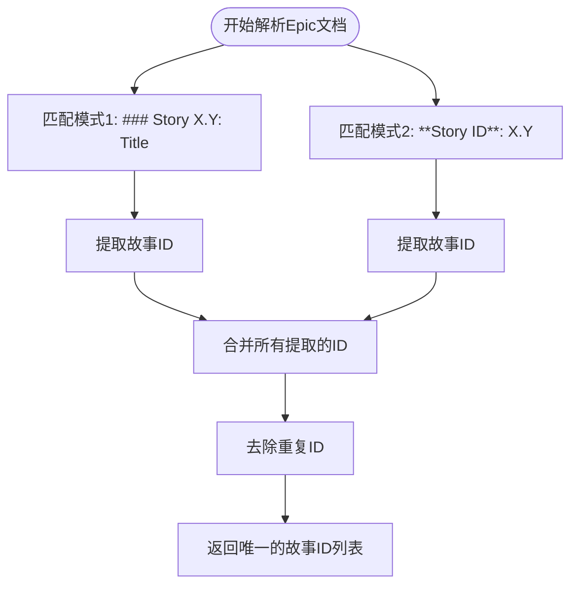
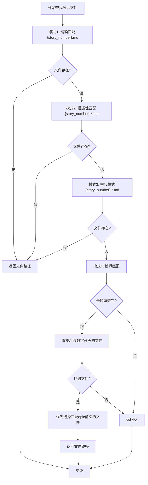

# 故事解析

<cite>
**本文档引用的文件**   
- [story_parser.py](file://autoBMAD/epic_automation/story_parser.py)
- [epic_driver.py](file://autoBMAD/epic_automation/epic_driver.py)
- [sm_agent.py](file://autoBMAD/epic_automation/sm_agent.py)
- [STATUS_IMPLEMENTATION.md](file://autoBMAD/epic_automation/STATUS_IMPLEMENTATION.md)
</cite>

## 目录
1. [引言](#引言)
2. [核心解析函数](#核心解析函数)
3. [故事ID提取机制](#故事id提取机制)
4. [故事文件定位逻辑](#故事文件定位逻辑)
5. [状态标准化过程](#状态标准化过程)
6. [自动创建机制](#自动创建机制)
7. [结论](#结论)

## 引言
故事解析机制是自动化工作流中的关键组件，负责从Epic文档中提取故事ID、定位故事文件并解析状态信息。该机制采用AI优先、正则回退的策略，确保解析的准确性和鲁棒性。本文档深入分析`parse_epic`函数及其相关辅助函数，详细解释故事ID提取、文件匹配、状态标准化和自动创建等核心功能。

## 核心解析函数
`parse_epic`函数是故事解析机制的入口点，负责解析Epic文档并提取其中包含的故事ID列表。该函数采用AI优先的解析策略，首先尝试使用Claude SDK进行智能语义理解，若AI解析失败或不可用，则回退到正则表达式进行模式匹配。

**解析策略**:
- **AI优先**: 利用Claude SDK的语义理解能力，从Epic文档中提取故事ID
- **正则回退**: 当AI解析失败时，使用预定义的正则表达式模式进行匹配
- **结果验证**: 确保提取的故事ID列表不为空，否则返回空列表

此设计遵循奥卡姆剃刀原则，将分散在多个模块中的解析逻辑统一到单一入口，提高了代码的可维护性和一致性。

**Section sources**
- [story_parser.py](file://autoBMAD/epic_automation/story_parser.py#L673-L693)

## 故事ID提取机制
故事ID提取由`_extract_story_ids_from_epic`函数实现，该函数通过两种主要模式从Epic文档中识别和提取故事ID。

### 匹配模式一：### Story X.Y: Title
此模式匹配以三级标题形式定义的故事，格式为`### Story X.Y: Title`，其中X.Y是故事ID。正则表达式`r"###\s+Story\s+(\d+(?:\.\d+)?)\s*:"`用于提取ID部分。

### 匹配模式二：**Story ID**: 004.1
此模式匹配以加粗文本定义的故事ID，格式为`**Story ID**: X.Y`。正则表达式`r"\*\*Story ID\*\*\s*:\s*(\d+(?:\.\d+)?)`用于提取ID。

**Diagram sources **
- [story_parser.py](file://autoBMAD/epic_automation/story_parser.py#L751-L762)

**Section sources**
- [story_parser.py](file://autoBMAD/epic_automation/story_parser.py#L751-L762)
- [epic_driver.py](file://autoBMAD/epic_automation/epic_driver.py#L874-L962)

## 故事文件定位逻辑
故事文件定位由`_find_story_file_with_fallback`函数实现，该函数采用四级匹配逻辑来查找对应的故事文件。

### 四级匹配逻辑
1. **精确匹配**: 查找`{story_number}.md`格式的文件
2. **描述性匹配**: 查找`{story_number}-*.md`或`story-{story_number}-*.md`格式的文件
3. **替代格式**: 查找`{story_number}.*.md`或`story-{story_number}.*.md`格式的文件
4. **模糊匹配**: 对于简单的数字ID，查找以该数字开头的文件，如`004.1`或`1-description`

### Epic前缀提取
`_extract_epic_prefix`函数从Epic文件名中提取前缀（如`epic-004-`中的`004`），用于在模糊匹配时优先选择匹配Epic前缀的文件，提高匹配的准确性。

**Diagram sources **
- [epic_driver.py](file://autoBMAD/epic_automation/epic_driver.py#L1012-L1111)

**Section sources**
- [epic_driver.py](file://autoBMAD/epic_automation/epic_driver.py#L1012-L1111)

## 状态标准化过程
状态标准化由`_normalize_story_status`函数实现，该函数将各种状态变体映射为标准的核心状态值。

### 核心状态值
系统定义了7种标准核心状态值：
- Draft (草稿)
- Ready for Development (准备开发)
- In Progress (进行中)
 - Ready for Review (准备审查)
- Ready for Done (准备完成)
- Done (已完成)
- Failed (失败)

### 标准化流程
1. **输入验证**: 检查输入状态字符串的有效性
2. **模式匹配**: 使用正则表达式匹配各种状态变体
3. **映射转换**: 将匹配到的变体映射到标准核心状态值
4. **结果验证**: 确保返回的状态值在核心状态值集合中

该函数被多个模块广泛调用，包括`SimpleStoryParser`、`DevAgent`和`EpicDriver`，确保了状态解析的一致性。

**Section sources**
- [story_parser.py](file://autoBMAD/epic_automation/story_parser.py#L318-L361)
- [STATUS_IMPLEMENTATION.md](file://autoBMAD/epic_automation/STATUS_IMPLEMENTATION.md#L83)

## 自动创建机制
当故事文件不存在时，系统通过SM Agent自动创建缺失的故事文件。

### 创建流程
1. **检测缺失**: 在解析Epic时，若`_find_story_file_with_fallback`返回空，则判定文件缺失
2. **触发创建**: 调用`sm_agent.create_stories_from_epic`方法
3. **批量创建**: SM Agent根据Epic内容批量创建所有缺失的故事文件
4. **状态更新**: 将新创建的故事文件状态从"Draft"更新为"Ready for Development"

### 创建策略
- **幂等性**: 在创建前检查文件是否已存在，避免重复创建
- **批量处理**: 一次性创建所有缺失的故事文件，提高效率
- **验证机制**: 创建后验证文件内容的完整性，确保创建成功

此机制确保了工作流的连续性，即使部分故事文件缺失，系统也能自动修复并继续执行。

**Section sources**
- [epic_driver.py](file://autoBMAD/epic_automation/epic_driver.py#L792-L804)
- [sm_agent.py](file://autoBMAD/epic_automation/sm_agent.py#L264-L320)

## 结论
故事解析机制通过`parse_epic`函数实现了从Epic文档中提取故事ID的核心功能，结合`_extract_story_ids_from_epic`的双模式匹配、`_find_story_file_with_fallback`的四级定位逻辑和`_extract_epic_prefix`的前缀优化，构建了一个健壮的解析系统。状态标准化过程通过`_normalize_story_status`函数确保了状态值的一致性，而SM Agent的自动创建机制则保证了工作流的容错性和连续性。整体设计体现了AI优先、正则回退的现代解析策略，兼顾了智能性和可靠性。